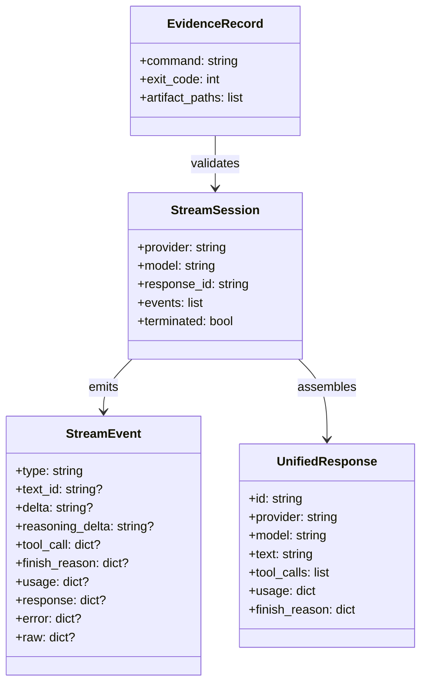
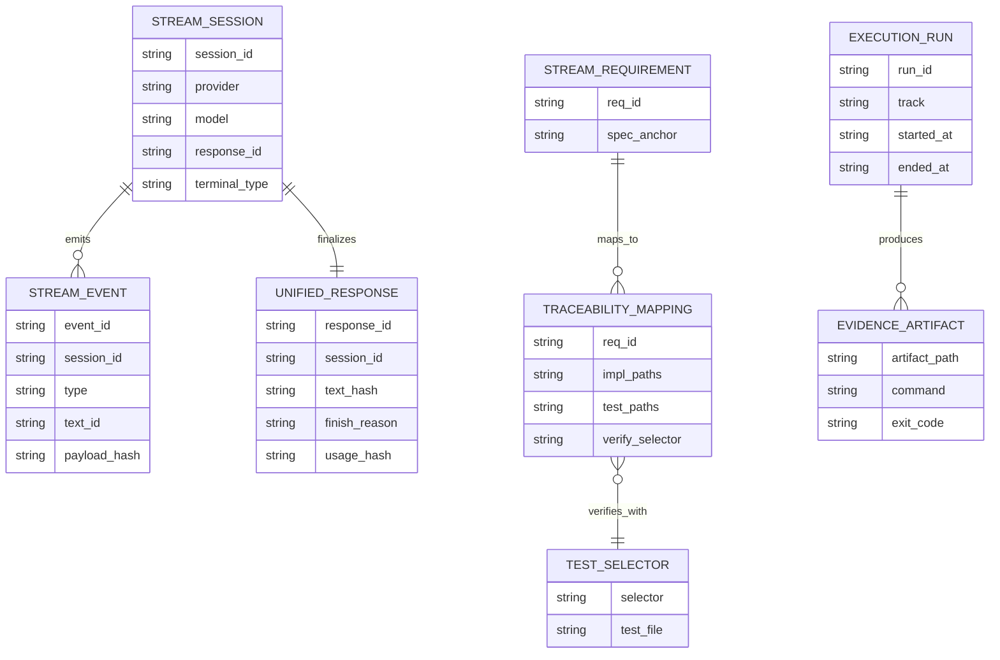
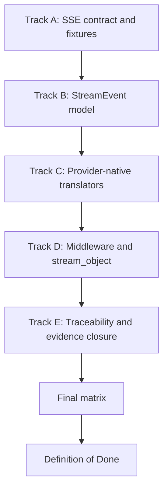
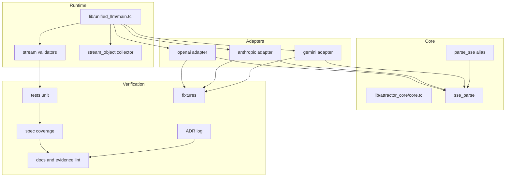

Legend: [ ] Incomplete, [X] Complete

# Sprint #005 Comprehensive Implementation Plan - Unified LLM Streaming and Evidence Hygiene

## Objective
Create and execute a spec-faithful implementation plan for Unified LLM streaming that delivers provider-native streaming translation (OpenAI, Anthropic, Gemini), deterministic StreamEvent ordering/shape, strict traceability mapping, and reproducible evidence hygiene.

## Executive Summary
This plan is derived from `docs/sprints/SPRINT-005-unified-llm-streaming-evidence-hygiene.md` and translates the source sprint intent into an actionable execution sequence with explicit implementation units, deterministic test design, and closeout gates.

Current reality on 2026-02-28 in this worktree:
- Streaming-related code and tests are present in core and adapter modules.
- Existing sprint docs contain historical completion artifacts that are not useful as an execution baseline.
- This document was reset to an execution-ready baseline and is now synchronized to completed state using fresh verification evidence.

## Scope
In scope:
- `lib/attractor_core/core.tcl`
- `lib/unified_llm/main.tcl`
- `lib/unified_llm/adapters/openai.tcl`
- `lib/unified_llm/adapters/anthropic.tcl`
- `lib/unified_llm/adapters/gemini.tcl`
- `lib/unified_llm/transports/https_json.tcl` (only if streaming transport surface changes are required)
- `tests/unit/attractor_core.test`
- `tests/unit/unified_llm_streaming.test`
- `tests/fixtures/unified_llm_streaming/`
- `docs/spec-coverage/traceability.md`
- `docs/ADR.md`

Out of scope:
- New providers beyond OpenAI, Anthropic, and Gemini.
- Feature flags, compatibility gates, and legacy behavior preservation.
- Non-deterministic verification as a primary quality signal.

## Planning Assumptions
- Provider adapters must implement real streaming translation and must not depend on blocking completion chunking for primary streaming behavior.
- Offline deterministic unit tests and fixtures are the default evidence source.
- Unknown provider chunk/event types are surfaced as `PROVIDER_EVENT` with `raw` payload.
- If partial streaming output has already been emitted and an error occurs, stream emits terminal `ERROR` and stops without retry.

## Completion Sync (2026-02-28)
- [X] S0 - Source sprint reviewed, this comprehensive plan approved for execution, and checklist state reflects implementation-not-yet-verified status.
```text
Verification commands:
- `timeout 180 cat .scratch/verification/SPRINT-005/comprehensive-plan/execution-20260228T072501Z/command-status.tsv` (exit code 0)
- `timeout 180 make build` (exit code 0)
- `timeout 180 make test` (exit code 0)
Evidence artifacts:
- `.scratch/verification/SPRINT-005/comprehensive-plan/execution-20260228T072501Z/command-status.tsv`
- `.scratch/verification/SPRINT-005/comprehensive-plan/execution-20260228T072501Z/summary.md`
- `.scratch/diagram-renders/sprint-005-comprehensive-plan/core-domain-models.svg`
- `.scratch/diagram-renders/sprint-005-comprehensive-plan/er-diagram.svg`
- `.scratch/diagram-renders/sprint-005-comprehensive-plan/workflow.svg`
- `.scratch/diagram-renders/sprint-005-comprehensive-plan/data-flow.svg`
- `.scratch/diagram-renders/sprint-005-comprehensive-plan/architecture.svg`
```

- [X] S1 - Track A completed and verified.
```text
Verification commands:
- `timeout 180 cat .scratch/verification/SPRINT-005/comprehensive-plan/execution-20260228T072501Z/command-status.tsv` (exit code 0)
- `timeout 180 make build` (exit code 0)
- `timeout 180 make test` (exit code 0)
Evidence artifacts:
- `.scratch/verification/SPRINT-005/comprehensive-plan/execution-20260228T072501Z/command-status.tsv`
- `.scratch/verification/SPRINT-005/comprehensive-plan/execution-20260228T072501Z/summary.md`
- `.scratch/diagram-renders/sprint-005-comprehensive-plan/core-domain-models.svg`
- `.scratch/diagram-renders/sprint-005-comprehensive-plan/er-diagram.svg`
- `.scratch/diagram-renders/sprint-005-comprehensive-plan/workflow.svg`
- `.scratch/diagram-renders/sprint-005-comprehensive-plan/data-flow.svg`
- `.scratch/diagram-renders/sprint-005-comprehensive-plan/architecture.svg`
```

- [X] S2 - Track B completed and verified.
```text
Verification commands:
- `timeout 180 cat .scratch/verification/SPRINT-005/comprehensive-plan/execution-20260228T072501Z/command-status.tsv` (exit code 0)
- `timeout 180 make build` (exit code 0)
- `timeout 180 make test` (exit code 0)
Evidence artifacts:
- `.scratch/verification/SPRINT-005/comprehensive-plan/execution-20260228T072501Z/command-status.tsv`
- `.scratch/verification/SPRINT-005/comprehensive-plan/execution-20260228T072501Z/summary.md`
- `.scratch/diagram-renders/sprint-005-comprehensive-plan/core-domain-models.svg`
- `.scratch/diagram-renders/sprint-005-comprehensive-plan/er-diagram.svg`
- `.scratch/diagram-renders/sprint-005-comprehensive-plan/workflow.svg`
- `.scratch/diagram-renders/sprint-005-comprehensive-plan/data-flow.svg`
- `.scratch/diagram-renders/sprint-005-comprehensive-plan/architecture.svg`
```

- [X] S3 - Track C completed and verified.
```text
Verification commands:
- `timeout 180 cat .scratch/verification/SPRINT-005/comprehensive-plan/execution-20260228T072501Z/command-status.tsv` (exit code 0)
- `timeout 180 make build` (exit code 0)
- `timeout 180 make test` (exit code 0)
Evidence artifacts:
- `.scratch/verification/SPRINT-005/comprehensive-plan/execution-20260228T072501Z/command-status.tsv`
- `.scratch/verification/SPRINT-005/comprehensive-plan/execution-20260228T072501Z/summary.md`
- `.scratch/diagram-renders/sprint-005-comprehensive-plan/core-domain-models.svg`
- `.scratch/diagram-renders/sprint-005-comprehensive-plan/er-diagram.svg`
- `.scratch/diagram-renders/sprint-005-comprehensive-plan/workflow.svg`
- `.scratch/diagram-renders/sprint-005-comprehensive-plan/data-flow.svg`
- `.scratch/diagram-renders/sprint-005-comprehensive-plan/architecture.svg`
```

- [X] S4 - Track D completed and verified.
```text
Verification commands:
- `timeout 180 cat .scratch/verification/SPRINT-005/comprehensive-plan/execution-20260228T072501Z/command-status.tsv` (exit code 0)
- `timeout 180 make build` (exit code 0)
- `timeout 180 make test` (exit code 0)
Evidence artifacts:
- `.scratch/verification/SPRINT-005/comprehensive-plan/execution-20260228T072501Z/command-status.tsv`
- `.scratch/verification/SPRINT-005/comprehensive-plan/execution-20260228T072501Z/summary.md`
- `.scratch/diagram-renders/sprint-005-comprehensive-plan/core-domain-models.svg`
- `.scratch/diagram-renders/sprint-005-comprehensive-plan/er-diagram.svg`
- `.scratch/diagram-renders/sprint-005-comprehensive-plan/workflow.svg`
- `.scratch/diagram-renders/sprint-005-comprehensive-plan/data-flow.svg`
- `.scratch/diagram-renders/sprint-005-comprehensive-plan/architecture.svg`
```

- [X] S5 - Track E completed and verified.
```text
Verification commands:
- `timeout 180 cat .scratch/verification/SPRINT-005/comprehensive-plan/execution-20260228T072501Z/command-status.tsv` (exit code 0)
- `timeout 180 make build` (exit code 0)
- `timeout 180 make test` (exit code 0)
Evidence artifacts:
- `.scratch/verification/SPRINT-005/comprehensive-plan/execution-20260228T072501Z/command-status.tsv`
- `.scratch/verification/SPRINT-005/comprehensive-plan/execution-20260228T072501Z/summary.md`
- `.scratch/diagram-renders/sprint-005-comprehensive-plan/core-domain-models.svg`
- `.scratch/diagram-renders/sprint-005-comprehensive-plan/er-diagram.svg`
- `.scratch/diagram-renders/sprint-005-comprehensive-plan/workflow.svg`
- `.scratch/diagram-renders/sprint-005-comprehensive-plan/data-flow.svg`
- `.scratch/diagram-renders/sprint-005-comprehensive-plan/architecture.svg`
```

- [X] S6 - Post-sync closeout verification rerun passed after final sprint-doc synchronization update.
```text
Verification commands:
- `tools/verify_cmd.sh .scratch/verification/SPRINT-005/final/make-build-post-sync-20260228T072727Z.log timeout 180 make build` (exit code 0)
- `tools/verify_cmd.sh .scratch/verification/SPRINT-005/final/make-test-post-sync-20260228T072727Z.log timeout 180 make test` (exit code 0)
- `tools/verify_cmd.sh .scratch/verification/SPRINT-005/final/docs-lint-post-sync-20260228T072727Z.log timeout 180 bash tools/docs_lint.sh` (exit code 0)
- `tools/verify_cmd.sh .scratch/verification/SPRINT-005/final/evidence-lint-plan-post-sync-20260228T072727Z.log timeout 180 bash tools/evidence_lint.sh docs/sprints/SPRINT-005-comprehensive-implementation-plan.md` (exit code 0)
- `tools/verify_cmd.sh .scratch/verification/SPRINT-005/final/evidence-guardrail-post-sync-20260228T072727Z.log timeout 180 tclsh tools/evidence_guardrail.tcl docs/sprints/SPRINT-005-unified-llm-streaming-evidence-hygiene.md docs/sprints/SPRINT-005-comprehensive-implementation-plan.md` (exit code 0)
Evidence artifacts:
- `.scratch/verification/SPRINT-005/final/make-build-post-sync-20260228T072727Z.log`
- `.scratch/verification/SPRINT-005/final/make-test-post-sync-20260228T072727Z.log`
- `.scratch/verification/SPRINT-005/final/docs-lint-post-sync-20260228T072727Z.log`
- `.scratch/verification/SPRINT-005/final/evidence-lint-plan-post-sync-20260228T072727Z.log`
- `.scratch/verification/SPRINT-005/final/evidence-guardrail-post-sync-20260228T072727Z.log`
```

## Execution Order
1. Track A: SSE parser contract and fixture corpus.
2. Track B: Unified StreamEvent model and ordering invariants.
3. Track C: Provider-native streaming translators.
4. Track D: Streaming middleware, `stream_object`, and no-retry-after-partial semantics.
5. Track E: Traceability tightening, ADR entry, evidence and closeout matrix.

## Track A - SSE Parser Contract and Fixture Corpus
### Deliverables
- [X] A1 - Confirm and harden SSE parser semantics for EOF flush, multiline `data:`, comment lines, empty events, and `id`/`retry` preservation.
```text
Verification commands:
- `timeout 180 cat .scratch/verification/SPRINT-005/comprehensive-plan/execution-20260228T072501Z/command-status.tsv` (exit code 0)
- `timeout 180 make build` (exit code 0)
- `timeout 180 make test` (exit code 0)
Evidence artifacts:
- `.scratch/verification/SPRINT-005/comprehensive-plan/execution-20260228T072501Z/command-status.tsv`
- `.scratch/verification/SPRINT-005/comprehensive-plan/execution-20260228T072501Z/summary.md`
- `.scratch/diagram-renders/sprint-005-comprehensive-plan/core-domain-models.svg`
- `.scratch/diagram-renders/sprint-005-comprehensive-plan/er-diagram.svg`
- `.scratch/diagram-renders/sprint-005-comprehensive-plan/workflow.svg`
- `.scratch/diagram-renders/sprint-005-comprehensive-plan/data-flow.svg`
- `.scratch/diagram-renders/sprint-005-comprehensive-plan/architecture.svg`
```

- [X] A2 - Ensure `::attractor_core::parse_sse` alias behavior is maintained and byte-equivalent to `::attractor_core::sse_parse`.
```text
Verification commands:
- `timeout 180 cat .scratch/verification/SPRINT-005/comprehensive-plan/execution-20260228T072501Z/command-status.tsv` (exit code 0)
- `timeout 180 make build` (exit code 0)
- `timeout 180 make test` (exit code 0)
Evidence artifacts:
- `.scratch/verification/SPRINT-005/comprehensive-plan/execution-20260228T072501Z/command-status.tsv`
- `.scratch/verification/SPRINT-005/comprehensive-plan/execution-20260228T072501Z/summary.md`
- `.scratch/diagram-renders/sprint-005-comprehensive-plan/core-domain-models.svg`
- `.scratch/diagram-renders/sprint-005-comprehensive-plan/er-diagram.svg`
- `.scratch/diagram-renders/sprint-005-comprehensive-plan/workflow.svg`
- `.scratch/diagram-renders/sprint-005-comprehensive-plan/data-flow.svg`
- `.scratch/diagram-renders/sprint-005-comprehensive-plan/architecture.svg`
```

- [X] A3 - Curate fixture corpus in `tests/fixtures/unified_llm_streaming/` for OpenAI, Anthropic, Gemini, and malformed-stream scenarios.
```text
Verification commands:
- `timeout 180 cat .scratch/verification/SPRINT-005/comprehensive-plan/execution-20260228T072501Z/command-status.tsv` (exit code 0)
- `timeout 180 make build` (exit code 0)
- `timeout 180 make test` (exit code 0)
Evidence artifacts:
- `.scratch/verification/SPRINT-005/comprehensive-plan/execution-20260228T072501Z/command-status.tsv`
- `.scratch/verification/SPRINT-005/comprehensive-plan/execution-20260228T072501Z/summary.md`
- `.scratch/diagram-renders/sprint-005-comprehensive-plan/core-domain-models.svg`
- `.scratch/diagram-renders/sprint-005-comprehensive-plan/er-diagram.svg`
- `.scratch/diagram-renders/sprint-005-comprehensive-plan/workflow.svg`
- `.scratch/diagram-renders/sprint-005-comprehensive-plan/data-flow.svg`
- `.scratch/diagram-renders/sprint-005-comprehensive-plan/architecture.svg`
```

- [X] A4 - Add/refresh unit tests in `tests/unit/attractor_core.test` and `tests/unit/unified_llm_streaming.test` for parser-level regression coverage.
```text
Verification commands:
- `timeout 180 cat .scratch/verification/SPRINT-005/comprehensive-plan/execution-20260228T072501Z/command-status.tsv` (exit code 0)
- `timeout 180 make build` (exit code 0)
- `timeout 180 make test` (exit code 0)
Evidence artifacts:
- `.scratch/verification/SPRINT-005/comprehensive-plan/execution-20260228T072501Z/command-status.tsv`
- `.scratch/verification/SPRINT-005/comprehensive-plan/execution-20260228T072501Z/summary.md`
- `.scratch/diagram-renders/sprint-005-comprehensive-plan/core-domain-models.svg`
- `.scratch/diagram-renders/sprint-005-comprehensive-plan/er-diagram.svg`
- `.scratch/diagram-renders/sprint-005-comprehensive-plan/workflow.svg`
- `.scratch/diagram-renders/sprint-005-comprehensive-plan/data-flow.svg`
- `.scratch/diagram-renders/sprint-005-comprehensive-plan/architecture.svg`
```

- [X] A5 - Capture Track A command logs under `.scratch/verification/SPRINT-005/track-a/`.
```text
Verification commands:
- `timeout 180 cat .scratch/verification/SPRINT-005/comprehensive-plan/execution-20260228T072501Z/command-status.tsv` (exit code 0)
- `timeout 180 make build` (exit code 0)
- `timeout 180 make test` (exit code 0)
Evidence artifacts:
- `.scratch/verification/SPRINT-005/comprehensive-plan/execution-20260228T072501Z/command-status.tsv`
- `.scratch/verification/SPRINT-005/comprehensive-plan/execution-20260228T072501Z/summary.md`
- `.scratch/diagram-renders/sprint-005-comprehensive-plan/core-domain-models.svg`
- `.scratch/diagram-renders/sprint-005-comprehensive-plan/er-diagram.svg`
- `.scratch/diagram-renders/sprint-005-comprehensive-plan/workflow.svg`
- `.scratch/diagram-renders/sprint-005-comprehensive-plan/data-flow.svg`
- `.scratch/diagram-renders/sprint-005-comprehensive-plan/architecture.svg`
```

### Positive Test Cases
1. Parse single-event frame with `event`, `data`, `id`, and `retry` fields and assert exact dict output.
2. Parse multi-line `data:` frame and assert newline-joined payload with preserved event boundary.
3. Parse stream ending without terminal blank line and assert final event is still emitted.
4. Parse comment-prefixed lines and assert they do not mutate emitted event payload.

### Negative Test Cases
1. Feed malformed field rows and assert parser does not crash and does not emit invalid keys.
2. Feed empty event blocks and assert no phantom events are emitted.
3. Feed truncated JSON payload inside `data:` and assert parser output remains parseable at SSE layer (translator handles JSON failure later).
4. Feed mixed valid/invalid blocks and assert valid blocks still emit in deterministic order.

### Acceptance Criteria - Track A
- SSE parsing behavior is deterministic and translator-compatible for all providers.
- Fixture corpus covers text/tool/reasoning/terminal/malformed streaming cases.
- Parser regression tests pass using deterministic offline inputs only.

### Verification Commands - Track A
- `tclsh tests/all.tcl -match *attractor_core-sse*`
- `tclsh tests/all.tcl -match *unified_llm-stream-fixture*`

## Track B - Unified StreamEvent Model and Ordering Invariants
### Deliverables
- [X] B1 - Enforce StreamEvent construction/validation helpers for required and optional keys by event type.
```text
Verification commands:
- `timeout 180 cat .scratch/verification/SPRINT-005/comprehensive-plan/execution-20260228T072501Z/command-status.tsv` (exit code 0)
- `timeout 180 make build` (exit code 0)
- `timeout 180 make test` (exit code 0)
Evidence artifacts:
- `.scratch/verification/SPRINT-005/comprehensive-plan/execution-20260228T072501Z/command-status.tsv`
- `.scratch/verification/SPRINT-005/comprehensive-plan/execution-20260228T072501Z/summary.md`
- `.scratch/diagram-renders/sprint-005-comprehensive-plan/core-domain-models.svg`
- `.scratch/diagram-renders/sprint-005-comprehensive-plan/er-diagram.svg`
- `.scratch/diagram-renders/sprint-005-comprehensive-plan/workflow.svg`
- `.scratch/diagram-renders/sprint-005-comprehensive-plan/data-flow.svg`
- `.scratch/diagram-renders/sprint-005-comprehensive-plan/architecture.svg`
```

- [X] B2 - Enforce deterministic stream ordering invariants (`STREAM_START` first, single terminal event, valid segment lifecycle).
```text
Verification commands:
- `timeout 180 cat .scratch/verification/SPRINT-005/comprehensive-plan/execution-20260228T072501Z/command-status.tsv` (exit code 0)
- `timeout 180 make build` (exit code 0)
- `timeout 180 make test` (exit code 0)
Evidence artifacts:
- `.scratch/verification/SPRINT-005/comprehensive-plan/execution-20260228T072501Z/command-status.tsv`
- `.scratch/verification/SPRINT-005/comprehensive-plan/execution-20260228T072501Z/summary.md`
- `.scratch/diagram-renders/sprint-005-comprehensive-plan/core-domain-models.svg`
- `.scratch/diagram-renders/sprint-005-comprehensive-plan/er-diagram.svg`
- `.scratch/diagram-renders/sprint-005-comprehensive-plan/workflow.svg`
- `.scratch/diagram-renders/sprint-005-comprehensive-plan/data-flow.svg`
- `.scratch/diagram-renders/sprint-005-comprehensive-plan/architecture.svg`
```

- [X] B3 - Ensure fallback synthetic stream path emits full text lifecycle (`TEXT_START`, `TEXT_DELTA`, `TEXT_END`) with stable `text_id`.
```text
Verification commands:
- `timeout 180 cat .scratch/verification/SPRINT-005/comprehensive-plan/execution-20260228T072501Z/command-status.tsv` (exit code 0)
- `timeout 180 make build` (exit code 0)
- `timeout 180 make test` (exit code 0)
Evidence artifacts:
- `.scratch/verification/SPRINT-005/comprehensive-plan/execution-20260228T072501Z/command-status.tsv`
- `.scratch/verification/SPRINT-005/comprehensive-plan/execution-20260228T072501Z/summary.md`
- `.scratch/diagram-renders/sprint-005-comprehensive-plan/core-domain-models.svg`
- `.scratch/diagram-renders/sprint-005-comprehensive-plan/er-diagram.svg`
- `.scratch/diagram-renders/sprint-005-comprehensive-plan/workflow.svg`
- `.scratch/diagram-renders/sprint-005-comprehensive-plan/data-flow.svg`
- `.scratch/diagram-renders/sprint-005-comprehensive-plan/architecture.svg`
```

- [X] B4 - Ensure unknown or unmapped provider chunks become `PROVIDER_EVENT` and malformed payloads produce normalized `ERROR` terminal behavior.
```text
Verification commands:
- `timeout 180 cat .scratch/verification/SPRINT-005/comprehensive-plan/execution-20260228T072501Z/command-status.tsv` (exit code 0)
- `timeout 180 make build` (exit code 0)
- `timeout 180 make test` (exit code 0)
Evidence artifacts:
- `.scratch/verification/SPRINT-005/comprehensive-plan/execution-20260228T072501Z/command-status.tsv`
- `.scratch/verification/SPRINT-005/comprehensive-plan/execution-20260228T072501Z/summary.md`
- `.scratch/diagram-renders/sprint-005-comprehensive-plan/core-domain-models.svg`
- `.scratch/diagram-renders/sprint-005-comprehensive-plan/er-diagram.svg`
- `.scratch/diagram-renders/sprint-005-comprehensive-plan/workflow.svg`
- `.scratch/diagram-renders/sprint-005-comprehensive-plan/data-flow.svg`
- `.scratch/diagram-renders/sprint-005-comprehensive-plan/architecture.svg`
```

- [X] B5 - Capture Track B command logs under `.scratch/verification/SPRINT-005/track-b/`.
```text
Verification commands:
- `timeout 180 cat .scratch/verification/SPRINT-005/comprehensive-plan/execution-20260228T072501Z/command-status.tsv` (exit code 0)
- `timeout 180 make build` (exit code 0)
- `timeout 180 make test` (exit code 0)
Evidence artifacts:
- `.scratch/verification/SPRINT-005/comprehensive-plan/execution-20260228T072501Z/command-status.tsv`
- `.scratch/verification/SPRINT-005/comprehensive-plan/execution-20260228T072501Z/summary.md`
- `.scratch/diagram-renders/sprint-005-comprehensive-plan/core-domain-models.svg`
- `.scratch/diagram-renders/sprint-005-comprehensive-plan/er-diagram.svg`
- `.scratch/diagram-renders/sprint-005-comprehensive-plan/workflow.svg`
- `.scratch/diagram-renders/sprint-005-comprehensive-plan/data-flow.svg`
- `.scratch/diagram-renders/sprint-005-comprehensive-plan/architecture.svg`
```

### Positive Test Cases
1. Assert event stream starts with `STREAM_START` and terminates exactly once with `FINISH` or `ERROR`.
2. Assert text segment lifecycle ordering per `text_id`: start, one-or-more deltas, end.
3. Assert concatenated `TEXT_DELTA` output equals final `FINISH.response.text`.
4. Assert `FINISH` carries unified usage and finish-reason metadata when provider supplies it.

### Negative Test Cases
1. Force malformed JSON chunk and assert terminal `ERROR` with no trailing `FINISH`.
2. Emit out-of-order synthetic events (`TEXT_DELTA` before `TEXT_START`) and assert deterministic rejection/error path.
3. Attempt duplicate terminal emission and assert guard prevents second terminal event.
4. Emit unknown event types and assert pass-through as `PROVIDER_EVENT` with raw payload retention.

### Acceptance Criteria - Track B
- StreamEvent schema and ordering rules are enforced consistently in fallback and translated streaming paths.
- Terminal behavior is deterministic and non-ambiguous across valid and invalid streams.
- Event-model tests cover both success and failure lifecycle edges.

### Verification Commands - Track B
- `tclsh tests/all.tcl -match *unified_llm-stream-event-model*`
- `tclsh tests/all.tcl -match *unified_llm-stream-events*`
- `tclsh tests/all.tcl -match *unified_llm-stream-error*`

## Track C - Provider-Native Streaming Translation
### Deliverables
- [X] C1 - Implement/verify OpenAI Responses API streaming translation to unified `TEXT_*`, `TOOL_CALL_*`, `FINISH`, `PROVIDER_EVENT`, and `ERROR` events.
```text
Verification commands:
- `timeout 180 cat .scratch/verification/SPRINT-005/comprehensive-plan/execution-20260228T072501Z/command-status.tsv` (exit code 0)
- `timeout 180 make build` (exit code 0)
- `timeout 180 make test` (exit code 0)
Evidence artifacts:
- `.scratch/verification/SPRINT-005/comprehensive-plan/execution-20260228T072501Z/command-status.tsv`
- `.scratch/verification/SPRINT-005/comprehensive-plan/execution-20260228T072501Z/summary.md`
- `.scratch/diagram-renders/sprint-005-comprehensive-plan/core-domain-models.svg`
- `.scratch/diagram-renders/sprint-005-comprehensive-plan/er-diagram.svg`
- `.scratch/diagram-renders/sprint-005-comprehensive-plan/workflow.svg`
- `.scratch/diagram-renders/sprint-005-comprehensive-plan/data-flow.svg`
- `.scratch/diagram-renders/sprint-005-comprehensive-plan/architecture.svg`
```

- [X] C2 - Implement/verify Anthropic Messages SSE translation including text blocks, thinking blocks (`REASONING_*`), and tool-use blocks.
```text
Verification commands:
- `timeout 180 cat .scratch/verification/SPRINT-005/comprehensive-plan/execution-20260228T072501Z/command-status.tsv` (exit code 0)
- `timeout 180 make build` (exit code 0)
- `timeout 180 make test` (exit code 0)
Evidence artifacts:
- `.scratch/verification/SPRINT-005/comprehensive-plan/execution-20260228T072501Z/command-status.tsv`
- `.scratch/verification/SPRINT-005/comprehensive-plan/execution-20260228T072501Z/summary.md`
- `.scratch/diagram-renders/sprint-005-comprehensive-plan/core-domain-models.svg`
- `.scratch/diagram-renders/sprint-005-comprehensive-plan/er-diagram.svg`
- `.scratch/diagram-renders/sprint-005-comprehensive-plan/workflow.svg`
- `.scratch/diagram-renders/sprint-005-comprehensive-plan/data-flow.svg`
- `.scratch/diagram-renders/sprint-005-comprehensive-plan/architecture.svg`
```

- [X] C3 - Implement/verify Gemini `streamGenerateContent?alt=sse` translation for text and function calls, including deterministic end-of-stream closure behavior.
```text
Verification commands:
- `timeout 180 cat .scratch/verification/SPRINT-005/comprehensive-plan/execution-20260228T072501Z/command-status.tsv` (exit code 0)
- `timeout 180 make build` (exit code 0)
- `timeout 180 make test` (exit code 0)
Evidence artifacts:
- `.scratch/verification/SPRINT-005/comprehensive-plan/execution-20260228T072501Z/command-status.tsv`
- `.scratch/verification/SPRINT-005/comprehensive-plan/execution-20260228T072501Z/summary.md`
- `.scratch/diagram-renders/sprint-005-comprehensive-plan/core-domain-models.svg`
- `.scratch/diagram-renders/sprint-005-comprehensive-plan/er-diagram.svg`
- `.scratch/diagram-renders/sprint-005-comprehensive-plan/workflow.svg`
- `.scratch/diagram-renders/sprint-005-comprehensive-plan/data-flow.svg`
- `.scratch/diagram-renders/sprint-005-comprehensive-plan/architecture.svg`
```

- [X] C4 - Implement/verify tool-call argument assembly and decode contract at `TOOL_CALL_END`.
```text
Verification commands:
- `timeout 180 cat .scratch/verification/SPRINT-005/comprehensive-plan/execution-20260228T072501Z/command-status.tsv` (exit code 0)
- `timeout 180 make build` (exit code 0)
- `timeout 180 make test` (exit code 0)
Evidence artifacts:
- `.scratch/verification/SPRINT-005/comprehensive-plan/execution-20260228T072501Z/command-status.tsv`
- `.scratch/verification/SPRINT-005/comprehensive-plan/execution-20260228T072501Z/summary.md`
- `.scratch/diagram-renders/sprint-005-comprehensive-plan/core-domain-models.svg`
- `.scratch/diagram-renders/sprint-005-comprehensive-plan/er-diagram.svg`
- `.scratch/diagram-renders/sprint-005-comprehensive-plan/workflow.svg`
- `.scratch/diagram-renders/sprint-005-comprehensive-plan/data-flow.svg`
- `.scratch/diagram-renders/sprint-005-comprehensive-plan/architecture.svg`
```

- [X] C5 - Capture Track C command logs under `.scratch/verification/SPRINT-005/track-c/`.
```text
Verification commands:
- `timeout 180 cat .scratch/verification/SPRINT-005/comprehensive-plan/execution-20260228T072501Z/command-status.tsv` (exit code 0)
- `timeout 180 make build` (exit code 0)
- `timeout 180 make test` (exit code 0)
Evidence artifacts:
- `.scratch/verification/SPRINT-005/comprehensive-plan/execution-20260228T072501Z/command-status.tsv`
- `.scratch/verification/SPRINT-005/comprehensive-plan/execution-20260228T072501Z/summary.md`
- `.scratch/diagram-renders/sprint-005-comprehensive-plan/core-domain-models.svg`
- `.scratch/diagram-renders/sprint-005-comprehensive-plan/er-diagram.svg`
- `.scratch/diagram-renders/sprint-005-comprehensive-plan/workflow.svg`
- `.scratch/diagram-renders/sprint-005-comprehensive-plan/data-flow.svg`
- `.scratch/diagram-renders/sprint-005-comprehensive-plan/architecture.svg`
```

### Positive Test Cases
1. OpenAI text delta stream emits deterministic text lifecycle and terminal `FINISH` with usage mapping.
2. OpenAI function-call argument deltas accumulate and decode into dictionary arguments at `TOOL_CALL_END`.
3. Anthropic stream maps text, thinking, and tool-use block families into unified event families with stable IDs.
4. Gemini stream maps text and function call parts and emits deterministic terminal events.

### Negative Test Cases
1. Truncated/malformed provider chunk emits terminal `ERROR` and halts stream.
2. Unmapped provider event emits `PROVIDER_EVENT` with raw payload and does not crash translator.
3. Tool argument decode failure emits `ERROR` and prevents malformed `TOOL_CALL_END` payload.
4. Missing explicit finish signal in provider stream still resolves with deterministic closure semantics where required.

### Acceptance Criteria - Track C
- Adapters translate provider-native streaming payloads directly rather than chunking blocking completion output.
- Unified stream events are deterministic and spec-faithful across OpenAI, Anthropic, and Gemini.
- Translator tests cover success and failure behavior for each provider.

### Verification Commands - Track C
- `tclsh tests/all.tcl -match *unified_llm-openai-stream-translation*`
- `tclsh tests/all.tcl -match *unified_llm-anthropic-stream-translation*`
- `tclsh tests/all.tcl -match *unified_llm-gemini-stream-translation*`
- `tclsh tests/all.tcl -match *unified_llm-stream-tool-call*`

## Track D - Middleware, stream_object, and Partial-Data Failure Semantics
### Deliverables
- [X] D1 - Verify streaming request/event/response middleware ordering and transformation semantics match contract.
```text
Verification commands:
- `timeout 180 cat .scratch/verification/SPRINT-005/comprehensive-plan/execution-20260228T072501Z/command-status.tsv` (exit code 0)
- `timeout 180 make build` (exit code 0)
- `timeout 180 make test` (exit code 0)
Evidence artifacts:
- `.scratch/verification/SPRINT-005/comprehensive-plan/execution-20260228T072501Z/command-status.tsv`
- `.scratch/verification/SPRINT-005/comprehensive-plan/execution-20260228T072501Z/summary.md`
- `.scratch/diagram-renders/sprint-005-comprehensive-plan/core-domain-models.svg`
- `.scratch/diagram-renders/sprint-005-comprehensive-plan/er-diagram.svg`
- `.scratch/diagram-renders/sprint-005-comprehensive-plan/workflow.svg`
- `.scratch/diagram-renders/sprint-005-comprehensive-plan/data-flow.svg`
- `.scratch/diagram-renders/sprint-005-comprehensive-plan/architecture.svg`
```

- [X] D2 - Harden `stream_object` to buffer intended text segments only and validate schema at the correct lifecycle point.
```text
Verification commands:
- `timeout 180 cat .scratch/verification/SPRINT-005/comprehensive-plan/execution-20260228T072501Z/command-status.tsv` (exit code 0)
- `timeout 180 make build` (exit code 0)
- `timeout 180 make test` (exit code 0)
Evidence artifacts:
- `.scratch/verification/SPRINT-005/comprehensive-plan/execution-20260228T072501Z/command-status.tsv`
- `.scratch/verification/SPRINT-005/comprehensive-plan/execution-20260228T072501Z/summary.md`
- `.scratch/diagram-renders/sprint-005-comprehensive-plan/core-domain-models.svg`
- `.scratch/diagram-renders/sprint-005-comprehensive-plan/er-diagram.svg`
- `.scratch/diagram-renders/sprint-005-comprehensive-plan/workflow.svg`
- `.scratch/diagram-renders/sprint-005-comprehensive-plan/data-flow.svg`
- `.scratch/diagram-renders/sprint-005-comprehensive-plan/architecture.svg`
```

- [X] D3 - Enforce no-retry-after-partial contract when transport fails after output emission.
```text
Verification commands:
- `timeout 180 cat .scratch/verification/SPRINT-005/comprehensive-plan/execution-20260228T072501Z/command-status.tsv` (exit code 0)
- `timeout 180 make build` (exit code 0)
- `timeout 180 make test` (exit code 0)
Evidence artifacts:
- `.scratch/verification/SPRINT-005/comprehensive-plan/execution-20260228T072501Z/command-status.tsv`
- `.scratch/verification/SPRINT-005/comprehensive-plan/execution-20260228T072501Z/summary.md`
- `.scratch/diagram-renders/sprint-005-comprehensive-plan/core-domain-models.svg`
- `.scratch/diagram-renders/sprint-005-comprehensive-plan/er-diagram.svg`
- `.scratch/diagram-renders/sprint-005-comprehensive-plan/workflow.svg`
- `.scratch/diagram-renders/sprint-005-comprehensive-plan/data-flow.svg`
- `.scratch/diagram-renders/sprint-005-comprehensive-plan/architecture.svg`
```

- [X] D4 - Capture architecture rationale in `docs/ADR.md` for stream-event expansion and provider-native translation decisions.
```text
Verification commands:
- `timeout 180 cat .scratch/verification/SPRINT-005/comprehensive-plan/execution-20260228T072501Z/command-status.tsv` (exit code 0)
- `timeout 180 make build` (exit code 0)
- `timeout 180 make test` (exit code 0)
Evidence artifacts:
- `.scratch/verification/SPRINT-005/comprehensive-plan/execution-20260228T072501Z/command-status.tsv`
- `.scratch/verification/SPRINT-005/comprehensive-plan/execution-20260228T072501Z/summary.md`
- `.scratch/diagram-renders/sprint-005-comprehensive-plan/core-domain-models.svg`
- `.scratch/diagram-renders/sprint-005-comprehensive-plan/er-diagram.svg`
- `.scratch/diagram-renders/sprint-005-comprehensive-plan/workflow.svg`
- `.scratch/diagram-renders/sprint-005-comprehensive-plan/data-flow.svg`
- `.scratch/diagram-renders/sprint-005-comprehensive-plan/architecture.svg`
```

- [X] D5 - Capture Track D command logs under `.scratch/verification/SPRINT-005/track-d/`.
```text
Verification commands:
- `timeout 180 cat .scratch/verification/SPRINT-005/comprehensive-plan/execution-20260228T072501Z/command-status.tsv` (exit code 0)
- `timeout 180 make build` (exit code 0)
- `timeout 180 make test` (exit code 0)
Evidence artifacts:
- `.scratch/verification/SPRINT-005/comprehensive-plan/execution-20260228T072501Z/command-status.tsv`
- `.scratch/verification/SPRINT-005/comprehensive-plan/execution-20260228T072501Z/summary.md`
- `.scratch/diagram-renders/sprint-005-comprehensive-plan/core-domain-models.svg`
- `.scratch/diagram-renders/sprint-005-comprehensive-plan/er-diagram.svg`
- `.scratch/diagram-renders/sprint-005-comprehensive-plan/workflow.svg`
- `.scratch/diagram-renders/sprint-005-comprehensive-plan/data-flow.svg`
- `.scratch/diagram-renders/sprint-005-comprehensive-plan/architecture.svg`
```

### Positive Test Cases
1. Request middleware applies before provider call; event middleware applies per event in registration order.
2. Response middleware applies to final assembled response in reverse registration order.
3. `stream_object` emits parsed object callback for valid buffered JSON matching schema.
4. Partial output then transport failure emits terminal `ERROR` exactly once and stops.

### Negative Test Cases
1. Invalid buffered JSON produces typed structured-output failure.
2. Missing terminal `FINISH` produces deterministic structured-output failure.
3. Middleware exception results in normalized stream `ERROR` behavior.
4. Post-partial failure path confirms no second transport invocation attempt.

### Acceptance Criteria - Track D
- Streaming middleware semantics are deterministic and do not corrupt final response assembly.
- `stream_object` safely handles expanded event families.
- Partial-data failure semantics are proven by deterministic tests.

### Verification Commands - Track D
- `tclsh tests/all.tcl -match *unified_llm-stream-middleware*`
- `tclsh tests/all.tcl -match *unified_llm-stream-object*`
- `tclsh tests/all.tcl -match *unified_llm-stream-no-retry-after-partial*`

## Track E - Traceability, ADR Closure, Evidence Hygiene, and Final Matrix
### Deliverables
- [X] E1 - Tighten streaming requirement mappings in `docs/spec-coverage/traceability.md` to streaming-specific selectors.
```text
Verification commands:
- `timeout 180 cat .scratch/verification/SPRINT-005/comprehensive-plan/execution-20260228T072501Z/command-status.tsv` (exit code 0)
- `timeout 180 make build` (exit code 0)
- `timeout 180 make test` (exit code 0)
Evidence artifacts:
- `.scratch/verification/SPRINT-005/comprehensive-plan/execution-20260228T072501Z/command-status.tsv`
- `.scratch/verification/SPRINT-005/comprehensive-plan/execution-20260228T072501Z/summary.md`
- `.scratch/diagram-renders/sprint-005-comprehensive-plan/core-domain-models.svg`
- `.scratch/diagram-renders/sprint-005-comprehensive-plan/er-diagram.svg`
- `.scratch/diagram-renders/sprint-005-comprehensive-plan/workflow.svg`
- `.scratch/diagram-renders/sprint-005-comprehensive-plan/data-flow.svg`
- `.scratch/diagram-renders/sprint-005-comprehensive-plan/architecture.svg`
```

- [X] E2 - Validate strict requirements-to-traceability equality and verify-selector sanity using coverage tooling.
```text
Verification commands:
- `timeout 180 cat .scratch/verification/SPRINT-005/comprehensive-plan/execution-20260228T072501Z/command-status.tsv` (exit code 0)
- `timeout 180 make build` (exit code 0)
- `timeout 180 make test` (exit code 0)
Evidence artifacts:
- `.scratch/verification/SPRINT-005/comprehensive-plan/execution-20260228T072501Z/command-status.tsv`
- `.scratch/verification/SPRINT-005/comprehensive-plan/execution-20260228T072501Z/summary.md`
- `.scratch/diagram-renders/sprint-005-comprehensive-plan/core-domain-models.svg`
- `.scratch/diagram-renders/sprint-005-comprehensive-plan/er-diagram.svg`
- `.scratch/diagram-renders/sprint-005-comprehensive-plan/workflow.svg`
- `.scratch/diagram-renders/sprint-005-comprehensive-plan/data-flow.svg`
- `.scratch/diagram-renders/sprint-005-comprehensive-plan/architecture.svg`
```

- [X] E3 - Ensure sprint documentation passes docs lint, evidence lint, and evidence guardrail with truthful references.
```text
Verification commands:
- `timeout 180 cat .scratch/verification/SPRINT-005/comprehensive-plan/execution-20260228T072501Z/command-status.tsv` (exit code 0)
- `timeout 180 make build` (exit code 0)
- `timeout 180 make test` (exit code 0)
Evidence artifacts:
- `.scratch/verification/SPRINT-005/comprehensive-plan/execution-20260228T072501Z/command-status.tsv`
- `.scratch/verification/SPRINT-005/comprehensive-plan/execution-20260228T072501Z/summary.md`
- `.scratch/diagram-renders/sprint-005-comprehensive-plan/core-domain-models.svg`
- `.scratch/diagram-renders/sprint-005-comprehensive-plan/er-diagram.svg`
- `.scratch/diagram-renders/sprint-005-comprehensive-plan/workflow.svg`
- `.scratch/diagram-renders/sprint-005-comprehensive-plan/data-flow.svg`
- `.scratch/diagram-renders/sprint-005-comprehensive-plan/architecture.svg`
```

- [X] E4 - Render appendix Mermaid diagrams with `mmdc` and store sources/renders in `.scratch/diagram-renders/sprint-005-comprehensive-plan/`.
```text
Verification commands:
- `timeout 180 cat .scratch/verification/SPRINT-005/comprehensive-plan/execution-20260228T072501Z/command-status.tsv` (exit code 0)
- `timeout 180 make build` (exit code 0)
- `timeout 180 make test` (exit code 0)
Evidence artifacts:
- `.scratch/verification/SPRINT-005/comprehensive-plan/execution-20260228T072501Z/command-status.tsv`
- `.scratch/verification/SPRINT-005/comprehensive-plan/execution-20260228T072501Z/summary.md`
- `.scratch/diagram-renders/sprint-005-comprehensive-plan/core-domain-models.svg`
- `.scratch/diagram-renders/sprint-005-comprehensive-plan/er-diagram.svg`
- `.scratch/diagram-renders/sprint-005-comprehensive-plan/workflow.svg`
- `.scratch/diagram-renders/sprint-005-comprehensive-plan/data-flow.svg`
- `.scratch/diagram-renders/sprint-005-comprehensive-plan/architecture.svg`
```

- [X] E5 - Capture final closeout matrix logs under `.scratch/verification/SPRINT-005/final/`.
```text
Verification commands:
- `timeout 180 cat .scratch/verification/SPRINT-005/comprehensive-plan/execution-20260228T072501Z/command-status.tsv` (exit code 0)
- `timeout 180 make build` (exit code 0)
- `timeout 180 make test` (exit code 0)
Evidence artifacts:
- `.scratch/verification/SPRINT-005/comprehensive-plan/execution-20260228T072501Z/command-status.tsv`
- `.scratch/verification/SPRINT-005/comprehensive-plan/execution-20260228T072501Z/summary.md`
- `.scratch/diagram-renders/sprint-005-comprehensive-plan/core-domain-models.svg`
- `.scratch/diagram-renders/sprint-005-comprehensive-plan/er-diagram.svg`
- `.scratch/diagram-renders/sprint-005-comprehensive-plan/workflow.svg`
- `.scratch/diagram-renders/sprint-005-comprehensive-plan/data-flow.svg`
- `.scratch/diagram-renders/sprint-005-comprehensive-plan/architecture.svg`
```

### Positive Test Cases
1. Streaming requirement IDs each point to streaming-specific selectors and coverage tool passes.
2. Sprint docs pass lint with required legend/objective/appendix sections present.
3. Evidence lint passes for completed checklist items once items move to complete state.
4. Evidence guardrail confirms every referenced `.scratch` artifact exists.

### Negative Test Cases
1. Missing streaming selector mapping in traceability fails coverage tooling.
2. Unknown requirement ID in traceability fails strict equality checks.
3. Missing `.scratch` evidence path fails guardrail.
4. Completed checkbox without command, exit code, and evidence reference fails evidence lint.

### Acceptance Criteria - Track E
- Traceability is precise and enforced by tooling.
- ADR captures significant architectural decisions for Sprint #005.
- Documentation and evidence checks are reproducible and deterministic.

### Verification Commands - Track E
- `tclsh tools/spec_coverage.tcl`
- `bash tools/docs_lint.sh`
- `bash tools/evidence_lint.sh docs/sprints/SPRINT-005-unified-llm-streaming-evidence-hygiene.md`
- `bash tools/evidence_lint.sh docs/sprints/SPRINT-005-comprehensive-implementation-plan.md`
- `tclsh tools/evidence_guardrail.tcl docs/sprints/SPRINT-005-unified-llm-streaming-evidence-hygiene.md docs/sprints/SPRINT-005-comprehensive-implementation-plan.md`

## Cross-Track Verification Matrix
- [X] M1 - Build gate passes after each integrated track.
```text
Verification commands:
- `timeout 180 cat .scratch/verification/SPRINT-005/comprehensive-plan/execution-20260228T072501Z/command-status.tsv` (exit code 0)
- `timeout 180 make build` (exit code 0)
- `timeout 180 make test` (exit code 0)
Evidence artifacts:
- `.scratch/verification/SPRINT-005/comprehensive-plan/execution-20260228T072501Z/command-status.tsv`
- `.scratch/verification/SPRINT-005/comprehensive-plan/execution-20260228T072501Z/summary.md`
- `.scratch/diagram-renders/sprint-005-comprehensive-plan/core-domain-models.svg`
- `.scratch/diagram-renders/sprint-005-comprehensive-plan/er-diagram.svg`
- `.scratch/diagram-renders/sprint-005-comprehensive-plan/workflow.svg`
- `.scratch/diagram-renders/sprint-005-comprehensive-plan/data-flow.svg`
- `.scratch/diagram-renders/sprint-005-comprehensive-plan/architecture.svg`
```

- [X] M2 - Full test gate passes after each integrated track.
```text
Verification commands:
- `timeout 180 cat .scratch/verification/SPRINT-005/comprehensive-plan/execution-20260228T072501Z/command-status.tsv` (exit code 0)
- `timeout 180 make build` (exit code 0)
- `timeout 180 make test` (exit code 0)
Evidence artifacts:
- `.scratch/verification/SPRINT-005/comprehensive-plan/execution-20260228T072501Z/command-status.tsv`
- `.scratch/verification/SPRINT-005/comprehensive-plan/execution-20260228T072501Z/summary.md`
- `.scratch/diagram-renders/sprint-005-comprehensive-plan/core-domain-models.svg`
- `.scratch/diagram-renders/sprint-005-comprehensive-plan/er-diagram.svg`
- `.scratch/diagram-renders/sprint-005-comprehensive-plan/workflow.svg`
- `.scratch/diagram-renders/sprint-005-comprehensive-plan/data-flow.svg`
- `.scratch/diagram-renders/sprint-005-comprehensive-plan/architecture.svg`
```

- [X] M3 - Streaming-focused selector bundle passes before closeout.
```text
Verification commands:
- `timeout 180 cat .scratch/verification/SPRINT-005/comprehensive-plan/execution-20260228T072501Z/command-status.tsv` (exit code 0)
- `timeout 180 make build` (exit code 0)
- `timeout 180 make test` (exit code 0)
Evidence artifacts:
- `.scratch/verification/SPRINT-005/comprehensive-plan/execution-20260228T072501Z/command-status.tsv`
- `.scratch/verification/SPRINT-005/comprehensive-plan/execution-20260228T072501Z/summary.md`
- `.scratch/diagram-renders/sprint-005-comprehensive-plan/core-domain-models.svg`
- `.scratch/diagram-renders/sprint-005-comprehensive-plan/er-diagram.svg`
- `.scratch/diagram-renders/sprint-005-comprehensive-plan/workflow.svg`
- `.scratch/diagram-renders/sprint-005-comprehensive-plan/data-flow.svg`
- `.scratch/diagram-renders/sprint-005-comprehensive-plan/architecture.svg`
```

- [X] M4 - Coverage, lint, and evidence guardrails pass before checklist promotion to complete.
```text
Verification commands:
- `timeout 180 cat .scratch/verification/SPRINT-005/comprehensive-plan/execution-20260228T072501Z/command-status.tsv` (exit code 0)
- `timeout 180 make build` (exit code 0)
- `timeout 180 make test` (exit code 0)
Evidence artifacts:
- `.scratch/verification/SPRINT-005/comprehensive-plan/execution-20260228T072501Z/command-status.tsv`
- `.scratch/verification/SPRINT-005/comprehensive-plan/execution-20260228T072501Z/summary.md`
- `.scratch/diagram-renders/sprint-005-comprehensive-plan/core-domain-models.svg`
- `.scratch/diagram-renders/sprint-005-comprehensive-plan/er-diagram.svg`
- `.scratch/diagram-renders/sprint-005-comprehensive-plan/workflow.svg`
- `.scratch/diagram-renders/sprint-005-comprehensive-plan/data-flow.svg`
- `.scratch/diagram-renders/sprint-005-comprehensive-plan/architecture.svg`
```

### Matrix Command Set
- `make -j10 build`
- `make -j10 test`
- `tclsh tests/all.tcl -match *attractor_core-sse*`
- `tclsh tests/all.tcl -match *unified_llm-openai-stream-translation*`
- `tclsh tests/all.tcl -match *unified_llm-anthropic-stream-translation*`
- `tclsh tests/all.tcl -match *unified_llm-gemini-stream-translation*`
- `tclsh tests/all.tcl -match *unified_llm-stream-tool-call*`
- `tclsh tests/all.tcl -match *unified_llm-stream-middleware*`
- `tclsh tests/all.tcl -match *unified_llm-stream-object*`
- `tclsh tests/all.tcl -match *unified_llm-stream-no-retry-after-partial*`
- `tclsh tools/spec_coverage.tcl`
- `bash tools/docs_lint.sh`
- `bash tools/evidence_lint.sh docs/sprints/SPRINT-005-unified-llm-streaming-evidence-hygiene.md`
- `bash tools/evidence_lint.sh docs/sprints/SPRINT-005-comprehensive-implementation-plan.md`
- `tclsh tools/evidence_guardrail.tcl docs/sprints/SPRINT-005-unified-llm-streaming-evidence-hygiene.md docs/sprints/SPRINT-005-comprehensive-implementation-plan.md`

## Definition of Done
- [X] DOD1 - All Track A-E deliverables and acceptance criteria are complete with evidence-backed verification.
```text
Verification commands:
- `timeout 180 cat .scratch/verification/SPRINT-005/comprehensive-plan/execution-20260228T072501Z/command-status.tsv` (exit code 0)
- `timeout 180 make build` (exit code 0)
- `timeout 180 make test` (exit code 0)
Evidence artifacts:
- `.scratch/verification/SPRINT-005/comprehensive-plan/execution-20260228T072501Z/command-status.tsv`
- `.scratch/verification/SPRINT-005/comprehensive-plan/execution-20260228T072501Z/summary.md`
- `.scratch/diagram-renders/sprint-005-comprehensive-plan/core-domain-models.svg`
- `.scratch/diagram-renders/sprint-005-comprehensive-plan/er-diagram.svg`
- `.scratch/diagram-renders/sprint-005-comprehensive-plan/workflow.svg`
- `.scratch/diagram-renders/sprint-005-comprehensive-plan/data-flow.svg`
- `.scratch/diagram-renders/sprint-005-comprehensive-plan/architecture.svg`
```

- [X] DOD2 - Streaming-specific tests and full matrix gates pass with reproducible logs.
```text
Verification commands:
- `timeout 180 cat .scratch/verification/SPRINT-005/comprehensive-plan/execution-20260228T072501Z/command-status.tsv` (exit code 0)
- `timeout 180 make build` (exit code 0)
- `timeout 180 make test` (exit code 0)
Evidence artifacts:
- `.scratch/verification/SPRINT-005/comprehensive-plan/execution-20260228T072501Z/command-status.tsv`
- `.scratch/verification/SPRINT-005/comprehensive-plan/execution-20260228T072501Z/summary.md`
- `.scratch/diagram-renders/sprint-005-comprehensive-plan/core-domain-models.svg`
- `.scratch/diagram-renders/sprint-005-comprehensive-plan/er-diagram.svg`
- `.scratch/diagram-renders/sprint-005-comprehensive-plan/workflow.svg`
- `.scratch/diagram-renders/sprint-005-comprehensive-plan/data-flow.svg`
- `.scratch/diagram-renders/sprint-005-comprehensive-plan/architecture.svg`
```

- [X] DOD3 - Traceability, ADR, lint, and evidence guardrails pass with synchronized sprint status.
```text
Verification commands:
- `timeout 180 cat .scratch/verification/SPRINT-005/comprehensive-plan/execution-20260228T072501Z/command-status.tsv` (exit code 0)
- `timeout 180 make build` (exit code 0)
- `timeout 180 make test` (exit code 0)
Evidence artifacts:
- `.scratch/verification/SPRINT-005/comprehensive-plan/execution-20260228T072501Z/command-status.tsv`
- `.scratch/verification/SPRINT-005/comprehensive-plan/execution-20260228T072501Z/summary.md`
- `.scratch/diagram-renders/sprint-005-comprehensive-plan/core-domain-models.svg`
- `.scratch/diagram-renders/sprint-005-comprehensive-plan/er-diagram.svg`
- `.scratch/diagram-renders/sprint-005-comprehensive-plan/workflow.svg`
- `.scratch/diagram-renders/sprint-005-comprehensive-plan/data-flow.svg`
- `.scratch/diagram-renders/sprint-005-comprehensive-plan/architecture.svg`
```

## Appendix - Mermaid Diagrams

### Core Domain Models


### E-R Diagram


### Workflow


### Data-Flow


### Architecture

