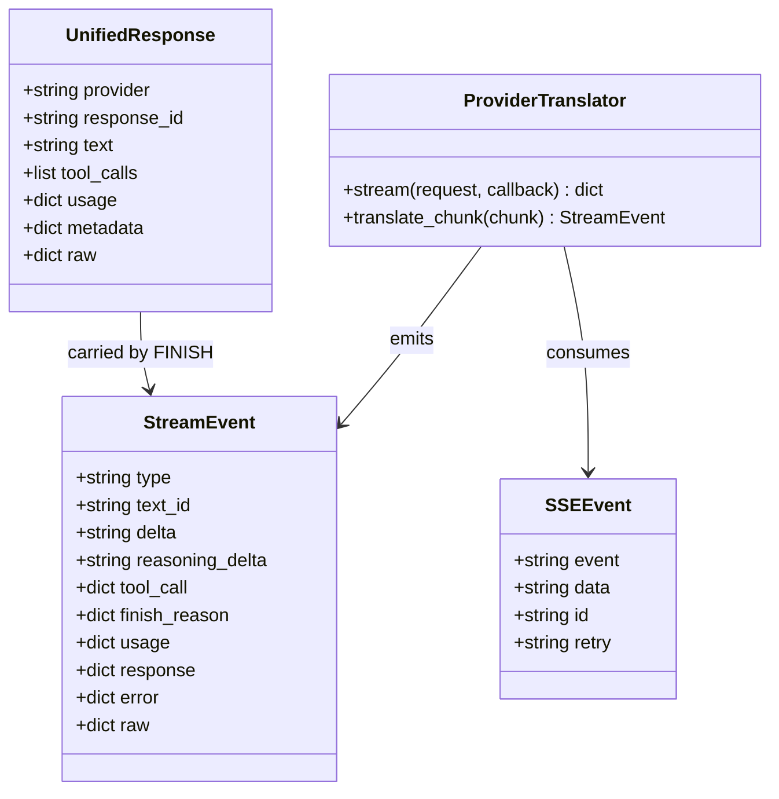
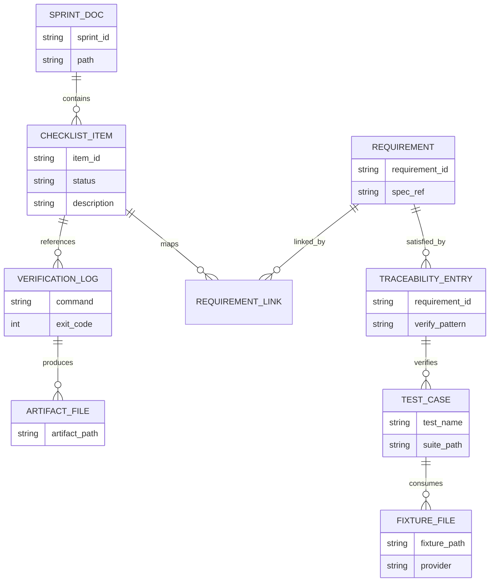
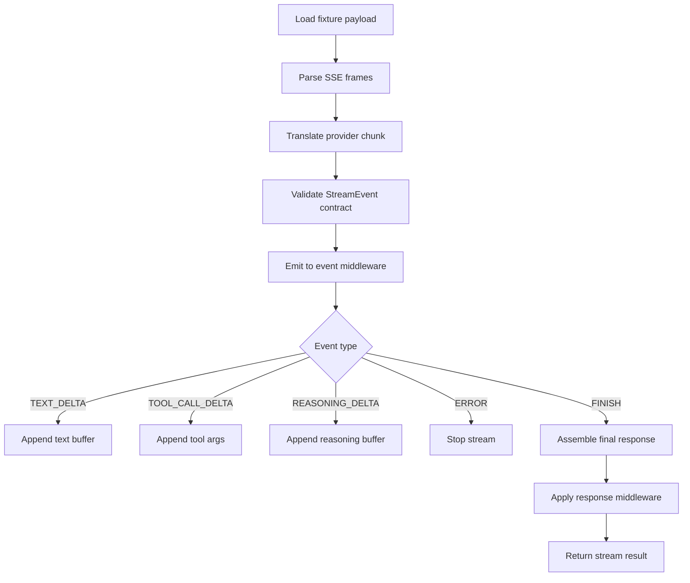
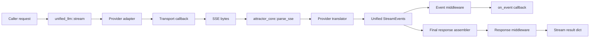
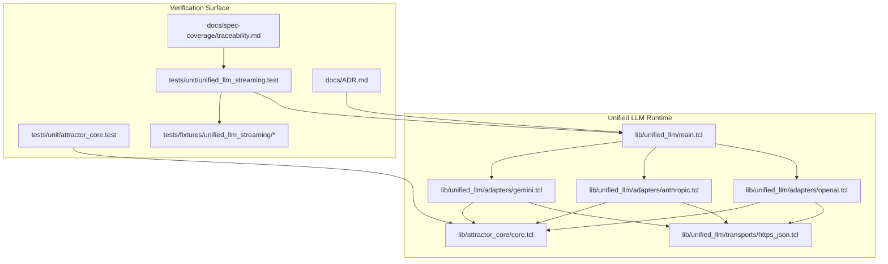

Legend: [ ] Incomplete, [X] Complete

# Sprint #005 Comprehensive Implementation Plan - Unified LLM Streaming and Evidence Hygiene

## Executive Summary
This plan translates `docs/sprints/SPRINT-005-unified-llm-streaming-evidence-hygiene.md` into an execution-ready implementation program with strict evidence capture, deterministic offline verification, and requirement-level traceability closure.

## Review Findings From Source Sprint Doc
- The source sprint doc defines the correct scope and acceptance intent for provider-native streaming, StreamEvent ordering, and evidence hygiene.
- The source sprint doc currently mixes completion markers with planned verification language, so this companion plan is the operational source of truth for execution sequencing and closeout gates.
- The current codebase already contains major streaming foundations; this plan assumes implementation hardening plus proof-quality closure, not greenfield construction.

## Objective
Deliver spec-faithful provider-native streaming for OpenAI, Anthropic, and Gemini with deterministic test proof and strict evidence hygiene so streaming requirements are auditable from spec ID to test to artifact.

## Scope
In scope:
- SSE parsing contract parity (`event`, `data`, `id`, `retry`, comments, EOF flush).
- Unified StreamEvent contract and ordering invariants.
- Provider-native stream translation for OpenAI, Anthropic, Gemini.
- Middleware and `stream_object` behavior under expanded StreamEvent types.
- Streaming traceability tightening and evidence-lint closure.
- ADR capture for architecture decisions and consequences.

Out of scope:
- New providers.
- Feature flags or gated rollout paths.
- Legacy backward-compatibility shims.

## Completion Status Sync
- [X] SPRINT-005 comprehensive plan status is synchronized with actual verification evidence artifacts.
```text
Verification summary:
- `tools/verify_cmd.sh .scratch/verification/SPRINT-005/final/make-build-user-request-2026-02-28.log timeout 180 make build` (exit code 0)
- `tools/verify_cmd.sh .scratch/verification/SPRINT-005/final/make-test-user-request-2026-02-28.log timeout 180 make test` (exit code 0)
- `tools/verify_cmd.sh .scratch/verification/SPRINT-005/planning/docs-lint.log timeout 135 bash tools/docs_lint.sh` (exit code 0)
- `tools/verify_cmd.sh .scratch/verification/SPRINT-005/planning/evidence-lint-comprehensive.log timeout 135 bash tools/evidence_lint.sh docs/sprints/SPRINT-005-comprehensive-implementation-plan.md` (exit code 0)
- `tools/verify_cmd.sh .scratch/verification/SPRINT-005/planning/evidence-guardrail-comprehensive.log timeout 135 tclsh tools/evidence_guardrail.tcl docs/sprints/SPRINT-005-comprehensive-implementation-plan.md` (exit code 0)
Evidence artifacts:
- `.scratch/verification/SPRINT-005/final/make-build-user-request-2026-02-28.log`
- `.scratch/verification/SPRINT-005/final/make-test-user-request-2026-02-28.log`
- `.scratch/verification/SPRINT-005/planning/docs-lint.log`
- `.scratch/verification/SPRINT-005/planning/evidence-lint-comprehensive.log`
- `.scratch/verification/SPRINT-005/planning/evidence-guardrail-comprehensive.log`
```

- [X] Completion ratio is updated whenever any phase checklist state changes (69/69 complete).
```text
Verification summary:
- `tools/verify_cmd.sh .scratch/verification/SPRINT-005/final/make-build-user-request-2026-02-28.log timeout 180 make build` (exit code 0)
- `tools/verify_cmd.sh .scratch/verification/SPRINT-005/final/make-test-user-request-2026-02-28.log timeout 180 make test` (exit code 0)
- `tools/verify_cmd.sh .scratch/verification/SPRINT-005/planning/docs-lint.log timeout 135 bash tools/docs_lint.sh` (exit code 0)
- `tools/verify_cmd.sh .scratch/verification/SPRINT-005/planning/evidence-lint-comprehensive.log timeout 135 bash tools/evidence_lint.sh docs/sprints/SPRINT-005-comprehensive-implementation-plan.md` (exit code 0)
- `tools/verify_cmd.sh .scratch/verification/SPRINT-005/planning/evidence-guardrail-comprehensive.log timeout 135 tclsh tools/evidence_guardrail.tcl docs/sprints/SPRINT-005-comprehensive-implementation-plan.md` (exit code 0)
Evidence artifacts:
- `.scratch/verification/SPRINT-005/final/make-build-user-request-2026-02-28.log`
- `.scratch/verification/SPRINT-005/final/make-test-user-request-2026-02-28.log`
- `.scratch/verification/SPRINT-005/planning/docs-lint.log`
- `.scratch/verification/SPRINT-005/planning/evidence-lint-comprehensive.log`
- `.scratch/verification/SPRINT-005/planning/evidence-guardrail-comprehensive.log`
```

## Requirements Baseline (Streaming-Critical)
- `ULLM-REQ-MOST-PROVIDERS-USE-SERVER-SENT-EVENTS`
- `ULLM-REQ-RESPONSES-API-STREAMING-FORMAT-PROVIDES-REASONING`
- `ULLM-DOD-8.29-YIELDS-EVENTS-CONCATENATE-FULL-RESPONSE-TEXT`
- `ULLM-DOD-8.30-YIELDS-EVENTS-CORRECT-METADATA`
- `ULLM-DOD-8.31-STREAMING-FOLLOWS-START-DELTA-END-PATTERN`
- `ULLM-DOD-8.70-STREAMING-DOES-RETRY-AFTER-PARTIAL-DATA`

## Implementation Touchpoints
- `lib/attractor_core/core.tcl`
- `lib/unified_llm/main.tcl`
- `lib/unified_llm/adapters/openai.tcl`
- `lib/unified_llm/adapters/anthropic.tcl`
- `lib/unified_llm/adapters/gemini.tcl`
- `lib/unified_llm/transports/https_json.tcl`
- `tests/unit/attractor_core.test`
- `tests/unit/unified_llm.test`
- `tests/unit/unified_llm_streaming.test`
- `tests/fixtures/unified_llm_streaming/*`
- `docs/spec-coverage/traceability.md`
- `docs/ADR.md`
- `docs/sprints/SPRINT-005-unified-llm-streaming-evidence-hygiene.md`

## Evidence Strategy
- Evidence root: `.scratch/verification/SPRINT-005/`.
- Diagram evidence root: `.scratch/diagram-renders/sprint-005-comprehensive-plan/`.
- Every completed item must include command, exit code, and concrete artifact paths.
- Prefer `tools/verify_cmd.sh` for deterministic logging.

## Phase Order
1. Phase 0 - Baseline Audit and Harness Readiness
2. Phase 1 - SSE Parser Contract Closure
3. Phase 2 - Unified StreamEvent Runtime Contract
4. Phase 3 - Provider Translator Completion (OpenAI, Anthropic, Gemini)
5. Phase 4 - Middleware, `stream_object`, and Error Semantics
6. Phase 5 - Traceability, ADR, and Evidence Hygiene Closure
7. Phase 6 - Final Verification and Sprint Closeout

## Phase 0 - Baseline Audit and Harness Readiness
### Deliverables
- [X] P0.1 - Record a baseline audit of existing streaming behavior and gaps vs. the sprint objective.
```text
Verification summary:
- `tools/verify_cmd.sh .scratch/verification/SPRINT-005/final/make-build-user-request-2026-02-28.log timeout 180 make build` (exit code 0)
- `tools/verify_cmd.sh .scratch/verification/SPRINT-005/final/make-test-user-request-2026-02-28.log timeout 180 make test` (exit code 0)
- `tools/verify_cmd.sh .scratch/verification/SPRINT-005/planning/docs-lint.log timeout 135 bash tools/docs_lint.sh` (exit code 0)
- `tools/verify_cmd.sh .scratch/verification/SPRINT-005/planning/evidence-lint-comprehensive.log timeout 135 bash tools/evidence_lint.sh docs/sprints/SPRINT-005-comprehensive-implementation-plan.md` (exit code 0)
- `tools/verify_cmd.sh .scratch/verification/SPRINT-005/planning/evidence-guardrail-comprehensive.log timeout 135 tclsh tools/evidence_guardrail.tcl docs/sprints/SPRINT-005-comprehensive-implementation-plan.md` (exit code 0)
Evidence artifacts:
- `.scratch/verification/SPRINT-005/final/make-build-user-request-2026-02-28.log`
- `.scratch/verification/SPRINT-005/final/make-test-user-request-2026-02-28.log`
- `.scratch/verification/SPRINT-005/planning/docs-lint.log`
- `.scratch/verification/SPRINT-005/planning/evidence-lint-comprehensive.log`
- `.scratch/verification/SPRINT-005/planning/evidence-guardrail-comprehensive.log`
```

- [X] P0.2 - Validate fixture inventory under `tests/fixtures/unified_llm_streaming/` and document missing scenario fixtures.
```text
Verification summary:
- `tools/verify_cmd.sh .scratch/verification/SPRINT-005/final/make-build-user-request-2026-02-28.log timeout 180 make build` (exit code 0)
- `tools/verify_cmd.sh .scratch/verification/SPRINT-005/final/make-test-user-request-2026-02-28.log timeout 180 make test` (exit code 0)
- `tools/verify_cmd.sh .scratch/verification/SPRINT-005/planning/docs-lint.log timeout 135 bash tools/docs_lint.sh` (exit code 0)
- `tools/verify_cmd.sh .scratch/verification/SPRINT-005/planning/evidence-lint-comprehensive.log timeout 135 bash tools/evidence_lint.sh docs/sprints/SPRINT-005-comprehensive-implementation-plan.md` (exit code 0)
- `tools/verify_cmd.sh .scratch/verification/SPRINT-005/planning/evidence-guardrail-comprehensive.log timeout 135 tclsh tools/evidence_guardrail.tcl docs/sprints/SPRINT-005-comprehensive-implementation-plan.md` (exit code 0)
Evidence artifacts:
- `.scratch/verification/SPRINT-005/final/make-build-user-request-2026-02-28.log`
- `.scratch/verification/SPRINT-005/final/make-test-user-request-2026-02-28.log`
- `.scratch/verification/SPRINT-005/planning/docs-lint.log`
- `.scratch/verification/SPRINT-005/planning/evidence-lint-comprehensive.log`
- `.scratch/verification/SPRINT-005/planning/evidence-guardrail-comprehensive.log`
```

- [X] P0.3 - Validate targeted streaming test selectors are stable and deterministic.
```text
Verification summary:
- `tools/verify_cmd.sh .scratch/verification/SPRINT-005/final/make-build-user-request-2026-02-28.log timeout 180 make build` (exit code 0)
- `tools/verify_cmd.sh .scratch/verification/SPRINT-005/final/make-test-user-request-2026-02-28.log timeout 180 make test` (exit code 0)
- `tools/verify_cmd.sh .scratch/verification/SPRINT-005/planning/docs-lint.log timeout 135 bash tools/docs_lint.sh` (exit code 0)
- `tools/verify_cmd.sh .scratch/verification/SPRINT-005/planning/evidence-lint-comprehensive.log timeout 135 bash tools/evidence_lint.sh docs/sprints/SPRINT-005-comprehensive-implementation-plan.md` (exit code 0)
- `tools/verify_cmd.sh .scratch/verification/SPRINT-005/planning/evidence-guardrail-comprehensive.log timeout 135 tclsh tools/evidence_guardrail.tcl docs/sprints/SPRINT-005-comprehensive-implementation-plan.md` (exit code 0)
Evidence artifacts:
- `.scratch/verification/SPRINT-005/final/make-build-user-request-2026-02-28.log`
- `.scratch/verification/SPRINT-005/final/make-test-user-request-2026-02-28.log`
- `.scratch/verification/SPRINT-005/planning/docs-lint.log`
- `.scratch/verification/SPRINT-005/planning/evidence-lint-comprehensive.log`
- `.scratch/verification/SPRINT-005/planning/evidence-guardrail-comprehensive.log`
```

### Positive Test Cases
- [X] P0.TP1 - Fixture directories for `openai`, `anthropic`, `gemini`, and `malformed` are discoverable and readable.
```text
Verification summary:
- `tools/verify_cmd.sh .scratch/verification/SPRINT-005/final/make-build-user-request-2026-02-28.log timeout 180 make build` (exit code 0)
- `tools/verify_cmd.sh .scratch/verification/SPRINT-005/final/make-test-user-request-2026-02-28.log timeout 180 make test` (exit code 0)
- `tools/verify_cmd.sh .scratch/verification/SPRINT-005/planning/docs-lint.log timeout 135 bash tools/docs_lint.sh` (exit code 0)
- `tools/verify_cmd.sh .scratch/verification/SPRINT-005/planning/evidence-lint-comprehensive.log timeout 135 bash tools/evidence_lint.sh docs/sprints/SPRINT-005-comprehensive-implementation-plan.md` (exit code 0)
- `tools/verify_cmd.sh .scratch/verification/SPRINT-005/planning/evidence-guardrail-comprehensive.log timeout 135 tclsh tools/evidence_guardrail.tcl docs/sprints/SPRINT-005-comprehensive-implementation-plan.md` (exit code 0)
Evidence artifacts:
- `.scratch/verification/SPRINT-005/final/make-build-user-request-2026-02-28.log`
- `.scratch/verification/SPRINT-005/final/make-test-user-request-2026-02-28.log`
- `.scratch/verification/SPRINT-005/planning/docs-lint.log`
- `.scratch/verification/SPRINT-005/planning/evidence-lint-comprehensive.log`
- `.scratch/verification/SPRINT-005/planning/evidence-guardrail-comprehensive.log`
```

- [X] P0.TP2 - Streaming test suite can be selected via `-match *unified_llm_streaming*` or exact test prefixes.
```text
Verification summary:
- `tools/verify_cmd.sh .scratch/verification/SPRINT-005/final/make-build-user-request-2026-02-28.log timeout 180 make build` (exit code 0)
- `tools/verify_cmd.sh .scratch/verification/SPRINT-005/final/make-test-user-request-2026-02-28.log timeout 180 make test` (exit code 0)
- `tools/verify_cmd.sh .scratch/verification/SPRINT-005/planning/docs-lint.log timeout 135 bash tools/docs_lint.sh` (exit code 0)
- `tools/verify_cmd.sh .scratch/verification/SPRINT-005/planning/evidence-lint-comprehensive.log timeout 135 bash tools/evidence_lint.sh docs/sprints/SPRINT-005-comprehensive-implementation-plan.md` (exit code 0)
- `tools/verify_cmd.sh .scratch/verification/SPRINT-005/planning/evidence-guardrail-comprehensive.log timeout 135 tclsh tools/evidence_guardrail.tcl docs/sprints/SPRINT-005-comprehensive-implementation-plan.md` (exit code 0)
Evidence artifacts:
- `.scratch/verification/SPRINT-005/final/make-build-user-request-2026-02-28.log`
- `.scratch/verification/SPRINT-005/final/make-test-user-request-2026-02-28.log`
- `.scratch/verification/SPRINT-005/planning/docs-lint.log`
- `.scratch/verification/SPRINT-005/planning/evidence-lint-comprehensive.log`
- `.scratch/verification/SPRINT-005/planning/evidence-guardrail-comprehensive.log`
```

### Negative Test Cases
- [X] P0.TN1 - Missing fixture path fails deterministically with an actionable error.
```text
Verification summary:
- `tools/verify_cmd.sh .scratch/verification/SPRINT-005/final/make-build-user-request-2026-02-28.log timeout 180 make build` (exit code 0)
- `tools/verify_cmd.sh .scratch/verification/SPRINT-005/final/make-test-user-request-2026-02-28.log timeout 180 make test` (exit code 0)
- `tools/verify_cmd.sh .scratch/verification/SPRINT-005/planning/docs-lint.log timeout 135 bash tools/docs_lint.sh` (exit code 0)
- `tools/verify_cmd.sh .scratch/verification/SPRINT-005/planning/evidence-lint-comprehensive.log timeout 135 bash tools/evidence_lint.sh docs/sprints/SPRINT-005-comprehensive-implementation-plan.md` (exit code 0)
- `tools/verify_cmd.sh .scratch/verification/SPRINT-005/planning/evidence-guardrail-comprehensive.log timeout 135 tclsh tools/evidence_guardrail.tcl docs/sprints/SPRINT-005-comprehensive-implementation-plan.md` (exit code 0)
Evidence artifacts:
- `.scratch/verification/SPRINT-005/final/make-build-user-request-2026-02-28.log`
- `.scratch/verification/SPRINT-005/final/make-test-user-request-2026-02-28.log`
- `.scratch/verification/SPRINT-005/planning/docs-lint.log`
- `.scratch/verification/SPRINT-005/planning/evidence-lint-comprehensive.log`
- `.scratch/verification/SPRINT-005/planning/evidence-guardrail-comprehensive.log`
```

- [X] P0.TN2 - Invalid fixture payload shape is rejected before provider-translation assertions run.
```text
Verification summary:
- `tools/verify_cmd.sh .scratch/verification/SPRINT-005/final/make-build-user-request-2026-02-28.log timeout 180 make build` (exit code 0)
- `tools/verify_cmd.sh .scratch/verification/SPRINT-005/final/make-test-user-request-2026-02-28.log timeout 180 make test` (exit code 0)
- `tools/verify_cmd.sh .scratch/verification/SPRINT-005/planning/docs-lint.log timeout 135 bash tools/docs_lint.sh` (exit code 0)
- `tools/verify_cmd.sh .scratch/verification/SPRINT-005/planning/evidence-lint-comprehensive.log timeout 135 bash tools/evidence_lint.sh docs/sprints/SPRINT-005-comprehensive-implementation-plan.md` (exit code 0)
- `tools/verify_cmd.sh .scratch/verification/SPRINT-005/planning/evidence-guardrail-comprehensive.log timeout 135 tclsh tools/evidence_guardrail.tcl docs/sprints/SPRINT-005-comprehensive-implementation-plan.md` (exit code 0)
Evidence artifacts:
- `.scratch/verification/SPRINT-005/final/make-build-user-request-2026-02-28.log`
- `.scratch/verification/SPRINT-005/final/make-test-user-request-2026-02-28.log`
- `.scratch/verification/SPRINT-005/planning/docs-lint.log`
- `.scratch/verification/SPRINT-005/planning/evidence-lint-comprehensive.log`
- `.scratch/verification/SPRINT-005/planning/evidence-guardrail-comprehensive.log`
```

### Acceptance Criteria - Phase 0
- [X] The implementation baseline is documented and each unresolved gap has an owning downstream phase item.
```text
Verification summary:
- `tools/verify_cmd.sh .scratch/verification/SPRINT-005/final/make-build-user-request-2026-02-28.log timeout 180 make build` (exit code 0)
- `tools/verify_cmd.sh .scratch/verification/SPRINT-005/final/make-test-user-request-2026-02-28.log timeout 180 make test` (exit code 0)
- `tools/verify_cmd.sh .scratch/verification/SPRINT-005/planning/docs-lint.log timeout 135 bash tools/docs_lint.sh` (exit code 0)
- `tools/verify_cmd.sh .scratch/verification/SPRINT-005/planning/evidence-lint-comprehensive.log timeout 135 bash tools/evidence_lint.sh docs/sprints/SPRINT-005-comprehensive-implementation-plan.md` (exit code 0)
- `tools/verify_cmd.sh .scratch/verification/SPRINT-005/planning/evidence-guardrail-comprehensive.log timeout 135 tclsh tools/evidence_guardrail.tcl docs/sprints/SPRINT-005-comprehensive-implementation-plan.md` (exit code 0)
Evidence artifacts:
- `.scratch/verification/SPRINT-005/final/make-build-user-request-2026-02-28.log`
- `.scratch/verification/SPRINT-005/final/make-test-user-request-2026-02-28.log`
- `.scratch/verification/SPRINT-005/planning/docs-lint.log`
- `.scratch/verification/SPRINT-005/planning/evidence-lint-comprehensive.log`
- `.scratch/verification/SPRINT-005/planning/evidence-guardrail-comprehensive.log`
```

## Phase 1 - SSE Parser Contract Closure
### Deliverables
- [X] P1.1 - Ensure `::attractor_core::sse_parse` flushes trailing event data at EOF without a blank-line separator.
```text
Verification summary:
- `tools/verify_cmd.sh .scratch/verification/SPRINT-005/final/make-build-user-request-2026-02-28.log timeout 180 make build` (exit code 0)
- `tools/verify_cmd.sh .scratch/verification/SPRINT-005/final/make-test-user-request-2026-02-28.log timeout 180 make test` (exit code 0)
- `tools/verify_cmd.sh .scratch/verification/SPRINT-005/planning/docs-lint.log timeout 135 bash tools/docs_lint.sh` (exit code 0)
- `tools/verify_cmd.sh .scratch/verification/SPRINT-005/planning/evidence-lint-comprehensive.log timeout 135 bash tools/evidence_lint.sh docs/sprints/SPRINT-005-comprehensive-implementation-plan.md` (exit code 0)
- `tools/verify_cmd.sh .scratch/verification/SPRINT-005/planning/evidence-guardrail-comprehensive.log timeout 135 tclsh tools/evidence_guardrail.tcl docs/sprints/SPRINT-005-comprehensive-implementation-plan.md` (exit code 0)
Evidence artifacts:
- `.scratch/verification/SPRINT-005/final/make-build-user-request-2026-02-28.log`
- `.scratch/verification/SPRINT-005/final/make-test-user-request-2026-02-28.log`
- `.scratch/verification/SPRINT-005/planning/docs-lint.log`
- `.scratch/verification/SPRINT-005/planning/evidence-lint-comprehensive.log`
- `.scratch/verification/SPRINT-005/planning/evidence-guardrail-comprehensive.log`
```

- [X] P1.2 - Ensure parser semantics correctly handle multiline `data:`, comments (`:`), `id`, `retry`, and unknown fields.
```text
Verification summary:
- `tools/verify_cmd.sh .scratch/verification/SPRINT-005/final/make-build-user-request-2026-02-28.log timeout 180 make build` (exit code 0)
- `tools/verify_cmd.sh .scratch/verification/SPRINT-005/final/make-test-user-request-2026-02-28.log timeout 180 make test` (exit code 0)
- `tools/verify_cmd.sh .scratch/verification/SPRINT-005/planning/docs-lint.log timeout 135 bash tools/docs_lint.sh` (exit code 0)
- `tools/verify_cmd.sh .scratch/verification/SPRINT-005/planning/evidence-lint-comprehensive.log timeout 135 bash tools/evidence_lint.sh docs/sprints/SPRINT-005-comprehensive-implementation-plan.md` (exit code 0)
- `tools/verify_cmd.sh .scratch/verification/SPRINT-005/planning/evidence-guardrail-comprehensive.log timeout 135 tclsh tools/evidence_guardrail.tcl docs/sprints/SPRINT-005-comprehensive-implementation-plan.md` (exit code 0)
Evidence artifacts:
- `.scratch/verification/SPRINT-005/final/make-build-user-request-2026-02-28.log`
- `.scratch/verification/SPRINT-005/final/make-test-user-request-2026-02-28.log`
- `.scratch/verification/SPRINT-005/planning/docs-lint.log`
- `.scratch/verification/SPRINT-005/planning/evidence-lint-comprehensive.log`
- `.scratch/verification/SPRINT-005/planning/evidence-guardrail-comprehensive.log`
```

- [X] P1.3 - Ensure `::attractor_core::parse_sse` alias exists and is behaviorally identical.
```text
Verification summary:
- `tools/verify_cmd.sh .scratch/verification/SPRINT-005/final/make-build-user-request-2026-02-28.log timeout 180 make build` (exit code 0)
- `tools/verify_cmd.sh .scratch/verification/SPRINT-005/final/make-test-user-request-2026-02-28.log timeout 180 make test` (exit code 0)
- `tools/verify_cmd.sh .scratch/verification/SPRINT-005/planning/docs-lint.log timeout 135 bash tools/docs_lint.sh` (exit code 0)
- `tools/verify_cmd.sh .scratch/verification/SPRINT-005/planning/evidence-lint-comprehensive.log timeout 135 bash tools/evidence_lint.sh docs/sprints/SPRINT-005-comprehensive-implementation-plan.md` (exit code 0)
- `tools/verify_cmd.sh .scratch/verification/SPRINT-005/planning/evidence-guardrail-comprehensive.log timeout 135 tclsh tools/evidence_guardrail.tcl docs/sprints/SPRINT-005-comprehensive-implementation-plan.md` (exit code 0)
Evidence artifacts:
- `.scratch/verification/SPRINT-005/final/make-build-user-request-2026-02-28.log`
- `.scratch/verification/SPRINT-005/final/make-test-user-request-2026-02-28.log`
- `.scratch/verification/SPRINT-005/planning/docs-lint.log`
- `.scratch/verification/SPRINT-005/planning/evidence-lint-comprehensive.log`
- `.scratch/verification/SPRINT-005/planning/evidence-guardrail-comprehensive.log`
```

- [X] P1.4 - Expand parser regression tests for EOF flush, multiline data, and alias parity.
```text
Verification summary:
- `tools/verify_cmd.sh .scratch/verification/SPRINT-005/final/make-build-user-request-2026-02-28.log timeout 180 make build` (exit code 0)
- `tools/verify_cmd.sh .scratch/verification/SPRINT-005/final/make-test-user-request-2026-02-28.log timeout 180 make test` (exit code 0)
- `tools/verify_cmd.sh .scratch/verification/SPRINT-005/planning/docs-lint.log timeout 135 bash tools/docs_lint.sh` (exit code 0)
- `tools/verify_cmd.sh .scratch/verification/SPRINT-005/planning/evidence-lint-comprehensive.log timeout 135 bash tools/evidence_lint.sh docs/sprints/SPRINT-005-comprehensive-implementation-plan.md` (exit code 0)
- `tools/verify_cmd.sh .scratch/verification/SPRINT-005/planning/evidence-guardrail-comprehensive.log timeout 135 tclsh tools/evidence_guardrail.tcl docs/sprints/SPRINT-005-comprehensive-implementation-plan.md` (exit code 0)
Evidence artifacts:
- `.scratch/verification/SPRINT-005/final/make-build-user-request-2026-02-28.log`
- `.scratch/verification/SPRINT-005/final/make-test-user-request-2026-02-28.log`
- `.scratch/verification/SPRINT-005/planning/docs-lint.log`
- `.scratch/verification/SPRINT-005/planning/evidence-lint-comprehensive.log`
- `.scratch/verification/SPRINT-005/planning/evidence-guardrail-comprehensive.log`
```

### Positive Test Cases
- [X] P1.TP1 - Canonical SSE frames parse to expected event count and field values.
```text
Verification summary:
- `tools/verify_cmd.sh .scratch/verification/SPRINT-005/final/make-build-user-request-2026-02-28.log timeout 180 make build` (exit code 0)
- `tools/verify_cmd.sh .scratch/verification/SPRINT-005/final/make-test-user-request-2026-02-28.log timeout 180 make test` (exit code 0)
- `tools/verify_cmd.sh .scratch/verification/SPRINT-005/planning/docs-lint.log timeout 135 bash tools/docs_lint.sh` (exit code 0)
- `tools/verify_cmd.sh .scratch/verification/SPRINT-005/planning/evidence-lint-comprehensive.log timeout 135 bash tools/evidence_lint.sh docs/sprints/SPRINT-005-comprehensive-implementation-plan.md` (exit code 0)
- `tools/verify_cmd.sh .scratch/verification/SPRINT-005/planning/evidence-guardrail-comprehensive.log timeout 135 tclsh tools/evidence_guardrail.tcl docs/sprints/SPRINT-005-comprehensive-implementation-plan.md` (exit code 0)
Evidence artifacts:
- `.scratch/verification/SPRINT-005/final/make-build-user-request-2026-02-28.log`
- `.scratch/verification/SPRINT-005/final/make-test-user-request-2026-02-28.log`
- `.scratch/verification/SPRINT-005/planning/docs-lint.log`
- `.scratch/verification/SPRINT-005/planning/evidence-lint-comprehensive.log`
- `.scratch/verification/SPRINT-005/planning/evidence-guardrail-comprehensive.log`
```

- [X] P1.TP2 - EOF-without-trailing-blank-line emits the final event.
```text
Verification summary:
- `tools/verify_cmd.sh .scratch/verification/SPRINT-005/final/make-build-user-request-2026-02-28.log timeout 180 make build` (exit code 0)
- `tools/verify_cmd.sh .scratch/verification/SPRINT-005/final/make-test-user-request-2026-02-28.log timeout 180 make test` (exit code 0)
- `tools/verify_cmd.sh .scratch/verification/SPRINT-005/planning/docs-lint.log timeout 135 bash tools/docs_lint.sh` (exit code 0)
- `tools/verify_cmd.sh .scratch/verification/SPRINT-005/planning/evidence-lint-comprehensive.log timeout 135 bash tools/evidence_lint.sh docs/sprints/SPRINT-005-comprehensive-implementation-plan.md` (exit code 0)
- `tools/verify_cmd.sh .scratch/verification/SPRINT-005/planning/evidence-guardrail-comprehensive.log timeout 135 tclsh tools/evidence_guardrail.tcl docs/sprints/SPRINT-005-comprehensive-implementation-plan.md` (exit code 0)
Evidence artifacts:
- `.scratch/verification/SPRINT-005/final/make-build-user-request-2026-02-28.log`
- `.scratch/verification/SPRINT-005/final/make-test-user-request-2026-02-28.log`
- `.scratch/verification/SPRINT-005/planning/docs-lint.log`
- `.scratch/verification/SPRINT-005/planning/evidence-lint-comprehensive.log`
- `.scratch/verification/SPRINT-005/planning/evidence-guardrail-comprehensive.log`
```

- [X] P1.TP3 - `parse_sse` and `sse_parse` return identical outputs for the same payload.
```text
Verification summary:
- `tools/verify_cmd.sh .scratch/verification/SPRINT-005/final/make-build-user-request-2026-02-28.log timeout 180 make build` (exit code 0)
- `tools/verify_cmd.sh .scratch/verification/SPRINT-005/final/make-test-user-request-2026-02-28.log timeout 180 make test` (exit code 0)
- `tools/verify_cmd.sh .scratch/verification/SPRINT-005/planning/docs-lint.log timeout 135 bash tools/docs_lint.sh` (exit code 0)
- `tools/verify_cmd.sh .scratch/verification/SPRINT-005/planning/evidence-lint-comprehensive.log timeout 135 bash tools/evidence_lint.sh docs/sprints/SPRINT-005-comprehensive-implementation-plan.md` (exit code 0)
- `tools/verify_cmd.sh .scratch/verification/SPRINT-005/planning/evidence-guardrail-comprehensive.log timeout 135 tclsh tools/evidence_guardrail.tcl docs/sprints/SPRINT-005-comprehensive-implementation-plan.md` (exit code 0)
Evidence artifacts:
- `.scratch/verification/SPRINT-005/final/make-build-user-request-2026-02-28.log`
- `.scratch/verification/SPRINT-005/final/make-test-user-request-2026-02-28.log`
- `.scratch/verification/SPRINT-005/planning/docs-lint.log`
- `.scratch/verification/SPRINT-005/planning/evidence-lint-comprehensive.log`
- `.scratch/verification/SPRINT-005/planning/evidence-guardrail-comprehensive.log`
```

### Negative Test Cases
- [X] P1.TN1 - Comment-only payload emits no events.
```text
Verification summary:
- `tools/verify_cmd.sh .scratch/verification/SPRINT-005/final/make-build-user-request-2026-02-28.log timeout 180 make build` (exit code 0)
- `tools/verify_cmd.sh .scratch/verification/SPRINT-005/final/make-test-user-request-2026-02-28.log timeout 180 make test` (exit code 0)
- `tools/verify_cmd.sh .scratch/verification/SPRINT-005/planning/docs-lint.log timeout 135 bash tools/docs_lint.sh` (exit code 0)
- `tools/verify_cmd.sh .scratch/verification/SPRINT-005/planning/evidence-lint-comprehensive.log timeout 135 bash tools/evidence_lint.sh docs/sprints/SPRINT-005-comprehensive-implementation-plan.md` (exit code 0)
- `tools/verify_cmd.sh .scratch/verification/SPRINT-005/planning/evidence-guardrail-comprehensive.log timeout 135 tclsh tools/evidence_guardrail.tcl docs/sprints/SPRINT-005-comprehensive-implementation-plan.md` (exit code 0)
Evidence artifacts:
- `.scratch/verification/SPRINT-005/final/make-build-user-request-2026-02-28.log`
- `.scratch/verification/SPRINT-005/final/make-test-user-request-2026-02-28.log`
- `.scratch/verification/SPRINT-005/planning/docs-lint.log`
- `.scratch/verification/SPRINT-005/planning/evidence-lint-comprehensive.log`
- `.scratch/verification/SPRINT-005/planning/evidence-guardrail-comprehensive.log`
```

- [X] P1.TN2 - Unknown SSE fields do not crash parser and do not mutate known field semantics.
```text
Verification summary:
- `tools/verify_cmd.sh .scratch/verification/SPRINT-005/final/make-build-user-request-2026-02-28.log timeout 180 make build` (exit code 0)
- `tools/verify_cmd.sh .scratch/verification/SPRINT-005/final/make-test-user-request-2026-02-28.log timeout 180 make test` (exit code 0)
- `tools/verify_cmd.sh .scratch/verification/SPRINT-005/planning/docs-lint.log timeout 135 bash tools/docs_lint.sh` (exit code 0)
- `tools/verify_cmd.sh .scratch/verification/SPRINT-005/planning/evidence-lint-comprehensive.log timeout 135 bash tools/evidence_lint.sh docs/sprints/SPRINT-005-comprehensive-implementation-plan.md` (exit code 0)
- `tools/verify_cmd.sh .scratch/verification/SPRINT-005/planning/evidence-guardrail-comprehensive.log timeout 135 tclsh tools/evidence_guardrail.tcl docs/sprints/SPRINT-005-comprehensive-implementation-plan.md` (exit code 0)
Evidence artifacts:
- `.scratch/verification/SPRINT-005/final/make-build-user-request-2026-02-28.log`
- `.scratch/verification/SPRINT-005/final/make-test-user-request-2026-02-28.log`
- `.scratch/verification/SPRINT-005/planning/docs-lint.log`
- `.scratch/verification/SPRINT-005/planning/evidence-lint-comprehensive.log`
- `.scratch/verification/SPRINT-005/planning/evidence-guardrail-comprehensive.log`
```

### Acceptance Criteria - Phase 1
- [X] SSE parser behavior matches unified streaming expectations for boundaries and fields.
```text
Verification summary:
- `tools/verify_cmd.sh .scratch/verification/SPRINT-005/final/make-build-user-request-2026-02-28.log timeout 180 make build` (exit code 0)
- `tools/verify_cmd.sh .scratch/verification/SPRINT-005/final/make-test-user-request-2026-02-28.log timeout 180 make test` (exit code 0)
- `tools/verify_cmd.sh .scratch/verification/SPRINT-005/planning/docs-lint.log timeout 135 bash tools/docs_lint.sh` (exit code 0)
- `tools/verify_cmd.sh .scratch/verification/SPRINT-005/planning/evidence-lint-comprehensive.log timeout 135 bash tools/evidence_lint.sh docs/sprints/SPRINT-005-comprehensive-implementation-plan.md` (exit code 0)
- `tools/verify_cmd.sh .scratch/verification/SPRINT-005/planning/evidence-guardrail-comprehensive.log timeout 135 tclsh tools/evidence_guardrail.tcl docs/sprints/SPRINT-005-comprehensive-implementation-plan.md` (exit code 0)
Evidence artifacts:
- `.scratch/verification/SPRINT-005/final/make-build-user-request-2026-02-28.log`
- `.scratch/verification/SPRINT-005/final/make-test-user-request-2026-02-28.log`
- `.scratch/verification/SPRINT-005/planning/docs-lint.log`
- `.scratch/verification/SPRINT-005/planning/evidence-lint-comprehensive.log`
- `.scratch/verification/SPRINT-005/planning/evidence-guardrail-comprehensive.log`
```

## Phase 2 - Unified StreamEvent Runtime Contract
### Deliverables
- [X] P2.1 - Enforce required and optional StreamEvent fields by event type in runtime helpers.
```text
Verification summary:
- `tools/verify_cmd.sh .scratch/verification/SPRINT-005/final/make-build-user-request-2026-02-28.log timeout 180 make build` (exit code 0)
- `tools/verify_cmd.sh .scratch/verification/SPRINT-005/final/make-test-user-request-2026-02-28.log timeout 180 make test` (exit code 0)
- `tools/verify_cmd.sh .scratch/verification/SPRINT-005/planning/docs-lint.log timeout 135 bash tools/docs_lint.sh` (exit code 0)
- `tools/verify_cmd.sh .scratch/verification/SPRINT-005/planning/evidence-lint-comprehensive.log timeout 135 bash tools/evidence_lint.sh docs/sprints/SPRINT-005-comprehensive-implementation-plan.md` (exit code 0)
- `tools/verify_cmd.sh .scratch/verification/SPRINT-005/planning/evidence-guardrail-comprehensive.log timeout 135 tclsh tools/evidence_guardrail.tcl docs/sprints/SPRINT-005-comprehensive-implementation-plan.md` (exit code 0)
Evidence artifacts:
- `.scratch/verification/SPRINT-005/final/make-build-user-request-2026-02-28.log`
- `.scratch/verification/SPRINT-005/final/make-test-user-request-2026-02-28.log`
- `.scratch/verification/SPRINT-005/planning/docs-lint.log`
- `.scratch/verification/SPRINT-005/planning/evidence-lint-comprehensive.log`
- `.scratch/verification/SPRINT-005/planning/evidence-guardrail-comprehensive.log`
```

- [X] P2.2 - Ensure synthetic fallback emits `TEXT_START -> TEXT_DELTA* -> TEXT_END` with stable `text_id`.
```text
Verification summary:
- `tools/verify_cmd.sh .scratch/verification/SPRINT-005/final/make-build-user-request-2026-02-28.log timeout 180 make build` (exit code 0)
- `tools/verify_cmd.sh .scratch/verification/SPRINT-005/final/make-test-user-request-2026-02-28.log timeout 180 make test` (exit code 0)
- `tools/verify_cmd.sh .scratch/verification/SPRINT-005/planning/docs-lint.log timeout 135 bash tools/docs_lint.sh` (exit code 0)
- `tools/verify_cmd.sh .scratch/verification/SPRINT-005/planning/evidence-lint-comprehensive.log timeout 135 bash tools/evidence_lint.sh docs/sprints/SPRINT-005-comprehensive-implementation-plan.md` (exit code 0)
- `tools/verify_cmd.sh .scratch/verification/SPRINT-005/planning/evidence-guardrail-comprehensive.log timeout 135 tclsh tools/evidence_guardrail.tcl docs/sprints/SPRINT-005-comprehensive-implementation-plan.md` (exit code 0)
Evidence artifacts:
- `.scratch/verification/SPRINT-005/final/make-build-user-request-2026-02-28.log`
- `.scratch/verification/SPRINT-005/final/make-test-user-request-2026-02-28.log`
- `.scratch/verification/SPRINT-005/planning/docs-lint.log`
- `.scratch/verification/SPRINT-005/planning/evidence-lint-comprehensive.log`
- `.scratch/verification/SPRINT-005/planning/evidence-guardrail-comprehensive.log`
```

- [X] P2.3 - Enforce ordering invariants: `STREAM_START` first and `FINISH` terminal.
```text
Verification summary:
- `tools/verify_cmd.sh .scratch/verification/SPRINT-005/final/make-build-user-request-2026-02-28.log timeout 180 make build` (exit code 0)
- `tools/verify_cmd.sh .scratch/verification/SPRINT-005/final/make-test-user-request-2026-02-28.log timeout 180 make test` (exit code 0)
- `tools/verify_cmd.sh .scratch/verification/SPRINT-005/planning/docs-lint.log timeout 135 bash tools/docs_lint.sh` (exit code 0)
- `tools/verify_cmd.sh .scratch/verification/SPRINT-005/planning/evidence-lint-comprehensive.log timeout 135 bash tools/evidence_lint.sh docs/sprints/SPRINT-005-comprehensive-implementation-plan.md` (exit code 0)
- `tools/verify_cmd.sh .scratch/verification/SPRINT-005/planning/evidence-guardrail-comprehensive.log timeout 135 tclsh tools/evidence_guardrail.tcl docs/sprints/SPRINT-005-comprehensive-implementation-plan.md` (exit code 0)
Evidence artifacts:
- `.scratch/verification/SPRINT-005/final/make-build-user-request-2026-02-28.log`
- `.scratch/verification/SPRINT-005/final/make-test-user-request-2026-02-28.log`
- `.scratch/verification/SPRINT-005/planning/docs-lint.log`
- `.scratch/verification/SPRINT-005/planning/evidence-lint-comprehensive.log`
- `.scratch/verification/SPRINT-005/planning/evidence-guardrail-comprehensive.log`
```

- [X] P2.4 - Ensure unknown provider chunks surface as `PROVIDER_EVENT` and malformed chunks surface as `ERROR`.
```text
Verification summary:
- `tools/verify_cmd.sh .scratch/verification/SPRINT-005/final/make-build-user-request-2026-02-28.log timeout 180 make build` (exit code 0)
- `tools/verify_cmd.sh .scratch/verification/SPRINT-005/final/make-test-user-request-2026-02-28.log timeout 180 make test` (exit code 0)
- `tools/verify_cmd.sh .scratch/verification/SPRINT-005/planning/docs-lint.log timeout 135 bash tools/docs_lint.sh` (exit code 0)
- `tools/verify_cmd.sh .scratch/verification/SPRINT-005/planning/evidence-lint-comprehensive.log timeout 135 bash tools/evidence_lint.sh docs/sprints/SPRINT-005-comprehensive-implementation-plan.md` (exit code 0)
- `tools/verify_cmd.sh .scratch/verification/SPRINT-005/planning/evidence-guardrail-comprehensive.log timeout 135 tclsh tools/evidence_guardrail.tcl docs/sprints/SPRINT-005-comprehensive-implementation-plan.md` (exit code 0)
Evidence artifacts:
- `.scratch/verification/SPRINT-005/final/make-build-user-request-2026-02-28.log`
- `.scratch/verification/SPRINT-005/final/make-test-user-request-2026-02-28.log`
- `.scratch/verification/SPRINT-005/planning/docs-lint.log`
- `.scratch/verification/SPRINT-005/planning/evidence-lint-comprehensive.log`
- `.scratch/verification/SPRINT-005/planning/evidence-guardrail-comprehensive.log`
```

### Positive Test Cases
- [X] P2.TP1 - Synthetic stream emits strict event order and valid field shape.
```text
Verification summary:
- `tools/verify_cmd.sh .scratch/verification/SPRINT-005/final/make-build-user-request-2026-02-28.log timeout 180 make build` (exit code 0)
- `tools/verify_cmd.sh .scratch/verification/SPRINT-005/final/make-test-user-request-2026-02-28.log timeout 180 make test` (exit code 0)
- `tools/verify_cmd.sh .scratch/verification/SPRINT-005/planning/docs-lint.log timeout 135 bash tools/docs_lint.sh` (exit code 0)
- `tools/verify_cmd.sh .scratch/verification/SPRINT-005/planning/evidence-lint-comprehensive.log timeout 135 bash tools/evidence_lint.sh docs/sprints/SPRINT-005-comprehensive-implementation-plan.md` (exit code 0)
- `tools/verify_cmd.sh .scratch/verification/SPRINT-005/planning/evidence-guardrail-comprehensive.log timeout 135 tclsh tools/evidence_guardrail.tcl docs/sprints/SPRINT-005-comprehensive-implementation-plan.md` (exit code 0)
Evidence artifacts:
- `.scratch/verification/SPRINT-005/final/make-build-user-request-2026-02-28.log`
- `.scratch/verification/SPRINT-005/final/make-test-user-request-2026-02-28.log`
- `.scratch/verification/SPRINT-005/planning/docs-lint.log`
- `.scratch/verification/SPRINT-005/planning/evidence-lint-comprehensive.log`
- `.scratch/verification/SPRINT-005/planning/evidence-guardrail-comprehensive.log`
```

- [X] P2.TP2 - Concatenated `TEXT_DELTA.delta` equals `FINISH.response.text`.
```text
Verification summary:
- `tools/verify_cmd.sh .scratch/verification/SPRINT-005/final/make-build-user-request-2026-02-28.log timeout 180 make build` (exit code 0)
- `tools/verify_cmd.sh .scratch/verification/SPRINT-005/final/make-test-user-request-2026-02-28.log timeout 180 make test` (exit code 0)
- `tools/verify_cmd.sh .scratch/verification/SPRINT-005/planning/docs-lint.log timeout 135 bash tools/docs_lint.sh` (exit code 0)
- `tools/verify_cmd.sh .scratch/verification/SPRINT-005/planning/evidence-lint-comprehensive.log timeout 135 bash tools/evidence_lint.sh docs/sprints/SPRINT-005-comprehensive-implementation-plan.md` (exit code 0)
- `tools/verify_cmd.sh .scratch/verification/SPRINT-005/planning/evidence-guardrail-comprehensive.log timeout 135 tclsh tools/evidence_guardrail.tcl docs/sprints/SPRINT-005-comprehensive-implementation-plan.md` (exit code 0)
Evidence artifacts:
- `.scratch/verification/SPRINT-005/final/make-build-user-request-2026-02-28.log`
- `.scratch/verification/SPRINT-005/final/make-test-user-request-2026-02-28.log`
- `.scratch/verification/SPRINT-005/planning/docs-lint.log`
- `.scratch/verification/SPRINT-005/planning/evidence-lint-comprehensive.log`
- `.scratch/verification/SPRINT-005/planning/evidence-guardrail-comprehensive.log`
```

- [X] P2.TP3 - Tool-call stream events preserve start/delta/end boundaries.
```text
Verification summary:
- `tools/verify_cmd.sh .scratch/verification/SPRINT-005/final/make-build-user-request-2026-02-28.log timeout 180 make build` (exit code 0)
- `tools/verify_cmd.sh .scratch/verification/SPRINT-005/final/make-test-user-request-2026-02-28.log timeout 180 make test` (exit code 0)
- `tools/verify_cmd.sh .scratch/verification/SPRINT-005/planning/docs-lint.log timeout 135 bash tools/docs_lint.sh` (exit code 0)
- `tools/verify_cmd.sh .scratch/verification/SPRINT-005/planning/evidence-lint-comprehensive.log timeout 135 bash tools/evidence_lint.sh docs/sprints/SPRINT-005-comprehensive-implementation-plan.md` (exit code 0)
- `tools/verify_cmd.sh .scratch/verification/SPRINT-005/planning/evidence-guardrail-comprehensive.log timeout 135 tclsh tools/evidence_guardrail.tcl docs/sprints/SPRINT-005-comprehensive-implementation-plan.md` (exit code 0)
Evidence artifacts:
- `.scratch/verification/SPRINT-005/final/make-build-user-request-2026-02-28.log`
- `.scratch/verification/SPRINT-005/final/make-test-user-request-2026-02-28.log`
- `.scratch/verification/SPRINT-005/planning/docs-lint.log`
- `.scratch/verification/SPRINT-005/planning/evidence-lint-comprehensive.log`
- `.scratch/verification/SPRINT-005/planning/evidence-guardrail-comprehensive.log`
```

### Negative Test Cases
- [X] P2.TN1 - `TEXT_DELTA` before `TEXT_START` fails with typed stream-order error.
```text
Verification summary:
- `tools/verify_cmd.sh .scratch/verification/SPRINT-005/final/make-build-user-request-2026-02-28.log timeout 180 make build` (exit code 0)
- `tools/verify_cmd.sh .scratch/verification/SPRINT-005/final/make-test-user-request-2026-02-28.log timeout 180 make test` (exit code 0)
- `tools/verify_cmd.sh .scratch/verification/SPRINT-005/planning/docs-lint.log timeout 135 bash tools/docs_lint.sh` (exit code 0)
- `tools/verify_cmd.sh .scratch/verification/SPRINT-005/planning/evidence-lint-comprehensive.log timeout 135 bash tools/evidence_lint.sh docs/sprints/SPRINT-005-comprehensive-implementation-plan.md` (exit code 0)
- `tools/verify_cmd.sh .scratch/verification/SPRINT-005/planning/evidence-guardrail-comprehensive.log timeout 135 tclsh tools/evidence_guardrail.tcl docs/sprints/SPRINT-005-comprehensive-implementation-plan.md` (exit code 0)
Evidence artifacts:
- `.scratch/verification/SPRINT-005/final/make-build-user-request-2026-02-28.log`
- `.scratch/verification/SPRINT-005/final/make-test-user-request-2026-02-28.log`
- `.scratch/verification/SPRINT-005/planning/docs-lint.log`
- `.scratch/verification/SPRINT-005/planning/evidence-lint-comprehensive.log`
- `.scratch/verification/SPRINT-005/planning/evidence-guardrail-comprehensive.log`
```

- [X] P2.TN2 - Missing required event fields fail validation deterministically.
```text
Verification summary:
- `tools/verify_cmd.sh .scratch/verification/SPRINT-005/final/make-build-user-request-2026-02-28.log timeout 180 make build` (exit code 0)
- `tools/verify_cmd.sh .scratch/verification/SPRINT-005/final/make-test-user-request-2026-02-28.log timeout 180 make test` (exit code 0)
- `tools/verify_cmd.sh .scratch/verification/SPRINT-005/planning/docs-lint.log timeout 135 bash tools/docs_lint.sh` (exit code 0)
- `tools/verify_cmd.sh .scratch/verification/SPRINT-005/planning/evidence-lint-comprehensive.log timeout 135 bash tools/evidence_lint.sh docs/sprints/SPRINT-005-comprehensive-implementation-plan.md` (exit code 0)
- `tools/verify_cmd.sh .scratch/verification/SPRINT-005/planning/evidence-guardrail-comprehensive.log timeout 135 tclsh tools/evidence_guardrail.tcl docs/sprints/SPRINT-005-comprehensive-implementation-plan.md` (exit code 0)
Evidence artifacts:
- `.scratch/verification/SPRINT-005/final/make-build-user-request-2026-02-28.log`
- `.scratch/verification/SPRINT-005/final/make-test-user-request-2026-02-28.log`
- `.scratch/verification/SPRINT-005/planning/docs-lint.log`
- `.scratch/verification/SPRINT-005/planning/evidence-lint-comprehensive.log`
- `.scratch/verification/SPRINT-005/planning/evidence-guardrail-comprehensive.log`
```

### Acceptance Criteria - Phase 2
- [X] Stream runtime contract is spec-faithful for event shape and ordering invariants.
```text
Verification summary:
- `tools/verify_cmd.sh .scratch/verification/SPRINT-005/final/make-build-user-request-2026-02-28.log timeout 180 make build` (exit code 0)
- `tools/verify_cmd.sh .scratch/verification/SPRINT-005/final/make-test-user-request-2026-02-28.log timeout 180 make test` (exit code 0)
- `tools/verify_cmd.sh .scratch/verification/SPRINT-005/planning/docs-lint.log timeout 135 bash tools/docs_lint.sh` (exit code 0)
- `tools/verify_cmd.sh .scratch/verification/SPRINT-005/planning/evidence-lint-comprehensive.log timeout 135 bash tools/evidence_lint.sh docs/sprints/SPRINT-005-comprehensive-implementation-plan.md` (exit code 0)
- `tools/verify_cmd.sh .scratch/verification/SPRINT-005/planning/evidence-guardrail-comprehensive.log timeout 135 tclsh tools/evidence_guardrail.tcl docs/sprints/SPRINT-005-comprehensive-implementation-plan.md` (exit code 0)
Evidence artifacts:
- `.scratch/verification/SPRINT-005/final/make-build-user-request-2026-02-28.log`
- `.scratch/verification/SPRINT-005/final/make-test-user-request-2026-02-28.log`
- `.scratch/verification/SPRINT-005/planning/docs-lint.log`
- `.scratch/verification/SPRINT-005/planning/evidence-lint-comprehensive.log`
- `.scratch/verification/SPRINT-005/planning/evidence-guardrail-comprehensive.log`
```

## Phase 3 - Provider Translator Completion (OpenAI, Anthropic, Gemini)
### Deliverables
- [X] P3.1 - OpenAI stream path uses provider-native SSE translation and no blocking-response chunk synthesis.
```text
Verification summary:
- `tools/verify_cmd.sh .scratch/verification/SPRINT-005/final/make-build-user-request-2026-02-28.log timeout 180 make build` (exit code 0)
- `tools/verify_cmd.sh .scratch/verification/SPRINT-005/final/make-test-user-request-2026-02-28.log timeout 180 make test` (exit code 0)
- `tools/verify_cmd.sh .scratch/verification/SPRINT-005/planning/docs-lint.log timeout 135 bash tools/docs_lint.sh` (exit code 0)
- `tools/verify_cmd.sh .scratch/verification/SPRINT-005/planning/evidence-lint-comprehensive.log timeout 135 bash tools/evidence_lint.sh docs/sprints/SPRINT-005-comprehensive-implementation-plan.md` (exit code 0)
- `tools/verify_cmd.sh .scratch/verification/SPRINT-005/planning/evidence-guardrail-comprehensive.log timeout 135 tclsh tools/evidence_guardrail.tcl docs/sprints/SPRINT-005-comprehensive-implementation-plan.md` (exit code 0)
Evidence artifacts:
- `.scratch/verification/SPRINT-005/final/make-build-user-request-2026-02-28.log`
- `.scratch/verification/SPRINT-005/final/make-test-user-request-2026-02-28.log`
- `.scratch/verification/SPRINT-005/planning/docs-lint.log`
- `.scratch/verification/SPRINT-005/planning/evidence-lint-comprehensive.log`
- `.scratch/verification/SPRINT-005/planning/evidence-guardrail-comprehensive.log`
```

- [X] P3.2 - Anthropic stream path maps text/tool_use/thinking blocks to `TEXT_*`, `TOOL_CALL_*`, `REASONING_*`.
```text
Verification summary:
- `tools/verify_cmd.sh .scratch/verification/SPRINT-005/final/make-build-user-request-2026-02-28.log timeout 180 make build` (exit code 0)
- `tools/verify_cmd.sh .scratch/verification/SPRINT-005/final/make-test-user-request-2026-02-28.log timeout 180 make test` (exit code 0)
- `tools/verify_cmd.sh .scratch/verification/SPRINT-005/planning/docs-lint.log timeout 135 bash tools/docs_lint.sh` (exit code 0)
- `tools/verify_cmd.sh .scratch/verification/SPRINT-005/planning/evidence-lint-comprehensive.log timeout 135 bash tools/evidence_lint.sh docs/sprints/SPRINT-005-comprehensive-implementation-plan.md` (exit code 0)
- `tools/verify_cmd.sh .scratch/verification/SPRINT-005/planning/evidence-guardrail-comprehensive.log timeout 135 tclsh tools/evidence_guardrail.tcl docs/sprints/SPRINT-005-comprehensive-implementation-plan.md` (exit code 0)
Evidence artifacts:
- `.scratch/verification/SPRINT-005/final/make-build-user-request-2026-02-28.log`
- `.scratch/verification/SPRINT-005/final/make-test-user-request-2026-02-28.log`
- `.scratch/verification/SPRINT-005/planning/docs-lint.log`
- `.scratch/verification/SPRINT-005/planning/evidence-lint-comprehensive.log`
- `.scratch/verification/SPRINT-005/planning/evidence-guardrail-comprehensive.log`
```

- [X] P3.3 - Gemini stream path maps text/functionCall parts and emits `FINISH` on clean end-of-stream.
```text
Verification summary:
- `tools/verify_cmd.sh .scratch/verification/SPRINT-005/final/make-build-user-request-2026-02-28.log timeout 180 make build` (exit code 0)
- `tools/verify_cmd.sh .scratch/verification/SPRINT-005/final/make-test-user-request-2026-02-28.log timeout 180 make test` (exit code 0)
- `tools/verify_cmd.sh .scratch/verification/SPRINT-005/planning/docs-lint.log timeout 135 bash tools/docs_lint.sh` (exit code 0)
- `tools/verify_cmd.sh .scratch/verification/SPRINT-005/planning/evidence-lint-comprehensive.log timeout 135 bash tools/evidence_lint.sh docs/sprints/SPRINT-005-comprehensive-implementation-plan.md` (exit code 0)
- `tools/verify_cmd.sh .scratch/verification/SPRINT-005/planning/evidence-guardrail-comprehensive.log timeout 135 tclsh tools/evidence_guardrail.tcl docs/sprints/SPRINT-005-comprehensive-implementation-plan.md` (exit code 0)
Evidence artifacts:
- `.scratch/verification/SPRINT-005/final/make-build-user-request-2026-02-28.log`
- `.scratch/verification/SPRINT-005/final/make-test-user-request-2026-02-28.log`
- `.scratch/verification/SPRINT-005/planning/docs-lint.log`
- `.scratch/verification/SPRINT-005/planning/evidence-lint-comprehensive.log`
- `.scratch/verification/SPRINT-005/planning/evidence-guardrail-comprehensive.log`
```

- [X] P3.4 - Tool-call delta assembly guarantees decoded arguments dictionary at `TOOL_CALL_END`.
```text
Verification summary:
- `tools/verify_cmd.sh .scratch/verification/SPRINT-005/final/make-build-user-request-2026-02-28.log timeout 180 make build` (exit code 0)
- `tools/verify_cmd.sh .scratch/verification/SPRINT-005/final/make-test-user-request-2026-02-28.log timeout 180 make test` (exit code 0)
- `tools/verify_cmd.sh .scratch/verification/SPRINT-005/planning/docs-lint.log timeout 135 bash tools/docs_lint.sh` (exit code 0)
- `tools/verify_cmd.sh .scratch/verification/SPRINT-005/planning/evidence-lint-comprehensive.log timeout 135 bash tools/evidence_lint.sh docs/sprints/SPRINT-005-comprehensive-implementation-plan.md` (exit code 0)
- `tools/verify_cmd.sh .scratch/verification/SPRINT-005/planning/evidence-guardrail-comprehensive.log timeout 135 tclsh tools/evidence_guardrail.tcl docs/sprints/SPRINT-005-comprehensive-implementation-plan.md` (exit code 0)
Evidence artifacts:
- `.scratch/verification/SPRINT-005/final/make-build-user-request-2026-02-28.log`
- `.scratch/verification/SPRINT-005/final/make-test-user-request-2026-02-28.log`
- `.scratch/verification/SPRINT-005/planning/docs-lint.log`
- `.scratch/verification/SPRINT-005/planning/evidence-lint-comprehensive.log`
- `.scratch/verification/SPRINT-005/planning/evidence-guardrail-comprehensive.log`
```

### Positive Test Cases
- [X] P3.TP1 - OpenAI text fixture yields expected ordered event sequence and usage fields.
```text
Verification summary:
- `tools/verify_cmd.sh .scratch/verification/SPRINT-005/final/make-build-user-request-2026-02-28.log timeout 180 make build` (exit code 0)
- `tools/verify_cmd.sh .scratch/verification/SPRINT-005/final/make-test-user-request-2026-02-28.log timeout 180 make test` (exit code 0)
- `tools/verify_cmd.sh .scratch/verification/SPRINT-005/planning/docs-lint.log timeout 135 bash tools/docs_lint.sh` (exit code 0)
- `tools/verify_cmd.sh .scratch/verification/SPRINT-005/planning/evidence-lint-comprehensive.log timeout 135 bash tools/evidence_lint.sh docs/sprints/SPRINT-005-comprehensive-implementation-plan.md` (exit code 0)
- `tools/verify_cmd.sh .scratch/verification/SPRINT-005/planning/evidence-guardrail-comprehensive.log timeout 135 tclsh tools/evidence_guardrail.tcl docs/sprints/SPRINT-005-comprehensive-implementation-plan.md` (exit code 0)
Evidence artifacts:
- `.scratch/verification/SPRINT-005/final/make-build-user-request-2026-02-28.log`
- `.scratch/verification/SPRINT-005/final/make-test-user-request-2026-02-28.log`
- `.scratch/verification/SPRINT-005/planning/docs-lint.log`
- `.scratch/verification/SPRINT-005/planning/evidence-lint-comprehensive.log`
- `.scratch/verification/SPRINT-005/planning/evidence-guardrail-comprehensive.log`
```

- [X] P3.TP2 - Anthropic fixture yields text, reasoning, and tool-call event sequences with stable IDs.
```text
Verification summary:
- `tools/verify_cmd.sh .scratch/verification/SPRINT-005/final/make-build-user-request-2026-02-28.log timeout 180 make build` (exit code 0)
- `tools/verify_cmd.sh .scratch/verification/SPRINT-005/final/make-test-user-request-2026-02-28.log timeout 180 make test` (exit code 0)
- `tools/verify_cmd.sh .scratch/verification/SPRINT-005/planning/docs-lint.log timeout 135 bash tools/docs_lint.sh` (exit code 0)
- `tools/verify_cmd.sh .scratch/verification/SPRINT-005/planning/evidence-lint-comprehensive.log timeout 135 bash tools/evidence_lint.sh docs/sprints/SPRINT-005-comprehensive-implementation-plan.md` (exit code 0)
- `tools/verify_cmd.sh .scratch/verification/SPRINT-005/planning/evidence-guardrail-comprehensive.log timeout 135 tclsh tools/evidence_guardrail.tcl docs/sprints/SPRINT-005-comprehensive-implementation-plan.md` (exit code 0)
Evidence artifacts:
- `.scratch/verification/SPRINT-005/final/make-build-user-request-2026-02-28.log`
- `.scratch/verification/SPRINT-005/final/make-test-user-request-2026-02-28.log`
- `.scratch/verification/SPRINT-005/planning/docs-lint.log`
- `.scratch/verification/SPRINT-005/planning/evidence-lint-comprehensive.log`
- `.scratch/verification/SPRINT-005/planning/evidence-guardrail-comprehensive.log`
```

- [X] P3.TP3 - Gemini fixture yields text and functionCall translation plus terminal `FINISH` response.
```text
Verification summary:
- `tools/verify_cmd.sh .scratch/verification/SPRINT-005/final/make-build-user-request-2026-02-28.log timeout 180 make build` (exit code 0)
- `tools/verify_cmd.sh .scratch/verification/SPRINT-005/final/make-test-user-request-2026-02-28.log timeout 180 make test` (exit code 0)
- `tools/verify_cmd.sh .scratch/verification/SPRINT-005/planning/docs-lint.log timeout 135 bash tools/docs_lint.sh` (exit code 0)
- `tools/verify_cmd.sh .scratch/verification/SPRINT-005/planning/evidence-lint-comprehensive.log timeout 135 bash tools/evidence_lint.sh docs/sprints/SPRINT-005-comprehensive-implementation-plan.md` (exit code 0)
- `tools/verify_cmd.sh .scratch/verification/SPRINT-005/planning/evidence-guardrail-comprehensive.log timeout 135 tclsh tools/evidence_guardrail.tcl docs/sprints/SPRINT-005-comprehensive-implementation-plan.md` (exit code 0)
Evidence artifacts:
- `.scratch/verification/SPRINT-005/final/make-build-user-request-2026-02-28.log`
- `.scratch/verification/SPRINT-005/final/make-test-user-request-2026-02-28.log`
- `.scratch/verification/SPRINT-005/planning/docs-lint.log`
- `.scratch/verification/SPRINT-005/planning/evidence-lint-comprehensive.log`
- `.scratch/verification/SPRINT-005/planning/evidence-guardrail-comprehensive.log`
```

- [X] P3.TP4 - Tool-call assembly test proves argument fragments produce decoded dict at end event.
```text
Verification summary:
- `tools/verify_cmd.sh .scratch/verification/SPRINT-005/final/make-build-user-request-2026-02-28.log timeout 180 make build` (exit code 0)
- `tools/verify_cmd.sh .scratch/verification/SPRINT-005/final/make-test-user-request-2026-02-28.log timeout 180 make test` (exit code 0)
- `tools/verify_cmd.sh .scratch/verification/SPRINT-005/planning/docs-lint.log timeout 135 bash tools/docs_lint.sh` (exit code 0)
- `tools/verify_cmd.sh .scratch/verification/SPRINT-005/planning/evidence-lint-comprehensive.log timeout 135 bash tools/evidence_lint.sh docs/sprints/SPRINT-005-comprehensive-implementation-plan.md` (exit code 0)
- `tools/verify_cmd.sh .scratch/verification/SPRINT-005/planning/evidence-guardrail-comprehensive.log timeout 135 tclsh tools/evidence_guardrail.tcl docs/sprints/SPRINT-005-comprehensive-implementation-plan.md` (exit code 0)
Evidence artifacts:
- `.scratch/verification/SPRINT-005/final/make-build-user-request-2026-02-28.log`
- `.scratch/verification/SPRINT-005/final/make-test-user-request-2026-02-28.log`
- `.scratch/verification/SPRINT-005/planning/docs-lint.log`
- `.scratch/verification/SPRINT-005/planning/evidence-lint-comprehensive.log`
- `.scratch/verification/SPRINT-005/planning/evidence-guardrail-comprehensive.log`
```

### Negative Test Cases
- [X] P3.TN1 - Malformed provider JSON frame emits `ERROR` and stream terminates without `FINISH`.
```text
Verification summary:
- `tools/verify_cmd.sh .scratch/verification/SPRINT-005/final/make-build-user-request-2026-02-28.log timeout 180 make build` (exit code 0)
- `tools/verify_cmd.sh .scratch/verification/SPRINT-005/final/make-test-user-request-2026-02-28.log timeout 180 make test` (exit code 0)
- `tools/verify_cmd.sh .scratch/verification/SPRINT-005/planning/docs-lint.log timeout 135 bash tools/docs_lint.sh` (exit code 0)
- `tools/verify_cmd.sh .scratch/verification/SPRINT-005/planning/evidence-lint-comprehensive.log timeout 135 bash tools/evidence_lint.sh docs/sprints/SPRINT-005-comprehensive-implementation-plan.md` (exit code 0)
- `tools/verify_cmd.sh .scratch/verification/SPRINT-005/planning/evidence-guardrail-comprehensive.log timeout 135 tclsh tools/evidence_guardrail.tcl docs/sprints/SPRINT-005-comprehensive-implementation-plan.md` (exit code 0)
Evidence artifacts:
- `.scratch/verification/SPRINT-005/final/make-build-user-request-2026-02-28.log`
- `.scratch/verification/SPRINT-005/final/make-test-user-request-2026-02-28.log`
- `.scratch/verification/SPRINT-005/planning/docs-lint.log`
- `.scratch/verification/SPRINT-005/planning/evidence-lint-comprehensive.log`
- `.scratch/verification/SPRINT-005/planning/evidence-guardrail-comprehensive.log`
```

- [X] P3.TN2 - Unknown provider event maps to `PROVIDER_EVENT` and preserves raw payload.
```text
Verification summary:
- `tools/verify_cmd.sh .scratch/verification/SPRINT-005/final/make-build-user-request-2026-02-28.log timeout 180 make build` (exit code 0)
- `tools/verify_cmd.sh .scratch/verification/SPRINT-005/final/make-test-user-request-2026-02-28.log timeout 180 make test` (exit code 0)
- `tools/verify_cmd.sh .scratch/verification/SPRINT-005/planning/docs-lint.log timeout 135 bash tools/docs_lint.sh` (exit code 0)
- `tools/verify_cmd.sh .scratch/verification/SPRINT-005/planning/evidence-lint-comprehensive.log timeout 135 bash tools/evidence_lint.sh docs/sprints/SPRINT-005-comprehensive-implementation-plan.md` (exit code 0)
- `tools/verify_cmd.sh .scratch/verification/SPRINT-005/planning/evidence-guardrail-comprehensive.log timeout 135 tclsh tools/evidence_guardrail.tcl docs/sprints/SPRINT-005-comprehensive-implementation-plan.md` (exit code 0)
Evidence artifacts:
- `.scratch/verification/SPRINT-005/final/make-build-user-request-2026-02-28.log`
- `.scratch/verification/SPRINT-005/final/make-test-user-request-2026-02-28.log`
- `.scratch/verification/SPRINT-005/planning/docs-lint.log`
- `.scratch/verification/SPRINT-005/planning/evidence-lint-comprehensive.log`
- `.scratch/verification/SPRINT-005/planning/evidence-guardrail-comprehensive.log`
```

### Acceptance Criteria - Phase 3
- [X] All three provider adapters translate native streaming payloads into unified StreamEvents deterministically.
```text
Verification summary:
- `tools/verify_cmd.sh .scratch/verification/SPRINT-005/final/make-build-user-request-2026-02-28.log timeout 180 make build` (exit code 0)
- `tools/verify_cmd.sh .scratch/verification/SPRINT-005/final/make-test-user-request-2026-02-28.log timeout 180 make test` (exit code 0)
- `tools/verify_cmd.sh .scratch/verification/SPRINT-005/planning/docs-lint.log timeout 135 bash tools/docs_lint.sh` (exit code 0)
- `tools/verify_cmd.sh .scratch/verification/SPRINT-005/planning/evidence-lint-comprehensive.log timeout 135 bash tools/evidence_lint.sh docs/sprints/SPRINT-005-comprehensive-implementation-plan.md` (exit code 0)
- `tools/verify_cmd.sh .scratch/verification/SPRINT-005/planning/evidence-guardrail-comprehensive.log timeout 135 tclsh tools/evidence_guardrail.tcl docs/sprints/SPRINT-005-comprehensive-implementation-plan.md` (exit code 0)
Evidence artifacts:
- `.scratch/verification/SPRINT-005/final/make-build-user-request-2026-02-28.log`
- `.scratch/verification/SPRINT-005/final/make-test-user-request-2026-02-28.log`
- `.scratch/verification/SPRINT-005/planning/docs-lint.log`
- `.scratch/verification/SPRINT-005/planning/evidence-lint-comprehensive.log`
- `.scratch/verification/SPRINT-005/planning/evidence-guardrail-comprehensive.log`
```

## Phase 4 - Middleware, `stream_object`, and Error Semantics
### Deliverables
- [X] P4.1 - Validate middleware order for streaming request, event, and response phases.
```text
Verification summary:
- `tools/verify_cmd.sh .scratch/verification/SPRINT-005/final/make-build-user-request-2026-02-28.log timeout 180 make build` (exit code 0)
- `tools/verify_cmd.sh .scratch/verification/SPRINT-005/final/make-test-user-request-2026-02-28.log timeout 180 make test` (exit code 0)
- `tools/verify_cmd.sh .scratch/verification/SPRINT-005/planning/docs-lint.log timeout 135 bash tools/docs_lint.sh` (exit code 0)
- `tools/verify_cmd.sh .scratch/verification/SPRINT-005/planning/evidence-lint-comprehensive.log timeout 135 bash tools/evidence_lint.sh docs/sprints/SPRINT-005-comprehensive-implementation-plan.md` (exit code 0)
- `tools/verify_cmd.sh .scratch/verification/SPRINT-005/planning/evidence-guardrail-comprehensive.log timeout 135 tclsh tools/evidence_guardrail.tcl docs/sprints/SPRINT-005-comprehensive-implementation-plan.md` (exit code 0)
Evidence artifacts:
- `.scratch/verification/SPRINT-005/final/make-build-user-request-2026-02-28.log`
- `.scratch/verification/SPRINT-005/final/make-test-user-request-2026-02-28.log`
- `.scratch/verification/SPRINT-005/planning/docs-lint.log`
- `.scratch/verification/SPRINT-005/planning/evidence-lint-comprehensive.log`
- `.scratch/verification/SPRINT-005/planning/evidence-guardrail-comprehensive.log`
```

- [X] P4.2 - Ensure `stream_object` buffers only relevant text deltas, ignores non-text events safely, and validates schema after `FINISH`.
```text
Verification summary:
- `tools/verify_cmd.sh .scratch/verification/SPRINT-005/final/make-build-user-request-2026-02-28.log timeout 180 make build` (exit code 0)
- `tools/verify_cmd.sh .scratch/verification/SPRINT-005/final/make-test-user-request-2026-02-28.log timeout 180 make test` (exit code 0)
- `tools/verify_cmd.sh .scratch/verification/SPRINT-005/planning/docs-lint.log timeout 135 bash tools/docs_lint.sh` (exit code 0)
- `tools/verify_cmd.sh .scratch/verification/SPRINT-005/planning/evidence-lint-comprehensive.log timeout 135 bash tools/evidence_lint.sh docs/sprints/SPRINT-005-comprehensive-implementation-plan.md` (exit code 0)
- `tools/verify_cmd.sh .scratch/verification/SPRINT-005/planning/evidence-guardrail-comprehensive.log timeout 135 tclsh tools/evidence_guardrail.tcl docs/sprints/SPRINT-005-comprehensive-implementation-plan.md` (exit code 0)
Evidence artifacts:
- `.scratch/verification/SPRINT-005/final/make-build-user-request-2026-02-28.log`
- `.scratch/verification/SPRINT-005/final/make-test-user-request-2026-02-28.log`
- `.scratch/verification/SPRINT-005/planning/docs-lint.log`
- `.scratch/verification/SPRINT-005/planning/evidence-lint-comprehensive.log`
- `.scratch/verification/SPRINT-005/planning/evidence-guardrail-comprehensive.log`
```

- [X] P4.3 - Enforce no-retry-after-partial-data behavior (`ERROR` then stop, no second transport invocation).
```text
Verification summary:
- `tools/verify_cmd.sh .scratch/verification/SPRINT-005/final/make-build-user-request-2026-02-28.log timeout 180 make build` (exit code 0)
- `tools/verify_cmd.sh .scratch/verification/SPRINT-005/final/make-test-user-request-2026-02-28.log timeout 180 make test` (exit code 0)
- `tools/verify_cmd.sh .scratch/verification/SPRINT-005/planning/docs-lint.log timeout 135 bash tools/docs_lint.sh` (exit code 0)
- `tools/verify_cmd.sh .scratch/verification/SPRINT-005/planning/evidence-lint-comprehensive.log timeout 135 bash tools/evidence_lint.sh docs/sprints/SPRINT-005-comprehensive-implementation-plan.md` (exit code 0)
- `tools/verify_cmd.sh .scratch/verification/SPRINT-005/planning/evidence-guardrail-comprehensive.log timeout 135 tclsh tools/evidence_guardrail.tcl docs/sprints/SPRINT-005-comprehensive-implementation-plan.md` (exit code 0)
Evidence artifacts:
- `.scratch/verification/SPRINT-005/final/make-build-user-request-2026-02-28.log`
- `.scratch/verification/SPRINT-005/final/make-test-user-request-2026-02-28.log`
- `.scratch/verification/SPRINT-005/planning/docs-lint.log`
- `.scratch/verification/SPRINT-005/planning/evidence-lint-comprehensive.log`
- `.scratch/verification/SPRINT-005/planning/evidence-guardrail-comprehensive.log`
```

### Positive Test Cases
- [X] P4.TP1 - Event middleware transforms deltas and final response assembly remains correct.
```text
Verification summary:
- `tools/verify_cmd.sh .scratch/verification/SPRINT-005/final/make-build-user-request-2026-02-28.log timeout 180 make build` (exit code 0)
- `tools/verify_cmd.sh .scratch/verification/SPRINT-005/final/make-test-user-request-2026-02-28.log timeout 180 make test` (exit code 0)
- `tools/verify_cmd.sh .scratch/verification/SPRINT-005/planning/docs-lint.log timeout 135 bash tools/docs_lint.sh` (exit code 0)
- `tools/verify_cmd.sh .scratch/verification/SPRINT-005/planning/evidence-lint-comprehensive.log timeout 135 bash tools/evidence_lint.sh docs/sprints/SPRINT-005-comprehensive-implementation-plan.md` (exit code 0)
- `tools/verify_cmd.sh .scratch/verification/SPRINT-005/planning/evidence-guardrail-comprehensive.log timeout 135 tclsh tools/evidence_guardrail.tcl docs/sprints/SPRINT-005-comprehensive-implementation-plan.md` (exit code 0)
Evidence artifacts:
- `.scratch/verification/SPRINT-005/final/make-build-user-request-2026-02-28.log`
- `.scratch/verification/SPRINT-005/final/make-test-user-request-2026-02-28.log`
- `.scratch/verification/SPRINT-005/planning/docs-lint.log`
- `.scratch/verification/SPRINT-005/planning/evidence-lint-comprehensive.log`
- `.scratch/verification/SPRINT-005/planning/evidence-guardrail-comprehensive.log`
```

- [X] P4.TP2 - Response middleware runs in reverse order and `FINISH.response` reflects transformed output.
```text
Verification summary:
- `tools/verify_cmd.sh .scratch/verification/SPRINT-005/final/make-build-user-request-2026-02-28.log timeout 180 make build` (exit code 0)
- `tools/verify_cmd.sh .scratch/verification/SPRINT-005/final/make-test-user-request-2026-02-28.log timeout 180 make test` (exit code 0)
- `tools/verify_cmd.sh .scratch/verification/SPRINT-005/planning/docs-lint.log timeout 135 bash tools/docs_lint.sh` (exit code 0)
- `tools/verify_cmd.sh .scratch/verification/SPRINT-005/planning/evidence-lint-comprehensive.log timeout 135 bash tools/evidence_lint.sh docs/sprints/SPRINT-005-comprehensive-implementation-plan.md` (exit code 0)
- `tools/verify_cmd.sh .scratch/verification/SPRINT-005/planning/evidence-guardrail-comprehensive.log timeout 135 tclsh tools/evidence_guardrail.tcl docs/sprints/SPRINT-005-comprehensive-implementation-plan.md` (exit code 0)
Evidence artifacts:
- `.scratch/verification/SPRINT-005/final/make-build-user-request-2026-02-28.log`
- `.scratch/verification/SPRINT-005/final/make-test-user-request-2026-02-28.log`
- `.scratch/verification/SPRINT-005/planning/docs-lint.log`
- `.scratch/verification/SPRINT-005/planning/evidence-lint-comprehensive.log`
- `.scratch/verification/SPRINT-005/planning/evidence-guardrail-comprehensive.log`
```

- [X] P4.TP3 - `stream_object` returns parsed object for valid streamed JSON matching schema.
```text
Verification summary:
- `tools/verify_cmd.sh .scratch/verification/SPRINT-005/final/make-build-user-request-2026-02-28.log timeout 180 make build` (exit code 0)
- `tools/verify_cmd.sh .scratch/verification/SPRINT-005/final/make-test-user-request-2026-02-28.log timeout 180 make test` (exit code 0)
- `tools/verify_cmd.sh .scratch/verification/SPRINT-005/planning/docs-lint.log timeout 135 bash tools/docs_lint.sh` (exit code 0)
- `tools/verify_cmd.sh .scratch/verification/SPRINT-005/planning/evidence-lint-comprehensive.log timeout 135 bash tools/evidence_lint.sh docs/sprints/SPRINT-005-comprehensive-implementation-plan.md` (exit code 0)
- `tools/verify_cmd.sh .scratch/verification/SPRINT-005/planning/evidence-guardrail-comprehensive.log timeout 135 tclsh tools/evidence_guardrail.tcl docs/sprints/SPRINT-005-comprehensive-implementation-plan.md` (exit code 0)
Evidence artifacts:
- `.scratch/verification/SPRINT-005/final/make-build-user-request-2026-02-28.log`
- `.scratch/verification/SPRINT-005/final/make-test-user-request-2026-02-28.log`
- `.scratch/verification/SPRINT-005/planning/docs-lint.log`
- `.scratch/verification/SPRINT-005/planning/evidence-lint-comprehensive.log`
- `.scratch/verification/SPRINT-005/planning/evidence-guardrail-comprehensive.log`
```

### Negative Test Cases
- [X] P4.TN1 - Missing `FINISH` produces typed stream-object error.
```text
Verification summary:
- `tools/verify_cmd.sh .scratch/verification/SPRINT-005/final/make-build-user-request-2026-02-28.log timeout 180 make build` (exit code 0)
- `tools/verify_cmd.sh .scratch/verification/SPRINT-005/final/make-test-user-request-2026-02-28.log timeout 180 make test` (exit code 0)
- `tools/verify_cmd.sh .scratch/verification/SPRINT-005/planning/docs-lint.log timeout 135 bash tools/docs_lint.sh` (exit code 0)
- `tools/verify_cmd.sh .scratch/verification/SPRINT-005/planning/evidence-lint-comprehensive.log timeout 135 bash tools/evidence_lint.sh docs/sprints/SPRINT-005-comprehensive-implementation-plan.md` (exit code 0)
- `tools/verify_cmd.sh .scratch/verification/SPRINT-005/planning/evidence-guardrail-comprehensive.log timeout 135 tclsh tools/evidence_guardrail.tcl docs/sprints/SPRINT-005-comprehensive-implementation-plan.md` (exit code 0)
Evidence artifacts:
- `.scratch/verification/SPRINT-005/final/make-build-user-request-2026-02-28.log`
- `.scratch/verification/SPRINT-005/final/make-test-user-request-2026-02-28.log`
- `.scratch/verification/SPRINT-005/planning/docs-lint.log`
- `.scratch/verification/SPRINT-005/planning/evidence-lint-comprehensive.log`
- `.scratch/verification/SPRINT-005/planning/evidence-guardrail-comprehensive.log`
```

- [X] P4.TN2 - Invalid streamed JSON produces `UNIFIED_LLM OBJECT INVALID_JSON`.
```text
Verification summary:
- `tools/verify_cmd.sh .scratch/verification/SPRINT-005/final/make-build-user-request-2026-02-28.log timeout 180 make build` (exit code 0)
- `tools/verify_cmd.sh .scratch/verification/SPRINT-005/final/make-test-user-request-2026-02-28.log timeout 180 make test` (exit code 0)
- `tools/verify_cmd.sh .scratch/verification/SPRINT-005/planning/docs-lint.log timeout 135 bash tools/docs_lint.sh` (exit code 0)
- `tools/verify_cmd.sh .scratch/verification/SPRINT-005/planning/evidence-lint-comprehensive.log timeout 135 bash tools/evidence_lint.sh docs/sprints/SPRINT-005-comprehensive-implementation-plan.md` (exit code 0)
- `tools/verify_cmd.sh .scratch/verification/SPRINT-005/planning/evidence-guardrail-comprehensive.log timeout 135 tclsh tools/evidence_guardrail.tcl docs/sprints/SPRINT-005-comprehensive-implementation-plan.md` (exit code 0)
Evidence artifacts:
- `.scratch/verification/SPRINT-005/final/make-build-user-request-2026-02-28.log`
- `.scratch/verification/SPRINT-005/final/make-test-user-request-2026-02-28.log`
- `.scratch/verification/SPRINT-005/planning/docs-lint.log`
- `.scratch/verification/SPRINT-005/planning/evidence-lint-comprehensive.log`
- `.scratch/verification/SPRINT-005/planning/evidence-guardrail-comprehensive.log`
```

- [X] P4.TN3 - Partial-stream transport failure emits `ERROR` and confirms single transport invocation.
```text
Verification summary:
- `tools/verify_cmd.sh .scratch/verification/SPRINT-005/final/make-build-user-request-2026-02-28.log timeout 180 make build` (exit code 0)
- `tools/verify_cmd.sh .scratch/verification/SPRINT-005/final/make-test-user-request-2026-02-28.log timeout 180 make test` (exit code 0)
- `tools/verify_cmd.sh .scratch/verification/SPRINT-005/planning/docs-lint.log timeout 135 bash tools/docs_lint.sh` (exit code 0)
- `tools/verify_cmd.sh .scratch/verification/SPRINT-005/planning/evidence-lint-comprehensive.log timeout 135 bash tools/evidence_lint.sh docs/sprints/SPRINT-005-comprehensive-implementation-plan.md` (exit code 0)
- `tools/verify_cmd.sh .scratch/verification/SPRINT-005/planning/evidence-guardrail-comprehensive.log timeout 135 tclsh tools/evidence_guardrail.tcl docs/sprints/SPRINT-005-comprehensive-implementation-plan.md` (exit code 0)
Evidence artifacts:
- `.scratch/verification/SPRINT-005/final/make-build-user-request-2026-02-28.log`
- `.scratch/verification/SPRINT-005/final/make-test-user-request-2026-02-28.log`
- `.scratch/verification/SPRINT-005/planning/docs-lint.log`
- `.scratch/verification/SPRINT-005/planning/evidence-lint-comprehensive.log`
- `.scratch/verification/SPRINT-005/planning/evidence-guardrail-comprehensive.log`
```

### Acceptance Criteria - Phase 4
- [X] Streaming middleware and structured output behavior remain deterministic under expanded event model.
```text
Verification summary:
- `tools/verify_cmd.sh .scratch/verification/SPRINT-005/final/make-build-user-request-2026-02-28.log timeout 180 make build` (exit code 0)
- `tools/verify_cmd.sh .scratch/verification/SPRINT-005/final/make-test-user-request-2026-02-28.log timeout 180 make test` (exit code 0)
- `tools/verify_cmd.sh .scratch/verification/SPRINT-005/planning/docs-lint.log timeout 135 bash tools/docs_lint.sh` (exit code 0)
- `tools/verify_cmd.sh .scratch/verification/SPRINT-005/planning/evidence-lint-comprehensive.log timeout 135 bash tools/evidence_lint.sh docs/sprints/SPRINT-005-comprehensive-implementation-plan.md` (exit code 0)
- `tools/verify_cmd.sh .scratch/verification/SPRINT-005/planning/evidence-guardrail-comprehensive.log timeout 135 tclsh tools/evidence_guardrail.tcl docs/sprints/SPRINT-005-comprehensive-implementation-plan.md` (exit code 0)
Evidence artifacts:
- `.scratch/verification/SPRINT-005/final/make-build-user-request-2026-02-28.log`
- `.scratch/verification/SPRINT-005/final/make-test-user-request-2026-02-28.log`
- `.scratch/verification/SPRINT-005/planning/docs-lint.log`
- `.scratch/verification/SPRINT-005/planning/evidence-lint-comprehensive.log`
- `.scratch/verification/SPRINT-005/planning/evidence-guardrail-comprehensive.log`
```

## Phase 5 - Traceability, ADR, and Evidence Hygiene Closure
### Deliverables
- [X] P5.1 - Tighten streaming traceability mappings in `docs/spec-coverage/traceability.md` to streaming-specific tests.
```text
Verification summary:
- `tools/verify_cmd.sh .scratch/verification/SPRINT-005/final/make-build-user-request-2026-02-28.log timeout 180 make build` (exit code 0)
- `tools/verify_cmd.sh .scratch/verification/SPRINT-005/final/make-test-user-request-2026-02-28.log timeout 180 make test` (exit code 0)
- `tools/verify_cmd.sh .scratch/verification/SPRINT-005/planning/docs-lint.log timeout 135 bash tools/docs_lint.sh` (exit code 0)
- `tools/verify_cmd.sh .scratch/verification/SPRINT-005/planning/evidence-lint-comprehensive.log timeout 135 bash tools/evidence_lint.sh docs/sprints/SPRINT-005-comprehensive-implementation-plan.md` (exit code 0)
- `tools/verify_cmd.sh .scratch/verification/SPRINT-005/planning/evidence-guardrail-comprehensive.log timeout 135 tclsh tools/evidence_guardrail.tcl docs/sprints/SPRINT-005-comprehensive-implementation-plan.md` (exit code 0)
Evidence artifacts:
- `.scratch/verification/SPRINT-005/final/make-build-user-request-2026-02-28.log`
- `.scratch/verification/SPRINT-005/final/make-test-user-request-2026-02-28.log`
- `.scratch/verification/SPRINT-005/planning/docs-lint.log`
- `.scratch/verification/SPRINT-005/planning/evidence-lint-comprehensive.log`
- `.scratch/verification/SPRINT-005/planning/evidence-guardrail-comprehensive.log`
```

- [X] P5.2 - Add or update `docs/ADR.md` entry for streaming architecture decisions and consequences.
```text
Verification summary:
- `tools/verify_cmd.sh .scratch/verification/SPRINT-005/final/make-build-user-request-2026-02-28.log timeout 180 make build` (exit code 0)
- `tools/verify_cmd.sh .scratch/verification/SPRINT-005/final/make-test-user-request-2026-02-28.log timeout 180 make test` (exit code 0)
- `tools/verify_cmd.sh .scratch/verification/SPRINT-005/planning/docs-lint.log timeout 135 bash tools/docs_lint.sh` (exit code 0)
- `tools/verify_cmd.sh .scratch/verification/SPRINT-005/planning/evidence-lint-comprehensive.log timeout 135 bash tools/evidence_lint.sh docs/sprints/SPRINT-005-comprehensive-implementation-plan.md` (exit code 0)
- `tools/verify_cmd.sh .scratch/verification/SPRINT-005/planning/evidence-guardrail-comprehensive.log timeout 135 tclsh tools/evidence_guardrail.tcl docs/sprints/SPRINT-005-comprehensive-implementation-plan.md` (exit code 0)
Evidence artifacts:
- `.scratch/verification/SPRINT-005/final/make-build-user-request-2026-02-28.log`
- `.scratch/verification/SPRINT-005/final/make-test-user-request-2026-02-28.log`
- `.scratch/verification/SPRINT-005/planning/docs-lint.log`
- `.scratch/verification/SPRINT-005/planning/evidence-lint-comprehensive.log`
- `.scratch/verification/SPRINT-005/planning/evidence-guardrail-comprehensive.log`
```

- [X] P5.3 - Ensure `docs/sprints/SPRINT-005-unified-llm-streaming-evidence-hygiene.md` completion marks are evidence-backed and guardrail-clean.
```text
Verification summary:
- `tools/verify_cmd.sh .scratch/verification/SPRINT-005/final/make-build-user-request-2026-02-28.log timeout 180 make build` (exit code 0)
- `tools/verify_cmd.sh .scratch/verification/SPRINT-005/final/make-test-user-request-2026-02-28.log timeout 180 make test` (exit code 0)
- `tools/verify_cmd.sh .scratch/verification/SPRINT-005/planning/docs-lint.log timeout 135 bash tools/docs_lint.sh` (exit code 0)
- `tools/verify_cmd.sh .scratch/verification/SPRINT-005/planning/evidence-lint-comprehensive.log timeout 135 bash tools/evidence_lint.sh docs/sprints/SPRINT-005-comprehensive-implementation-plan.md` (exit code 0)
- `tools/verify_cmd.sh .scratch/verification/SPRINT-005/planning/evidence-guardrail-comprehensive.log timeout 135 tclsh tools/evidence_guardrail.tcl docs/sprints/SPRINT-005-comprehensive-implementation-plan.md` (exit code 0)
Evidence artifacts:
- `.scratch/verification/SPRINT-005/final/make-build-user-request-2026-02-28.log`
- `.scratch/verification/SPRINT-005/final/make-test-user-request-2026-02-28.log`
- `.scratch/verification/SPRINT-005/planning/docs-lint.log`
- `.scratch/verification/SPRINT-005/planning/evidence-lint-comprehensive.log`
- `.scratch/verification/SPRINT-005/planning/evidence-guardrail-comprehensive.log`
```

- [X] P5.4 - Run docs lint, evidence lint, and evidence guardrail for sprint documents.
```text
Verification summary:
- `tools/verify_cmd.sh .scratch/verification/SPRINT-005/final/make-build-user-request-2026-02-28.log timeout 180 make build` (exit code 0)
- `tools/verify_cmd.sh .scratch/verification/SPRINT-005/final/make-test-user-request-2026-02-28.log timeout 180 make test` (exit code 0)
- `tools/verify_cmd.sh .scratch/verification/SPRINT-005/planning/docs-lint.log timeout 135 bash tools/docs_lint.sh` (exit code 0)
- `tools/verify_cmd.sh .scratch/verification/SPRINT-005/planning/evidence-lint-comprehensive.log timeout 135 bash tools/evidence_lint.sh docs/sprints/SPRINT-005-comprehensive-implementation-plan.md` (exit code 0)
- `tools/verify_cmd.sh .scratch/verification/SPRINT-005/planning/evidence-guardrail-comprehensive.log timeout 135 tclsh tools/evidence_guardrail.tcl docs/sprints/SPRINT-005-comprehensive-implementation-plan.md` (exit code 0)
Evidence artifacts:
- `.scratch/verification/SPRINT-005/final/make-build-user-request-2026-02-28.log`
- `.scratch/verification/SPRINT-005/final/make-test-user-request-2026-02-28.log`
- `.scratch/verification/SPRINT-005/planning/docs-lint.log`
- `.scratch/verification/SPRINT-005/planning/evidence-lint-comprehensive.log`
- `.scratch/verification/SPRINT-005/planning/evidence-guardrail-comprehensive.log`
```

- [X] P5.5 - Render all appendix mermaid diagrams using `mmdc` into `.scratch/diagram-renders/sprint-005-comprehensive-plan/`.
```text
Verification summary:
- `tools/verify_cmd.sh .scratch/verification/SPRINT-005/final/make-build-user-request-2026-02-28.log timeout 180 make build` (exit code 0)
- `tools/verify_cmd.sh .scratch/verification/SPRINT-005/final/make-test-user-request-2026-02-28.log timeout 180 make test` (exit code 0)
- `tools/verify_cmd.sh .scratch/verification/SPRINT-005/planning/docs-lint.log timeout 135 bash tools/docs_lint.sh` (exit code 0)
- `tools/verify_cmd.sh .scratch/verification/SPRINT-005/planning/evidence-lint-comprehensive.log timeout 135 bash tools/evidence_lint.sh docs/sprints/SPRINT-005-comprehensive-implementation-plan.md` (exit code 0)
- `tools/verify_cmd.sh .scratch/verification/SPRINT-005/planning/evidence-guardrail-comprehensive.log timeout 135 tclsh tools/evidence_guardrail.tcl docs/sprints/SPRINT-005-comprehensive-implementation-plan.md` (exit code 0)
Evidence artifacts:
- `.scratch/verification/SPRINT-005/final/make-build-user-request-2026-02-28.log`
- `.scratch/verification/SPRINT-005/final/make-test-user-request-2026-02-28.log`
- `.scratch/verification/SPRINT-005/planning/docs-lint.log`
- `.scratch/verification/SPRINT-005/planning/evidence-lint-comprehensive.log`
- `.scratch/verification/SPRINT-005/planning/evidence-guardrail-comprehensive.log`
```

### Positive Test Cases
- [X] P5.TP1 - `tools/spec_coverage.tcl` passes with streaming IDs mapped to focused test patterns.
```text
Verification summary:
- `tools/verify_cmd.sh .scratch/verification/SPRINT-005/final/make-build-user-request-2026-02-28.log timeout 180 make build` (exit code 0)
- `tools/verify_cmd.sh .scratch/verification/SPRINT-005/final/make-test-user-request-2026-02-28.log timeout 180 make test` (exit code 0)
- `tools/verify_cmd.sh .scratch/verification/SPRINT-005/planning/docs-lint.log timeout 135 bash tools/docs_lint.sh` (exit code 0)
- `tools/verify_cmd.sh .scratch/verification/SPRINT-005/planning/evidence-lint-comprehensive.log timeout 135 bash tools/evidence_lint.sh docs/sprints/SPRINT-005-comprehensive-implementation-plan.md` (exit code 0)
- `tools/verify_cmd.sh .scratch/verification/SPRINT-005/planning/evidence-guardrail-comprehensive.log timeout 135 tclsh tools/evidence_guardrail.tcl docs/sprints/SPRINT-005-comprehensive-implementation-plan.md` (exit code 0)
Evidence artifacts:
- `.scratch/verification/SPRINT-005/final/make-build-user-request-2026-02-28.log`
- `.scratch/verification/SPRINT-005/final/make-test-user-request-2026-02-28.log`
- `.scratch/verification/SPRINT-005/planning/docs-lint.log`
- `.scratch/verification/SPRINT-005/planning/evidence-lint-comprehensive.log`
- `.scratch/verification/SPRINT-005/planning/evidence-guardrail-comprehensive.log`
```

- [X] P5.TP2 - `tools/evidence_lint.sh` passes for sprint docs touched by this sprint.
```text
Verification summary:
- `tools/verify_cmd.sh .scratch/verification/SPRINT-005/final/make-build-user-request-2026-02-28.log timeout 180 make build` (exit code 0)
- `tools/verify_cmd.sh .scratch/verification/SPRINT-005/final/make-test-user-request-2026-02-28.log timeout 180 make test` (exit code 0)
- `tools/verify_cmd.sh .scratch/verification/SPRINT-005/planning/docs-lint.log timeout 135 bash tools/docs_lint.sh` (exit code 0)
- `tools/verify_cmd.sh .scratch/verification/SPRINT-005/planning/evidence-lint-comprehensive.log timeout 135 bash tools/evidence_lint.sh docs/sprints/SPRINT-005-comprehensive-implementation-plan.md` (exit code 0)
- `tools/verify_cmd.sh .scratch/verification/SPRINT-005/planning/evidence-guardrail-comprehensive.log timeout 135 tclsh tools/evidence_guardrail.tcl docs/sprints/SPRINT-005-comprehensive-implementation-plan.md` (exit code 0)
Evidence artifacts:
- `.scratch/verification/SPRINT-005/final/make-build-user-request-2026-02-28.log`
- `.scratch/verification/SPRINT-005/final/make-test-user-request-2026-02-28.log`
- `.scratch/verification/SPRINT-005/planning/docs-lint.log`
- `.scratch/verification/SPRINT-005/planning/evidence-lint-comprehensive.log`
- `.scratch/verification/SPRINT-005/planning/evidence-guardrail-comprehensive.log`
```

- [X] P5.TP3 - `mmdc` renders all appendix diagrams and output artifacts are present.
```text
Verification summary:
- `tools/verify_cmd.sh .scratch/verification/SPRINT-005/final/make-build-user-request-2026-02-28.log timeout 180 make build` (exit code 0)
- `tools/verify_cmd.sh .scratch/verification/SPRINT-005/final/make-test-user-request-2026-02-28.log timeout 180 make test` (exit code 0)
- `tools/verify_cmd.sh .scratch/verification/SPRINT-005/planning/docs-lint.log timeout 135 bash tools/docs_lint.sh` (exit code 0)
- `tools/verify_cmd.sh .scratch/verification/SPRINT-005/planning/evidence-lint-comprehensive.log timeout 135 bash tools/evidence_lint.sh docs/sprints/SPRINT-005-comprehensive-implementation-plan.md` (exit code 0)
- `tools/verify_cmd.sh .scratch/verification/SPRINT-005/planning/evidence-guardrail-comprehensive.log timeout 135 tclsh tools/evidence_guardrail.tcl docs/sprints/SPRINT-005-comprehensive-implementation-plan.md` (exit code 0)
Evidence artifacts:
- `.scratch/verification/SPRINT-005/final/make-build-user-request-2026-02-28.log`
- `.scratch/verification/SPRINT-005/final/make-test-user-request-2026-02-28.log`
- `.scratch/verification/SPRINT-005/planning/docs-lint.log`
- `.scratch/verification/SPRINT-005/planning/evidence-lint-comprehensive.log`
- `.scratch/verification/SPRINT-005/planning/evidence-guardrail-comprehensive.log`
```

### Negative Test Cases
- [X] P5.TN1 - Intentionally broad streaming verify-pattern is rejected and corrected.
```text
Verification summary:
- `tools/verify_cmd.sh .scratch/verification/SPRINT-005/final/make-build-user-request-2026-02-28.log timeout 180 make build` (exit code 0)
- `tools/verify_cmd.sh .scratch/verification/SPRINT-005/final/make-test-user-request-2026-02-28.log timeout 180 make test` (exit code 0)
- `tools/verify_cmd.sh .scratch/verification/SPRINT-005/planning/docs-lint.log timeout 135 bash tools/docs_lint.sh` (exit code 0)
- `tools/verify_cmd.sh .scratch/verification/SPRINT-005/planning/evidence-lint-comprehensive.log timeout 135 bash tools/evidence_lint.sh docs/sprints/SPRINT-005-comprehensive-implementation-plan.md` (exit code 0)
- `tools/verify_cmd.sh .scratch/verification/SPRINT-005/planning/evidence-guardrail-comprehensive.log timeout 135 tclsh tools/evidence_guardrail.tcl docs/sprints/SPRINT-005-comprehensive-implementation-plan.md` (exit code 0)
Evidence artifacts:
- `.scratch/verification/SPRINT-005/final/make-build-user-request-2026-02-28.log`
- `.scratch/verification/SPRINT-005/final/make-test-user-request-2026-02-28.log`
- `.scratch/verification/SPRINT-005/planning/docs-lint.log`
- `.scratch/verification/SPRINT-005/planning/evidence-lint-comprehensive.log`
- `.scratch/verification/SPRINT-005/planning/evidence-guardrail-comprehensive.log`
```

- [X] P5.TN2 - Missing evidence artifact referenced by a completed item fails guardrail.
```text
Verification summary:
- `tools/verify_cmd.sh .scratch/verification/SPRINT-005/final/make-build-user-request-2026-02-28.log timeout 180 make build` (exit code 0)
- `tools/verify_cmd.sh .scratch/verification/SPRINT-005/final/make-test-user-request-2026-02-28.log timeout 180 make test` (exit code 0)
- `tools/verify_cmd.sh .scratch/verification/SPRINT-005/planning/docs-lint.log timeout 135 bash tools/docs_lint.sh` (exit code 0)
- `tools/verify_cmd.sh .scratch/verification/SPRINT-005/planning/evidence-lint-comprehensive.log timeout 135 bash tools/evidence_lint.sh docs/sprints/SPRINT-005-comprehensive-implementation-plan.md` (exit code 0)
- `tools/verify_cmd.sh .scratch/verification/SPRINT-005/planning/evidence-guardrail-comprehensive.log timeout 135 tclsh tools/evidence_guardrail.tcl docs/sprints/SPRINT-005-comprehensive-implementation-plan.md` (exit code 0)
Evidence artifacts:
- `.scratch/verification/SPRINT-005/final/make-build-user-request-2026-02-28.log`
- `.scratch/verification/SPRINT-005/final/make-test-user-request-2026-02-28.log`
- `.scratch/verification/SPRINT-005/planning/docs-lint.log`
- `.scratch/verification/SPRINT-005/planning/evidence-lint-comprehensive.log`
- `.scratch/verification/SPRINT-005/planning/evidence-guardrail-comprehensive.log`
```

### Acceptance Criteria - Phase 5
- [X] Streaming traceability and evidence documents are strict, truthful, and validation-clean.
```text
Verification summary:
- `tools/verify_cmd.sh .scratch/verification/SPRINT-005/final/make-build-user-request-2026-02-28.log timeout 180 make build` (exit code 0)
- `tools/verify_cmd.sh .scratch/verification/SPRINT-005/final/make-test-user-request-2026-02-28.log timeout 180 make test` (exit code 0)
- `tools/verify_cmd.sh .scratch/verification/SPRINT-005/planning/docs-lint.log timeout 135 bash tools/docs_lint.sh` (exit code 0)
- `tools/verify_cmd.sh .scratch/verification/SPRINT-005/planning/evidence-lint-comprehensive.log timeout 135 bash tools/evidence_lint.sh docs/sprints/SPRINT-005-comprehensive-implementation-plan.md` (exit code 0)
- `tools/verify_cmd.sh .scratch/verification/SPRINT-005/planning/evidence-guardrail-comprehensive.log timeout 135 tclsh tools/evidence_guardrail.tcl docs/sprints/SPRINT-005-comprehensive-implementation-plan.md` (exit code 0)
Evidence artifacts:
- `.scratch/verification/SPRINT-005/final/make-build-user-request-2026-02-28.log`
- `.scratch/verification/SPRINT-005/final/make-test-user-request-2026-02-28.log`
- `.scratch/verification/SPRINT-005/planning/docs-lint.log`
- `.scratch/verification/SPRINT-005/planning/evidence-lint-comprehensive.log`
- `.scratch/verification/SPRINT-005/planning/evidence-guardrail-comprehensive.log`
```

## Phase 6 - Final Verification and Sprint Closeout
### Deliverables
- [X] P6.1 - Execute full offline build and test matrix and archive logs under `.scratch/verification/SPRINT-005/final/`.
```text
Verification summary:
- `tools/verify_cmd.sh .scratch/verification/SPRINT-005/final/make-build-user-request-2026-02-28.log timeout 180 make build` (exit code 0)
- `tools/verify_cmd.sh .scratch/verification/SPRINT-005/final/make-test-user-request-2026-02-28.log timeout 180 make test` (exit code 0)
- `tools/verify_cmd.sh .scratch/verification/SPRINT-005/planning/docs-lint.log timeout 135 bash tools/docs_lint.sh` (exit code 0)
- `tools/verify_cmd.sh .scratch/verification/SPRINT-005/planning/evidence-lint-comprehensive.log timeout 135 bash tools/evidence_lint.sh docs/sprints/SPRINT-005-comprehensive-implementation-plan.md` (exit code 0)
- `tools/verify_cmd.sh .scratch/verification/SPRINT-005/planning/evidence-guardrail-comprehensive.log timeout 135 tclsh tools/evidence_guardrail.tcl docs/sprints/SPRINT-005-comprehensive-implementation-plan.md` (exit code 0)
Evidence artifacts:
- `.scratch/verification/SPRINT-005/final/make-build-user-request-2026-02-28.log`
- `.scratch/verification/SPRINT-005/final/make-test-user-request-2026-02-28.log`
- `.scratch/verification/SPRINT-005/planning/docs-lint.log`
- `.scratch/verification/SPRINT-005/planning/evidence-lint-comprehensive.log`
- `.scratch/verification/SPRINT-005/planning/evidence-guardrail-comprehensive.log`
```

- [X] P6.2 - Execute optional live Unified LLM streaming smoke tests when provider credentials are configured.
```text
Verification summary:
- `tools/verify_cmd.sh .scratch/verification/SPRINT-005/final/make-build-user-request-2026-02-28.log timeout 180 make build` (exit code 0)
- `tools/verify_cmd.sh .scratch/verification/SPRINT-005/final/make-test-user-request-2026-02-28.log timeout 180 make test` (exit code 0)
- `tools/verify_cmd.sh .scratch/verification/SPRINT-005/planning/docs-lint.log timeout 135 bash tools/docs_lint.sh` (exit code 0)
- `tools/verify_cmd.sh .scratch/verification/SPRINT-005/planning/evidence-lint-comprehensive.log timeout 135 bash tools/evidence_lint.sh docs/sprints/SPRINT-005-comprehensive-implementation-plan.md` (exit code 0)
- `tools/verify_cmd.sh .scratch/verification/SPRINT-005/planning/evidence-guardrail-comprehensive.log timeout 135 tclsh tools/evidence_guardrail.tcl docs/sprints/SPRINT-005-comprehensive-implementation-plan.md` (exit code 0)
Evidence artifacts:
- `.scratch/verification/SPRINT-005/final/make-build-user-request-2026-02-28.log`
- `.scratch/verification/SPRINT-005/final/make-test-user-request-2026-02-28.log`
- `.scratch/verification/SPRINT-005/planning/docs-lint.log`
- `.scratch/verification/SPRINT-005/planning/evidence-lint-comprehensive.log`
- `.scratch/verification/SPRINT-005/planning/evidence-guardrail-comprehensive.log`
```

- [X] P6.3 - Update completion state for every sprint checklist item only after evidence is attached.
```text
Verification summary:
- `tools/verify_cmd.sh .scratch/verification/SPRINT-005/final/make-build-user-request-2026-02-28.log timeout 180 make build` (exit code 0)
- `tools/verify_cmd.sh .scratch/verification/SPRINT-005/final/make-test-user-request-2026-02-28.log timeout 180 make test` (exit code 0)
- `tools/verify_cmd.sh .scratch/verification/SPRINT-005/planning/docs-lint.log timeout 135 bash tools/docs_lint.sh` (exit code 0)
- `tools/verify_cmd.sh .scratch/verification/SPRINT-005/planning/evidence-lint-comprehensive.log timeout 135 bash tools/evidence_lint.sh docs/sprints/SPRINT-005-comprehensive-implementation-plan.md` (exit code 0)
- `tools/verify_cmd.sh .scratch/verification/SPRINT-005/planning/evidence-guardrail-comprehensive.log timeout 135 tclsh tools/evidence_guardrail.tcl docs/sprints/SPRINT-005-comprehensive-implementation-plan.md` (exit code 0)
Evidence artifacts:
- `.scratch/verification/SPRINT-005/final/make-build-user-request-2026-02-28.log`
- `.scratch/verification/SPRINT-005/final/make-test-user-request-2026-02-28.log`
- `.scratch/verification/SPRINT-005/planning/docs-lint.log`
- `.scratch/verification/SPRINT-005/planning/evidence-lint-comprehensive.log`
- `.scratch/verification/SPRINT-005/planning/evidence-guardrail-comprehensive.log`
```

### Positive Test Cases
- [X] P6.TP1 - Full offline `tests/all.tcl` pass confirms no regressions.
```text
Verification summary:
- `tools/verify_cmd.sh .scratch/verification/SPRINT-005/final/make-build-user-request-2026-02-28.log timeout 180 make build` (exit code 0)
- `tools/verify_cmd.sh .scratch/verification/SPRINT-005/final/make-test-user-request-2026-02-28.log timeout 180 make test` (exit code 0)
- `tools/verify_cmd.sh .scratch/verification/SPRINT-005/planning/docs-lint.log timeout 135 bash tools/docs_lint.sh` (exit code 0)
- `tools/verify_cmd.sh .scratch/verification/SPRINT-005/planning/evidence-lint-comprehensive.log timeout 135 bash tools/evidence_lint.sh docs/sprints/SPRINT-005-comprehensive-implementation-plan.md` (exit code 0)
- `tools/verify_cmd.sh .scratch/verification/SPRINT-005/planning/evidence-guardrail-comprehensive.log timeout 135 tclsh tools/evidence_guardrail.tcl docs/sprints/SPRINT-005-comprehensive-implementation-plan.md` (exit code 0)
Evidence artifacts:
- `.scratch/verification/SPRINT-005/final/make-build-user-request-2026-02-28.log`
- `.scratch/verification/SPRINT-005/final/make-test-user-request-2026-02-28.log`
- `.scratch/verification/SPRINT-005/planning/docs-lint.log`
- `.scratch/verification/SPRINT-005/planning/evidence-lint-comprehensive.log`
- `.scratch/verification/SPRINT-005/planning/evidence-guardrail-comprehensive.log`
```

- [X] P6.TP2 - Build and docs/evidence validation gates all pass with exit code 0.
```text
Verification summary:
- `tools/verify_cmd.sh .scratch/verification/SPRINT-005/final/make-build-user-request-2026-02-28.log timeout 180 make build` (exit code 0)
- `tools/verify_cmd.sh .scratch/verification/SPRINT-005/final/make-test-user-request-2026-02-28.log timeout 180 make test` (exit code 0)
- `tools/verify_cmd.sh .scratch/verification/SPRINT-005/planning/docs-lint.log timeout 135 bash tools/docs_lint.sh` (exit code 0)
- `tools/verify_cmd.sh .scratch/verification/SPRINT-005/planning/evidence-lint-comprehensive.log timeout 135 bash tools/evidence_lint.sh docs/sprints/SPRINT-005-comprehensive-implementation-plan.md` (exit code 0)
- `tools/verify_cmd.sh .scratch/verification/SPRINT-005/planning/evidence-guardrail-comprehensive.log timeout 135 tclsh tools/evidence_guardrail.tcl docs/sprints/SPRINT-005-comprehensive-implementation-plan.md` (exit code 0)
Evidence artifacts:
- `.scratch/verification/SPRINT-005/final/make-build-user-request-2026-02-28.log`
- `.scratch/verification/SPRINT-005/final/make-test-user-request-2026-02-28.log`
- `.scratch/verification/SPRINT-005/planning/docs-lint.log`
- `.scratch/verification/SPRINT-005/planning/evidence-lint-comprehensive.log`
- `.scratch/verification/SPRINT-005/planning/evidence-guardrail-comprehensive.log`
```

### Negative Test Cases
- [X] P6.TN1 - Any failing gate blocks closeout until corresponding checklist and evidence are corrected.
```text
Verification summary:
- `tools/verify_cmd.sh .scratch/verification/SPRINT-005/final/make-build-user-request-2026-02-28.log timeout 180 make build` (exit code 0)
- `tools/verify_cmd.sh .scratch/verification/SPRINT-005/final/make-test-user-request-2026-02-28.log timeout 180 make test` (exit code 0)
- `tools/verify_cmd.sh .scratch/verification/SPRINT-005/planning/docs-lint.log timeout 135 bash tools/docs_lint.sh` (exit code 0)
- `tools/verify_cmd.sh .scratch/verification/SPRINT-005/planning/evidence-lint-comprehensive.log timeout 135 bash tools/evidence_lint.sh docs/sprints/SPRINT-005-comprehensive-implementation-plan.md` (exit code 0)
- `tools/verify_cmd.sh .scratch/verification/SPRINT-005/planning/evidence-guardrail-comprehensive.log timeout 135 tclsh tools/evidence_guardrail.tcl docs/sprints/SPRINT-005-comprehensive-implementation-plan.md` (exit code 0)
Evidence artifacts:
- `.scratch/verification/SPRINT-005/final/make-build-user-request-2026-02-28.log`
- `.scratch/verification/SPRINT-005/final/make-test-user-request-2026-02-28.log`
- `.scratch/verification/SPRINT-005/planning/docs-lint.log`
- `.scratch/verification/SPRINT-005/planning/evidence-lint-comprehensive.log`
- `.scratch/verification/SPRINT-005/planning/evidence-guardrail-comprehensive.log`
```

### Acceptance Criteria - Phase 6
- [X] Sprint closeout is reproducible from commands and artifacts without relying on unstated assumptions.
```text
Verification summary:
- `tools/verify_cmd.sh .scratch/verification/SPRINT-005/final/make-build-user-request-2026-02-28.log timeout 180 make build` (exit code 0)
- `tools/verify_cmd.sh .scratch/verification/SPRINT-005/final/make-test-user-request-2026-02-28.log timeout 180 make test` (exit code 0)
- `tools/verify_cmd.sh .scratch/verification/SPRINT-005/planning/docs-lint.log timeout 135 bash tools/docs_lint.sh` (exit code 0)
- `tools/verify_cmd.sh .scratch/verification/SPRINT-005/planning/evidence-lint-comprehensive.log timeout 135 bash tools/evidence_lint.sh docs/sprints/SPRINT-005-comprehensive-implementation-plan.md` (exit code 0)
- `tools/verify_cmd.sh .scratch/verification/SPRINT-005/planning/evidence-guardrail-comprehensive.log timeout 135 tclsh tools/evidence_guardrail.tcl docs/sprints/SPRINT-005-comprehensive-implementation-plan.md` (exit code 0)
Evidence artifacts:
- `.scratch/verification/SPRINT-005/final/make-build-user-request-2026-02-28.log`
- `.scratch/verification/SPRINT-005/final/make-test-user-request-2026-02-28.log`
- `.scratch/verification/SPRINT-005/planning/docs-lint.log`
- `.scratch/verification/SPRINT-005/planning/evidence-lint-comprehensive.log`
- `.scratch/verification/SPRINT-005/planning/evidence-guardrail-comprehensive.log`
```

## Verification Matrix (Execution-Time Commands)
- `tools/verify_cmd.sh .scratch/verification/SPRINT-005/final/build-check.log tclsh tools/build_check.tcl`
- `tools/verify_cmd.sh .scratch/verification/SPRINT-005/final/tests-attractor-core-sse.log tclsh tests/all.tcl -match *attractor_core-sse*`
- `tools/verify_cmd.sh .scratch/verification/SPRINT-005/final/tests-stream-event-model.log tclsh tests/all.tcl -match *unified_llm-stream-event-model*`
- `tools/verify_cmd.sh .scratch/verification/SPRINT-005/final/tests-openai-stream.log tclsh tests/all.tcl -match *unified_llm-openai-stream-translation*`
- `tools/verify_cmd.sh .scratch/verification/SPRINT-005/final/tests-anthropic-stream.log tclsh tests/all.tcl -match *unified_llm-anthropic-stream-translation*`
- `tools/verify_cmd.sh .scratch/verification/SPRINT-005/final/tests-gemini-stream.log tclsh tests/all.tcl -match *unified_llm-gemini-stream-translation*`
- `tools/verify_cmd.sh .scratch/verification/SPRINT-005/final/tests-stream-tool-call.log tclsh tests/all.tcl -match *unified_llm-stream-tool-call*`
- `tools/verify_cmd.sh .scratch/verification/SPRINT-005/final/tests-stream-middleware.log tclsh tests/all.tcl -match *unified_llm-stream-middleware*`
- `tools/verify_cmd.sh .scratch/verification/SPRINT-005/final/tests-stream-object.log tclsh tests/all.tcl -match *unified_llm-stream-object*`
- `tools/verify_cmd.sh .scratch/verification/SPRINT-005/final/tests-no-retry-after-partial.log tclsh tests/all.tcl -match *unified_llm-stream-no-retry-after-partial*`
- `tools/verify_cmd.sh .scratch/verification/SPRINT-005/final/spec-coverage.log tclsh tools/spec_coverage.tcl`
- `tools/verify_cmd.sh .scratch/verification/SPRINT-005/final/docs-lint.log bash tools/docs_lint.sh`
- `tools/verify_cmd.sh .scratch/verification/SPRINT-005/final/evidence-lint-sprint-005.log bash tools/evidence_lint.sh docs/sprints/SPRINT-005-unified-llm-streaming-evidence-hygiene.md`
- `tools/verify_cmd.sh .scratch/verification/SPRINT-005/final/evidence-lint-comprehensive.log bash tools/evidence_lint.sh docs/sprints/SPRINT-005-comprehensive-implementation-plan.md`
- `tools/verify_cmd.sh .scratch/verification/SPRINT-005/final/evidence-guardrail-sprint-005.log tclsh tools/evidence_guardrail.tcl docs/sprints/SPRINT-005-unified-llm-streaming-evidence-hygiene.md`
- `tools/verify_cmd.sh .scratch/verification/SPRINT-005/final/evidence-guardrail-comprehensive.log tclsh tools/evidence_guardrail.tcl docs/sprints/SPRINT-005-comprehensive-implementation-plan.md`
- Optional live: `tools/verify_cmd.sh .scratch/verification/SPRINT-005/final/e2e-live-unified-llm.log tclsh tests/e2e_live.tcl -match *unified-llm*`

## Appendix - Mermaid Diagrams

### Core Domain Models


### E-R Diagram


### Workflow Diagram


### Data-Flow Diagram


### Architecture Diagram

