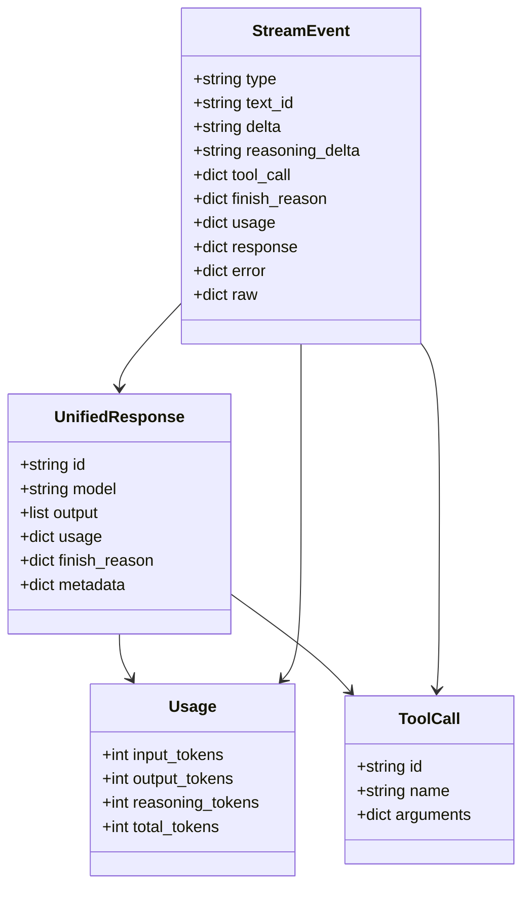
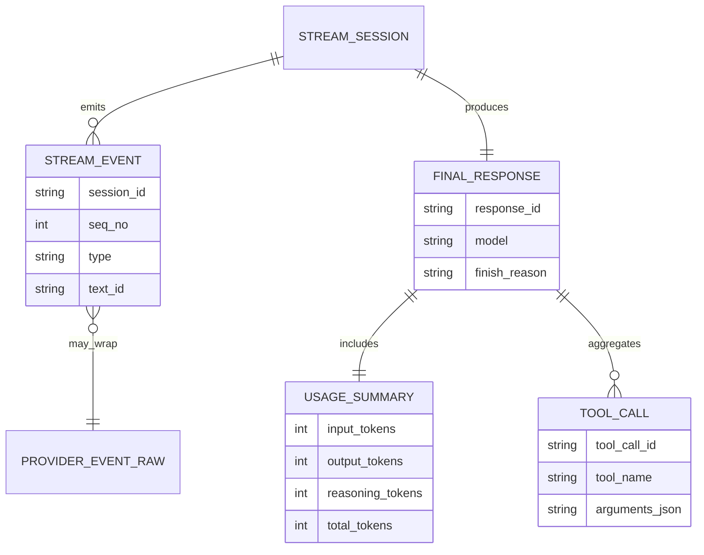
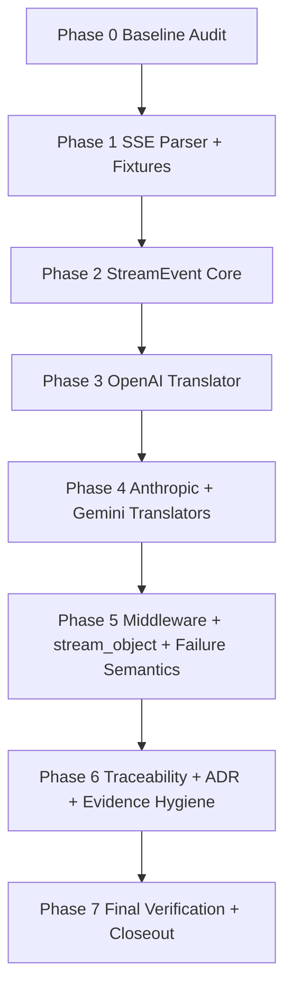
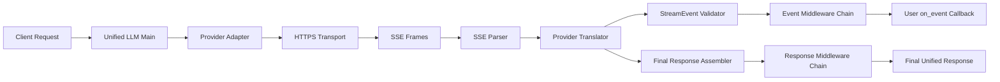
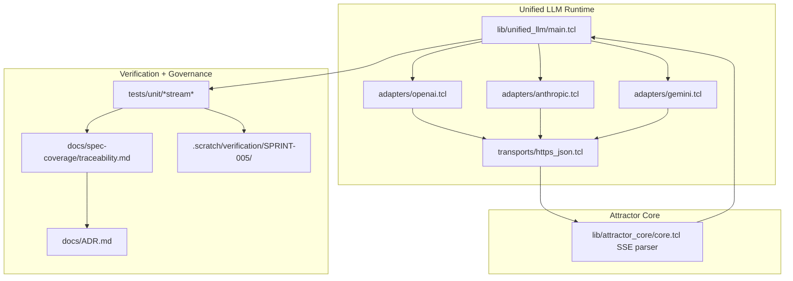

Legend: [ ] Incomplete, [X] Complete

# Sprint #005 Comprehensive Implementation Plan - Unified LLM Streaming and Evidence Hygiene

## Objective
Define an execution-ready implementation plan for `docs/sprints/SPRINT-005-unified-llm-streaming-evidence-hygiene.md` that delivers provider-native streaming translation, strict StreamEvent contract parity, and auditable evidence/traceability hygiene.

## Executive Summary
- [ ] E0.1 - Confirm all Sprint #005 source requirements are represented as executable deliverables in this plan before any implementation work begins.
```text
{placeholder for verification justification/reasoning and evidence log}
```
- [ ] E0.2 - Implement provider-native streaming translation for OpenAI, Anthropic, and Gemini without relying on post-hoc chunking from blocking responses.
```text
{placeholder for verification justification/reasoning and evidence log}
```
- [ ] E0.3 - Enforce StreamEvent ordering and field invariants (`STREAM_START`, `TEXT_*`, `REASONING_*`, `TOOL_CALL_*`, `FINISH`, `ERROR`, `PROVIDER_EVENT`) across adapters and fallback paths.
```text
{placeholder for verification justification/reasoning and evidence log}
```
- [ ] E0.4 - Close traceability and evidence hygiene gaps so streaming compliance is provable through requirement-specific tests and artifacts.
```text
{placeholder for verification justification/reasoning and evidence log}
```
- [ ] E0.5 - Complete sprint closeout only after deterministic build/test/spec/doc/evidence validation passes with explicit command logs and exit codes.
```text
{placeholder for verification justification/reasoning and evidence log}
```

## Source Sprint Review
The source sprint document defines five implementation tracks that are retained here as sequenced phases:
- Track A: SSE parsing contract hardening and fixtures.
- Track B: Unified StreamEvent parity and fallback behavior correctness.
- Track C: Provider-native OpenAI/Anthropic/Gemini stream translation.
- Track D: Middleware semantics, `stream_object`, and partial-stream failure rules.
- Track E: Requirement traceability precision, ADR capture, and evidence hygiene closure.

Key implementation risks identified in the source document:
- Synthetic stream behavior may still violate event lifecycle ordering in edge paths.
- Provider event mapping drift can cause silent contract gaps unless fixture coverage is explicit.
- Traceability entries can appear green while being too broad unless test selectors are streaming-specific.
- Documentation evidence blocks can drift from lint/guardrail contract without phase-level verification discipline.

## Scope
In scope:
- `lib/attractor_core/core.tcl` SSE contract behavior and `parse_sse` compatibility alias.
- `lib/unified_llm/main.tcl` StreamEvent helpers, fallback stream path, middleware/event sequencing, and `stream_object` behavior.
- `lib/unified_llm/adapters/openai.tcl`, `lib/unified_llm/adapters/anthropic.tcl`, `lib/unified_llm/adapters/gemini.tcl` provider-native translation.
- Streaming fixtures and deterministic tests under `tests/fixtures/` and `tests/unit/`.
- `docs/spec-coverage/traceability.md`, `docs/ADR.md`, and Sprint #005 docs for traceability/evidence closure.

Out of scope:
- New providers beyond OpenAI, Anthropic, and Gemini.
- Feature gating or compatibility shims for superseded behavior.
- Legacy behavior preservation where it conflicts with Sprint #005 requirements.

## Requirement Coverage Targets
- `ULLM-REQ-MOST-PROVIDERS-USE-SERVER-SENT-EVENTS`
- `ULLM-REQ-RESPONSES-API-STREAMING-FORMAT-PROVIDES-REASONING`
- `ULLM-DOD-8.29-YIELDS-EVENTS-CONCATENATE-FULL-RESPONSE-TEXT`
- `ULLM-DOD-8.30-YIELDS-EVENTS-CORRECT-METADATA`
- `ULLM-DOD-8.31-STREAMING-FOLLOWS-START-DELTA-END-PATTERN`
- `ULLM-DOD-8.70-STREAMING-DOES-RETRY-AFTER-PARTIAL-DATA`

## Execution Order
1. Phase 0 - Baseline audit and gap ledger.
2. Phase 1 - SSE parser contract and fixture corpus.
3. Phase 2 - Unified StreamEvent model and fallback path parity.
4. Phase 3 - OpenAI provider-native translator.
5. Phase 4 - Anthropic and Gemini provider-native translators.
6. Phase 5 - Middleware, `stream_object`, and partial-stream failure semantics.
7. Phase 6 - Traceability, ADR, and evidence hygiene closure.
8. Phase 7 - Final verification and sprint closeout.

## Completion Sync (2026-02-28)
- [ ] C0.1 - Phase status markers in this document are updated immediately after each phase-level acceptance criterion is verified.
```text
{placeholder for verification justification/reasoning and evidence log}
```
- [ ] C0.2 - No checklist item is marked complete without command output, exit code, and `.scratch` artifact references recorded beneath the item.
```text
{placeholder for verification justification/reasoning and evidence log}
```

## Phase 0 - Baseline Audit and Gap Ledger
### Deliverables
- [ ] P0.1 - Capture current baseline for build, full tests, streaming-focused selectors, docs lint, evidence lint, evidence guardrail, and spec coverage.
```text
{placeholder for verification justification/reasoning and evidence log}
```
- [ ] P0.2 - Produce a requirement-to-implementation gap ledger mapping each target requirement ID to code touchpoints, test selectors, and open gaps.
```text
{placeholder for verification justification/reasoning and evidence log}
```
- [ ] P0.3 - Create phase-scoped evidence directories under `.scratch/verification/SPRINT-005/comprehensive-plan/` and initialize a command status index.
```text
{placeholder for verification justification/reasoning and evidence log}
```

### Positive Test Cases
1. Baseline test harness resolves streaming selectors for SSE parser and provider translation suites.
2. Spec coverage check reports strict catalog/traceability equality with no unknown IDs.
3. Docs and evidence lint tools run clean against Sprint #005 planning and source sprint docs.

### Negative Test Cases
1. Remove a streaming selector from the gap ledger and confirm the ledger validation step reports the missing requirement mapping.
2. Introduce a malformed requirement mapping block in a local scratch copy and confirm spec coverage fails deterministically.
3. Omit a planned evidence directory in scratch setup and confirm automation reports missing output paths.

### Acceptance Criteria - Phase 0
- [ ] P0.A1 - Every target requirement ID has one owning phase deliverable and one concrete verification selector.
```text
{placeholder for verification justification/reasoning and evidence log}
```
- [ ] P0.A2 - Baseline artifacts and gap ledger are reproducible and persisted in sprint-scoped `.scratch` locations.
```text
{placeholder for verification justification/reasoning and evidence log}
```

## Phase 1 - SSE Parser Contract and Fixture Corpus
### Deliverables
- [ ] P1.1 - Harden `::attractor_core::sse_parse` for EOF flush semantics, multiline `data:` handling, comment behavior, and `event`/`id`/`retry` propagation.
```text
{placeholder for verification justification/reasoning and evidence log}
```
- [ ] P1.2 - Add and validate `::attractor_core::parse_sse` as compatibility alias/wrapper with parity behavior to `sse_parse`.
```text
{placeholder for verification justification/reasoning and evidence log}
```
- [ ] P1.3 - Expand fixture corpus in `tests/fixtures/unified_llm_streaming/` for text, tool-call, reasoning, terminal, unknown, and malformed SSE payloads for all providers.
```text
{placeholder for verification justification/reasoning and evidence log}
```
- [ ] P1.4 - Add parser regression tests for EOF-without-blank-line, comment-only lines, ignored fields, empty events, and malformed framing.
```text
{placeholder for verification justification/reasoning and evidence log}
```

### Positive Test Cases
1. Parser emits final event when stream ends without trailing blank separator.
2. Multiline `data:` frames preserve order and newline join semantics.
3. `parse_sse` and `sse_parse` return equivalent parsed event dictionaries for identical payloads.
4. Provider fixture frames parse to deterministic event boundaries with no network dependency.

### Negative Test Cases
1. Invalid `retry:` values are ignored or normalized without parser crash.
2. Unknown SSE fields remain excluded from parsed event dict output.
3. Malformed frame boundaries trigger deterministic downstream translator failures.

### Acceptance Criteria - Phase 1
- [ ] P1.A1 - SSE parsing behavior is deterministic, spec-aligned, and regression-covered for required edge conditions.
```text
{placeholder for verification justification/reasoning and evidence log}
```
- [ ] P1.A2 - Fixture corpus is sufficient for adapter translation tests across OpenAI, Anthropic, and Gemini.
```text
{placeholder for verification justification/reasoning and evidence log}
```

## Phase 2 - Unified StreamEvent Model and Fallback Parity
### Deliverables
- [ ] P2.1 - Implement/refine StreamEvent helper validation for required keys, optional keys, and type-specific invariants.
```text
{placeholder for verification justification/reasoning and evidence log}
```
- [ ] P2.2 - Enforce ordering invariants: `STREAM_START` first, `FINISH` last, valid `text_id` lifecycle for `TEXT_START`/`TEXT_DELTA`/`TEXT_END`, and deterministic `ERROR` terminal behavior.
```text
{placeholder for verification justification/reasoning and evidence log}
```
- [ ] P2.3 - Update fallback synthetic streaming path to emit full text lifecycle events and preserve tool-call boundaries.
```text
{placeholder for verification justification/reasoning and evidence log}
```
- [ ] P2.4 - Ensure unmapped provider events emit `PROVIDER_EVENT` and malformed payload paths emit normalized `ERROR` events.
```text
{placeholder for verification justification/reasoning and evidence log}
```

### Positive Test Cases
1. Ordered stream tests confirm the sequence `STREAM_START -> TEXT_START -> TEXT_DELTA* -> TEXT_END -> FINISH`.
2. Concatenation tests confirm `TEXT_DELTA` content equals final response text.
3. Metadata tests confirm final usage/finish metadata is preserved on `FINISH`.
4. Fallback stream tests confirm tool-call boundaries survive synthetic path translation.

### Negative Test Cases
1. Emit `TEXT_DELTA` before `TEXT_START` and assert deterministic validation failure.
2. Terminate stream without `FINISH` and assert consumer receives typed incomplete-stream failure.
3. Feed malformed JSON payload into translator and assert `ERROR` event emission with structured error object.
4. Feed unknown provider event type and assert passthrough `PROVIDER_EVENT` without stream crash.

### Acceptance Criteria - Phase 2
- [ ] P2.A1 - StreamEvent ordering and lifecycle rules are runtime-enforced and covered by deterministic unit tests.
```text
{placeholder for verification justification/reasoning and evidence log}
```
- [ ] P2.A2 - Fallback streaming path behavior matches sprint contract for text/tool boundaries and terminal state events.
```text
{placeholder for verification justification/reasoning and evidence log}
```

## Phase 3 - OpenAI Provider-Native Streaming Translator
### Deliverables
- [ ] P3.1 - Replace OpenAI `stream` chunking-from-`complete` behavior with provider-native SSE translation.
```text
{placeholder for verification justification/reasoning and evidence log}
```
- [ ] P3.2 - Map OpenAI response event types to StreamEvent contract, including text lifecycle, tool-call deltas, and finish metadata.
```text
{placeholder for verification justification/reasoning and evidence log}
```
- [ ] P3.3 - Implement deterministic assembly of partial function-call argument deltas into decoded tool argument dictionaries at `TOOL_CALL_END`.
```text
{placeholder for verification justification/reasoning and evidence log}
```
- [ ] P3.4 - Validate malformed JSON after partial deltas emits `ERROR`, stops stream, and does not retry transport.
```text
{placeholder for verification justification/reasoning and evidence log}
```

### Positive Test Cases
1. OpenAI text fixture emits `TEXT_START`, `TEXT_DELTA`, `TEXT_END`, and terminal `FINISH`.
2. OpenAI tool-call fixture emits `TOOL_CALL_START`, `TOOL_CALL_DELTA`, `TOOL_CALL_END` with decoded argument dict.
3. OpenAI finish fixture carries usage fields including reasoning token counts where present.

### Negative Test Cases
1. Unknown OpenAI event type surfaces as `PROVIDER_EVENT` with raw payload.
2. Invalid OpenAI JSON frame after partial output emits `ERROR` and suppresses `FINISH`.
3. Stream error after one delta confirms no second transport invocation occurs.

### Acceptance Criteria - Phase 3
- [ ] P3.A1 - OpenAI adapter uses provider-native streaming translation and never constructs stream events by chunking blocking output.
```text
{placeholder for verification justification/reasoning and evidence log}
```
- [ ] P3.A2 - OpenAI event mapping, tool-call assembly, and error semantics are fixture-verified and deterministic.
```text
{placeholder for verification justification/reasoning and evidence log}
```

## Phase 4 - Anthropic and Gemini Provider-Native Streaming Translators
### Deliverables
- [ ] P4.1 - Implement Anthropic streaming mapping for text/tool_use/thinking blocks into `TEXT_*`, `TOOL_CALL_*`, and `REASONING_*` events.
```text
{placeholder for verification justification/reasoning and evidence log}
```
- [ ] P4.2 - Implement Gemini `:streamGenerateContent?alt=sse` mapping for text and function calls into StreamEvent contract.
```text
{placeholder for verification justification/reasoning and evidence log}
```
- [ ] P4.3 - Ensure Anthropic and Gemini translators emit deterministic terminal `FINISH` events with unified response and usage mapping.
```text
{placeholder for verification justification/reasoning and evidence log}
```
- [ ] P4.4 - Handle unmapped provider blocks/events as `PROVIDER_EVENT` without data loss or translator crashes.
```text
{placeholder for verification justification/reasoning and evidence log}
```

### Positive Test Cases
1. Anthropic fixture with text/tool/thinking blocks emits full lifecycle events including `REASONING_START`/`REASONING_DELTA`/`REASONING_END`.
2. Gemini fixture with text and function-call parts emits text lifecycle and tool-call lifecycle events.
3. Gemini no-explicit-finish fixture still results in deterministic `TEXT_END` and `FINISH` emission at stream completion.

### Negative Test Cases
1. Anthropic unknown content block type is surfaced as `PROVIDER_EVENT`.
2. Gemini malformed JSON frame emits `ERROR` and stops stream deterministically.
3. Anthropic malformed tool payload does not crash translator and emits typed `ERROR`.

### Acceptance Criteria - Phase 4
- [ ] P4.A1 - Anthropic and Gemini adapters are provider-native and spec-faithful for text, tool-call, and reasoning mappings.
```text
{placeholder for verification justification/reasoning and evidence log}
```
- [ ] P4.A2 - Cross-provider negative-path behavior emits consistent `ERROR`/`PROVIDER_EVENT` semantics without retries after partial data.
```text
{placeholder for verification justification/reasoning and evidence log}
```

## Phase 5 - Middleware, stream_object, and Partial-Stream Failure Semantics
### Deliverables
- [ ] P5.1 - Ensure stream request/event/response middleware ordering matches contract and preserves response assembly correctness.
```text
{placeholder for verification justification/reasoning and evidence log}
```
- [ ] P5.2 - Update `stream_object` to handle expanded StreamEvent model while buffering only text deltas for schema validation at completion.
```text
{placeholder for verification justification/reasoning and evidence log}
```
- [ ] P5.3 - Add explicit tests for invalid JSON object streams, schema mismatches, and missing terminal events in `stream_object` flows.
```text
{placeholder for verification justification/reasoning and evidence log}
```
- [ ] P5.4 - Verify no-retry-after-partial-data behavior at runtime using transport call-count assertions.
```text
{placeholder for verification justification/reasoning and evidence log}
```

### Positive Test Cases
1. Middleware transforms text deltas and final response in defined order without altering event lifecycle validity.
2. Valid structured JSON object stream triggers `on_object` callback exactly once with schema-valid dict.
3. Partial-output failure path emits `ERROR` and transport call count remains exactly one.

### Negative Test Cases
1. Invalid JSON object stream fails with typed parse error and no object callback invocation.
2. Schema mismatch in structured output path fails with typed validation error and deterministic diagnostics.
3. Missing `FINISH` event prevents object callback and yields deterministic incomplete-stream error.

### Acceptance Criteria - Phase 5
- [ ] P5.A1 - Middleware and structured streaming behavior is contract-compliant and deterministic in both success and failure cases.
```text
{placeholder for verification justification/reasoning and evidence log}
```
- [ ] P5.A2 - Partial-stream transport failures never trigger retry and always surface a terminal `ERROR` event.
```text
{placeholder for verification justification/reasoning and evidence log}
```

## Phase 6 - Traceability, ADR, and Evidence Hygiene Closure
### Deliverables
- [ ] P6.1 - Tighten streaming requirement mappings in `docs/spec-coverage/traceability.md` to requirement-specific tests/selectors.
```text
{placeholder for verification justification/reasoning and evidence log}
```
- [ ] P6.2 - Add ADR entry in `docs/ADR.md` documenting StreamEvent expansion, provider-native translation decisions, and consequences.
```text
{placeholder for verification justification/reasoning and evidence log}
```
- [ ] P6.3 - Ensure Sprint #005 docs pass docs lint, evidence lint, and evidence guardrail with truthful command/evidence annotations.
```text
{placeholder for verification justification/reasoning and evidence log}
```
- [ ] P6.4 - Capture phase-complete evidence index that links requirement IDs to commands, exit codes, and artifacts.
```text
{placeholder for verification justification/reasoning and evidence log}
```

### Positive Test Cases
1. Spec coverage passes with strict catalog equality and no duplicate/unknown/malformed mapping blocks.
2. Evidence lint passes for Sprint #005 docs after completed items have command, exit code, and artifact references.
3. Evidence guardrail confirms all referenced `.scratch` evidence files exist.

### Negative Test Cases
1. Broad wildcard verify selector for streaming requirement fails traceability review checklist.
2. Completed checklist item missing exit code annotation fails evidence lint.
3. Referenced `.scratch` artifact missing on disk fails evidence guardrail.

### Acceptance Criteria - Phase 6
- [ ] P6.A1 - Target streaming requirement IDs map to streaming-specific tests and remain spec-coverage clean.
```text
{placeholder for verification justification/reasoning and evidence log}
```
- [ ] P6.A2 - ADR and evidence hygiene artifacts are complete, auditable, and lint/guardrail compliant.
```text
{placeholder for verification justification/reasoning and evidence log}
```

## Phase 7 - Final Verification and Closeout
### Deliverables
- [ ] P7.1 - Execute final deterministic verification suite: build, full tests, streaming selectors, spec coverage, docs lint, evidence lint, and evidence guardrail.
```text
{placeholder for verification justification/reasoning and evidence log}
```
- [ ] P7.2 - Record final command status matrix with explicit exit codes and artifact paths under sprint-scoped `.scratch`.
```text
{placeholder for verification justification/reasoning and evidence log}
```
- [ ] P7.3 - Update Sprint #005 source sprint document completion sync entries to match verified implementation reality.
```text
{placeholder for verification justification/reasoning and evidence log}
```
- [ ] P7.4 - Confirm appendix mermaid sources and rendered outputs are present, current, and linked from evidence notes.
```text
{placeholder for verification justification/reasoning and evidence log}
```

### Positive Test Cases
1. Final full-suite verification executes clean with all required selectors and lint gates passing.
2. Final command status matrix contains no missing log references and no non-zero exit codes.
3. Source sprint completion state matches actual implementation status without stale completed markers.

### Negative Test Cases
1. Any non-zero verification command blocks closeout and leaves corresponding checklist item incomplete.
2. Missing evidence artifact blocks closeout and fails evidence guardrail.
3. Drift between source sprint status and verified results blocks closeout sync completion.

### Acceptance Criteria - Phase 7
- [ ] P7.A1 - Sprint can be closed only when all phase acceptance criteria are complete with supporting evidence artifacts.
```text
{placeholder for verification justification/reasoning and evidence log}
```
- [ ] P7.A2 - Final verification matrix is reproducible and fully traceable from requirements to implementation to tests.
```text
{placeholder for verification justification/reasoning and evidence log}
```

## Verification Command Matrix (To Run As Items Complete)
- `make build`
- `make test`
- `tclsh tests/all.tcl -match *attractor_core-sse*`
- `tclsh tests/all.tcl -match *unified_llm-openai-stream-translation*`
- `tclsh tests/all.tcl -match *unified_llm-anthropic-stream-translation*`
- `tclsh tests/all.tcl -match *unified_llm-gemini-stream-translation*`
- `tclsh tests/all.tcl -match *unified_llm-stream-event-model*`
- `tclsh tests/all.tcl -match *unified_llm-stream-tool-call*`
- `tclsh tests/all.tcl -match *unified_llm-stream-object*`
- `tclsh tests/all.tcl -match *unified_llm-stream-no-retry-after-partial*`
- `tclsh tools/spec_coverage.tcl`
- `bash tools/docs_lint.sh`
- `bash tools/evidence_lint.sh docs/sprints/SPRINT-005-unified-llm-streaming-evidence-hygiene.md`
- `bash tools/evidence_lint.sh docs/sprints/SPRINT-005-comprehensive-implementation-plan.md`
- `tclsh tools/evidence_guardrail.tcl docs/sprints/SPRINT-005-unified-llm-streaming-evidence-hygiene.md docs/sprints/SPRINT-005-comprehensive-implementation-plan.md`

## Appendix - Mermaid Diagrams

### Core Domain Models


### E-R Diagram


### Workflow Diagram


### Data-Flow Diagram


### Architecture Diagram

