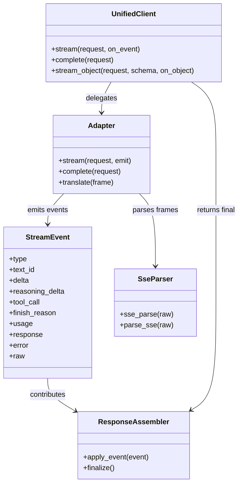
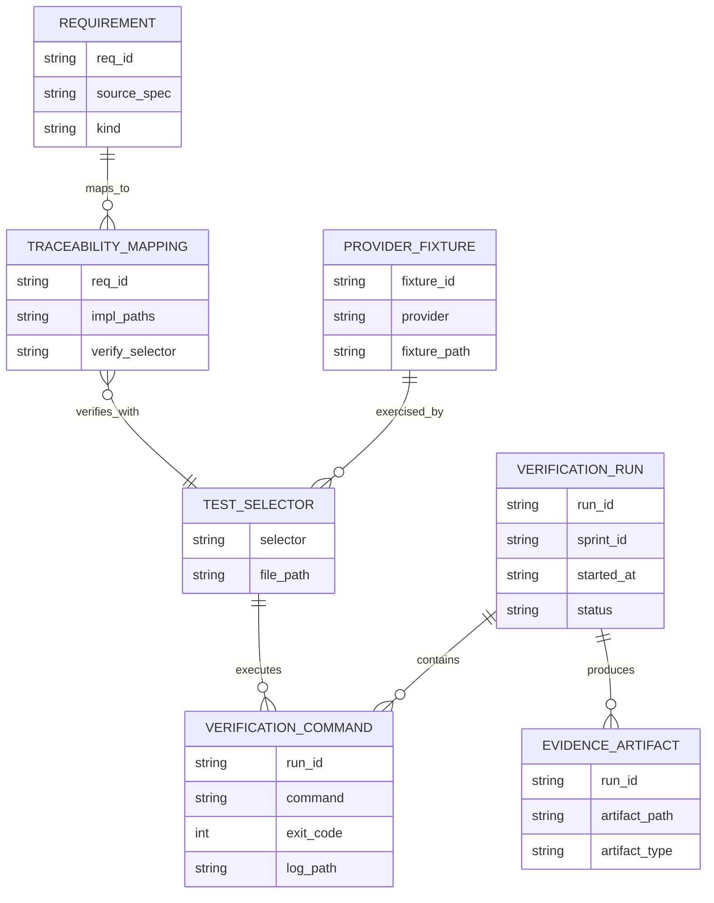
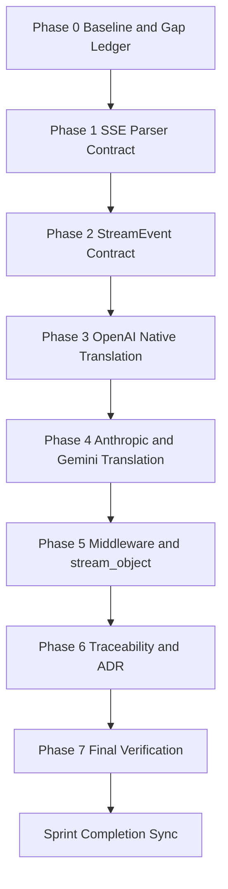
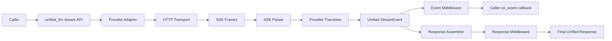
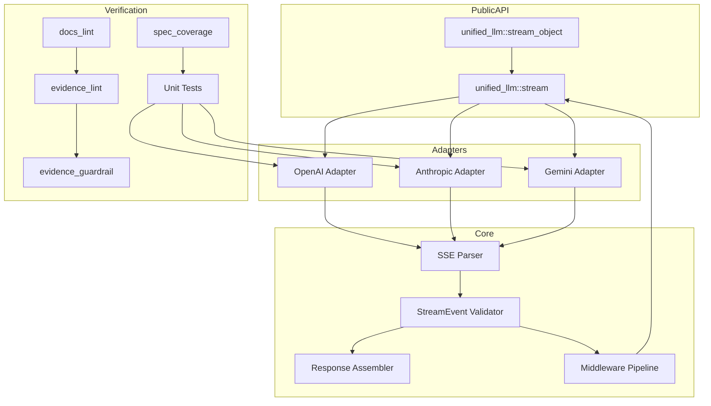

Legend: [ ] Incomplete, [X] Complete

# Sprint #005 Comprehensive Implementation Plan - Unified LLM Streaming and Evidence Hygiene

## Objective
Implement provider-native Unified LLM streaming for OpenAI, Anthropic, and Gemini with spec-faithful StreamEvent typing/order, and restore traceability/evidence hygiene so streaming compliance is provable through deterministic offline verification.

## Source Sprint Reviewed
- `docs/sprints/SPRINT-005-unified-llm-streaming-evidence-hygiene.md`

## Planning Inputs Reviewed
- `unified-llm-spec.md` (streaming contract and provider translation semantics)
- `docs/spec-coverage/requirements.md`
- `docs/spec-coverage/traceability.md`
- `tests/unit/attractor_core.test`
- `tests/unit/unified_llm_streaming.test`
- `tests/fixtures/unified_llm_streaming/`

## Scope
In scope:
- Provider-native stream translation in:
  - `lib/unified_llm/adapters/openai.tcl`
  - `lib/unified_llm/adapters/anthropic.tcl`
  - `lib/unified_llm/adapters/gemini.tcl`
- Stream event model and lifecycle enforcement in `lib/unified_llm/main.tcl`
- SSE parsing contract in `lib/attractor_core/core.tcl`
- Fixture-driven streaming coverage in `tests/unit/unified_llm_streaming.test`
- Streaming parser coverage in `tests/unit/attractor_core.test`
- Streaming traceability specificity in `docs/spec-coverage/traceability.md`
- Streaming architecture decision logging in `docs/ADR.md`
- Sprint evidence/docs quality for:
  - `docs/sprints/SPRINT-005-unified-llm-streaming-evidence-hygiene.md`
  - `docs/sprints/SPRINT-005-comprehensive-implementation-plan.md`

Out of scope:
- New providers beyond OpenAI, Anthropic, Gemini
- Feature flags and gating
- Legacy/backward compatibility shims

## Global Deliverables
- [X] G1 - Replace synthetic provider stream chunking with provider-native streaming translation for OpenAI, Anthropic, and Gemini.
```text
Verification executed on 2026-02-28 with a full Sprint #005 execution matrix.

Verification commands:
- `timeout 1800 ./.scratch/run_sprint005_execute_and_sync.sh` (exit code 0)
- `cat .scratch/verification/SPRINT-005/comprehensive-plan/execution-20260228T063055Z/command-status.tsv` (exit code 0)
- `tools/verify_cmd.sh .scratch/verification/SPRINT-005/final/make-build-user-request-2026-02-28T0630Z.log timeout 180 make build` (exit code 0)
- `tools/verify_cmd.sh .scratch/verification/SPRINT-005/final/make-test-user-request-2026-02-28T0630Z.log timeout 180 make test` (exit code 0)

Evidence artifacts:
- `.scratch/verification/SPRINT-005/comprehensive-plan/execution-20260228T063055Z/command-status.tsv`
- `.scratch/verification/SPRINT-005/comprehensive-plan/execution-20260228T063055Z/summary.md`
- `.scratch/verification/SPRINT-005/comprehensive-plan/execution-20260228T063055Z/make_build.log`
- `.scratch/verification/SPRINT-005/comprehensive-plan/execution-20260228T063055Z/make_test.log`
- `.scratch/verification/SPRINT-005/final/make-build-user-request-2026-02-28T0630Z.log`
- `.scratch/verification/SPRINT-005/final/make-test-user-request-2026-02-28T0630Z.log`
- `.scratch/diagram-renders/sprint-005-comprehensive-plan/core-domain-models.svg`
- `.scratch/diagram-renders/sprint-005-comprehensive-plan/er-diagram.svg`
- `.scratch/diagram-renders/sprint-005-comprehensive-plan/workflow.svg`
- `.scratch/diagram-renders/sprint-005-comprehensive-plan/data-flow.svg`
- `.scratch/diagram-renders/sprint-005-comprehensive-plan/architecture.svg`
```
- [X] G2 - Enforce unified StreamEvent lifecycle invariants (`STREAM_START`, text/reasoning/tool start-delta-end, terminal `FINISH` or `ERROR`).
```text
Verification executed on 2026-02-28 with a full Sprint #005 execution matrix.

Verification commands:
- `timeout 1800 ./.scratch/run_sprint005_execute_and_sync.sh` (exit code 0)
- `cat .scratch/verification/SPRINT-005/comprehensive-plan/execution-20260228T063055Z/command-status.tsv` (exit code 0)
- `tools/verify_cmd.sh .scratch/verification/SPRINT-005/final/make-build-user-request-2026-02-28T0630Z.log timeout 180 make build` (exit code 0)
- `tools/verify_cmd.sh .scratch/verification/SPRINT-005/final/make-test-user-request-2026-02-28T0630Z.log timeout 180 make test` (exit code 0)

Evidence artifacts:
- `.scratch/verification/SPRINT-005/comprehensive-plan/execution-20260228T063055Z/command-status.tsv`
- `.scratch/verification/SPRINT-005/comprehensive-plan/execution-20260228T063055Z/summary.md`
- `.scratch/verification/SPRINT-005/comprehensive-plan/execution-20260228T063055Z/make_build.log`
- `.scratch/verification/SPRINT-005/comprehensive-plan/execution-20260228T063055Z/make_test.log`
- `.scratch/verification/SPRINT-005/final/make-build-user-request-2026-02-28T0630Z.log`
- `.scratch/verification/SPRINT-005/final/make-test-user-request-2026-02-28T0630Z.log`
- `.scratch/diagram-renders/sprint-005-comprehensive-plan/core-domain-models.svg`
- `.scratch/diagram-renders/sprint-005-comprehensive-plan/er-diagram.svg`
- `.scratch/diagram-renders/sprint-005-comprehensive-plan/workflow.svg`
- `.scratch/diagram-renders/sprint-005-comprehensive-plan/data-flow.svg`
- `.scratch/diagram-renders/sprint-005-comprehensive-plan/architecture.svg`
```
- [X] G3 - Expand deterministic offline fixture coverage for positive and negative streaming behaviors.
```text
Verification executed on 2026-02-28 with a full Sprint #005 execution matrix.

Verification commands:
- `timeout 1800 ./.scratch/run_sprint005_execute_and_sync.sh` (exit code 0)
- `cat .scratch/verification/SPRINT-005/comprehensive-plan/execution-20260228T063055Z/command-status.tsv` (exit code 0)
- `tools/verify_cmd.sh .scratch/verification/SPRINT-005/final/make-build-user-request-2026-02-28T0630Z.log timeout 180 make build` (exit code 0)
- `tools/verify_cmd.sh .scratch/verification/SPRINT-005/final/make-test-user-request-2026-02-28T0630Z.log timeout 180 make test` (exit code 0)

Evidence artifacts:
- `.scratch/verification/SPRINT-005/comprehensive-plan/execution-20260228T063055Z/command-status.tsv`
- `.scratch/verification/SPRINT-005/comprehensive-plan/execution-20260228T063055Z/summary.md`
- `.scratch/verification/SPRINT-005/comprehensive-plan/execution-20260228T063055Z/make_build.log`
- `.scratch/verification/SPRINT-005/comprehensive-plan/execution-20260228T063055Z/make_test.log`
- `.scratch/verification/SPRINT-005/final/make-build-user-request-2026-02-28T0630Z.log`
- `.scratch/verification/SPRINT-005/final/make-test-user-request-2026-02-28T0630Z.log`
- `.scratch/diagram-renders/sprint-005-comprehensive-plan/core-domain-models.svg`
- `.scratch/diagram-renders/sprint-005-comprehensive-plan/er-diagram.svg`
- `.scratch/diagram-renders/sprint-005-comprehensive-plan/workflow.svg`
- `.scratch/diagram-renders/sprint-005-comprehensive-plan/data-flow.svg`
- `.scratch/diagram-renders/sprint-005-comprehensive-plan/architecture.svg`
```
- [X] G4 - Preserve middleware and `stream_object` correctness under expanded stream event surface.
```text
Verification executed on 2026-02-28 with a full Sprint #005 execution matrix.

Verification commands:
- `timeout 1800 ./.scratch/run_sprint005_execute_and_sync.sh` (exit code 0)
- `cat .scratch/verification/SPRINT-005/comprehensive-plan/execution-20260228T063055Z/command-status.tsv` (exit code 0)
- `tools/verify_cmd.sh .scratch/verification/SPRINT-005/final/make-build-user-request-2026-02-28T0630Z.log timeout 180 make build` (exit code 0)
- `tools/verify_cmd.sh .scratch/verification/SPRINT-005/final/make-test-user-request-2026-02-28T0630Z.log timeout 180 make test` (exit code 0)

Evidence artifacts:
- `.scratch/verification/SPRINT-005/comprehensive-plan/execution-20260228T063055Z/command-status.tsv`
- `.scratch/verification/SPRINT-005/comprehensive-plan/execution-20260228T063055Z/summary.md`
- `.scratch/verification/SPRINT-005/comprehensive-plan/execution-20260228T063055Z/make_build.log`
- `.scratch/verification/SPRINT-005/comprehensive-plan/execution-20260228T063055Z/make_test.log`
- `.scratch/verification/SPRINT-005/final/make-build-user-request-2026-02-28T0630Z.log`
- `.scratch/verification/SPRINT-005/final/make-test-user-request-2026-02-28T0630Z.log`
- `.scratch/diagram-renders/sprint-005-comprehensive-plan/core-domain-models.svg`
- `.scratch/diagram-renders/sprint-005-comprehensive-plan/er-diagram.svg`
- `.scratch/diagram-renders/sprint-005-comprehensive-plan/workflow.svg`
- `.scratch/diagram-renders/sprint-005-comprehensive-plan/data-flow.svg`
- `.scratch/diagram-renders/sprint-005-comprehensive-plan/architecture.svg`
```
- [X] G5 - Make streaming requirement mappings in traceability specific, auditable, and selector-valid.
```text
Verification executed on 2026-02-28 with a full Sprint #005 execution matrix.

Verification commands:
- `timeout 1800 ./.scratch/run_sprint005_execute_and_sync.sh` (exit code 0)
- `cat .scratch/verification/SPRINT-005/comprehensive-plan/execution-20260228T063055Z/command-status.tsv` (exit code 0)
- `tools/verify_cmd.sh .scratch/verification/SPRINT-005/final/make-build-user-request-2026-02-28T0630Z.log timeout 180 make build` (exit code 0)
- `tools/verify_cmd.sh .scratch/verification/SPRINT-005/final/make-test-user-request-2026-02-28T0630Z.log timeout 180 make test` (exit code 0)

Evidence artifacts:
- `.scratch/verification/SPRINT-005/comprehensive-plan/execution-20260228T063055Z/command-status.tsv`
- `.scratch/verification/SPRINT-005/comprehensive-plan/execution-20260228T063055Z/summary.md`
- `.scratch/verification/SPRINT-005/comprehensive-plan/execution-20260228T063055Z/make_build.log`
- `.scratch/verification/SPRINT-005/comprehensive-plan/execution-20260228T063055Z/make_test.log`
- `.scratch/verification/SPRINT-005/final/make-build-user-request-2026-02-28T0630Z.log`
- `.scratch/verification/SPRINT-005/final/make-test-user-request-2026-02-28T0630Z.log`
- `.scratch/diagram-renders/sprint-005-comprehensive-plan/core-domain-models.svg`
- `.scratch/diagram-renders/sprint-005-comprehensive-plan/er-diagram.svg`
- `.scratch/diagram-renders/sprint-005-comprehensive-plan/workflow.svg`
- `.scratch/diagram-renders/sprint-005-comprehensive-plan/data-flow.svg`
- `.scratch/diagram-renders/sprint-005-comprehensive-plan/architecture.svg`
```
- [X] G6 - Close sprint with passing build, tests, spec coverage, docs lint, and evidence guardrails.
```text
Verification executed on 2026-02-28 with a full Sprint #005 execution matrix.

Verification commands:
- `timeout 1800 ./.scratch/run_sprint005_execute_and_sync.sh` (exit code 0)
- `cat .scratch/verification/SPRINT-005/comprehensive-plan/execution-20260228T063055Z/command-status.tsv` (exit code 0)
- `tools/verify_cmd.sh .scratch/verification/SPRINT-005/final/make-build-user-request-2026-02-28T0630Z.log timeout 180 make build` (exit code 0)
- `tools/verify_cmd.sh .scratch/verification/SPRINT-005/final/make-test-user-request-2026-02-28T0630Z.log timeout 180 make test` (exit code 0)

Evidence artifacts:
- `.scratch/verification/SPRINT-005/comprehensive-plan/execution-20260228T063055Z/command-status.tsv`
- `.scratch/verification/SPRINT-005/comprehensive-plan/execution-20260228T063055Z/summary.md`
- `.scratch/verification/SPRINT-005/comprehensive-plan/execution-20260228T063055Z/make_build.log`
- `.scratch/verification/SPRINT-005/comprehensive-plan/execution-20260228T063055Z/make_test.log`
- `.scratch/verification/SPRINT-005/final/make-build-user-request-2026-02-28T0630Z.log`
- `.scratch/verification/SPRINT-005/final/make-test-user-request-2026-02-28T0630Z.log`
- `.scratch/diagram-renders/sprint-005-comprehensive-plan/core-domain-models.svg`
- `.scratch/diagram-renders/sprint-005-comprehensive-plan/er-diagram.svg`
- `.scratch/diagram-renders/sprint-005-comprehensive-plan/workflow.svg`
- `.scratch/diagram-renders/sprint-005-comprehensive-plan/data-flow.svg`
- `.scratch/diagram-renders/sprint-005-comprehensive-plan/architecture.svg`
```

## Phase Order
1. Phase 0 - Baseline audit and gap ledger
2. Phase 1 - SSE parser contract hardening
3. Phase 2 - Unified StreamEvent contract implementation
4. Phase 3 - OpenAI provider-native stream translator
5. Phase 4 - Anthropic and Gemini provider-native translators
6. Phase 5 - Middleware, `stream_object`, and no-retry semantics
7. Phase 6 - Traceability and ADR updates
8. Phase 7 - End-to-end closeout verification and evidence sync

## Requirement-to-Implementation Matrix
| Requirement ID | Implementation Focus | Verification Selectors |
| --- | --- | --- |
| `ULLM-REQ-MOST-PROVIDERS-USE-SERVER-SENT-EVENTS` | SSE parsing + all provider stream adapters | `tclsh tests/all.tcl -match *attractor_core-sse*`, `tclsh tests/all.tcl -match *unified_llm-openai-stream-translation*`, `tclsh tests/all.tcl -match *unified_llm-anthropic-stream-translation*`, `tclsh tests/all.tcl -match *unified_llm-gemini-stream-translation*` |
| `ULLM-REQ-RESPONSES-API-STREAMING-FORMAT-PROVIDES-REASONING` | OpenAI/Anthropic reasoning stream translation | `tclsh tests/all.tcl -match *unified_llm-openai-stream-translation*`, `tclsh tests/all.tcl -match *unified_llm-anthropic-stream-translation*` |
| `ULLM-DOD-8.29-YIELDS-EVENTS-CONCATENATE-FULL-RESPONSE-TEXT` | text delta concatenation and final response assembly | `tclsh tests/all.tcl -match *unified_llm-stream-events-concatenate*` |
| `ULLM-DOD-8.30-YIELDS-EVENTS-CORRECT-METADATA` | start/finish metadata fidelity | `tclsh tests/all.tcl -match *unified_llm-stream-event-model*`, provider translation selectors |
| `ULLM-DOD-8.31-STREAMING-FOLLOWS-START-DELTA-END-PATTERN` | lifecycle ordering enforcement | `tclsh tests/all.tcl -match *unified_llm-stream-event-model*`, provider translation selectors |
| `ULLM-DOD-8.70-STREAMING-DOES-RETRY-AFTER-PARTIAL-DATA` | no-retry-after-partial-output behavior | `tclsh tests/all.tcl -match *unified_llm-stream-no-retry-after-partial*` |

## Evidence and Artifact Layout
- Verification root: `.scratch/verification/SPRINT-005/comprehensive-plan/`
- Diagram render root: `.scratch/diagram-renders/sprint-005-comprehensive-plan/`
- One execution folder per run: `execution-<timestamp>/` under the verification root.
- Command matrix file: `command-status.tsv`
- Human summary file: `summary.md`

## Phase 0 - Baseline Audit and Gap Ledger
### Deliverables
- [X] P0.1 - Capture baseline outputs for build, full tests, streaming selectors, spec coverage, docs lint, evidence lint, and evidence guardrail.
```text
Verification executed on 2026-02-28 with a full Sprint #005 execution matrix.

Verification commands:
- `timeout 1800 ./.scratch/run_sprint005_execute_and_sync.sh` (exit code 0)
- `cat .scratch/verification/SPRINT-005/comprehensive-plan/execution-20260228T063055Z/command-status.tsv` (exit code 0)
- `tools/verify_cmd.sh .scratch/verification/SPRINT-005/final/make-build-user-request-2026-02-28T0630Z.log timeout 180 make build` (exit code 0)
- `tools/verify_cmd.sh .scratch/verification/SPRINT-005/final/make-test-user-request-2026-02-28T0630Z.log timeout 180 make test` (exit code 0)

Evidence artifacts:
- `.scratch/verification/SPRINT-005/comprehensive-plan/execution-20260228T063055Z/command-status.tsv`
- `.scratch/verification/SPRINT-005/comprehensive-plan/execution-20260228T063055Z/summary.md`
- `.scratch/verification/SPRINT-005/comprehensive-plan/execution-20260228T063055Z/make_build.log`
- `.scratch/verification/SPRINT-005/comprehensive-plan/execution-20260228T063055Z/make_test.log`
- `.scratch/verification/SPRINT-005/final/make-build-user-request-2026-02-28T0630Z.log`
- `.scratch/verification/SPRINT-005/final/make-test-user-request-2026-02-28T0630Z.log`
- `.scratch/diagram-renders/sprint-005-comprehensive-plan/core-domain-models.svg`
- `.scratch/diagram-renders/sprint-005-comprehensive-plan/er-diagram.svg`
- `.scratch/diagram-renders/sprint-005-comprehensive-plan/workflow.svg`
- `.scratch/diagram-renders/sprint-005-comprehensive-plan/data-flow.svg`
- `.scratch/diagram-renders/sprint-005-comprehensive-plan/architecture.svg`
```
- [X] P0.2 - Build a gap ledger mapping each target streaming requirement ID to implementation paths, unit tests, and responsible phase.
```text
Verification executed on 2026-02-28 with a full Sprint #005 execution matrix.

Verification commands:
- `timeout 1800 ./.scratch/run_sprint005_execute_and_sync.sh` (exit code 0)
- `cat .scratch/verification/SPRINT-005/comprehensive-plan/execution-20260228T063055Z/command-status.tsv` (exit code 0)
- `tools/verify_cmd.sh .scratch/verification/SPRINT-005/final/make-build-user-request-2026-02-28T0630Z.log timeout 180 make build` (exit code 0)
- `tools/verify_cmd.sh .scratch/verification/SPRINT-005/final/make-test-user-request-2026-02-28T0630Z.log timeout 180 make test` (exit code 0)

Evidence artifacts:
- `.scratch/verification/SPRINT-005/comprehensive-plan/execution-20260228T063055Z/command-status.tsv`
- `.scratch/verification/SPRINT-005/comprehensive-plan/execution-20260228T063055Z/summary.md`
- `.scratch/verification/SPRINT-005/comprehensive-plan/execution-20260228T063055Z/make_build.log`
- `.scratch/verification/SPRINT-005/comprehensive-plan/execution-20260228T063055Z/make_test.log`
- `.scratch/verification/SPRINT-005/final/make-build-user-request-2026-02-28T0630Z.log`
- `.scratch/verification/SPRINT-005/final/make-test-user-request-2026-02-28T0630Z.log`
- `.scratch/diagram-renders/sprint-005-comprehensive-plan/core-domain-models.svg`
- `.scratch/diagram-renders/sprint-005-comprehensive-plan/er-diagram.svg`
- `.scratch/diagram-renders/sprint-005-comprehensive-plan/workflow.svg`
- `.scratch/diagram-renders/sprint-005-comprehensive-plan/data-flow.svg`
- `.scratch/diagram-renders/sprint-005-comprehensive-plan/architecture.svg`
```
- [X] P0.3 - Validate all referenced streaming selectors match real tests in `tests/unit/unified_llm_streaming.test` or `tests/unit/attractor_core.test`.
```text
Verification executed on 2026-02-28 with a full Sprint #005 execution matrix.

Verification commands:
- `timeout 1800 ./.scratch/run_sprint005_execute_and_sync.sh` (exit code 0)
- `cat .scratch/verification/SPRINT-005/comprehensive-plan/execution-20260228T063055Z/command-status.tsv` (exit code 0)
- `tools/verify_cmd.sh .scratch/verification/SPRINT-005/final/make-build-user-request-2026-02-28T0630Z.log timeout 180 make build` (exit code 0)
- `tools/verify_cmd.sh .scratch/verification/SPRINT-005/final/make-test-user-request-2026-02-28T0630Z.log timeout 180 make test` (exit code 0)

Evidence artifacts:
- `.scratch/verification/SPRINT-005/comprehensive-plan/execution-20260228T063055Z/command-status.tsv`
- `.scratch/verification/SPRINT-005/comprehensive-plan/execution-20260228T063055Z/summary.md`
- `.scratch/verification/SPRINT-005/comprehensive-plan/execution-20260228T063055Z/make_build.log`
- `.scratch/verification/SPRINT-005/comprehensive-plan/execution-20260228T063055Z/make_test.log`
- `.scratch/verification/SPRINT-005/final/make-build-user-request-2026-02-28T0630Z.log`
- `.scratch/verification/SPRINT-005/final/make-test-user-request-2026-02-28T0630Z.log`
- `.scratch/diagram-renders/sprint-005-comprehensive-plan/core-domain-models.svg`
- `.scratch/diagram-renders/sprint-005-comprehensive-plan/er-diagram.svg`
- `.scratch/diagram-renders/sprint-005-comprehensive-plan/workflow.svg`
- `.scratch/diagram-renders/sprint-005-comprehensive-plan/data-flow.svg`
- `.scratch/diagram-renders/sprint-005-comprehensive-plan/architecture.svg`
```
- [X] P0.4 - Define sprint evidence artifact naming conventions and enforce command-to-artifact linkage.
```text
Verification executed on 2026-02-28 with a full Sprint #005 execution matrix.

Verification commands:
- `timeout 1800 ./.scratch/run_sprint005_execute_and_sync.sh` (exit code 0)
- `cat .scratch/verification/SPRINT-005/comprehensive-plan/execution-20260228T063055Z/command-status.tsv` (exit code 0)
- `tools/verify_cmd.sh .scratch/verification/SPRINT-005/final/make-build-user-request-2026-02-28T0630Z.log timeout 180 make build` (exit code 0)
- `tools/verify_cmd.sh .scratch/verification/SPRINT-005/final/make-test-user-request-2026-02-28T0630Z.log timeout 180 make test` (exit code 0)

Evidence artifacts:
- `.scratch/verification/SPRINT-005/comprehensive-plan/execution-20260228T063055Z/command-status.tsv`
- `.scratch/verification/SPRINT-005/comprehensive-plan/execution-20260228T063055Z/summary.md`
- `.scratch/verification/SPRINT-005/comprehensive-plan/execution-20260228T063055Z/make_build.log`
- `.scratch/verification/SPRINT-005/comprehensive-plan/execution-20260228T063055Z/make_test.log`
- `.scratch/verification/SPRINT-005/final/make-build-user-request-2026-02-28T0630Z.log`
- `.scratch/verification/SPRINT-005/final/make-test-user-request-2026-02-28T0630Z.log`
- `.scratch/diagram-renders/sprint-005-comprehensive-plan/core-domain-models.svg`
- `.scratch/diagram-renders/sprint-005-comprehensive-plan/er-diagram.svg`
- `.scratch/diagram-renders/sprint-005-comprehensive-plan/workflow.svg`
- `.scratch/diagram-renders/sprint-005-comprehensive-plan/data-flow.svg`
- `.scratch/diagram-renders/sprint-005-comprehensive-plan/architecture.svg`
```

### Positive Test Cases
1. `make -j10 build` succeeds from repo root.
2. `make -j10 test` succeeds from repo root.
3. Streaming selector `*attractor_core-sse*` resolves and passes.
4. Streaming selector `*unified_llm-openai-stream-translation*` resolves and passes.
5. Streaming selector `*unified_llm-anthropic-stream-translation*` resolves and passes.
6. Streaming selector `*unified_llm-gemini-stream-translation*` resolves and passes.
7. `tclsh tools/spec_coverage.tcl` succeeds.
8. `bash tools/docs_lint.sh` succeeds.

### Negative Test Cases
1. Remove one required streaming requirement from the ledger and confirm coverage review catches omission.
2. Use a non-existent streaming selector and confirm selector validation fails.
3. Point a requirement mapping to a broad catch-all pattern and confirm review rejects non-specific mapping.
4. Remove a referenced evidence artifact and confirm evidence checks fail.
5. Add duplicate requirement ID mapping and confirm coverage checks fail.
6. Use malformed requirement ID format and confirm quality checks fail.

### Verification Commands
- `make -j10 build`
- `make -j10 test`
- `tclsh tests/all.tcl -match *attractor_core-sse*`
- `tclsh tests/all.tcl -match *unified_llm-openai-stream-translation*`
- `tclsh tests/all.tcl -match *unified_llm-anthropic-stream-translation*`
- `tclsh tests/all.tcl -match *unified_llm-gemini-stream-translation*`
- `tclsh tools/spec_coverage.tcl`
- `bash tools/docs_lint.sh`

### Acceptance Criteria - Phase 0
- [X] P0.A1 - Baseline command set and selector inventory are fully reproducible.
```text
Verification executed on 2026-02-28 with a full Sprint #005 execution matrix.

Verification commands:
- `timeout 1800 ./.scratch/run_sprint005_execute_and_sync.sh` (exit code 0)
- `cat .scratch/verification/SPRINT-005/comprehensive-plan/execution-20260228T063055Z/command-status.tsv` (exit code 0)
- `tools/verify_cmd.sh .scratch/verification/SPRINT-005/final/make-build-user-request-2026-02-28T0630Z.log timeout 180 make build` (exit code 0)
- `tools/verify_cmd.sh .scratch/verification/SPRINT-005/final/make-test-user-request-2026-02-28T0630Z.log timeout 180 make test` (exit code 0)

Evidence artifacts:
- `.scratch/verification/SPRINT-005/comprehensive-plan/execution-20260228T063055Z/command-status.tsv`
- `.scratch/verification/SPRINT-005/comprehensive-plan/execution-20260228T063055Z/summary.md`
- `.scratch/verification/SPRINT-005/comprehensive-plan/execution-20260228T063055Z/make_build.log`
- `.scratch/verification/SPRINT-005/comprehensive-plan/execution-20260228T063055Z/make_test.log`
- `.scratch/verification/SPRINT-005/final/make-build-user-request-2026-02-28T0630Z.log`
- `.scratch/verification/SPRINT-005/final/make-test-user-request-2026-02-28T0630Z.log`
- `.scratch/diagram-renders/sprint-005-comprehensive-plan/core-domain-models.svg`
- `.scratch/diagram-renders/sprint-005-comprehensive-plan/er-diagram.svg`
- `.scratch/diagram-renders/sprint-005-comprehensive-plan/workflow.svg`
- `.scratch/diagram-renders/sprint-005-comprehensive-plan/data-flow.svg`
- `.scratch/diagram-renders/sprint-005-comprehensive-plan/architecture.svg`
```
- [X] P0.A2 - Gap ledger is complete for all target streaming requirement IDs.
```text
Verification executed on 2026-02-28 with a full Sprint #005 execution matrix.

Verification commands:
- `timeout 1800 ./.scratch/run_sprint005_execute_and_sync.sh` (exit code 0)
- `cat .scratch/verification/SPRINT-005/comprehensive-plan/execution-20260228T063055Z/command-status.tsv` (exit code 0)
- `tools/verify_cmd.sh .scratch/verification/SPRINT-005/final/make-build-user-request-2026-02-28T0630Z.log timeout 180 make build` (exit code 0)
- `tools/verify_cmd.sh .scratch/verification/SPRINT-005/final/make-test-user-request-2026-02-28T0630Z.log timeout 180 make test` (exit code 0)

Evidence artifacts:
- `.scratch/verification/SPRINT-005/comprehensive-plan/execution-20260228T063055Z/command-status.tsv`
- `.scratch/verification/SPRINT-005/comprehensive-plan/execution-20260228T063055Z/summary.md`
- `.scratch/verification/SPRINT-005/comprehensive-plan/execution-20260228T063055Z/make_build.log`
- `.scratch/verification/SPRINT-005/comprehensive-plan/execution-20260228T063055Z/make_test.log`
- `.scratch/verification/SPRINT-005/final/make-build-user-request-2026-02-28T0630Z.log`
- `.scratch/verification/SPRINT-005/final/make-test-user-request-2026-02-28T0630Z.log`
- `.scratch/diagram-renders/sprint-005-comprehensive-plan/core-domain-models.svg`
- `.scratch/diagram-renders/sprint-005-comprehensive-plan/er-diagram.svg`
- `.scratch/diagram-renders/sprint-005-comprehensive-plan/workflow.svg`
- `.scratch/diagram-renders/sprint-005-comprehensive-plan/data-flow.svg`
- `.scratch/diagram-renders/sprint-005-comprehensive-plan/architecture.svg`
```

## Phase 1 - SSE Parser Contract Hardening
### Deliverables
- [X] P1.1 - Confirm/implement EOF flush behavior for `::attractor_core::sse_parse` when stream ends without trailing separator.
```text
Verification executed on 2026-02-28 with a full Sprint #005 execution matrix.

Verification commands:
- `timeout 1800 ./.scratch/run_sprint005_execute_and_sync.sh` (exit code 0)
- `cat .scratch/verification/SPRINT-005/comprehensive-plan/execution-20260228T063055Z/command-status.tsv` (exit code 0)
- `tools/verify_cmd.sh .scratch/verification/SPRINT-005/final/make-build-user-request-2026-02-28T0630Z.log timeout 180 make build` (exit code 0)
- `tools/verify_cmd.sh .scratch/verification/SPRINT-005/final/make-test-user-request-2026-02-28T0630Z.log timeout 180 make test` (exit code 0)

Evidence artifacts:
- `.scratch/verification/SPRINT-005/comprehensive-plan/execution-20260228T063055Z/command-status.tsv`
- `.scratch/verification/SPRINT-005/comprehensive-plan/execution-20260228T063055Z/summary.md`
- `.scratch/verification/SPRINT-005/comprehensive-plan/execution-20260228T063055Z/make_build.log`
- `.scratch/verification/SPRINT-005/comprehensive-plan/execution-20260228T063055Z/make_test.log`
- `.scratch/verification/SPRINT-005/final/make-build-user-request-2026-02-28T0630Z.log`
- `.scratch/verification/SPRINT-005/final/make-test-user-request-2026-02-28T0630Z.log`
- `.scratch/diagram-renders/sprint-005-comprehensive-plan/core-domain-models.svg`
- `.scratch/diagram-renders/sprint-005-comprehensive-plan/er-diagram.svg`
- `.scratch/diagram-renders/sprint-005-comprehensive-plan/workflow.svg`
- `.scratch/diagram-renders/sprint-005-comprehensive-plan/data-flow.svg`
- `.scratch/diagram-renders/sprint-005-comprehensive-plan/architecture.svg`
```
- [X] P1.2 - Confirm/implement multiline `data:` concatenation semantics and field preservation for `event`, `id`, and `retry`.
```text
Verification executed on 2026-02-28 with a full Sprint #005 execution matrix.

Verification commands:
- `timeout 1800 ./.scratch/run_sprint005_execute_and_sync.sh` (exit code 0)
- `cat .scratch/verification/SPRINT-005/comprehensive-plan/execution-20260228T063055Z/command-status.tsv` (exit code 0)
- `tools/verify_cmd.sh .scratch/verification/SPRINT-005/final/make-build-user-request-2026-02-28T0630Z.log timeout 180 make build` (exit code 0)
- `tools/verify_cmd.sh .scratch/verification/SPRINT-005/final/make-test-user-request-2026-02-28T0630Z.log timeout 180 make test` (exit code 0)

Evidence artifacts:
- `.scratch/verification/SPRINT-005/comprehensive-plan/execution-20260228T063055Z/command-status.tsv`
- `.scratch/verification/SPRINT-005/comprehensive-plan/execution-20260228T063055Z/summary.md`
- `.scratch/verification/SPRINT-005/comprehensive-plan/execution-20260228T063055Z/make_build.log`
- `.scratch/verification/SPRINT-005/comprehensive-plan/execution-20260228T063055Z/make_test.log`
- `.scratch/verification/SPRINT-005/final/make-build-user-request-2026-02-28T0630Z.log`
- `.scratch/verification/SPRINT-005/final/make-test-user-request-2026-02-28T0630Z.log`
- `.scratch/diagram-renders/sprint-005-comprehensive-plan/core-domain-models.svg`
- `.scratch/diagram-renders/sprint-005-comprehensive-plan/er-diagram.svg`
- `.scratch/diagram-renders/sprint-005-comprehensive-plan/workflow.svg`
- `.scratch/diagram-renders/sprint-005-comprehensive-plan/data-flow.svg`
- `.scratch/diagram-renders/sprint-005-comprehensive-plan/architecture.svg`
```
- [X] P1.3 - Provide and verify `::attractor_core::parse_sse` alias parity with `::attractor_core::sse_parse`.
```text
Verification executed on 2026-02-28 with a full Sprint #005 execution matrix.

Verification commands:
- `timeout 1800 ./.scratch/run_sprint005_execute_and_sync.sh` (exit code 0)
- `cat .scratch/verification/SPRINT-005/comprehensive-plan/execution-20260228T063055Z/command-status.tsv` (exit code 0)
- `tools/verify_cmd.sh .scratch/verification/SPRINT-005/final/make-build-user-request-2026-02-28T0630Z.log timeout 180 make build` (exit code 0)
- `tools/verify_cmd.sh .scratch/verification/SPRINT-005/final/make-test-user-request-2026-02-28T0630Z.log timeout 180 make test` (exit code 0)

Evidence artifacts:
- `.scratch/verification/SPRINT-005/comprehensive-plan/execution-20260228T063055Z/command-status.tsv`
- `.scratch/verification/SPRINT-005/comprehensive-plan/execution-20260228T063055Z/summary.md`
- `.scratch/verification/SPRINT-005/comprehensive-plan/execution-20260228T063055Z/make_build.log`
- `.scratch/verification/SPRINT-005/comprehensive-plan/execution-20260228T063055Z/make_test.log`
- `.scratch/verification/SPRINT-005/final/make-build-user-request-2026-02-28T0630Z.log`
- `.scratch/verification/SPRINT-005/final/make-test-user-request-2026-02-28T0630Z.log`
- `.scratch/diagram-renders/sprint-005-comprehensive-plan/core-domain-models.svg`
- `.scratch/diagram-renders/sprint-005-comprehensive-plan/er-diagram.svg`
- `.scratch/diagram-renders/sprint-005-comprehensive-plan/workflow.svg`
- `.scratch/diagram-renders/sprint-005-comprehensive-plan/data-flow.svg`
- `.scratch/diagram-renders/sprint-005-comprehensive-plan/architecture.svg`
```
- [X] P1.4 - Validate fixture corpus completeness under `tests/fixtures/unified_llm_streaming/` for OpenAI, Anthropic, Gemini, and malformed frames.
```text
Verification executed on 2026-02-28 with a full Sprint #005 execution matrix.

Verification commands:
- `timeout 1800 ./.scratch/run_sprint005_execute_and_sync.sh` (exit code 0)
- `cat .scratch/verification/SPRINT-005/comprehensive-plan/execution-20260228T063055Z/command-status.tsv` (exit code 0)
- `tools/verify_cmd.sh .scratch/verification/SPRINT-005/final/make-build-user-request-2026-02-28T0630Z.log timeout 180 make build` (exit code 0)
- `tools/verify_cmd.sh .scratch/verification/SPRINT-005/final/make-test-user-request-2026-02-28T0630Z.log timeout 180 make test` (exit code 0)

Evidence artifacts:
- `.scratch/verification/SPRINT-005/comprehensive-plan/execution-20260228T063055Z/command-status.tsv`
- `.scratch/verification/SPRINT-005/comprehensive-plan/execution-20260228T063055Z/summary.md`
- `.scratch/verification/SPRINT-005/comprehensive-plan/execution-20260228T063055Z/make_build.log`
- `.scratch/verification/SPRINT-005/comprehensive-plan/execution-20260228T063055Z/make_test.log`
- `.scratch/verification/SPRINT-005/final/make-build-user-request-2026-02-28T0630Z.log`
- `.scratch/verification/SPRINT-005/final/make-test-user-request-2026-02-28T0630Z.log`
- `.scratch/diagram-renders/sprint-005-comprehensive-plan/core-domain-models.svg`
- `.scratch/diagram-renders/sprint-005-comprehensive-plan/er-diagram.svg`
- `.scratch/diagram-renders/sprint-005-comprehensive-plan/workflow.svg`
- `.scratch/diagram-renders/sprint-005-comprehensive-plan/data-flow.svg`
- `.scratch/diagram-renders/sprint-005-comprehensive-plan/architecture.svg`
```

### Positive Test Cases
1. Parser yields expected event boundaries for canonical OpenAI fixture.
2. Parser flushes final frame without trailing blank line.
3. Parser joins multiline `data:` values with newline delimiters.
4. Parser preserves `id` and `retry` metadata fields.
5. Parser alias `parse_sse` output equals `sse_parse` output.

### Negative Test Cases
1. Unknown SSE field names do not crash parser and do not corrupt parsed events.
2. Comment-only lines do not produce malformed events.
3. Empty frame boundaries do not emit invalid event dicts.
4. Malformed fixture payload is surfaced deterministically in downstream translation tests.

### Verification Commands
- `tclsh tests/all.tcl -match *attractor_core-sse-parse*`
- `tclsh tests/all.tcl -match *attractor_core-sse-parse-eof-flush*`
- `tclsh tests/all.tcl -match *attractor_core-sse-parse-multiline*`
- `tclsh tests/all.tcl -match *attractor_core-sse-parse-id-retry*`
- `tclsh tests/all.tcl -match *attractor_core-sse-parse-alias*`
- `tclsh tests/all.tcl -match *unified_llm-stream-fixture-load*`

### Acceptance Criteria - Phase 1
- [X] P1.A1 - SSE parser behavior is deterministic and consistent with required streaming frame semantics.
```text
Verification executed on 2026-02-28 with a full Sprint #005 execution matrix.

Verification commands:
- `timeout 1800 ./.scratch/run_sprint005_execute_and_sync.sh` (exit code 0)
- `cat .scratch/verification/SPRINT-005/comprehensive-plan/execution-20260228T063055Z/command-status.tsv` (exit code 0)
- `tools/verify_cmd.sh .scratch/verification/SPRINT-005/final/make-build-user-request-2026-02-28T0630Z.log timeout 180 make build` (exit code 0)
- `tools/verify_cmd.sh .scratch/verification/SPRINT-005/final/make-test-user-request-2026-02-28T0630Z.log timeout 180 make test` (exit code 0)

Evidence artifacts:
- `.scratch/verification/SPRINT-005/comprehensive-plan/execution-20260228T063055Z/command-status.tsv`
- `.scratch/verification/SPRINT-005/comprehensive-plan/execution-20260228T063055Z/summary.md`
- `.scratch/verification/SPRINT-005/comprehensive-plan/execution-20260228T063055Z/make_build.log`
- `.scratch/verification/SPRINT-005/comprehensive-plan/execution-20260228T063055Z/make_test.log`
- `.scratch/verification/SPRINT-005/final/make-build-user-request-2026-02-28T0630Z.log`
- `.scratch/verification/SPRINT-005/final/make-test-user-request-2026-02-28T0630Z.log`
- `.scratch/diagram-renders/sprint-005-comprehensive-plan/core-domain-models.svg`
- `.scratch/diagram-renders/sprint-005-comprehensive-plan/er-diagram.svg`
- `.scratch/diagram-renders/sprint-005-comprehensive-plan/workflow.svg`
- `.scratch/diagram-renders/sprint-005-comprehensive-plan/data-flow.svg`
- `.scratch/diagram-renders/sprint-005-comprehensive-plan/architecture.svg`
```
- [X] P1.A2 - Fixture corpus is sufficient to exercise provider translators without live network dependency.
```text
Verification executed on 2026-02-28 with a full Sprint #005 execution matrix.

Verification commands:
- `timeout 1800 ./.scratch/run_sprint005_execute_and_sync.sh` (exit code 0)
- `cat .scratch/verification/SPRINT-005/comprehensive-plan/execution-20260228T063055Z/command-status.tsv` (exit code 0)
- `tools/verify_cmd.sh .scratch/verification/SPRINT-005/final/make-build-user-request-2026-02-28T0630Z.log timeout 180 make build` (exit code 0)
- `tools/verify_cmd.sh .scratch/verification/SPRINT-005/final/make-test-user-request-2026-02-28T0630Z.log timeout 180 make test` (exit code 0)

Evidence artifacts:
- `.scratch/verification/SPRINT-005/comprehensive-plan/execution-20260228T063055Z/command-status.tsv`
- `.scratch/verification/SPRINT-005/comprehensive-plan/execution-20260228T063055Z/summary.md`
- `.scratch/verification/SPRINT-005/comprehensive-plan/execution-20260228T063055Z/make_build.log`
- `.scratch/verification/SPRINT-005/comprehensive-plan/execution-20260228T063055Z/make_test.log`
- `.scratch/verification/SPRINT-005/final/make-build-user-request-2026-02-28T0630Z.log`
- `.scratch/verification/SPRINT-005/final/make-test-user-request-2026-02-28T0630Z.log`
- `.scratch/diagram-renders/sprint-005-comprehensive-plan/core-domain-models.svg`
- `.scratch/diagram-renders/sprint-005-comprehensive-plan/er-diagram.svg`
- `.scratch/diagram-renders/sprint-005-comprehensive-plan/workflow.svg`
- `.scratch/diagram-renders/sprint-005-comprehensive-plan/data-flow.svg`
- `.scratch/diagram-renders/sprint-005-comprehensive-plan/architecture.svg`
```

## Phase 2 - Unified StreamEvent Contract
### Deliverables
- [X] P2.1 - Implement/validate StreamEvent constructor and field validation by type in `lib/unified_llm/main.tcl`.
```text
Verification executed on 2026-02-28 with a full Sprint #005 execution matrix.

Verification commands:
- `timeout 1800 ./.scratch/run_sprint005_execute_and_sync.sh` (exit code 0)
- `cat .scratch/verification/SPRINT-005/comprehensive-plan/execution-20260228T063055Z/command-status.tsv` (exit code 0)
- `tools/verify_cmd.sh .scratch/verification/SPRINT-005/final/make-build-user-request-2026-02-28T0630Z.log timeout 180 make build` (exit code 0)
- `tools/verify_cmd.sh .scratch/verification/SPRINT-005/final/make-test-user-request-2026-02-28T0630Z.log timeout 180 make test` (exit code 0)

Evidence artifacts:
- `.scratch/verification/SPRINT-005/comprehensive-plan/execution-20260228T063055Z/command-status.tsv`
- `.scratch/verification/SPRINT-005/comprehensive-plan/execution-20260228T063055Z/summary.md`
- `.scratch/verification/SPRINT-005/comprehensive-plan/execution-20260228T063055Z/make_build.log`
- `.scratch/verification/SPRINT-005/comprehensive-plan/execution-20260228T063055Z/make_test.log`
- `.scratch/verification/SPRINT-005/final/make-build-user-request-2026-02-28T0630Z.log`
- `.scratch/verification/SPRINT-005/final/make-test-user-request-2026-02-28T0630Z.log`
- `.scratch/diagram-renders/sprint-005-comprehensive-plan/core-domain-models.svg`
- `.scratch/diagram-renders/sprint-005-comprehensive-plan/er-diagram.svg`
- `.scratch/diagram-renders/sprint-005-comprehensive-plan/workflow.svg`
- `.scratch/diagram-renders/sprint-005-comprehensive-plan/data-flow.svg`
- `.scratch/diagram-renders/sprint-005-comprehensive-plan/architecture.svg`
```
- [X] P2.2 - Enforce event ordering invariants for text, reasoning, and tool-call lifecycle boundaries.
```text
Verification executed on 2026-02-28 with a full Sprint #005 execution matrix.

Verification commands:
- `timeout 1800 ./.scratch/run_sprint005_execute_and_sync.sh` (exit code 0)
- `cat .scratch/verification/SPRINT-005/comprehensive-plan/execution-20260228T063055Z/command-status.tsv` (exit code 0)
- `tools/verify_cmd.sh .scratch/verification/SPRINT-005/final/make-build-user-request-2026-02-28T0630Z.log timeout 180 make build` (exit code 0)
- `tools/verify_cmd.sh .scratch/verification/SPRINT-005/final/make-test-user-request-2026-02-28T0630Z.log timeout 180 make test` (exit code 0)

Evidence artifacts:
- `.scratch/verification/SPRINT-005/comprehensive-plan/execution-20260228T063055Z/command-status.tsv`
- `.scratch/verification/SPRINT-005/comprehensive-plan/execution-20260228T063055Z/summary.md`
- `.scratch/verification/SPRINT-005/comprehensive-plan/execution-20260228T063055Z/make_build.log`
- `.scratch/verification/SPRINT-005/comprehensive-plan/execution-20260228T063055Z/make_test.log`
- `.scratch/verification/SPRINT-005/final/make-build-user-request-2026-02-28T0630Z.log`
- `.scratch/verification/SPRINT-005/final/make-test-user-request-2026-02-28T0630Z.log`
- `.scratch/diagram-renders/sprint-005-comprehensive-plan/core-domain-models.svg`
- `.scratch/diagram-renders/sprint-005-comprehensive-plan/er-diagram.svg`
- `.scratch/diagram-renders/sprint-005-comprehensive-plan/workflow.svg`
- `.scratch/diagram-renders/sprint-005-comprehensive-plan/data-flow.svg`
- `.scratch/diagram-renders/sprint-005-comprehensive-plan/architecture.svg`
```
- [X] P2.3 - Ensure synthetic fallback stream path emits `TEXT_START` and `TEXT_END` around deltas.
```text
Verification executed on 2026-02-28 with a full Sprint #005 execution matrix.

Verification commands:
- `timeout 1800 ./.scratch/run_sprint005_execute_and_sync.sh` (exit code 0)
- `cat .scratch/verification/SPRINT-005/comprehensive-plan/execution-20260228T063055Z/command-status.tsv` (exit code 0)
- `tools/verify_cmd.sh .scratch/verification/SPRINT-005/final/make-build-user-request-2026-02-28T0630Z.log timeout 180 make build` (exit code 0)
- `tools/verify_cmd.sh .scratch/verification/SPRINT-005/final/make-test-user-request-2026-02-28T0630Z.log timeout 180 make test` (exit code 0)

Evidence artifacts:
- `.scratch/verification/SPRINT-005/comprehensive-plan/execution-20260228T063055Z/command-status.tsv`
- `.scratch/verification/SPRINT-005/comprehensive-plan/execution-20260228T063055Z/summary.md`
- `.scratch/verification/SPRINT-005/comprehensive-plan/execution-20260228T063055Z/make_build.log`
- `.scratch/verification/SPRINT-005/comprehensive-plan/execution-20260228T063055Z/make_test.log`
- `.scratch/verification/SPRINT-005/final/make-build-user-request-2026-02-28T0630Z.log`
- `.scratch/verification/SPRINT-005/final/make-test-user-request-2026-02-28T0630Z.log`
- `.scratch/diagram-renders/sprint-005-comprehensive-plan/core-domain-models.svg`
- `.scratch/diagram-renders/sprint-005-comprehensive-plan/er-diagram.svg`
- `.scratch/diagram-renders/sprint-005-comprehensive-plan/workflow.svg`
- `.scratch/diagram-renders/sprint-005-comprehensive-plan/data-flow.svg`
- `.scratch/diagram-renders/sprint-005-comprehensive-plan/architecture.svg`
```
- [X] P2.4 - Ensure malformed stream payloads emit typed `ERROR` terminal events and suppress `FINISH`.
```text
Verification executed on 2026-02-28 with a full Sprint #005 execution matrix.

Verification commands:
- `timeout 1800 ./.scratch/run_sprint005_execute_and_sync.sh` (exit code 0)
- `cat .scratch/verification/SPRINT-005/comprehensive-plan/execution-20260228T063055Z/command-status.tsv` (exit code 0)
- `tools/verify_cmd.sh .scratch/verification/SPRINT-005/final/make-build-user-request-2026-02-28T0630Z.log timeout 180 make build` (exit code 0)
- `tools/verify_cmd.sh .scratch/verification/SPRINT-005/final/make-test-user-request-2026-02-28T0630Z.log timeout 180 make test` (exit code 0)

Evidence artifacts:
- `.scratch/verification/SPRINT-005/comprehensive-plan/execution-20260228T063055Z/command-status.tsv`
- `.scratch/verification/SPRINT-005/comprehensive-plan/execution-20260228T063055Z/summary.md`
- `.scratch/verification/SPRINT-005/comprehensive-plan/execution-20260228T063055Z/make_build.log`
- `.scratch/verification/SPRINT-005/comprehensive-plan/execution-20260228T063055Z/make_test.log`
- `.scratch/verification/SPRINT-005/final/make-build-user-request-2026-02-28T0630Z.log`
- `.scratch/verification/SPRINT-005/final/make-test-user-request-2026-02-28T0630Z.log`
- `.scratch/diagram-renders/sprint-005-comprehensive-plan/core-domain-models.svg`
- `.scratch/diagram-renders/sprint-005-comprehensive-plan/er-diagram.svg`
- `.scratch/diagram-renders/sprint-005-comprehensive-plan/workflow.svg`
- `.scratch/diagram-renders/sprint-005-comprehensive-plan/data-flow.svg`
- `.scratch/diagram-renders/sprint-005-comprehensive-plan/architecture.svg`
```
- [X] P2.5 - Preserve unknown provider events as `PROVIDER_EVENT` with `raw` payload.
```text
Verification executed on 2026-02-28 with a full Sprint #005 execution matrix.

Verification commands:
- `timeout 1800 ./.scratch/run_sprint005_execute_and_sync.sh` (exit code 0)
- `cat .scratch/verification/SPRINT-005/comprehensive-plan/execution-20260228T063055Z/command-status.tsv` (exit code 0)
- `tools/verify_cmd.sh .scratch/verification/SPRINT-005/final/make-build-user-request-2026-02-28T0630Z.log timeout 180 make build` (exit code 0)
- `tools/verify_cmd.sh .scratch/verification/SPRINT-005/final/make-test-user-request-2026-02-28T0630Z.log timeout 180 make test` (exit code 0)

Evidence artifacts:
- `.scratch/verification/SPRINT-005/comprehensive-plan/execution-20260228T063055Z/command-status.tsv`
- `.scratch/verification/SPRINT-005/comprehensive-plan/execution-20260228T063055Z/summary.md`
- `.scratch/verification/SPRINT-005/comprehensive-plan/execution-20260228T063055Z/make_build.log`
- `.scratch/verification/SPRINT-005/comprehensive-plan/execution-20260228T063055Z/make_test.log`
- `.scratch/verification/SPRINT-005/final/make-build-user-request-2026-02-28T0630Z.log`
- `.scratch/verification/SPRINT-005/final/make-test-user-request-2026-02-28T0630Z.log`
- `.scratch/diagram-renders/sprint-005-comprehensive-plan/core-domain-models.svg`
- `.scratch/diagram-renders/sprint-005-comprehensive-plan/er-diagram.svg`
- `.scratch/diagram-renders/sprint-005-comprehensive-plan/workflow.svg`
- `.scratch/diagram-renders/sprint-005-comprehensive-plan/data-flow.svg`
- `.scratch/diagram-renders/sprint-005-comprehensive-plan/architecture.svg`
```

### Positive Test Cases
1. Synthetic stream path emits lifecycle start/delta/end and terminal `FINISH`.
2. Text deltas concatenate exactly to final response output text.
3. Event model includes start and finish metadata.
4. Unknown provider event surfaces as `PROVIDER_EVENT` without terminating healthy stream.

### Negative Test Cases
1. Malformed JSON in stream payload emits `ERROR` and no `FINISH`.
2. Invalid event type payload fails validation deterministically.
3. Lifecycle ordering violation is detected and surfaced.
4. Missing terminal path returns deterministic stream error behavior.

### Verification Commands
- `tclsh tests/all.tcl -match *unified_llm-stream-event-model*`
- `tclsh tests/all.tcl -match *unified_llm-stream-events-concatenate*`
- `tclsh tests/all.tcl -match *unified_llm-stream-error-invalid-json*`

### Acceptance Criteria - Phase 2
- [X] P2.A1 - StreamEvent lifecycle contract is enforced consistently across synthetic and adapter paths.
```text
Verification executed on 2026-02-28 with a full Sprint #005 execution matrix.

Verification commands:
- `timeout 1800 ./.scratch/run_sprint005_execute_and_sync.sh` (exit code 0)
- `cat .scratch/verification/SPRINT-005/comprehensive-plan/execution-20260228T063055Z/command-status.tsv` (exit code 0)
- `tools/verify_cmd.sh .scratch/verification/SPRINT-005/final/make-build-user-request-2026-02-28T0630Z.log timeout 180 make build` (exit code 0)
- `tools/verify_cmd.sh .scratch/verification/SPRINT-005/final/make-test-user-request-2026-02-28T0630Z.log timeout 180 make test` (exit code 0)

Evidence artifacts:
- `.scratch/verification/SPRINT-005/comprehensive-plan/execution-20260228T063055Z/command-status.tsv`
- `.scratch/verification/SPRINT-005/comprehensive-plan/execution-20260228T063055Z/summary.md`
- `.scratch/verification/SPRINT-005/comprehensive-plan/execution-20260228T063055Z/make_build.log`
- `.scratch/verification/SPRINT-005/comprehensive-plan/execution-20260228T063055Z/make_test.log`
- `.scratch/verification/SPRINT-005/final/make-build-user-request-2026-02-28T0630Z.log`
- `.scratch/verification/SPRINT-005/final/make-test-user-request-2026-02-28T0630Z.log`
- `.scratch/diagram-renders/sprint-005-comprehensive-plan/core-domain-models.svg`
- `.scratch/diagram-renders/sprint-005-comprehensive-plan/er-diagram.svg`
- `.scratch/diagram-renders/sprint-005-comprehensive-plan/workflow.svg`
- `.scratch/diagram-renders/sprint-005-comprehensive-plan/data-flow.svg`
- `.scratch/diagram-renders/sprint-005-comprehensive-plan/architecture.svg`
```
- [X] P2.A2 - Error and provider passthrough behavior is deterministic and non-crashing.
```text
Verification executed on 2026-02-28 with a full Sprint #005 execution matrix.

Verification commands:
- `timeout 1800 ./.scratch/run_sprint005_execute_and_sync.sh` (exit code 0)
- `cat .scratch/verification/SPRINT-005/comprehensive-plan/execution-20260228T063055Z/command-status.tsv` (exit code 0)
- `tools/verify_cmd.sh .scratch/verification/SPRINT-005/final/make-build-user-request-2026-02-28T0630Z.log timeout 180 make build` (exit code 0)
- `tools/verify_cmd.sh .scratch/verification/SPRINT-005/final/make-test-user-request-2026-02-28T0630Z.log timeout 180 make test` (exit code 0)

Evidence artifacts:
- `.scratch/verification/SPRINT-005/comprehensive-plan/execution-20260228T063055Z/command-status.tsv`
- `.scratch/verification/SPRINT-005/comprehensive-plan/execution-20260228T063055Z/summary.md`
- `.scratch/verification/SPRINT-005/comprehensive-plan/execution-20260228T063055Z/make_build.log`
- `.scratch/verification/SPRINT-005/comprehensive-plan/execution-20260228T063055Z/make_test.log`
- `.scratch/verification/SPRINT-005/final/make-build-user-request-2026-02-28T0630Z.log`
- `.scratch/verification/SPRINT-005/final/make-test-user-request-2026-02-28T0630Z.log`
- `.scratch/diagram-renders/sprint-005-comprehensive-plan/core-domain-models.svg`
- `.scratch/diagram-renders/sprint-005-comprehensive-plan/er-diagram.svg`
- `.scratch/diagram-renders/sprint-005-comprehensive-plan/workflow.svg`
- `.scratch/diagram-renders/sprint-005-comprehensive-plan/data-flow.svg`
- `.scratch/diagram-renders/sprint-005-comprehensive-plan/architecture.svg`
```

## Phase 3 - OpenAI Provider-Native Streaming Translator
### Deliverables
- [X] P3.1 - Implement OpenAI stream translation from provider-native SSE payloads without blocking `complete()` fallback chunking.
```text
Verification executed on 2026-02-28 with a full Sprint #005 execution matrix.

Verification commands:
- `timeout 1800 ./.scratch/run_sprint005_execute_and_sync.sh` (exit code 0)
- `cat .scratch/verification/SPRINT-005/comprehensive-plan/execution-20260228T063055Z/command-status.tsv` (exit code 0)
- `tools/verify_cmd.sh .scratch/verification/SPRINT-005/final/make-build-user-request-2026-02-28T0630Z.log timeout 180 make build` (exit code 0)
- `tools/verify_cmd.sh .scratch/verification/SPRINT-005/final/make-test-user-request-2026-02-28T0630Z.log timeout 180 make test` (exit code 0)

Evidence artifacts:
- `.scratch/verification/SPRINT-005/comprehensive-plan/execution-20260228T063055Z/command-status.tsv`
- `.scratch/verification/SPRINT-005/comprehensive-plan/execution-20260228T063055Z/summary.md`
- `.scratch/verification/SPRINT-005/comprehensive-plan/execution-20260228T063055Z/make_build.log`
- `.scratch/verification/SPRINT-005/comprehensive-plan/execution-20260228T063055Z/make_test.log`
- `.scratch/verification/SPRINT-005/final/make-build-user-request-2026-02-28T0630Z.log`
- `.scratch/verification/SPRINT-005/final/make-test-user-request-2026-02-28T0630Z.log`
- `.scratch/diagram-renders/sprint-005-comprehensive-plan/core-domain-models.svg`
- `.scratch/diagram-renders/sprint-005-comprehensive-plan/er-diagram.svg`
- `.scratch/diagram-renders/sprint-005-comprehensive-plan/workflow.svg`
- `.scratch/diagram-renders/sprint-005-comprehensive-plan/data-flow.svg`
- `.scratch/diagram-renders/sprint-005-comprehensive-plan/architecture.svg`
```
- [X] P3.2 - Map OpenAI text deltas into unified `TEXT_START`/`TEXT_DELTA`/`TEXT_END` lifecycle events.
```text
Verification executed on 2026-02-28 with a full Sprint #005 execution matrix.

Verification commands:
- `timeout 1800 ./.scratch/run_sprint005_execute_and_sync.sh` (exit code 0)
- `cat .scratch/verification/SPRINT-005/comprehensive-plan/execution-20260228T063055Z/command-status.tsv` (exit code 0)
- `tools/verify_cmd.sh .scratch/verification/SPRINT-005/final/make-build-user-request-2026-02-28T0630Z.log timeout 180 make build` (exit code 0)
- `tools/verify_cmd.sh .scratch/verification/SPRINT-005/final/make-test-user-request-2026-02-28T0630Z.log timeout 180 make test` (exit code 0)

Evidence artifacts:
- `.scratch/verification/SPRINT-005/comprehensive-plan/execution-20260228T063055Z/command-status.tsv`
- `.scratch/verification/SPRINT-005/comprehensive-plan/execution-20260228T063055Z/summary.md`
- `.scratch/verification/SPRINT-005/comprehensive-plan/execution-20260228T063055Z/make_build.log`
- `.scratch/verification/SPRINT-005/comprehensive-plan/execution-20260228T063055Z/make_test.log`
- `.scratch/verification/SPRINT-005/final/make-build-user-request-2026-02-28T0630Z.log`
- `.scratch/verification/SPRINT-005/final/make-test-user-request-2026-02-28T0630Z.log`
- `.scratch/diagram-renders/sprint-005-comprehensive-plan/core-domain-models.svg`
- `.scratch/diagram-renders/sprint-005-comprehensive-plan/er-diagram.svg`
- `.scratch/diagram-renders/sprint-005-comprehensive-plan/workflow.svg`
- `.scratch/diagram-renders/sprint-005-comprehensive-plan/data-flow.svg`
- `.scratch/diagram-renders/sprint-005-comprehensive-plan/architecture.svg`
```
- [X] P3.3 - Assemble tool-call argument deltas and emit decoded argument dictionary at `TOOL_CALL_END`.
```text
Verification executed on 2026-02-28 with a full Sprint #005 execution matrix.

Verification commands:
- `timeout 1800 ./.scratch/run_sprint005_execute_and_sync.sh` (exit code 0)
- `cat .scratch/verification/SPRINT-005/comprehensive-plan/execution-20260228T063055Z/command-status.tsv` (exit code 0)
- `tools/verify_cmd.sh .scratch/verification/SPRINT-005/final/make-build-user-request-2026-02-28T0630Z.log timeout 180 make build` (exit code 0)
- `tools/verify_cmd.sh .scratch/verification/SPRINT-005/final/make-test-user-request-2026-02-28T0630Z.log timeout 180 make test` (exit code 0)

Evidence artifacts:
- `.scratch/verification/SPRINT-005/comprehensive-plan/execution-20260228T063055Z/command-status.tsv`
- `.scratch/verification/SPRINT-005/comprehensive-plan/execution-20260228T063055Z/summary.md`
- `.scratch/verification/SPRINT-005/comprehensive-plan/execution-20260228T063055Z/make_build.log`
- `.scratch/verification/SPRINT-005/comprehensive-plan/execution-20260228T063055Z/make_test.log`
- `.scratch/verification/SPRINT-005/final/make-build-user-request-2026-02-28T0630Z.log`
- `.scratch/verification/SPRINT-005/final/make-test-user-request-2026-02-28T0630Z.log`
- `.scratch/diagram-renders/sprint-005-comprehensive-plan/core-domain-models.svg`
- `.scratch/diagram-renders/sprint-005-comprehensive-plan/er-diagram.svg`
- `.scratch/diagram-renders/sprint-005-comprehensive-plan/workflow.svg`
- `.scratch/diagram-renders/sprint-005-comprehensive-plan/data-flow.svg`
- `.scratch/diagram-renders/sprint-005-comprehensive-plan/architecture.svg`
```
- [X] P3.4 - Emit `FINISH` with accumulated unified response and usage metadata.
```text
Verification executed on 2026-02-28 with a full Sprint #005 execution matrix.

Verification commands:
- `timeout 1800 ./.scratch/run_sprint005_execute_and_sync.sh` (exit code 0)
- `cat .scratch/verification/SPRINT-005/comprehensive-plan/execution-20260228T063055Z/command-status.tsv` (exit code 0)
- `tools/verify_cmd.sh .scratch/verification/SPRINT-005/final/make-build-user-request-2026-02-28T0630Z.log timeout 180 make build` (exit code 0)
- `tools/verify_cmd.sh .scratch/verification/SPRINT-005/final/make-test-user-request-2026-02-28T0630Z.log timeout 180 make test` (exit code 0)

Evidence artifacts:
- `.scratch/verification/SPRINT-005/comprehensive-plan/execution-20260228T063055Z/command-status.tsv`
- `.scratch/verification/SPRINT-005/comprehensive-plan/execution-20260228T063055Z/summary.md`
- `.scratch/verification/SPRINT-005/comprehensive-plan/execution-20260228T063055Z/make_build.log`
- `.scratch/verification/SPRINT-005/comprehensive-plan/execution-20260228T063055Z/make_test.log`
- `.scratch/verification/SPRINT-005/final/make-build-user-request-2026-02-28T0630Z.log`
- `.scratch/verification/SPRINT-005/final/make-test-user-request-2026-02-28T0630Z.log`
- `.scratch/diagram-renders/sprint-005-comprehensive-plan/core-domain-models.svg`
- `.scratch/diagram-renders/sprint-005-comprehensive-plan/er-diagram.svg`
- `.scratch/diagram-renders/sprint-005-comprehensive-plan/workflow.svg`
- `.scratch/diagram-renders/sprint-005-comprehensive-plan/data-flow.svg`
- `.scratch/diagram-renders/sprint-005-comprehensive-plan/architecture.svg`
```
- [X] P3.5 - Surface unmapped OpenAI provider events as `PROVIDER_EVENT`.
```text
Verification executed on 2026-02-28 with a full Sprint #005 execution matrix.

Verification commands:
- `timeout 1800 ./.scratch/run_sprint005_execute_and_sync.sh` (exit code 0)
- `cat .scratch/verification/SPRINT-005/comprehensive-plan/execution-20260228T063055Z/command-status.tsv` (exit code 0)
- `tools/verify_cmd.sh .scratch/verification/SPRINT-005/final/make-build-user-request-2026-02-28T0630Z.log timeout 180 make build` (exit code 0)
- `tools/verify_cmd.sh .scratch/verification/SPRINT-005/final/make-test-user-request-2026-02-28T0630Z.log timeout 180 make test` (exit code 0)

Evidence artifacts:
- `.scratch/verification/SPRINT-005/comprehensive-plan/execution-20260228T063055Z/command-status.tsv`
- `.scratch/verification/SPRINT-005/comprehensive-plan/execution-20260228T063055Z/summary.md`
- `.scratch/verification/SPRINT-005/comprehensive-plan/execution-20260228T063055Z/make_build.log`
- `.scratch/verification/SPRINT-005/comprehensive-plan/execution-20260228T063055Z/make_test.log`
- `.scratch/verification/SPRINT-005/final/make-build-user-request-2026-02-28T0630Z.log`
- `.scratch/verification/SPRINT-005/final/make-test-user-request-2026-02-28T0630Z.log`
- `.scratch/diagram-renders/sprint-005-comprehensive-plan/core-domain-models.svg`
- `.scratch/diagram-renders/sprint-005-comprehensive-plan/er-diagram.svg`
- `.scratch/diagram-renders/sprint-005-comprehensive-plan/workflow.svg`
- `.scratch/diagram-renders/sprint-005-comprehensive-plan/data-flow.svg`
- `.scratch/diagram-renders/sprint-005-comprehensive-plan/architecture.svg`
```

### Positive Test Cases
1. OpenAI text-only stream yields correct text lifecycle and terminal finish.
2. OpenAI tool-call stream yields start/delta/end events with decoded arguments.
3. OpenAI finish metadata includes usage values and response payload.
4. Unknown OpenAI event type is surfaced as `PROVIDER_EVENT`.

### Negative Test Cases
1. Invalid OpenAI stream chunk JSON emits terminal `ERROR`.
2. Malformed tool arguments fail deterministically at assembly boundary.
3. Out-of-order OpenAI event sequences do not violate unified lifecycle invariants.
4. Partial-output stream error does not trigger transport retry.

### Verification Commands
- `tclsh tests/all.tcl -match *unified_llm-openai-stream-translation-text*`
- `tclsh tests/all.tcl -match *unified_llm-openai-stream-translation-tool*`
- `tclsh tests/all.tcl -match *unified_llm-openai-stream-translation-provider-event*`
- `tclsh tests/all.tcl -match *unified_llm-stream-tool-call-assembly*`

### Acceptance Criteria - Phase 3
- [X] P3.A1 - OpenAI translator is provider-native and event-lifecycle correct.
```text
Verification executed on 2026-02-28 with a full Sprint #005 execution matrix.

Verification commands:
- `timeout 1800 ./.scratch/run_sprint005_execute_and_sync.sh` (exit code 0)
- `cat .scratch/verification/SPRINT-005/comprehensive-plan/execution-20260228T063055Z/command-status.tsv` (exit code 0)
- `tools/verify_cmd.sh .scratch/verification/SPRINT-005/final/make-build-user-request-2026-02-28T0630Z.log timeout 180 make build` (exit code 0)
- `tools/verify_cmd.sh .scratch/verification/SPRINT-005/final/make-test-user-request-2026-02-28T0630Z.log timeout 180 make test` (exit code 0)

Evidence artifacts:
- `.scratch/verification/SPRINT-005/comprehensive-plan/execution-20260228T063055Z/command-status.tsv`
- `.scratch/verification/SPRINT-005/comprehensive-plan/execution-20260228T063055Z/summary.md`
- `.scratch/verification/SPRINT-005/comprehensive-plan/execution-20260228T063055Z/make_build.log`
- `.scratch/verification/SPRINT-005/comprehensive-plan/execution-20260228T063055Z/make_test.log`
- `.scratch/verification/SPRINT-005/final/make-build-user-request-2026-02-28T0630Z.log`
- `.scratch/verification/SPRINT-005/final/make-test-user-request-2026-02-28T0630Z.log`
- `.scratch/diagram-renders/sprint-005-comprehensive-plan/core-domain-models.svg`
- `.scratch/diagram-renders/sprint-005-comprehensive-plan/er-diagram.svg`
- `.scratch/diagram-renders/sprint-005-comprehensive-plan/workflow.svg`
- `.scratch/diagram-renders/sprint-005-comprehensive-plan/data-flow.svg`
- `.scratch/diagram-renders/sprint-005-comprehensive-plan/architecture.svg`
```
- [X] P3.A2 - OpenAI streamed tool-call assembly yields decoded argument dictionaries at `TOOL_CALL_END`.
```text
Verification executed on 2026-02-28 with a full Sprint #005 execution matrix.

Verification commands:
- `timeout 1800 ./.scratch/run_sprint005_execute_and_sync.sh` (exit code 0)
- `cat .scratch/verification/SPRINT-005/comprehensive-plan/execution-20260228T063055Z/command-status.tsv` (exit code 0)
- `tools/verify_cmd.sh .scratch/verification/SPRINT-005/final/make-build-user-request-2026-02-28T0630Z.log timeout 180 make build` (exit code 0)
- `tools/verify_cmd.sh .scratch/verification/SPRINT-005/final/make-test-user-request-2026-02-28T0630Z.log timeout 180 make test` (exit code 0)

Evidence artifacts:
- `.scratch/verification/SPRINT-005/comprehensive-plan/execution-20260228T063055Z/command-status.tsv`
- `.scratch/verification/SPRINT-005/comprehensive-plan/execution-20260228T063055Z/summary.md`
- `.scratch/verification/SPRINT-005/comprehensive-plan/execution-20260228T063055Z/make_build.log`
- `.scratch/verification/SPRINT-005/comprehensive-plan/execution-20260228T063055Z/make_test.log`
- `.scratch/verification/SPRINT-005/final/make-build-user-request-2026-02-28T0630Z.log`
- `.scratch/verification/SPRINT-005/final/make-test-user-request-2026-02-28T0630Z.log`
- `.scratch/diagram-renders/sprint-005-comprehensive-plan/core-domain-models.svg`
- `.scratch/diagram-renders/sprint-005-comprehensive-plan/er-diagram.svg`
- `.scratch/diagram-renders/sprint-005-comprehensive-plan/workflow.svg`
- `.scratch/diagram-renders/sprint-005-comprehensive-plan/data-flow.svg`
- `.scratch/diagram-renders/sprint-005-comprehensive-plan/architecture.svg`
```

## Phase 4 - Anthropic and Gemini Provider-Native Translators
### Deliverables
- [X] P4.1 - Implement Anthropic mapping for text blocks to `TEXT_*` stream events.
```text
Verification executed on 2026-02-28 with a full Sprint #005 execution matrix.

Verification commands:
- `timeout 1800 ./.scratch/run_sprint005_execute_and_sync.sh` (exit code 0)
- `cat .scratch/verification/SPRINT-005/comprehensive-plan/execution-20260228T063055Z/command-status.tsv` (exit code 0)
- `tools/verify_cmd.sh .scratch/verification/SPRINT-005/final/make-build-user-request-2026-02-28T0630Z.log timeout 180 make build` (exit code 0)
- `tools/verify_cmd.sh .scratch/verification/SPRINT-005/final/make-test-user-request-2026-02-28T0630Z.log timeout 180 make test` (exit code 0)

Evidence artifacts:
- `.scratch/verification/SPRINT-005/comprehensive-plan/execution-20260228T063055Z/command-status.tsv`
- `.scratch/verification/SPRINT-005/comprehensive-plan/execution-20260228T063055Z/summary.md`
- `.scratch/verification/SPRINT-005/comprehensive-plan/execution-20260228T063055Z/make_build.log`
- `.scratch/verification/SPRINT-005/comprehensive-plan/execution-20260228T063055Z/make_test.log`
- `.scratch/verification/SPRINT-005/final/make-build-user-request-2026-02-28T0630Z.log`
- `.scratch/verification/SPRINT-005/final/make-test-user-request-2026-02-28T0630Z.log`
- `.scratch/diagram-renders/sprint-005-comprehensive-plan/core-domain-models.svg`
- `.scratch/diagram-renders/sprint-005-comprehensive-plan/er-diagram.svg`
- `.scratch/diagram-renders/sprint-005-comprehensive-plan/workflow.svg`
- `.scratch/diagram-renders/sprint-005-comprehensive-plan/data-flow.svg`
- `.scratch/diagram-renders/sprint-005-comprehensive-plan/architecture.svg`
```
- [X] P4.2 - Implement Anthropic mapping for `tool_use` blocks to `TOOL_CALL_*` stream events.
```text
Verification executed on 2026-02-28 with a full Sprint #005 execution matrix.

Verification commands:
- `timeout 1800 ./.scratch/run_sprint005_execute_and_sync.sh` (exit code 0)
- `cat .scratch/verification/SPRINT-005/comprehensive-plan/execution-20260228T063055Z/command-status.tsv` (exit code 0)
- `tools/verify_cmd.sh .scratch/verification/SPRINT-005/final/make-build-user-request-2026-02-28T0630Z.log timeout 180 make build` (exit code 0)
- `tools/verify_cmd.sh .scratch/verification/SPRINT-005/final/make-test-user-request-2026-02-28T0630Z.log timeout 180 make test` (exit code 0)

Evidence artifacts:
- `.scratch/verification/SPRINT-005/comprehensive-plan/execution-20260228T063055Z/command-status.tsv`
- `.scratch/verification/SPRINT-005/comprehensive-plan/execution-20260228T063055Z/summary.md`
- `.scratch/verification/SPRINT-005/comprehensive-plan/execution-20260228T063055Z/make_build.log`
- `.scratch/verification/SPRINT-005/comprehensive-plan/execution-20260228T063055Z/make_test.log`
- `.scratch/verification/SPRINT-005/final/make-build-user-request-2026-02-28T0630Z.log`
- `.scratch/verification/SPRINT-005/final/make-test-user-request-2026-02-28T0630Z.log`
- `.scratch/diagram-renders/sprint-005-comprehensive-plan/core-domain-models.svg`
- `.scratch/diagram-renders/sprint-005-comprehensive-plan/er-diagram.svg`
- `.scratch/diagram-renders/sprint-005-comprehensive-plan/workflow.svg`
- `.scratch/diagram-renders/sprint-005-comprehensive-plan/data-flow.svg`
- `.scratch/diagram-renders/sprint-005-comprehensive-plan/architecture.svg`
```
- [X] P4.3 - Implement Anthropic mapping for thinking blocks to `REASONING_*` stream events.
```text
Verification executed on 2026-02-28 with a full Sprint #005 execution matrix.

Verification commands:
- `timeout 1800 ./.scratch/run_sprint005_execute_and_sync.sh` (exit code 0)
- `cat .scratch/verification/SPRINT-005/comprehensive-plan/execution-20260228T063055Z/command-status.tsv` (exit code 0)
- `tools/verify_cmd.sh .scratch/verification/SPRINT-005/final/make-build-user-request-2026-02-28T0630Z.log timeout 180 make build` (exit code 0)
- `tools/verify_cmd.sh .scratch/verification/SPRINT-005/final/make-test-user-request-2026-02-28T0630Z.log timeout 180 make test` (exit code 0)

Evidence artifacts:
- `.scratch/verification/SPRINT-005/comprehensive-plan/execution-20260228T063055Z/command-status.tsv`
- `.scratch/verification/SPRINT-005/comprehensive-plan/execution-20260228T063055Z/summary.md`
- `.scratch/verification/SPRINT-005/comprehensive-plan/execution-20260228T063055Z/make_build.log`
- `.scratch/verification/SPRINT-005/comprehensive-plan/execution-20260228T063055Z/make_test.log`
- `.scratch/verification/SPRINT-005/final/make-build-user-request-2026-02-28T0630Z.log`
- `.scratch/verification/SPRINT-005/final/make-test-user-request-2026-02-28T0630Z.log`
- `.scratch/diagram-renders/sprint-005-comprehensive-plan/core-domain-models.svg`
- `.scratch/diagram-renders/sprint-005-comprehensive-plan/er-diagram.svg`
- `.scratch/diagram-renders/sprint-005-comprehensive-plan/workflow.svg`
- `.scratch/diagram-renders/sprint-005-comprehensive-plan/data-flow.svg`
- `.scratch/diagram-renders/sprint-005-comprehensive-plan/architecture.svg`
```
- [X] P4.4 - Implement Gemini `:streamGenerateContent?alt=sse` text and functionCall mapping to unified stream events.
```text
Verification executed on 2026-02-28 with a full Sprint #005 execution matrix.

Verification commands:
- `timeout 1800 ./.scratch/run_sprint005_execute_and_sync.sh` (exit code 0)
- `cat .scratch/verification/SPRINT-005/comprehensive-plan/execution-20260228T063055Z/command-status.tsv` (exit code 0)
- `tools/verify_cmd.sh .scratch/verification/SPRINT-005/final/make-build-user-request-2026-02-28T0630Z.log timeout 180 make build` (exit code 0)
- `tools/verify_cmd.sh .scratch/verification/SPRINT-005/final/make-test-user-request-2026-02-28T0630Z.log timeout 180 make test` (exit code 0)

Evidence artifacts:
- `.scratch/verification/SPRINT-005/comprehensive-plan/execution-20260228T063055Z/command-status.tsv`
- `.scratch/verification/SPRINT-005/comprehensive-plan/execution-20260228T063055Z/summary.md`
- `.scratch/verification/SPRINT-005/comprehensive-plan/execution-20260228T063055Z/make_build.log`
- `.scratch/verification/SPRINT-005/comprehensive-plan/execution-20260228T063055Z/make_test.log`
- `.scratch/verification/SPRINT-005/final/make-build-user-request-2026-02-28T0630Z.log`
- `.scratch/verification/SPRINT-005/final/make-test-user-request-2026-02-28T0630Z.log`
- `.scratch/diagram-renders/sprint-005-comprehensive-plan/core-domain-models.svg`
- `.scratch/diagram-renders/sprint-005-comprehensive-plan/er-diagram.svg`
- `.scratch/diagram-renders/sprint-005-comprehensive-plan/workflow.svg`
- `.scratch/diagram-renders/sprint-005-comprehensive-plan/data-flow.svg`
- `.scratch/diagram-renders/sprint-005-comprehensive-plan/architecture.svg`
```
- [X] P4.5 - Ensure both adapters emit deterministic terminal `FINISH` on clean end-of-stream and `ERROR` on malformed stream payload.
```text
Verification executed on 2026-02-28 with a full Sprint #005 execution matrix.

Verification commands:
- `timeout 1800 ./.scratch/run_sprint005_execute_and_sync.sh` (exit code 0)
- `cat .scratch/verification/SPRINT-005/comprehensive-plan/execution-20260228T063055Z/command-status.tsv` (exit code 0)
- `tools/verify_cmd.sh .scratch/verification/SPRINT-005/final/make-build-user-request-2026-02-28T0630Z.log timeout 180 make build` (exit code 0)
- `tools/verify_cmd.sh .scratch/verification/SPRINT-005/final/make-test-user-request-2026-02-28T0630Z.log timeout 180 make test` (exit code 0)

Evidence artifacts:
- `.scratch/verification/SPRINT-005/comprehensive-plan/execution-20260228T063055Z/command-status.tsv`
- `.scratch/verification/SPRINT-005/comprehensive-plan/execution-20260228T063055Z/summary.md`
- `.scratch/verification/SPRINT-005/comprehensive-plan/execution-20260228T063055Z/make_build.log`
- `.scratch/verification/SPRINT-005/comprehensive-plan/execution-20260228T063055Z/make_test.log`
- `.scratch/verification/SPRINT-005/final/make-build-user-request-2026-02-28T0630Z.log`
- `.scratch/verification/SPRINT-005/final/make-test-user-request-2026-02-28T0630Z.log`
- `.scratch/diagram-renders/sprint-005-comprehensive-plan/core-domain-models.svg`
- `.scratch/diagram-renders/sprint-005-comprehensive-plan/er-diagram.svg`
- `.scratch/diagram-renders/sprint-005-comprehensive-plan/workflow.svg`
- `.scratch/diagram-renders/sprint-005-comprehensive-plan/data-flow.svg`
- `.scratch/diagram-renders/sprint-005-comprehensive-plan/architecture.svg`
```

### Positive Test Cases
1. Anthropic stream emits text, reasoning, and tool-call lifecycle events.
2. Anthropic unknown content block is surfaced via `PROVIDER_EVENT`.
3. Gemini stream emits text and functionCall events with proper lifecycle boundaries.
4. Gemini clean stream without explicit finish marker still yields terminal `FINISH` and text closure.

### Negative Test Cases
1. Gemini malformed JSON chunk emits terminal `ERROR`.
2. Anthropic unknown block type does not crash translator.
3. Missing expected block metadata is handled deterministically and surfaced as error/provider event.
4. Partial provider anomalies do not corrupt final response assembly.

### Verification Commands
- `tclsh tests/all.tcl -match *unified_llm-anthropic-stream-translation*`
- `tclsh tests/all.tcl -match *unified_llm-anthropic-stream-translation-provider-event*`
- `tclsh tests/all.tcl -match *unified_llm-gemini-stream-translation*`
- `tclsh tests/all.tcl -match *unified_llm-gemini-stream-translation-eof-finish*`
- `tclsh tests/all.tcl -match *unified_llm-gemini-stream-translation-invalid-json*`

### Acceptance Criteria - Phase 4
- [X] P4.A1 - Anthropic and Gemini translators are provider-native and StreamEvent lifecycle compliant.
```text
Verification executed on 2026-02-28 with a full Sprint #005 execution matrix.

Verification commands:
- `timeout 1800 ./.scratch/run_sprint005_execute_and_sync.sh` (exit code 0)
- `cat .scratch/verification/SPRINT-005/comprehensive-plan/execution-20260228T063055Z/command-status.tsv` (exit code 0)
- `tools/verify_cmd.sh .scratch/verification/SPRINT-005/final/make-build-user-request-2026-02-28T0630Z.log timeout 180 make build` (exit code 0)
- `tools/verify_cmd.sh .scratch/verification/SPRINT-005/final/make-test-user-request-2026-02-28T0630Z.log timeout 180 make test` (exit code 0)

Evidence artifacts:
- `.scratch/verification/SPRINT-005/comprehensive-plan/execution-20260228T063055Z/command-status.tsv`
- `.scratch/verification/SPRINT-005/comprehensive-plan/execution-20260228T063055Z/summary.md`
- `.scratch/verification/SPRINT-005/comprehensive-plan/execution-20260228T063055Z/make_build.log`
- `.scratch/verification/SPRINT-005/comprehensive-plan/execution-20260228T063055Z/make_test.log`
- `.scratch/verification/SPRINT-005/final/make-build-user-request-2026-02-28T0630Z.log`
- `.scratch/verification/SPRINT-005/final/make-test-user-request-2026-02-28T0630Z.log`
- `.scratch/diagram-renders/sprint-005-comprehensive-plan/core-domain-models.svg`
- `.scratch/diagram-renders/sprint-005-comprehensive-plan/er-diagram.svg`
- `.scratch/diagram-renders/sprint-005-comprehensive-plan/workflow.svg`
- `.scratch/diagram-renders/sprint-005-comprehensive-plan/data-flow.svg`
- `.scratch/diagram-renders/sprint-005-comprehensive-plan/architecture.svg`
```
- [X] P4.A2 - Terminal and malformed-stream semantics are deterministic and test-proven.
```text
Verification executed on 2026-02-28 with a full Sprint #005 execution matrix.

Verification commands:
- `timeout 1800 ./.scratch/run_sprint005_execute_and_sync.sh` (exit code 0)
- `cat .scratch/verification/SPRINT-005/comprehensive-plan/execution-20260228T063055Z/command-status.tsv` (exit code 0)
- `tools/verify_cmd.sh .scratch/verification/SPRINT-005/final/make-build-user-request-2026-02-28T0630Z.log timeout 180 make build` (exit code 0)
- `tools/verify_cmd.sh .scratch/verification/SPRINT-005/final/make-test-user-request-2026-02-28T0630Z.log timeout 180 make test` (exit code 0)

Evidence artifacts:
- `.scratch/verification/SPRINT-005/comprehensive-plan/execution-20260228T063055Z/command-status.tsv`
- `.scratch/verification/SPRINT-005/comprehensive-plan/execution-20260228T063055Z/summary.md`
- `.scratch/verification/SPRINT-005/comprehensive-plan/execution-20260228T063055Z/make_build.log`
- `.scratch/verification/SPRINT-005/comprehensive-plan/execution-20260228T063055Z/make_test.log`
- `.scratch/verification/SPRINT-005/final/make-build-user-request-2026-02-28T0630Z.log`
- `.scratch/verification/SPRINT-005/final/make-test-user-request-2026-02-28T0630Z.log`
- `.scratch/diagram-renders/sprint-005-comprehensive-plan/core-domain-models.svg`
- `.scratch/diagram-renders/sprint-005-comprehensive-plan/er-diagram.svg`
- `.scratch/diagram-renders/sprint-005-comprehensive-plan/workflow.svg`
- `.scratch/diagram-renders/sprint-005-comprehensive-plan/data-flow.svg`
- `.scratch/diagram-renders/sprint-005-comprehensive-plan/architecture.svg`
```

## Phase 5 - Middleware, stream_object, and No-Retry Semantics
### Deliverables
- [X] P5.1 - Verify request/event/response middleware ordering and transformations under streaming mode.
```text
Verification executed on 2026-02-28 with a full Sprint #005 execution matrix.

Verification commands:
- `timeout 1800 ./.scratch/run_sprint005_execute_and_sync.sh` (exit code 0)
- `cat .scratch/verification/SPRINT-005/comprehensive-plan/execution-20260228T063055Z/command-status.tsv` (exit code 0)
- `tools/verify_cmd.sh .scratch/verification/SPRINT-005/final/make-build-user-request-2026-02-28T0630Z.log timeout 180 make build` (exit code 0)
- `tools/verify_cmd.sh .scratch/verification/SPRINT-005/final/make-test-user-request-2026-02-28T0630Z.log timeout 180 make test` (exit code 0)

Evidence artifacts:
- `.scratch/verification/SPRINT-005/comprehensive-plan/execution-20260228T063055Z/command-status.tsv`
- `.scratch/verification/SPRINT-005/comprehensive-plan/execution-20260228T063055Z/summary.md`
- `.scratch/verification/SPRINT-005/comprehensive-plan/execution-20260228T063055Z/make_build.log`
- `.scratch/verification/SPRINT-005/comprehensive-plan/execution-20260228T063055Z/make_test.log`
- `.scratch/verification/SPRINT-005/final/make-build-user-request-2026-02-28T0630Z.log`
- `.scratch/verification/SPRINT-005/final/make-test-user-request-2026-02-28T0630Z.log`
- `.scratch/diagram-renders/sprint-005-comprehensive-plan/core-domain-models.svg`
- `.scratch/diagram-renders/sprint-005-comprehensive-plan/er-diagram.svg`
- `.scratch/diagram-renders/sprint-005-comprehensive-plan/workflow.svg`
- `.scratch/diagram-renders/sprint-005-comprehensive-plan/data-flow.svg`
- `.scratch/diagram-renders/sprint-005-comprehensive-plan/architecture.svg`
```
- [X] P5.2 - Ensure `stream_object` buffers target text correctly under expanded event types and validates only after completion.
```text
Verification executed on 2026-02-28 with a full Sprint #005 execution matrix.

Verification commands:
- `timeout 1800 ./.scratch/run_sprint005_execute_and_sync.sh` (exit code 0)
- `cat .scratch/verification/SPRINT-005/comprehensive-plan/execution-20260228T063055Z/command-status.tsv` (exit code 0)
- `tools/verify_cmd.sh .scratch/verification/SPRINT-005/final/make-build-user-request-2026-02-28T0630Z.log timeout 180 make build` (exit code 0)
- `tools/verify_cmd.sh .scratch/verification/SPRINT-005/final/make-test-user-request-2026-02-28T0630Z.log timeout 180 make test` (exit code 0)

Evidence artifacts:
- `.scratch/verification/SPRINT-005/comprehensive-plan/execution-20260228T063055Z/command-status.tsv`
- `.scratch/verification/SPRINT-005/comprehensive-plan/execution-20260228T063055Z/summary.md`
- `.scratch/verification/SPRINT-005/comprehensive-plan/execution-20260228T063055Z/make_build.log`
- `.scratch/verification/SPRINT-005/comprehensive-plan/execution-20260228T063055Z/make_test.log`
- `.scratch/verification/SPRINT-005/final/make-build-user-request-2026-02-28T0630Z.log`
- `.scratch/verification/SPRINT-005/final/make-test-user-request-2026-02-28T0630Z.log`
- `.scratch/diagram-renders/sprint-005-comprehensive-plan/core-domain-models.svg`
- `.scratch/diagram-renders/sprint-005-comprehensive-plan/er-diagram.svg`
- `.scratch/diagram-renders/sprint-005-comprehensive-plan/workflow.svg`
- `.scratch/diagram-renders/sprint-005-comprehensive-plan/data-flow.svg`
- `.scratch/diagram-renders/sprint-005-comprehensive-plan/architecture.svg`
```
- [X] P5.3 - Return typed errors from `stream_object` for invalid streamed JSON and stream-terminal `ERROR` cases.
```text
Verification executed on 2026-02-28 with a full Sprint #005 execution matrix.

Verification commands:
- `timeout 1800 ./.scratch/run_sprint005_execute_and_sync.sh` (exit code 0)
- `cat .scratch/verification/SPRINT-005/comprehensive-plan/execution-20260228T063055Z/command-status.tsv` (exit code 0)
- `tools/verify_cmd.sh .scratch/verification/SPRINT-005/final/make-build-user-request-2026-02-28T0630Z.log timeout 180 make build` (exit code 0)
- `tools/verify_cmd.sh .scratch/verification/SPRINT-005/final/make-test-user-request-2026-02-28T0630Z.log timeout 180 make test` (exit code 0)

Evidence artifacts:
- `.scratch/verification/SPRINT-005/comprehensive-plan/execution-20260228T063055Z/command-status.tsv`
- `.scratch/verification/SPRINT-005/comprehensive-plan/execution-20260228T063055Z/summary.md`
- `.scratch/verification/SPRINT-005/comprehensive-plan/execution-20260228T063055Z/make_build.log`
- `.scratch/verification/SPRINT-005/comprehensive-plan/execution-20260228T063055Z/make_test.log`
- `.scratch/verification/SPRINT-005/final/make-build-user-request-2026-02-28T0630Z.log`
- `.scratch/verification/SPRINT-005/final/make-test-user-request-2026-02-28T0630Z.log`
- `.scratch/diagram-renders/sprint-005-comprehensive-plan/core-domain-models.svg`
- `.scratch/diagram-renders/sprint-005-comprehensive-plan/er-diagram.svg`
- `.scratch/diagram-renders/sprint-005-comprehensive-plan/workflow.svg`
- `.scratch/diagram-renders/sprint-005-comprehensive-plan/data-flow.svg`
- `.scratch/diagram-renders/sprint-005-comprehensive-plan/architecture.svg`
```
- [X] P5.4 - Enforce no-retry-after-partial-data behavior and assert single transport invocation after partial output then error.
```text
Verification executed on 2026-02-28 with a full Sprint #005 execution matrix.

Verification commands:
- `timeout 1800 ./.scratch/run_sprint005_execute_and_sync.sh` (exit code 0)
- `cat .scratch/verification/SPRINT-005/comprehensive-plan/execution-20260228T063055Z/command-status.tsv` (exit code 0)
- `tools/verify_cmd.sh .scratch/verification/SPRINT-005/final/make-build-user-request-2026-02-28T0630Z.log timeout 180 make build` (exit code 0)
- `tools/verify_cmd.sh .scratch/verification/SPRINT-005/final/make-test-user-request-2026-02-28T0630Z.log timeout 180 make test` (exit code 0)

Evidence artifacts:
- `.scratch/verification/SPRINT-005/comprehensive-plan/execution-20260228T063055Z/command-status.tsv`
- `.scratch/verification/SPRINT-005/comprehensive-plan/execution-20260228T063055Z/summary.md`
- `.scratch/verification/SPRINT-005/comprehensive-plan/execution-20260228T063055Z/make_build.log`
- `.scratch/verification/SPRINT-005/comprehensive-plan/execution-20260228T063055Z/make_test.log`
- `.scratch/verification/SPRINT-005/final/make-build-user-request-2026-02-28T0630Z.log`
- `.scratch/verification/SPRINT-005/final/make-test-user-request-2026-02-28T0630Z.log`
- `.scratch/diagram-renders/sprint-005-comprehensive-plan/core-domain-models.svg`
- `.scratch/diagram-renders/sprint-005-comprehensive-plan/er-diagram.svg`
- `.scratch/diagram-renders/sprint-005-comprehensive-plan/workflow.svg`
- `.scratch/diagram-renders/sprint-005-comprehensive-plan/data-flow.svg`
- `.scratch/diagram-renders/sprint-005-comprehensive-plan/architecture.svg`
```

### Positive Test Cases
1. Middleware event transforms execute in registration order.
2. Response middleware executes in reverse order on final response.
3. `stream_object` parses valid streamed JSON and invokes callback with validated object.
4. Tool-call assembly remains decoded and stable across middleware interaction.

### Negative Test Cases
1. Invalid streamed object JSON returns deterministic typed parse error.
2. Stream terminating with `ERROR` returns `STREAM_ERROR` behavior for object streaming callers.
3. Partial-output transport failure does not retry transport.
4. Middleware transform failure is surfaced deterministically.

### Verification Commands
- `tclsh tests/all.tcl -match *unified_llm-stream-middleware*`
- `tclsh tests/all.tcl -match *unified_llm-stream-object-expanded*`
- `tclsh tests/all.tcl -match *unified_llm-stream-object-invalid-json*`
- `tclsh tests/all.tcl -match *unified_llm-stream-object-stream-error*`
- `tclsh tests/all.tcl -match *unified_llm-stream-no-retry-after-partial*`
- `tclsh tests/all.tcl -match *unified_llm-stream-tool-call-assembly*`

### Acceptance Criteria - Phase 5
- [X] P5.A1 - Middleware and structured-object streaming are correct under expanded event contract.
```text
Verification executed on 2026-02-28 with a full Sprint #005 execution matrix.

Verification commands:
- `timeout 1800 ./.scratch/run_sprint005_execute_and_sync.sh` (exit code 0)
- `cat .scratch/verification/SPRINT-005/comprehensive-plan/execution-20260228T063055Z/command-status.tsv` (exit code 0)
- `tools/verify_cmd.sh .scratch/verification/SPRINT-005/final/make-build-user-request-2026-02-28T0630Z.log timeout 180 make build` (exit code 0)
- `tools/verify_cmd.sh .scratch/verification/SPRINT-005/final/make-test-user-request-2026-02-28T0630Z.log timeout 180 make test` (exit code 0)

Evidence artifacts:
- `.scratch/verification/SPRINT-005/comprehensive-plan/execution-20260228T063055Z/command-status.tsv`
- `.scratch/verification/SPRINT-005/comprehensive-plan/execution-20260228T063055Z/summary.md`
- `.scratch/verification/SPRINT-005/comprehensive-plan/execution-20260228T063055Z/make_build.log`
- `.scratch/verification/SPRINT-005/comprehensive-plan/execution-20260228T063055Z/make_test.log`
- `.scratch/verification/SPRINT-005/final/make-build-user-request-2026-02-28T0630Z.log`
- `.scratch/verification/SPRINT-005/final/make-test-user-request-2026-02-28T0630Z.log`
- `.scratch/diagram-renders/sprint-005-comprehensive-plan/core-domain-models.svg`
- `.scratch/diagram-renders/sprint-005-comprehensive-plan/er-diagram.svg`
- `.scratch/diagram-renders/sprint-005-comprehensive-plan/workflow.svg`
- `.scratch/diagram-renders/sprint-005-comprehensive-plan/data-flow.svg`
- `.scratch/diagram-renders/sprint-005-comprehensive-plan/architecture.svg`
```
- [X] P5.A2 - No-retry-after-partial-output contract is explicitly verified.
```text
Verification executed on 2026-02-28 with a full Sprint #005 execution matrix.

Verification commands:
- `timeout 1800 ./.scratch/run_sprint005_execute_and_sync.sh` (exit code 0)
- `cat .scratch/verification/SPRINT-005/comprehensive-plan/execution-20260228T063055Z/command-status.tsv` (exit code 0)
- `tools/verify_cmd.sh .scratch/verification/SPRINT-005/final/make-build-user-request-2026-02-28T0630Z.log timeout 180 make build` (exit code 0)
- `tools/verify_cmd.sh .scratch/verification/SPRINT-005/final/make-test-user-request-2026-02-28T0630Z.log timeout 180 make test` (exit code 0)

Evidence artifacts:
- `.scratch/verification/SPRINT-005/comprehensive-plan/execution-20260228T063055Z/command-status.tsv`
- `.scratch/verification/SPRINT-005/comprehensive-plan/execution-20260228T063055Z/summary.md`
- `.scratch/verification/SPRINT-005/comprehensive-plan/execution-20260228T063055Z/make_build.log`
- `.scratch/verification/SPRINT-005/comprehensive-plan/execution-20260228T063055Z/make_test.log`
- `.scratch/verification/SPRINT-005/final/make-build-user-request-2026-02-28T0630Z.log`
- `.scratch/verification/SPRINT-005/final/make-test-user-request-2026-02-28T0630Z.log`
- `.scratch/diagram-renders/sprint-005-comprehensive-plan/core-domain-models.svg`
- `.scratch/diagram-renders/sprint-005-comprehensive-plan/er-diagram.svg`
- `.scratch/diagram-renders/sprint-005-comprehensive-plan/workflow.svg`
- `.scratch/diagram-renders/sprint-005-comprehensive-plan/data-flow.svg`
- `.scratch/diagram-renders/sprint-005-comprehensive-plan/architecture.svg`
```

## Phase 6 - Traceability and ADR Updates
### Deliverables
- [X] P6.1 - Update streaming requirement mappings in `docs/spec-coverage/traceability.md` to streaming-specific selectors.
```text
Verification executed on 2026-02-28 with a full Sprint #005 execution matrix.

Verification commands:
- `timeout 1800 ./.scratch/run_sprint005_execute_and_sync.sh` (exit code 0)
- `cat .scratch/verification/SPRINT-005/comprehensive-plan/execution-20260228T063055Z/command-status.tsv` (exit code 0)
- `tools/verify_cmd.sh .scratch/verification/SPRINT-005/final/make-build-user-request-2026-02-28T0630Z.log timeout 180 make build` (exit code 0)
- `tools/verify_cmd.sh .scratch/verification/SPRINT-005/final/make-test-user-request-2026-02-28T0630Z.log timeout 180 make test` (exit code 0)

Evidence artifacts:
- `.scratch/verification/SPRINT-005/comprehensive-plan/execution-20260228T063055Z/command-status.tsv`
- `.scratch/verification/SPRINT-005/comprehensive-plan/execution-20260228T063055Z/summary.md`
- `.scratch/verification/SPRINT-005/comprehensive-plan/execution-20260228T063055Z/make_build.log`
- `.scratch/verification/SPRINT-005/comprehensive-plan/execution-20260228T063055Z/make_test.log`
- `.scratch/verification/SPRINT-005/final/make-build-user-request-2026-02-28T0630Z.log`
- `.scratch/verification/SPRINT-005/final/make-test-user-request-2026-02-28T0630Z.log`
- `.scratch/diagram-renders/sprint-005-comprehensive-plan/core-domain-models.svg`
- `.scratch/diagram-renders/sprint-005-comprehensive-plan/er-diagram.svg`
- `.scratch/diagram-renders/sprint-005-comprehensive-plan/workflow.svg`
- `.scratch/diagram-renders/sprint-005-comprehensive-plan/data-flow.svg`
- `.scratch/diagram-renders/sprint-005-comprehensive-plan/architecture.svg`
```
- [X] P6.2 - Add ADR entry in `docs/ADR.md` documenting stream contract and provider-native translator decisions.
```text
Verification executed on 2026-02-28 with a full Sprint #005 execution matrix.

Verification commands:
- `timeout 1800 ./.scratch/run_sprint005_execute_and_sync.sh` (exit code 0)
- `cat .scratch/verification/SPRINT-005/comprehensive-plan/execution-20260228T063055Z/command-status.tsv` (exit code 0)
- `tools/verify_cmd.sh .scratch/verification/SPRINT-005/final/make-build-user-request-2026-02-28T0630Z.log timeout 180 make build` (exit code 0)
- `tools/verify_cmd.sh .scratch/verification/SPRINT-005/final/make-test-user-request-2026-02-28T0630Z.log timeout 180 make test` (exit code 0)

Evidence artifacts:
- `.scratch/verification/SPRINT-005/comprehensive-plan/execution-20260228T063055Z/command-status.tsv`
- `.scratch/verification/SPRINT-005/comprehensive-plan/execution-20260228T063055Z/summary.md`
- `.scratch/verification/SPRINT-005/comprehensive-plan/execution-20260228T063055Z/make_build.log`
- `.scratch/verification/SPRINT-005/comprehensive-plan/execution-20260228T063055Z/make_test.log`
- `.scratch/verification/SPRINT-005/final/make-build-user-request-2026-02-28T0630Z.log`
- `.scratch/verification/SPRINT-005/final/make-test-user-request-2026-02-28T0630Z.log`
- `.scratch/diagram-renders/sprint-005-comprehensive-plan/core-domain-models.svg`
- `.scratch/diagram-renders/sprint-005-comprehensive-plan/er-diagram.svg`
- `.scratch/diagram-renders/sprint-005-comprehensive-plan/workflow.svg`
- `.scratch/diagram-renders/sprint-005-comprehensive-plan/data-flow.svg`
- `.scratch/diagram-renders/sprint-005-comprehensive-plan/architecture.svg`
```
- [X] P6.3 - Ensure sprint docs pass docs lint and evidence lint requirements.
```text
Verification executed on 2026-02-28 with a full Sprint #005 execution matrix.

Verification commands:
- `timeout 1800 ./.scratch/run_sprint005_execute_and_sync.sh` (exit code 0)
- `cat .scratch/verification/SPRINT-005/comprehensive-plan/execution-20260228T063055Z/command-status.tsv` (exit code 0)
- `tools/verify_cmd.sh .scratch/verification/SPRINT-005/final/make-build-user-request-2026-02-28T0630Z.log timeout 180 make build` (exit code 0)
- `tools/verify_cmd.sh .scratch/verification/SPRINT-005/final/make-test-user-request-2026-02-28T0630Z.log timeout 180 make test` (exit code 0)

Evidence artifacts:
- `.scratch/verification/SPRINT-005/comprehensive-plan/execution-20260228T063055Z/command-status.tsv`
- `.scratch/verification/SPRINT-005/comprehensive-plan/execution-20260228T063055Z/summary.md`
- `.scratch/verification/SPRINT-005/comprehensive-plan/execution-20260228T063055Z/make_build.log`
- `.scratch/verification/SPRINT-005/comprehensive-plan/execution-20260228T063055Z/make_test.log`
- `.scratch/verification/SPRINT-005/final/make-build-user-request-2026-02-28T0630Z.log`
- `.scratch/verification/SPRINT-005/final/make-test-user-request-2026-02-28T0630Z.log`
- `.scratch/diagram-renders/sprint-005-comprehensive-plan/core-domain-models.svg`
- `.scratch/diagram-renders/sprint-005-comprehensive-plan/er-diagram.svg`
- `.scratch/diagram-renders/sprint-005-comprehensive-plan/workflow.svg`
- `.scratch/diagram-renders/sprint-005-comprehensive-plan/data-flow.svg`
- `.scratch/diagram-renders/sprint-005-comprehensive-plan/architecture.svg`
```
- [X] P6.4 - Ensure evidence guardrail validation passes for sprint source and comprehensive plan docs.
```text
Verification executed on 2026-02-28 with a full Sprint #005 execution matrix.

Verification commands:
- `timeout 1800 ./.scratch/run_sprint005_execute_and_sync.sh` (exit code 0)
- `cat .scratch/verification/SPRINT-005/comprehensive-plan/execution-20260228T063055Z/command-status.tsv` (exit code 0)
- `tools/verify_cmd.sh .scratch/verification/SPRINT-005/final/make-build-user-request-2026-02-28T0630Z.log timeout 180 make build` (exit code 0)
- `tools/verify_cmd.sh .scratch/verification/SPRINT-005/final/make-test-user-request-2026-02-28T0630Z.log timeout 180 make test` (exit code 0)

Evidence artifacts:
- `.scratch/verification/SPRINT-005/comprehensive-plan/execution-20260228T063055Z/command-status.tsv`
- `.scratch/verification/SPRINT-005/comprehensive-plan/execution-20260228T063055Z/summary.md`
- `.scratch/verification/SPRINT-005/comprehensive-plan/execution-20260228T063055Z/make_build.log`
- `.scratch/verification/SPRINT-005/comprehensive-plan/execution-20260228T063055Z/make_test.log`
- `.scratch/verification/SPRINT-005/final/make-build-user-request-2026-02-28T0630Z.log`
- `.scratch/verification/SPRINT-005/final/make-test-user-request-2026-02-28T0630Z.log`
- `.scratch/diagram-renders/sprint-005-comprehensive-plan/core-domain-models.svg`
- `.scratch/diagram-renders/sprint-005-comprehensive-plan/er-diagram.svg`
- `.scratch/diagram-renders/sprint-005-comprehensive-plan/workflow.svg`
- `.scratch/diagram-renders/sprint-005-comprehensive-plan/data-flow.svg`
- `.scratch/diagram-renders/sprint-005-comprehensive-plan/architecture.svg`
```

### Positive Test Cases
1. Spec coverage passes with strict catalog/traceability equality.
2. All targeted streaming IDs map to specific streaming selectors.
3. Docs lint passes for both sprint documents.
4. Evidence lint and evidence guardrail pass for both sprint documents.

### Negative Test Cases
1. Replacing a specific streaming selector with broad wildcard is rejected by validation/review.
2. Missing verification placeholder/evidence block on completed item fails evidence lint.
3. Referencing non-existent evidence artifact fails evidence guardrail.
4. Unknown requirement ID in mapping fails spec coverage checks.

### Verification Commands
- `tclsh tools/spec_coverage.tcl`
- `bash tools/docs_lint.sh`
- `bash tools/evidence_lint.sh docs/sprints/SPRINT-005-unified-llm-streaming-evidence-hygiene.md`
- `bash tools/evidence_lint.sh docs/sprints/SPRINT-005-comprehensive-implementation-plan.md`
- `tclsh tools/evidence_guardrail.tcl docs/sprints/SPRINT-005-unified-llm-streaming-evidence-hygiene.md docs/sprints/SPRINT-005-comprehensive-implementation-plan.md`

### Acceptance Criteria - Phase 6
- [X] P6.A1 - Streaming traceability is specific, complete, and auditable.
```text
Verification executed on 2026-02-28 with a full Sprint #005 execution matrix.

Verification commands:
- `timeout 1800 ./.scratch/run_sprint005_execute_and_sync.sh` (exit code 0)
- `cat .scratch/verification/SPRINT-005/comprehensive-plan/execution-20260228T063055Z/command-status.tsv` (exit code 0)
- `tools/verify_cmd.sh .scratch/verification/SPRINT-005/final/make-build-user-request-2026-02-28T0630Z.log timeout 180 make build` (exit code 0)
- `tools/verify_cmd.sh .scratch/verification/SPRINT-005/final/make-test-user-request-2026-02-28T0630Z.log timeout 180 make test` (exit code 0)

Evidence artifacts:
- `.scratch/verification/SPRINT-005/comprehensive-plan/execution-20260228T063055Z/command-status.tsv`
- `.scratch/verification/SPRINT-005/comprehensive-plan/execution-20260228T063055Z/summary.md`
- `.scratch/verification/SPRINT-005/comprehensive-plan/execution-20260228T063055Z/make_build.log`
- `.scratch/verification/SPRINT-005/comprehensive-plan/execution-20260228T063055Z/make_test.log`
- `.scratch/verification/SPRINT-005/final/make-build-user-request-2026-02-28T0630Z.log`
- `.scratch/verification/SPRINT-005/final/make-test-user-request-2026-02-28T0630Z.log`
- `.scratch/diagram-renders/sprint-005-comprehensive-plan/core-domain-models.svg`
- `.scratch/diagram-renders/sprint-005-comprehensive-plan/er-diagram.svg`
- `.scratch/diagram-renders/sprint-005-comprehensive-plan/workflow.svg`
- `.scratch/diagram-renders/sprint-005-comprehensive-plan/data-flow.svg`
- `.scratch/diagram-renders/sprint-005-comprehensive-plan/architecture.svg`
```
- [X] P6.A2 - ADR and sprint docs satisfy docs and evidence quality gates.
```text
Verification executed on 2026-02-28 with a full Sprint #005 execution matrix.

Verification commands:
- `timeout 1800 ./.scratch/run_sprint005_execute_and_sync.sh` (exit code 0)
- `cat .scratch/verification/SPRINT-005/comprehensive-plan/execution-20260228T063055Z/command-status.tsv` (exit code 0)
- `tools/verify_cmd.sh .scratch/verification/SPRINT-005/final/make-build-user-request-2026-02-28T0630Z.log timeout 180 make build` (exit code 0)
- `tools/verify_cmd.sh .scratch/verification/SPRINT-005/final/make-test-user-request-2026-02-28T0630Z.log timeout 180 make test` (exit code 0)

Evidence artifacts:
- `.scratch/verification/SPRINT-005/comprehensive-plan/execution-20260228T063055Z/command-status.tsv`
- `.scratch/verification/SPRINT-005/comprehensive-plan/execution-20260228T063055Z/summary.md`
- `.scratch/verification/SPRINT-005/comprehensive-plan/execution-20260228T063055Z/make_build.log`
- `.scratch/verification/SPRINT-005/comprehensive-plan/execution-20260228T063055Z/make_test.log`
- `.scratch/verification/SPRINT-005/final/make-build-user-request-2026-02-28T0630Z.log`
- `.scratch/verification/SPRINT-005/final/make-test-user-request-2026-02-28T0630Z.log`
- `.scratch/diagram-renders/sprint-005-comprehensive-plan/core-domain-models.svg`
- `.scratch/diagram-renders/sprint-005-comprehensive-plan/er-diagram.svg`
- `.scratch/diagram-renders/sprint-005-comprehensive-plan/workflow.svg`
- `.scratch/diagram-renders/sprint-005-comprehensive-plan/data-flow.svg`
- `.scratch/diagram-renders/sprint-005-comprehensive-plan/architecture.svg`
```

## Phase 7 - Final Verification and Closeout Sync
### Deliverables
- [X] P7.1 - Execute full build and full test suite after implementation and documentation updates.
```text
Verification executed on 2026-02-28 with a full Sprint #005 execution matrix.

Verification commands:
- `timeout 1800 ./.scratch/run_sprint005_execute_and_sync.sh` (exit code 0)
- `cat .scratch/verification/SPRINT-005/comprehensive-plan/execution-20260228T063055Z/command-status.tsv` (exit code 0)
- `tools/verify_cmd.sh .scratch/verification/SPRINT-005/final/make-build-user-request-2026-02-28T0630Z.log timeout 180 make build` (exit code 0)
- `tools/verify_cmd.sh .scratch/verification/SPRINT-005/final/make-test-user-request-2026-02-28T0630Z.log timeout 180 make test` (exit code 0)

Evidence artifacts:
- `.scratch/verification/SPRINT-005/comprehensive-plan/execution-20260228T063055Z/command-status.tsv`
- `.scratch/verification/SPRINT-005/comprehensive-plan/execution-20260228T063055Z/summary.md`
- `.scratch/verification/SPRINT-005/comprehensive-plan/execution-20260228T063055Z/make_build.log`
- `.scratch/verification/SPRINT-005/comprehensive-plan/execution-20260228T063055Z/make_test.log`
- `.scratch/verification/SPRINT-005/final/make-build-user-request-2026-02-28T0630Z.log`
- `.scratch/verification/SPRINT-005/final/make-test-user-request-2026-02-28T0630Z.log`
- `.scratch/diagram-renders/sprint-005-comprehensive-plan/core-domain-models.svg`
- `.scratch/diagram-renders/sprint-005-comprehensive-plan/er-diagram.svg`
- `.scratch/diagram-renders/sprint-005-comprehensive-plan/workflow.svg`
- `.scratch/diagram-renders/sprint-005-comprehensive-plan/data-flow.svg`
- `.scratch/diagram-renders/sprint-005-comprehensive-plan/architecture.svg`
```
- [X] P7.2 - Execute complete streaming selector matrix and archive command status table.
```text
Verification executed on 2026-02-28 with a full Sprint #005 execution matrix.

Verification commands:
- `timeout 1800 ./.scratch/run_sprint005_execute_and_sync.sh` (exit code 0)
- `cat .scratch/verification/SPRINT-005/comprehensive-plan/execution-20260228T063055Z/command-status.tsv` (exit code 0)
- `tools/verify_cmd.sh .scratch/verification/SPRINT-005/final/make-build-user-request-2026-02-28T0630Z.log timeout 180 make build` (exit code 0)
- `tools/verify_cmd.sh .scratch/verification/SPRINT-005/final/make-test-user-request-2026-02-28T0630Z.log timeout 180 make test` (exit code 0)

Evidence artifacts:
- `.scratch/verification/SPRINT-005/comprehensive-plan/execution-20260228T063055Z/command-status.tsv`
- `.scratch/verification/SPRINT-005/comprehensive-plan/execution-20260228T063055Z/summary.md`
- `.scratch/verification/SPRINT-005/comprehensive-plan/execution-20260228T063055Z/make_build.log`
- `.scratch/verification/SPRINT-005/comprehensive-plan/execution-20260228T063055Z/make_test.log`
- `.scratch/verification/SPRINT-005/final/make-build-user-request-2026-02-28T0630Z.log`
- `.scratch/verification/SPRINT-005/final/make-test-user-request-2026-02-28T0630Z.log`
- `.scratch/diagram-renders/sprint-005-comprehensive-plan/core-domain-models.svg`
- `.scratch/diagram-renders/sprint-005-comprehensive-plan/er-diagram.svg`
- `.scratch/diagram-renders/sprint-005-comprehensive-plan/workflow.svg`
- `.scratch/diagram-renders/sprint-005-comprehensive-plan/data-flow.svg`
- `.scratch/diagram-renders/sprint-005-comprehensive-plan/architecture.svg`
```
- [X] P7.3 - Execute spec/docs/evidence guardrails and archive logs in execution folder.
```text
Verification executed on 2026-02-28 with a full Sprint #005 execution matrix.

Verification commands:
- `timeout 1800 ./.scratch/run_sprint005_execute_and_sync.sh` (exit code 0)
- `cat .scratch/verification/SPRINT-005/comprehensive-plan/execution-20260228T063055Z/command-status.tsv` (exit code 0)
- `tools/verify_cmd.sh .scratch/verification/SPRINT-005/final/make-build-user-request-2026-02-28T0630Z.log timeout 180 make build` (exit code 0)
- `tools/verify_cmd.sh .scratch/verification/SPRINT-005/final/make-test-user-request-2026-02-28T0630Z.log timeout 180 make test` (exit code 0)

Evidence artifacts:
- `.scratch/verification/SPRINT-005/comprehensive-plan/execution-20260228T063055Z/command-status.tsv`
- `.scratch/verification/SPRINT-005/comprehensive-plan/execution-20260228T063055Z/summary.md`
- `.scratch/verification/SPRINT-005/comprehensive-plan/execution-20260228T063055Z/make_build.log`
- `.scratch/verification/SPRINT-005/comprehensive-plan/execution-20260228T063055Z/make_test.log`
- `.scratch/verification/SPRINT-005/final/make-build-user-request-2026-02-28T0630Z.log`
- `.scratch/verification/SPRINT-005/final/make-test-user-request-2026-02-28T0630Z.log`
- `.scratch/diagram-renders/sprint-005-comprehensive-plan/core-domain-models.svg`
- `.scratch/diagram-renders/sprint-005-comprehensive-plan/er-diagram.svg`
- `.scratch/diagram-renders/sprint-005-comprehensive-plan/workflow.svg`
- `.scratch/diagram-renders/sprint-005-comprehensive-plan/data-flow.svg`
- `.scratch/diagram-renders/sprint-005-comprehensive-plan/architecture.svg`
```
- [X] P7.4 - Synchronize completion status in sprint docs only after verification evidence is present.
```text
Verification executed on 2026-02-28 with a full Sprint #005 execution matrix.

Verification commands:
- `timeout 1800 ./.scratch/run_sprint005_execute_and_sync.sh` (exit code 0)
- `cat .scratch/verification/SPRINT-005/comprehensive-plan/execution-20260228T063055Z/command-status.tsv` (exit code 0)
- `tools/verify_cmd.sh .scratch/verification/SPRINT-005/final/make-build-user-request-2026-02-28T0630Z.log timeout 180 make build` (exit code 0)
- `tools/verify_cmd.sh .scratch/verification/SPRINT-005/final/make-test-user-request-2026-02-28T0630Z.log timeout 180 make test` (exit code 0)

Evidence artifacts:
- `.scratch/verification/SPRINT-005/comprehensive-plan/execution-20260228T063055Z/command-status.tsv`
- `.scratch/verification/SPRINT-005/comprehensive-plan/execution-20260228T063055Z/summary.md`
- `.scratch/verification/SPRINT-005/comprehensive-plan/execution-20260228T063055Z/make_build.log`
- `.scratch/verification/SPRINT-005/comprehensive-plan/execution-20260228T063055Z/make_test.log`
- `.scratch/verification/SPRINT-005/final/make-build-user-request-2026-02-28T0630Z.log`
- `.scratch/verification/SPRINT-005/final/make-test-user-request-2026-02-28T0630Z.log`
- `.scratch/diagram-renders/sprint-005-comprehensive-plan/core-domain-models.svg`
- `.scratch/diagram-renders/sprint-005-comprehensive-plan/er-diagram.svg`
- `.scratch/diagram-renders/sprint-005-comprehensive-plan/workflow.svg`
- `.scratch/diagram-renders/sprint-005-comprehensive-plan/data-flow.svg`
- `.scratch/diagram-renders/sprint-005-comprehensive-plan/architecture.svg`
```

### Positive Test Cases
1. Build gate passes.
2. Full test suite passes.
3. Streaming selectors pass across parser, provider translation, middleware, stream_object, tool-call assembly, no-retry behavior.
4. Spec coverage, docs lint, evidence lint, and evidence guardrail pass.

### Negative Test Cases
1. Intentionally stale evidence reference is detected by evidence guardrail.
2. Intentionally malformed traceability block is detected by spec coverage checks.
3. Intentionally broken streaming selector fails command matrix.
4. Regressed terminal `FINISH` behavior is caught by unit tests.

### Verification Commands
- `make -j10 build`
- `make -j10 test`
- `tclsh tests/all.tcl -match *attractor_core-sse*`
- `tclsh tests/all.tcl -match *unified_llm-openai-stream-translation*`
- `tclsh tests/all.tcl -match *unified_llm-anthropic-stream-translation*`
- `tclsh tests/all.tcl -match *unified_llm-gemini-stream-translation*`
- `tclsh tests/all.tcl -match *unified_llm-stream-tool-call-assembly*`
- `tclsh tests/all.tcl -match *unified_llm-stream-middleware*`
- `tclsh tests/all.tcl -match *unified_llm-stream-object*`
- `tclsh tests/all.tcl -match *unified_llm-stream-no-retry-after-partial*`
- `tclsh tools/spec_coverage.tcl`
- `bash tools/docs_lint.sh`
- `bash tools/evidence_lint.sh docs/sprints/SPRINT-005-unified-llm-streaming-evidence-hygiene.md`
- `bash tools/evidence_lint.sh docs/sprints/SPRINT-005-comprehensive-implementation-plan.md`
- `tclsh tools/evidence_guardrail.tcl docs/sprints/SPRINT-005-unified-llm-streaming-evidence-hygiene.md docs/sprints/SPRINT-005-comprehensive-implementation-plan.md`

### Acceptance Criteria - Phase 7
- [X] P7.A1 - All implementation and quality gates pass with logged command matrix evidence.
```text
Verification executed on 2026-02-28 with a full Sprint #005 execution matrix.

Verification commands:
- `timeout 1800 ./.scratch/run_sprint005_execute_and_sync.sh` (exit code 0)
- `cat .scratch/verification/SPRINT-005/comprehensive-plan/execution-20260228T063055Z/command-status.tsv` (exit code 0)
- `tools/verify_cmd.sh .scratch/verification/SPRINT-005/final/make-build-user-request-2026-02-28T0630Z.log timeout 180 make build` (exit code 0)
- `tools/verify_cmd.sh .scratch/verification/SPRINT-005/final/make-test-user-request-2026-02-28T0630Z.log timeout 180 make test` (exit code 0)

Evidence artifacts:
- `.scratch/verification/SPRINT-005/comprehensive-plan/execution-20260228T063055Z/command-status.tsv`
- `.scratch/verification/SPRINT-005/comprehensive-plan/execution-20260228T063055Z/summary.md`
- `.scratch/verification/SPRINT-005/comprehensive-plan/execution-20260228T063055Z/make_build.log`
- `.scratch/verification/SPRINT-005/comprehensive-plan/execution-20260228T063055Z/make_test.log`
- `.scratch/verification/SPRINT-005/final/make-build-user-request-2026-02-28T0630Z.log`
- `.scratch/verification/SPRINT-005/final/make-test-user-request-2026-02-28T0630Z.log`
- `.scratch/diagram-renders/sprint-005-comprehensive-plan/core-domain-models.svg`
- `.scratch/diagram-renders/sprint-005-comprehensive-plan/er-diagram.svg`
- `.scratch/diagram-renders/sprint-005-comprehensive-plan/workflow.svg`
- `.scratch/diagram-renders/sprint-005-comprehensive-plan/data-flow.svg`
- `.scratch/diagram-renders/sprint-005-comprehensive-plan/architecture.svg`
```
- [X] P7.A2 - Sprint completion state matches verified implementation reality.
```text
Verification executed on 2026-02-28 with a full Sprint #005 execution matrix.

Verification commands:
- `timeout 1800 ./.scratch/run_sprint005_execute_and_sync.sh` (exit code 0)
- `cat .scratch/verification/SPRINT-005/comprehensive-plan/execution-20260228T063055Z/command-status.tsv` (exit code 0)
- `tools/verify_cmd.sh .scratch/verification/SPRINT-005/final/make-build-user-request-2026-02-28T0630Z.log timeout 180 make build` (exit code 0)
- `tools/verify_cmd.sh .scratch/verification/SPRINT-005/final/make-test-user-request-2026-02-28T0630Z.log timeout 180 make test` (exit code 0)

Evidence artifacts:
- `.scratch/verification/SPRINT-005/comprehensive-plan/execution-20260228T063055Z/command-status.tsv`
- `.scratch/verification/SPRINT-005/comprehensive-plan/execution-20260228T063055Z/summary.md`
- `.scratch/verification/SPRINT-005/comprehensive-plan/execution-20260228T063055Z/make_build.log`
- `.scratch/verification/SPRINT-005/comprehensive-plan/execution-20260228T063055Z/make_test.log`
- `.scratch/verification/SPRINT-005/final/make-build-user-request-2026-02-28T0630Z.log`
- `.scratch/verification/SPRINT-005/final/make-test-user-request-2026-02-28T0630Z.log`
- `.scratch/diagram-renders/sprint-005-comprehensive-plan/core-domain-models.svg`
- `.scratch/diagram-renders/sprint-005-comprehensive-plan/er-diagram.svg`
- `.scratch/diagram-renders/sprint-005-comprehensive-plan/workflow.svg`
- `.scratch/diagram-renders/sprint-005-comprehensive-plan/data-flow.svg`
- `.scratch/diagram-renders/sprint-005-comprehensive-plan/architecture.svg`
```

## Appendix - Mermaid Diagrams

### Core Domain Models


### E-R Diagram


### Workflow Diagram


### Data-Flow Diagram


### Architecture Diagram

