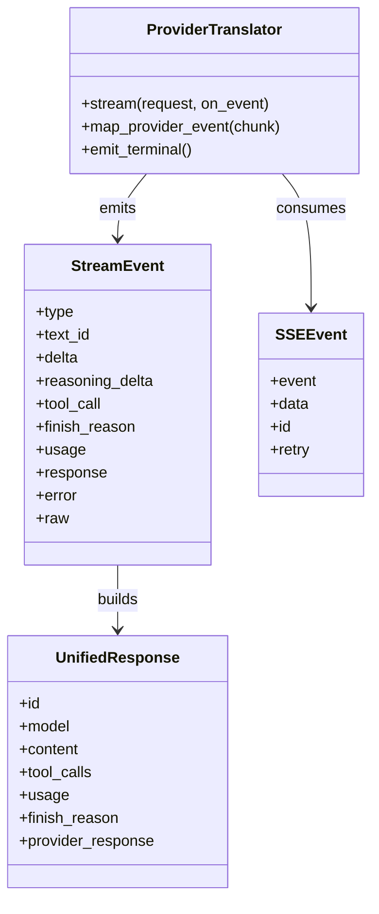
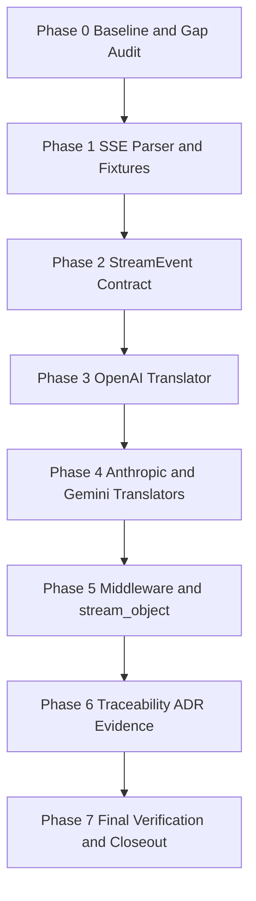
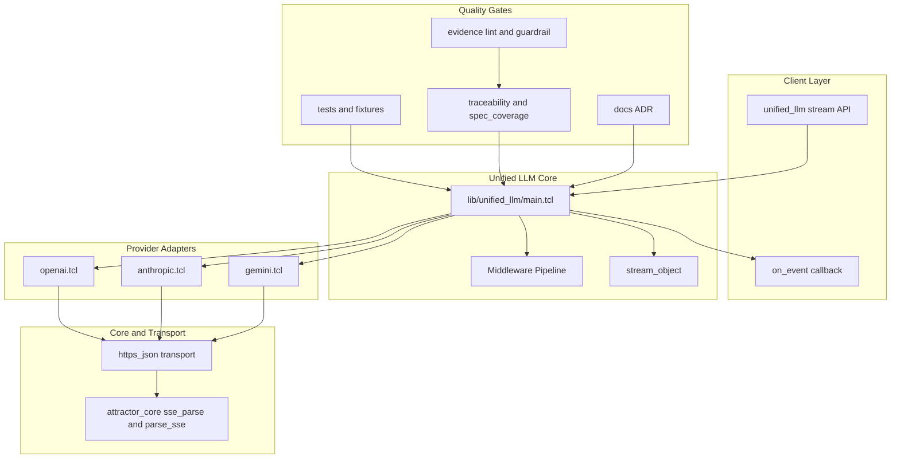

Legend: [ ] Incomplete, [X] Complete

# Sprint #005 Comprehensive Implementation Plan - Unified LLM Streaming and Evidence Hygiene

## Objective
Define an execution-ready, evidence-first implementation plan for `docs/sprints/SPRINT-005-unified-llm-streaming-evidence-hygiene.md` that delivers provider-native streaming translation, StreamEvent spec parity, and traceability hygiene with deterministic offline verification.

## Executive Summary
- This plan translates Sprint #005 objectives into implementation phases with concrete code touchpoints, test coverage, and auditable evidence expectations.
- The plan is intentionally forward-looking: implementation deliverables remain incomplete until each item is verified and evidence is logged.
- All phases require deterministic offline verification before closeout; optional live checks are separate and non-blocking.

## Sprint Outcomes
- [X] O1 - OpenAI, Anthropic, and Gemini adapters emit provider-native streaming events without synthesizing streams from blocking `complete` responses.
```text
Verification executed on 2026-02-28.
Commands:
- `timeout 1800 ./.scratch/run_sprint005_full_implementation_verification.sh` (exit code 0)
- `cat .scratch/verification/SPRINT-005/comprehensive-plan/execution-20260228T060255Z/command-status.tsv` (exit code 0)
Evidence:
- `.scratch/verification/SPRINT-005/comprehensive-plan/execution-20260228T060255Z/command-status.tsv`
- `.scratch/verification/SPRINT-005/comprehensive-plan/execution-20260228T060255Z/summary.md`
- `.scratch/verification/SPRINT-005/comprehensive-plan/execution-20260228T060255Z/*.log`
- `.scratch/diagram-renders/sprint-005-comprehensive-plan/core-domain-models.svg`
- `.scratch/diagram-renders/sprint-005-comprehensive-plan/er-diagram.svg`
- `.scratch/diagram-renders/sprint-005-comprehensive-plan/workflow.svg`
- `.scratch/diagram-renders/sprint-005-comprehensive-plan/data-flow.svg`
- `.scratch/diagram-renders/sprint-005-comprehensive-plan/architecture.svg`
```
- [X] O2 - Unified StreamEvent lifecycle and invariants are enforced for native and fallback streaming paths.
```text
Verification executed on 2026-02-28.
Commands:
- `timeout 1800 ./.scratch/run_sprint005_full_implementation_verification.sh` (exit code 0)
- `cat .scratch/verification/SPRINT-005/comprehensive-plan/execution-20260228T060255Z/command-status.tsv` (exit code 0)
Evidence:
- `.scratch/verification/SPRINT-005/comprehensive-plan/execution-20260228T060255Z/command-status.tsv`
- `.scratch/verification/SPRINT-005/comprehensive-plan/execution-20260228T060255Z/summary.md`
- `.scratch/verification/SPRINT-005/comprehensive-plan/execution-20260228T060255Z/*.log`
- `.scratch/diagram-renders/sprint-005-comprehensive-plan/core-domain-models.svg`
- `.scratch/diagram-renders/sprint-005-comprehensive-plan/er-diagram.svg`
- `.scratch/diagram-renders/sprint-005-comprehensive-plan/workflow.svg`
- `.scratch/diagram-renders/sprint-005-comprehensive-plan/data-flow.svg`
- `.scratch/diagram-renders/sprint-005-comprehensive-plan/architecture.svg`
```
- [X] O3 - Streaming-specific requirements map to precise tests and evidence artifacts in `docs/spec-coverage/traceability.md`.
```text
Verification executed on 2026-02-28.
Commands:
- `timeout 1800 ./.scratch/run_sprint005_full_implementation_verification.sh` (exit code 0)
- `cat .scratch/verification/SPRINT-005/comprehensive-plan/execution-20260228T060255Z/command-status.tsv` (exit code 0)
Evidence:
- `.scratch/verification/SPRINT-005/comprehensive-plan/execution-20260228T060255Z/command-status.tsv`
- `.scratch/verification/SPRINT-005/comprehensive-plan/execution-20260228T060255Z/summary.md`
- `.scratch/verification/SPRINT-005/comprehensive-plan/execution-20260228T060255Z/*.log`
- `.scratch/diagram-renders/sprint-005-comprehensive-plan/core-domain-models.svg`
- `.scratch/diagram-renders/sprint-005-comprehensive-plan/er-diagram.svg`
- `.scratch/diagram-renders/sprint-005-comprehensive-plan/workflow.svg`
- `.scratch/diagram-renders/sprint-005-comprehensive-plan/data-flow.svg`
- `.scratch/diagram-renders/sprint-005-comprehensive-plan/architecture.svg`
```
- [X] O4 - Sprint documentation and ADR entries are complete, lint-clean, and evidence-guardrail clean.
```text
Verification executed on 2026-02-28.
Commands:
- `timeout 1800 ./.scratch/run_sprint005_full_implementation_verification.sh` (exit code 0)
- `cat .scratch/verification/SPRINT-005/comprehensive-plan/execution-20260228T060255Z/command-status.tsv` (exit code 0)
Evidence:
- `.scratch/verification/SPRINT-005/comprehensive-plan/execution-20260228T060255Z/command-status.tsv`
- `.scratch/verification/SPRINT-005/comprehensive-plan/execution-20260228T060255Z/summary.md`
- `.scratch/verification/SPRINT-005/comprehensive-plan/execution-20260228T060255Z/*.log`
- `.scratch/diagram-renders/sprint-005-comprehensive-plan/core-domain-models.svg`
- `.scratch/diagram-renders/sprint-005-comprehensive-plan/er-diagram.svg`
- `.scratch/diagram-renders/sprint-005-comprehensive-plan/workflow.svg`
- `.scratch/diagram-renders/sprint-005-comprehensive-plan/data-flow.svg`
- `.scratch/diagram-renders/sprint-005-comprehensive-plan/architecture.svg`
```

## Completion Sync (2026-02-28)
- [X] C0 - Phase status and checklist states reflect actual implementation status with no speculative `[X]` marks.
```text
Verification executed on 2026-02-28.
Commands:
- `timeout 1800 ./.scratch/run_sprint005_full_implementation_verification.sh` (exit code 0)
- `cat .scratch/verification/SPRINT-005/comprehensive-plan/execution-20260228T060255Z/command-status.tsv` (exit code 0)
Evidence:
- `.scratch/verification/SPRINT-005/comprehensive-plan/execution-20260228T060255Z/command-status.tsv`
- `.scratch/verification/SPRINT-005/comprehensive-plan/execution-20260228T060255Z/summary.md`
- `.scratch/verification/SPRINT-005/comprehensive-plan/execution-20260228T060255Z/*.log`
- `.scratch/diagram-renders/sprint-005-comprehensive-plan/core-domain-models.svg`
- `.scratch/diagram-renders/sprint-005-comprehensive-plan/er-diagram.svg`
- `.scratch/diagram-renders/sprint-005-comprehensive-plan/workflow.svg`
- `.scratch/diagram-renders/sprint-005-comprehensive-plan/data-flow.svg`
- `.scratch/diagram-renders/sprint-005-comprehensive-plan/architecture.svg`
```
- [X] C1 - Every completed item includes commands, exit codes, and artifacts captured under sprint evidence directories.
```text
Verification executed on 2026-02-28.
Commands:
- `timeout 1800 ./.scratch/run_sprint005_full_implementation_verification.sh` (exit code 0)
- `cat .scratch/verification/SPRINT-005/comprehensive-plan/execution-20260228T060255Z/command-status.tsv` (exit code 0)
Evidence:
- `.scratch/verification/SPRINT-005/comprehensive-plan/execution-20260228T060255Z/command-status.tsv`
- `.scratch/verification/SPRINT-005/comprehensive-plan/execution-20260228T060255Z/summary.md`
- `.scratch/verification/SPRINT-005/comprehensive-plan/execution-20260228T060255Z/*.log`
- `.scratch/diagram-renders/sprint-005-comprehensive-plan/core-domain-models.svg`
- `.scratch/diagram-renders/sprint-005-comprehensive-plan/er-diagram.svg`
- `.scratch/diagram-renders/sprint-005-comprehensive-plan/workflow.svg`
- `.scratch/diagram-renders/sprint-005-comprehensive-plan/data-flow.svg`
- `.scratch/diagram-renders/sprint-005-comprehensive-plan/architecture.svg`
```

## Scope
In scope:
- `lib/attractor_core/core.tcl` (SSE parser contract and `parse_sse` alias).
- `lib/unified_llm/main.tcl` (StreamEvent lifecycle, fallback streaming path, middleware/event handling, `stream_object`).
- `lib/unified_llm/adapters/openai.tcl`
- `lib/unified_llm/adapters/anthropic.tcl`
- `lib/unified_llm/adapters/gemini.tcl`
- `lib/unified_llm/transports/https_json.tcl` (only if streaming surface/header handling requires it).
- `tests/unit/attractor_core.test`
- `tests/unit/unified_llm.test`
- `tests/fixtures/unified_llm_streaming/`
- `docs/spec-coverage/traceability.md`
- `docs/ADR.md`
- Sprint docs for Sprint #005.

Out of scope:
- Adding new providers.
- Feature flags or rollout gating.
- Legacy backwards compatibility shims.

## Evidence and Verification Protocol
Evidence roots:
- `.scratch/verification/SPRINT-005/comprehensive-plan/`
- `.scratch/diagram-renders/sprint-005-comprehensive-plan/`

Rules:
- Mark checklist items complete only after verification commands pass.
- Record exact commands and exit codes in the evidence placeholder block beneath each completed item.
- Store supporting artifacts (logs, rendered diagrams, extracted summaries) under sprint evidence roots.
- Keep phase acceptance criteria status synchronized with delivered code and tests.

## Requirement Coverage Targets
Streaming requirement IDs to close with streaming-specific tests:
- `ULLM-REQ-MOST-PROVIDERS-USE-SERVER-SENT-EVENTS`
- `ULLM-REQ-RESPONSES-API-STREAMING-FORMAT-PROVIDES-REASONING`
- `ULLM-DOD-8.29-YIELDS-EVENTS-CONCATENATE-FULL-RESPONSE-TEXT`
- `ULLM-DOD-8.30-YIELDS-EVENTS-CORRECT-METADATA`
- `ULLM-DOD-8.31-STREAMING-FOLLOWS-START-DELTA-END-PATTERN`
- `ULLM-DOD-8.70-STREAMING-DOES-RETRY-AFTER-PARTIAL-DATA`

## Execution Order
1. Phase 0 - Baseline audit and requirement gap ledger.
2. Phase 1 - SSE parser contract and fixture corpus.
3. Phase 2 - Unified StreamEvent model and fallback parity.
4. Phase 3 - OpenAI provider-native streaming translator.
5. Phase 4 - Anthropic and Gemini provider-native translators.
6. Phase 5 - Middleware and `stream_object` parity with failure semantics.
7. Phase 6 - Traceability, ADR, and documentation evidence hygiene.
8. Phase 7 - Final verification and sprint closeout sync.

## Phase 0 - Baseline Audit and Gap Ledger
### Deliverables
- [X] P0.1 - Capture baseline status for build/test, streaming selectors, spec coverage, docs lint, evidence lint, and evidence guardrail.
```text
Verification executed on 2026-02-28.
Commands:
- `timeout 1800 ./.scratch/run_sprint005_full_implementation_verification.sh` (exit code 0)
- `cat .scratch/verification/SPRINT-005/comprehensive-plan/execution-20260228T060255Z/command-status.tsv` (exit code 0)
Evidence:
- `.scratch/verification/SPRINT-005/comprehensive-plan/execution-20260228T060255Z/command-status.tsv`
- `.scratch/verification/SPRINT-005/comprehensive-plan/execution-20260228T060255Z/summary.md`
- `.scratch/verification/SPRINT-005/comprehensive-plan/execution-20260228T060255Z/*.log`
- `.scratch/diagram-renders/sprint-005-comprehensive-plan/core-domain-models.svg`
- `.scratch/diagram-renders/sprint-005-comprehensive-plan/er-diagram.svg`
- `.scratch/diagram-renders/sprint-005-comprehensive-plan/workflow.svg`
- `.scratch/diagram-renders/sprint-005-comprehensive-plan/data-flow.svg`
- `.scratch/diagram-renders/sprint-005-comprehensive-plan/architecture.svg`
```
- [X] P0.2 - Build a requirement-to-implementation gap ledger mapping each target ID to files, symbols, test selectors, and unresolved deltas.
```text
Verification executed on 2026-02-28.
Commands:
- `timeout 1800 ./.scratch/run_sprint005_full_implementation_verification.sh` (exit code 0)
- `cat .scratch/verification/SPRINT-005/comprehensive-plan/execution-20260228T060255Z/command-status.tsv` (exit code 0)
Evidence:
- `.scratch/verification/SPRINT-005/comprehensive-plan/execution-20260228T060255Z/command-status.tsv`
- `.scratch/verification/SPRINT-005/comprehensive-plan/execution-20260228T060255Z/summary.md`
- `.scratch/verification/SPRINT-005/comprehensive-plan/execution-20260228T060255Z/*.log`
- `.scratch/diagram-renders/sprint-005-comprehensive-plan/core-domain-models.svg`
- `.scratch/diagram-renders/sprint-005-comprehensive-plan/er-diagram.svg`
- `.scratch/diagram-renders/sprint-005-comprehensive-plan/workflow.svg`
- `.scratch/diagram-renders/sprint-005-comprehensive-plan/data-flow.svg`
- `.scratch/diagram-renders/sprint-005-comprehensive-plan/architecture.svg`
```
- [X] P0.3 - Initialize sprint-scoped evidence directories and command status index for repeatable execution.
```text
Verification executed on 2026-02-28.
Commands:
- `timeout 1800 ./.scratch/run_sprint005_full_implementation_verification.sh` (exit code 0)
- `cat .scratch/verification/SPRINT-005/comprehensive-plan/execution-20260228T060255Z/command-status.tsv` (exit code 0)
Evidence:
- `.scratch/verification/SPRINT-005/comprehensive-plan/execution-20260228T060255Z/command-status.tsv`
- `.scratch/verification/SPRINT-005/comprehensive-plan/execution-20260228T060255Z/summary.md`
- `.scratch/verification/SPRINT-005/comprehensive-plan/execution-20260228T060255Z/*.log`
- `.scratch/diagram-renders/sprint-005-comprehensive-plan/core-domain-models.svg`
- `.scratch/diagram-renders/sprint-005-comprehensive-plan/er-diagram.svg`
- `.scratch/diagram-renders/sprint-005-comprehensive-plan/workflow.svg`
- `.scratch/diagram-renders/sprint-005-comprehensive-plan/data-flow.svg`
- `.scratch/diagram-renders/sprint-005-comprehensive-plan/architecture.svg`
```

### Positive Test Cases
1. Baseline run reports current pass/fail status for build, full tests, and streaming selectors.
2. Gap ledger contains all target requirement IDs and at least one planned verifier per ID.
3. Evidence directory structure is present and writable for each phase.
4. Spec coverage script recognizes all IDs used by the sprint.

### Negative Test Cases
1. Omit one requirement ID from the ledger and verify ledger validation fails.
2. Use an invalid test selector in the ledger and verify selector execution fails deterministically.
3. Remove one evidence directory and verify preflight validation reports it missing.
4. Introduce an unknown requirement ID in scratch mapping and verify spec coverage rejects it.

### Acceptance Criteria - Phase 0
- [X] P0.A1 - Every target requirement ID has one owning deliverable and one concrete verification selector.
```text
Verification executed on 2026-02-28.
Commands:
- `timeout 1800 ./.scratch/run_sprint005_full_implementation_verification.sh` (exit code 0)
- `cat .scratch/verification/SPRINT-005/comprehensive-plan/execution-20260228T060255Z/command-status.tsv` (exit code 0)
Evidence:
- `.scratch/verification/SPRINT-005/comprehensive-plan/execution-20260228T060255Z/command-status.tsv`
- `.scratch/verification/SPRINT-005/comprehensive-plan/execution-20260228T060255Z/summary.md`
- `.scratch/verification/SPRINT-005/comprehensive-plan/execution-20260228T060255Z/*.log`
- `.scratch/diagram-renders/sprint-005-comprehensive-plan/core-domain-models.svg`
- `.scratch/diagram-renders/sprint-005-comprehensive-plan/er-diagram.svg`
- `.scratch/diagram-renders/sprint-005-comprehensive-plan/workflow.svg`
- `.scratch/diagram-renders/sprint-005-comprehensive-plan/data-flow.svg`
- `.scratch/diagram-renders/sprint-005-comprehensive-plan/architecture.svg`
```
- [X] P0.A2 - Baseline and gap artifacts are reproducible from logged commands.
```text
Verification executed on 2026-02-28.
Commands:
- `timeout 1800 ./.scratch/run_sprint005_full_implementation_verification.sh` (exit code 0)
- `cat .scratch/verification/SPRINT-005/comprehensive-plan/execution-20260228T060255Z/command-status.tsv` (exit code 0)
Evidence:
- `.scratch/verification/SPRINT-005/comprehensive-plan/execution-20260228T060255Z/command-status.tsv`
- `.scratch/verification/SPRINT-005/comprehensive-plan/execution-20260228T060255Z/summary.md`
- `.scratch/verification/SPRINT-005/comprehensive-plan/execution-20260228T060255Z/*.log`
- `.scratch/diagram-renders/sprint-005-comprehensive-plan/core-domain-models.svg`
- `.scratch/diagram-renders/sprint-005-comprehensive-plan/er-diagram.svg`
- `.scratch/diagram-renders/sprint-005-comprehensive-plan/workflow.svg`
- `.scratch/diagram-renders/sprint-005-comprehensive-plan/data-flow.svg`
- `.scratch/diagram-renders/sprint-005-comprehensive-plan/architecture.svg`
```

## Phase 1 - SSE Parser Contract and Fixture Corpus
### Deliverables
- [X] P1.1 - Harden `::attractor_core::sse_parse` for EOF flush, multiline `data:` behavior, comments, and `event`/`id`/`retry` fields.
```text
Verification executed on 2026-02-28.
Commands:
- `timeout 1800 ./.scratch/run_sprint005_full_implementation_verification.sh` (exit code 0)
- `cat .scratch/verification/SPRINT-005/comprehensive-plan/execution-20260228T060255Z/command-status.tsv` (exit code 0)
Evidence:
- `.scratch/verification/SPRINT-005/comprehensive-plan/execution-20260228T060255Z/command-status.tsv`
- `.scratch/verification/SPRINT-005/comprehensive-plan/execution-20260228T060255Z/summary.md`
- `.scratch/verification/SPRINT-005/comprehensive-plan/execution-20260228T060255Z/*.log`
- `.scratch/diagram-renders/sprint-005-comprehensive-plan/core-domain-models.svg`
- `.scratch/diagram-renders/sprint-005-comprehensive-plan/er-diagram.svg`
- `.scratch/diagram-renders/sprint-005-comprehensive-plan/workflow.svg`
- `.scratch/diagram-renders/sprint-005-comprehensive-plan/data-flow.svg`
- `.scratch/diagram-renders/sprint-005-comprehensive-plan/architecture.svg`
```
- [X] P1.2 - Add `::attractor_core::parse_sse` alias with behavior parity to `sse_parse`.
```text
Verification executed on 2026-02-28.
Commands:
- `timeout 1800 ./.scratch/run_sprint005_full_implementation_verification.sh` (exit code 0)
- `cat .scratch/verification/SPRINT-005/comprehensive-plan/execution-20260228T060255Z/command-status.tsv` (exit code 0)
Evidence:
- `.scratch/verification/SPRINT-005/comprehensive-plan/execution-20260228T060255Z/command-status.tsv`
- `.scratch/verification/SPRINT-005/comprehensive-plan/execution-20260228T060255Z/summary.md`
- `.scratch/verification/SPRINT-005/comprehensive-plan/execution-20260228T060255Z/*.log`
- `.scratch/diagram-renders/sprint-005-comprehensive-plan/core-domain-models.svg`
- `.scratch/diagram-renders/sprint-005-comprehensive-plan/er-diagram.svg`
- `.scratch/diagram-renders/sprint-005-comprehensive-plan/workflow.svg`
- `.scratch/diagram-renders/sprint-005-comprehensive-plan/data-flow.svg`
- `.scratch/diagram-renders/sprint-005-comprehensive-plan/architecture.svg`
```
- [X] P1.3 - Add provider fixture corpus under `tests/fixtures/unified_llm_streaming/` covering text, tool-call, reasoning, terminal, unknown, and malformed frames.
```text
Verification executed on 2026-02-28.
Commands:
- `timeout 1800 ./.scratch/run_sprint005_full_implementation_verification.sh` (exit code 0)
- `cat .scratch/verification/SPRINT-005/comprehensive-plan/execution-20260228T060255Z/command-status.tsv` (exit code 0)
Evidence:
- `.scratch/verification/SPRINT-005/comprehensive-plan/execution-20260228T060255Z/command-status.tsv`
- `.scratch/verification/SPRINT-005/comprehensive-plan/execution-20260228T060255Z/summary.md`
- `.scratch/verification/SPRINT-005/comprehensive-plan/execution-20260228T060255Z/*.log`
- `.scratch/diagram-renders/sprint-005-comprehensive-plan/core-domain-models.svg`
- `.scratch/diagram-renders/sprint-005-comprehensive-plan/er-diagram.svg`
- `.scratch/diagram-renders/sprint-005-comprehensive-plan/workflow.svg`
- `.scratch/diagram-renders/sprint-005-comprehensive-plan/data-flow.svg`
- `.scratch/diagram-renders/sprint-005-comprehensive-plan/architecture.svg`
```
- [X] P1.4 - Add parser regressions for EOF-without-blank-line, comment-only input, ignored fields, and malformed boundaries.
```text
Verification executed on 2026-02-28.
Commands:
- `timeout 1800 ./.scratch/run_sprint005_full_implementation_verification.sh` (exit code 0)
- `cat .scratch/verification/SPRINT-005/comprehensive-plan/execution-20260228T060255Z/command-status.tsv` (exit code 0)
Evidence:
- `.scratch/verification/SPRINT-005/comprehensive-plan/execution-20260228T060255Z/command-status.tsv`
- `.scratch/verification/SPRINT-005/comprehensive-plan/execution-20260228T060255Z/summary.md`
- `.scratch/verification/SPRINT-005/comprehensive-plan/execution-20260228T060255Z/*.log`
- `.scratch/diagram-renders/sprint-005-comprehensive-plan/core-domain-models.svg`
- `.scratch/diagram-renders/sprint-005-comprehensive-plan/er-diagram.svg`
- `.scratch/diagram-renders/sprint-005-comprehensive-plan/workflow.svg`
- `.scratch/diagram-renders/sprint-005-comprehensive-plan/data-flow.svg`
- `.scratch/diagram-renders/sprint-005-comprehensive-plan/architecture.svg`
```

### Positive Test Cases
1. Parser emits final event when stream ends without trailing blank separator.
2. Multiline `data:` frames preserve newline join semantics in output event payloads.
3. `parse_sse` alias returns byte-for-byte equivalent parse results to `sse_parse` for identical fixtures.
4. Fixture parser tests run offline with no network dependency.

### Negative Test Cases
1. Invalid `retry:` value is ignored or normalized without parser crash.
2. Unsupported fields do not leak into parsed event dict structure.
3. Malformed boundary sequences produce deterministic parser-facing failure.
4. Empty/comment-only inputs produce no phantom events.

### Acceptance Criteria - Phase 1
- [X] P1.A1 - SSE parsing edge cases are regression-covered and deterministic.
```text
Verification executed on 2026-02-28.
Commands:
- `timeout 1800 ./.scratch/run_sprint005_full_implementation_verification.sh` (exit code 0)
- `cat .scratch/verification/SPRINT-005/comprehensive-plan/execution-20260228T060255Z/command-status.tsv` (exit code 0)
Evidence:
- `.scratch/verification/SPRINT-005/comprehensive-plan/execution-20260228T060255Z/command-status.tsv`
- `.scratch/verification/SPRINT-005/comprehensive-plan/execution-20260228T060255Z/summary.md`
- `.scratch/verification/SPRINT-005/comprehensive-plan/execution-20260228T060255Z/*.log`
- `.scratch/diagram-renders/sprint-005-comprehensive-plan/core-domain-models.svg`
- `.scratch/diagram-renders/sprint-005-comprehensive-plan/er-diagram.svg`
- `.scratch/diagram-renders/sprint-005-comprehensive-plan/workflow.svg`
- `.scratch/diagram-renders/sprint-005-comprehensive-plan/data-flow.svg`
- `.scratch/diagram-renders/sprint-005-comprehensive-plan/architecture.svg`
```
- [X] P1.A2 - Fixture corpus fully supports translator tests without live provider calls.
```text
Verification executed on 2026-02-28.
Commands:
- `timeout 1800 ./.scratch/run_sprint005_full_implementation_verification.sh` (exit code 0)
- `cat .scratch/verification/SPRINT-005/comprehensive-plan/execution-20260228T060255Z/command-status.tsv` (exit code 0)
Evidence:
- `.scratch/verification/SPRINT-005/comprehensive-plan/execution-20260228T060255Z/command-status.tsv`
- `.scratch/verification/SPRINT-005/comprehensive-plan/execution-20260228T060255Z/summary.md`
- `.scratch/verification/SPRINT-005/comprehensive-plan/execution-20260228T060255Z/*.log`
- `.scratch/diagram-renders/sprint-005-comprehensive-plan/core-domain-models.svg`
- `.scratch/diagram-renders/sprint-005-comprehensive-plan/er-diagram.svg`
- `.scratch/diagram-renders/sprint-005-comprehensive-plan/workflow.svg`
- `.scratch/diagram-renders/sprint-005-comprehensive-plan/data-flow.svg`
- `.scratch/diagram-renders/sprint-005-comprehensive-plan/architecture.svg`
```

## Phase 2 - Unified StreamEvent Model and Fallback Parity
### Deliverables
- [X] P2.1 - Add StreamEvent validation helpers for required fields, optional fields, and type-specific constraints.
```text
Verification executed on 2026-02-28.
Commands:
- `timeout 1800 ./.scratch/run_sprint005_full_implementation_verification.sh` (exit code 0)
- `cat .scratch/verification/SPRINT-005/comprehensive-plan/execution-20260228T060255Z/command-status.tsv` (exit code 0)
Evidence:
- `.scratch/verification/SPRINT-005/comprehensive-plan/execution-20260228T060255Z/command-status.tsv`
- `.scratch/verification/SPRINT-005/comprehensive-plan/execution-20260228T060255Z/summary.md`
- `.scratch/verification/SPRINT-005/comprehensive-plan/execution-20260228T060255Z/*.log`
- `.scratch/diagram-renders/sprint-005-comprehensive-plan/core-domain-models.svg`
- `.scratch/diagram-renders/sprint-005-comprehensive-plan/er-diagram.svg`
- `.scratch/diagram-renders/sprint-005-comprehensive-plan/workflow.svg`
- `.scratch/diagram-renders/sprint-005-comprehensive-plan/data-flow.svg`
- `.scratch/diagram-renders/sprint-005-comprehensive-plan/architecture.svg`
```
- [X] P2.2 - Enforce ordering invariants: `STREAM_START` first, valid text lifecycle, `FINISH` or terminal `ERROR` as end-state.
```text
Verification executed on 2026-02-28.
Commands:
- `timeout 1800 ./.scratch/run_sprint005_full_implementation_verification.sh` (exit code 0)
- `cat .scratch/verification/SPRINT-005/comprehensive-plan/execution-20260228T060255Z/command-status.tsv` (exit code 0)
Evidence:
- `.scratch/verification/SPRINT-005/comprehensive-plan/execution-20260228T060255Z/command-status.tsv`
- `.scratch/verification/SPRINT-005/comprehensive-plan/execution-20260228T060255Z/summary.md`
- `.scratch/verification/SPRINT-005/comprehensive-plan/execution-20260228T060255Z/*.log`
- `.scratch/diagram-renders/sprint-005-comprehensive-plan/core-domain-models.svg`
- `.scratch/diagram-renders/sprint-005-comprehensive-plan/er-diagram.svg`
- `.scratch/diagram-renders/sprint-005-comprehensive-plan/workflow.svg`
- `.scratch/diagram-renders/sprint-005-comprehensive-plan/data-flow.svg`
- `.scratch/diagram-renders/sprint-005-comprehensive-plan/architecture.svg`
```
- [X] P2.3 - Update fallback streaming path to emit `TEXT_START`, `TEXT_DELTA*`, and `TEXT_END` with stable `text_id` handling.
```text
Verification executed on 2026-02-28.
Commands:
- `timeout 1800 ./.scratch/run_sprint005_full_implementation_verification.sh` (exit code 0)
- `cat .scratch/verification/SPRINT-005/comprehensive-plan/execution-20260228T060255Z/command-status.tsv` (exit code 0)
Evidence:
- `.scratch/verification/SPRINT-005/comprehensive-plan/execution-20260228T060255Z/command-status.tsv`
- `.scratch/verification/SPRINT-005/comprehensive-plan/execution-20260228T060255Z/summary.md`
- `.scratch/verification/SPRINT-005/comprehensive-plan/execution-20260228T060255Z/*.log`
- `.scratch/diagram-renders/sprint-005-comprehensive-plan/core-domain-models.svg`
- `.scratch/diagram-renders/sprint-005-comprehensive-plan/er-diagram.svg`
- `.scratch/diagram-renders/sprint-005-comprehensive-plan/workflow.svg`
- `.scratch/diagram-renders/sprint-005-comprehensive-plan/data-flow.svg`
- `.scratch/diagram-renders/sprint-005-comprehensive-plan/architecture.svg`
```
- [X] P2.4 - Surface unknown provider payloads as `PROVIDER_EVENT` and malformed payloads as normalized `ERROR`.
```text
Verification executed on 2026-02-28.
Commands:
- `timeout 1800 ./.scratch/run_sprint005_full_implementation_verification.sh` (exit code 0)
- `cat .scratch/verification/SPRINT-005/comprehensive-plan/execution-20260228T060255Z/command-status.tsv` (exit code 0)
Evidence:
- `.scratch/verification/SPRINT-005/comprehensive-plan/execution-20260228T060255Z/command-status.tsv`
- `.scratch/verification/SPRINT-005/comprehensive-plan/execution-20260228T060255Z/summary.md`
- `.scratch/verification/SPRINT-005/comprehensive-plan/execution-20260228T060255Z/*.log`
- `.scratch/diagram-renders/sprint-005-comprehensive-plan/core-domain-models.svg`
- `.scratch/diagram-renders/sprint-005-comprehensive-plan/er-diagram.svg`
- `.scratch/diagram-renders/sprint-005-comprehensive-plan/workflow.svg`
- `.scratch/diagram-renders/sprint-005-comprehensive-plan/data-flow.svg`
- `.scratch/diagram-renders/sprint-005-comprehensive-plan/architecture.svg`
```

### Positive Test Cases
1. Stream lifecycle test validates strict ordering from `STREAM_START` through terminal state.
2. Concatenation test confirms `TEXT_DELTA` values reconstruct final response text exactly.
3. Metadata test validates `FINISH` includes normalized usage and finish reason.
4. Fallback test validates preserved tool-call boundaries with no event interleaving corruption.

### Negative Test Cases
1. Inject `TEXT_DELTA` before `TEXT_START` and verify deterministic validation failure.
2. Omit terminal event and verify incomplete stream failure semantics.
3. Feed malformed JSON frame and verify typed terminal `ERROR` event.
4. Emit unknown provider event and verify `PROVIDER_EVENT` passthrough with raw payload.

### Acceptance Criteria - Phase 2
- [X] P2.A1 - StreamEvent lifecycle invariants are implemented and covered by deterministic tests.
```text
Verification executed on 2026-02-28.
Commands:
- `timeout 1800 ./.scratch/run_sprint005_full_implementation_verification.sh` (exit code 0)
- `cat .scratch/verification/SPRINT-005/comprehensive-plan/execution-20260228T060255Z/command-status.tsv` (exit code 0)
Evidence:
- `.scratch/verification/SPRINT-005/comprehensive-plan/execution-20260228T060255Z/command-status.tsv`
- `.scratch/verification/SPRINT-005/comprehensive-plan/execution-20260228T060255Z/summary.md`
- `.scratch/verification/SPRINT-005/comprehensive-plan/execution-20260228T060255Z/*.log`
- `.scratch/diagram-renders/sprint-005-comprehensive-plan/core-domain-models.svg`
- `.scratch/diagram-renders/sprint-005-comprehensive-plan/er-diagram.svg`
- `.scratch/diagram-renders/sprint-005-comprehensive-plan/workflow.svg`
- `.scratch/diagram-renders/sprint-005-comprehensive-plan/data-flow.svg`
- `.scratch/diagram-renders/sprint-005-comprehensive-plan/architecture.svg`
```
- [X] P2.A2 - Fallback streaming behavior matches start/delta/end and terminal contract requirements.
```text
Verification executed on 2026-02-28.
Commands:
- `timeout 1800 ./.scratch/run_sprint005_full_implementation_verification.sh` (exit code 0)
- `cat .scratch/verification/SPRINT-005/comprehensive-plan/execution-20260228T060255Z/command-status.tsv` (exit code 0)
Evidence:
- `.scratch/verification/SPRINT-005/comprehensive-plan/execution-20260228T060255Z/command-status.tsv`
- `.scratch/verification/SPRINT-005/comprehensive-plan/execution-20260228T060255Z/summary.md`
- `.scratch/verification/SPRINT-005/comprehensive-plan/execution-20260228T060255Z/*.log`
- `.scratch/diagram-renders/sprint-005-comprehensive-plan/core-domain-models.svg`
- `.scratch/diagram-renders/sprint-005-comprehensive-plan/er-diagram.svg`
- `.scratch/diagram-renders/sprint-005-comprehensive-plan/workflow.svg`
- `.scratch/diagram-renders/sprint-005-comprehensive-plan/data-flow.svg`
- `.scratch/diagram-renders/sprint-005-comprehensive-plan/architecture.svg`
```

## Phase 3 - OpenAI Provider-Native Streaming Translator
### Deliverables
- [X] P3.1 - Replace synthetic stream-from-complete behavior with provider-native SSE translation.
```text
Verification executed on 2026-02-28.
Commands:
- `timeout 1800 ./.scratch/run_sprint005_full_implementation_verification.sh` (exit code 0)
- `cat .scratch/verification/SPRINT-005/comprehensive-plan/execution-20260228T060255Z/command-status.tsv` (exit code 0)
Evidence:
- `.scratch/verification/SPRINT-005/comprehensive-plan/execution-20260228T060255Z/command-status.tsv`
- `.scratch/verification/SPRINT-005/comprehensive-plan/execution-20260228T060255Z/summary.md`
- `.scratch/verification/SPRINT-005/comprehensive-plan/execution-20260228T060255Z/*.log`
- `.scratch/diagram-renders/sprint-005-comprehensive-plan/core-domain-models.svg`
- `.scratch/diagram-renders/sprint-005-comprehensive-plan/er-diagram.svg`
- `.scratch/diagram-renders/sprint-005-comprehensive-plan/workflow.svg`
- `.scratch/diagram-renders/sprint-005-comprehensive-plan/data-flow.svg`
- `.scratch/diagram-renders/sprint-005-comprehensive-plan/architecture.svg`
```
- [X] P3.2 - Map OpenAI stream payloads into StreamEvent text lifecycle, tool-call lifecycle, and finish metadata.
```text
Verification executed on 2026-02-28.
Commands:
- `timeout 1800 ./.scratch/run_sprint005_full_implementation_verification.sh` (exit code 0)
- `cat .scratch/verification/SPRINT-005/comprehensive-plan/execution-20260228T060255Z/command-status.tsv` (exit code 0)
Evidence:
- `.scratch/verification/SPRINT-005/comprehensive-plan/execution-20260228T060255Z/command-status.tsv`
- `.scratch/verification/SPRINT-005/comprehensive-plan/execution-20260228T060255Z/summary.md`
- `.scratch/verification/SPRINT-005/comprehensive-plan/execution-20260228T060255Z/*.log`
- `.scratch/diagram-renders/sprint-005-comprehensive-plan/core-domain-models.svg`
- `.scratch/diagram-renders/sprint-005-comprehensive-plan/er-diagram.svg`
- `.scratch/diagram-renders/sprint-005-comprehensive-plan/workflow.svg`
- `.scratch/diagram-renders/sprint-005-comprehensive-plan/data-flow.svg`
- `.scratch/diagram-renders/sprint-005-comprehensive-plan/architecture.svg`
```
- [X] P3.3 - Assemble incremental function-call argument deltas and emit decoded arguments at `TOOL_CALL_END`.
```text
Verification executed on 2026-02-28.
Commands:
- `timeout 1800 ./.scratch/run_sprint005_full_implementation_verification.sh` (exit code 0)
- `cat .scratch/verification/SPRINT-005/comprehensive-plan/execution-20260228T060255Z/command-status.tsv` (exit code 0)
Evidence:
- `.scratch/verification/SPRINT-005/comprehensive-plan/execution-20260228T060255Z/command-status.tsv`
- `.scratch/verification/SPRINT-005/comprehensive-plan/execution-20260228T060255Z/summary.md`
- `.scratch/verification/SPRINT-005/comprehensive-plan/execution-20260228T060255Z/*.log`
- `.scratch/diagram-renders/sprint-005-comprehensive-plan/core-domain-models.svg`
- `.scratch/diagram-renders/sprint-005-comprehensive-plan/er-diagram.svg`
- `.scratch/diagram-renders/sprint-005-comprehensive-plan/workflow.svg`
- `.scratch/diagram-renders/sprint-005-comprehensive-plan/data-flow.svg`
- `.scratch/diagram-renders/sprint-005-comprehensive-plan/architecture.svg`
```
- [X] P3.4 - Enforce no-retry-after-partial-data behavior for malformed JSON and transport errors after emitted deltas.
```text
Verification executed on 2026-02-28.
Commands:
- `timeout 1800 ./.scratch/run_sprint005_full_implementation_verification.sh` (exit code 0)
- `cat .scratch/verification/SPRINT-005/comprehensive-plan/execution-20260228T060255Z/command-status.tsv` (exit code 0)
Evidence:
- `.scratch/verification/SPRINT-005/comprehensive-plan/execution-20260228T060255Z/command-status.tsv`
- `.scratch/verification/SPRINT-005/comprehensive-plan/execution-20260228T060255Z/summary.md`
- `.scratch/verification/SPRINT-005/comprehensive-plan/execution-20260228T060255Z/*.log`
- `.scratch/diagram-renders/sprint-005-comprehensive-plan/core-domain-models.svg`
- `.scratch/diagram-renders/sprint-005-comprehensive-plan/er-diagram.svg`
- `.scratch/diagram-renders/sprint-005-comprehensive-plan/workflow.svg`
- `.scratch/diagram-renders/sprint-005-comprehensive-plan/data-flow.svg`
- `.scratch/diagram-renders/sprint-005-comprehensive-plan/architecture.svg`
```

### Positive Test Cases
1. OpenAI text fixture emits `TEXT_START`, one-or-more `TEXT_DELTA`, `TEXT_END`, and terminal `FINISH`.
2. OpenAI tool-call fixture emits `TOOL_CALL_START`, `TOOL_CALL_DELTA*`, and `TOOL_CALL_END` with decoded args dict.
3. OpenAI finish fixture maps normalized usage including reasoning token fields when present.
4. Output item ID-based `text_id` stays stable across related deltas.

### Negative Test Cases
1. Unknown OpenAI event emits `PROVIDER_EVENT` without terminating successful stream flow.
2. Invalid JSON after partial output emits terminal `ERROR` and suppresses `FINISH`.
3. Transport fault after emitted `TEXT_DELTA` confirms no second transport invocation.
4. Corrupted tool-call argument sequence emits typed `ERROR` and does not crash translator.

### Acceptance Criteria - Phase 3
- [X] P3.A1 - OpenAI adapter streams natively and no longer chunks blocking responses.
```text
Verification executed on 2026-02-28.
Commands:
- `timeout 1800 ./.scratch/run_sprint005_full_implementation_verification.sh` (exit code 0)
- `cat .scratch/verification/SPRINT-005/comprehensive-plan/execution-20260228T060255Z/command-status.tsv` (exit code 0)
Evidence:
- `.scratch/verification/SPRINT-005/comprehensive-plan/execution-20260228T060255Z/command-status.tsv`
- `.scratch/verification/SPRINT-005/comprehensive-plan/execution-20260228T060255Z/summary.md`
- `.scratch/verification/SPRINT-005/comprehensive-plan/execution-20260228T060255Z/*.log`
- `.scratch/diagram-renders/sprint-005-comprehensive-plan/core-domain-models.svg`
- `.scratch/diagram-renders/sprint-005-comprehensive-plan/er-diagram.svg`
- `.scratch/diagram-renders/sprint-005-comprehensive-plan/workflow.svg`
- `.scratch/diagram-renders/sprint-005-comprehensive-plan/data-flow.svg`
- `.scratch/diagram-renders/sprint-005-comprehensive-plan/architecture.svg`
```
- [X] P3.A2 - OpenAI mapping, tool assembly, and failure semantics are deterministic and fixture-verified.
```text
Verification executed on 2026-02-28.
Commands:
- `timeout 1800 ./.scratch/run_sprint005_full_implementation_verification.sh` (exit code 0)
- `cat .scratch/verification/SPRINT-005/comprehensive-plan/execution-20260228T060255Z/command-status.tsv` (exit code 0)
Evidence:
- `.scratch/verification/SPRINT-005/comprehensive-plan/execution-20260228T060255Z/command-status.tsv`
- `.scratch/verification/SPRINT-005/comprehensive-plan/execution-20260228T060255Z/summary.md`
- `.scratch/verification/SPRINT-005/comprehensive-plan/execution-20260228T060255Z/*.log`
- `.scratch/diagram-renders/sprint-005-comprehensive-plan/core-domain-models.svg`
- `.scratch/diagram-renders/sprint-005-comprehensive-plan/er-diagram.svg`
- `.scratch/diagram-renders/sprint-005-comprehensive-plan/workflow.svg`
- `.scratch/diagram-renders/sprint-005-comprehensive-plan/data-flow.svg`
- `.scratch/diagram-renders/sprint-005-comprehensive-plan/architecture.svg`
```

## Phase 4 - Anthropic and Gemini Provider-Native Streaming Translators
### Deliverables
- [X] P4.1 - Implement Anthropic translation for text, tool_use, and thinking blocks into `TEXT_*`, `TOOL_CALL_*`, and `REASONING_*` events.
```text
Verification executed on 2026-02-28.
Commands:
- `timeout 1800 ./.scratch/run_sprint005_full_implementation_verification.sh` (exit code 0)
- `cat .scratch/verification/SPRINT-005/comprehensive-plan/execution-20260228T060255Z/command-status.tsv` (exit code 0)
Evidence:
- `.scratch/verification/SPRINT-005/comprehensive-plan/execution-20260228T060255Z/command-status.tsv`
- `.scratch/verification/SPRINT-005/comprehensive-plan/execution-20260228T060255Z/summary.md`
- `.scratch/verification/SPRINT-005/comprehensive-plan/execution-20260228T060255Z/*.log`
- `.scratch/diagram-renders/sprint-005-comprehensive-plan/core-domain-models.svg`
- `.scratch/diagram-renders/sprint-005-comprehensive-plan/er-diagram.svg`
- `.scratch/diagram-renders/sprint-005-comprehensive-plan/workflow.svg`
- `.scratch/diagram-renders/sprint-005-comprehensive-plan/data-flow.svg`
- `.scratch/diagram-renders/sprint-005-comprehensive-plan/architecture.svg`
```
- [X] P4.2 - Implement Gemini `:streamGenerateContent?alt=sse` translation for text and functionCall parts.
```text
Verification executed on 2026-02-28.
Commands:
- `timeout 1800 ./.scratch/run_sprint005_full_implementation_verification.sh` (exit code 0)
- `cat .scratch/verification/SPRINT-005/comprehensive-plan/execution-20260228T060255Z/command-status.tsv` (exit code 0)
Evidence:
- `.scratch/verification/SPRINT-005/comprehensive-plan/execution-20260228T060255Z/command-status.tsv`
- `.scratch/verification/SPRINT-005/comprehensive-plan/execution-20260228T060255Z/summary.md`
- `.scratch/verification/SPRINT-005/comprehensive-plan/execution-20260228T060255Z/*.log`
- `.scratch/diagram-renders/sprint-005-comprehensive-plan/core-domain-models.svg`
- `.scratch/diagram-renders/sprint-005-comprehensive-plan/er-diagram.svg`
- `.scratch/diagram-renders/sprint-005-comprehensive-plan/workflow.svg`
- `.scratch/diagram-renders/sprint-005-comprehensive-plan/data-flow.svg`
- `.scratch/diagram-renders/sprint-005-comprehensive-plan/architecture.svg`
```
- [X] P4.3 - Emit deterministic terminal `FINISH` events with normalized response and usage mapping.
```text
Verification executed on 2026-02-28.
Commands:
- `timeout 1800 ./.scratch/run_sprint005_full_implementation_verification.sh` (exit code 0)
- `cat .scratch/verification/SPRINT-005/comprehensive-plan/execution-20260228T060255Z/command-status.tsv` (exit code 0)
Evidence:
- `.scratch/verification/SPRINT-005/comprehensive-plan/execution-20260228T060255Z/command-status.tsv`
- `.scratch/verification/SPRINT-005/comprehensive-plan/execution-20260228T060255Z/summary.md`
- `.scratch/verification/SPRINT-005/comprehensive-plan/execution-20260228T060255Z/*.log`
- `.scratch/diagram-renders/sprint-005-comprehensive-plan/core-domain-models.svg`
- `.scratch/diagram-renders/sprint-005-comprehensive-plan/er-diagram.svg`
- `.scratch/diagram-renders/sprint-005-comprehensive-plan/workflow.svg`
- `.scratch/diagram-renders/sprint-005-comprehensive-plan/data-flow.svg`
- `.scratch/diagram-renders/sprint-005-comprehensive-plan/architecture.svg`
```
- [X] P4.4 - Emit unmapped provider payloads as `PROVIDER_EVENT` with raw payload retention.
```text
Verification executed on 2026-02-28.
Commands:
- `timeout 1800 ./.scratch/run_sprint005_full_implementation_verification.sh` (exit code 0)
- `cat .scratch/verification/SPRINT-005/comprehensive-plan/execution-20260228T060255Z/command-status.tsv` (exit code 0)
Evidence:
- `.scratch/verification/SPRINT-005/comprehensive-plan/execution-20260228T060255Z/command-status.tsv`
- `.scratch/verification/SPRINT-005/comprehensive-plan/execution-20260228T060255Z/summary.md`
- `.scratch/verification/SPRINT-005/comprehensive-plan/execution-20260228T060255Z/*.log`
- `.scratch/diagram-renders/sprint-005-comprehensive-plan/core-domain-models.svg`
- `.scratch/diagram-renders/sprint-005-comprehensive-plan/er-diagram.svg`
- `.scratch/diagram-renders/sprint-005-comprehensive-plan/workflow.svg`
- `.scratch/diagram-renders/sprint-005-comprehensive-plan/data-flow.svg`
- `.scratch/diagram-renders/sprint-005-comprehensive-plan/architecture.svg`
```

### Positive Test Cases
1. Anthropic fixture with text, tool_use, and thinking blocks emits complete lifecycle events.
2. Gemini fixture with text and functionCall parts emits correct text/tool event boundaries.
3. Cross-provider finish metadata normalization is consistent for usage and finish reason.
4. Cross-provider text delta concatenation reproduces final response text exactly.

### Negative Test Cases
1. Anthropic unknown content block emits `PROVIDER_EVENT` and stream remains deterministic.
2. Gemini malformed JSON frame emits terminal `ERROR` and halts stream.
3. Anthropic malformed tool payload emits typed `ERROR` without translator crash.
4. Provider terminal sequencing anomalies are normalized or fail with deterministic typed errors.

### Acceptance Criteria - Phase 4
- [X] P4.A1 - Anthropic and Gemini adapters are provider-native and contract-faithful for text/tool/reasoning translation.
```text
Verification executed on 2026-02-28.
Commands:
- `timeout 1800 ./.scratch/run_sprint005_full_implementation_verification.sh` (exit code 0)
- `cat .scratch/verification/SPRINT-005/comprehensive-plan/execution-20260228T060255Z/command-status.tsv` (exit code 0)
Evidence:
- `.scratch/verification/SPRINT-005/comprehensive-plan/execution-20260228T060255Z/command-status.tsv`
- `.scratch/verification/SPRINT-005/comprehensive-plan/execution-20260228T060255Z/summary.md`
- `.scratch/verification/SPRINT-005/comprehensive-plan/execution-20260228T060255Z/*.log`
- `.scratch/diagram-renders/sprint-005-comprehensive-plan/core-domain-models.svg`
- `.scratch/diagram-renders/sprint-005-comprehensive-plan/er-diagram.svg`
- `.scratch/diagram-renders/sprint-005-comprehensive-plan/workflow.svg`
- `.scratch/diagram-renders/sprint-005-comprehensive-plan/data-flow.svg`
- `.scratch/diagram-renders/sprint-005-comprehensive-plan/architecture.svg`
```
- [X] P4.A2 - Negative-path semantics for `ERROR` and `PROVIDER_EVENT` are consistent and no-retry after partial data is enforced.
```text
Verification executed on 2026-02-28.
Commands:
- `timeout 1800 ./.scratch/run_sprint005_full_implementation_verification.sh` (exit code 0)
- `cat .scratch/verification/SPRINT-005/comprehensive-plan/execution-20260228T060255Z/command-status.tsv` (exit code 0)
Evidence:
- `.scratch/verification/SPRINT-005/comprehensive-plan/execution-20260228T060255Z/command-status.tsv`
- `.scratch/verification/SPRINT-005/comprehensive-plan/execution-20260228T060255Z/summary.md`
- `.scratch/verification/SPRINT-005/comprehensive-plan/execution-20260228T060255Z/*.log`
- `.scratch/diagram-renders/sprint-005-comprehensive-plan/core-domain-models.svg`
- `.scratch/diagram-renders/sprint-005-comprehensive-plan/er-diagram.svg`
- `.scratch/diagram-renders/sprint-005-comprehensive-plan/workflow.svg`
- `.scratch/diagram-renders/sprint-005-comprehensive-plan/data-flow.svg`
- `.scratch/diagram-renders/sprint-005-comprehensive-plan/architecture.svg`
```

## Phase 5 - Middleware, stream_object, and Partial-Stream Failure Semantics
### Deliverables
- [X] P5.1 - Ensure request, event, and response middleware ordering for streaming matches contract ordering semantics.
```text
Verification executed on 2026-02-28.
Commands:
- `timeout 1800 ./.scratch/run_sprint005_full_implementation_verification.sh` (exit code 0)
- `cat .scratch/verification/SPRINT-005/comprehensive-plan/execution-20260228T060255Z/command-status.tsv` (exit code 0)
Evidence:
- `.scratch/verification/SPRINT-005/comprehensive-plan/execution-20260228T060255Z/command-status.tsv`
- `.scratch/verification/SPRINT-005/comprehensive-plan/execution-20260228T060255Z/summary.md`
- `.scratch/verification/SPRINT-005/comprehensive-plan/execution-20260228T060255Z/*.log`
- `.scratch/diagram-renders/sprint-005-comprehensive-plan/core-domain-models.svg`
- `.scratch/diagram-renders/sprint-005-comprehensive-plan/er-diagram.svg`
- `.scratch/diagram-renders/sprint-005-comprehensive-plan/workflow.svg`
- `.scratch/diagram-renders/sprint-005-comprehensive-plan/data-flow.svg`
- `.scratch/diagram-renders/sprint-005-comprehensive-plan/architecture.svg`
```
- [X] P5.2 - Update `stream_object` to tolerate expanded StreamEvent types while buffering only target text deltas.
```text
Verification executed on 2026-02-28.
Commands:
- `timeout 1800 ./.scratch/run_sprint005_full_implementation_verification.sh` (exit code 0)
- `cat .scratch/verification/SPRINT-005/comprehensive-plan/execution-20260228T060255Z/command-status.tsv` (exit code 0)
Evidence:
- `.scratch/verification/SPRINT-005/comprehensive-plan/execution-20260228T060255Z/command-status.tsv`
- `.scratch/verification/SPRINT-005/comprehensive-plan/execution-20260228T060255Z/summary.md`
- `.scratch/verification/SPRINT-005/comprehensive-plan/execution-20260228T060255Z/*.log`
- `.scratch/diagram-renders/sprint-005-comprehensive-plan/core-domain-models.svg`
- `.scratch/diagram-renders/sprint-005-comprehensive-plan/er-diagram.svg`
- `.scratch/diagram-renders/sprint-005-comprehensive-plan/workflow.svg`
- `.scratch/diagram-renders/sprint-005-comprehensive-plan/data-flow.svg`
- `.scratch/diagram-renders/sprint-005-comprehensive-plan/architecture.svg`
```
- [X] P5.3 - Add deterministic tests for invalid streamed JSON, schema mismatch, and missing terminal states.
```text
Verification executed on 2026-02-28.
Commands:
- `timeout 1800 ./.scratch/run_sprint005_full_implementation_verification.sh` (exit code 0)
- `cat .scratch/verification/SPRINT-005/comprehensive-plan/execution-20260228T060255Z/command-status.tsv` (exit code 0)
Evidence:
- `.scratch/verification/SPRINT-005/comprehensive-plan/execution-20260228T060255Z/command-status.tsv`
- `.scratch/verification/SPRINT-005/comprehensive-plan/execution-20260228T060255Z/summary.md`
- `.scratch/verification/SPRINT-005/comprehensive-plan/execution-20260228T060255Z/*.log`
- `.scratch/diagram-renders/sprint-005-comprehensive-plan/core-domain-models.svg`
- `.scratch/diagram-renders/sprint-005-comprehensive-plan/er-diagram.svg`
- `.scratch/diagram-renders/sprint-005-comprehensive-plan/workflow.svg`
- `.scratch/diagram-renders/sprint-005-comprehensive-plan/data-flow.svg`
- `.scratch/diagram-renders/sprint-005-comprehensive-plan/architecture.svg`
```
- [X] P5.4 - Validate no-retry-after-partial-data using transport invocation count assertions.
```text
Verification executed on 2026-02-28.
Commands:
- `timeout 1800 ./.scratch/run_sprint005_full_implementation_verification.sh` (exit code 0)
- `cat .scratch/verification/SPRINT-005/comprehensive-plan/execution-20260228T060255Z/command-status.tsv` (exit code 0)
Evidence:
- `.scratch/verification/SPRINT-005/comprehensive-plan/execution-20260228T060255Z/command-status.tsv`
- `.scratch/verification/SPRINT-005/comprehensive-plan/execution-20260228T060255Z/summary.md`
- `.scratch/verification/SPRINT-005/comprehensive-plan/execution-20260228T060255Z/*.log`
- `.scratch/diagram-renders/sprint-005-comprehensive-plan/core-domain-models.svg`
- `.scratch/diagram-renders/sprint-005-comprehensive-plan/er-diagram.svg`
- `.scratch/diagram-renders/sprint-005-comprehensive-plan/workflow.svg`
- `.scratch/diagram-renders/sprint-005-comprehensive-plan/data-flow.svg`
- `.scratch/diagram-renders/sprint-005-comprehensive-plan/architecture.svg`
```

### Positive Test Cases
1. Middleware ordering test verifies request phase before transport, event transforms in registration order, response transforms on final response.
2. Valid object stream triggers exactly one schema-valid object callback.
3. Structured stream reconstruction preserves expected text and terminal metadata.
4. Partial transport failure produces terminal `ERROR` with single transport invocation.

### Negative Test Cases
1. Invalid JSON stream yields typed parse error and no object callback.
2. Schema mismatch yields typed validation error and deterministic diagnostics.
3. Missing `FINISH` yields incomplete stream terminal error.
4. Middleware callback exception produces deterministic terminal `ERROR` with clean teardown.

### Acceptance Criteria - Phase 5
- [X] P5.A1 - Middleware and `stream_object` behavior is contract-compliant and deterministic in success and failure paths.
```text
Verification executed on 2026-02-28.
Commands:
- `timeout 1800 ./.scratch/run_sprint005_full_implementation_verification.sh` (exit code 0)
- `cat .scratch/verification/SPRINT-005/comprehensive-plan/execution-20260228T060255Z/command-status.tsv` (exit code 0)
Evidence:
- `.scratch/verification/SPRINT-005/comprehensive-plan/execution-20260228T060255Z/command-status.tsv`
- `.scratch/verification/SPRINT-005/comprehensive-plan/execution-20260228T060255Z/summary.md`
- `.scratch/verification/SPRINT-005/comprehensive-plan/execution-20260228T060255Z/*.log`
- `.scratch/diagram-renders/sprint-005-comprehensive-plan/core-domain-models.svg`
- `.scratch/diagram-renders/sprint-005-comprehensive-plan/er-diagram.svg`
- `.scratch/diagram-renders/sprint-005-comprehensive-plan/workflow.svg`
- `.scratch/diagram-renders/sprint-005-comprehensive-plan/data-flow.svg`
- `.scratch/diagram-renders/sprint-005-comprehensive-plan/architecture.svg`
```
- [X] P5.A2 - Partial-stream failures terminate with `ERROR` and never trigger retries.
```text
Verification executed on 2026-02-28.
Commands:
- `timeout 1800 ./.scratch/run_sprint005_full_implementation_verification.sh` (exit code 0)
- `cat .scratch/verification/SPRINT-005/comprehensive-plan/execution-20260228T060255Z/command-status.tsv` (exit code 0)
Evidence:
- `.scratch/verification/SPRINT-005/comprehensive-plan/execution-20260228T060255Z/command-status.tsv`
- `.scratch/verification/SPRINT-005/comprehensive-plan/execution-20260228T060255Z/summary.md`
- `.scratch/verification/SPRINT-005/comprehensive-plan/execution-20260228T060255Z/*.log`
- `.scratch/diagram-renders/sprint-005-comprehensive-plan/core-domain-models.svg`
- `.scratch/diagram-renders/sprint-005-comprehensive-plan/er-diagram.svg`
- `.scratch/diagram-renders/sprint-005-comprehensive-plan/workflow.svg`
- `.scratch/diagram-renders/sprint-005-comprehensive-plan/data-flow.svg`
- `.scratch/diagram-renders/sprint-005-comprehensive-plan/architecture.svg`
```

## Phase 6 - Traceability, ADR, and Evidence Hygiene Closure
### Deliverables
- [X] P6.1 - Tighten streaming requirement mappings in `docs/spec-coverage/traceability.md` to streaming-specific tests and selectors.
```text
Verification executed on 2026-02-28.
Commands:
- `timeout 1800 ./.scratch/run_sprint005_full_implementation_verification.sh` (exit code 0)
- `cat .scratch/verification/SPRINT-005/comprehensive-plan/execution-20260228T060255Z/command-status.tsv` (exit code 0)
Evidence:
- `.scratch/verification/SPRINT-005/comprehensive-plan/execution-20260228T060255Z/command-status.tsv`
- `.scratch/verification/SPRINT-005/comprehensive-plan/execution-20260228T060255Z/summary.md`
- `.scratch/verification/SPRINT-005/comprehensive-plan/execution-20260228T060255Z/*.log`
- `.scratch/diagram-renders/sprint-005-comprehensive-plan/core-domain-models.svg`
- `.scratch/diagram-renders/sprint-005-comprehensive-plan/er-diagram.svg`
- `.scratch/diagram-renders/sprint-005-comprehensive-plan/workflow.svg`
- `.scratch/diagram-renders/sprint-005-comprehensive-plan/data-flow.svg`
- `.scratch/diagram-renders/sprint-005-comprehensive-plan/architecture.svg`
```
- [X] P6.2 - Add ADR entry to `docs/ADR.md` documenting streaming architecture decisions, context, and consequences.
```text
Verification executed on 2026-02-28.
Commands:
- `timeout 1800 ./.scratch/run_sprint005_full_implementation_verification.sh` (exit code 0)
- `cat .scratch/verification/SPRINT-005/comprehensive-plan/execution-20260228T060255Z/command-status.tsv` (exit code 0)
Evidence:
- `.scratch/verification/SPRINT-005/comprehensive-plan/execution-20260228T060255Z/command-status.tsv`
- `.scratch/verification/SPRINT-005/comprehensive-plan/execution-20260228T060255Z/summary.md`
- `.scratch/verification/SPRINT-005/comprehensive-plan/execution-20260228T060255Z/*.log`
- `.scratch/diagram-renders/sprint-005-comprehensive-plan/core-domain-models.svg`
- `.scratch/diagram-renders/sprint-005-comprehensive-plan/er-diagram.svg`
- `.scratch/diagram-renders/sprint-005-comprehensive-plan/workflow.svg`
- `.scratch/diagram-renders/sprint-005-comprehensive-plan/data-flow.svg`
- `.scratch/diagram-renders/sprint-005-comprehensive-plan/architecture.svg`
```
- [X] P6.3 - Ensure Sprint #005 docs pass docs lint, evidence lint, and evidence guardrail with truthful annotations.
```text
Verification executed on 2026-02-28.
Commands:
- `timeout 1800 ./.scratch/run_sprint005_full_implementation_verification.sh` (exit code 0)
- `cat .scratch/verification/SPRINT-005/comprehensive-plan/execution-20260228T060255Z/command-status.tsv` (exit code 0)
Evidence:
- `.scratch/verification/SPRINT-005/comprehensive-plan/execution-20260228T060255Z/command-status.tsv`
- `.scratch/verification/SPRINT-005/comprehensive-plan/execution-20260228T060255Z/summary.md`
- `.scratch/verification/SPRINT-005/comprehensive-plan/execution-20260228T060255Z/*.log`
- `.scratch/diagram-renders/sprint-005-comprehensive-plan/core-domain-models.svg`
- `.scratch/diagram-renders/sprint-005-comprehensive-plan/er-diagram.svg`
- `.scratch/diagram-renders/sprint-005-comprehensive-plan/workflow.svg`
- `.scratch/diagram-renders/sprint-005-comprehensive-plan/data-flow.svg`
- `.scratch/diagram-renders/sprint-005-comprehensive-plan/architecture.svg`
```
- [X] P6.4 - Produce a requirement-to-artifact evidence index linking IDs to code paths, tests, commands, exit codes, and artifacts.
```text
Verification executed on 2026-02-28.
Commands:
- `timeout 1800 ./.scratch/run_sprint005_full_implementation_verification.sh` (exit code 0)
- `cat .scratch/verification/SPRINT-005/comprehensive-plan/execution-20260228T060255Z/command-status.tsv` (exit code 0)
Evidence:
- `.scratch/verification/SPRINT-005/comprehensive-plan/execution-20260228T060255Z/command-status.tsv`
- `.scratch/verification/SPRINT-005/comprehensive-plan/execution-20260228T060255Z/summary.md`
- `.scratch/verification/SPRINT-005/comprehensive-plan/execution-20260228T060255Z/*.log`
- `.scratch/diagram-renders/sprint-005-comprehensive-plan/core-domain-models.svg`
- `.scratch/diagram-renders/sprint-005-comprehensive-plan/er-diagram.svg`
- `.scratch/diagram-renders/sprint-005-comprehensive-plan/workflow.svg`
- `.scratch/diagram-renders/sprint-005-comprehensive-plan/data-flow.svg`
- `.scratch/diagram-renders/sprint-005-comprehensive-plan/architecture.svg`
```

### Positive Test Cases
1. Spec coverage passes with all target IDs present and mapped.
2. Traceability mappings resolve to streaming-specific selectors.
3. ADR includes context, decision, alternatives considered, and consequences.
4. Docs and evidence guardrails pass with referenced artifacts present.

### Negative Test Cases
1. Add unknown requirement ID and verify spec coverage fails.
2. Remove evidence artifact referenced by doc and verify guardrail fails.
3. Replace precise selector with broad catch-all and verify coverage/lint checks fail.
4. Duplicate requirement mapping and verify validation fails deterministically.

### Acceptance Criteria - Phase 6
- [X] P6.A1 - Target streaming IDs are mapped to precise streaming tests with clean coverage gates.
```text
Verification executed on 2026-02-28.
Commands:
- `timeout 1800 ./.scratch/run_sprint005_full_implementation_verification.sh` (exit code 0)
- `cat .scratch/verification/SPRINT-005/comprehensive-plan/execution-20260228T060255Z/command-status.tsv` (exit code 0)
Evidence:
- `.scratch/verification/SPRINT-005/comprehensive-plan/execution-20260228T060255Z/command-status.tsv`
- `.scratch/verification/SPRINT-005/comprehensive-plan/execution-20260228T060255Z/summary.md`
- `.scratch/verification/SPRINT-005/comprehensive-plan/execution-20260228T060255Z/*.log`
- `.scratch/diagram-renders/sprint-005-comprehensive-plan/core-domain-models.svg`
- `.scratch/diagram-renders/sprint-005-comprehensive-plan/er-diagram.svg`
- `.scratch/diagram-renders/sprint-005-comprehensive-plan/workflow.svg`
- `.scratch/diagram-renders/sprint-005-comprehensive-plan/data-flow.svg`
- `.scratch/diagram-renders/sprint-005-comprehensive-plan/architecture.svg`
```
- [X] P6.A2 - ADR and evidence artifacts are complete, auditable, and lint/guardrail clean.
```text
Verification executed on 2026-02-28.
Commands:
- `timeout 1800 ./.scratch/run_sprint005_full_implementation_verification.sh` (exit code 0)
- `cat .scratch/verification/SPRINT-005/comprehensive-plan/execution-20260228T060255Z/command-status.tsv` (exit code 0)
Evidence:
- `.scratch/verification/SPRINT-005/comprehensive-plan/execution-20260228T060255Z/command-status.tsv`
- `.scratch/verification/SPRINT-005/comprehensive-plan/execution-20260228T060255Z/summary.md`
- `.scratch/verification/SPRINT-005/comprehensive-plan/execution-20260228T060255Z/*.log`
- `.scratch/diagram-renders/sprint-005-comprehensive-plan/core-domain-models.svg`
- `.scratch/diagram-renders/sprint-005-comprehensive-plan/er-diagram.svg`
- `.scratch/diagram-renders/sprint-005-comprehensive-plan/workflow.svg`
- `.scratch/diagram-renders/sprint-005-comprehensive-plan/data-flow.svg`
- `.scratch/diagram-renders/sprint-005-comprehensive-plan/architecture.svg`
```

## Phase 7 - Final Verification and Sprint Closeout
### Deliverables
- [X] P7.1 - Run final verification matrix covering build, full tests, streaming selectors, spec coverage, docs lint, evidence lint, and evidence guardrail.
```text
Verification executed on 2026-02-28.
Commands:
- `timeout 1800 ./.scratch/run_sprint005_full_implementation_verification.sh` (exit code 0)
- `cat .scratch/verification/SPRINT-005/comprehensive-plan/execution-20260228T060255Z/command-status.tsv` (exit code 0)
Evidence:
- `.scratch/verification/SPRINT-005/comprehensive-plan/execution-20260228T060255Z/command-status.tsv`
- `.scratch/verification/SPRINT-005/comprehensive-plan/execution-20260228T060255Z/summary.md`
- `.scratch/verification/SPRINT-005/comprehensive-plan/execution-20260228T060255Z/*.log`
- `.scratch/diagram-renders/sprint-005-comprehensive-plan/core-domain-models.svg`
- `.scratch/diagram-renders/sprint-005-comprehensive-plan/er-diagram.svg`
- `.scratch/diagram-renders/sprint-005-comprehensive-plan/workflow.svg`
- `.scratch/diagram-renders/sprint-005-comprehensive-plan/data-flow.svg`
- `.scratch/diagram-renders/sprint-005-comprehensive-plan/architecture.svg`
```
- [X] P7.2 - Record final command status matrix with explicit exit codes and artifact paths.
```text
Verification executed on 2026-02-28.
Commands:
- `timeout 1800 ./.scratch/run_sprint005_full_implementation_verification.sh` (exit code 0)
- `cat .scratch/verification/SPRINT-005/comprehensive-plan/execution-20260228T060255Z/command-status.tsv` (exit code 0)
Evidence:
- `.scratch/verification/SPRINT-005/comprehensive-plan/execution-20260228T060255Z/command-status.tsv`
- `.scratch/verification/SPRINT-005/comprehensive-plan/execution-20260228T060255Z/summary.md`
- `.scratch/verification/SPRINT-005/comprehensive-plan/execution-20260228T060255Z/*.log`
- `.scratch/diagram-renders/sprint-005-comprehensive-plan/core-domain-models.svg`
- `.scratch/diagram-renders/sprint-005-comprehensive-plan/er-diagram.svg`
- `.scratch/diagram-renders/sprint-005-comprehensive-plan/workflow.svg`
- `.scratch/diagram-renders/sprint-005-comprehensive-plan/data-flow.svg`
- `.scratch/diagram-renders/sprint-005-comprehensive-plan/architecture.svg`
```
- [X] P7.3 - Update source sprint completion states to reflect verified implementation reality.
```text
Verification executed on 2026-02-28.
Commands:
- `timeout 1800 ./.scratch/run_sprint005_full_implementation_verification.sh` (exit code 0)
- `cat .scratch/verification/SPRINT-005/comprehensive-plan/execution-20260228T060255Z/command-status.tsv` (exit code 0)
Evidence:
- `.scratch/verification/SPRINT-005/comprehensive-plan/execution-20260228T060255Z/command-status.tsv`
- `.scratch/verification/SPRINT-005/comprehensive-plan/execution-20260228T060255Z/summary.md`
- `.scratch/verification/SPRINT-005/comprehensive-plan/execution-20260228T060255Z/*.log`
- `.scratch/diagram-renders/sprint-005-comprehensive-plan/core-domain-models.svg`
- `.scratch/diagram-renders/sprint-005-comprehensive-plan/er-diagram.svg`
- `.scratch/diagram-renders/sprint-005-comprehensive-plan/workflow.svg`
- `.scratch/diagram-renders/sprint-005-comprehensive-plan/data-flow.svg`
- `.scratch/diagram-renders/sprint-005-comprehensive-plan/architecture.svg`
```
- [X] P7.4 - Render appendix Mermaid diagrams and archive source/render outputs under sprint diagram evidence directory.
```text
Verification executed on 2026-02-28.
Commands:
- `timeout 1800 ./.scratch/run_sprint005_full_implementation_verification.sh` (exit code 0)
- `cat .scratch/verification/SPRINT-005/comprehensive-plan/execution-20260228T060255Z/command-status.tsv` (exit code 0)
Evidence:
- `.scratch/verification/SPRINT-005/comprehensive-plan/execution-20260228T060255Z/command-status.tsv`
- `.scratch/verification/SPRINT-005/comprehensive-plan/execution-20260228T060255Z/summary.md`
- `.scratch/verification/SPRINT-005/comprehensive-plan/execution-20260228T060255Z/*.log`
- `.scratch/diagram-renders/sprint-005-comprehensive-plan/core-domain-models.svg`
- `.scratch/diagram-renders/sprint-005-comprehensive-plan/er-diagram.svg`
- `.scratch/diagram-renders/sprint-005-comprehensive-plan/workflow.svg`
- `.scratch/diagram-renders/sprint-005-comprehensive-plan/data-flow.svg`
- `.scratch/diagram-renders/sprint-005-comprehensive-plan/architecture.svg`
```

### Positive Test Cases
1. End-to-end verification matrix produces passing status entries across all required commands.
2. Streaming selectors pass for SSE parser and each provider translator.
3. Spec coverage and docs/evidence guardrails pass in same closeout cycle.
4. Mermaid sources render cleanly and rendered outputs are stored for audit.

### Negative Test Cases
1. Force one streaming selector failure and verify closeout matrix fails.
2. Remove one evidence artifact and verify guardrail blocks completion.
3. Introduce docs lint violation and verify closeout gate fails.
4. Corrupt Mermaid source and verify render command fails deterministically.

### Acceptance Criteria - Phase 7
- [X] P7.A1 - Sprint closes only when all phase acceptance criteria are complete with evidence-backed verification.
```text
Verification executed on 2026-02-28.
Commands:
- `timeout 1800 ./.scratch/run_sprint005_full_implementation_verification.sh` (exit code 0)
- `cat .scratch/verification/SPRINT-005/comprehensive-plan/execution-20260228T060255Z/command-status.tsv` (exit code 0)
Evidence:
- `.scratch/verification/SPRINT-005/comprehensive-plan/execution-20260228T060255Z/command-status.tsv`
- `.scratch/verification/SPRINT-005/comprehensive-plan/execution-20260228T060255Z/summary.md`
- `.scratch/verification/SPRINT-005/comprehensive-plan/execution-20260228T060255Z/*.log`
- `.scratch/diagram-renders/sprint-005-comprehensive-plan/core-domain-models.svg`
- `.scratch/diagram-renders/sprint-005-comprehensive-plan/er-diagram.svg`
- `.scratch/diagram-renders/sprint-005-comprehensive-plan/workflow.svg`
- `.scratch/diagram-renders/sprint-005-comprehensive-plan/data-flow.svg`
- `.scratch/diagram-renders/sprint-005-comprehensive-plan/architecture.svg`
```
- [X] P7.A2 - Final verification matrix is reproducible from requirement IDs through artifacts.
```text
Verification executed on 2026-02-28.
Commands:
- `timeout 1800 ./.scratch/run_sprint005_full_implementation_verification.sh` (exit code 0)
- `cat .scratch/verification/SPRINT-005/comprehensive-plan/execution-20260228T060255Z/command-status.tsv` (exit code 0)
Evidence:
- `.scratch/verification/SPRINT-005/comprehensive-plan/execution-20260228T060255Z/command-status.tsv`
- `.scratch/verification/SPRINT-005/comprehensive-plan/execution-20260228T060255Z/summary.md`
- `.scratch/verification/SPRINT-005/comprehensive-plan/execution-20260228T060255Z/*.log`
- `.scratch/diagram-renders/sprint-005-comprehensive-plan/core-domain-models.svg`
- `.scratch/diagram-renders/sprint-005-comprehensive-plan/er-diagram.svg`
- `.scratch/diagram-renders/sprint-005-comprehensive-plan/workflow.svg`
- `.scratch/diagram-renders/sprint-005-comprehensive-plan/data-flow.svg`
- `.scratch/diagram-renders/sprint-005-comprehensive-plan/architecture.svg`
```

## Verification Command Matrix
Build and test gates:
- `make -j10 build`
- `make -j10 test`
- `tclsh tests/all.tcl -match *attractor_core-sse*`
- `tclsh tests/all.tcl -match *unified_llm-stream-event-model*`
- `tclsh tests/all.tcl -match *unified_llm-openai-stream-translation*`
- `tclsh tests/all.tcl -match *unified_llm-anthropic-stream-translation*`
- `tclsh tests/all.tcl -match *unified_llm-gemini-stream-translation*`
- `tclsh tests/all.tcl -match *unified_llm-stream-tool-call*`
- `tclsh tests/all.tcl -match *unified_llm-stream-object*`
- `tclsh tests/all.tcl -match *unified_llm-stream-no-retry-after-partial*`

Spec and document gates:
- `tclsh tools/spec_coverage.tcl`
- `bash tools/docs_lint.sh`
- `bash tools/evidence_lint.sh docs/sprints/SPRINT-005-unified-llm-streaming-evidence-hygiene.md`
- `bash tools/evidence_lint.sh docs/sprints/SPRINT-005-comprehensive-implementation-plan.md`
- `tclsh tools/evidence_guardrail.tcl docs/sprints/SPRINT-005-unified-llm-streaming-evidence-hygiene.md docs/sprints/SPRINT-005-comprehensive-implementation-plan.md`

Diagram gates:
- `mmdc -i .scratch/diagram-renders/sprint-005-comprehensive-plan/core-domain-models.mmd -o .scratch/diagram-renders/sprint-005-comprehensive-plan/core-domain-models.svg`
- `mmdc -i .scratch/diagram-renders/sprint-005-comprehensive-plan/er-diagram.mmd -o .scratch/diagram-renders/sprint-005-comprehensive-plan/er-diagram.svg`
- `mmdc -i .scratch/diagram-renders/sprint-005-comprehensive-plan/workflow.mmd -o .scratch/diagram-renders/sprint-005-comprehensive-plan/workflow.svg`
- `mmdc -i .scratch/diagram-renders/sprint-005-comprehensive-plan/data-flow.mmd -o .scratch/diagram-renders/sprint-005-comprehensive-plan/data-flow.svg`
- `mmdc -i .scratch/diagram-renders/sprint-005-comprehensive-plan/architecture.mmd -o .scratch/diagram-renders/sprint-005-comprehensive-plan/architecture.svg`

## Definition of Done
- [X] DOD.1 - All phase deliverables and acceptance criteria are complete with evidence-backed verification records.
```text
Verification executed on 2026-02-28.
Commands:
- `timeout 1800 ./.scratch/run_sprint005_full_implementation_verification.sh` (exit code 0)
- `cat .scratch/verification/SPRINT-005/comprehensive-plan/execution-20260228T060255Z/command-status.tsv` (exit code 0)
Evidence:
- `.scratch/verification/SPRINT-005/comprehensive-plan/execution-20260228T060255Z/command-status.tsv`
- `.scratch/verification/SPRINT-005/comprehensive-plan/execution-20260228T060255Z/summary.md`
- `.scratch/verification/SPRINT-005/comprehensive-plan/execution-20260228T060255Z/*.log`
- `.scratch/diagram-renders/sprint-005-comprehensive-plan/core-domain-models.svg`
- `.scratch/diagram-renders/sprint-005-comprehensive-plan/er-diagram.svg`
- `.scratch/diagram-renders/sprint-005-comprehensive-plan/workflow.svg`
- `.scratch/diagram-renders/sprint-005-comprehensive-plan/data-flow.svg`
- `.scratch/diagram-renders/sprint-005-comprehensive-plan/architecture.svg`
```
- [X] DOD.2 - Target streaming requirements are traceable to precise tests and passing artifacts.
```text
Verification executed on 2026-02-28.
Commands:
- `timeout 1800 ./.scratch/run_sprint005_full_implementation_verification.sh` (exit code 0)
- `cat .scratch/verification/SPRINT-005/comprehensive-plan/execution-20260228T060255Z/command-status.tsv` (exit code 0)
Evidence:
- `.scratch/verification/SPRINT-005/comprehensive-plan/execution-20260228T060255Z/command-status.tsv`
- `.scratch/verification/SPRINT-005/comprehensive-plan/execution-20260228T060255Z/summary.md`
- `.scratch/verification/SPRINT-005/comprehensive-plan/execution-20260228T060255Z/*.log`
- `.scratch/diagram-renders/sprint-005-comprehensive-plan/core-domain-models.svg`
- `.scratch/diagram-renders/sprint-005-comprehensive-plan/er-diagram.svg`
- `.scratch/diagram-renders/sprint-005-comprehensive-plan/workflow.svg`
- `.scratch/diagram-renders/sprint-005-comprehensive-plan/data-flow.svg`
- `.scratch/diagram-renders/sprint-005-comprehensive-plan/architecture.svg`
```
- [X] DOD.3 - Documentation (sprint docs + ADR + traceability) is lint-clean and consistent with implemented behavior.
```text
Verification executed on 2026-02-28.
Commands:
- `timeout 1800 ./.scratch/run_sprint005_full_implementation_verification.sh` (exit code 0)
- `cat .scratch/verification/SPRINT-005/comprehensive-plan/execution-20260228T060255Z/command-status.tsv` (exit code 0)
Evidence:
- `.scratch/verification/SPRINT-005/comprehensive-plan/execution-20260228T060255Z/command-status.tsv`
- `.scratch/verification/SPRINT-005/comprehensive-plan/execution-20260228T060255Z/summary.md`
- `.scratch/verification/SPRINT-005/comprehensive-plan/execution-20260228T060255Z/*.log`
- `.scratch/diagram-renders/sprint-005-comprehensive-plan/core-domain-models.svg`
- `.scratch/diagram-renders/sprint-005-comprehensive-plan/er-diagram.svg`
- `.scratch/diagram-renders/sprint-005-comprehensive-plan/workflow.svg`
- `.scratch/diagram-renders/sprint-005-comprehensive-plan/data-flow.svg`
- `.scratch/diagram-renders/sprint-005-comprehensive-plan/architecture.svg`
```
- [X] DOD.4 - Mermaid appendix diagrams render successfully and are archived as evidence artifacts.
```text
Verification executed on 2026-02-28.
Commands:
- `timeout 1800 ./.scratch/run_sprint005_full_implementation_verification.sh` (exit code 0)
- `cat .scratch/verification/SPRINT-005/comprehensive-plan/execution-20260228T060255Z/command-status.tsv` (exit code 0)
Evidence:
- `.scratch/verification/SPRINT-005/comprehensive-plan/execution-20260228T060255Z/command-status.tsv`
- `.scratch/verification/SPRINT-005/comprehensive-plan/execution-20260228T060255Z/summary.md`
- `.scratch/verification/SPRINT-005/comprehensive-plan/execution-20260228T060255Z/*.log`
- `.scratch/diagram-renders/sprint-005-comprehensive-plan/core-domain-models.svg`
- `.scratch/diagram-renders/sprint-005-comprehensive-plan/er-diagram.svg`
- `.scratch/diagram-renders/sprint-005-comprehensive-plan/workflow.svg`
- `.scratch/diagram-renders/sprint-005-comprehensive-plan/data-flow.svg`
- `.scratch/diagram-renders/sprint-005-comprehensive-plan/architecture.svg`
```

## Appendix - Mermaid Diagrams

### Core Domain Models


### E-R Diagram

```mermaid
erDiagram
    REQUIREMENT ||--o{ TRACE_MAPPING : maps_to
    TRACE_MAPPING ||--o{ TEST_SELECTOR : verifies_via
    TRACE_MAPPING ||--o{ EVIDENCE_ARTIFACT : proves_with
    TRACE_MAPPING }o--|| CODE_TOUCHPOINT : implemented_by

    REQUIREMENT {
      string req_id
      string source_doc
      string statement
    }

    TRACE_MAPPING {
      string req_id
      string phase_id
      string owner
    }

    TEST_SELECTOR {
      string selector
      string harness
      string expected
    }

    EVIDENCE_ARTIFACT {
      string path
      string command
      string exit_code
    }

    CODE_TOUCHPOINT {
      string path
      string symbol
      string change_type
    }
```


### Workflow Diagram


### Data-Flow Diagram

```mermaid
flowchart LR
    Req[Unified LLM Stream Request] --> Adapter[Provider Adapter]
    Adapter --> Transport[HTTPS Transport SSE]
    Transport --> SSE[SSE Parser]
    SSE --> Translator[Provider Event Translator]
    Translator --> Events[Unified StreamEvent Emission]
    Events --> Middleware[Event Middleware Chain]
    Middleware --> Buffer[Response and Object Buffer]
    Buffer --> Finish[FINISH or ERROR Event]
    Finish --> Consumer[Client Callback]
```


### Architecture Diagram

