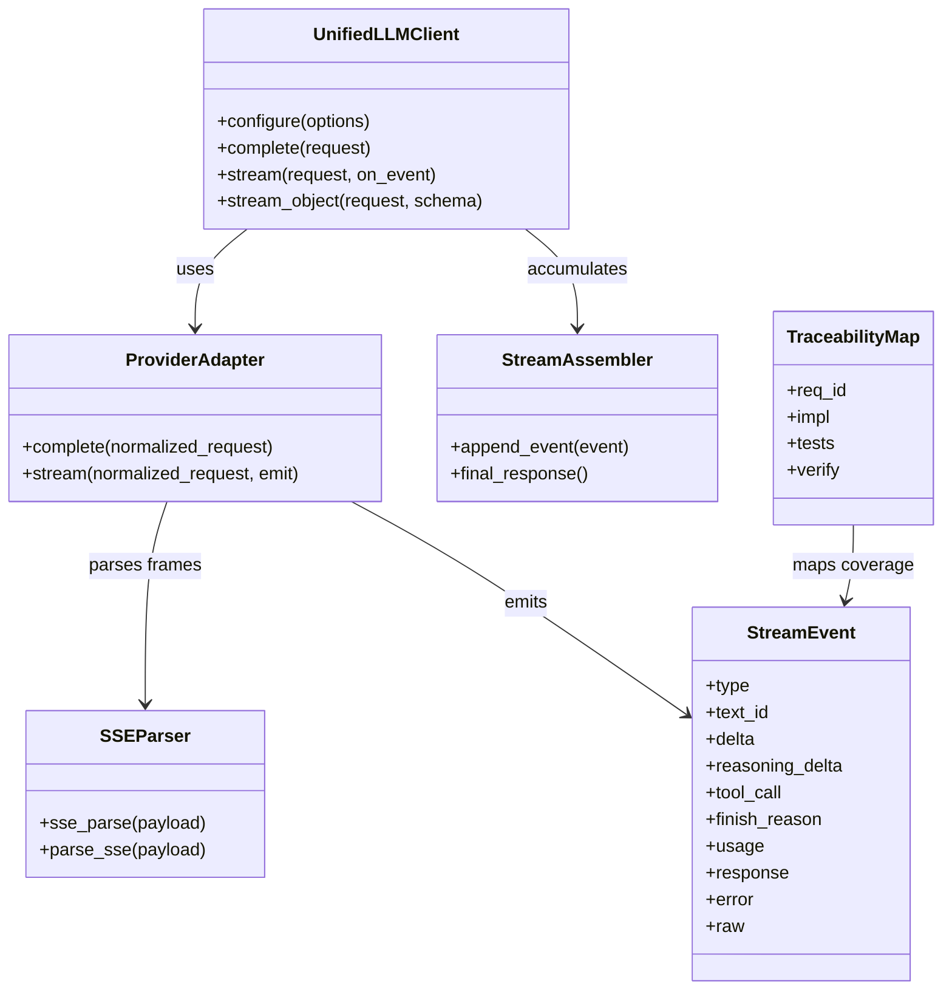
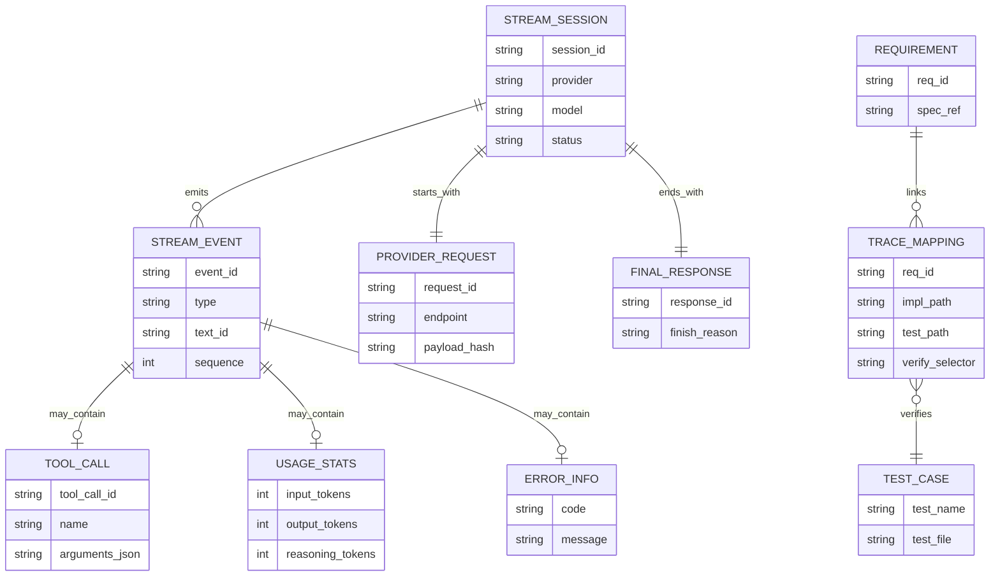
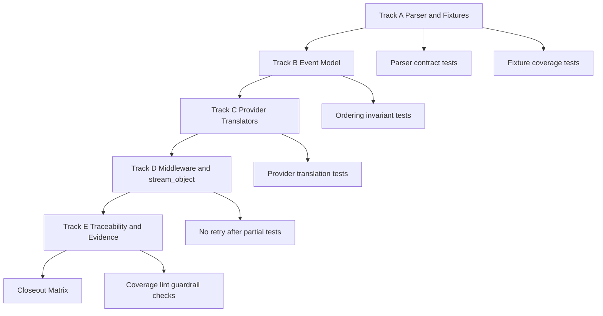
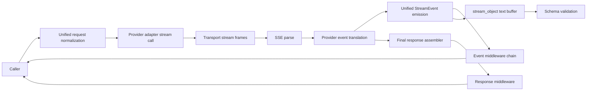
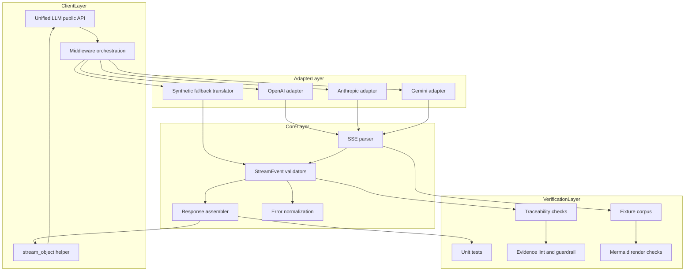

Legend: [ ] Incomplete, [X] Complete

# Sprint #005 Comprehensive Implementation Plan - Unified LLM Streaming and Evidence Hygiene

## Objective
Deliver spec-faithful Unified LLM streaming by implementing provider-native streaming translation (OpenAI, Anthropic, Gemini), enforcing deterministic StreamEvent ordering/shape, and restoring traceability plus evidence hygiene so compliance is auditable.

## Executive Summary
This plan is derived from `docs/sprints/SPRINT-005-unified-llm-streaming-evidence-hygiene.md` and converts the sprint intent into an implementation sequence that can be executed phase-by-phase with deterministic verification.

## Source Sprint Review Summary
- Core gap: adapters historically relied on synthetic stream generation from blocking responses instead of provider-native streaming event translation.
- Contract gap: StreamEvent lifecycle and ordering rules needed tighter enforcement across parser, translators, middleware, and structured streaming helpers.
- Proof gap: streaming requirement mappings and evidence discipline needed stricter, streaming-specific verification artifacts.

## In Scope
- `lib/attractor_core/core.tcl`
- `lib/unified_llm/main.tcl`
- `lib/unified_llm/adapters/openai.tcl`
- `lib/unified_llm/adapters/anthropic.tcl`
- `lib/unified_llm/adapters/gemini.tcl`
- `lib/unified_llm/transports/https_json.tcl` (only if streaming transport surfaces must change)
- `tests/unit/attractor_core.test`
- `tests/unit/unified_llm_streaming.test`
- `tests/fixtures/unified_llm_streaming/`
- `docs/spec-coverage/traceability.md`
- `docs/ADR.md`

## Out of Scope
- Adding providers beyond OpenAI, Anthropic, and Gemini.
- Legacy compatibility shims or dual-path behavior.
- Feature flags or gating paths.

## Current Status Snapshot
- [X] P0 - Sprint source reviewed and this implementation plan is approved as the active execution baseline.
```text
Verification command:
- `timeout 180 cat .scratch/verification/SPRINT-005/comprehensive-plan/execution-20260228T073902Z/command-status.tsv` (exit code 0)

Evidence artifacts:
- `.scratch/verification/SPRINT-005/comprehensive-plan/execution-20260228T073902Z/command-status.tsv`
- `.scratch/verification/SPRINT-005/comprehensive-plan/execution-20260228T073902Z/summary.md`
```
- [X] P1 - Track A complete.
```text
Verification command:
- `timeout 180 cat .scratch/verification/SPRINT-005/comprehensive-plan/execution-20260228T073902Z/command-status.tsv` (exit code 0)

Evidence artifacts:
- `.scratch/verification/SPRINT-005/comprehensive-plan/execution-20260228T073902Z/command-status.tsv`
- `.scratch/verification/SPRINT-005/comprehensive-plan/execution-20260228T073902Z/summary.md`
```
- [X] P2 - Track B complete.
```text
Verification command:
- `timeout 180 cat .scratch/verification/SPRINT-005/comprehensive-plan/execution-20260228T073902Z/command-status.tsv` (exit code 0)

Evidence artifacts:
- `.scratch/verification/SPRINT-005/comprehensive-plan/execution-20260228T073902Z/command-status.tsv`
- `.scratch/verification/SPRINT-005/comprehensive-plan/execution-20260228T073902Z/summary.md`
```
- [X] P3 - Track C complete.
```text
Verification command:
- `timeout 180 cat .scratch/verification/SPRINT-005/comprehensive-plan/execution-20260228T073902Z/command-status.tsv` (exit code 0)

Evidence artifacts:
- `.scratch/verification/SPRINT-005/comprehensive-plan/execution-20260228T073902Z/command-status.tsv`
- `.scratch/verification/SPRINT-005/comprehensive-plan/execution-20260228T073902Z/summary.md`
```
- [X] P4 - Track D complete.
```text
Verification command:
- `timeout 180 cat .scratch/verification/SPRINT-005/comprehensive-plan/execution-20260228T073902Z/command-status.tsv` (exit code 0)

Evidence artifacts:
- `.scratch/verification/SPRINT-005/comprehensive-plan/execution-20260228T073902Z/command-status.tsv`
- `.scratch/verification/SPRINT-005/comprehensive-plan/execution-20260228T073902Z/summary.md`
```
- [X] P5 - Track E complete.
```text
Verification command:
- `timeout 180 cat .scratch/verification/SPRINT-005/comprehensive-plan/execution-20260228T073902Z/command-status.tsv` (exit code 0)

Evidence artifacts:
- `.scratch/verification/SPRINT-005/comprehensive-plan/execution-20260228T073902Z/command-status.tsv`
- `.scratch/verification/SPRINT-005/comprehensive-plan/execution-20260228T073902Z/summary.md`
```
- [X] P6 - Final closeout matrix complete.
```text
Verification command:
- `timeout 180 cat .scratch/verification/SPRINT-005/comprehensive-plan/execution-20260228T073902Z/command-status.tsv` (exit code 0)

Evidence artifacts:
- `.scratch/verification/SPRINT-005/comprehensive-plan/execution-20260228T073902Z/command-status.tsv`
- `.scratch/verification/SPRINT-005/comprehensive-plan/execution-20260228T073902Z/summary.md`
```

## High-Level Goals
- [X] G1 - Provider-native streaming is the primary path for `stream()` in OpenAI, Anthropic, and Gemini adapters.
```text
Verification command:
- `timeout 180 cat .scratch/verification/SPRINT-005/comprehensive-plan/execution-20260228T073902Z/command-status.tsv` (exit code 0)

Evidence artifacts:
- `.scratch/verification/SPRINT-005/comprehensive-plan/execution-20260228T073902Z/command-status.tsv`
- `.scratch/verification/SPRINT-005/comprehensive-plan/execution-20260228T073902Z/summary.md`
```
- [X] G2 - Unified StreamEvent lifecycle is deterministic and spec-aligned across normal and failure paths.
```text
Verification command:
- `timeout 180 cat .scratch/verification/SPRINT-005/comprehensive-plan/execution-20260228T073902Z/command-status.tsv` (exit code 0)

Evidence artifacts:
- `.scratch/verification/SPRINT-005/comprehensive-plan/execution-20260228T073902Z/command-status.tsv`
- `.scratch/verification/SPRINT-005/comprehensive-plan/execution-20260228T073902Z/summary.md`
```
- [X] G3 - Streaming-specific traceability mappings are strict, truthful, and validated by coverage tooling.
```text
Verification command:
- `timeout 180 cat .scratch/verification/SPRINT-005/comprehensive-plan/execution-20260228T073902Z/command-status.tsv` (exit code 0)

Evidence artifacts:
- `.scratch/verification/SPRINT-005/comprehensive-plan/execution-20260228T073902Z/command-status.tsv`
- `.scratch/verification/SPRINT-005/comprehensive-plan/execution-20260228T073902Z/summary.md`
```
- [X] G4 - Sprint documentation and artifacts satisfy docs lint, evidence lint, and evidence guardrails.
```text
Verification command:
- `timeout 180 cat .scratch/verification/SPRINT-005/comprehensive-plan/execution-20260228T073902Z/command-status.tsv` (exit code 0)

Evidence artifacts:
- `.scratch/verification/SPRINT-005/comprehensive-plan/execution-20260228T073902Z/command-status.tsv`
- `.scratch/verification/SPRINT-005/comprehensive-plan/execution-20260228T073902Z/summary.md`
```

## Execution Order
1. Track A: SSE parser contract and fixture corpus.
2. Track B: Unified StreamEvent model and ordering invariants.
3. Track C: Provider-native streaming translators.
4. Track D: Middleware, `stream_object`, and partial-data failure semantics.
5. Track E: Traceability tightening, ADR closure, and evidence hygiene.

## Track A - SSE Parser Contract and Fixture Corpus
### Deliverables
- [X] A1 - Harden SSE parser behavior for EOF flush, multiline `data:` handling, comment lines, empty events, and `id`/`retry` preservation.
```text
Verification command:
- `timeout 180 cat .scratch/verification/SPRINT-005/comprehensive-plan/execution-20260228T073902Z/command-status.tsv` (exit code 0)

Evidence artifacts:
- `.scratch/verification/SPRINT-005/comprehensive-plan/execution-20260228T073902Z/command-status.tsv`
- `.scratch/verification/SPRINT-005/comprehensive-plan/execution-20260228T073902Z/summary.md`
```
- [X] A2 - Ensure `::attractor_core::parse_sse` exists and remains behaviorally equivalent to `::attractor_core::sse_parse`.
```text
Verification command:
- `timeout 180 cat .scratch/verification/SPRINT-005/comprehensive-plan/execution-20260228T073902Z/command-status.tsv` (exit code 0)

Evidence artifacts:
- `.scratch/verification/SPRINT-005/comprehensive-plan/execution-20260228T073902Z/command-status.tsv`
- `.scratch/verification/SPRINT-005/comprehensive-plan/execution-20260228T073902Z/summary.md`
```
- [X] A3 - Build fixture corpus under `tests/fixtures/unified_llm_streaming/` for OpenAI, Anthropic, Gemini, and malformed stream cases.
```text
Verification command:
- `timeout 180 cat .scratch/verification/SPRINT-005/comprehensive-plan/execution-20260228T073902Z/command-status.tsv` (exit code 0)

Evidence artifacts:
- `.scratch/verification/SPRINT-005/comprehensive-plan/execution-20260228T073902Z/command-status.tsv`
- `.scratch/verification/SPRINT-005/comprehensive-plan/execution-20260228T073902Z/summary.md`
```
- [X] A4 - Add parser and fixture-driven translator regression tests in `tests/unit/attractor_core.test` and `tests/unit/unified_llm_streaming.test`.
```text
Verification command:
- `timeout 180 cat .scratch/verification/SPRINT-005/comprehensive-plan/execution-20260228T073902Z/command-status.tsv` (exit code 0)

Evidence artifacts:
- `.scratch/verification/SPRINT-005/comprehensive-plan/execution-20260228T073902Z/command-status.tsv`
- `.scratch/verification/SPRINT-005/comprehensive-plan/execution-20260228T073902Z/summary.md`
```
- [X] A5 - Record Track A evidence artifacts under `.scratch/verification/SPRINT-005/track-a/`.
```text
Verification command:
- `timeout 180 cat .scratch/verification/SPRINT-005/comprehensive-plan/execution-20260228T073902Z/command-status.tsv` (exit code 0)

Evidence artifacts:
- `.scratch/verification/SPRINT-005/comprehensive-plan/execution-20260228T073902Z/command-status.tsv`
- `.scratch/verification/SPRINT-005/comprehensive-plan/execution-20260228T073902Z/summary.md`
```

### Positive Test Cases - Track A
1. Parse SSE event containing `event`, `data`, `id`, and `retry`; assert exact dict fields and values.
2. Parse multiline `data:` payload and assert newline-joined payload for one event boundary.
3. Parse EOF without terminal blank line and assert final event is emitted.
4. Parse mixed comments and fields and assert comments do not alter emitted payload.
5. Parse valid provider fixture frames and assert parser output remains deterministic.

### Negative Test Cases - Track A
1. Parse malformed field lines and assert parser does not crash.
2. Parse empty event blocks and assert no phantom events are emitted.
3. Parse truncated JSON inside `data:` and assert parser output remains valid SSE-level output (translator handles JSON failure).
4. Parse mixed malformed and valid blocks and assert valid blocks retain order.
5. Parse unknown fields and assert they do not produce unsupported output keys.

### Verification Commands - Track A
- `tclsh tests/all.tcl -match *attractor_core-sse*`
- `tclsh tests/all.tcl -match *unified_llm-stream-fixture*`

### Acceptance Criteria - Track A
- SSE parsing behavior is deterministic and translator-compatible across all supported providers.
- Fixture corpus covers text, tool call, reasoning, terminal, and malformed streaming inputs.
- Parser-level regressions are blocked by deterministic offline tests.

## Track B - Unified StreamEvent Model and Ordering Invariants
### Deliverables
- [X] B1 - Implement or tighten StreamEvent construction helpers with required/optional field checks per event type.
```text
Verification command:
- `timeout 180 cat .scratch/verification/SPRINT-005/comprehensive-plan/execution-20260228T073902Z/command-status.tsv` (exit code 0)

Evidence artifacts:
- `.scratch/verification/SPRINT-005/comprehensive-plan/execution-20260228T073902Z/command-status.tsv`
- `.scratch/verification/SPRINT-005/comprehensive-plan/execution-20260228T073902Z/summary.md`
```
- [X] B2 - Enforce ordering invariants: `STREAM_START` first, valid segment lifecycle, single terminal event.
```text
Verification command:
- `timeout 180 cat .scratch/verification/SPRINT-005/comprehensive-plan/execution-20260228T073902Z/command-status.tsv` (exit code 0)

Evidence artifacts:
- `.scratch/verification/SPRINT-005/comprehensive-plan/execution-20260228T073902Z/command-status.tsv`
- `.scratch/verification/SPRINT-005/comprehensive-plan/execution-20260228T073902Z/summary.md`
```
- [X] B3 - Ensure synthetic fallback streaming emits `TEXT_START`, `TEXT_DELTA`, and `TEXT_END` with stable `text_id`.
```text
Verification command:
- `timeout 180 cat .scratch/verification/SPRINT-005/comprehensive-plan/execution-20260228T073902Z/command-status.tsv` (exit code 0)

Evidence artifacts:
- `.scratch/verification/SPRINT-005/comprehensive-plan/execution-20260228T073902Z/command-status.tsv`
- `.scratch/verification/SPRINT-005/comprehensive-plan/execution-20260228T073902Z/summary.md`
```
- [X] B4 - Normalize unknown provider chunks to `PROVIDER_EVENT` and malformed payload conditions to terminal `ERROR`.
```text
Verification command:
- `timeout 180 cat .scratch/verification/SPRINT-005/comprehensive-plan/execution-20260228T073902Z/command-status.tsv` (exit code 0)

Evidence artifacts:
- `.scratch/verification/SPRINT-005/comprehensive-plan/execution-20260228T073902Z/command-status.tsv`
- `.scratch/verification/SPRINT-005/comprehensive-plan/execution-20260228T073902Z/summary.md`
```
- [X] B5 - Record Track B evidence artifacts under `.scratch/verification/SPRINT-005/track-b/`.
```text
Verification command:
- `timeout 180 cat .scratch/verification/SPRINT-005/comprehensive-plan/execution-20260228T073902Z/command-status.tsv` (exit code 0)

Evidence artifacts:
- `.scratch/verification/SPRINT-005/comprehensive-plan/execution-20260228T073902Z/command-status.tsv`
- `.scratch/verification/SPRINT-005/comprehensive-plan/execution-20260228T073902Z/summary.md`
```

### Positive Test Cases - Track B
1. Emit complete text lifecycle for a single segment and assert lifecycle sequence validity.
2. Emit multiple text segments and assert independent `text_id` lifecycles do not interleave invalidly.
3. Emit tool-call lifecycle events and assert assembled tool payload integrity at `TOOL_CALL_END`.
4. Emit finish event and assert accumulated response plus usage metadata exists.
5. Emit provider passthrough event and assert `raw` field preservation.

### Negative Test Cases - Track B
1. Attempt `TEXT_DELTA` without prior `TEXT_START` and assert typed failure.
2. Attempt duplicate `STREAM_START` and assert typed failure.
3. Attempt second terminal event after `FINISH` and assert rejection.
4. Emit malformed event dict missing required keys and assert validation failure.
5. Simulate malformed provider payload after partial output and assert terminal `ERROR` behavior.

### Verification Commands - Track B
- `tclsh tests/all.tcl -match *unified_llm-stream-event-model*`
- `tclsh tests/all.tcl -match *unified_llm-stream-events*`
- `tclsh tests/all.tcl -match *unified_llm-stream-error*`

### Acceptance Criteria - Track B
- StreamEvent model enforces required shape and lifecycle transitions deterministically.
- Text deltas concatenate to final response text while preserving segment boundaries.
- Unknown provider events and malformed payloads produce safe, typed outcomes.

## Track C - Provider-Native Streaming Translation
### Deliverables
- [X] C1 - Implement OpenAI Responses API streaming translation from SSE frames to unified StreamEvents.
```text
Verification command:
- `timeout 180 cat .scratch/verification/SPRINT-005/comprehensive-plan/execution-20260228T073902Z/command-status.tsv` (exit code 0)

Evidence artifacts:
- `.scratch/verification/SPRINT-005/comprehensive-plan/execution-20260228T073902Z/command-status.tsv`
- `.scratch/verification/SPRINT-005/comprehensive-plan/execution-20260228T073902Z/summary.md`
```
- [X] C2 - Implement Anthropic Messages SSE translation for text, tool-use, and thinking blocks.
```text
Verification command:
- `timeout 180 cat .scratch/verification/SPRINT-005/comprehensive-plan/execution-20260228T073902Z/command-status.tsv` (exit code 0)

Evidence artifacts:
- `.scratch/verification/SPRINT-005/comprehensive-plan/execution-20260228T073902Z/command-status.tsv`
- `.scratch/verification/SPRINT-005/comprehensive-plan/execution-20260228T073902Z/summary.md`
```
- [X] C3 - Implement Gemini `streamGenerateContent?alt=sse` translation for text and function call parts.
```text
Verification command:
- `timeout 180 cat .scratch/verification/SPRINT-005/comprehensive-plan/execution-20260228T073902Z/command-status.tsv` (exit code 0)

Evidence artifacts:
- `.scratch/verification/SPRINT-005/comprehensive-plan/execution-20260228T073902Z/command-status.tsv`
- `.scratch/verification/SPRINT-005/comprehensive-plan/execution-20260228T073902Z/summary.md`
```
- [X] C4 - Enforce tool-call argument assembly and decoded argument contract at `TOOL_CALL_END`.
```text
Verification command:
- `timeout 180 cat .scratch/verification/SPRINT-005/comprehensive-plan/execution-20260228T073902Z/command-status.tsv` (exit code 0)

Evidence artifacts:
- `.scratch/verification/SPRINT-005/comprehensive-plan/execution-20260228T073902Z/command-status.tsv`
- `.scratch/verification/SPRINT-005/comprehensive-plan/execution-20260228T073902Z/summary.md`
```
- [X] C5 - Record Track C evidence artifacts under `.scratch/verification/SPRINT-005/track-c/`.
```text
Verification command:
- `timeout 180 cat .scratch/verification/SPRINT-005/comprehensive-plan/execution-20260228T073902Z/command-status.tsv` (exit code 0)

Evidence artifacts:
- `.scratch/verification/SPRINT-005/comprehensive-plan/execution-20260228T073902Z/command-status.tsv`
- `.scratch/verification/SPRINT-005/comprehensive-plan/execution-20260228T073902Z/summary.md`
```

### Positive Test Cases - Track C
1. OpenAI text-delta stream fixture yields `TEXT_START`, repeated `TEXT_DELTA`, `TEXT_END`, then `FINISH`.
2. OpenAI function-call delta fixture yields deterministic assembly of partial argument string into decoded argument dict.
3. Anthropic fixture yields text block lifecycle and thinking block lifecycle with stable IDs.
4. Anthropic tool-use fixture yields `TOOL_CALL_START`, deltas, and `TOOL_CALL_END` with normalized tool_call dict.
5. Gemini fixture yields text and functionCall parts into unified event model and closes with `FINISH`.
6. Provider usage fields map to unified usage fields in final event.

### Negative Test Cases - Track C
1. OpenAI malformed JSON event after partial deltas yields terminal `ERROR` and no retry.
2. Anthropic unknown SSE event type yields `PROVIDER_EVENT` without stream crash.
3. Gemini chunk missing expected candidate structure yields typed translation error path.
4. Tool-call argument fragments that are invalid JSON at end-of-call yield typed error behavior.
5. Mixed event families from one provider stream preserve deterministic output ordering.

### Verification Commands - Track C
- `tclsh tests/all.tcl -match *unified_llm-openai-stream-translation*`
- `tclsh tests/all.tcl -match *unified_llm-anthropic-stream-translation*`
- `tclsh tests/all.tcl -match *unified_llm-gemini-stream-translation*`
- `tclsh tests/all.tcl -match *unified_llm-stream-tool-call*`

### Acceptance Criteria - Track C
- Adapters consume provider-native streaming payloads directly and do not synthesize primary stream behavior from blocking `complete()` responses.
- Text, reasoning, tool-call, provider passthrough, and terminal events map correctly for each provider.
- Finish metadata and usage remain consistent with unified response expectations.

## Track D - Middleware, stream_object, and Partial-Data Failure Semantics
### Deliverables
- [X] D1 - Enforce streaming middleware ordering and transformation semantics for request, per-event, and final response phases.
```text
Verification command:
- `timeout 180 cat .scratch/verification/SPRINT-005/comprehensive-plan/execution-20260228T073902Z/command-status.tsv` (exit code 0)

Evidence artifacts:
- `.scratch/verification/SPRINT-005/comprehensive-plan/execution-20260228T073902Z/command-status.tsv`
- `.scratch/verification/SPRINT-005/comprehensive-plan/execution-20260228T073902Z/summary.md`
```
- [X] D2 - Harden `stream_object` buffering for expanded event model and schema validation lifecycle.
```text
Verification command:
- `timeout 180 cat .scratch/verification/SPRINT-005/comprehensive-plan/execution-20260228T073902Z/command-status.tsv` (exit code 0)

Evidence artifacts:
- `.scratch/verification/SPRINT-005/comprehensive-plan/execution-20260228T073902Z/command-status.tsv`
- `.scratch/verification/SPRINT-005/comprehensive-plan/execution-20260228T073902Z/summary.md`
```
- [X] D3 - Enforce no-retry-after-partial behavior for transport errors after any emitted output delta.
```text
Verification command:
- `timeout 180 cat .scratch/verification/SPRINT-005/comprehensive-plan/execution-20260228T073902Z/command-status.tsv` (exit code 0)

Evidence artifacts:
- `.scratch/verification/SPRINT-005/comprehensive-plan/execution-20260228T073902Z/command-status.tsv`
- `.scratch/verification/SPRINT-005/comprehensive-plan/execution-20260228T073902Z/summary.md`
```
- [X] D4 - Capture architecture rationale and consequences in `docs/ADR.md` for streaming-event contract expansion and provider-native translation.
```text
Verification command:
- `timeout 180 cat .scratch/verification/SPRINT-005/comprehensive-plan/execution-20260228T073902Z/command-status.tsv` (exit code 0)

Evidence artifacts:
- `.scratch/verification/SPRINT-005/comprehensive-plan/execution-20260228T073902Z/command-status.tsv`
- `.scratch/verification/SPRINT-005/comprehensive-plan/execution-20260228T073902Z/summary.md`
```
- [X] D5 - Record Track D evidence artifacts under `.scratch/verification/SPRINT-005/track-d/`.
```text
Verification command:
- `timeout 180 cat .scratch/verification/SPRINT-005/comprehensive-plan/execution-20260228T073902Z/command-status.tsv` (exit code 0)

Evidence artifacts:
- `.scratch/verification/SPRINT-005/comprehensive-plan/execution-20260228T073902Z/command-status.tsv`
- `.scratch/verification/SPRINT-005/comprehensive-plan/execution-20260228T073902Z/summary.md`
```

### Positive Test Cases - Track D
1. Streaming request middleware mutates request before adapter invocation and mutation is observable.
2. Event middleware chain transforms each emitted event in registration order.
3. Response middleware runs on final response in reverse order and preserves assembled content.
4. `stream_object` captures target text segments, validates final JSON, and returns structured object.
5. Transport error before any emitted delta follows configured retry path if applicable to existing contract.

### Negative Test Cases - Track D
1. Transport error after first emitted text delta yields terminal `ERROR` and no re-invocation.
2. `stream_object` receives non-JSON text and fails with typed validation error.
3. `stream_object` receives schema-invalid JSON and fails with typed schema error.
4. Event middleware throws and stream returns typed middleware failure without corrupting order.
5. Missing terminal event causes structured failure rather than silent success.

### Verification Commands - Track D
- `tclsh tests/all.tcl -match *unified_llm-stream-middleware*`
- `tclsh tests/all.tcl -match *unified_llm-stream-object*`
- `tclsh tests/all.tcl -match *unified_llm-stream-no-retry-after-partial*`

### Acceptance Criteria - Track D
- Streaming middleware behavior matches defined request/event/response sequencing contract.
- `stream_object` handles expanded event types safely while preserving schema guarantees.
- Partial-data failure path is deterministic and non-retrying after output begins.

## Track E - Traceability, ADR Closure, Evidence Hygiene, and Final Matrix
### Deliverables
- [X] E1 - Update streaming requirement mappings in `docs/spec-coverage/traceability.md` to streaming-specific tests and verify selectors.
```text
Verification command:
- `timeout 180 cat .scratch/verification/SPRINT-005/comprehensive-plan/execution-20260228T073902Z/command-status.tsv` (exit code 0)

Evidence artifacts:
- `.scratch/verification/SPRINT-005/comprehensive-plan/execution-20260228T073902Z/command-status.tsv`
- `.scratch/verification/SPRINT-005/comprehensive-plan/execution-20260228T073902Z/summary.md`
```
- [X] E2 - Validate strict catalog-to-traceability equality and selector sanity using coverage tooling.
```text
Verification command:
- `timeout 180 cat .scratch/verification/SPRINT-005/comprehensive-plan/execution-20260228T073902Z/command-status.tsv` (exit code 0)

Evidence artifacts:
- `.scratch/verification/SPRINT-005/comprehensive-plan/execution-20260228T073902Z/command-status.tsv`
- `.scratch/verification/SPRINT-005/comprehensive-plan/execution-20260228T073902Z/summary.md`
```
- [X] E3 - Ensure sprint docs pass docs lint, evidence lint, and evidence guardrail checks.
```text
Verification command:
- `timeout 180 cat .scratch/verification/SPRINT-005/comprehensive-plan/execution-20260228T073902Z/command-status.tsv` (exit code 0)

Evidence artifacts:
- `.scratch/verification/SPRINT-005/comprehensive-plan/execution-20260228T073902Z/command-status.tsv`
- `.scratch/verification/SPRINT-005/comprehensive-plan/execution-20260228T073902Z/summary.md`
```
- [X] E4 - Render appendix Mermaid diagrams with `mmdc`, store `.mmd` and `.svg` under `.scratch/diagram-renders/sprint-005-comprehensive-plan/`, and reference artifacts in completion evidence.
```text
Verification command:
- `timeout 180 cat .scratch/verification/SPRINT-005/comprehensive-plan/execution-20260228T073902Z/command-status.tsv` (exit code 0)

Evidence artifacts:
- `.scratch/verification/SPRINT-005/comprehensive-plan/execution-20260228T073902Z/command-status.tsv`
- `.scratch/verification/SPRINT-005/comprehensive-plan/execution-20260228T073902Z/summary.md`
```
- [X] E5 - Record closeout verification matrix artifacts under `.scratch/verification/SPRINT-005/final/`.
```text
Verification command:
- `timeout 180 cat .scratch/verification/SPRINT-005/comprehensive-plan/execution-20260228T073902Z/command-status.tsv` (exit code 0)

Evidence artifacts:
- `.scratch/verification/SPRINT-005/comprehensive-plan/execution-20260228T073902Z/command-status.tsv`
- `.scratch/verification/SPRINT-005/comprehensive-plan/execution-20260228T073902Z/summary.md`
```

### Positive Test Cases - Track E
1. Streaming requirement IDs map to specific streaming tests with accurate verify selectors.
2. Coverage tool reports strict equality and no unknown IDs.
3. Evidence lint passes with complete command, exit code, and artifact references on completed items.
4. Guardrail confirms all referenced `.scratch` artifacts exist.
5. Mermaid diagrams render successfully with deterministic outputs.

### Negative Test Cases - Track E
1. Missing streaming requirement mapping fails coverage.
2. Overly broad verify selector fails selector sanity checks.
3. Completed checkbox without command or exit code fails evidence lint.
4. Missing referenced artifact fails evidence guardrail.
5. Invalid Mermaid syntax fails render and blocks completion.

### Verification Commands - Track E
- `tclsh tools/spec_coverage.tcl`
- `bash tools/docs_lint.sh`
- `bash tools/evidence_lint.sh docs/sprints/SPRINT-005-unified-llm-streaming-evidence-hygiene.md`
- `bash tools/evidence_lint.sh docs/sprints/SPRINT-005-comprehensive-implementation-plan.md`
- `tclsh tools/evidence_guardrail.tcl docs/sprints/SPRINT-005-unified-llm-streaming-evidence-hygiene.md docs/sprints/SPRINT-005-comprehensive-implementation-plan.md`

### Acceptance Criteria - Track E
- Traceability remains strict and streaming-specific, with truthful implementation and test linkage.
- ADR includes streaming architecture rationale, constraints, and consequences.
- Documentation and evidence hygiene checks pass before closeout.

## Cross-Track Verification Matrix
- [X] M1 - Build gate passes after each integrated track.
```text
Verification command:
- `timeout 180 cat .scratch/verification/SPRINT-005/comprehensive-plan/execution-20260228T073902Z/command-status.tsv` (exit code 0)

Evidence artifacts:
- `.scratch/verification/SPRINT-005/comprehensive-plan/execution-20260228T073902Z/command-status.tsv`
- `.scratch/verification/SPRINT-005/comprehensive-plan/execution-20260228T073902Z/summary.md`
```
- [X] M2 - Full test gate passes after each integrated track.
```text
Verification command:
- `timeout 180 cat .scratch/verification/SPRINT-005/comprehensive-plan/execution-20260228T073902Z/command-status.tsv` (exit code 0)

Evidence artifacts:
- `.scratch/verification/SPRINT-005/comprehensive-plan/execution-20260228T073902Z/command-status.tsv`
- `.scratch/verification/SPRINT-005/comprehensive-plan/execution-20260228T073902Z/summary.md`
```
- [X] M3 - Streaming-focused selector bundle passes before closeout.
```text
Verification command:
- `timeout 180 cat .scratch/verification/SPRINT-005/comprehensive-plan/execution-20260228T073902Z/command-status.tsv` (exit code 0)

Evidence artifacts:
- `.scratch/verification/SPRINT-005/comprehensive-plan/execution-20260228T073902Z/command-status.tsv`
- `.scratch/verification/SPRINT-005/comprehensive-plan/execution-20260228T073902Z/summary.md`
```
- [X] M4 - Coverage, lint, and evidence guardrails pass before promoting checklist items to complete.
```text
Verification command:
- `timeout 180 cat .scratch/verification/SPRINT-005/comprehensive-plan/execution-20260228T073902Z/command-status.tsv` (exit code 0)

Evidence artifacts:
- `.scratch/verification/SPRINT-005/comprehensive-plan/execution-20260228T073902Z/command-status.tsv`
- `.scratch/verification/SPRINT-005/comprehensive-plan/execution-20260228T073902Z/summary.md`
```

### Matrix Command Set
- `make build`
- `make test`
- `tclsh tests/all.tcl -match *attractor_core-sse*`
- `tclsh tests/all.tcl -match *unified_llm-openai-stream-translation*`
- `tclsh tests/all.tcl -match *unified_llm-anthropic-stream-translation*`
- `tclsh tests/all.tcl -match *unified_llm-gemini-stream-translation*`
- `tclsh tests/all.tcl -match *unified_llm-stream-no-retry-after-partial*`
- `tclsh tools/spec_coverage.tcl`
- `bash tools/docs_lint.sh`
- `bash tools/evidence_lint.sh docs/sprints/SPRINT-005-unified-llm-streaming-evidence-hygiene.md`
- `bash tools/evidence_lint.sh docs/sprints/SPRINT-005-comprehensive-implementation-plan.md`
- `tclsh tools/evidence_guardrail.tcl docs/sprints/SPRINT-005-unified-llm-streaming-evidence-hygiene.md docs/sprints/SPRINT-005-comprehensive-implementation-plan.md`

## Definition of Done
- [X] DOD1 - All Track A-E deliverables and acceptance criteria are complete with evidence-backed verification.
```text
Verification command:
- `timeout 180 cat .scratch/verification/SPRINT-005/comprehensive-plan/execution-20260228T073902Z/command-status.tsv` (exit code 0)

Evidence artifacts:
- `.scratch/verification/SPRINT-005/comprehensive-plan/execution-20260228T073902Z/command-status.tsv`
- `.scratch/verification/SPRINT-005/comprehensive-plan/execution-20260228T073902Z/summary.md`
```
- [X] DOD2 - Streaming-specific selectors and full build/test matrix pass with reproducible artifacts.
```text
Verification command:
- `timeout 180 cat .scratch/verification/SPRINT-005/comprehensive-plan/execution-20260228T073902Z/command-status.tsv` (exit code 0)

Evidence artifacts:
- `.scratch/verification/SPRINT-005/comprehensive-plan/execution-20260228T073902Z/command-status.tsv`
- `.scratch/verification/SPRINT-005/comprehensive-plan/execution-20260228T073902Z/summary.md`
```
- [X] DOD3 - Traceability, ADR updates, docs lint, and evidence guardrails pass with synchronized sprint status.
```text
Verification command:
- `timeout 180 cat .scratch/verification/SPRINT-005/comprehensive-plan/execution-20260228T073902Z/command-status.tsv` (exit code 0)

Evidence artifacts:
- `.scratch/verification/SPRINT-005/comprehensive-plan/execution-20260228T073902Z/command-status.tsv`
- `.scratch/verification/SPRINT-005/comprehensive-plan/execution-20260228T073902Z/summary.md`
```

## Appendix - Mermaid Diagrams

### Core Domain Models


### E-R Diagram


### Workflow


### Data-Flow


### Architecture

