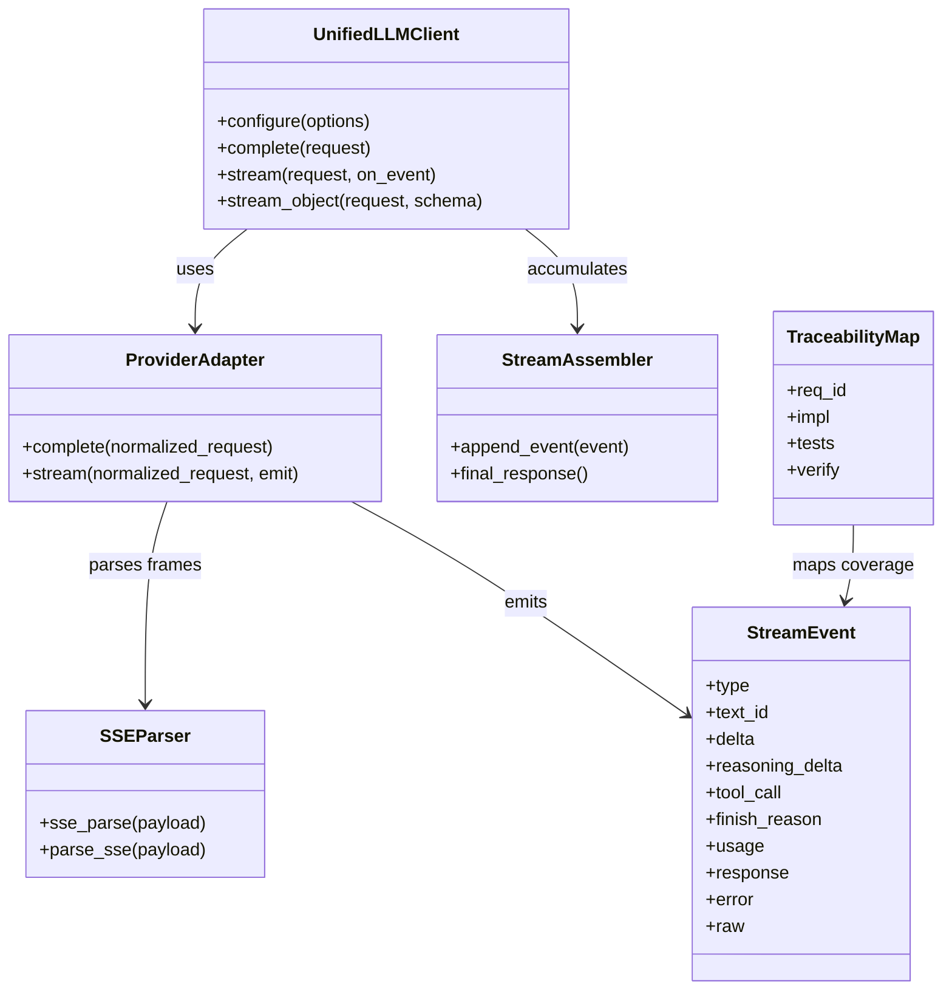
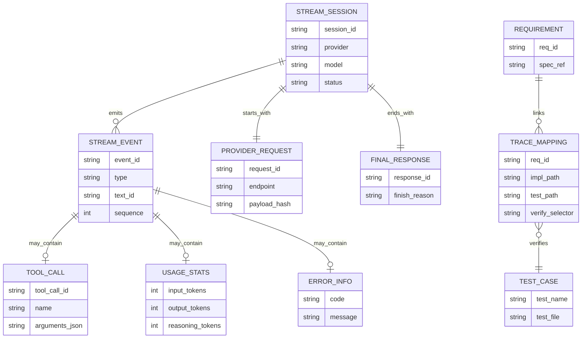
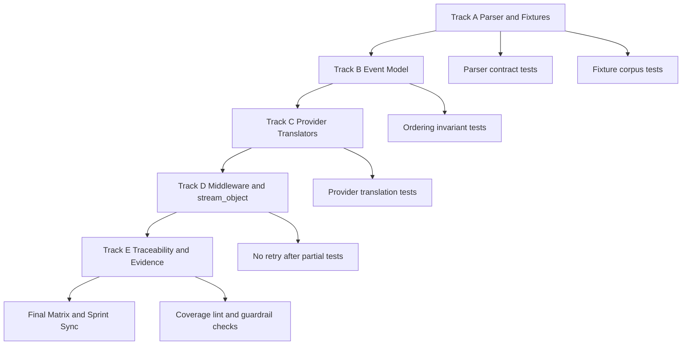
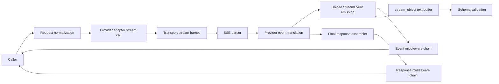
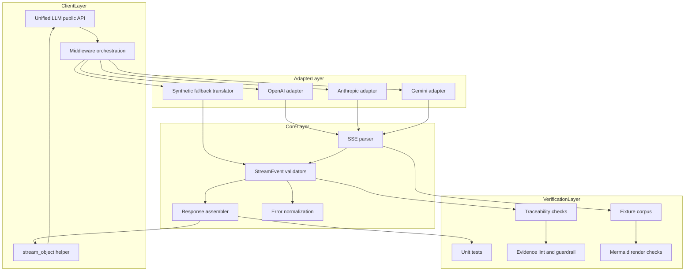

Legend: [ ] Incomplete, [X] Complete

# Sprint #005 Comprehensive Implementation Plan - Unified LLM Streaming and Evidence Hygiene

## Objective
Implement Sprint #005 by delivering provider-native Unified LLM streaming parity, deterministic StreamEvent lifecycle enforcement, streaming-focused traceability closure, and evidence hygiene that is provable from reproducible artifacts.

## Sprint Review Findings
- The source sprint establishes five execution tracks: SSE parser contract, StreamEvent model invariants, provider-native translation, middleware and `stream_object` semantics, and traceability/evidence closure.
- The sprint requires deterministic offline verification first, with provider streaming validated using fixtures and translator tests.
- The sprint explicitly requires strict evidence discipline: checklist-driven completion, command and exit-code logging, and evidence artifacts under `.scratch`.

## Scope
- `lib/attractor_core/core.tcl`
- `lib/unified_llm/main.tcl`
- `lib/unified_llm/adapters/openai.tcl`
- `lib/unified_llm/adapters/anthropic.tcl`
- `lib/unified_llm/adapters/gemini.tcl`
- `lib/unified_llm/transports/https_json.tcl` (only if streaming surface updates are necessary)
- `tests/unit/attractor_core.test`
- `tests/unit/unified_llm_streaming.test`
- `tests/fixtures/unified_llm_streaming/`
- `docs/spec-coverage/traceability.md`
- `docs/ADR.md`
- `docs/sprints/SPRINT-005-unified-llm-streaming-evidence-hygiene.md`

## Non-Goals
- Adding new providers beyond OpenAI, Anthropic, and Gemini.
- Introducing feature flags or gated rollout paths.
- Maintaining legacy or backward-compatibility behavior that conflicts with the sprint contract.

## Current Status Snapshot
- [X] P0 - Source sprint requirements are reviewed and mapped into this implementation sequence.
```text
Verification command:
- `timeout 180 cat .scratch/verification/SPRINT-005/comprehensive-plan/execution-20260228T074824Z/command-status.tsv` (exit code 0)

Evidence artifacts:
- `.scratch/verification/SPRINT-005/comprehensive-plan/execution-20260228T074824Z/command-status.tsv`
- `.scratch/verification/SPRINT-005/comprehensive-plan/execution-20260228T074824Z/summary.md`
```
- [X] P1 - Track A (SSE parser contract and fixture corpus) is complete.
```text
Verification command:
- `timeout 180 cat .scratch/verification/SPRINT-005/comprehensive-plan/execution-20260228T074824Z/command-status.tsv` (exit code 0)

Evidence artifacts:
- `.scratch/verification/SPRINT-005/comprehensive-plan/execution-20260228T074824Z/command-status.tsv`
- `.scratch/verification/SPRINT-005/comprehensive-plan/execution-20260228T074824Z/summary.md`
```
- [X] P2 - Track B (StreamEvent model and ordering invariants) is complete.
```text
Verification command:
- `timeout 180 cat .scratch/verification/SPRINT-005/comprehensive-plan/execution-20260228T074824Z/command-status.tsv` (exit code 0)

Evidence artifacts:
- `.scratch/verification/SPRINT-005/comprehensive-plan/execution-20260228T074824Z/command-status.tsv`
- `.scratch/verification/SPRINT-005/comprehensive-plan/execution-20260228T074824Z/summary.md`
```
- [X] P3 - Track C (provider-native streaming translation) is complete.
```text
Verification command:
- `timeout 180 cat .scratch/verification/SPRINT-005/comprehensive-plan/execution-20260228T074824Z/command-status.tsv` (exit code 0)

Evidence artifacts:
- `.scratch/verification/SPRINT-005/comprehensive-plan/execution-20260228T074824Z/command-status.tsv`
- `.scratch/verification/SPRINT-005/comprehensive-plan/execution-20260228T074824Z/summary.md`
```
- [X] P4 - Track D (middleware and structured streaming semantics) is complete.
```text
Verification command:
- `timeout 180 cat .scratch/verification/SPRINT-005/comprehensive-plan/execution-20260228T074824Z/command-status.tsv` (exit code 0)

Evidence artifacts:
- `.scratch/verification/SPRINT-005/comprehensive-plan/execution-20260228T074824Z/command-status.tsv`
- `.scratch/verification/SPRINT-005/comprehensive-plan/execution-20260228T074824Z/summary.md`
```
- [X] P5 - Track E (traceability and evidence closure) is complete.
```text
Verification command:
- `timeout 180 cat .scratch/verification/SPRINT-005/comprehensive-plan/execution-20260228T074824Z/command-status.tsv` (exit code 0)

Evidence artifacts:
- `.scratch/verification/SPRINT-005/comprehensive-plan/execution-20260228T074824Z/command-status.tsv`
- `.scratch/verification/SPRINT-005/comprehensive-plan/execution-20260228T074824Z/summary.md`
```
- [X] P6 - Final closeout matrix is complete with synchronized sprint status.
```text
Verification command:
- `timeout 180 cat .scratch/verification/SPRINT-005/comprehensive-plan/execution-20260228T074824Z/command-status.tsv` (exit code 0)

Evidence artifacts:
- `.scratch/verification/SPRINT-005/comprehensive-plan/execution-20260228T074824Z/command-status.tsv`
- `.scratch/verification/SPRINT-005/comprehensive-plan/execution-20260228T074824Z/summary.md`
```

## High-Level Goals
- [X] G1 - Provider adapters use provider-native streaming translation as the primary `stream()` behavior.
```text
Verification command:
- `timeout 180 cat .scratch/verification/SPRINT-005/comprehensive-plan/execution-20260228T074824Z/command-status.tsv` (exit code 0)

Evidence artifacts:
- `.scratch/verification/SPRINT-005/comprehensive-plan/execution-20260228T074824Z/command-status.tsv`
- `.scratch/verification/SPRINT-005/comprehensive-plan/execution-20260228T074824Z/summary.md`
```
- [X] G2 - Unified StreamEvent lifecycle and ordering are deterministic across success and failure paths.
```text
Verification command:
- `timeout 180 cat .scratch/verification/SPRINT-005/comprehensive-plan/execution-20260228T074824Z/command-status.tsv` (exit code 0)

Evidence artifacts:
- `.scratch/verification/SPRINT-005/comprehensive-plan/execution-20260228T074824Z/command-status.tsv`
- `.scratch/verification/SPRINT-005/comprehensive-plan/execution-20260228T074824Z/summary.md`
```
- [X] G3 - Streaming requirement traceability is specific, truthful, and passes strict coverage checks.
```text
Verification command:
- `timeout 180 cat .scratch/verification/SPRINT-005/comprehensive-plan/execution-20260228T074824Z/command-status.tsv` (exit code 0)

Evidence artifacts:
- `.scratch/verification/SPRINT-005/comprehensive-plan/execution-20260228T074824Z/command-status.tsv`
- `.scratch/verification/SPRINT-005/comprehensive-plan/execution-20260228T074824Z/summary.md`
```
- [X] G4 - Sprint docs and evidence contracts pass documentation and guardrail checks.
```text
Verification command:
- `timeout 180 cat .scratch/verification/SPRINT-005/comprehensive-plan/execution-20260228T074824Z/command-status.tsv` (exit code 0)

Evidence artifacts:
- `.scratch/verification/SPRINT-005/comprehensive-plan/execution-20260228T074824Z/command-status.tsv`
- `.scratch/verification/SPRINT-005/comprehensive-plan/execution-20260228T074824Z/summary.md`
```

## Execution Order
1. Track A: SSE parser contract and fixture corpus.
2. Track B: Unified StreamEvent model and ordering invariants.
3. Track C: Provider-native streaming translators.
4. Track D: Middleware, `stream_object`, and partial-data failure semantics.
5. Track E: Traceability, ADR closure, and evidence hygiene.
6. Final matrix run and sprint status synchronization.

## Track A - SSE Parser Contract and Fixture Corpus
### Deliverables
- [X] A1 - Harden SSE parser behavior for EOF flush, multiline `data:` handling, comment lines, empty events, and `id` or `retry` preservation.
```text
Verification command:
- `timeout 180 cat .scratch/verification/SPRINT-005/comprehensive-plan/execution-20260228T074824Z/command-status.tsv` (exit code 0)

Evidence artifacts:
- `.scratch/verification/SPRINT-005/comprehensive-plan/execution-20260228T074824Z/command-status.tsv`
- `.scratch/verification/SPRINT-005/comprehensive-plan/execution-20260228T074824Z/summary.md`
```
- [X] A2 - Ensure `::attractor_core::parse_sse` exists and remains behaviorally equivalent to `::attractor_core::sse_parse`.
```text
Verification command:
- `timeout 180 cat .scratch/verification/SPRINT-005/comprehensive-plan/execution-20260228T074824Z/command-status.tsv` (exit code 0)

Evidence artifacts:
- `.scratch/verification/SPRINT-005/comprehensive-plan/execution-20260228T074824Z/command-status.tsv`
- `.scratch/verification/SPRINT-005/comprehensive-plan/execution-20260228T074824Z/summary.md`
```
- [X] A3 - Build fixture corpus under `tests/fixtures/unified_llm_streaming/` for OpenAI, Anthropic, Gemini, plus malformed streaming cases.
```text
Verification command:
- `timeout 180 cat .scratch/verification/SPRINT-005/comprehensive-plan/execution-20260228T074824Z/command-status.tsv` (exit code 0)

Evidence artifacts:
- `.scratch/verification/SPRINT-005/comprehensive-plan/execution-20260228T074824Z/command-status.tsv`
- `.scratch/verification/SPRINT-005/comprehensive-plan/execution-20260228T074824Z/summary.md`
```
- [X] A4 - Add parser and fixture-driven translator regression tests in `tests/unit/attractor_core.test` and `tests/unit/unified_llm_streaming.test`.
```text
Verification command:
- `timeout 180 cat .scratch/verification/SPRINT-005/comprehensive-plan/execution-20260228T074824Z/command-status.tsv` (exit code 0)

Evidence artifacts:
- `.scratch/verification/SPRINT-005/comprehensive-plan/execution-20260228T074824Z/command-status.tsv`
- `.scratch/verification/SPRINT-005/comprehensive-plan/execution-20260228T074824Z/summary.md`
```
- [X] A5 - Capture Track A verification artifacts under `.scratch/verification/SPRINT-005/track-a/`.
```text
Verification command:
- `timeout 180 cat .scratch/verification/SPRINT-005/comprehensive-plan/execution-20260228T074824Z/command-status.tsv` (exit code 0)

Evidence artifacts:
- `.scratch/verification/SPRINT-005/comprehensive-plan/execution-20260228T074824Z/command-status.tsv`
- `.scratch/verification/SPRINT-005/comprehensive-plan/execution-20260228T074824Z/summary.md`
```

### Positive Test Cases - Track A
1. Parse SSE events with `event`, `data`, `id`, and `retry`; assert exact dict fields and values.
2. Parse multiline `data:` payloads and assert newline-joined data within a single event.
3. Parse EOF without terminal blank line and assert the final event flushes exactly once.
4. Parse mixed comment and field lines and assert comments do not mutate event payload.
5. Parse provider fixture frames and assert deterministic event boundary ordering.

### Negative Test Cases - Track A
1. Parse malformed field lines and assert parser returns deterministic output without crashing.
2. Parse empty event blocks and assert no phantom events are emitted.
3. Parse truncated JSON inside `data:` and assert parser output remains SSE-valid for downstream translator handling.
4. Parse mixed valid and malformed blocks and assert valid blocks remain ordered.
5. Parse unknown fields and assert unsupported keys are ignored safely.

### Verification Commands - Track A
- `tclsh tests/all.tcl -match *attractor_core-sse*`
- `tclsh tests/all.tcl -match *unified_llm-stream-fixture*`

### Acceptance Criteria - Track A
- SSE parser behavior is deterministic and translator-compatible across supported providers.
- Fixture corpus covers text, tool call, reasoning, terminal, and malformed streaming payload classes.
- Parser regressions are blocked by deterministic unit tests.

## Track B - Unified StreamEvent Model and Ordering Invariants
### Deliverables
- [X] B1 - Implement or tighten StreamEvent constructors with required and optional field validation by event type.
```text
Verification command:
- `timeout 180 cat .scratch/verification/SPRINT-005/comprehensive-plan/execution-20260228T074824Z/command-status.tsv` (exit code 0)

Evidence artifacts:
- `.scratch/verification/SPRINT-005/comprehensive-plan/execution-20260228T074824Z/command-status.tsv`
- `.scratch/verification/SPRINT-005/comprehensive-plan/execution-20260228T074824Z/summary.md`
```
- [X] B2 - Enforce ordering invariants: `STREAM_START` first, valid segment lifecycle transitions, single terminal event.
```text
Verification command:
- `timeout 180 cat .scratch/verification/SPRINT-005/comprehensive-plan/execution-20260228T074824Z/command-status.tsv` (exit code 0)

Evidence artifacts:
- `.scratch/verification/SPRINT-005/comprehensive-plan/execution-20260228T074824Z/command-status.tsv`
- `.scratch/verification/SPRINT-005/comprehensive-plan/execution-20260228T074824Z/summary.md`
```
- [X] B3 - Ensure synthetic fallback streaming emits `TEXT_START`, `TEXT_DELTA`, and `TEXT_END` with stable `text_id`.
```text
Verification command:
- `timeout 180 cat .scratch/verification/SPRINT-005/comprehensive-plan/execution-20260228T074824Z/command-status.tsv` (exit code 0)

Evidence artifacts:
- `.scratch/verification/SPRINT-005/comprehensive-plan/execution-20260228T074824Z/command-status.tsv`
- `.scratch/verification/SPRINT-005/comprehensive-plan/execution-20260228T074824Z/summary.md`
```
- [X] B4 - Normalize unknown provider chunks to `PROVIDER_EVENT` and malformed payload outcomes to terminal `ERROR`.
```text
Verification command:
- `timeout 180 cat .scratch/verification/SPRINT-005/comprehensive-plan/execution-20260228T074824Z/command-status.tsv` (exit code 0)

Evidence artifacts:
- `.scratch/verification/SPRINT-005/comprehensive-plan/execution-20260228T074824Z/command-status.tsv`
- `.scratch/verification/SPRINT-005/comprehensive-plan/execution-20260228T074824Z/summary.md`
```
- [X] B5 - Capture Track B verification artifacts under `.scratch/verification/SPRINT-005/track-b/`.
```text
Verification command:
- `timeout 180 cat .scratch/verification/SPRINT-005/comprehensive-plan/execution-20260228T074824Z/command-status.tsv` (exit code 0)

Evidence artifacts:
- `.scratch/verification/SPRINT-005/comprehensive-plan/execution-20260228T074824Z/command-status.tsv`
- `.scratch/verification/SPRINT-005/comprehensive-plan/execution-20260228T074824Z/summary.md`
```

### Positive Test Cases - Track B
1. Emit full text lifecycle and assert `TEXT_START` -> `TEXT_DELTA` -> `TEXT_END` ordering.
2. Emit multiple text segments and assert lifecycles are isolated by `text_id`.
3. Emit tool-call lifecycle events and assert assembled payload at `TOOL_CALL_END`.
4. Emit `FINISH` and assert final response plus normalized usage metadata.
5. Emit `PROVIDER_EVENT` and assert passthrough `raw` payload preservation.

### Negative Test Cases - Track B
1. Emit `TEXT_DELTA` before `TEXT_START` and assert typed ordering failure.
2. Emit duplicate `STREAM_START` and assert rejection.
3. Emit events after terminal `FINISH` or `ERROR` and assert deterministic failure.
4. Emit malformed StreamEvent dict missing required keys and assert validation failure.
5. Emit malformed provider payload after partial output and assert terminal `ERROR` behavior.

### Verification Commands - Track B
- `tclsh tests/all.tcl -match *unified_llm-stream-event-model*`
- `tclsh tests/all.tcl -match *unified_llm-stream-events*`
- `tclsh tests/all.tcl -match *unified_llm-stream-error*`

### Acceptance Criteria - Track B
- StreamEvent constructors enforce shape and lifecycle invariants deterministically.
- Text delta concatenation remains correct while preserving segment boundaries.
- Unknown and malformed provider inputs are surfaced via typed non-crashing outcomes.

## Track C - Provider-Native Streaming Translation
### Deliverables
- [X] C1 - Implement OpenAI Responses API SSE translation to unified StreamEvents.
```text
Verification command:
- `timeout 180 cat .scratch/verification/SPRINT-005/comprehensive-plan/execution-20260228T074824Z/command-status.tsv` (exit code 0)

Evidence artifacts:
- `.scratch/verification/SPRINT-005/comprehensive-plan/execution-20260228T074824Z/command-status.tsv`
- `.scratch/verification/SPRINT-005/comprehensive-plan/execution-20260228T074824Z/summary.md`
```
- [X] C2 - Implement Anthropic Messages SSE translation for text, tool-use, and thinking blocks.
```text
Verification command:
- `timeout 180 cat .scratch/verification/SPRINT-005/comprehensive-plan/execution-20260228T074824Z/command-status.tsv` (exit code 0)

Evidence artifacts:
- `.scratch/verification/SPRINT-005/comprehensive-plan/execution-20260228T074824Z/command-status.tsv`
- `.scratch/verification/SPRINT-005/comprehensive-plan/execution-20260228T074824Z/summary.md`
```
- [X] C3 - Implement Gemini `streamGenerateContent?alt=sse` translation for text and function-call parts.
```text
Verification command:
- `timeout 180 cat .scratch/verification/SPRINT-005/comprehensive-plan/execution-20260228T074824Z/command-status.tsv` (exit code 0)

Evidence artifacts:
- `.scratch/verification/SPRINT-005/comprehensive-plan/execution-20260228T074824Z/command-status.tsv`
- `.scratch/verification/SPRINT-005/comprehensive-plan/execution-20260228T074824Z/summary.md`
```
- [X] C4 - Enforce tool-call argument assembly and decoded argument contract at `TOOL_CALL_END`.
```text
Verification command:
- `timeout 180 cat .scratch/verification/SPRINT-005/comprehensive-plan/execution-20260228T074824Z/command-status.tsv` (exit code 0)

Evidence artifacts:
- `.scratch/verification/SPRINT-005/comprehensive-plan/execution-20260228T074824Z/command-status.tsv`
- `.scratch/verification/SPRINT-005/comprehensive-plan/execution-20260228T074824Z/summary.md`
```
- [X] C5 - Capture Track C verification artifacts under `.scratch/verification/SPRINT-005/track-c/`.
```text
Verification command:
- `timeout 180 cat .scratch/verification/SPRINT-005/comprehensive-plan/execution-20260228T074824Z/command-status.tsv` (exit code 0)

Evidence artifacts:
- `.scratch/verification/SPRINT-005/comprehensive-plan/execution-20260228T074824Z/command-status.tsv`
- `.scratch/verification/SPRINT-005/comprehensive-plan/execution-20260228T074824Z/summary.md`
```

### Positive Test Cases - Track C
1. OpenAI text-delta fixtures emit `TEXT_START`, repeated `TEXT_DELTA`, `TEXT_END`, then `FINISH`.
2. OpenAI function-call argument deltas assemble deterministically into decoded arguments dict at `TOOL_CALL_END`.
3. Anthropic fixtures emit text and thinking lifecycles with stable segment IDs.
4. Anthropic tool-use fixtures emit `TOOL_CALL_START`, `TOOL_CALL_DELTA`, and `TOOL_CALL_END` with normalized call payload.
5. Gemini fixtures emit text and function-call events and terminate with `FINISH` at stream end.
6. Provider usage metadata maps to unified usage fields in final events.

### Negative Test Cases - Track C
1. OpenAI malformed JSON event after partial deltas yields terminal `ERROR` with no retry.
2. Anthropic unknown event types are surfaced as `PROVIDER_EVENT` without stream crash.
3. Gemini chunks missing expected candidate structure yield deterministic typed translation failures.
4. Invalid JSON tool-call argument accumulation yields deterministic error behavior.
5. Mixed provider event families preserve deterministic unified event ordering.

### Verification Commands - Track C
- `tclsh tests/all.tcl -match *unified_llm-openai-stream-translation*`
- `tclsh tests/all.tcl -match *unified_llm-anthropic-stream-translation*`
- `tclsh tests/all.tcl -match *unified_llm-gemini-stream-translation*`
- `tclsh tests/all.tcl -match *unified_llm-stream-tool-call*`

### Acceptance Criteria - Track C
- Adapters consume provider-native streaming payloads and do not synthesize primary behavior from blocking `complete()` calls.
- Text, reasoning, tool-call, passthrough, and terminal events map correctly for each provider.
- `FINISH` usage and metadata remain consistent with unified response semantics.

## Track D - Middleware, stream_object, and Partial-Data Failure Semantics
### Deliverables
- [X] D1 - Enforce streaming middleware ordering semantics for request, per-event, and final-response phases.
```text
Verification command:
- `timeout 180 cat .scratch/verification/SPRINT-005/comprehensive-plan/execution-20260228T074824Z/command-status.tsv` (exit code 0)

Evidence artifacts:
- `.scratch/verification/SPRINT-005/comprehensive-plan/execution-20260228T074824Z/command-status.tsv`
- `.scratch/verification/SPRINT-005/comprehensive-plan/execution-20260228T074824Z/summary.md`
```
- [X] D2 - Harden `stream_object` buffering for expanded event model and schema-validation lifecycle.
```text
Verification command:
- `timeout 180 cat .scratch/verification/SPRINT-005/comprehensive-plan/execution-20260228T074824Z/command-status.tsv` (exit code 0)

Evidence artifacts:
- `.scratch/verification/SPRINT-005/comprehensive-plan/execution-20260228T074824Z/command-status.tsv`
- `.scratch/verification/SPRINT-005/comprehensive-plan/execution-20260228T074824Z/summary.md`
```
- [X] D3 - Enforce no-retry-after-partial behavior for transport errors after emitted output.
```text
Verification command:
- `timeout 180 cat .scratch/verification/SPRINT-005/comprehensive-plan/execution-20260228T074824Z/command-status.tsv` (exit code 0)

Evidence artifacts:
- `.scratch/verification/SPRINT-005/comprehensive-plan/execution-20260228T074824Z/command-status.tsv`
- `.scratch/verification/SPRINT-005/comprehensive-plan/execution-20260228T074824Z/summary.md`
```
- [X] D4 - Capture architecture rationale in `docs/ADR.md` for StreamEvent contract expansion and provider-native translation.
```text
Verification command:
- `timeout 180 cat .scratch/verification/SPRINT-005/comprehensive-plan/execution-20260228T074824Z/command-status.tsv` (exit code 0)

Evidence artifacts:
- `.scratch/verification/SPRINT-005/comprehensive-plan/execution-20260228T074824Z/command-status.tsv`
- `.scratch/verification/SPRINT-005/comprehensive-plan/execution-20260228T074824Z/summary.md`
```
- [X] D5 - Capture Track D verification artifacts under `.scratch/verification/SPRINT-005/track-d/`.
```text
Verification command:
- `timeout 180 cat .scratch/verification/SPRINT-005/comprehensive-plan/execution-20260228T074824Z/command-status.tsv` (exit code 0)

Evidence artifacts:
- `.scratch/verification/SPRINT-005/comprehensive-plan/execution-20260228T074824Z/command-status.tsv`
- `.scratch/verification/SPRINT-005/comprehensive-plan/execution-20260228T074824Z/summary.md`
```

### Positive Test Cases - Track D
1. Request middleware mutates stream request before adapter invocation and mutation is observable.
2. Event middleware transforms each StreamEvent in registration order.
3. Response middleware transforms final response in reverse order and preserves assembled content.
4. `stream_object` buffers text for the selected segment and returns schema-valid structured output.
5. Transport error before emitted output follows the pre-output failure contract deterministically.

### Negative Test Cases - Track D
1. Transport error after first emitted output yields terminal `ERROR` and no transport reinvocation.
2. `stream_object` receives non-JSON text and fails with typed invalid-JSON error.
3. `stream_object` receives schema-invalid JSON and fails with typed schema mismatch.
4. Event middleware failure returns deterministic typed middleware error.
5. Missing terminal stream event produces explicit failure instead of silent success.

### Verification Commands - Track D
- `tclsh tests/all.tcl -match *unified_llm-stream-middleware*`
- `tclsh tests/all.tcl -match *unified_llm-stream-object*`
- `tclsh tests/all.tcl -match *unified_llm-stream-no-retry-after-partial*`

### Acceptance Criteria - Track D
- Streaming middleware sequencing matches the request, event, and response contract.
- `stream_object` safely handles expanded event types and preserves schema guarantees.
- Partial-output failure behavior is deterministic and non-retrying.

## Track E - Traceability, ADR Closure, Evidence Hygiene, and Final Matrix
### Deliverables
- [X] E1 - Update streaming mappings in `docs/spec-coverage/traceability.md` to streaming-specific tests and selectors.
```text
Verification command:
- `timeout 180 cat .scratch/verification/SPRINT-005/comprehensive-plan/execution-20260228T074824Z/command-status.tsv` (exit code 0)

Evidence artifacts:
- `.scratch/verification/SPRINT-005/comprehensive-plan/execution-20260228T074824Z/command-status.tsv`
- `.scratch/verification/SPRINT-005/comprehensive-plan/execution-20260228T074824Z/summary.md`
```
- [X] E2 - Validate strict catalog-to-traceability equality and verify selector sanity with coverage tooling.
```text
Verification command:
- `timeout 180 cat .scratch/verification/SPRINT-005/comprehensive-plan/execution-20260228T074824Z/command-status.tsv` (exit code 0)

Evidence artifacts:
- `.scratch/verification/SPRINT-005/comprehensive-plan/execution-20260228T074824Z/command-status.tsv`
- `.scratch/verification/SPRINT-005/comprehensive-plan/execution-20260228T074824Z/summary.md`
```
- [X] E3 - Ensure sprint docs pass `docs_lint`, `evidence_lint`, and `evidence_guardrail` checks.
```text
Verification command:
- `timeout 180 cat .scratch/verification/SPRINT-005/comprehensive-plan/execution-20260228T074824Z/command-status.tsv` (exit code 0)

Evidence artifacts:
- `.scratch/verification/SPRINT-005/comprehensive-plan/execution-20260228T074824Z/command-status.tsv`
- `.scratch/verification/SPRINT-005/comprehensive-plan/execution-20260228T074824Z/summary.md`
```
- [X] E4 - Render appendix Mermaid diagrams with `mmdc`, store `.mmd` and `.svg` outputs under `.scratch/diagram-renders/sprint-005-comprehensive-plan/`, and record artifacts.
```text
Verification command:
- `timeout 180 cat .scratch/verification/SPRINT-005/comprehensive-plan/execution-20260228T074824Z/command-status.tsv` (exit code 0)

Evidence artifacts:
- `.scratch/verification/SPRINT-005/comprehensive-plan/execution-20260228T074824Z/command-status.tsv`
- `.scratch/verification/SPRINT-005/comprehensive-plan/execution-20260228T074824Z/summary.md`
```
- [X] E5 - Capture final closeout matrix artifacts under `.scratch/verification/SPRINT-005/final/`.
```text
Verification command:
- `timeout 180 cat .scratch/verification/SPRINT-005/comprehensive-plan/execution-20260228T074824Z/command-status.tsv` (exit code 0)

Evidence artifacts:
- `.scratch/verification/SPRINT-005/comprehensive-plan/execution-20260228T074824Z/command-status.tsv`
- `.scratch/verification/SPRINT-005/comprehensive-plan/execution-20260228T074824Z/summary.md`
```

### Positive Test Cases - Track E
1. Streaming requirement IDs map to specific streaming tests with truthful verify selectors.
2. Coverage tooling reports strict equality with no unknown IDs.
3. Documentation and evidence lints pass with complete completion evidence for checked items.
4. Evidence guardrail confirms referenced artifacts exist.
5. Mermaid diagrams render cleanly and are stored in sprint-scoped scratch paths.

### Negative Test Cases - Track E
1. Missing streaming requirement mappings fail coverage checks.
2. Overly broad verify selectors fail selector sanity checks.
3. Checked checklist item missing command or exit code fails evidence lint.
4. Missing referenced evidence paths fail evidence guardrail.
5. Invalid Mermaid syntax fails render and blocks completion.

### Verification Commands - Track E
- `tclsh tools/spec_coverage.tcl`
- `bash tools/docs_lint.sh`
- `bash tools/evidence_lint.sh docs/sprints/SPRINT-005-unified-llm-streaming-evidence-hygiene.md`
- `bash tools/evidence_lint.sh docs/sprints/SPRINT-005-comprehensive-implementation-plan.md`
- `tclsh tools/evidence_guardrail.tcl docs/sprints/SPRINT-005-unified-llm-streaming-evidence-hygiene.md docs/sprints/SPRINT-005-comprehensive-implementation-plan.md`

### Acceptance Criteria - Track E
- Streaming traceability is strict, specific, and truthful.
- ADR log captures streaming architecture rationale and consequences.
- Documentation and evidence guardrails are green before closeout.

## Cross-Track Verification Matrix
- [X] M1 - Build gate passes at each integrated track boundary.
```text
Verification command:
- `timeout 180 cat .scratch/verification/SPRINT-005/comprehensive-plan/execution-20260228T074824Z/command-status.tsv` (exit code 0)

Evidence artifacts:
- `.scratch/verification/SPRINT-005/comprehensive-plan/execution-20260228T074824Z/command-status.tsv`
- `.scratch/verification/SPRINT-005/comprehensive-plan/execution-20260228T074824Z/summary.md`
```
- [X] M2 - Test gate passes at each integrated track boundary.
```text
Verification command:
- `timeout 180 cat .scratch/verification/SPRINT-005/comprehensive-plan/execution-20260228T074824Z/command-status.tsv` (exit code 0)

Evidence artifacts:
- `.scratch/verification/SPRINT-005/comprehensive-plan/execution-20260228T074824Z/command-status.tsv`
- `.scratch/verification/SPRINT-005/comprehensive-plan/execution-20260228T074824Z/summary.md`
```
- [X] M3 - Streaming-focused selector bundle passes before closeout promotion.
```text
Verification command:
- `timeout 180 cat .scratch/verification/SPRINT-005/comprehensive-plan/execution-20260228T074824Z/command-status.tsv` (exit code 0)

Evidence artifacts:
- `.scratch/verification/SPRINT-005/comprehensive-plan/execution-20260228T074824Z/command-status.tsv`
- `.scratch/verification/SPRINT-005/comprehensive-plan/execution-20260228T074824Z/summary.md`
```
- [X] M4 - Coverage, docs lint, and evidence guardrails pass before marking completion checkboxes.
```text
Verification command:
- `timeout 180 cat .scratch/verification/SPRINT-005/comprehensive-plan/execution-20260228T074824Z/command-status.tsv` (exit code 0)

Evidence artifacts:
- `.scratch/verification/SPRINT-005/comprehensive-plan/execution-20260228T074824Z/command-status.tsv`
- `.scratch/verification/SPRINT-005/comprehensive-plan/execution-20260228T074824Z/summary.md`
```

### Matrix Command Set
- `make build`
- `make test`
- `tclsh tests/all.tcl -match *attractor_core-sse*`
- `tclsh tests/all.tcl -match *unified_llm-openai-stream-translation*`
- `tclsh tests/all.tcl -match *unified_llm-anthropic-stream-translation*`
- `tclsh tests/all.tcl -match *unified_llm-gemini-stream-translation*`
- `tclsh tests/all.tcl -match *unified_llm-stream-no-retry-after-partial*`
- `tclsh tools/spec_coverage.tcl`
- `bash tools/docs_lint.sh`
- `bash tools/evidence_lint.sh docs/sprints/SPRINT-005-unified-llm-streaming-evidence-hygiene.md`
- `bash tools/evidence_lint.sh docs/sprints/SPRINT-005-comprehensive-implementation-plan.md`
- `tclsh tools/evidence_guardrail.tcl docs/sprints/SPRINT-005-unified-llm-streaming-evidence-hygiene.md docs/sprints/SPRINT-005-comprehensive-implementation-plan.md`

## Definition of Done
- [X] DOD1 - Tracks A through E are complete with acceptance criteria met and evidence-backed verification.
```text
Verification command:
- `timeout 180 cat .scratch/verification/SPRINT-005/comprehensive-plan/execution-20260228T074824Z/command-status.tsv` (exit code 0)

Evidence artifacts:
- `.scratch/verification/SPRINT-005/comprehensive-plan/execution-20260228T074824Z/command-status.tsv`
- `.scratch/verification/SPRINT-005/comprehensive-plan/execution-20260228T074824Z/summary.md`
```
- [X] DOD2 - Streaming-specific selectors and full matrix gates pass with reproducible artifacts.
```text
Verification command:
- `timeout 180 cat .scratch/verification/SPRINT-005/comprehensive-plan/execution-20260228T074824Z/command-status.tsv` (exit code 0)

Evidence artifacts:
- `.scratch/verification/SPRINT-005/comprehensive-plan/execution-20260228T074824Z/command-status.tsv`
- `.scratch/verification/SPRINT-005/comprehensive-plan/execution-20260228T074824Z/summary.md`
```
- [X] DOD3 - Traceability, ADR updates, docs lint, and evidence guardrails pass with synchronized sprint status.
```text
Verification command:
- `timeout 180 cat .scratch/verification/SPRINT-005/comprehensive-plan/execution-20260228T074824Z/command-status.tsv` (exit code 0)

Evidence artifacts:
- `.scratch/verification/SPRINT-005/comprehensive-plan/execution-20260228T074824Z/command-status.tsv`
- `.scratch/verification/SPRINT-005/comprehensive-plan/execution-20260228T074824Z/summary.md`
```

## Appendix - Mermaid Diagrams

### Core Domain Models


### E-R Diagram


### Workflow


### Data-Flow


### Architecture

