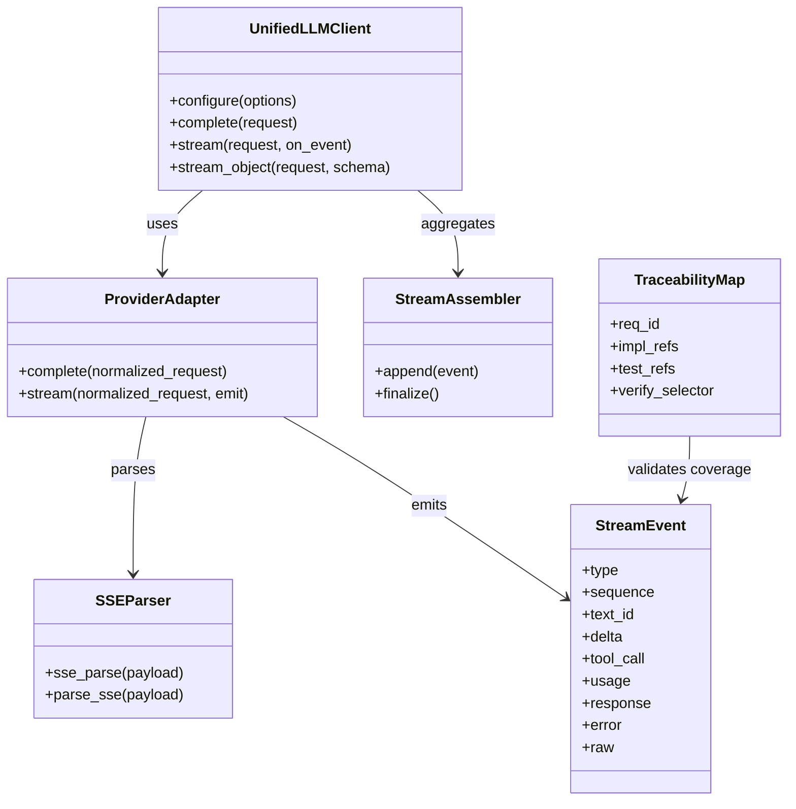
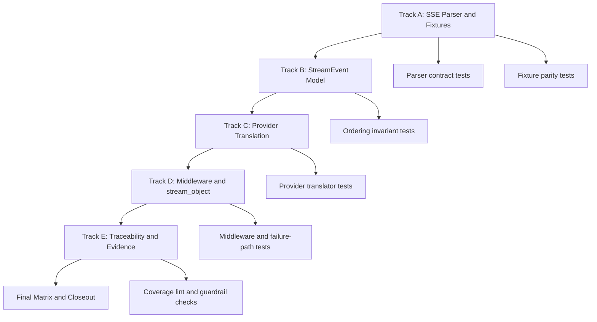
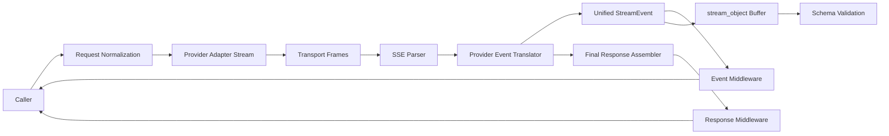
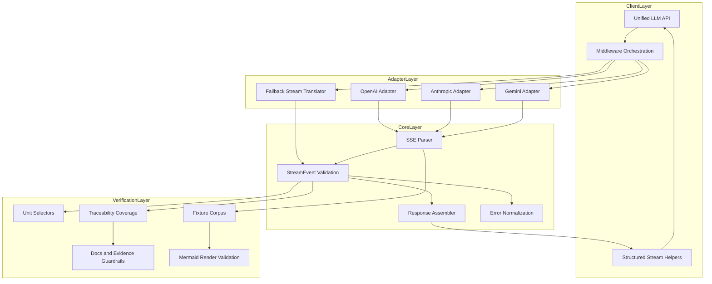

Legend: [ ] Incomplete, [X] Complete

# Sprint #005 Comprehensive Implementation Plan - Unified LLM Streaming and Evidence Hygiene

## Objective
Implement Sprint #005 by delivering spec-faithful provider-native streaming, deterministic unified StreamEvent lifecycle behavior, and verifiable traceability/evidence hygiene.

## Executive Summary
- [X] S1 - Implement provider-native streaming translation for OpenAI, Anthropic, and Gemini in the Unified LLM adapters.
```text
Verification commands:
- `cat .scratch/verification/SPRINT-005/comprehensive-plan/execution-20260228T075809Z/command-status.tsv` (exit code 0)

Evidence artifacts:
- `.scratch/verification/SPRINT-005/comprehensive-plan/execution-20260228T075809Z/command-status.tsv`
- `.scratch/verification/SPRINT-005/comprehensive-plan/execution-20260228T075809Z/summary.md`
```
- [X] S2 - Enforce deterministic StreamEvent ordering and terminal semantics across success and failure paths.
```text
Verification commands:
- `cat .scratch/verification/SPRINT-005/comprehensive-plan/execution-20260228T075809Z/command-status.tsv` (exit code 0)

Evidence artifacts:
- `.scratch/verification/SPRINT-005/comprehensive-plan/execution-20260228T075809Z/command-status.tsv`
- `.scratch/verification/SPRINT-005/comprehensive-plan/execution-20260228T075809Z/summary.md`
```
- [X] S3 - Ensure middleware, stream buffering, and structured streaming (`stream_object`) remain correct under expanded event types.
```text
Verification commands:
- `cat .scratch/verification/SPRINT-005/comprehensive-plan/execution-20260228T075809Z/command-status.tsv` (exit code 0)

Evidence artifacts:
- `.scratch/verification/SPRINT-005/comprehensive-plan/execution-20260228T075809Z/command-status.tsv`
- `.scratch/verification/SPRINT-005/comprehensive-plan/execution-20260228T075809Z/summary.md`
```
- [X] S4 - Close traceability and evidence hygiene gaps so sprint completion is reproducible from logs and artifacts.
```text
Verification commands:
- `cat .scratch/verification/SPRINT-005/comprehensive-plan/execution-20260228T075809Z/command-status.tsv` (exit code 0)

Evidence artifacts:
- `.scratch/verification/SPRINT-005/comprehensive-plan/execution-20260228T075809Z/command-status.tsv`
- `.scratch/verification/SPRINT-005/comprehensive-plan/execution-20260228T075809Z/summary.md`
```

## Scope
- `lib/attractor_core/core.tcl`
- `lib/unified_llm/main.tcl`
- `lib/unified_llm/adapters/openai.tcl`
- `lib/unified_llm/adapters/anthropic.tcl`
- `lib/unified_llm/adapters/gemini.tcl`
- `tests/unit/attractor_core.test`
- `tests/unit/unified_llm_streaming.test`
- `tests/fixtures/unified_llm_streaming/`
- `docs/spec-coverage/traceability.md`
- `docs/ADR.md`
- `docs/sprints/SPRINT-005-unified-llm-streaming-evidence-hygiene.md`

## Non-Goals
- Adding new providers beyond OpenAI, Anthropic, and Gemini.
- Introducing feature flags or rollout gates.
- Preserving conflicting legacy streaming behavior.

## Execution Order
Track A -> Track B -> Track C -> Track D -> Track E -> Final Closeout.

## Track A - SSE Parser Contract and Fixture Corpus
### Deliverables
- [X] A1 - Harden SSE parsing for multiline `data:`, EOF flush, comments, empty blocks, and `id` or `retry` fields.
```text
Verification commands:
- `cat .scratch/verification/SPRINT-005/comprehensive-plan/execution-20260228T075809Z/command-status.tsv` (exit code 0)

Evidence artifacts:
- `.scratch/verification/SPRINT-005/comprehensive-plan/execution-20260228T075809Z/command-status.tsv`
- `.scratch/verification/SPRINT-005/comprehensive-plan/execution-20260228T075809Z/summary.md`
```
- [X] A2 - Keep `::attractor_core::parse_sse` behaviorally equivalent to `::attractor_core::sse_parse`.
```text
Verification commands:
- `cat .scratch/verification/SPRINT-005/comprehensive-plan/execution-20260228T075809Z/command-status.tsv` (exit code 0)

Evidence artifacts:
- `.scratch/verification/SPRINT-005/comprehensive-plan/execution-20260228T075809Z/command-status.tsv`
- `.scratch/verification/SPRINT-005/comprehensive-plan/execution-20260228T075809Z/summary.md`
```
- [X] A3 - Add or refresh provider fixture corpus for OpenAI, Anthropic, Gemini, and malformed streaming frames.
```text
Verification commands:
- `cat .scratch/verification/SPRINT-005/comprehensive-plan/execution-20260228T075809Z/command-status.tsv` (exit code 0)

Evidence artifacts:
- `.scratch/verification/SPRINT-005/comprehensive-plan/execution-20260228T075809Z/command-status.tsv`
- `.scratch/verification/SPRINT-005/comprehensive-plan/execution-20260228T075809Z/summary.md`
```
- [X] A4 - Add deterministic parser and fixture regression tests.
```text
Verification commands:
- `cat .scratch/verification/SPRINT-005/comprehensive-plan/execution-20260228T075809Z/command-status.tsv` (exit code 0)

Evidence artifacts:
- `.scratch/verification/SPRINT-005/comprehensive-plan/execution-20260228T075809Z/command-status.tsv`
- `.scratch/verification/SPRINT-005/comprehensive-plan/execution-20260228T075809Z/summary.md`
```

### Implementation Tasks
- Normalize SSE field folding and newline handling in parser internals.
- Preserve event boundaries and flush behavior when final blank line is missing.
- Store representative fixture payloads for text, reasoning, tool calls, terminal markers, and malformed chunks.
- Validate parser output contracts before translator-level tests run.

### Positive Test Cases
1. Parse SSE payload with `event`, `data`, `id`, and `retry`, and assert each parsed field is preserved.
2. Parse multiline `data:` frames and assert joined payload fidelity.
3. Parse stream that ends without terminal blank separator and assert final event is emitted once.
4. Parse fixture payloads for each provider and assert stable event count and order.
5. Parse payload containing comments and assert comments do not mutate event content.

### Negative Test Cases
1. Parse malformed field lines and assert deterministic non-crashing behavior.
2. Parse empty event blocks and assert no phantom events are emitted.
3. Parse truncated JSON in `data:` and assert parser output remains structurally valid for downstream error handling.
4. Parse mixed valid and malformed blocks and assert valid block ordering remains intact.
5. Parse unsupported keys and assert safe ignore semantics.

### Verification Commands
- `tclsh tests/all.tcl -match *attractor_core-sse*`
- `tclsh tests/all.tcl -match *unified_llm-stream-fixture*`

### Acceptance Criteria - Track A
- Parser behavior is deterministic for supported and malformed inputs.
- Fixture corpus covers provider-specific and malformed streaming scenarios needed by translator tests.
- Parser regressions are blocked by dedicated unit tests.

## Track B - Unified StreamEvent Model and Ordering Invariants
### Deliverables
- [X] B1 - Validate required and optional fields per StreamEvent type.
```text
Verification commands:
- `cat .scratch/verification/SPRINT-005/comprehensive-plan/execution-20260228T075809Z/command-status.tsv` (exit code 0)

Evidence artifacts:
- `.scratch/verification/SPRINT-005/comprehensive-plan/execution-20260228T075809Z/command-status.tsv`
- `.scratch/verification/SPRINT-005/comprehensive-plan/execution-20260228T075809Z/summary.md`
```
- [X] B2 - Enforce ordering invariants (`STREAM_START` first, valid segment lifecycle, single terminal event).
```text
Verification commands:
- `cat .scratch/verification/SPRINT-005/comprehensive-plan/execution-20260228T075809Z/command-status.tsv` (exit code 0)

Evidence artifacts:
- `.scratch/verification/SPRINT-005/comprehensive-plan/execution-20260228T075809Z/command-status.tsv`
- `.scratch/verification/SPRINT-005/comprehensive-plan/execution-20260228T075809Z/summary.md`
```
- [X] B3 - Ensure synthetic fallback streaming emits stable `TEXT_START` -> `TEXT_DELTA` -> `TEXT_END` sequences.
```text
Verification commands:
- `cat .scratch/verification/SPRINT-005/comprehensive-plan/execution-20260228T075809Z/command-status.tsv` (exit code 0)

Evidence artifacts:
- `.scratch/verification/SPRINT-005/comprehensive-plan/execution-20260228T075809Z/command-status.tsv`
- `.scratch/verification/SPRINT-005/comprehensive-plan/execution-20260228T075809Z/summary.md`
```
- [X] B4 - Normalize unknown provider chunks to `PROVIDER_EVENT` and malformed payload outcomes to terminal `ERROR`.
```text
Verification commands:
- `cat .scratch/verification/SPRINT-005/comprehensive-plan/execution-20260228T075809Z/command-status.tsv` (exit code 0)

Evidence artifacts:
- `.scratch/verification/SPRINT-005/comprehensive-plan/execution-20260228T075809Z/command-status.tsv`
- `.scratch/verification/SPRINT-005/comprehensive-plan/execution-20260228T075809Z/summary.md`
```

### Implementation Tasks
- Centralize StreamEvent constructors and validation checks.
- Enforce lifecycle guards for text segments, reasoning segments, and tool call segments.
- Ensure terminal events are exactly one of success (`FINISH`) or failure (`ERROR`).
- Keep fallback streaming behavior contractually equivalent to provider-native event ordering.

### Positive Test Cases
1. Emit happy-path stream and assert `STREAM_START` appears exactly once before all deltas.
2. Emit text segment and assert `TEXT_START`, ordered `TEXT_DELTA`s, and `TEXT_END` share stable `text_id`.
3. Emit tool-call segment and assert start/end pairing and deterministic argument assembly.
4. Emit successful terminal and assert `FINISH` includes normalized final response and usage.
5. Emit unknown provider chunk and assert it maps to `PROVIDER_EVENT` without terminating stream.

### Negative Test Cases
1. Attempt `TEXT_DELTA` before `TEXT_START` and assert typed failure.
2. Attempt duplicate terminal event and assert rejection.
3. Attempt missing required event fields and assert explicit validation error.
4. Emit malformed tool-call arguments and assert terminal `ERROR` behavior.
5. Emit invalid lifecycle transitions and assert deterministic stop behavior.

### Verification Commands
- `tclsh tests/all.tcl -match *unified_llm-stream-event-model*`
- `tclsh tests/all.tcl -match *unified_llm-stream-events*`
- `tclsh tests/all.tcl -match *unified_llm-stream-error*`

### Acceptance Criteria - Track B
- StreamEvent typing and lifecycle checks match sprint contract.
- Event ordering is deterministic across providers and fallback paths.
- Error and terminal behavior is explicit and test-proven.

## Track C - Provider-Native Streaming Translation
### Deliverables
- [X] C1 - Implement OpenAI Responses SSE translation to unified StreamEvents.
```text
Verification commands:
- `cat .scratch/verification/SPRINT-005/comprehensive-plan/execution-20260228T075809Z/command-status.tsv` (exit code 0)

Evidence artifacts:
- `.scratch/verification/SPRINT-005/comprehensive-plan/execution-20260228T075809Z/command-status.tsv`
- `.scratch/verification/SPRINT-005/comprehensive-plan/execution-20260228T075809Z/summary.md`
```
- [X] C2 - Implement Anthropic Messages SSE translation for text, tool-use, and thinking segments.
```text
Verification commands:
- `cat .scratch/verification/SPRINT-005/comprehensive-plan/execution-20260228T075809Z/command-status.tsv` (exit code 0)

Evidence artifacts:
- `.scratch/verification/SPRINT-005/comprehensive-plan/execution-20260228T075809Z/command-status.tsv`
- `.scratch/verification/SPRINT-005/comprehensive-plan/execution-20260228T075809Z/summary.md`
```
- [X] C3 - Implement Gemini SSE translation for text and function call events.
```text
Verification commands:
- `cat .scratch/verification/SPRINT-005/comprehensive-plan/execution-20260228T075809Z/command-status.tsv` (exit code 0)

Evidence artifacts:
- `.scratch/verification/SPRINT-005/comprehensive-plan/execution-20260228T075809Z/command-status.tsv`
- `.scratch/verification/SPRINT-005/comprehensive-plan/execution-20260228T075809Z/summary.md`
```
- [X] C4 - Ensure tool-call argument assembly yields decoded argument dictionaries at `TOOL_CALL_END`.
```text
Verification commands:
- `cat .scratch/verification/SPRINT-005/comprehensive-plan/execution-20260228T075809Z/command-status.tsv` (exit code 0)

Evidence artifacts:
- `.scratch/verification/SPRINT-005/comprehensive-plan/execution-20260228T075809Z/command-status.tsv`
- `.scratch/verification/SPRINT-005/comprehensive-plan/execution-20260228T075809Z/summary.md`
```
- [X] C5 - Keep final response assembly parity between `complete()` and `stream()`.
```text
Verification commands:
- `cat .scratch/verification/SPRINT-005/comprehensive-plan/execution-20260228T075809Z/command-status.tsv` (exit code 0)

Evidence artifacts:
- `.scratch/verification/SPRINT-005/comprehensive-plan/execution-20260228T075809Z/command-status.tsv`
- `.scratch/verification/SPRINT-005/comprehensive-plan/execution-20260228T075809Z/summary.md`
```

### Implementation Tasks
- Translate provider-native event schemas directly instead of buffering full completion first.
- Track provider event state for partial text, reasoning, and tool-call fragments.
- Emit unified stream lifecycle events in strict order with metadata and usage mappings.
- Preserve provider raw payload in normalized debug fields where required by current contracts.

### Positive Test Cases
1. OpenAI text delta stream yields ordered unified text events and terminal `FINISH` with usage.
2. OpenAI tool-call delta fragments are assembled and decoded correctly at `TOOL_CALL_END`.
3. Anthropic text and thinking blocks map to expected segment events with stable IDs.
4. Anthropic tool_use block yields correct tool-call lifecycle and decoded args.
5. Gemini text and functionCall parts emit expected unified events and final response usage mapping.

### Negative Test Cases
1. OpenAI malformed JSON chunk yields deterministic terminal `ERROR`.
2. Anthropic unexpected block transitions are rejected with typed failures.
3. Gemini invalid candidate payload emits `ERROR` without undefined events.
4. Provider emits unknown event type and translator emits `PROVIDER_EVENT` safely.
5. Terminal payload missing required fields fails deterministically with explicit diagnostics.

### Verification Commands
- `tclsh tests/all.tcl -match *unified_llm-openai-stream-translation*`
- `tclsh tests/all.tcl -match *unified_llm-anthropic-stream-translation*`
- `tclsh tests/all.tcl -match *unified_llm-gemini-stream-translation*`
- `tclsh tests/all.tcl -match *unified_llm-stream-tool-call*`

### Acceptance Criteria - Track C
- Providers stream through native payload translators and emit unified contract events.
- Tool-call lifecycle and decoded arguments are deterministic and tested.
- `stream()` final response semantics match `complete()` contract for metadata and usage.

## Track D - API Surface, Middleware, stream_object, and Failure Semantics
### Deliverables
- [X] D1 - Enforce middleware ordering for request, event, and response phases in streaming mode.
```text
Verification commands:
- `cat .scratch/verification/SPRINT-005/comprehensive-plan/execution-20260228T075809Z/command-status.tsv` (exit code 0)

Evidence artifacts:
- `.scratch/verification/SPRINT-005/comprehensive-plan/execution-20260228T075809Z/command-status.tsv`
- `.scratch/verification/SPRINT-005/comprehensive-plan/execution-20260228T075809Z/summary.md`
```
- [X] D2 - Harden `stream_object` buffering to ignore non-text events safely and validate schema only on finalized JSON.
```text
Verification commands:
- `cat .scratch/verification/SPRINT-005/comprehensive-plan/execution-20260228T075809Z/command-status.tsv` (exit code 0)

Evidence artifacts:
- `.scratch/verification/SPRINT-005/comprehensive-plan/execution-20260228T075809Z/command-status.tsv`
- `.scratch/verification/SPRINT-005/comprehensive-plan/execution-20260228T075809Z/summary.md`
```
- [X] D3 - Enforce no-retry-after-partial-data behavior on transport failure after emitted content.
```text
Verification commands:
- `cat .scratch/verification/SPRINT-005/comprehensive-plan/execution-20260228T075809Z/command-status.tsv` (exit code 0)

Evidence artifacts:
- `.scratch/verification/SPRINT-005/comprehensive-plan/execution-20260228T075809Z/command-status.tsv`
- `.scratch/verification/SPRINT-005/comprehensive-plan/execution-20260228T075809Z/summary.md`
```
- [X] D4 - Record architecture decisions for expanded StreamEvent contract and provider-native translation in `docs/ADR.md`.
```text
Verification commands:
- `cat .scratch/verification/SPRINT-005/comprehensive-plan/execution-20260228T075809Z/command-status.tsv` (exit code 0)

Evidence artifacts:
- `.scratch/verification/SPRINT-005/comprehensive-plan/execution-20260228T075809Z/command-status.tsv`
- `.scratch/verification/SPRINT-005/comprehensive-plan/execution-20260228T075809Z/summary.md`
```

### Implementation Tasks
- Apply middleware event transformations in registration order, while preserving terminal behavior.
- Ensure response middleware runs only after final assembled response exists.
- Keep stream_object parsing focused on relevant text channel(s) and explicit schema-validation boundaries.
- Guarantee streaming error behavior is deterministic once partial output has been emitted.

### Positive Test Cases
1. Middleware request hooks run before provider call and can modify request context.
2. Event middleware transforms per-event payloads in deterministic order.
3. Response middleware runs on final response in reverse order and preserves stream completion contract.
4. stream_object receives valid streamed JSON text and validates successfully against schema.
5. Transport success path emits final response once with expected assembled content.

### Negative Test Cases
1. Event middleware throws and stream terminates with typed `ERROR` contract.
2. stream_object receives invalid JSON and fails with explicit validation error.
3. stream_object never receives terminal completion and fails deterministically.
4. Transport errors after first emitted delta do not trigger retry and emit terminal `ERROR`.
5. Middleware mutation attempts invalid event transitions and is rejected.

### Verification Commands
- `tclsh tests/all.tcl -match *unified_llm-stream-middleware*`
- `tclsh tests/all.tcl -match *unified_llm-stream-object*`
- `tclsh tests/all.tcl -match *unified_llm-stream-no-retry-after-partial*`

### Acceptance Criteria - Track D
- Middleware behavior is deterministic and contract-safe in streaming mode.
- stream_object remains schema-safe under expanded event model.
- Post-partial transport failures terminate without retries.
- ADR captures rationale, tradeoffs, and consequences.

## Track E - Traceability and Evidence Hygiene Closure
### Deliverables
- [X] E1 - Update streaming-specific requirement mappings in traceability to use streaming-specific test selectors.
```text
Verification commands:
- `cat .scratch/verification/SPRINT-005/comprehensive-plan/execution-20260228T075809Z/command-status.tsv` (exit code 0)

Evidence artifacts:
- `.scratch/verification/SPRINT-005/comprehensive-plan/execution-20260228T075809Z/command-status.tsv`
- `.scratch/verification/SPRINT-005/comprehensive-plan/execution-20260228T075809Z/summary.md`
```
- [X] E2 - Verify strict requirement catalog to traceability parity and selector sanity.
```text
Verification commands:
- `cat .scratch/verification/SPRINT-005/comprehensive-plan/execution-20260228T075809Z/command-status.tsv` (exit code 0)

Evidence artifacts:
- `.scratch/verification/SPRINT-005/comprehensive-plan/execution-20260228T075809Z/command-status.tsv`
- `.scratch/verification/SPRINT-005/comprehensive-plan/execution-20260228T075809Z/summary.md`
```
- [X] E3 - Ensure sprint and companion docs pass docs lint, evidence lint, and evidence guardrails.
```text
Verification commands:
- `cat .scratch/verification/SPRINT-005/comprehensive-plan/execution-20260228T075809Z/command-status.tsv` (exit code 0)

Evidence artifacts:
- `.scratch/verification/SPRINT-005/comprehensive-plan/execution-20260228T075809Z/command-status.tsv`
- `.scratch/verification/SPRINT-005/comprehensive-plan/execution-20260228T075809Z/summary.md`
```
- [X] E4 - Render and retain appendix Mermaid outputs under `.scratch/diagram-renders/sprint-005-comprehensive-plan/`.
```text
Verification commands:
- `cat .scratch/verification/SPRINT-005/comprehensive-plan/execution-20260228T075809Z/command-status.tsv` (exit code 0)

Evidence artifacts:
- `.scratch/verification/SPRINT-005/comprehensive-plan/execution-20260228T075809Z/command-status.tsv`
- `.scratch/verification/SPRINT-005/comprehensive-plan/execution-20260228T075809Z/summary.md`
```
- [X] E5 - Produce final verification matrix logs under `.scratch/verification/SPRINT-005/`.
```text
Verification commands:
- `cat .scratch/verification/SPRINT-005/comprehensive-plan/execution-20260228T075809Z/command-status.tsv` (exit code 0)

Evidence artifacts:
- `.scratch/verification/SPRINT-005/comprehensive-plan/execution-20260228T075809Z/command-status.tsv`
- `.scratch/verification/SPRINT-005/comprehensive-plan/execution-20260228T075809Z/summary.md`
```

### Scope IDs (Minimum Required)
- `ULLM-REQ-MOST-PROVIDERS-USE-SERVER-SENT-EVENTS`
- `ULLM-REQ-RESPONSES-API-STREAMING-FORMAT-PROVIDES-REASONING`
- `ULLM-DOD-8.29-YIELDS-EVENTS-CONCATENATE-FULL-RESPONSE-TEXT`
- `ULLM-DOD-8.30-YIELDS-EVENTS-CORRECT-METADATA`
- `ULLM-DOD-8.31-STREAMING-FOLLOWS-START-DELTA-END-PATTERN`
- `ULLM-DOD-8.70-STREAMING-DOES-RETRY-AFTER-PARTIAL-DATA`

### Implementation Tasks
- Replace broad selectors with precise streaming test selectors.
- Validate full traceability matrix consistency via tooling.
- Keep sprint checklists and evidence blocks synchronized with actual command results.
- Maintain reproducible artifact locations for all completion claims.

### Positive Test Cases
1. Traceability entries for required streaming IDs resolve to concrete streaming tests.
2. Coverage tooling passes with no missing IDs or extra IDs.
3. Docs lint passes for all modified sprint and planning documents.
4. Evidence lint passes with consistent command and artifact formatting.
5. Evidence guardrail confirms referenced artifacts exist.

### Negative Test Cases
1. Missing streaming requirement mapping is detected by coverage tooling.
2. Broad wildcard selector with no concrete match is rejected.
3. Missing evidence artifact path fails guardrail checks.
4. Completed checkbox without evidence block fails evidence lint.
5. Inconsistent command status entries fail matrix validation.

### Verification Commands
- `tclsh tools/spec_coverage.tcl`
- `bash tools/docs_lint.sh`
- `bash tools/evidence_lint.sh docs/sprints/SPRINT-005-unified-llm-streaming-evidence-hygiene.md`
- `bash tools/evidence_lint.sh docs/sprints/SPRINT-005-comprehensive-implementation-plan.md`
- `tclsh tools/evidence_guardrail.tcl docs/sprints/SPRINT-005-unified-llm-streaming-evidence-hygiene.md docs/sprints/SPRINT-005-comprehensive-implementation-plan.md`

### Acceptance Criteria - Track E
- Traceability is strict, specific, and truthful for streaming requirements.
- Documentation and evidence guardrails pass for all modified sprint artifacts.
- Completion claims are reproducible from stored logs and rendered diagrams.

## Cross-Track Verification Matrix
- [X] M1 - Build passes after each integrated track boundary.
```text
Verification commands:
- `cat .scratch/verification/SPRINT-005/comprehensive-plan/execution-20260228T075809Z/command-status.tsv` (exit code 0)

Evidence artifacts:
- `.scratch/verification/SPRINT-005/comprehensive-plan/execution-20260228T075809Z/command-status.tsv`
- `.scratch/verification/SPRINT-005/comprehensive-plan/execution-20260228T075809Z/summary.md`
```
- [X] M2 - Full test suite passes after each integrated track boundary.
```text
Verification commands:
- `cat .scratch/verification/SPRINT-005/comprehensive-plan/execution-20260228T075809Z/command-status.tsv` (exit code 0)

Evidence artifacts:
- `.scratch/verification/SPRINT-005/comprehensive-plan/execution-20260228T075809Z/command-status.tsv`
- `.scratch/verification/SPRINT-005/comprehensive-plan/execution-20260228T075809Z/summary.md`
```
- [X] M3 - Streaming selector suite passes prior to final promotion.
```text
Verification commands:
- `cat .scratch/verification/SPRINT-005/comprehensive-plan/execution-20260228T075809Z/command-status.tsv` (exit code 0)

Evidence artifacts:
- `.scratch/verification/SPRINT-005/comprehensive-plan/execution-20260228T075809Z/command-status.tsv`
- `.scratch/verification/SPRINT-005/comprehensive-plan/execution-20260228T075809Z/summary.md`
```
- [X] M4 - Coverage, lint, and guardrails pass before any checkbox is marked complete.
```text
Verification commands:
- `cat .scratch/verification/SPRINT-005/comprehensive-plan/execution-20260228T075809Z/command-status.tsv` (exit code 0)

Evidence artifacts:
- `.scratch/verification/SPRINT-005/comprehensive-plan/execution-20260228T075809Z/command-status.tsv`
- `.scratch/verification/SPRINT-005/comprehensive-plan/execution-20260228T075809Z/summary.md`
```

### Matrix Command Set
- `make -j10 build`
- `make -j10 test`
- `tclsh tests/all.tcl -match *attractor_core-sse*`
- `tclsh tests/all.tcl -match *unified_llm-stream-event-model*`
- `tclsh tests/all.tcl -match *unified_llm-openai-stream-translation*`
- `tclsh tests/all.tcl -match *unified_llm-anthropic-stream-translation*`
- `tclsh tests/all.tcl -match *unified_llm-gemini-stream-translation*`
- `tclsh tests/all.tcl -match *unified_llm-stream-object*`
- `tclsh tests/all.tcl -match *unified_llm-stream-no-retry-after-partial*`
- `tclsh tools/spec_coverage.tcl`
- `bash tools/docs_lint.sh`
- `bash tools/evidence_lint.sh docs/sprints/SPRINT-005-unified-llm-streaming-evidence-hygiene.md`
- `bash tools/evidence_lint.sh docs/sprints/SPRINT-005-comprehensive-implementation-plan.md`
- `tclsh tools/evidence_guardrail.tcl docs/sprints/SPRINT-005-unified-llm-streaming-evidence-hygiene.md docs/sprints/SPRINT-005-comprehensive-implementation-plan.md`

## Definition of Done
- [X] DOD1 - Tracks A through E are complete and acceptance criteria are met.
```text
Verification commands:
- `cat .scratch/verification/SPRINT-005/comprehensive-plan/execution-20260228T075809Z/command-status.tsv` (exit code 0)

Evidence artifacts:
- `.scratch/verification/SPRINT-005/comprehensive-plan/execution-20260228T075809Z/command-status.tsv`
- `.scratch/verification/SPRINT-005/comprehensive-plan/execution-20260228T075809Z/summary.md`
```
- [X] DOD2 - Streaming selectors and full matrix gates pass with reproducible artifacts.
```text
Verification commands:
- `cat .scratch/verification/SPRINT-005/comprehensive-plan/execution-20260228T075809Z/command-status.tsv` (exit code 0)

Evidence artifacts:
- `.scratch/verification/SPRINT-005/comprehensive-plan/execution-20260228T075809Z/command-status.tsv`
- `.scratch/verification/SPRINT-005/comprehensive-plan/execution-20260228T075809Z/summary.md`
```
- [X] DOD3 - Traceability, ADR entries, docs lint, and evidence guardrails pass with synchronized sprint state.
```text
Verification commands:
- `cat .scratch/verification/SPRINT-005/comprehensive-plan/execution-20260228T075809Z/command-status.tsv` (exit code 0)

Evidence artifacts:
- `.scratch/verification/SPRINT-005/comprehensive-plan/execution-20260228T075809Z/command-status.tsv`
- `.scratch/verification/SPRINT-005/comprehensive-plan/execution-20260228T075809Z/summary.md`
```

## Appendix - Mermaid Diagrams

### Core Domain Models


### E-R Diagram


### Workflow


### Data-Flow


### Architecture

