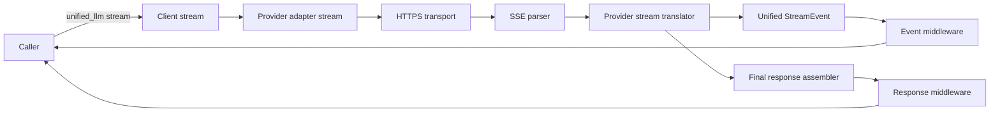
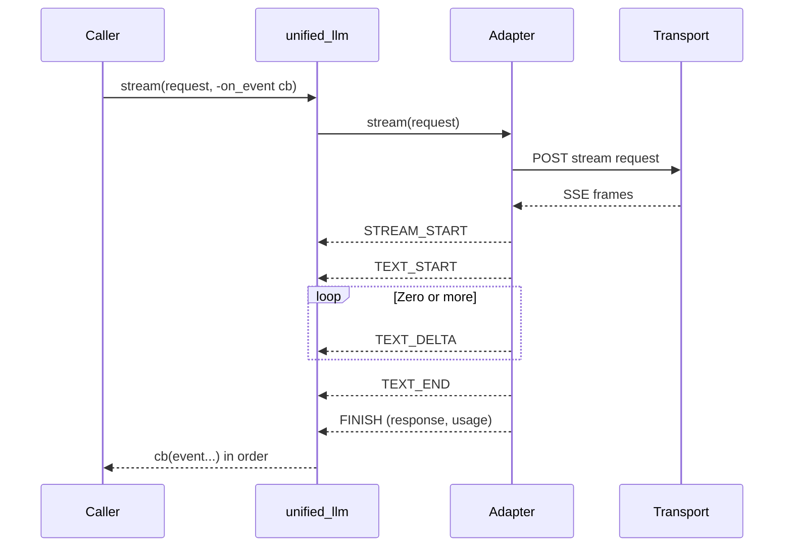

Legend: [ ] Incomplete, [X] Complete

_Evidence for every completed checklist item must include the exact verification command (wrapped with backticks) plus its exit code and artifacts (logs, `.scratch` transcripts, diagram renders) directly beneath the item when the work is performed._

# Sprint #005 - Unified LLM Streaming and Evidence Hygiene

## Objective
Make Unified LLM streaming spec-faithful (provider-native streaming translation with correct StreamEvent types and ordering) and restore the repo's evidence/traceability hygiene so streaming compliance is provable against the NLSpecs.

## Context
Current state (codex-3 baseline):
- Unified LLM `stream()` synthesizes streaming by chunking a completed response; it does not parse provider-native streaming formats (SSE/JSON chunks).
- The stream event model is incomplete versus `unified-llm-spec.md` (missing TEXT_START/TEXT_END, tool-call deltas, reasoning blocks).
- The repo has strong spec coverage gates, but streaming-related traceability mappings are currently too coarse to be trustworthy.
- Evidence linting is present (`tools/evidence_lint.sh`) but existing sprint docs do not consistently meet its contract.

Improvements available from other branches:
- codex-2 demonstrates provider-native SSE parsing and live streaming adapter scaffolding.
- codex-1 demonstrates stricter evidence discipline patterns and a more complete SSE field set (event/data/id/retry/comment handling).

This sprint ports the *substance* of those improvements into the codex-3 foundation while keeping deterministic offline testing as the default.

## Non-Goals
- No new providers beyond OpenAI, Anthropic, and Gemini.
- No compatibility shims (e.g., OpenAI Chat Completions as the primary path).
- No feature flags.

## Plan
Execution order: Track A -> Track B -> Track C -> Track D -> Track E.

### Track A - SSE Parser Contract (Core)
- [ ] A1 - Harden SSE parser behavior for real streaming payloads (EOF flush, multi-line data, comment lines, id/retry fields) and expose a stable API for Unified LLM to consume.
```text
{placeholder for verification justification/reasoning and evidence log}

Planned verification:
- `tclsh tests/all.tcl -match *attractor_core-sse*`
- Expect: exit code 0
- Evidence: `.scratch/verification/SPRINT-005/track-a/sse-parser/tests-all-attractor-core-sse.log`
```

- [ ] A2 - Add an offline fixture corpus of minimal SSE frames for OpenAI/Anthropic/Gemini that covers: text deltas, tool call deltas, reasoning blocks, terminal frames, and malformed frames.
```text
{placeholder for verification justification/reasoning and evidence log}

Planned verification:
- `tclsh tests/all.tcl -match *unified_llm-stream-fixture*`
- Expect: exit code 0
- Evidence: `.scratch/verification/SPRINT-005/track-a/fixtures/tests-all-unified-llm-stream-fixture.log`
```

#### Acceptance Criteria - Track A
- Parser emits identical event boundaries as defined in `unified-llm-spec.md` Section 7.7 (SSE Parsing).
- Fixtures are sufficient to test each provider translator without any live network calls.

### Track B - Unified StreamEvent Model (Spec Parity)
- [ ] B1 - Define the full StreamEvent surface required by `unified-llm-spec.md` and implement a Tcl dict representation that preserves ordering, allows middleware transforms, and supports deterministic tests.
```text
{placeholder for verification justification/reasoning and evidence log}

Planned verification:
- `tclsh tests/all.tcl -match *unified_llm-stream-event-model*`
- Expect: exit code 0
- Evidence: `.scratch/verification/SPRINT-005/track-b/event-model/tests-all-unified-llm-stream-event-model.log`
```

- [ ] B2 - Update the synthetic stream path (mock + "stream-from-complete" fallback) to emit TEXT_START/TEXT_DELTA/TEXT_END and to preserve tool call boundaries consistently.
```text
{placeholder for verification justification/reasoning and evidence log}

Planned verification:
- `tclsh tests/all.tcl -match *unified_llm-stream-events*`
- Expect: exit code 0
- Evidence: `.scratch/verification/SPRINT-005/track-b/synthetic/tests-all-unified-llm-stream-events.log`
```

#### Acceptance Criteria - Track B
- Streaming follows the start/delta/end pattern for text segments (ULLM-DOD-8.31).
- TEXT_DELTA events concatenate to the final response text (ULLM-DOD-8.29).

### Track C - Provider-Native Streaming Translation
- [ ] C1 - OpenAI Responses API: implement real streaming translation by parsing SSE events and mapping them to the unified StreamEvent model (text deltas, tool call argument deltas, output item boundaries, final usage including reasoning tokens).
```text
{placeholder for verification justification/reasoning and evidence log}

Planned verification:
- `tclsh tests/all.tcl -match *unified_llm-openai-stream-translation*`
- Expect: exit code 0
- Evidence: `.scratch/verification/SPRINT-005/track-c/openai/tests-all-unified-llm-openai-stream-translation.log`
```

- [ ] C2 - Anthropic Messages API: implement real streaming translation for text/tool_use/thinking blocks, preserving thinking/redacted_thinking round-trip behavior and mapping usage correctly at FINISH.
```text
{placeholder for verification justification/reasoning and evidence log}

Planned verification:
- `tclsh tests/all.tcl -match *unified_llm-anthropic-stream-translation*`
- Expect: exit code 0
- Evidence: `.scratch/verification/SPRINT-005/track-c/anthropic/tests-all-unified-llm-anthropic-stream-translation.log`
```

- [ ] C3 - Gemini Streaming: implement `:streamGenerateContent?alt=sse` translation for text and functionCall parts, emitting TOOL_CALL_START + TOOL_CALL_END when Gemini delivers full calls in one chunk.
```text
{placeholder for verification justification/reasoning and evidence log}

Planned verification:
- `tclsh tests/all.tcl -match *unified_llm-gemini-stream-translation*`
- Expect: exit code 0
- Evidence: `.scratch/verification/SPRINT-005/track-c/gemini/tests-all-unified-llm-gemini-stream-translation.log`
```

#### Acceptance Criteria - Track C
- Provider-native streaming payloads are parsed and translated without buffering a full `complete()` response first.
- FINISH events include usage and metadata consistent with the corresponding `complete()` translation.

### Track D - API Surface, Middleware, and Structured Streaming
- [ ] D1 - Ensure request/response/event middleware semantics apply to streaming exactly as specified (request before call, per-event transforms in order, response transforms on final response).
```text
{placeholder for verification justification/reasoning and evidence log}

Planned verification:
- `tclsh tests/all.tcl -match *unified_llm-stream-middleware*`
- Expect: exit code 0
- Evidence: `.scratch/verification/SPRINT-005/track-d/middleware/tests-all-unified-llm-stream-middleware.log`
```

- [ ] D2 - Make `stream_object` robust to the expanded event model (TEXT_START/TEXT_END, reasoning/tool-call events) while continuing to validate the final buffered JSON against schema.
```text
{placeholder for verification justification/reasoning and evidence log}

Planned verification:
- `tclsh tests/all.tcl -match *unified_llm-stream-object*`
- Expect: exit code 0
- Evidence: `.scratch/verification/SPRINT-005/track-d/stream-object/tests-all-unified-llm-stream-object.log`
```

#### Acceptance Criteria - Track D
- Stream middleware can observe/transform events without breaking final response assembly.
- Structured output streaming continues to validate schema and fails with typed errors on invalid JSON.

### Track E - Traceability and Evidence Contract Closure
- [ ] E1 - Tighten traceability mappings for streaming requirements so they reference the new streaming tests (avoid catch-all `*unified*` patterns for streaming-specific IDs).
```text
{placeholder for verification justification/reasoning and evidence log}

Planned verification:
- `tclsh tools/spec_coverage.tcl`
- Expect: exit code 0
- Evidence: `.scratch/verification/SPRINT-005/track-e/traceability/spec-coverage.log`
```

- [ ] E2 - Bring sprint documentation evidence blocks into conformance with `tools/evidence_lint.sh` and add a small regression harness that runs docs lint + evidence lint for the current sprint doc before closeout.
```text
{placeholder for verification justification/reasoning and evidence log}

Planned verification:
- `bash tools/docs_lint.sh`
- `bash tools/evidence_lint.sh docs/sprints/SPRINT-005-unified-llm-streaming-evidence-hygiene.md`
- Expect: exit code 0
- Evidence: `.scratch/verification/SPRINT-005/track-e/evidence/docs-lint.log`
```

#### Acceptance Criteria - Track E
- `tools/spec_coverage.tcl` remains strict and streaming requirements map to streaming-specific tests.
- Evidence lint passes for the SPRINT-005 doc (and for any sprint docs modified as part of the sprint).

## Verification Summary (What "Done" Looks Like)
- `tclsh tools/build_check.tcl` (exit code 0)
- `tclsh tests/all.tcl` (exit code 0)
- `bash tools/docs_lint.sh` (exit code 0)
- Live optional: `tclsh tests/e2e_live.tcl -match *unified-llm*` (exit code 0) when provider secrets are configured.

## Appendix - Mermaid Diagrams

### Streaming Flow (Unified LLM)


### Event Ordering Contract

