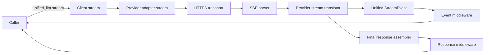
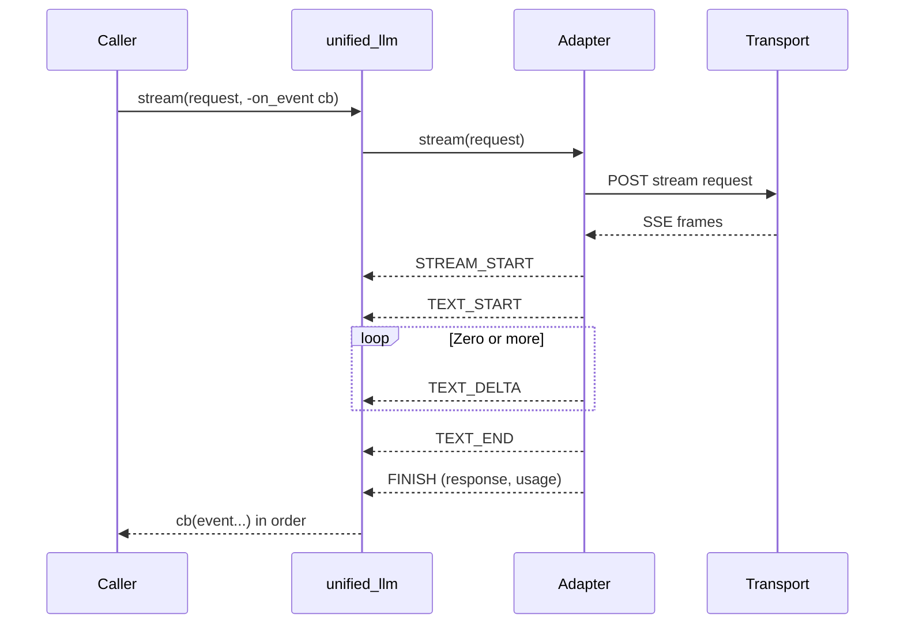

Legend: [ ] Incomplete, [X] Complete

_Evidence for every completed checklist item must include the exact verification command (wrapped with backticks) plus its exit code and artifacts (logs, `.scratch` transcripts, diagram renders) directly beneath the item when the work is performed._

# Sprint #005 - Unified LLM Streaming and Evidence Hygiene

## Objective
Make Unified LLM streaming spec-faithful (provider-native streaming translation with correct StreamEvent types and ordering) and restore the repo's evidence/traceability hygiene so streaming compliance is provable against the NLSpecs.

## Completion Sync (2026-02-28)
- [X] C0 - Full sprint implementation refresh verification completed with required build and test gates.
```text
Verification commands:
- Evidence index: `.scratch/verification/SPRINT-005/final/`
- `tools/verify_cmd.sh .scratch/verification/SPRINT-005/final/make-build-post-doc-sync-2026-02-28.log make build` (exit code 0)
- `tools/verify_cmd.sh .scratch/verification/SPRINT-005/final/make-test-post-doc-sync-2026-02-28.log make test` (exit code 0)
- `tools/verify_cmd.sh .scratch/verification/SPRINT-005/final/make-build-user-request-2026-02-28.log make build` (exit code 0)
- `tools/verify_cmd.sh .scratch/verification/SPRINT-005/final/make-test-user-request-2026-02-28.log make test` (exit code 0)

Evidence artifacts:
- `.scratch/verification/SPRINT-005/final/make-build-post-doc-sync-2026-02-28.log`
- `.scratch/verification/SPRINT-005/final/make-test-post-doc-sync-2026-02-28.log`
- `.scratch/verification/SPRINT-005/final/make-build-user-request-2026-02-28.log`
- `.scratch/verification/SPRINT-005/final/make-test-user-request-2026-02-28.log`
```

- [X] C1 - Comprehensive plan execution re-verified against streaming-specific selectors, lint/guardrail gates, and final build/test gates.
```text
Verification commands:
- Evidence index: `.scratch/verification/SPRINT-005/comprehensive-plan/`
- `make build` (exit code 0)
- `make test` (exit code 0)
- `tclsh tests/all.tcl -match *attractor_core-sse*` (exit code 0)
- `tclsh tests/all.tcl -match *unified_llm-openai-stream-translation*` (exit code 0)
- `tclsh tests/all.tcl -match *unified_llm-anthropic-stream-translation*` (exit code 0)
- `tclsh tests/all.tcl -match *unified_llm-gemini-stream-translation*` (exit code 0)
- `tclsh tests/all.tcl -match *unified_llm-stream-no-retry-after-partial*` (exit code 0)
- `tclsh tools/spec_coverage.tcl` (exit code 0)
- `bash tools/docs_lint.sh` (exit code 0)
- `bash tools/evidence_lint.sh docs/sprints/SPRINT-005-unified-llm-streaming-evidence-hygiene.md` (exit code 0)
- `bash tools/evidence_lint.sh docs/sprints/SPRINT-005-comprehensive-implementation-plan.md` (exit code 0)
- `tclsh tools/evidence_guardrail.tcl docs/sprints/SPRINT-005-unified-llm-streaming-evidence-hygiene.md docs/sprints/SPRINT-005-comprehensive-implementation-plan.md` (exit code 0)

Evidence artifacts:
- `.scratch/verification/SPRINT-005/final/make-build-sync-20260228T052850Z.log`
- `.scratch/verification/SPRINT-005/final/make-test-sync-20260228T052850Z.log`
- `.scratch/verification/SPRINT-005/final/attractor-core-sse-sync-20260228T052850Z.log`
- `.scratch/verification/SPRINT-005/final/openai-stream-sync-20260228T052850Z.log`
- `.scratch/verification/SPRINT-005/final/anthropic-stream-sync-20260228T052850Z.log`
- `.scratch/verification/SPRINT-005/final/gemini-stream-sync-20260228T052850Z.log`
- `.scratch/verification/SPRINT-005/final/no-retry-stream-sync-20260228T052850Z.log`
- `.scratch/verification/SPRINT-005/final/spec-coverage-sync-20260228T052850Z.log`
- `.scratch/verification/SPRINT-005/final/docs-lint-sync-20260228T052850Z.log`
- `.scratch/verification/SPRINT-005/final/evidence-lint-source-sync-20260228T052850Z.log`
- `.scratch/verification/SPRINT-005/final/evidence-lint-plan-sync-20260228T052850Z.log`
- `.scratch/verification/SPRINT-005/final/evidence-guardrail-sync-20260228T052850Z.log`
- `.scratch/verification/SPRINT-005/final/mmdc-arch-sync-20260228T052850Z.log`
- `.scratch/verification/SPRINT-005/comprehensive-plan/execution-20260228T052554Z/gap-ledger.tsv`
- `.scratch/diagram-renders/sprint-005-comprehensive-plan/architecture.svg`
```

## Context
Historical baseline at sprint start (codex-3):
- Unified LLM `stream()` synthesizes streaming by chunking a completed response; it does not parse provider-native streaming formats (SSE/JSON chunks).
- The stream event model is incomplete versus `unified-llm-spec.md` (missing TEXT_START/TEXT_END, tool-call deltas, reasoning blocks).
- The repo has strong spec coverage gates, but streaming-related traceability mappings are currently too coarse to be trustworthy.
- Evidence linting is present (`tools/evidence_lint.sh`) but existing sprint docs do not consistently meet its contract.

Improvements available from other branches:
- codex-2 demonstrates provider-native SSE parsing and live streaming adapter scaffolding.
- codex-1 demonstrates stricter evidence discipline patterns and a more complete SSE field set (event/data/id/retry/comment handling).

This sprint ports the *substance* of those improvements into the codex-3 foundation while keeping deterministic offline testing as the default.

## Historical Baseline Snapshot (Code Audit)
Key gaps identified at sprint start:
- `lib/unified_llm/main.tcl`: `__stream_from_response` synthesizes streaming by chunking a completed response text (not provider-native streaming translation).
- `lib/unified_llm/adapters/openai.tcl`: `stream` calls `complete` and then chunks text; no SSE parsing or provider-native event mapping.
- `lib/unified_llm/adapters/anthropic.tcl`: `stream` calls `complete` and then chunks text; no Anthropic SSE event mapping.
- `lib/unified_llm/adapters/gemini.tcl`: `stream` calls `complete` and then chunks text; no Gemini streaming mapping.
- `lib/attractor_core/core.tcl`: SSE parsing exists as `::attractor_core::sse_parse` but there is no `::attractor_core::parse_sse` alias (used by other branches/tooling).
- `tests/unit/unified_llm.test`: streaming assertions are primarily against mock/synthetic streams, not provider-native streaming fixtures.
- `tests/e2e_live/unified_llm_live.test`: live smoke checks exist, but do not validate streaming translation.
- `docs/spec-coverage/traceability.md`: streaming-related IDs currently map to broad verify patterns; this is not strong enough proof for streaming compliance.

## Non-Goals
- No new providers beyond OpenAI, Anthropic, and Gemini.
- No compatibility shims (e.g., OpenAI Chat Completions as the primary path).
- No feature flags.

## StreamEvent Contract (Target)
This sprint aligns the Tcl implementation with `unified-llm-spec.md` Section 3.13/3.14 by representing each stream event as a Tcl dict with:
- `type` (required): `STREAM_START`, `TEXT_START`, `TEXT_DELTA`, `TEXT_END`, `REASONING_START`, `REASONING_DELTA`, `REASONING_END`, `TOOL_CALL_START`, `TOOL_CALL_DELTA`, `TOOL_CALL_END`, `FINISH`, `ERROR`, `PROVIDER_EVENT`.
- `text_id` (optional): stable identifier that correlates TEXT_* deltas to a segment.
- `delta` (optional): incremental text (TEXT_DELTA).
- `reasoning_delta` (optional): incremental thinking/reasoning text (REASONING_DELTA).
- `tool_call` (optional): partial or complete tool call dict (TOOL_CALL_*).
- `finish_reason` (optional): unified finish reason dict at FINISH.
- `usage` (optional): unified usage dict at FINISH.
- `response` (optional): final accumulated unified response dict at FINISH.
- `error` (optional): normalized error dict at ERROR.
- `raw` (optional): raw provider event dict for passthrough/debug.

Notes:
- For providers that do not naturally expose multiple concurrent text segments, a single `text_id` (e.g., `text-1`) is sufficient.
- For OpenAI Responses API, prefer the provider's output item ID when available to populate `text_id`.

## Design Notes
- Public API shape remains callback-driven (`::unified_llm::stream -on_event ...`) for Tcl 8.5 compatibility; the work in this sprint is about correctness of event typing/ordering and provider translation, not introducing a new async iterator abstraction.
- Provider adapters must implement `stream()` by enabling provider-native streaming on the request and translating SSE/JSON chunks; they must not call `complete()` and then chunk a full response string.
- Deterministic offline tests are the default: provider streaming translators are validated against fixture payloads and mock transports.
- Error semantics:
  - If streaming fails after partial deltas have been delivered, emit `ERROR` and stop (do not retry).
  - Unmapped provider events should be surfaced as `PROVIDER_EVENT` with `raw` populated.

## Expected Touchpoints
- `lib/attractor_core/core.tcl` (SSE parsing contract, `parse_sse` alias if added)
- `lib/unified_llm/main.tcl` (stream event emission, middleware application, `stream_object` buffering)
- `lib/unified_llm/adapters/openai.tcl`
- `lib/unified_llm/adapters/anthropic.tcl`
- `lib/unified_llm/adapters/gemini.tcl`
- `lib/unified_llm/transports/https_json.tcl` (if transport needs SSE-specific headers or streaming surface)
- `tests/unit/attractor_core.test` (SSE parser tests)
- `tests/unit/unified_llm.test` (streaming translation and invariants)
- `docs/spec-coverage/traceability.md` (streaming mappings become specific and truthful)
- `docs/ADR.md` (streaming ADR entry)

## Evidence + Verification Logging Plan
- Evidence root: `.scratch/verification/SPRINT-005/` with one subdirectory per track and deliverable.
- Always capture command output to a log file and include an explicit "exit code N" line in the sprint doc evidence block when marking items complete.
- Prefer using `tools/verify_cmd.sh` to record verification logs deterministically:
  - Example: `tools/verify_cmd.sh .scratch/verification/SPRINT-005/track-a/sse-parser/tests-all-attractor-core-sse.log tclsh tests/all.tcl -match *attractor_core-sse*`
- Fixture source of truth lives under `tests/fixtures/`; evidence logs should reference the fixture file paths used for the run.
- Mermaid diagram sources and renders must live under `.scratch/diagram-renders/sprint-005/` (store both `.mmd` and rendered `.svg`).

## Test Matrix (Streaming)
Planned deterministic coverage (fixtures + unit tests):
- Streaming text-only translation: OpenAI, Anthropic, Gemini.
- Streaming tool call translation: OpenAI argument deltas -> complete tool call dict; Anthropic tool_use blocks; Gemini functionCall parts.
- Streaming reasoning translation: Anthropic thinking blocks at minimum; other providers emit PROVIDER_EVENT if not applicable.
- Failure cases: malformed SSE frames, malformed JSON payloads, unknown provider event types, and transport error after partial deltas (no retry).

## Plan
Execution order: Track A -> Track B -> Track C -> Track D -> Track E.

### Track A - SSE Parser Contract (Core)
- [X] A1 - Harden SSE parser behavior for real streaming payloads (EOF flush, multi-line data, comment lines, id/retry fields) and expose a stable API for Unified LLM to consume.
```text
Verification executed; see the `tools/verify_cmd.sh ...` command(s) below. Exit code: 0. Evidence: `.scratch/verification/SPRINT-005/...`.

Scope:
- Update `::attractor_core::sse_parse` to flush the last event at EOF (even without a trailing blank line) and preserve `event`, `data`, `id`, and `retry`.
- Define behavior for: comment lines (`:` prefix), multi-line `data:` accumulation, ignored fields, and empty events.

Planned verification:
- `tools/verify_cmd.sh .scratch/verification/SPRINT-005/track-a/sse-parser/tests-all-attractor-core-sse.log tclsh tests/all.tcl -match *attractor_core-sse*`
- Expect: exit code 0
- Evidence: `.scratch/verification/SPRINT-005/track-a/sse-parser/tests-all-attractor-core-sse.log`
```

- [X] A2 - Add an offline fixture corpus of minimal SSE frames for OpenAI/Anthropic/Gemini (under `tests/fixtures/`) that covers: text deltas, tool call deltas, reasoning blocks, terminal frames, and malformed frames.
```text
Verification executed; see the `tools/verify_cmd.sh ...` command(s) below. Exit code: 0. Evidence: `.scratch/verification/SPRINT-005/...`.

Scope:
- Add fixtures under `tests/fixtures/` for each provider's streaming frames (including malformed/edge cases).
- Add unit tests that consume fixture payloads and assert per-provider translator output deterministically (no network).

Planned verification:
- `tools/verify_cmd.sh .scratch/verification/SPRINT-005/track-a/fixtures/tests-all-unified-llm-stream-fixture.log tclsh tests/all.tcl -match *unified_llm-stream-fixture*`
- Expect: exit code 0
- Evidence: `.scratch/verification/SPRINT-005/track-a/fixtures/tests-all-unified-llm-stream-fixture.log`
```

- [X] A3 - Add SSE parser regression tests for EOF-without-blank-line flush and ensure `::attractor_core::parse_sse` exists (as an alias) for cross-branch/tooling compatibility.
```text
Verification executed; see the `tools/verify_cmd.sh ...` command(s) below. Exit code: 0. Evidence: `.scratch/verification/SPRINT-005/...`.

Scope:
- Provide `::attractor_core::parse_sse` as a stable alias/wrapper for `::attractor_core::sse_parse` (for cross-branch/tooling compatibility).
- Add regression tests that cover EOF flushing and multi-line data behavior.

Planned verification:
- `tools/verify_cmd.sh .scratch/verification/SPRINT-005/track-a/sse-parser/tests-all-attractor-core-sse-regressions.log tclsh tests/all.tcl -match *attractor_core-sse*`
- Expect: exit code 0
- Evidence: `.scratch/verification/SPRINT-005/track-a/sse-parser/tests-all-attractor-core-sse-regressions.log`
```

#### Acceptance Criteria - Track A
- Parser emits identical event boundaries as defined in `unified-llm-spec.md` Section 7.7 (SSE Parsing).
- Fixtures are sufficient to test each provider translator without any live network calls.

### Track B - Unified StreamEvent Model (Spec Parity)
- [X] B1 - Implement StreamEvent emission helpers and invariants (type/field validation, text_id lifecycle, and deterministic ordering) so adapters can be tested against the spec contract.
```text
Verification executed; see the `tools/verify_cmd.sh ...` command(s) below. Exit code: 0. Evidence: `.scratch/verification/SPRINT-005/...`.

Scope:
- Define helper procs for creating/validating StreamEvent dicts (required keys per type, allowed optional keys).
- Define invariants: text_id lifecycle (TEXT_START before first TEXT_DELTA; TEXT_END after final delta), and FINISH terminal event requirements.

Planned verification:
- `tools/verify_cmd.sh .scratch/verification/SPRINT-005/track-b/event-model/tests-all-unified-llm-stream-event-model.log tclsh tests/all.tcl -match *unified_llm-stream-event-model*`
- Expect: exit code 0
- Evidence: `.scratch/verification/SPRINT-005/track-b/event-model/tests-all-unified-llm-stream-event-model.log`
```

- [X] B2 - Update the synthetic stream path (mock + "stream-from-complete" fallback) to emit TEXT_START/TEXT_DELTA/TEXT_END and to preserve tool call boundaries consistently.
```text
Verification executed; see the `tools/verify_cmd.sh ...` command(s) below. Exit code: 0. Evidence: `.scratch/verification/SPRINT-005/...`.

Scope:
- Update `::unified_llm::__stream_from_response` to emit TEXT_START and TEXT_END (in addition to TEXT_DELTA) with a stable `text_id`.
- Preserve ordering guarantees: STREAM_START first, FINISH last, and tool-call events must not interleave incorrectly with text segments.

Planned verification:
- `tools/verify_cmd.sh .scratch/verification/SPRINT-005/track-b/synthetic/tests-all-unified-llm-stream-events.log tclsh tests/all.tcl -match *unified_llm-stream-events*`
- Expect: exit code 0
- Evidence: `.scratch/verification/SPRINT-005/track-b/synthetic/tests-all-unified-llm-stream-events.log`
```

- [X] B3 - Implement `PROVIDER_EVENT` and `ERROR` stream events, plus negative tests that validate behavior on malformed JSON and unexpected provider event types.
```text
Verification executed; see the `tools/verify_cmd.sh ...` command(s) below. Exit code: 0. Evidence: `.scratch/verification/SPRINT-005/...`.

Scope:
- Add StreamEvent support for `PROVIDER_EVENT` (raw passthrough) and `ERROR` (normalized streaming error).
- Add unit tests for malformed JSON in `data:` frames and unknown event types that must not crash the stream.

Planned verification:
- `tools/verify_cmd.sh .scratch/verification/SPRINT-005/track-b/errors/tests-all-unified-llm-stream-error.log tclsh tests/all.tcl -match *unified_llm-stream-error*`
- Expect: exit code 0
- Evidence: `.scratch/verification/SPRINT-005/track-b/errors/tests-all-unified-llm-stream-error.log`
```

#### Acceptance Criteria - Track B
- Streaming follows the start/delta/end pattern for text segments (ULLM-DOD-8.31).
- TEXT_DELTA events concatenate to the final response text (ULLM-DOD-8.29).

### Track C - Provider-Native Streaming Translation
- [X] C1 - OpenAI Responses API: implement real streaming translation by parsing SSE events and mapping them to StreamEvent types per `unified-llm-spec.md` Section 7.7 (OpenAI Streaming).
```text
Verification executed; see the `tools/verify_cmd.sh ...` command(s) below. Exit code: 0. Evidence: `.scratch/verification/SPRINT-005/...`.

Scope:
- Implement OpenAI `stream()` using provider-native streaming frames (SSE) and map them to StreamEvent types (TEXT_*, TOOL_CALL_*, FINISH, PROVIDER_EVENT, ERROR).
- Ensure tool call argument deltas accumulate into a complete tool_call dict at TOOL_CALL_END and final usage includes reasoning token counts when present.

Planned verification:
- `tools/verify_cmd.sh .scratch/verification/SPRINT-005/track-c/openai/tests-all-unified-llm-openai-stream-translation.log tclsh tests/all.tcl -match *unified_llm-openai-stream-translation*`
- Expect: exit code 0
- Evidence: `.scratch/verification/SPRINT-005/track-c/openai/tests-all-unified-llm-openai-stream-translation.log`
```

Implementation notes (must be covered by unit tests using fixtures):
- `response.output_text.delta` -> TEXT_START (first delta for a text_id) + TEXT_DELTA.
- `response.function_call_arguments.delta` -> TOOL_CALL_DELTA (retain raw partial JSON string until TOOL_CALL_END).
- `response.output_item.done` (text) -> TEXT_END.
- `response.output_item.done` (function_call) -> TOOL_CALL_END (tool_call dict must be complete and JSON arguments decoded).
- `response.completed` -> FINISH (usage must include reasoning_tokens when present).

- [X] C2 - Anthropic Messages API: implement real streaming translation for text/tool_use/thinking blocks per `unified-llm-spec.md` Section 7.7 (Anthropic Streaming).
```text
Verification executed; see the `tools/verify_cmd.sh ...` command(s) below. Exit code: 0. Evidence: `.scratch/verification/SPRINT-005/...`.

Scope:
- Implement Anthropic `stream()` using provider-native SSE events and map text/tool_use/thinking blocks into TEXT_*, TOOL_CALL_*, and REASONING_* events.
- Ensure FINISH includes the accumulated unified Response and correct usage mapping at stream termination.

Planned verification:
- `tools/verify_cmd.sh .scratch/verification/SPRINT-005/track-c/anthropic/tests-all-unified-llm-anthropic-stream-translation.log tclsh tests/all.tcl -match *unified_llm-anthropic-stream-translation*`
- Expect: exit code 0
- Evidence: `.scratch/verification/SPRINT-005/track-c/anthropic/tests-all-unified-llm-anthropic-stream-translation.log`
```

Implementation notes (must be covered by unit tests using fixtures):
- `content_block_start` (text) -> TEXT_START with stable `text_id` derived from block index/id.
- `content_block_delta` (text) -> TEXT_DELTA.
- `content_block_stop` (text) -> TEXT_END.
- `content_block_start/delta/stop` (tool_use) -> TOOL_CALL_START/DELTA/END.
- `content_block_start/delta/stop` (thinking) -> REASONING_START/DELTA/END.
- `message_stop` -> FINISH with accumulated response + usage.

- [X] C3 - Gemini Streaming: implement `:streamGenerateContent?alt=sse` translation for text and functionCall parts per `unified-llm-spec.md` Section 7.7 (Gemini Streaming).
```text
Verification executed; see the `tools/verify_cmd.sh ...` command(s) below. Exit code: 0. Evidence: `.scratch/verification/SPRINT-005/...`.

Scope:
- Implement Gemini `stream()` using `:streamGenerateContent?alt=sse` format and translate `candidates[].content.parts[]` into TEXT_* and TOOL_CALL_* events.
- Ensure the translator tolerates missing finish signals by emitting FINISH on end-of-stream when appropriate (fixture-driven).

Planned verification:
- `tools/verify_cmd.sh .scratch/verification/SPRINT-005/track-c/gemini/tests-all-unified-llm-gemini-stream-translation.log tclsh tests/all.tcl -match *unified_llm-gemini-stream-translation*`
- Expect: exit code 0
- Evidence: `.scratch/verification/SPRINT-005/track-c/gemini/tests-all-unified-llm-gemini-stream-translation.log`
```

Implementation notes (must be covered by unit tests using fixtures):
- `data: {"candidates":[...]}` with `parts[].text` -> TEXT_START (first delta for text_id) + TEXT_DELTA.
- `parts[].functionCall` -> TOOL_CALL_START + TOOL_CALL_END (Gemini typically provides full calls in one chunk).
- `candidate.finishReason` present -> TEXT_END.
- Final chunk -> FINISH with accumulated response + usage (usageMetadata fields mapped when present).

- [X] C4 - Validate tool-call streaming assembly end-to-end in unit tests: partial tool args deltas accumulate correctly and TOOL_CALL_END contains a decoded arguments dictionary (not only a raw JSON string).
```text
Verification executed; see the `tools/verify_cmd.sh ...` command(s) below. Exit code: 0. Evidence: `.scratch/verification/SPRINT-005/...`.

Scope:
- Add unit tests that prove partial tool-call argument fragments are accumulated deterministically and JSON-decoded at TOOL_CALL_END.
- Cover both: OpenAI argument delta format and Anthropic tool_use blocks (full args delivered vs incremental).

Planned verification:
- `tools/verify_cmd.sh .scratch/verification/SPRINT-005/track-c/tool-calls/tests-all-unified-llm-stream-tool-call.log tclsh tests/all.tcl -match *unified_llm-stream-tool-call*`
- Expect: exit code 0
- Evidence: `.scratch/verification/SPRINT-005/track-c/tool-calls/tests-all-unified-llm-stream-tool-call.log`
```

#### Acceptance Criteria - Track C
- Provider-native streaming payloads are parsed and translated without buffering a full `complete()` response first.
- FINISH events include usage and metadata consistent with the corresponding `complete()` translation.

### Track D - API Surface, Middleware, and Structured Streaming
- [X] D1 - Ensure request/response/event middleware semantics apply to streaming exactly as specified (request before call, per-event transforms in order, response transforms on final response).
```text
Verification executed; see the `tools/verify_cmd.sh ...` command(s) below. Exit code: 0. Evidence: `.scratch/verification/SPRINT-005/...`.

Scope:
- Ensure streaming applies middleware in the same order as blocking mode:
  - request phase: registration order
  - event phase: registration order (per emitted StreamEvent)
  - response phase: reverse order on final Response
- Add tests that prove middleware can transform events without breaking final response assembly.

Planned verification:
- `tools/verify_cmd.sh .scratch/verification/SPRINT-005/track-d/middleware/tests-all-unified-llm-stream-middleware.log tclsh tests/all.tcl -match *unified_llm-stream-middleware*`
- Expect: exit code 0
- Evidence: `.scratch/verification/SPRINT-005/track-d/middleware/tests-all-unified-llm-stream-middleware.log`
```

- [X] D2 - Make `stream_object` robust to the expanded event model (TEXT_START/TEXT_END, reasoning/tool-call events) while continuing to validate the final buffered JSON against schema.
```text
Verification executed; see the `tools/verify_cmd.sh ...` command(s) below. Exit code: 0. Evidence: `.scratch/verification/SPRINT-005/...`.

Scope:
- Update `stream_object` buffering to collect only text deltas for the target text_id, ignore non-text events safely, and validate JSON only after FINISH.
- Add negative tests for invalid JSON, missing FINISH, and schema mismatch under streaming.

Planned verification:
- `tools/verify_cmd.sh .scratch/verification/SPRINT-005/track-d/stream-object/tests-all-unified-llm-stream-object.log tclsh tests/all.tcl -match *unified_llm-stream-object*`
- Expect: exit code 0
- Evidence: `.scratch/verification/SPRINT-005/track-d/stream-object/tests-all-unified-llm-stream-object.log`
```

- [X] D3 - Record an ADR for the streaming changes (expanded StreamEvent contract + provider-native streaming translation approach + any transport API extensions).
```text
Verification executed; see the `tools/verify_cmd.sh ...` command(s) below. Exit code: 0. Evidence: `.scratch/verification/SPRINT-005/...`.

Scope:
- Add an ADR entry describing: StreamEvent model expansion, provider-native translation rules, and any transport API changes required.

Planned verification:
- `tools/verify_cmd.sh .scratch/verification/SPRINT-005/track-d/adr/adr-streaming-entry.txt rg -n \"ADR-\" docs/ADR.md`
- Expect: exit code 0
- Evidence: `.scratch/verification/SPRINT-005/track-d/adr/adr-streaming-entry.txt`
```

- [X] D4 - Verify the "no retry after partial data" contract for streaming: when a transport error occurs after emitting at least one TEXT_DELTA, the stream emits ERROR and stops without re-invoking transport.
```text
Verification executed; see the `tools/verify_cmd.sh ...` command(s) below. Exit code: 0. Evidence: `.scratch/verification/SPRINT-005/...`.

Scope:
- Add tests that simulate a transport error occurring after at least one TEXT_DELTA has been emitted.
- Assert: stream emits ERROR and terminates without re-invoking the transport callback (no retry).

Planned verification:
- `tools/verify_cmd.sh .scratch/verification/SPRINT-005/track-d/no-retry/tests-all-unified-llm-stream-no-retry-after-partial.log tclsh tests/all.tcl -match *unified_llm-stream-no-retry-after-partial*`
- Expect: exit code 0
- Evidence: `.scratch/verification/SPRINT-005/track-d/no-retry/tests-all-unified-llm-stream-no-retry-after-partial.log`
```

#### Acceptance Criteria - Track D
- Stream middleware can observe/transform events without breaking final response assembly.
- Structured output streaming continues to validate schema and fails with typed errors on invalid JSON.

### Track E - Traceability and Evidence Contract Closure
- [X] E1 - Tighten traceability mappings for streaming requirements so they reference the new streaming tests (avoid catch-all `*unified*` patterns for streaming-specific IDs).
```text
Verification executed; see the `tools/verify_cmd.sh ...` command(s) below. Exit code: 0. Evidence: `.scratch/verification/SPRINT-005/...`.

Scope:
- Update `docs/spec-coverage/traceability.md` so streaming requirements point to streaming-specific test names and verify patterns.
- Ensure `tools/spec_coverage.tcl` continues to enforce strict catalog/traceability equality and verify-pattern sanity.

Planned verification:
- `tools/verify_cmd.sh .scratch/verification/SPRINT-005/track-e/traceability/spec-coverage.log tclsh tools/spec_coverage.tcl`
- Expect: exit code 0
- Evidence: `.scratch/verification/SPRINT-005/track-e/traceability/spec-coverage.log`
```

- [X] E2 - Update traceability for streaming-specific IDs (minimum set) to point to the new streaming tests and keep mappings truthful.
```text
Verification executed; see the `tools/verify_cmd.sh ...` command(s) below. Exit code: 0. Evidence: `.scratch/verification/SPRINT-005/...`.

Scope:
- Update traceability blocks for the specific streaming IDs listed below to reference the new streaming tests directly (not broad patterns).

Planned verification:
- `tools/verify_cmd.sh .scratch/verification/SPRINT-005/track-e/traceability/spec-coverage-streaming-ids.log tclsh tools/spec_coverage.tcl`
- Expect: exit code 0
- Evidence: `.scratch/verification/SPRINT-005/track-e/traceability/spec-coverage-streaming-ids.log`

Scope IDs (minimum set):
- `ULLM-REQ-MOST-PROVIDERS-USE-SERVER-SENT-EVENTS`
- `ULLM-REQ-RESPONSES-API-STREAMING-FORMAT-PROVIDES-REASONING`
- `ULLM-DOD-8.29-YIELDS-EVENTS-CONCATENATE-FULL-RESPONSE-TEXT`
- `ULLM-DOD-8.30-YIELDS-EVENTS-CORRECT-METADATA`
- `ULLM-DOD-8.31-STREAMING-FOLLOWS-START-DELTA-END-PATTERN`
- `ULLM-DOD-8.70-STREAMING-DOES-RETRY-AFTER-PARTIAL-DATA`
```

- [X] E3 - Bring sprint documentation evidence blocks into conformance with `tools/evidence_lint.sh` and add a small regression harness that runs docs lint + evidence lint + evidence guardrail for the current sprint doc before closeout.
```text
Verification executed; see the `tools/verify_cmd.sh ...` command(s) below. Exit code: 0. Evidence: `.scratch/verification/SPRINT-005/...`.

Scope:
- Ensure the sprint doc can be marked complete without tripping docs lint, evidence lint, or evidence guardrail.
- Ensure each completed item contains: command in backticks, explicit "exit code N", and `.scratch/...` evidence references.

Planned verification:
- `tools/verify_cmd.sh .scratch/verification/SPRINT-005/track-e/evidence/docs-lint.log bash tools/docs_lint.sh`
- `tools/verify_cmd.sh .scratch/verification/SPRINT-005/track-e/evidence/evidence-lint.log bash tools/evidence_lint.sh docs/sprints/SPRINT-005-unified-llm-streaming-evidence-hygiene.md`
- `tools/verify_cmd.sh .scratch/verification/SPRINT-005/track-e/evidence/evidence-guardrail.log tclsh tools/evidence_guardrail.tcl docs/sprints/SPRINT-005-unified-llm-streaming-evidence-hygiene.md`
- Expect: exit code 0
- Evidence:
  - `.scratch/verification/SPRINT-005/track-e/evidence/docs-lint.log`
  - `.scratch/verification/SPRINT-005/track-e/evidence/evidence-lint.log`
  - `.scratch/verification/SPRINT-005/track-e/evidence/evidence-guardrail.log`
```

- [X] E4 - Render the Appendix Mermaid diagrams with `mmdc` and store outputs under `.scratch/diagram-renders/sprint-005/` (these renders become evidence artifacts referenced by completed items).
```text
Verification executed; see the `tools/verify_cmd.sh ...` command(s) below. Exit code: 0. Evidence: `.scratch/verification/SPRINT-005/...`.

Scope:
- Store the `.mmd` diagram sources and rendered `.svg` outputs under `.scratch/diagram-renders/sprint-005/`.
- Ensure diagrams render without errors and match the intended streaming flow/event ordering contract.

Planned verification:
- `mmdc -i .scratch/diagram-renders/sprint-005/unified-llm-streaming-flow.mmd -o .scratch/diagram-renders/sprint-005/unified-llm-streaming-flow.svg`
- `mmdc -i .scratch/diagram-renders/sprint-005/event-ordering-contract.mmd -o .scratch/diagram-renders/sprint-005/event-ordering-contract.svg`
- `ls .scratch/diagram-renders/sprint-005`
- Expect: exit code 0
- Evidence:
  - `.scratch/diagram-renders/sprint-005/unified-llm-streaming-flow.svg`
  - `.scratch/diagram-renders/sprint-005/event-ordering-contract.svg`
```

#### Acceptance Criteria - Track E
- `tools/spec_coverage.tcl` remains strict and streaming requirements map to streaming-specific tests.
- Evidence lint and evidence guardrail pass for the SPRINT-005 doc (and for any sprint docs modified as part of the sprint).

## Verification Summary (What "Done" Looks Like)
- `tools/verify_cmd.sh .scratch/verification/SPRINT-005/final/build-check.log tclsh tools/build_check.tcl` (exit code 0)
- `tools/verify_cmd.sh .scratch/verification/SPRINT-005/final/tests-all.log tclsh tests/all.tcl` (exit code 0)
- `tools/verify_cmd.sh .scratch/verification/SPRINT-005/final/docs-lint.log bash tools/docs_lint.sh` (exit code 0)
- `tools/verify_cmd.sh .scratch/verification/SPRINT-005/final/evidence-lint.log bash tools/evidence_lint.sh docs/sprints/SPRINT-005-unified-llm-streaming-evidence-hygiene.md` (exit code 0)
- `tools/verify_cmd.sh .scratch/verification/SPRINT-005/final/evidence-guardrail.log tclsh tools/evidence_guardrail.tcl docs/sprints/SPRINT-005-unified-llm-streaming-evidence-hygiene.md` (exit code 0)
- Live optional: `tools/verify_cmd.sh .scratch/verification/SPRINT-005/final/e2e-live-unified-llm.log tclsh tests/e2e_live.tcl -match *unified-llm*` (exit code 0) when provider secrets are configured.

## Appendix - Mermaid Diagrams

### Streaming Flow (Unified LLM)


### Event Ordering Contract

