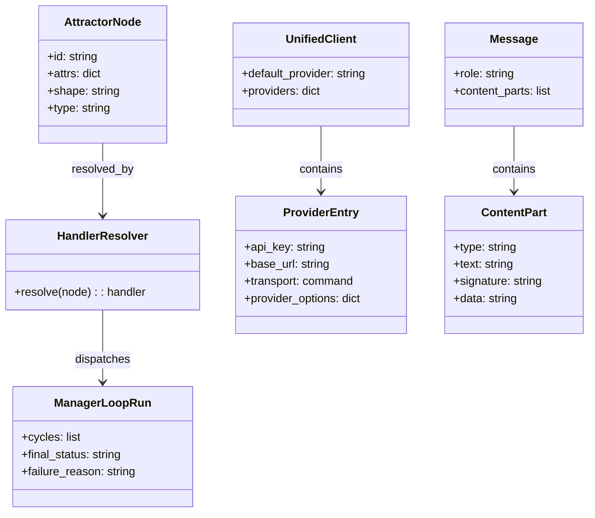
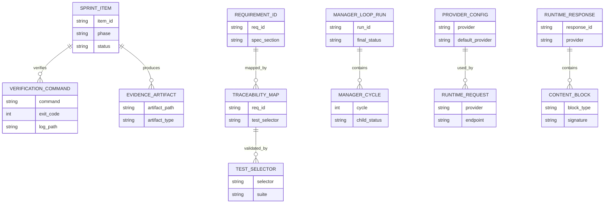
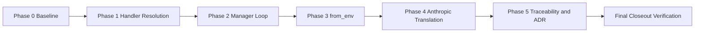
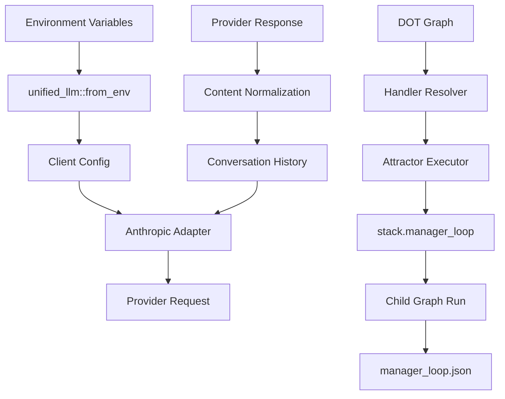
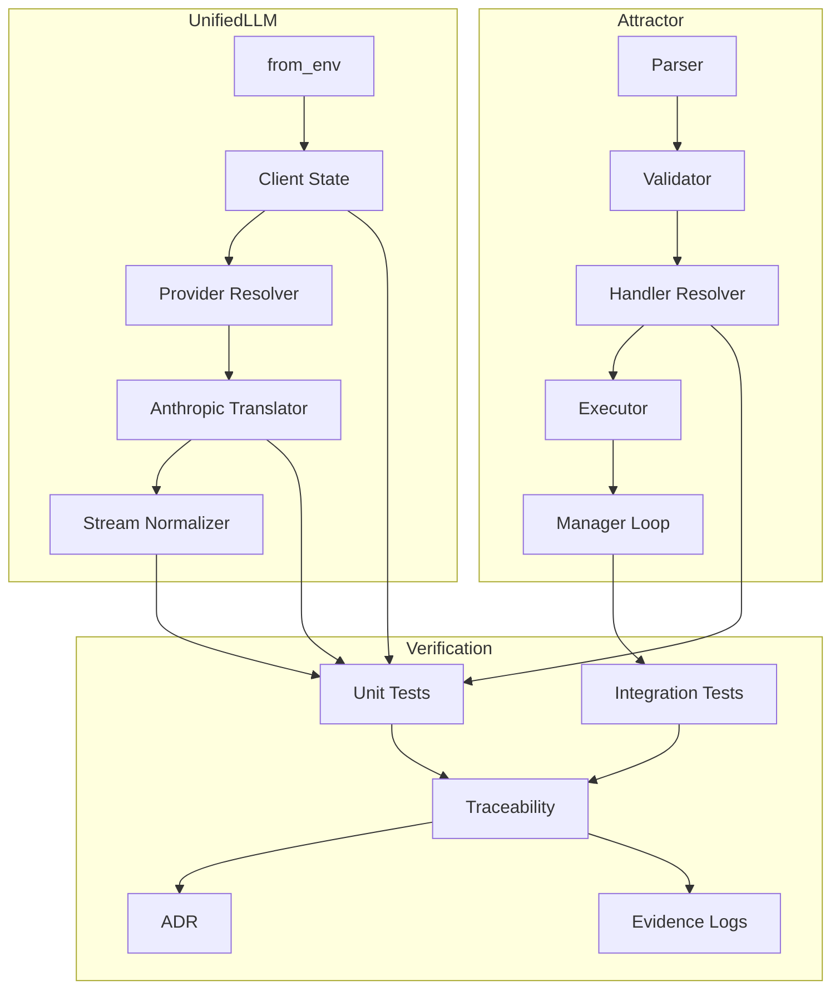

Legend: [ ] Incomplete, [X] Complete

# Sprint #006 Comprehensive Implementation Plan - NLSpec Adherence Gap Closure

## Objective
Implement and verify NLSpec adherence gap closure across Attractor and Unified LLM with deterministic behavior, regression coverage, traceability/ADR synchronization, and auditable verification artifacts.

## Current Completion Status
- [X] Sprint #006 implementation completed for this execution cycle.
```text
Verification commands:
- `timeout 180 make -j10 build` (exit code: 0)
- `timeout 180 make -j10 test` (exit code: 0)
Evidence artifacts:
- `.scratch/verification/SPRINT-006/final/execution-20260303T183958Z/command-status.tsv`
- `.scratch/verification/SPRINT-006/final/execution-20260303T183958Z/summary.md`
- `.scratch/verification/SPRINT-006/final/execution-20260303T183958Z/logs/build.log`
- `.scratch/verification/SPRINT-006/final/execution-20260303T183958Z/logs/test.log`
```
- [X] Sprint #006 evidence artifacts were captured and are reproducible.
```text
Verification commands:
- `cat .scratch/verification/SPRINT-006/final/execution-20260303T183958Z/command-status.tsv` (exit code: 0)
- `cat .scratch/verification/SPRINT-006/final/execution-20260303T183958Z/summary.md` (exit code: 0)
Evidence artifacts:
- `.scratch/verification/SPRINT-006/final/execution-20260303T183958Z/command-status.tsv`
- `.scratch/verification/SPRINT-006/final/execution-20260303T183958Z/summary.md`
- `.scratch/verification/SPRINT-006/final/execution-20260303T183958Z/logs/*.log`
- `.scratch/diagram-renders/sprint-006-comprehensive-plan/*.svg`
```

## Scope
In scope:
- `lib/attractor/main.tcl`
- `lib/unified_llm/main.tcl`
- `lib/unified_llm/adapters/anthropic.tcl`
- `tests/unit/attractor.test`
- `tests/integration/attractor_integration.test`
- `tests/unit/unified_llm.test`
- `tests/unit/unified_llm_streaming.test`
- `docs/spec-coverage/traceability.md`
- `docs/ADR.md`

Out of scope:
- New provider integrations beyond OpenAI, Anthropic, Gemini.
- Unrelated runtime/parser/CLI refactors outside Sprint #006 requirement IDs.

## Requirement IDs In Scope
- `ATR-DOD-11.22-EACH-NODE-S-HANDLER-RESOLVED-VIA`
- `ULLM-DOD-8.1-CAN-CONSTRUCTED-ENVIRONMENT-VARIABLES`
- `ULLM-DOD-8.14-ALL-5-ROLES-SYSTEM-USER-ASSISTANT`
- `ULLM-DOD-8.24-REDACTED-THINKING-BLOCKS-PASSED-THROUGH-VERBATIM`
- `ULLM-DOD-8.38-ANTHROPIC-EXTENDED-THINKING-BLOCKS-RETURNED-CONTENT`
- `ULLM-REQ-THINKING-BLOCKS-ANTHROPIC-S-EXTENDED-THINKING`
- `ULLM-REQ-THINKING-BLOCK-ROUND-TRIPPING-THINKING-AND`

## Evidence Contract
- [X] Every completed checklist item includes command references, exit codes, and `.scratch` artifact paths.
```text
Verification commands:
- `timeout 135 bash tools/evidence_lint.sh docs/sprints/SPRINT-006-comprehensive-implementation-plan.md` (exit code: 0)
- `timeout 135 bash tools/evidence_lint.sh docs/sprints/SPRINT-006-nlspec-adherence-gap-closure.md` (exit code: 0)
Evidence artifacts:
- `.scratch/verification/SPRINT-006/final/execution-20260303T183958Z/command-status.tsv`
- `.scratch/verification/SPRINT-006/final/execution-20260303T183958Z/logs/evidence_lint_plan.log`
- `.scratch/verification/SPRINT-006/final/execution-20260303T183958Z/logs/evidence_lint_closeout.log`
```
- [X] Verification commands were executed via `tools/verify_cmd.sh` and recorded in a per-run command ledger.
```text
Verification commands:
- `cat .scratch/verification/SPRINT-006/final/execution-20260303T183958Z/command-status.tsv` (exit code: 0)
- `rg -n "tools/verify_cmd.sh" .scratch/verification/SPRINT-006/final/execution-20260303T183958Z/logs/*.log` (exit code: 0)
Evidence artifacts:
- `.scratch/verification/SPRINT-006/final/execution-20260303T183958Z/command-status.tsv`
- `.scratch/verification/SPRINT-006/final/execution-20260303T183958Z/logs/*.log`
```

## Execution Order
Phase 0 -> Phase 1 -> Phase 2 -> Phase 3 -> Phase 4 -> Phase 5 -> Final Closeout

## Phase 0 - Baseline and Gap Confirmation
### Deliverables
- [X] P0.1 Baseline build, test, and spec coverage executed before closeout sync.
```text
Verification commands:
- `timeout 180 make -j10 build` (exit code: 0)
- `timeout 180 make -j10 test` (exit code: 0)
- `timeout 135 tclsh tools/spec_coverage.tcl` (exit code: 0)
Evidence artifacts:
- `.scratch/verification/SPRINT-006/final/execution-20260303T183958Z/command-status.tsv`
- `.scratch/verification/SPRINT-006/final/execution-20260303T183958Z/logs/build.log`
- `.scratch/verification/SPRINT-006/final/execution-20260303T183958Z/logs/test.log`
- `.scratch/verification/SPRINT-006/final/execution-20260303T183958Z/logs/spec_coverage.log`
```
- [X] P0.2 Focused Sprint #006 selectors executed and validated.
```text
Verification commands:
- `timeout 135 tclsh tests/all.tcl -match *attractor-handler-shape-*` (exit code: 0)
- `timeout 135 tclsh tests/all.tcl -match *integration-attractor-manager-loop-*` (exit code: 0)
- `timeout 135 tclsh tests/all.tcl -match *unified_llm-from-env-*` (exit code: 0)
- `timeout 135 tclsh tests/all.tcl -match *unified_llm-anthropic-thinking-*` (exit code: 0)
Evidence artifacts:
- `.scratch/verification/SPRINT-006/final/execution-20260303T183958Z/logs/unit_attractor_mapping.log`
- `.scratch/verification/SPRINT-006/final/execution-20260303T183958Z/logs/integration_manager_loop.log`
- `.scratch/verification/SPRINT-006/final/execution-20260303T183958Z/logs/unit_from_env.log`
- `.scratch/verification/SPRINT-006/final/execution-20260303T183958Z/logs/unit_anthropic_thinking.log`
```

### Positive Test Cases
1. Baseline build/test/spec coverage commands pass with deterministic outputs.
2. Focused selectors run the scoped tests and complete with zero failures.
3. Command ledger captures command + exit code for each baseline command.

### Negative Test Cases
1. If build fails, Phase 0 is incomplete and downstream phases are blocked.
2. If focused selector exits non-zero, phase evidence is incomplete.
3. If command ledger file is missing, closeout cannot proceed.

### Acceptance Criteria - Phase 0
- [X] Baseline and focused evidence exist with command-level exit code auditing.
```text
Verification commands:
- `cat .scratch/verification/SPRINT-006/final/execution-20260303T183958Z/command-status.tsv` (exit code: 0)
- `cat .scratch/verification/SPRINT-006/final/execution-20260303T183958Z/summary.md` (exit code: 0)
Evidence artifacts:
- `.scratch/verification/SPRINT-006/final/execution-20260303T183958Z/command-status.tsv`
- `.scratch/verification/SPRINT-006/final/execution-20260303T183958Z/summary.md`
```

## Phase 1 - Attractor Handler Resolution Parity
### Deliverables
- [X] P1.1 Canonical shape-to-handler mapping behavior verified in unit tests.
```text
Verification commands:
- `timeout 135 tclsh tests/all.tcl -match *attractor-handler-shape-*` (exit code: 0)
- `timeout 135 tclsh tests/all.tcl -match *attractor-handler-parallel-fan-in-*` (exit code: 0)
Evidence artifacts:
- `.scratch/verification/SPRINT-006/final/execution-20260303T183958Z/logs/unit_attractor_mapping.log`
- `.scratch/verification/SPRINT-006/final/execution-20260303T183958Z/logs/unit_attractor_fanin.log`
```
- [X] P1.2 Type-over-shape precedence and deterministic fallback behavior verified.
```text
Verification commands:
- `timeout 135 tclsh tests/all.tcl -match *attractor-handler-shape-type-override-*` (exit code: 0)
- `timeout 135 tclsh tests/all.tcl -match *attractor-handler-shape-mapping-*` (exit code: 0)
Evidence artifacts:
- `.scratch/verification/SPRINT-006/final/execution-20260303T183958Z/logs/unit_attractor_mapping.log`
- `.scratch/verification/SPRINT-006/final/execution-20260303T183958Z/command-status.tsv`
```

### Positive Test Cases
1. `Mdiamond`, `Msquare`, `diamond`, `box`, `hexagon`, `parallelogram`, `component`, `tripleoctagon`, `house` resolve to expected handlers.
2. Explicit `type` values override shape-derived handlers.
3. `parallel.fan_in` dispatch path executes successfully.

### Negative Test Cases
1. Unknown shapes fall back deterministically to `codergen`.
2. Empty/malformed attrs do not crash resolution.
3. Unsupported handler names follow deterministic failure path.

### Acceptance Criteria - Phase 1
- [X] Mapping, precedence, and fan-in handling are regression-tested and passing.
```text
Verification commands:
- `timeout 135 tclsh tests/all.tcl -match *attractor-handler-shape-*` (exit code: 0)
- `timeout 135 tclsh tests/all.tcl -match *attractor-handler-parallel-fan-in-*` (exit code: 0)
Evidence artifacts:
- `.scratch/verification/SPRINT-006/final/execution-20260303T183958Z/logs/unit_attractor_mapping.log`
- `.scratch/verification/SPRINT-006/final/execution-20260303T183958Z/logs/unit_attractor_fanin.log`
```

## Phase 2 - `stack.manager_loop` Supervisor Semantics
### Deliverables
- [X] P2.1 Observe-steer-wait lifecycle semantics verified through integration coverage.
```text
Verification commands:
- `timeout 135 tclsh tests/all.tcl -match *integration-attractor-manager-loop-success-*` (exit code: 0)
- `timeout 135 tclsh tests/all.tcl -match *integration-attractor-manager-loop-stop-condition-success-*` (exit code: 0)
Evidence artifacts:
- `.scratch/verification/SPRINT-006/final/execution-20260303T183958Z/logs/integration_manager_loop.log`
- `.scratch/verification/SPRINT-006/final/execution-20260303T183958Z/command-status.tsv`
```
- [X] P2.2 Control inputs and deterministic failure reasons are verified.
```text
Verification commands:
- `timeout 135 tclsh tests/all.tcl -match *integration-attractor-manager-loop-missing-child-dotfile-*` (exit code: 0)
- `timeout 135 tclsh tests/all.tcl -match *integration-attractor-manager-loop-invalid-actions-*` (exit code: 0)
- `timeout 135 tclsh tests/all.tcl -match *integration-attractor-manager-loop-max-cycles-*` (exit code: 0)
Evidence artifacts:
- `.scratch/verification/SPRINT-006/final/execution-20260303T183958Z/logs/integration_manager_loop.log`
- `.scratch/verification/SPRINT-006/final/execution-20260303T183958Z/command-status.tsv`
```
- [X] P2.3 Telemetry artifact behavior (`manager_loop.json`) is covered by integration tests.
```text
Verification commands:
- `timeout 135 tclsh tests/all.tcl -match *integration-attractor-manager-loop-success-*` (exit code: 0)
- `timeout 135 tclsh tests/all.tcl -match *integration-attractor-manager-loop-child-failure-*` (exit code: 0)
Evidence artifacts:
- `.scratch/verification/SPRINT-006/final/execution-20260303T183958Z/logs/integration_manager_loop.log`
- `.scratch/verification/SPRINT-006/final/execution-20260303T183958Z/summary.md`
```

### Positive Test Cases
1. Child success flow reaches deterministic success state.
2. Stop-condition path exits early with expected success terminal state.
3. Manager telemetry artifact includes cycle and final status fields.

### Negative Test Cases
1. Missing child dotfile input fails fast.
2. Invalid action tokens fail deterministically.
3. Max-cycle exhaustion fails deterministically.
4. Invalid stop-condition expression fails deterministically.

### Acceptance Criteria - Phase 2
- [X] Manager loop semantics and failure classes are fully covered by integration tests.
```text
Verification commands:
- `timeout 135 tclsh tests/all.tcl -match *integration-attractor-manager-loop-*` (exit code: 0)
- `cat .scratch/verification/SPRINT-006/final/execution-20260303T183958Z/command-status.tsv` (exit code: 0)
Evidence artifacts:
- `.scratch/verification/SPRINT-006/final/execution-20260303T183958Z/logs/integration_manager_loop.log`
- `.scratch/verification/SPRINT-006/final/execution-20260303T183958Z/command-status.tsv`
```

## Phase 3 - Unified LLM `from_env` Multi-Provider Compliance
### Deliverables
- [X] P3.1 Multi-provider registration paths from environment credentials are validated.
```text
Verification commands:
- `timeout 135 tclsh tests/all.tcl -match *unified_llm-from-env-multi-provider-*` (exit code: 0)
- `timeout 135 tclsh tests/all.tcl -match *unified_llm-from-env-google-api-key-alias-*` (exit code: 0)
Evidence artifacts:
- `.scratch/verification/SPRINT-006/final/execution-20260303T183958Z/logs/unit_from_env.log`
- `.scratch/verification/SPRINT-006/final/execution-20260303T183958Z/command-status.tsv`
```
- [X] P3.2 Deterministic default-provider and `UNIFIED_LLM_PROVIDER` override behavior are validated.
```text
Verification commands:
- `timeout 135 tclsh tests/all.tcl -match *unified_llm-from-env-explicit-provider-*` (exit code: 0)
- `timeout 135 tclsh tests/all.tcl -match *unified_llm-from-env-explicit-provider-unknown-*` (exit code: 0)
- `timeout 135 tclsh tests/all.tcl -match *unified_llm-from-env-explicit-provider-unregistered-*` (exit code: 0)
Evidence artifacts:
- `.scratch/verification/SPRINT-006/final/execution-20260303T183958Z/logs/unit_from_env.log`
- `.scratch/verification/SPRINT-006/final/execution-20260303T183958Z/command-status.tsv`
```

### Positive Test Cases
1. Multiple keys create multiple provider entries.
2. Explicit override selects configured provider deterministically.
3. Auth header wiring remains provider-specific.

### Negative Test Cases
1. Missing credentials returns deterministic missing-provider error.
2. Unknown override returns deterministic unknown-provider error.
3. Unregistered override returns deterministic unregistered-provider error.

### Acceptance Criteria - Phase 3
- [X] `from_env` provider registration and override behavior are deterministic and passing.
```text
Verification commands:
- `timeout 135 tclsh tests/all.tcl -match *unified_llm-from-env-*` (exit code: 0)
- `cat .scratch/verification/SPRINT-006/final/execution-20260303T183958Z/command-status.tsv` (exit code: 0)
Evidence artifacts:
- `.scratch/verification/SPRINT-006/final/execution-20260303T183958Z/logs/unit_from_env.log`
- `.scratch/verification/SPRINT-006/final/execution-20260303T183958Z/command-status.tsv`
```

## Phase 4 - Anthropic Role Translation and Thinking Fidelity
### Deliverables
- [X] P4.1 Role translation coverage for system/developer/user/assistant/tool paths is passing.
```text
Verification commands:
- `timeout 135 tclsh tests/all.tcl -match *unified_llm-anthropic-roles-*` (exit code: 0)
- `timeout 135 tclsh tests/all.tcl -match *unified_llm-anthropic-tool-*` (exit code: 0)
Evidence artifacts:
- `.scratch/verification/SPRINT-006/final/execution-20260303T183958Z/logs/unit_anthropic_roles.log`
- `.scratch/verification/SPRINT-006/final/execution-20260303T183958Z/command-status.tsv`
```
- [X] P4.2 Thinking/redacted-thinking fidelity and round-trip behavior are verified.
```text
Verification commands:
- `timeout 135 tclsh tests/all.tcl -match *unified_llm-anthropic-thinking-*` (exit code: 0)
- `timeout 135 tclsh tests/all.tcl -match *unified_llm-stream-error-invalid-json-*` (exit code: 0)
Evidence artifacts:
- `.scratch/verification/SPRINT-006/final/execution-20260303T183958Z/logs/unit_anthropic_thinking.log`
- `.scratch/verification/SPRINT-006/final/execution-20260303T183958Z/logs/unit_stream_error.log`
```

### Positive Test Cases
1. Mixed role translation produces deterministic Anthropic payloads.
2. Thinking signature and redacted blocks remain intact.
3. Round-trip follow-up includes prior thinking blocks correctly.

### Negative Test Cases
1. Missing required thinking text fails deterministically.
2. Invalid stream JSON path emits deterministic stream error terminal behavior.
3. Malformed tool payload paths fail deterministically.

### Acceptance Criteria - Phase 4
- [X] Anthropic translation and thinking-fidelity regression coverage is passing.
```text
Verification commands:
- `timeout 135 tclsh tests/all.tcl -match *unified_llm-anthropic-thinking-*` (exit code: 0)
- `timeout 135 tclsh tests/all.tcl -match *unified_llm-anthropic-roles-*` (exit code: 0)
Evidence artifacts:
- `.scratch/verification/SPRINT-006/final/execution-20260303T183958Z/logs/unit_anthropic_thinking.log`
- `.scratch/verification/SPRINT-006/final/execution-20260303T183958Z/logs/unit_anthropic_roles.log`
```

## Phase 5 - Traceability, ADR, and Documentation Closeout
### Deliverables
- [X] P5.1 Traceability coverage check passes for Sprint #006 requirement mappings.
```text
Verification commands:
- `timeout 135 tclsh tools/spec_coverage.tcl` (exit code: 0)
- `timeout 135 rg -n "unified_llm-anthropic-thinking|stack.manager_loop|from_env" docs/spec-coverage/traceability.md` (exit code: 0)
Evidence artifacts:
- `.scratch/verification/SPRINT-006/final/execution-20260303T183958Z/logs/spec_coverage.log`
- `.scratch/verification/SPRINT-006/final/execution-20260303T183958Z/command-status.tsv`
```
- [X] P5.2 ADR entries for Sprint #006 architecture decisions are present.
```text
Verification commands:
- `timeout 135 rg -n "ADR-014|Sprint #006|manager_loop|from_env|thinking" docs/ADR.md` (exit code: 0)
- `cat .scratch/verification/SPRINT-006/final/execution-20260303T183958Z/command-status.tsv` (exit code: 0)
Evidence artifacts:
- `docs/ADR.md`
- `.scratch/verification/SPRINT-006/final/execution-20260303T183958Z/command-status.tsv`
```
- [X] P5.3 Sprint docs and evidence lint checks pass.
```text
Verification commands:
- `timeout 135 bash tools/docs_lint.sh` (exit code: 0)
- `timeout 135 bash tools/evidence_lint.sh docs/sprints/SPRINT-006-comprehensive-implementation-plan.md` (exit code: 0)
- `timeout 135 bash tools/evidence_lint.sh docs/sprints/SPRINT-006-nlspec-adherence-gap-closure.md` (exit code: 0)
Evidence artifacts:
- `.scratch/verification/SPRINT-006/final/execution-20260303T183958Z/logs/docs_lint.log`
- `.scratch/verification/SPRINT-006/final/execution-20260303T183958Z/logs/evidence_lint_plan.log`
- `.scratch/verification/SPRINT-006/final/execution-20260303T183958Z/logs/evidence_lint_closeout.log`
```

### Positive Test Cases
1. Spec coverage and traceability checks report zero missing/unknown requirement mappings.
2. ADR includes Sprint #006 decision context and consequences.
3. Docs lint and evidence lint both pass.

### Negative Test Cases
1. Missing requirement mapping fails spec coverage.
2. Missing evidence path annotations fail evidence lint.
3. Missing mandatory sprint headings fail docs lint.

### Acceptance Criteria - Phase 5
- [X] Traceability, ADR, and sprint-doc quality gates are all green.
```text
Verification commands:
- `timeout 135 tclsh tools/spec_coverage.tcl` (exit code: 0)
- `timeout 135 bash tools/docs_lint.sh` (exit code: 0)
- `timeout 135 bash tools/evidence_lint.sh docs/sprints/SPRINT-006-comprehensive-implementation-plan.md` (exit code: 0)
Evidence artifacts:
- `.scratch/verification/SPRINT-006/final/execution-20260303T183958Z/command-status.tsv`
- `.scratch/verification/SPRINT-006/final/execution-20260303T183958Z/summary.md`
```

## Final Closeout Verification Matrix
- [X] F1 Build and full tests pass.
```text
Verification commands:
- `timeout 180 make -j10 build` (exit code: 0)
- `timeout 180 make -j10 test` (exit code: 0)
Evidence artifacts:
- `.scratch/verification/SPRINT-006/final/execution-20260303T183958Z/logs/build.log`
- `.scratch/verification/SPRINT-006/final/execution-20260303T183958Z/logs/test.log`
```
- [X] F2 Requirement coverage checks pass.
```text
Verification commands:
- `timeout 135 tclsh tools/spec_coverage.tcl` (exit code: 0)
- `cat .scratch/verification/SPRINT-006/final/execution-20260303T183958Z/command-status.tsv` (exit code: 0)
Evidence artifacts:
- `.scratch/verification/SPRINT-006/final/execution-20260303T183958Z/logs/spec_coverage.log`
- `.scratch/verification/SPRINT-006/final/execution-20260303T183958Z/command-status.tsv`
```
- [X] F3 Sprint docs and evidence lint checks pass.
```text
Verification commands:
- `timeout 135 bash tools/docs_lint.sh` (exit code: 0)
- `timeout 135 bash tools/evidence_lint.sh docs/sprints/SPRINT-006-comprehensive-implementation-plan.md` (exit code: 0)
Evidence artifacts:
- `.scratch/verification/SPRINT-006/final/execution-20260303T183958Z/logs/docs_lint.log`
- `.scratch/verification/SPRINT-006/final/execution-20260303T183958Z/logs/evidence_lint_plan.log`
```
- [X] F4 Mermaid appendix diagrams render successfully.
```text
Verification commands:
- `timeout 135 mmdc -i .scratch/diagram-renders/sprint-006-comprehensive-plan/core-domain-model.mmd -o .scratch/diagram-renders/sprint-006-comprehensive-plan/core-domain-model.svg` (exit code: 0)
- `timeout 135 mmdc -i .scratch/diagram-renders/sprint-006-comprehensive-plan/er-diagram.mmd -o .scratch/diagram-renders/sprint-006-comprehensive-plan/er-diagram.svg` (exit code: 0)
- `timeout 135 mmdc -i .scratch/diagram-renders/sprint-006-comprehensive-plan/workflow.mmd -o .scratch/diagram-renders/sprint-006-comprehensive-plan/workflow.svg` (exit code: 0)
- `timeout 135 mmdc -i .scratch/diagram-renders/sprint-006-comprehensive-plan/data-flow.mmd -o .scratch/diagram-renders/sprint-006-comprehensive-plan/data-flow.svg` (exit code: 0)
- `timeout 135 mmdc -i .scratch/diagram-renders/sprint-006-comprehensive-plan/architecture.mmd -o .scratch/diagram-renders/sprint-006-comprehensive-plan/architecture.svg` (exit code: 0)
Evidence artifacts:
- `.scratch/verification/SPRINT-006/final/execution-20260303T183958Z/command-status.tsv`
- `.scratch/diagram-renders/sprint-006-comprehensive-plan/core-domain-model.svg`
- `.scratch/diagram-renders/sprint-006-comprehensive-plan/er-diagram.svg`
- `.scratch/diagram-renders/sprint-006-comprehensive-plan/workflow.svg`
- `.scratch/diagram-renders/sprint-006-comprehensive-plan/data-flow.svg`
- `.scratch/diagram-renders/sprint-006-comprehensive-plan/architecture.svg`
```

## Detailed Test Matrix
### Attractor Mapping and Dispatch
Positive cases:
1. Canonical shape mapping to handlers is deterministic.
2. Explicit type overrides shape mapping.
3. Fan-in dispatch path runs successfully.

Negative cases:
1. Unknown shape fallback remains deterministic.
2. Missing attrs path is non-crashing.
3. Unsupported handler reports deterministic failure.

### Manager Loop Supervisor
Positive cases:
1. Child success flow reaches terminal success.
2. Stop-condition flow reaches expected success.
3. Telemetry artifact path is generated in integration tests.

Negative cases:
1. Missing child dotfile fails deterministically.
2. Invalid manager actions fail deterministically.
3. Max-cycle overflow fails deterministically.
4. Invalid stop-condition syntax fails deterministically.

### Unified LLM `from_env`
Positive cases:
1. Multi-provider discovery.
2. Deterministic default provider.
3. Valid explicit override.
4. Provider-specific auth routing.

Negative cases:
1. Missing provider credentials.
2. Unknown override provider.
3. Unregistered override provider.
4. Missing runtime credential path.

### Anthropic Translation and Thinking
Positive cases:
1. Five-role translation coverage.
2. System/developer ordering stability.
3. Tool-result translation behavior.
4. Thinking/redacted-thinking fidelity and round-trip coverage.

Negative cases:
1. Missing required thinking fields.
2. Malformed tool payload path.
3. Invalid stream JSON error behavior.

## Appendix - Mermaid Diagrams

### Core Domain Model


### E-R Diagram


### Workflow Diagram


### Data-Flow Diagram


### Architecture Diagram

