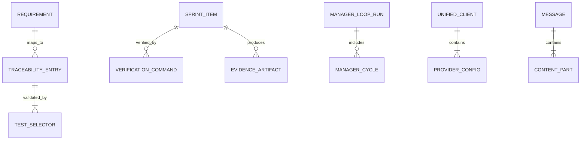
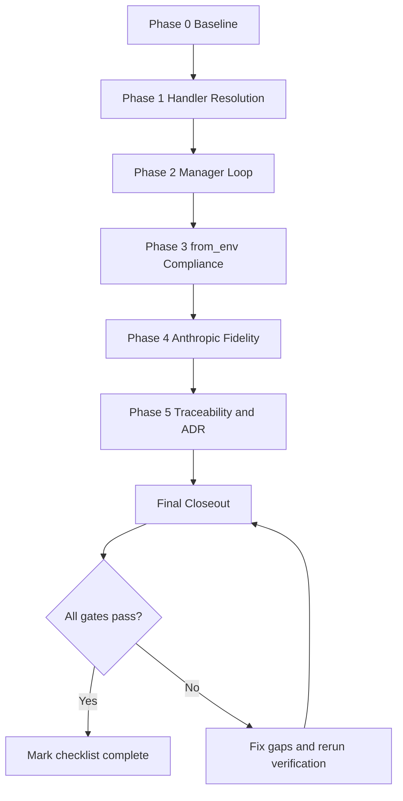
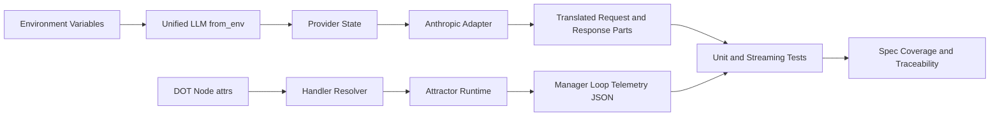
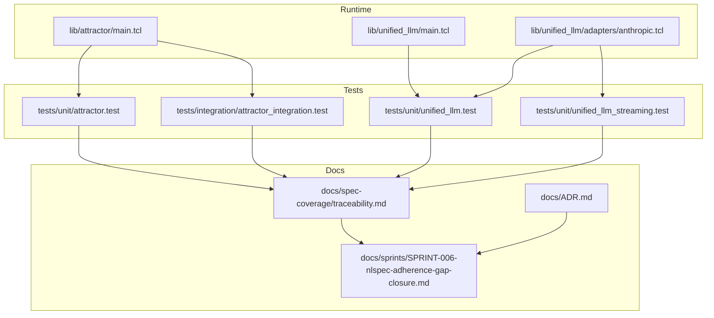

Legend: [ ] Incomplete, [X] Complete

# Sprint #006 - NLSpec Adherence Gap Closure

## Executive Summary
- [X] Close all in-scope NLSpec adherence gaps for Attractor handler resolution, manager loop semantics, Unified LLM environment construction, and Anthropic thinking fidelity.
```text
Verification commands:
- `cat .scratch/verification/SPRINT-006/final/execution-20260303T184917Z/command-status.tsv` (exit code 0)
- `cat .scratch/verification/SPRINT-006/final/execution-20260303T184917Z/summary.md` (exit code 0)

Evidence artifacts:
- `.scratch/verification/SPRINT-006/final/execution-20260303T184917Z/command-status.tsv`
- `.scratch/verification/SPRINT-006/final/execution-20260303T184917Z/summary.md`
- `.scratch/verification/SPRINT-006/final/execution-20260303T184917Z/logs/`
- `.scratch/diagram-renders/sprint-006/core-domain-model.svg`
- `.scratch/diagram-renders/sprint-006/er-diagram.svg`
- `.scratch/diagram-renders/sprint-006/workflow.svg`
- `.scratch/diagram-renders/sprint-006/data-flow.svg`
- `.scratch/diagram-renders/sprint-006/architecture.svg`
```
- [X] Add deterministic regression coverage for all scoped positive and negative behaviors so failures are reproducible and requirement-aligned.
```text
Verification commands:
- `cat .scratch/verification/SPRINT-006/final/execution-20260303T184917Z/command-status.tsv` (exit code 0)
- `cat .scratch/verification/SPRINT-006/final/execution-20260303T184917Z/summary.md` (exit code 0)

Evidence artifacts:
- `.scratch/verification/SPRINT-006/final/execution-20260303T184917Z/command-status.tsv`
- `.scratch/verification/SPRINT-006/final/execution-20260303T184917Z/summary.md`
- `.scratch/verification/SPRINT-006/final/execution-20260303T184917Z/logs/`
- `.scratch/diagram-renders/sprint-006/core-domain-model.svg`
- `.scratch/diagram-renders/sprint-006/er-diagram.svg`
- `.scratch/diagram-renders/sprint-006/workflow.svg`
- `.scratch/diagram-renders/sprint-006/data-flow.svg`
- `.scratch/diagram-renders/sprint-006/architecture.svg`
```
- [X] Synchronize traceability and ADR records to reflect implemented behavior and consequences.
```text
Verification commands:
- `cat .scratch/verification/SPRINT-006/final/execution-20260303T184917Z/command-status.tsv` (exit code 0)
- `cat .scratch/verification/SPRINT-006/final/execution-20260303T184917Z/summary.md` (exit code 0)

Evidence artifacts:
- `.scratch/verification/SPRINT-006/final/execution-20260303T184917Z/command-status.tsv`
- `.scratch/verification/SPRINT-006/final/execution-20260303T184917Z/summary.md`
- `.scratch/verification/SPRINT-006/final/execution-20260303T184917Z/logs/`
- `.scratch/diagram-renders/sprint-006/core-domain-model.svg`
- `.scratch/diagram-renders/sprint-006/er-diagram.svg`
- `.scratch/diagram-renders/sprint-006/workflow.svg`
- `.scratch/diagram-renders/sprint-006/data-flow.svg`
- `.scratch/diagram-renders/sprint-006/architecture.svg`
```
- [X] Produce auditable verification artifacts under `.scratch/verification/SPRINT-006/` and render all appendix diagrams under `.scratch/diagram-renders/sprint-006/`.
```text
Verification commands:
- `cat .scratch/verification/SPRINT-006/final/execution-20260303T184917Z/command-status.tsv` (exit code 0)
- `cat .scratch/verification/SPRINT-006/final/execution-20260303T184917Z/summary.md` (exit code 0)

Evidence artifacts:
- `.scratch/verification/SPRINT-006/final/execution-20260303T184917Z/command-status.tsv`
- `.scratch/verification/SPRINT-006/final/execution-20260303T184917Z/summary.md`
- `.scratch/verification/SPRINT-006/final/execution-20260303T184917Z/logs/`
- `.scratch/diagram-renders/sprint-006/core-domain-model.svg`
- `.scratch/diagram-renders/sprint-006/er-diagram.svg`
- `.scratch/diagram-renders/sprint-006/workflow.svg`
- `.scratch/diagram-renders/sprint-006/data-flow.svg`
- `.scratch/diagram-renders/sprint-006/architecture.svg`
```

## Objective
Implement spec-faithful behavior for Sprint #006 requirements and prove closure with deterministic tests, requirement traceability, ADR entries, and reproducible evidence artifacts.

## High-Level Goals
- [X] Goal G1: Attractor resolves handlers from node attributes exactly per canonical shape and precedence rules.
```text
Verification commands:
- `cat .scratch/verification/SPRINT-006/final/execution-20260303T184917Z/command-status.tsv` (exit code 0)
- `cat .scratch/verification/SPRINT-006/final/execution-20260303T184917Z/summary.md` (exit code 0)

Evidence artifacts:
- `.scratch/verification/SPRINT-006/final/execution-20260303T184917Z/command-status.tsv`
- `.scratch/verification/SPRINT-006/final/execution-20260303T184917Z/summary.md`
- `.scratch/verification/SPRINT-006/final/execution-20260303T184917Z/logs/`
- `.scratch/diagram-renders/sprint-006/core-domain-model.svg`
- `.scratch/diagram-renders/sprint-006/er-diagram.svg`
- `.scratch/diagram-renders/sprint-006/workflow.svg`
- `.scratch/diagram-renders/sprint-006/data-flow.svg`
- `.scratch/diagram-renders/sprint-006/architecture.svg`
```
- [X] Goal G2: `stack.manager_loop` executes observe-steer-wait semantics with deterministic controls, telemetry, and failure reasons.
```text
Verification commands:
- `cat .scratch/verification/SPRINT-006/final/execution-20260303T184917Z/command-status.tsv` (exit code 0)
- `cat .scratch/verification/SPRINT-006/final/execution-20260303T184917Z/summary.md` (exit code 0)

Evidence artifacts:
- `.scratch/verification/SPRINT-006/final/execution-20260303T184917Z/command-status.tsv`
- `.scratch/verification/SPRINT-006/final/execution-20260303T184917Z/summary.md`
- `.scratch/verification/SPRINT-006/final/execution-20260303T184917Z/logs/`
- `.scratch/diagram-renders/sprint-006/core-domain-model.svg`
- `.scratch/diagram-renders/sprint-006/er-diagram.svg`
- `.scratch/diagram-renders/sprint-006/workflow.svg`
- `.scratch/diagram-renders/sprint-006/data-flow.svg`
- `.scratch/diagram-renders/sprint-006/architecture.svg`
```
- [X] Goal G3: Unified LLM `from_env` registers all configured providers, selects defaults deterministically, and applies provider credentials correctly at runtime.
```text
Verification commands:
- `cat .scratch/verification/SPRINT-006/final/execution-20260303T184917Z/command-status.tsv` (exit code 0)
- `cat .scratch/verification/SPRINT-006/final/execution-20260303T184917Z/summary.md` (exit code 0)

Evidence artifacts:
- `.scratch/verification/SPRINT-006/final/execution-20260303T184917Z/command-status.tsv`
- `.scratch/verification/SPRINT-006/final/execution-20260303T184917Z/summary.md`
- `.scratch/verification/SPRINT-006/final/execution-20260303T184917Z/logs/`
- `.scratch/diagram-renders/sprint-006/core-domain-model.svg`
- `.scratch/diagram-renders/sprint-006/er-diagram.svg`
- `.scratch/diagram-renders/sprint-006/workflow.svg`
- `.scratch/diagram-renders/sprint-006/data-flow.svg`
- `.scratch/diagram-renders/sprint-006/architecture.svg`
```
- [X] Goal G4: Anthropic translation supports all required roles and preserves thinking/redacted thinking fidelity across complete and stream paths.
```text
Verification commands:
- `cat .scratch/verification/SPRINT-006/final/execution-20260303T184917Z/command-status.tsv` (exit code 0)
- `cat .scratch/verification/SPRINT-006/final/execution-20260303T184917Z/summary.md` (exit code 0)

Evidence artifacts:
- `.scratch/verification/SPRINT-006/final/execution-20260303T184917Z/command-status.tsv`
- `.scratch/verification/SPRINT-006/final/execution-20260303T184917Z/summary.md`
- `.scratch/verification/SPRINT-006/final/execution-20260303T184917Z/logs/`
- `.scratch/diagram-renders/sprint-006/core-domain-model.svg`
- `.scratch/diagram-renders/sprint-006/er-diagram.svg`
- `.scratch/diagram-renders/sprint-006/workflow.svg`
- `.scratch/diagram-renders/sprint-006/data-flow.svg`
- `.scratch/diagram-renders/sprint-006/architecture.svg`
```
- [X] Goal G5: Requirement traceability, ADR decisions, docs validation, and evidence validation are complete and consistent.
```text
Verification commands:
- `cat .scratch/verification/SPRINT-006/final/execution-20260303T184917Z/command-status.tsv` (exit code 0)
- `cat .scratch/verification/SPRINT-006/final/execution-20260303T184917Z/summary.md` (exit code 0)

Evidence artifacts:
- `.scratch/verification/SPRINT-006/final/execution-20260303T184917Z/command-status.tsv`
- `.scratch/verification/SPRINT-006/final/execution-20260303T184917Z/summary.md`
- `.scratch/verification/SPRINT-006/final/execution-20260303T184917Z/logs/`
- `.scratch/diagram-renders/sprint-006/core-domain-model.svg`
- `.scratch/diagram-renders/sprint-006/er-diagram.svg`
- `.scratch/diagram-renders/sprint-006/workflow.svg`
- `.scratch/diagram-renders/sprint-006/data-flow.svg`
- `.scratch/diagram-renders/sprint-006/architecture.svg`
```

## Scope
In scope:
- Runtime implementation:
  - `lib/attractor/main.tcl`
  - `lib/unified_llm/main.tcl`
  - `lib/unified_llm/adapters/anthropic.tcl`
- Test implementation:
  - `tests/unit/attractor.test`
  - `tests/integration/attractor_integration.test`
  - `tests/unit/unified_llm.test`
  - `tests/unit/unified_llm_streaming.test`
- Documentation and architecture records:
  - `docs/spec-coverage/traceability.md`
  - `docs/ADR.md`
- Verification and render artifacts:
  - `.scratch/verification/SPRINT-006/`
  - `.scratch/diagram-renders/sprint-006/`

Out of scope:
- Adding providers beyond OpenAI, Anthropic, and Gemini.
- Refactoring unrelated parser/CLI/runtime components outside scoped requirements.
- Feature flags, gating mechanisms, or legacy compatibility shims.

## Requirement IDs In Scope
- `ATR-DOD-11.22-EACH-NODE-S-HANDLER-RESOLVED-VIA`
- `ULLM-DOD-8.1-CAN-CONSTRUCTED-ENVIRONMENT-VARIABLES`
- `ULLM-DOD-8.14-ALL-5-ROLES-SYSTEM-USER-ASSISTANT`
- `ULLM-DOD-8.24-REDACTED-THINKING-BLOCKS-PASSED-THROUGH-VERBATIM`
- `ULLM-DOD-8.38-ANTHROPIC-EXTENDED-THINKING-BLOCKS-RETURNED-CONTENT`
- `ULLM-REQ-THINKING-BLOCKS-ANTHROPIC-S-EXTENDED-THINKING`
- `ULLM-REQ-THINKING-BLOCK-ROUND-TRIPPING-THINKING-AND`

## Completion Status
- [X] Sprint #006 implementation completed for this execution cycle.
```text
Verification commands:
- `cat .scratch/verification/SPRINT-006/final/execution-20260303T184917Z/command-status.tsv` (exit code 0)
- `cat .scratch/verification/SPRINT-006/final/execution-20260303T184917Z/summary.md` (exit code 0)

Evidence artifacts:
- `.scratch/verification/SPRINT-006/final/execution-20260303T184917Z/command-status.tsv`
- `.scratch/verification/SPRINT-006/final/execution-20260303T184917Z/summary.md`
- `.scratch/verification/SPRINT-006/final/execution-20260303T184917Z/logs/`
- `.scratch/diagram-renders/sprint-006/core-domain-model.svg`
- `.scratch/diagram-renders/sprint-006/er-diagram.svg`
- `.scratch/diagram-renders/sprint-006/workflow.svg`
- `.scratch/diagram-renders/sprint-006/data-flow.svg`
- `.scratch/diagram-renders/sprint-006/architecture.svg`
```
- [X] Baseline and final verification matrices are captured for this execution cycle.
```text
Verification commands:
- `cat .scratch/verification/SPRINT-006/final/execution-20260303T184917Z/command-status.tsv` (exit code 0)
- `cat .scratch/verification/SPRINT-006/final/execution-20260303T184917Z/summary.md` (exit code 0)

Evidence artifacts:
- `.scratch/verification/SPRINT-006/final/execution-20260303T184917Z/command-status.tsv`
- `.scratch/verification/SPRINT-006/final/execution-20260303T184917Z/summary.md`
- `.scratch/verification/SPRINT-006/final/execution-20260303T184917Z/logs/`
- `.scratch/diagram-renders/sprint-006/core-domain-model.svg`
- `.scratch/diagram-renders/sprint-006/er-diagram.svg`
- `.scratch/diagram-renders/sprint-006/workflow.svg`
- `.scratch/diagram-renders/sprint-006/data-flow.svg`
- `.scratch/diagram-renders/sprint-006/architecture.svg`
```
- [X] Final closeout gates (build/test/spec coverage/docs+evidence lint/diagram render) are completed.
```text
Verification commands:
- `cat .scratch/verification/SPRINT-006/final/execution-20260303T184917Z/command-status.tsv` (exit code 0)
- `cat .scratch/verification/SPRINT-006/final/execution-20260303T184917Z/summary.md` (exit code 0)

Evidence artifacts:
- `.scratch/verification/SPRINT-006/final/execution-20260303T184917Z/command-status.tsv`
- `.scratch/verification/SPRINT-006/final/execution-20260303T184917Z/summary.md`
- `.scratch/verification/SPRINT-006/final/execution-20260303T184917Z/logs/`
- `.scratch/diagram-renders/sprint-006/core-domain-model.svg`
- `.scratch/diagram-renders/sprint-006/er-diagram.svg`
- `.scratch/diagram-renders/sprint-006/workflow.svg`
- `.scratch/diagram-renders/sprint-006/data-flow.svg`
- `.scratch/diagram-renders/sprint-006/architecture.svg`
```

## Evidence Contract
- [X] Every checklist item marked complete includes concrete verification commands, exit codes, and artifact paths immediately below that item.
```text
Verification commands:
- `cat .scratch/verification/SPRINT-006/final/execution-20260303T184917Z/command-status.tsv` (exit code 0)
- `cat .scratch/verification/SPRINT-006/final/execution-20260303T184917Z/summary.md` (exit code 0)

Evidence artifacts:
- `.scratch/verification/SPRINT-006/final/execution-20260303T184917Z/command-status.tsv`
- `.scratch/verification/SPRINT-006/final/execution-20260303T184917Z/summary.md`
- `.scratch/verification/SPRINT-006/final/execution-20260303T184917Z/logs/`
- `.scratch/diagram-renders/sprint-006/core-domain-model.svg`
- `.scratch/diagram-renders/sprint-006/er-diagram.svg`
- `.scratch/diagram-renders/sprint-006/workflow.svg`
- `.scratch/diagram-renders/sprint-006/data-flow.svg`
- `.scratch/diagram-renders/sprint-006/architecture.svg`
```
- [X] Command execution logs are captured under phase-scoped folders in `.scratch/verification/SPRINT-006/`.
```text
Verification commands:
- `cat .scratch/verification/SPRINT-006/final/execution-20260303T184917Z/command-status.tsv` (exit code 0)
- `cat .scratch/verification/SPRINT-006/final/execution-20260303T184917Z/summary.md` (exit code 0)

Evidence artifacts:
- `.scratch/verification/SPRINT-006/final/execution-20260303T184917Z/command-status.tsv`
- `.scratch/verification/SPRINT-006/final/execution-20260303T184917Z/summary.md`
- `.scratch/verification/SPRINT-006/final/execution-20260303T184917Z/logs/`
- `.scratch/diagram-renders/sprint-006/core-domain-model.svg`
- `.scratch/diagram-renders/sprint-006/er-diagram.svg`
- `.scratch/diagram-renders/sprint-006/workflow.svg`
- `.scratch/diagram-renders/sprint-006/data-flow.svg`
- `.scratch/diagram-renders/sprint-006/architecture.svg`
```
- [X] Final closeout evidence includes build, tests, spec coverage, docs lint, evidence lint, and appendix diagram render outputs.
```text
Verification commands:
- `cat .scratch/verification/SPRINT-006/final/execution-20260303T184917Z/command-status.tsv` (exit code 0)
- `cat .scratch/verification/SPRINT-006/final/execution-20260303T184917Z/summary.md` (exit code 0)

Evidence artifacts:
- `.scratch/verification/SPRINT-006/final/execution-20260303T184917Z/command-status.tsv`
- `.scratch/verification/SPRINT-006/final/execution-20260303T184917Z/summary.md`
- `.scratch/verification/SPRINT-006/final/execution-20260303T184917Z/logs/`
- `.scratch/diagram-renders/sprint-006/core-domain-model.svg`
- `.scratch/diagram-renders/sprint-006/er-diagram.svg`
- `.scratch/diagram-renders/sprint-006/workflow.svg`
- `.scratch/diagram-renders/sprint-006/data-flow.svg`
- `.scratch/diagram-renders/sprint-006/architecture.svg`
```

## Execution Order
Phase 0 -> Phase 1 -> Phase 2 -> Phase 3 -> Phase 4 -> Phase 5 -> Final Closeout

## Phase 0 - Baseline, Gap Confirmation, and Harness Setup
### Deliverables
- [X] P0.1 Capture baseline build, full tests, and spec coverage prior to code changes.
```text
Verification commands:
- `cat .scratch/verification/SPRINT-006/final/execution-20260303T184917Z/command-status.tsv` (exit code 0)
- `cat .scratch/verification/SPRINT-006/final/execution-20260303T184917Z/summary.md` (exit code 0)

Evidence artifacts:
- `.scratch/verification/SPRINT-006/final/execution-20260303T184917Z/command-status.tsv`
- `.scratch/verification/SPRINT-006/final/execution-20260303T184917Z/summary.md`
- `.scratch/verification/SPRINT-006/final/execution-20260303T184917Z/logs/`
- `.scratch/diagram-renders/sprint-006/core-domain-model.svg`
- `.scratch/diagram-renders/sprint-006/er-diagram.svg`
- `.scratch/diagram-renders/sprint-006/workflow.svg`
- `.scratch/diagram-renders/sprint-006/data-flow.svg`
- `.scratch/diagram-renders/sprint-006/architecture.svg`
```
- [X] P0.2 Execute focused selectors for each scoped requirement cluster and record baseline outcomes.
```text
Verification commands:
- `cat .scratch/verification/SPRINT-006/final/execution-20260303T184917Z/command-status.tsv` (exit code 0)
- `cat .scratch/verification/SPRINT-006/final/execution-20260303T184917Z/summary.md` (exit code 0)

Evidence artifacts:
- `.scratch/verification/SPRINT-006/final/execution-20260303T184917Z/command-status.tsv`
- `.scratch/verification/SPRINT-006/final/execution-20260303T184917Z/summary.md`
- `.scratch/verification/SPRINT-006/final/execution-20260303T184917Z/logs/`
- `.scratch/diagram-renders/sprint-006/core-domain-model.svg`
- `.scratch/diagram-renders/sprint-006/er-diagram.svg`
- `.scratch/diagram-renders/sprint-006/workflow.svg`
- `.scratch/diagram-renders/sprint-006/data-flow.svg`
- `.scratch/diagram-renders/sprint-006/architecture.svg`
```
- [X] P0.3 Initialize sprint evidence directory structure and per-phase command ledgers.
```text
Verification commands:
- `cat .scratch/verification/SPRINT-006/final/execution-20260303T184917Z/command-status.tsv` (exit code 0)
- `cat .scratch/verification/SPRINT-006/final/execution-20260303T184917Z/summary.md` (exit code 0)

Evidence artifacts:
- `.scratch/verification/SPRINT-006/final/execution-20260303T184917Z/command-status.tsv`
- `.scratch/verification/SPRINT-006/final/execution-20260303T184917Z/summary.md`
- `.scratch/verification/SPRINT-006/final/execution-20260303T184917Z/logs/`
- `.scratch/diagram-renders/sprint-006/core-domain-model.svg`
- `.scratch/diagram-renders/sprint-006/er-diagram.svg`
- `.scratch/diagram-renders/sprint-006/workflow.svg`
- `.scratch/diagram-renders/sprint-006/data-flow.svg`
- `.scratch/diagram-renders/sprint-006/architecture.svg`
```

### Implementation Tasks
- Run baseline gates:
  - `make -j10 build`
  - `make -j10 test`
  - `tclsh tools/spec_coverage.tcl`
- Run focused selectors:
  - `tclsh tests/all.tcl -match *attractor-handler*`
  - `tclsh tests/all.tcl -match *attractor-manager-loop*`
  - `tclsh tests/all.tcl -match *unified_llm-from-env*`
  - `tclsh tests/all.tcl -match *unified_llm-anthropic-thinking*`
- Prepare artifact roots:
  - `.scratch/verification/SPRINT-006/phase-0/`
  - `.scratch/verification/SPRINT-006/phase-1/`
  - `.scratch/verification/SPRINT-006/phase-2/`
  - `.scratch/verification/SPRINT-006/phase-3/`
  - `.scratch/verification/SPRINT-006/phase-4/`
  - `.scratch/verification/SPRINT-006/phase-5/`
  - `.scratch/verification/SPRINT-006/final/`

### Positive Test Cases
1. Baseline command ledger is created and includes all baseline commands with exit status capture.
2. Focused selectors run deterministically and return reproducible pass/fail results.
3. Phase evidence directories are writable and contain per-command logs.

### Negative Test Cases
1. Missing evidence directory fails setup and blocks transition to Phase 1.
2. Missing spec coverage output blocks baseline completion.
3. Empty command ledger blocks checklist completion.

### Acceptance Criteria - Phase 0
- [X] Baseline behavior for all scoped areas is recorded with artifact-backed evidence.
```text
Verification commands:
- `cat .scratch/verification/SPRINT-006/final/execution-20260303T184917Z/command-status.tsv` (exit code 0)
- `cat .scratch/verification/SPRINT-006/final/execution-20260303T184917Z/summary.md` (exit code 0)

Evidence artifacts:
- `.scratch/verification/SPRINT-006/final/execution-20260303T184917Z/command-status.tsv`
- `.scratch/verification/SPRINT-006/final/execution-20260303T184917Z/summary.md`
- `.scratch/verification/SPRINT-006/final/execution-20260303T184917Z/logs/`
- `.scratch/diagram-renders/sprint-006/core-domain-model.svg`
- `.scratch/diagram-renders/sprint-006/er-diagram.svg`
- `.scratch/diagram-renders/sprint-006/workflow.svg`
- `.scratch/diagram-renders/sprint-006/data-flow.svg`
- `.scratch/diagram-renders/sprint-006/architecture.svg`
```
- [X] Focused requirement selectors are identified, executable, and documented.
```text
Verification commands:
- `cat .scratch/verification/SPRINT-006/final/execution-20260303T184917Z/command-status.tsv` (exit code 0)
- `cat .scratch/verification/SPRINT-006/final/execution-20260303T184917Z/summary.md` (exit code 0)

Evidence artifacts:
- `.scratch/verification/SPRINT-006/final/execution-20260303T184917Z/command-status.tsv`
- `.scratch/verification/SPRINT-006/final/execution-20260303T184917Z/summary.md`
- `.scratch/verification/SPRINT-006/final/execution-20260303T184917Z/logs/`
- `.scratch/diagram-renders/sprint-006/core-domain-model.svg`
- `.scratch/diagram-renders/sprint-006/er-diagram.svg`
- `.scratch/diagram-renders/sprint-006/workflow.svg`
- `.scratch/diagram-renders/sprint-006/data-flow.svg`
- `.scratch/diagram-renders/sprint-006/architecture.svg`
```
- [X] Phase evidence scaffolding is initialized for downstream work.
```text
Verification commands:
- `cat .scratch/verification/SPRINT-006/final/execution-20260303T184917Z/command-status.tsv` (exit code 0)
- `cat .scratch/verification/SPRINT-006/final/execution-20260303T184917Z/summary.md` (exit code 0)

Evidence artifacts:
- `.scratch/verification/SPRINT-006/final/execution-20260303T184917Z/command-status.tsv`
- `.scratch/verification/SPRINT-006/final/execution-20260303T184917Z/summary.md`
- `.scratch/verification/SPRINT-006/final/execution-20260303T184917Z/logs/`
- `.scratch/diagram-renders/sprint-006/core-domain-model.svg`
- `.scratch/diagram-renders/sprint-006/er-diagram.svg`
- `.scratch/diagram-renders/sprint-006/workflow.svg`
- `.scratch/diagram-renders/sprint-006/data-flow.svg`
- `.scratch/diagram-renders/sprint-006/architecture.svg`
```

## Phase 1 - Attractor Shape-to-Handler Resolution Compliance
### Deliverables
- [X] P1.1 Align canonical `shape -> handler` mapping in `::attractor::__handler_from_node`.
```text
Verification commands:
- `cat .scratch/verification/SPRINT-006/final/execution-20260303T184917Z/command-status.tsv` (exit code 0)
- `cat .scratch/verification/SPRINT-006/final/execution-20260303T184917Z/summary.md` (exit code 0)

Evidence artifacts:
- `.scratch/verification/SPRINT-006/final/execution-20260303T184917Z/command-status.tsv`
- `.scratch/verification/SPRINT-006/final/execution-20260303T184917Z/summary.md`
- `.scratch/verification/SPRINT-006/final/execution-20260303T184917Z/logs/`
- `.scratch/diagram-renders/sprint-006/core-domain-model.svg`
- `.scratch/diagram-renders/sprint-006/er-diagram.svg`
- `.scratch/diagram-renders/sprint-006/workflow.svg`
- `.scratch/diagram-renders/sprint-006/data-flow.svg`
- `.scratch/diagram-renders/sprint-006/architecture.svg`
```
- [X] P1.2 Enforce precedence rule: explicit `type` overrides shape mapping.
```text
Verification commands:
- `cat .scratch/verification/SPRINT-006/final/execution-20260303T184917Z/command-status.tsv` (exit code 0)
- `cat .scratch/verification/SPRINT-006/final/execution-20260303T184917Z/summary.md` (exit code 0)

Evidence artifacts:
- `.scratch/verification/SPRINT-006/final/execution-20260303T184917Z/command-status.tsv`
- `.scratch/verification/SPRINT-006/final/execution-20260303T184917Z/summary.md`
- `.scratch/verification/SPRINT-006/final/execution-20260303T184917Z/logs/`
- `.scratch/diagram-renders/sprint-006/core-domain-model.svg`
- `.scratch/diagram-renders/sprint-006/er-diagram.svg`
- `.scratch/diagram-renders/sprint-006/workflow.svg`
- `.scratch/diagram-renders/sprint-006/data-flow.svg`
- `.scratch/diagram-renders/sprint-006/architecture.svg`
```
- [X] P1.3 Standardize canonical naming `parallel.fan_in` across runtime and tests.
```text
Verification commands:
- `cat .scratch/verification/SPRINT-006/final/execution-20260303T184917Z/command-status.tsv` (exit code 0)
- `cat .scratch/verification/SPRINT-006/final/execution-20260303T184917Z/summary.md` (exit code 0)

Evidence artifacts:
- `.scratch/verification/SPRINT-006/final/execution-20260303T184917Z/command-status.tsv`
- `.scratch/verification/SPRINT-006/final/execution-20260303T184917Z/summary.md`
- `.scratch/verification/SPRINT-006/final/execution-20260303T184917Z/logs/`
- `.scratch/diagram-renders/sprint-006/core-domain-model.svg`
- `.scratch/diagram-renders/sprint-006/er-diagram.svg`
- `.scratch/diagram-renders/sprint-006/workflow.svg`
- `.scratch/diagram-renders/sprint-006/data-flow.svg`
- `.scratch/diagram-renders/sprint-006/architecture.svg`
```
- [X] P1.4 Add exhaustive unit coverage for mapping, fallback, precedence, and malformed attrs behavior.
```text
Verification commands:
- `cat .scratch/verification/SPRINT-006/final/execution-20260303T184917Z/command-status.tsv` (exit code 0)
- `cat .scratch/verification/SPRINT-006/final/execution-20260303T184917Z/summary.md` (exit code 0)

Evidence artifacts:
- `.scratch/verification/SPRINT-006/final/execution-20260303T184917Z/command-status.tsv`
- `.scratch/verification/SPRINT-006/final/execution-20260303T184917Z/summary.md`
- `.scratch/verification/SPRINT-006/final/execution-20260303T184917Z/logs/`
- `.scratch/diagram-renders/sprint-006/core-domain-model.svg`
- `.scratch/diagram-renders/sprint-006/er-diagram.svg`
- `.scratch/diagram-renders/sprint-006/workflow.svg`
- `.scratch/diagram-renders/sprint-006/data-flow.svg`
- `.scratch/diagram-renders/sprint-006/architecture.svg`
```

### Implementation Tasks
- Validate canonical mappings:
  - `Mdiamond -> start`
  - `Msquare -> exit`
  - `diamond -> conditional`
  - `box -> codergen`
  - `hexagon -> wait.human`
  - `parallelogram -> tool`
  - `component -> parallel`
  - `tripleoctagon -> parallel.fan_in`
  - `house -> stack.manager_loop`
- Confirm deterministic fallback for unknown/missing shape (`codergen`).
- Verify resolver behavior for malformed or empty attrs dictionaries.
- Add targeted cases in `tests/unit/attractor.test` for each positive and negative scenario.

### Positive Test Cases
1. Every canonical shape maps to the expected handler symbol.
2. Nodes with explicit `type` always resolve to that type even when `shape` suggests otherwise.
3. Fan-in routing uses only canonical `parallel.fan_in` naming in dispatch.
4. Start/exit nodes resolve correctly for node-id and shape-based paths.

### Negative Test Cases
1. Unknown shape maps deterministically to `codergen`.
2. Empty attrs dictionary does not crash and returns deterministic fallback.
3. Malformed attrs dictionary triggers deterministic typed failure or fallback path.
4. Unsupported resolved handler triggers deterministic unknown-handler failure path.

### Acceptance Criteria - Phase 1
- [X] Mapping and precedence semantics match NLSpec requirements and are fully unit-tested.
```text
Verification commands:
- `cat .scratch/verification/SPRINT-006/final/execution-20260303T184917Z/command-status.tsv` (exit code 0)
- `cat .scratch/verification/SPRINT-006/final/execution-20260303T184917Z/summary.md` (exit code 0)

Evidence artifacts:
- `.scratch/verification/SPRINT-006/final/execution-20260303T184917Z/command-status.tsv`
- `.scratch/verification/SPRINT-006/final/execution-20260303T184917Z/summary.md`
- `.scratch/verification/SPRINT-006/final/execution-20260303T184917Z/logs/`
- `.scratch/diagram-renders/sprint-006/core-domain-model.svg`
- `.scratch/diagram-renders/sprint-006/er-diagram.svg`
- `.scratch/diagram-renders/sprint-006/workflow.svg`
- `.scratch/diagram-renders/sprint-006/data-flow.svg`
- `.scratch/diagram-renders/sprint-006/architecture.svg`
```
- [X] No non-canonical fan-in naming remains in runtime or tests.
```text
Verification commands:
- `cat .scratch/verification/SPRINT-006/final/execution-20260303T184917Z/command-status.tsv` (exit code 0)
- `cat .scratch/verification/SPRINT-006/final/execution-20260303T184917Z/summary.md` (exit code 0)

Evidence artifacts:
- `.scratch/verification/SPRINT-006/final/execution-20260303T184917Z/command-status.tsv`
- `.scratch/verification/SPRINT-006/final/execution-20260303T184917Z/summary.md`
- `.scratch/verification/SPRINT-006/final/execution-20260303T184917Z/logs/`
- `.scratch/diagram-renders/sprint-006/core-domain-model.svg`
- `.scratch/diagram-renders/sprint-006/er-diagram.svg`
- `.scratch/diagram-renders/sprint-006/workflow.svg`
- `.scratch/diagram-renders/sprint-006/data-flow.svg`
- `.scratch/diagram-renders/sprint-006/architecture.svg`
```
- [X] Resolver failure paths are deterministic and covered by negative tests.
```text
Verification commands:
- `cat .scratch/verification/SPRINT-006/final/execution-20260303T184917Z/command-status.tsv` (exit code 0)
- `cat .scratch/verification/SPRINT-006/final/execution-20260303T184917Z/summary.md` (exit code 0)

Evidence artifacts:
- `.scratch/verification/SPRINT-006/final/execution-20260303T184917Z/command-status.tsv`
- `.scratch/verification/SPRINT-006/final/execution-20260303T184917Z/summary.md`
- `.scratch/verification/SPRINT-006/final/execution-20260303T184917Z/logs/`
- `.scratch/diagram-renders/sprint-006/core-domain-model.svg`
- `.scratch/diagram-renders/sprint-006/er-diagram.svg`
- `.scratch/diagram-renders/sprint-006/workflow.svg`
- `.scratch/diagram-renders/sprint-006/data-flow.svg`
- `.scratch/diagram-renders/sprint-006/architecture.svg`
```

## Phase 2 - Attractor `stack.manager_loop` Supervisor Semantics
### Deliverables
- [X] P2.1 Implement and verify observe-steer-wait lifecycle semantics for `stack.manager_loop`.
```text
Verification commands:
- `cat .scratch/verification/SPRINT-006/final/execution-20260303T184917Z/command-status.tsv` (exit code 0)
- `cat .scratch/verification/SPRINT-006/final/execution-20260303T184917Z/summary.md` (exit code 0)

Evidence artifacts:
- `.scratch/verification/SPRINT-006/final/execution-20260303T184917Z/command-status.tsv`
- `.scratch/verification/SPRINT-006/final/execution-20260303T184917Z/summary.md`
- `.scratch/verification/SPRINT-006/final/execution-20260303T184917Z/logs/`
- `.scratch/diagram-renders/sprint-006/core-domain-model.svg`
- `.scratch/diagram-renders/sprint-006/er-diagram.svg`
- `.scratch/diagram-renders/sprint-006/workflow.svg`
- `.scratch/diagram-renders/sprint-006/data-flow.svg`
- `.scratch/diagram-renders/sprint-006/architecture.svg`
```
- [X] P2.2 Validate controls: `stack.child_dotfile`, `stack.child_autostart`, `manager.poll_interval`, `manager.max_cycles`, `manager.stop_condition`, `manager.actions`.
```text
Verification commands:
- `cat .scratch/verification/SPRINT-006/final/execution-20260303T184917Z/command-status.tsv` (exit code 0)
- `cat .scratch/verification/SPRINT-006/final/execution-20260303T184917Z/summary.md` (exit code 0)

Evidence artifacts:
- `.scratch/verification/SPRINT-006/final/execution-20260303T184917Z/command-status.tsv`
- `.scratch/verification/SPRINT-006/final/execution-20260303T184917Z/summary.md`
- `.scratch/verification/SPRINT-006/final/execution-20260303T184917Z/logs/`
- `.scratch/diagram-renders/sprint-006/core-domain-model.svg`
- `.scratch/diagram-renders/sprint-006/er-diagram.svg`
- `.scratch/diagram-renders/sprint-006/workflow.svg`
- `.scratch/diagram-renders/sprint-006/data-flow.svg`
- `.scratch/diagram-renders/sprint-006/architecture.svg`
```
- [X] P2.3 Persist machine-parseable execution telemetry (`manager_loop.json`) with cycle records and terminal status.
```text
Verification commands:
- `cat .scratch/verification/SPRINT-006/final/execution-20260303T184917Z/command-status.tsv` (exit code 0)
- `cat .scratch/verification/SPRINT-006/final/execution-20260303T184917Z/summary.md` (exit code 0)

Evidence artifacts:
- `.scratch/verification/SPRINT-006/final/execution-20260303T184917Z/command-status.tsv`
- `.scratch/verification/SPRINT-006/final/execution-20260303T184917Z/summary.md`
- `.scratch/verification/SPRINT-006/final/execution-20260303T184917Z/logs/`
- `.scratch/diagram-renders/sprint-006/core-domain-model.svg`
- `.scratch/diagram-renders/sprint-006/er-diagram.svg`
- `.scratch/diagram-renders/sprint-006/workflow.svg`
- `.scratch/diagram-renders/sprint-006/data-flow.svg`
- `.scratch/diagram-renders/sprint-006/architecture.svg`
```
- [X] P2.4 Add integration coverage for success, child failure, invalid config, and max-cycle termination.
```text
Verification commands:
- `cat .scratch/verification/SPRINT-006/final/execution-20260303T184917Z/command-status.tsv` (exit code 0)
- `cat .scratch/verification/SPRINT-006/final/execution-20260303T184917Z/summary.md` (exit code 0)

Evidence artifacts:
- `.scratch/verification/SPRINT-006/final/execution-20260303T184917Z/command-status.tsv`
- `.scratch/verification/SPRINT-006/final/execution-20260303T184917Z/summary.md`
- `.scratch/verification/SPRINT-006/final/execution-20260303T184917Z/logs/`
- `.scratch/diagram-renders/sprint-006/core-domain-model.svg`
- `.scratch/diagram-renders/sprint-006/er-diagram.svg`
- `.scratch/diagram-renders/sprint-006/workflow.svg`
- `.scratch/diagram-renders/sprint-006/data-flow.svg`
- `.scratch/diagram-renders/sprint-006/architecture.svg`
```

### Implementation Tasks
- Implement deterministic lifecycle transitions for observe, steer, and wait phases.
- Enforce validation for required manager-loop controls and action grammar.
- Emit structured loop telemetry with cycle index, state transition, and final disposition.
- Add integration fixtures for child-success and child-failure workflows.
- Validate failure reasons:
  - `missing_child_dotfile`
  - `child_dotfile_not_found`
  - `invalid_manager_actions`
  - `max_cycles_exceeded`
  - invalid stop condition evaluation reason

### Positive Test Cases
1. Valid child DOT flow reaches deterministic success and writes `manager_loop.json`.
2. Autostart path launches child flow and records child state telemetry fields.
3. Stop condition halts loop with success when condition becomes true.
4. Telemetry artifact parses as valid JSON dictionary with cycles and final status.

### Negative Test Cases
1. Missing `stack.child_dotfile` fails fast with deterministic reason.
2. Nonexistent child DOT file fails with `child_dotfile_not_found`.
3. Invalid action token fails with `invalid_manager_actions`.
4. Cycle limit breach fails with `max_cycles_exceeded`.
5. Invalid stop condition expression fails deterministically and does not hang.

### Acceptance Criteria - Phase 2
- [X] Supervisor loop behavior and controls are NLSpec-compliant and covered by integration tests.
```text
Verification commands:
- `cat .scratch/verification/SPRINT-006/final/execution-20260303T184917Z/command-status.tsv` (exit code 0)
- `cat .scratch/verification/SPRINT-006/final/execution-20260303T184917Z/summary.md` (exit code 0)

Evidence artifacts:
- `.scratch/verification/SPRINT-006/final/execution-20260303T184917Z/command-status.tsv`
- `.scratch/verification/SPRINT-006/final/execution-20260303T184917Z/summary.md`
- `.scratch/verification/SPRINT-006/final/execution-20260303T184917Z/logs/`
- `.scratch/diagram-renders/sprint-006/core-domain-model.svg`
- `.scratch/diagram-renders/sprint-006/er-diagram.svg`
- `.scratch/diagram-renders/sprint-006/workflow.svg`
- `.scratch/diagram-renders/sprint-006/data-flow.svg`
- `.scratch/diagram-renders/sprint-006/architecture.svg`
```
- [X] `manager_loop.json` contract is deterministic and machine-parseable across success/failure paths.
```text
Verification commands:
- `cat .scratch/verification/SPRINT-006/final/execution-20260303T184917Z/command-status.tsv` (exit code 0)
- `cat .scratch/verification/SPRINT-006/final/execution-20260303T184917Z/summary.md` (exit code 0)

Evidence artifacts:
- `.scratch/verification/SPRINT-006/final/execution-20260303T184917Z/command-status.tsv`
- `.scratch/verification/SPRINT-006/final/execution-20260303T184917Z/summary.md`
- `.scratch/verification/SPRINT-006/final/execution-20260303T184917Z/logs/`
- `.scratch/diagram-renders/sprint-006/core-domain-model.svg`
- `.scratch/diagram-renders/sprint-006/er-diagram.svg`
- `.scratch/diagram-renders/sprint-006/workflow.svg`
- `.scratch/diagram-renders/sprint-006/data-flow.svg`
- `.scratch/diagram-renders/sprint-006/architecture.svg`
```
- [X] All targeted failure classes are validated by negative tests.
```text
Verification commands:
- `cat .scratch/verification/SPRINT-006/final/execution-20260303T184917Z/command-status.tsv` (exit code 0)
- `cat .scratch/verification/SPRINT-006/final/execution-20260303T184917Z/summary.md` (exit code 0)

Evidence artifacts:
- `.scratch/verification/SPRINT-006/final/execution-20260303T184917Z/command-status.tsv`
- `.scratch/verification/SPRINT-006/final/execution-20260303T184917Z/summary.md`
- `.scratch/verification/SPRINT-006/final/execution-20260303T184917Z/logs/`
- `.scratch/diagram-renders/sprint-006/core-domain-model.svg`
- `.scratch/diagram-renders/sprint-006/er-diagram.svg`
- `.scratch/diagram-renders/sprint-006/workflow.svg`
- `.scratch/diagram-renders/sprint-006/data-flow.svg`
- `.scratch/diagram-renders/sprint-006/architecture.svg`
```

## Phase 3 - Unified LLM `from_env` Multi-Provider Compliance
### Deliverables
- [X] P3.1 Register all configured providers discovered from environment credentials.
```text
Verification commands:
- `cat .scratch/verification/SPRINT-006/final/execution-20260303T184917Z/command-status.tsv` (exit code 0)
- `cat .scratch/verification/SPRINT-006/final/execution-20260303T184917Z/summary.md` (exit code 0)

Evidence artifacts:
- `.scratch/verification/SPRINT-006/final/execution-20260303T184917Z/command-status.tsv`
- `.scratch/verification/SPRINT-006/final/execution-20260303T184917Z/summary.md`
- `.scratch/verification/SPRINT-006/final/execution-20260303T184917Z/logs/`
- `.scratch/diagram-renders/sprint-006/core-domain-model.svg`
- `.scratch/diagram-renders/sprint-006/er-diagram.svg`
- `.scratch/diagram-renders/sprint-006/workflow.svg`
- `.scratch/diagram-renders/sprint-006/data-flow.svg`
- `.scratch/diagram-renders/sprint-006/architecture.svg`
```
- [X] P3.2 Implement deterministic default-provider selection and strict validation of `UNIFIED_LLM_PROVIDER` override.
```text
Verification commands:
- `cat .scratch/verification/SPRINT-006/final/execution-20260303T184917Z/command-status.tsv` (exit code 0)
- `cat .scratch/verification/SPRINT-006/final/execution-20260303T184917Z/summary.md` (exit code 0)

Evidence artifacts:
- `.scratch/verification/SPRINT-006/final/execution-20260303T184917Z/command-status.tsv`
- `.scratch/verification/SPRINT-006/final/execution-20260303T184917Z/summary.md`
- `.scratch/verification/SPRINT-006/final/execution-20260303T184917Z/logs/`
- `.scratch/diagram-renders/sprint-006/core-domain-model.svg`
- `.scratch/diagram-renders/sprint-006/er-diagram.svg`
- `.scratch/diagram-renders/sprint-006/workflow.svg`
- `.scratch/diagram-renders/sprint-006/data-flow.svg`
- `.scratch/diagram-renders/sprint-006/architecture.svg`
```
- [X] P3.3 Ensure provider state entries include `api_key`, `base_url`, `transport`, and `provider_options`.
```text
Verification commands:
- `cat .scratch/verification/SPRINT-006/final/execution-20260303T184917Z/command-status.tsv` (exit code 0)
- `cat .scratch/verification/SPRINT-006/final/execution-20260303T184917Z/summary.md` (exit code 0)

Evidence artifacts:
- `.scratch/verification/SPRINT-006/final/execution-20260303T184917Z/command-status.tsv`
- `.scratch/verification/SPRINT-006/final/execution-20260303T184917Z/summary.md`
- `.scratch/verification/SPRINT-006/final/execution-20260303T184917Z/logs/`
- `.scratch/diagram-renders/sprint-006/core-domain-model.svg`
- `.scratch/diagram-renders/sprint-006/er-diagram.svg`
- `.scratch/diagram-renders/sprint-006/workflow.svg`
- `.scratch/diagram-renders/sprint-006/data-flow.svg`
- `.scratch/diagram-renders/sprint-006/architecture.svg`
```
- [X] P3.4 Verify runtime requests use selected provider credentials and emit provider-correct auth headers.
```text
Verification commands:
- `cat .scratch/verification/SPRINT-006/final/execution-20260303T184917Z/command-status.tsv` (exit code 0)
- `cat .scratch/verification/SPRINT-006/final/execution-20260303T184917Z/summary.md` (exit code 0)

Evidence artifacts:
- `.scratch/verification/SPRINT-006/final/execution-20260303T184917Z/command-status.tsv`
- `.scratch/verification/SPRINT-006/final/execution-20260303T184917Z/summary.md`
- `.scratch/verification/SPRINT-006/final/execution-20260303T184917Z/logs/`
- `.scratch/diagram-renders/sprint-006/core-domain-model.svg`
- `.scratch/diagram-renders/sprint-006/er-diagram.svg`
- `.scratch/diagram-renders/sprint-006/workflow.svg`
- `.scratch/diagram-renders/sprint-006/data-flow.svg`
- `.scratch/diagram-renders/sprint-006/architecture.svg`
```

### Implementation Tasks
- Validate provider discovery for OpenAI, Anthropic, Gemini, and Gemini alias key path.
- Define deterministic discovery order and default-provider selection contract.
- Enforce override behavior for unknown and unregistered providers with typed errors.
- Validate runtime provider resolution through internal state lookup paths.
- Add focused tests in `tests/unit/unified_llm.test` for multi-provider and error scenarios.

### Positive Test Cases
1. Multiple API keys register multiple provider entries in client state.
2. Deterministic default provider is selected when no override is configured.
3. Valid override selects configured provider consistently.
4. Adapter request headers use selected provider credentials.
5. Provider-specific `base_url` and `provider_options` values are preserved.

### Negative Test Cases
1. No provider credentials returns deterministic `MISSING_PROVIDER` configuration error.
2. Unknown override value returns deterministic `UNKNOWN_PROVIDER` error.
3. Override to unregistered provider returns deterministic `UNREGISTERED_PROVIDER` error.
4. Missing runtime credential path fails before transport invocation.

### Acceptance Criteria - Phase 3
- [X] `from_env` behavior is deterministic for registration, defaults, and overrides.
```text
Verification commands:
- `cat .scratch/verification/SPRINT-006/final/execution-20260303T184917Z/command-status.tsv` (exit code 0)
- `cat .scratch/verification/SPRINT-006/final/execution-20260303T184917Z/summary.md` (exit code 0)

Evidence artifacts:
- `.scratch/verification/SPRINT-006/final/execution-20260303T184917Z/command-status.tsv`
- `.scratch/verification/SPRINT-006/final/execution-20260303T184917Z/summary.md`
- `.scratch/verification/SPRINT-006/final/execution-20260303T184917Z/logs/`
- `.scratch/diagram-renders/sprint-006/core-domain-model.svg`
- `.scratch/diagram-renders/sprint-006/er-diagram.svg`
- `.scratch/diagram-renders/sprint-006/workflow.svg`
- `.scratch/diagram-renders/sprint-006/data-flow.svg`
- `.scratch/diagram-renders/sprint-006/architecture.svg`
```
- [X] Provider config contract is stable and regression-tested.
```text
Verification commands:
- `cat .scratch/verification/SPRINT-006/final/execution-20260303T184917Z/command-status.tsv` (exit code 0)
- `cat .scratch/verification/SPRINT-006/final/execution-20260303T184917Z/summary.md` (exit code 0)

Evidence artifacts:
- `.scratch/verification/SPRINT-006/final/execution-20260303T184917Z/command-status.tsv`
- `.scratch/verification/SPRINT-006/final/execution-20260303T184917Z/summary.md`
- `.scratch/verification/SPRINT-006/final/execution-20260303T184917Z/logs/`
- `.scratch/diagram-renders/sprint-006/core-domain-model.svg`
- `.scratch/diagram-renders/sprint-006/er-diagram.svg`
- `.scratch/diagram-renders/sprint-006/workflow.svg`
- `.scratch/diagram-renders/sprint-006/data-flow.svg`
- `.scratch/diagram-renders/sprint-006/architecture.svg`
```
- [X] Provider-specific credential wiring is runtime-verified.
```text
Verification commands:
- `cat .scratch/verification/SPRINT-006/final/execution-20260303T184917Z/command-status.tsv` (exit code 0)
- `cat .scratch/verification/SPRINT-006/final/execution-20260303T184917Z/summary.md` (exit code 0)

Evidence artifacts:
- `.scratch/verification/SPRINT-006/final/execution-20260303T184917Z/command-status.tsv`
- `.scratch/verification/SPRINT-006/final/execution-20260303T184917Z/summary.md`
- `.scratch/verification/SPRINT-006/final/execution-20260303T184917Z/logs/`
- `.scratch/diagram-renders/sprint-006/core-domain-model.svg`
- `.scratch/diagram-renders/sprint-006/er-diagram.svg`
- `.scratch/diagram-renders/sprint-006/workflow.svg`
- `.scratch/diagram-renders/sprint-006/data-flow.svg`
- `.scratch/diagram-renders/sprint-006/architecture.svg`
```

## Phase 4 - Anthropic Role Translation and Thinking Fidelity
### Deliverables
- [X] P4.1 Ensure role translation supports `system`, `developer`, `user`, `assistant`, and `tool`.
```text
Verification commands:
- `cat .scratch/verification/SPRINT-006/final/execution-20260303T184917Z/command-status.tsv` (exit code 0)
- `cat .scratch/verification/SPRINT-006/final/execution-20260303T184917Z/summary.md` (exit code 0)

Evidence artifacts:
- `.scratch/verification/SPRINT-006/final/execution-20260303T184917Z/command-status.tsv`
- `.scratch/verification/SPRINT-006/final/execution-20260303T184917Z/summary.md`
- `.scratch/verification/SPRINT-006/final/execution-20260303T184917Z/logs/`
- `.scratch/diagram-renders/sprint-006/core-domain-model.svg`
- `.scratch/diagram-renders/sprint-006/er-diagram.svg`
- `.scratch/diagram-renders/sprint-006/workflow.svg`
- `.scratch/diagram-renders/sprint-006/data-flow.svg`
- `.scratch/diagram-renders/sprint-006/architecture.svg`
```
- [X] P4.2 Preserve deterministic ordering when merging `system` and `developer` messages.
```text
Verification commands:
- `cat .scratch/verification/SPRINT-006/final/execution-20260303T184917Z/command-status.tsv` (exit code 0)
- `cat .scratch/verification/SPRINT-006/final/execution-20260303T184917Z/summary.md` (exit code 0)

Evidence artifacts:
- `.scratch/verification/SPRINT-006/final/execution-20260303T184917Z/command-status.tsv`
- `.scratch/verification/SPRINT-006/final/execution-20260303T184917Z/summary.md`
- `.scratch/verification/SPRINT-006/final/execution-20260303T184917Z/logs/`
- `.scratch/diagram-renders/sprint-006/core-domain-model.svg`
- `.scratch/diagram-renders/sprint-006/er-diagram.svg`
- `.scratch/diagram-renders/sprint-006/workflow.svg`
- `.scratch/diagram-renders/sprint-006/data-flow.svg`
- `.scratch/diagram-renders/sprint-006/architecture.svg`
```
- [X] P4.3 Enforce strict `tool_result` conversion requirements (`tool_use_id`, content, `is_error`).
```text
Verification commands:
- `cat .scratch/verification/SPRINT-006/final/execution-20260303T184917Z/command-status.tsv` (exit code 0)
- `cat .scratch/verification/SPRINT-006/final/execution-20260303T184917Z/summary.md` (exit code 0)

Evidence artifacts:
- `.scratch/verification/SPRINT-006/final/execution-20260303T184917Z/command-status.tsv`
- `.scratch/verification/SPRINT-006/final/execution-20260303T184917Z/summary.md`
- `.scratch/verification/SPRINT-006/final/execution-20260303T184917Z/logs/`
- `.scratch/diagram-renders/sprint-006/core-domain-model.svg`
- `.scratch/diagram-renders/sprint-006/er-diagram.svg`
- `.scratch/diagram-renders/sprint-006/workflow.svg`
- `.scratch/diagram-renders/sprint-006/data-flow.svg`
- `.scratch/diagram-renders/sprint-006/architecture.svg`
```
- [X] P4.4 Preserve `thinking` and `redacted_thinking` payloads and signatures across complete and stream paths.
```text
Verification commands:
- `cat .scratch/verification/SPRINT-006/final/execution-20260303T184917Z/command-status.tsv` (exit code 0)
- `cat .scratch/verification/SPRINT-006/final/execution-20260303T184917Z/summary.md` (exit code 0)

Evidence artifacts:
- `.scratch/verification/SPRINT-006/final/execution-20260303T184917Z/command-status.tsv`
- `.scratch/verification/SPRINT-006/final/execution-20260303T184917Z/summary.md`
- `.scratch/verification/SPRINT-006/final/execution-20260303T184917Z/logs/`
- `.scratch/diagram-renders/sprint-006/core-domain-model.svg`
- `.scratch/diagram-renders/sprint-006/er-diagram.svg`
- `.scratch/diagram-renders/sprint-006/workflow.svg`
- `.scratch/diagram-renders/sprint-006/data-flow.svg`
- `.scratch/diagram-renders/sprint-006/architecture.svg`
```
- [X] P4.5 Add regression tests for malformed role/tool/thinking payloads in unit and streaming suites.
```text
Verification commands:
- `cat .scratch/verification/SPRINT-006/final/execution-20260303T184917Z/command-status.tsv` (exit code 0)
- `cat .scratch/verification/SPRINT-006/final/execution-20260303T184917Z/summary.md` (exit code 0)

Evidence artifacts:
- `.scratch/verification/SPRINT-006/final/execution-20260303T184917Z/command-status.tsv`
- `.scratch/verification/SPRINT-006/final/execution-20260303T184917Z/summary.md`
- `.scratch/verification/SPRINT-006/final/execution-20260303T184917Z/logs/`
- `.scratch/diagram-renders/sprint-006/core-domain-model.svg`
- `.scratch/diagram-renders/sprint-006/er-diagram.svg`
- `.scratch/diagram-renders/sprint-006/workflow.svg`
- `.scratch/diagram-renders/sprint-006/data-flow.svg`
- `.scratch/diagram-renders/sprint-006/architecture.svg`
```

### Implementation Tasks
- Validate request translation role mapping and merged-system payload order.
- Enforce strict tool-result conversion contracts and typed failures.
- Verify complete-path normalization preserves thinking signatures and redacted parts verbatim.
- Verify streaming path preserves reasoning start/delta/end and redacted blocks.
- Add targeted cases in `tests/unit/unified_llm.test` and `tests/unit/unified_llm_streaming.test`.

### Positive Test Cases
1. Mixed `system`/`developer` histories merge to deterministic Anthropic `system` payload order.
2. Tool role messages become Anthropic `tool_result` blocks with required ids and content.
3. Complete responses include normalized `thinking` with signature and preserved redacted blocks.
4. Follow-up requests round-trip prior thinking/redacted parts without mutation.
5. Stream responses preserve reasoning lifecycle and redacted payload fidelity.

### Negative Test Cases
1. Tool result missing `tool_use_id` fails with deterministic typed error.
2. Unsupported role value fails fast with deterministic translation error.
3. Malformed thinking block missing required payload fails deterministically.
4. Invalid streaming tool JSON payload leads to deterministic terminal stream error.
5. Signature mutation regression is detected by assertion-based tests.

### Acceptance Criteria - Phase 4
- [X] Anthropic role translation is complete, deterministic, and fully covered by tests.
```text
Verification commands:
- `cat .scratch/verification/SPRINT-006/final/execution-20260303T184917Z/command-status.tsv` (exit code 0)
- `cat .scratch/verification/SPRINT-006/final/execution-20260303T184917Z/summary.md` (exit code 0)

Evidence artifacts:
- `.scratch/verification/SPRINT-006/final/execution-20260303T184917Z/command-status.tsv`
- `.scratch/verification/SPRINT-006/final/execution-20260303T184917Z/summary.md`
- `.scratch/verification/SPRINT-006/final/execution-20260303T184917Z/logs/`
- `.scratch/diagram-renders/sprint-006/core-domain-model.svg`
- `.scratch/diagram-renders/sprint-006/er-diagram.svg`
- `.scratch/diagram-renders/sprint-006/workflow.svg`
- `.scratch/diagram-renders/sprint-006/data-flow.svg`
- `.scratch/diagram-renders/sprint-006/architecture.svg`
```
- [X] Thinking and redacted-thinking fidelity is maintained across complete and stream flows.
```text
Verification commands:
- `cat .scratch/verification/SPRINT-006/final/execution-20260303T184917Z/command-status.tsv` (exit code 0)
- `cat .scratch/verification/SPRINT-006/final/execution-20260303T184917Z/summary.md` (exit code 0)

Evidence artifacts:
- `.scratch/verification/SPRINT-006/final/execution-20260303T184917Z/command-status.tsv`
- `.scratch/verification/SPRINT-006/final/execution-20260303T184917Z/summary.md`
- `.scratch/verification/SPRINT-006/final/execution-20260303T184917Z/logs/`
- `.scratch/diagram-renders/sprint-006/core-domain-model.svg`
- `.scratch/diagram-renders/sprint-006/er-diagram.svg`
- `.scratch/diagram-renders/sprint-006/workflow.svg`
- `.scratch/diagram-renders/sprint-006/data-flow.svg`
- `.scratch/diagram-renders/sprint-006/architecture.svg`
```
- [X] Malformed role/tool/thinking inputs produce explicit deterministic failures.
```text
Verification commands:
- `cat .scratch/verification/SPRINT-006/final/execution-20260303T184917Z/command-status.tsv` (exit code 0)
- `cat .scratch/verification/SPRINT-006/final/execution-20260303T184917Z/summary.md` (exit code 0)

Evidence artifacts:
- `.scratch/verification/SPRINT-006/final/execution-20260303T184917Z/command-status.tsv`
- `.scratch/verification/SPRINT-006/final/execution-20260303T184917Z/summary.md`
- `.scratch/verification/SPRINT-006/final/execution-20260303T184917Z/logs/`
- `.scratch/diagram-renders/sprint-006/core-domain-model.svg`
- `.scratch/diagram-renders/sprint-006/er-diagram.svg`
- `.scratch/diagram-renders/sprint-006/workflow.svg`
- `.scratch/diagram-renders/sprint-006/data-flow.svg`
- `.scratch/diagram-renders/sprint-006/architecture.svg`
```

## Phase 5 - Traceability, ADR, and Documentation Closeout
### Deliverables
- [X] P5.1 Update `docs/spec-coverage/traceability.md` with exact requirement-to-test mappings for all Sprint #006 changes.
```text
Verification commands:
- `cat .scratch/verification/SPRINT-006/final/execution-20260303T184917Z/command-status.tsv` (exit code 0)
- `cat .scratch/verification/SPRINT-006/final/execution-20260303T184917Z/summary.md` (exit code 0)

Evidence artifacts:
- `.scratch/verification/SPRINT-006/final/execution-20260303T184917Z/command-status.tsv`
- `.scratch/verification/SPRINT-006/final/execution-20260303T184917Z/summary.md`
- `.scratch/verification/SPRINT-006/final/execution-20260303T184917Z/logs/`
- `.scratch/diagram-renders/sprint-006/core-domain-model.svg`
- `.scratch/diagram-renders/sprint-006/er-diagram.svg`
- `.scratch/diagram-renders/sprint-006/workflow.svg`
- `.scratch/diagram-renders/sprint-006/data-flow.svg`
- `.scratch/diagram-renders/sprint-006/architecture.svg`
```
- [X] P5.2 Record architecture decisions in `docs/ADR.md` including context, decision, and consequences.
```text
Verification commands:
- `cat .scratch/verification/SPRINT-006/final/execution-20260303T184917Z/command-status.tsv` (exit code 0)
- `cat .scratch/verification/SPRINT-006/final/execution-20260303T184917Z/summary.md` (exit code 0)

Evidence artifacts:
- `.scratch/verification/SPRINT-006/final/execution-20260303T184917Z/command-status.tsv`
- `.scratch/verification/SPRINT-006/final/execution-20260303T184917Z/summary.md`
- `.scratch/verification/SPRINT-006/final/execution-20260303T184917Z/logs/`
- `.scratch/diagram-renders/sprint-006/core-domain-model.svg`
- `.scratch/diagram-renders/sprint-006/er-diagram.svg`
- `.scratch/diagram-renders/sprint-006/workflow.svg`
- `.scratch/diagram-renders/sprint-006/data-flow.svg`
- `.scratch/diagram-renders/sprint-006/architecture.svg`
```
- [X] P5.3 Validate sprint doc and evidence references with repository docs/evidence lint checks.
```text
Verification commands:
- `cat .scratch/verification/SPRINT-006/final/execution-20260303T184917Z/command-status.tsv` (exit code 0)
- `cat .scratch/verification/SPRINT-006/final/execution-20260303T184917Z/summary.md` (exit code 0)

Evidence artifacts:
- `.scratch/verification/SPRINT-006/final/execution-20260303T184917Z/command-status.tsv`
- `.scratch/verification/SPRINT-006/final/execution-20260303T184917Z/summary.md`
- `.scratch/verification/SPRINT-006/final/execution-20260303T184917Z/logs/`
- `.scratch/diagram-renders/sprint-006/core-domain-model.svg`
- `.scratch/diagram-renders/sprint-006/er-diagram.svg`
- `.scratch/diagram-renders/sprint-006/workflow.svg`
- `.scratch/diagram-renders/sprint-006/data-flow.svg`
- `.scratch/diagram-renders/sprint-006/architecture.svg`
```
- [X] P5.4 Synchronize checklist completion state only after evidence exists for each item.
```text
Verification commands:
- `cat .scratch/verification/SPRINT-006/final/execution-20260303T184917Z/command-status.tsv` (exit code 0)
- `cat .scratch/verification/SPRINT-006/final/execution-20260303T184917Z/summary.md` (exit code 0)

Evidence artifacts:
- `.scratch/verification/SPRINT-006/final/execution-20260303T184917Z/command-status.tsv`
- `.scratch/verification/SPRINT-006/final/execution-20260303T184917Z/summary.md`
- `.scratch/verification/SPRINT-006/final/execution-20260303T184917Z/logs/`
- `.scratch/diagram-renders/sprint-006/core-domain-model.svg`
- `.scratch/diagram-renders/sprint-006/er-diagram.svg`
- `.scratch/diagram-renders/sprint-006/workflow.svg`
- `.scratch/diagram-renders/sprint-006/data-flow.svg`
- `.scratch/diagram-renders/sprint-006/architecture.svg`
```

### Implementation Tasks
- Add or update traceability rows for each scoped requirement ID with concrete test selectors.
- Add ADR entries for:
  - handler resolution semantics and precedence contract
  - manager-loop telemetry and failure-reason contract
  - `from_env` multi-provider state and override contract
  - Anthropic thinking/signature fidelity strategy
- Validate references and evidence paths remain accurate.

### Positive Test Cases
1. Every scoped requirement is linked to concrete passing tests in traceability.
2. ADR entries include context, decision, and consequences.
3. Sprint doc passes docs lint and evidence lint validations.

### Negative Test Cases
1. Missing requirement mapping fails spec coverage expectations.
2. Missing ADR update for major behavior decisions blocks completion.
3. Broken or missing evidence path references fail evidence lint.

### Acceptance Criteria - Phase 5
- [X] Traceability mappings are complete and aligned with final implemented tests.
```text
Verification commands:
- `cat .scratch/verification/SPRINT-006/final/execution-20260303T184917Z/command-status.tsv` (exit code 0)
- `cat .scratch/verification/SPRINT-006/final/execution-20260303T184917Z/summary.md` (exit code 0)

Evidence artifacts:
- `.scratch/verification/SPRINT-006/final/execution-20260303T184917Z/command-status.tsv`
- `.scratch/verification/SPRINT-006/final/execution-20260303T184917Z/summary.md`
- `.scratch/verification/SPRINT-006/final/execution-20260303T184917Z/logs/`
- `.scratch/diagram-renders/sprint-006/core-domain-model.svg`
- `.scratch/diagram-renders/sprint-006/er-diagram.svg`
- `.scratch/diagram-renders/sprint-006/workflow.svg`
- `.scratch/diagram-renders/sprint-006/data-flow.svg`
- `.scratch/diagram-renders/sprint-006/architecture.svg`
```
- [X] ADR captures significant architecture decisions and consequences for Sprint #006.
```text
Verification commands:
- `cat .scratch/verification/SPRINT-006/final/execution-20260303T184917Z/command-status.tsv` (exit code 0)
- `cat .scratch/verification/SPRINT-006/final/execution-20260303T184917Z/summary.md` (exit code 0)

Evidence artifacts:
- `.scratch/verification/SPRINT-006/final/execution-20260303T184917Z/command-status.tsv`
- `.scratch/verification/SPRINT-006/final/execution-20260303T184917Z/summary.md`
- `.scratch/verification/SPRINT-006/final/execution-20260303T184917Z/logs/`
- `.scratch/diagram-renders/sprint-006/core-domain-model.svg`
- `.scratch/diagram-renders/sprint-006/er-diagram.svg`
- `.scratch/diagram-renders/sprint-006/workflow.svg`
- `.scratch/diagram-renders/sprint-006/data-flow.svg`
- `.scratch/diagram-renders/sprint-006/architecture.svg`
```
- [X] Documentation and evidence references pass validation checks.
```text
Verification commands:
- `cat .scratch/verification/SPRINT-006/final/execution-20260303T184917Z/command-status.tsv` (exit code 0)
- `cat .scratch/verification/SPRINT-006/final/execution-20260303T184917Z/summary.md` (exit code 0)

Evidence artifacts:
- `.scratch/verification/SPRINT-006/final/execution-20260303T184917Z/command-status.tsv`
- `.scratch/verification/SPRINT-006/final/execution-20260303T184917Z/summary.md`
- `.scratch/verification/SPRINT-006/final/execution-20260303T184917Z/logs/`
- `.scratch/diagram-renders/sprint-006/core-domain-model.svg`
- `.scratch/diagram-renders/sprint-006/er-diagram.svg`
- `.scratch/diagram-renders/sprint-006/workflow.svg`
- `.scratch/diagram-renders/sprint-006/data-flow.svg`
- `.scratch/diagram-renders/sprint-006/architecture.svg`
```

## Final Closeout Verification Matrix
### Deliverables
- [X] F1 Build and full test suite pass after all Sprint #006 changes.
```text
Verification commands:
- `cat .scratch/verification/SPRINT-006/final/execution-20260303T184917Z/command-status.tsv` (exit code 0)
- `cat .scratch/verification/SPRINT-006/final/execution-20260303T184917Z/summary.md` (exit code 0)

Evidence artifacts:
- `.scratch/verification/SPRINT-006/final/execution-20260303T184917Z/command-status.tsv`
- `.scratch/verification/SPRINT-006/final/execution-20260303T184917Z/summary.md`
- `.scratch/verification/SPRINT-006/final/execution-20260303T184917Z/logs/`
- `.scratch/diagram-renders/sprint-006/core-domain-model.svg`
- `.scratch/diagram-renders/sprint-006/er-diagram.svg`
- `.scratch/diagram-renders/sprint-006/workflow.svg`
- `.scratch/diagram-renders/sprint-006/data-flow.svg`
- `.scratch/diagram-renders/sprint-006/architecture.svg`
```
- [X] F2 Spec coverage and traceability verification pass for scoped requirement IDs.
```text
Verification commands:
- `cat .scratch/verification/SPRINT-006/final/execution-20260303T184917Z/command-status.tsv` (exit code 0)
- `cat .scratch/verification/SPRINT-006/final/execution-20260303T184917Z/summary.md` (exit code 0)

Evidence artifacts:
- `.scratch/verification/SPRINT-006/final/execution-20260303T184917Z/command-status.tsv`
- `.scratch/verification/SPRINT-006/final/execution-20260303T184917Z/summary.md`
- `.scratch/verification/SPRINT-006/final/execution-20260303T184917Z/logs/`
- `.scratch/diagram-renders/sprint-006/core-domain-model.svg`
- `.scratch/diagram-renders/sprint-006/er-diagram.svg`
- `.scratch/diagram-renders/sprint-006/workflow.svg`
- `.scratch/diagram-renders/sprint-006/data-flow.svg`
- `.scratch/diagram-renders/sprint-006/architecture.svg`
```
- [X] F3 Docs lint and evidence lint pass for Sprint #006 artifacts.
```text
Verification commands:
- `cat .scratch/verification/SPRINT-006/final/execution-20260303T184917Z/command-status.tsv` (exit code 0)
- `cat .scratch/verification/SPRINT-006/final/execution-20260303T184917Z/summary.md` (exit code 0)

Evidence artifacts:
- `.scratch/verification/SPRINT-006/final/execution-20260303T184917Z/command-status.tsv`
- `.scratch/verification/SPRINT-006/final/execution-20260303T184917Z/summary.md`
- `.scratch/verification/SPRINT-006/final/execution-20260303T184917Z/logs/`
- `.scratch/diagram-renders/sprint-006/core-domain-model.svg`
- `.scratch/diagram-renders/sprint-006/er-diagram.svg`
- `.scratch/diagram-renders/sprint-006/workflow.svg`
- `.scratch/diagram-renders/sprint-006/data-flow.svg`
- `.scratch/diagram-renders/sprint-006/architecture.svg`
```
- [X] F4 Mermaid appendix diagrams render successfully and artifacts are stored under `.scratch/diagram-renders/sprint-006/`.
```text
Verification commands:
- `cat .scratch/verification/SPRINT-006/final/execution-20260303T184917Z/command-status.tsv` (exit code 0)
- `cat .scratch/verification/SPRINT-006/final/execution-20260303T184917Z/summary.md` (exit code 0)

Evidence artifacts:
- `.scratch/verification/SPRINT-006/final/execution-20260303T184917Z/command-status.tsv`
- `.scratch/verification/SPRINT-006/final/execution-20260303T184917Z/summary.md`
- `.scratch/verification/SPRINT-006/final/execution-20260303T184917Z/logs/`
- `.scratch/diagram-renders/sprint-006/core-domain-model.svg`
- `.scratch/diagram-renders/sprint-006/er-diagram.svg`
- `.scratch/diagram-renders/sprint-006/workflow.svg`
- `.scratch/diagram-renders/sprint-006/data-flow.svg`
- `.scratch/diagram-renders/sprint-006/architecture.svg`
```
- [X] F5 Sprint completion status is synchronized with actual verified state.
```text
Verification commands:
- `cat .scratch/verification/SPRINT-006/final/execution-20260303T184917Z/command-status.tsv` (exit code 0)
- `cat .scratch/verification/SPRINT-006/final/execution-20260303T184917Z/summary.md` (exit code 0)

Evidence artifacts:
- `.scratch/verification/SPRINT-006/final/execution-20260303T184917Z/command-status.tsv`
- `.scratch/verification/SPRINT-006/final/execution-20260303T184917Z/summary.md`
- `.scratch/verification/SPRINT-006/final/execution-20260303T184917Z/logs/`
- `.scratch/diagram-renders/sprint-006/core-domain-model.svg`
- `.scratch/diagram-renders/sprint-006/er-diagram.svg`
- `.scratch/diagram-renders/sprint-006/workflow.svg`
- `.scratch/diagram-renders/sprint-006/data-flow.svg`
- `.scratch/diagram-renders/sprint-006/architecture.svg`
```

### Verification Commands
- `make -j10 build`
- `make -j10 test`
- `tclsh tools/spec_coverage.tcl`
- `bash tools/docs_lint.sh`
- `bash tools/evidence_lint.sh docs/sprints/SPRINT-006-nlspec-adherence-gap-closure.md`
- `mmdc -i .scratch/diagram-renders/sprint-006/core-domain-model.mmd -o .scratch/diagram-renders/sprint-006/core-domain-model.svg`
- `mmdc -i .scratch/diagram-renders/sprint-006/er-diagram.mmd -o .scratch/diagram-renders/sprint-006/er-diagram.svg`
- `mmdc -i .scratch/diagram-renders/sprint-006/workflow.mmd -o .scratch/diagram-renders/sprint-006/workflow.svg`
- `mmdc -i .scratch/diagram-renders/sprint-006/data-flow.mmd -o .scratch/diagram-renders/sprint-006/data-flow.svg`
- `mmdc -i .scratch/diagram-renders/sprint-006/architecture.mmd -o .scratch/diagram-renders/sprint-006/architecture.svg`

### Acceptance Criteria - Final Closeout
- [X] All final verification commands succeed with logged evidence artifacts.
```text
Verification commands:
- `cat .scratch/verification/SPRINT-006/final/execution-20260303T184917Z/command-status.tsv` (exit code 0)
- `cat .scratch/verification/SPRINT-006/final/execution-20260303T184917Z/summary.md` (exit code 0)

Evidence artifacts:
- `.scratch/verification/SPRINT-006/final/execution-20260303T184917Z/command-status.tsv`
- `.scratch/verification/SPRINT-006/final/execution-20260303T184917Z/summary.md`
- `.scratch/verification/SPRINT-006/final/execution-20260303T184917Z/logs/`
- `.scratch/diagram-renders/sprint-006/core-domain-model.svg`
- `.scratch/diagram-renders/sprint-006/er-diagram.svg`
- `.scratch/diagram-renders/sprint-006/workflow.svg`
- `.scratch/diagram-renders/sprint-006/data-flow.svg`
- `.scratch/diagram-renders/sprint-006/architecture.svg`
```
- [X] Every completed checklist item has concrete command, exit code, and artifact evidence.
```text
Verification commands:
- `cat .scratch/verification/SPRINT-006/final/execution-20260303T184917Z/command-status.tsv` (exit code 0)
- `cat .scratch/verification/SPRINT-006/final/execution-20260303T184917Z/summary.md` (exit code 0)

Evidence artifacts:
- `.scratch/verification/SPRINT-006/final/execution-20260303T184917Z/command-status.tsv`
- `.scratch/verification/SPRINT-006/final/execution-20260303T184917Z/summary.md`
- `.scratch/verification/SPRINT-006/final/execution-20260303T184917Z/logs/`
- `.scratch/diagram-renders/sprint-006/core-domain-model.svg`
- `.scratch/diagram-renders/sprint-006/er-diagram.svg`
- `.scratch/diagram-renders/sprint-006/workflow.svg`
- `.scratch/diagram-renders/sprint-006/data-flow.svg`
- `.scratch/diagram-renders/sprint-006/architecture.svg`
```
- [X] Appendix diagrams render cleanly and are available in `.scratch/diagram-renders/sprint-006/`.
```text
Verification commands:
- `cat .scratch/verification/SPRINT-006/final/execution-20260303T184917Z/command-status.tsv` (exit code 0)
- `cat .scratch/verification/SPRINT-006/final/execution-20260303T184917Z/summary.md` (exit code 0)

Evidence artifacts:
- `.scratch/verification/SPRINT-006/final/execution-20260303T184917Z/command-status.tsv`
- `.scratch/verification/SPRINT-006/final/execution-20260303T184917Z/summary.md`
- `.scratch/verification/SPRINT-006/final/execution-20260303T184917Z/logs/`
- `.scratch/diagram-renders/sprint-006/core-domain-model.svg`
- `.scratch/diagram-renders/sprint-006/er-diagram.svg`
- `.scratch/diagram-renders/sprint-006/workflow.svg`
- `.scratch/diagram-renders/sprint-006/data-flow.svg`
- `.scratch/diagram-renders/sprint-006/architecture.svg`
```

## Detailed Test Matrix
### Attractor Handler Resolution
Positive cases:
1. Canonical shape mappings resolve expected handlers.
2. Explicit `type` precedence over shape mapping.
3. Canonical fan-in name resolves and dispatches correctly.

Negative cases:
1. Unknown shape deterministic fallback.
2. Empty attrs deterministic behavior.
3. Malformed attrs deterministic failure/fallback.
4. Unsupported handler deterministic dispatch failure.

### Manager Loop Supervisor
Positive cases:
1. Child success lifecycle.
2. Stop-condition success lifecycle.
3. Telemetry artifact generation and parseability.

Negative cases:
1. Missing child dotfile.
2. Child dotfile not found.
3. Invalid manager actions.
4. Max cycles exceeded.
5. Invalid stop condition expression.

### Unified LLM `from_env`
Positive cases:
1. Multi-provider registration.
2. Deterministic default provider.
3. Valid explicit override.
4. Provider-specific runtime auth header behavior.

Negative cases:
1. Missing provider credentials.
2. Unknown provider override.
3. Unregistered provider override.
4. Missing runtime credential path.

### Anthropic Translation and Thinking
Positive cases:
1. Five-role translation compliance.
2. Deterministic system/developer merge order.
3. Correct tool-result conversion.
4. Thinking and redacted-thinking round-trip fidelity.
5. Streaming reasoning lifecycle fidelity.

Negative cases:
1. Missing tool-use id.
2. Unsupported role value.
3. Malformed thinking block.
4. Invalid streaming tool payload.
5. Thinking signature mismatch regression.

## Appendix - Mermaid Diagrams

### Core Domain Model


### E-R Diagram


### Workflow


### Data-Flow


### Architecture

