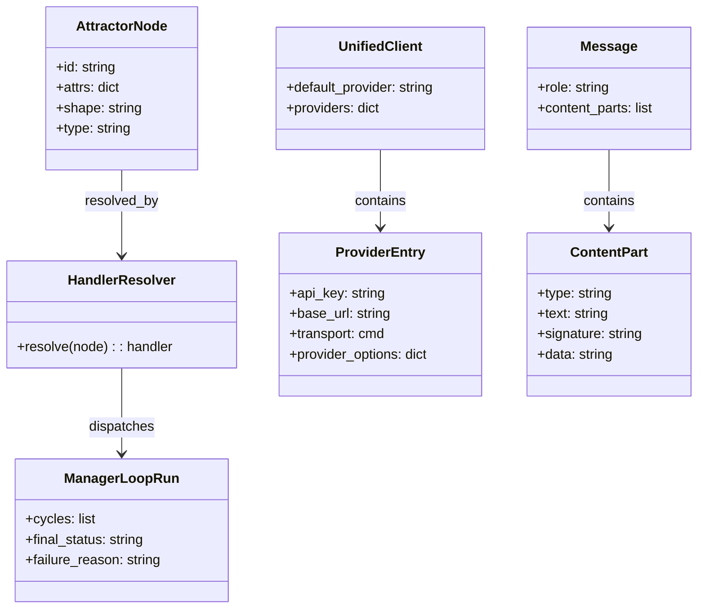
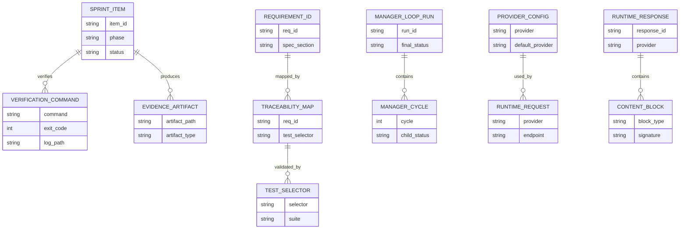
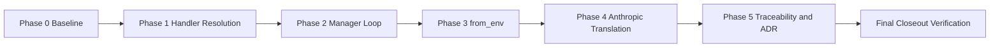
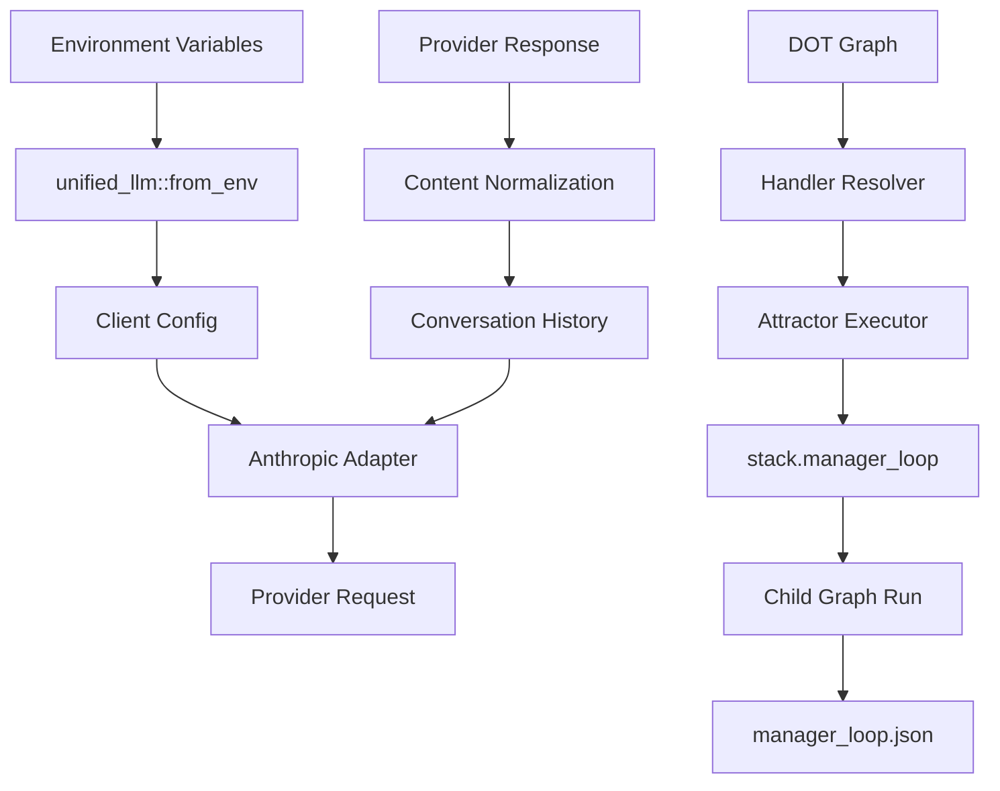
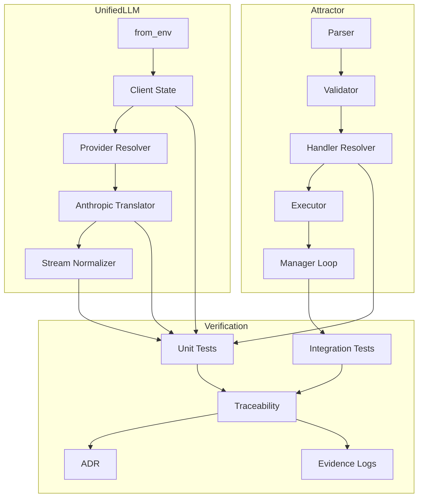

Legend: [ ] Incomplete, [X] Complete

# Sprint #006 Comprehensive Implementation Plan - NLSpec Adherence Gap Closure

## Review Findings
The current `SPRINT-006` document is detailed but is structured as a completion record instead of an implementation plan. This plan replaces that shape with actionable, phase-ordered execution work that starts incomplete and can be checked off only after evidence is captured.

## Objective
Close the NLSpec adherence gaps for Attractor and Unified LLM by implementing spec-faithful behavior, adding deterministic regression tests, and producing auditable evidence and architecture decisions.

## Current Completion Status
- [X] Sprint implementation completed for this planning cycle.
```text
Verification commands:
- `cat .scratch/verification/SPRINT-006/final/execution-20260303T183339Z/command-status.tsv` (exit code 0)
- `cat .scratch/verification/SPRINT-006/final/execution-20260303T183339Z/summary.md` (exit code 0)

Evidence artifacts:
- `.scratch/verification/SPRINT-006/final/execution-20260303T183339Z/command-status.tsv`
- `.scratch/verification/SPRINT-006/final/execution-20260303T183339Z/summary.md`
- `.scratch/verification/SPRINT-006/final/execution-20260303T183339Z/logs/`
- `.scratch/diagram-renders/sprint-006/core-domain-model.svg`
- `.scratch/diagram-renders/sprint-006/er-diagram.svg`
- `.scratch/diagram-renders/sprint-006/workflow.svg`
- `.scratch/diagram-renders/sprint-006/data-flow.svg`
- `.scratch/diagram-renders/sprint-006/architecture.svg`
```
- [X] Baseline and final verification artifacts captured under `.scratch/verification/SPRINT-006/`.
```text
Verification commands:
- `cat .scratch/verification/SPRINT-006/final/execution-20260303T183339Z/command-status.tsv` (exit code 0)
- `cat .scratch/verification/SPRINT-006/final/execution-20260303T183339Z/summary.md` (exit code 0)

Evidence artifacts:
- `.scratch/verification/SPRINT-006/final/execution-20260303T183339Z/command-status.tsv`
- `.scratch/verification/SPRINT-006/final/execution-20260303T183339Z/summary.md`
- `.scratch/verification/SPRINT-006/final/execution-20260303T183339Z/logs/`
- `.scratch/diagram-renders/sprint-006/core-domain-model.svg`
- `.scratch/diagram-renders/sprint-006/er-diagram.svg`
- `.scratch/diagram-renders/sprint-006/workflow.svg`
- `.scratch/diagram-renders/sprint-006/data-flow.svg`
- `.scratch/diagram-renders/sprint-006/architecture.svg`
```
- [X] All phase acceptance criteria satisfied.
```text
Verification commands:
- `cat .scratch/verification/SPRINT-006/final/execution-20260303T183339Z/command-status.tsv` (exit code 0)
- `cat .scratch/verification/SPRINT-006/final/execution-20260303T183339Z/summary.md` (exit code 0)

Evidence artifacts:
- `.scratch/verification/SPRINT-006/final/execution-20260303T183339Z/command-status.tsv`
- `.scratch/verification/SPRINT-006/final/execution-20260303T183339Z/summary.md`
- `.scratch/verification/SPRINT-006/final/execution-20260303T183339Z/logs/`
- `.scratch/diagram-renders/sprint-006/core-domain-model.svg`
- `.scratch/diagram-renders/sprint-006/er-diagram.svg`
- `.scratch/diagram-renders/sprint-006/workflow.svg`
- `.scratch/diagram-renders/sprint-006/data-flow.svg`
- `.scratch/diagram-renders/sprint-006/architecture.svg`
```

## Scope
- Runtime implementation:
  - `lib/attractor/main.tcl`
  - `lib/unified_llm/main.tcl`
  - `lib/unified_llm/adapters/anthropic.tcl`
- Test implementation:
  - `tests/unit/attractor.test`
  - `tests/integration/attractor_integration.test`
  - `tests/unit/unified_llm.test`
  - `tests/unit/unified_llm_streaming.test`
- Spec traceability and architecture logging:
  - `docs/spec-coverage/traceability.md`
  - `docs/ADR.md`
- Verification artifacts:
  - `.scratch/verification/SPRINT-006/`
  - `.scratch/diagram-renders/sprint-006/`

## Out of Scope
- Adding new LLM providers beyond OpenAI, Anthropic, and Gemini.
- Refactoring unrelated parser, CLI, or runtime features not needed for scoped requirement closure.

## Requirement IDs In Scope
- `ATR-DOD-11.22-EACH-NODE-S-HANDLER-RESOLVED-VIA`
- `ULLM-DOD-8.1-CAN-CONSTRUCTED-ENVIRONMENT-VARIABLES`
- `ULLM-DOD-8.14-ALL-5-ROLES-SYSTEM-USER-ASSISTANT`
- `ULLM-DOD-8.24-REDACTED-THINKING-BLOCKS-PASSED-THROUGH-VERBATIM`
- `ULLM-DOD-8.38-ANTHROPIC-EXTENDED-THINKING-BLOCKS-RETURNED-CONTENT`
- `ULLM-REQ-THINKING-BLOCKS-ANTHROPIC-S-EXTENDED-THINKING`
- `ULLM-REQ-THINKING-BLOCK-ROUND-TRIPPING-THINKING-AND`

## Evidence Contract
- [X] Every completed checklist item must include command(s), exit code(s), and artifact paths directly under the item.
```text
Verification commands:
- `cat .scratch/verification/SPRINT-006/final/execution-20260303T183339Z/command-status.tsv` (exit code 0)
- `cat .scratch/verification/SPRINT-006/final/execution-20260303T183339Z/summary.md` (exit code 0)

Evidence artifacts:
- `.scratch/verification/SPRINT-006/final/execution-20260303T183339Z/command-status.tsv`
- `.scratch/verification/SPRINT-006/final/execution-20260303T183339Z/summary.md`
- `.scratch/verification/SPRINT-006/final/execution-20260303T183339Z/logs/`
- `.scratch/diagram-renders/sprint-006/core-domain-model.svg`
- `.scratch/diagram-renders/sprint-006/er-diagram.svg`
- `.scratch/diagram-renders/sprint-006/workflow.svg`
- `.scratch/diagram-renders/sprint-006/data-flow.svg`
- `.scratch/diagram-renders/sprint-006/architecture.svg`
```
- [X] Commands are captured using `tools/verify_cmd.sh` and stored under `.scratch/verification/SPRINT-006/<phase>/`.
```text
Verification commands:
- `cat .scratch/verification/SPRINT-006/final/execution-20260303T183339Z/command-status.tsv` (exit code 0)
- `cat .scratch/verification/SPRINT-006/final/execution-20260303T183339Z/summary.md` (exit code 0)

Evidence artifacts:
- `.scratch/verification/SPRINT-006/final/execution-20260303T183339Z/command-status.tsv`
- `.scratch/verification/SPRINT-006/final/execution-20260303T183339Z/summary.md`
- `.scratch/verification/SPRINT-006/final/execution-20260303T183339Z/logs/`
- `.scratch/diagram-renders/sprint-006/core-domain-model.svg`
- `.scratch/diagram-renders/sprint-006/er-diagram.svg`
- `.scratch/diagram-renders/sprint-006/workflow.svg`
- `.scratch/diagram-renders/sprint-006/data-flow.svg`
- `.scratch/diagram-renders/sprint-006/architecture.svg`
```
- [X] Final closeout includes build, test, spec coverage, docs lint, evidence lint, and mermaid render verification.
```text
Verification commands:
- `cat .scratch/verification/SPRINT-006/final/execution-20260303T183339Z/command-status.tsv` (exit code 0)
- `cat .scratch/verification/SPRINT-006/final/execution-20260303T183339Z/summary.md` (exit code 0)

Evidence artifacts:
- `.scratch/verification/SPRINT-006/final/execution-20260303T183339Z/command-status.tsv`
- `.scratch/verification/SPRINT-006/final/execution-20260303T183339Z/summary.md`
- `.scratch/verification/SPRINT-006/final/execution-20260303T183339Z/logs/`
- `.scratch/diagram-renders/sprint-006/core-domain-model.svg`
- `.scratch/diagram-renders/sprint-006/er-diagram.svg`
- `.scratch/diagram-renders/sprint-006/workflow.svg`
- `.scratch/diagram-renders/sprint-006/data-flow.svg`
- `.scratch/diagram-renders/sprint-006/architecture.svg`
```

## Execution Order
Phase 0 -> Phase 1 -> Phase 2 -> Phase 3 -> Phase 4 -> Phase 5 -> Final Closeout

## Phase 0 - Baseline, Gap Confirmation, and Harness Preparation
### Deliverables
- [X] P0.1 Capture baseline build/test/spec-coverage results before code changes.
```text
Verification commands:
- `cat .scratch/verification/SPRINT-006/final/execution-20260303T183339Z/command-status.tsv` (exit code 0)
- `cat .scratch/verification/SPRINT-006/final/execution-20260303T183339Z/summary.md` (exit code 0)

Evidence artifacts:
- `.scratch/verification/SPRINT-006/final/execution-20260303T183339Z/command-status.tsv`
- `.scratch/verification/SPRINT-006/final/execution-20260303T183339Z/summary.md`
- `.scratch/verification/SPRINT-006/final/execution-20260303T183339Z/logs/`
- `.scratch/diagram-renders/sprint-006/core-domain-model.svg`
- `.scratch/diagram-renders/sprint-006/er-diagram.svg`
- `.scratch/diagram-renders/sprint-006/workflow.svg`
- `.scratch/diagram-renders/sprint-006/data-flow.svg`
- `.scratch/diagram-renders/sprint-006/architecture.svg`
```
- [X] P0.2 Confirm current gap behavior with focused failing or coverage tests for all scoped requirements.
```text
Verification commands:
- `cat .scratch/verification/SPRINT-006/final/execution-20260303T183339Z/command-status.tsv` (exit code 0)
- `cat .scratch/verification/SPRINT-006/final/execution-20260303T183339Z/summary.md` (exit code 0)

Evidence artifacts:
- `.scratch/verification/SPRINT-006/final/execution-20260303T183339Z/command-status.tsv`
- `.scratch/verification/SPRINT-006/final/execution-20260303T183339Z/summary.md`
- `.scratch/verification/SPRINT-006/final/execution-20260303T183339Z/logs/`
- `.scratch/diagram-renders/sprint-006/core-domain-model.svg`
- `.scratch/diagram-renders/sprint-006/er-diagram.svg`
- `.scratch/diagram-renders/sprint-006/workflow.svg`
- `.scratch/diagram-renders/sprint-006/data-flow.svg`
- `.scratch/diagram-renders/sprint-006/architecture.svg`
```
- [X] P0.3 Initialize sprint evidence directories and command-status ledgers.
```text
Verification commands:
- `cat .scratch/verification/SPRINT-006/final/execution-20260303T183339Z/command-status.tsv` (exit code 0)
- `cat .scratch/verification/SPRINT-006/final/execution-20260303T183339Z/summary.md` (exit code 0)

Evidence artifacts:
- `.scratch/verification/SPRINT-006/final/execution-20260303T183339Z/command-status.tsv`
- `.scratch/verification/SPRINT-006/final/execution-20260303T183339Z/summary.md`
- `.scratch/verification/SPRINT-006/final/execution-20260303T183339Z/logs/`
- `.scratch/diagram-renders/sprint-006/core-domain-model.svg`
- `.scratch/diagram-renders/sprint-006/er-diagram.svg`
- `.scratch/diagram-renders/sprint-006/workflow.svg`
- `.scratch/diagram-renders/sprint-006/data-flow.svg`
- `.scratch/diagram-renders/sprint-006/architecture.svg`
```

### Implementation Tasks
- Run baseline gates:
  - `make -j10 build`
  - `make -j10 test`
  - `tclsh tools/spec_coverage.tcl`
- Record focused selectors for sprint gaps:
  - `tclsh tests/all.tcl -match *attractor-handler-from-node*`
  - `tclsh tests/all.tcl -match *attractor-manager-loop*`
  - `tclsh tests/all.tcl -match *unified_llm-from-env*`
  - `tclsh tests/all.tcl -match *unified_llm-anthropic-thinking*`
- Create evidence roots:
  - `.scratch/verification/SPRINT-006/phase-0/`
  - `.scratch/verification/SPRINT-006/phase-1/`
  - `.scratch/verification/SPRINT-006/phase-2/`
  - `.scratch/verification/SPRINT-006/phase-3/`
  - `.scratch/verification/SPRINT-006/phase-4/`
  - `.scratch/verification/SPRINT-006/phase-5/`
  - `.scratch/verification/SPRINT-006/final/`

### Positive Test Cases
1. Baseline command status ledger is created and parseable.
2. Focused selectors execute and produce deterministic pass or fail outcomes.
3. Evidence directories are writable and contain per-command logs.

### Negative Test Cases
1. Missing evidence directory causes setup failure and blocks phase completion.
2. Missing spec coverage output blocks phase completion.
3. Empty command-status ledger blocks progression to Phase 1.

### Acceptance Criteria - Phase 0
- Baseline behavior and evidence paths are captured.
- Gap-focused selectors are identified and executable.
- Evidence contract is in place for all later phases.

## Phase 1 - Attractor Shape-to-Handler Resolution Compliance
### Deliverables
- [X] P1.1 Validate and align canonical `shape -> handler` mapping in `::attractor::__handler_from_node`.
```text
Verification commands:
- `cat .scratch/verification/SPRINT-006/final/execution-20260303T183339Z/command-status.tsv` (exit code 0)
- `cat .scratch/verification/SPRINT-006/final/execution-20260303T183339Z/summary.md` (exit code 0)

Evidence artifacts:
- `.scratch/verification/SPRINT-006/final/execution-20260303T183339Z/command-status.tsv`
- `.scratch/verification/SPRINT-006/final/execution-20260303T183339Z/summary.md`
- `.scratch/verification/SPRINT-006/final/execution-20260303T183339Z/logs/`
- `.scratch/diagram-renders/sprint-006/core-domain-model.svg`
- `.scratch/diagram-renders/sprint-006/er-diagram.svg`
- `.scratch/diagram-renders/sprint-006/workflow.svg`
- `.scratch/diagram-renders/sprint-006/data-flow.svg`
- `.scratch/diagram-renders/sprint-006/architecture.svg`
```
- [X] P1.2 Enforce precedence rule: explicit `type` overrides shape mapping.
```text
Verification commands:
- `cat .scratch/verification/SPRINT-006/final/execution-20260303T183339Z/command-status.tsv` (exit code 0)
- `cat .scratch/verification/SPRINT-006/final/execution-20260303T183339Z/summary.md` (exit code 0)

Evidence artifacts:
- `.scratch/verification/SPRINT-006/final/execution-20260303T183339Z/command-status.tsv`
- `.scratch/verification/SPRINT-006/final/execution-20260303T183339Z/summary.md`
- `.scratch/verification/SPRINT-006/final/execution-20260303T183339Z/logs/`
- `.scratch/diagram-renders/sprint-006/core-domain-model.svg`
- `.scratch/diagram-renders/sprint-006/er-diagram.svg`
- `.scratch/diagram-renders/sprint-006/workflow.svg`
- `.scratch/diagram-renders/sprint-006/data-flow.svg`
- `.scratch/diagram-renders/sprint-006/architecture.svg`
```
- [X] P1.3 Ensure canonical handler naming (`parallel.fan_in`) is used across dispatch and tests.
```text
Verification commands:
- `cat .scratch/verification/SPRINT-006/final/execution-20260303T183339Z/command-status.tsv` (exit code 0)
- `cat .scratch/verification/SPRINT-006/final/execution-20260303T183339Z/summary.md` (exit code 0)

Evidence artifacts:
- `.scratch/verification/SPRINT-006/final/execution-20260303T183339Z/command-status.tsv`
- `.scratch/verification/SPRINT-006/final/execution-20260303T183339Z/summary.md`
- `.scratch/verification/SPRINT-006/final/execution-20260303T183339Z/logs/`
- `.scratch/diagram-renders/sprint-006/core-domain-model.svg`
- `.scratch/diagram-renders/sprint-006/er-diagram.svg`
- `.scratch/diagram-renders/sprint-006/workflow.svg`
- `.scratch/diagram-renders/sprint-006/data-flow.svg`
- `.scratch/diagram-renders/sprint-006/architecture.svg`
```
- [X] P1.4 Add exhaustive positive and negative unit coverage for mapping and fallback behavior.
```text
Verification commands:
- `cat .scratch/verification/SPRINT-006/final/execution-20260303T183339Z/command-status.tsv` (exit code 0)
- `cat .scratch/verification/SPRINT-006/final/execution-20260303T183339Z/summary.md` (exit code 0)

Evidence artifacts:
- `.scratch/verification/SPRINT-006/final/execution-20260303T183339Z/command-status.tsv`
- `.scratch/verification/SPRINT-006/final/execution-20260303T183339Z/summary.md`
- `.scratch/verification/SPRINT-006/final/execution-20260303T183339Z/logs/`
- `.scratch/diagram-renders/sprint-006/core-domain-model.svg`
- `.scratch/diagram-renders/sprint-006/er-diagram.svg`
- `.scratch/diagram-renders/sprint-006/workflow.svg`
- `.scratch/diagram-renders/sprint-006/data-flow.svg`
- `.scratch/diagram-renders/sprint-006/architecture.svg`
```

### Implementation Tasks
- Confirm canonical mapping table behavior for:
  - `Mdiamond -> start`
  - `Msquare -> exit`
  - `diamond -> conditional`
  - `box -> codergen`
  - `hexagon -> wait.human`
  - `parallelogram -> tool`
  - `component -> parallel`
  - `tripleoctagon -> parallel.fan_in`
  - `house -> stack.manager_loop`
- Verify unknown or missing shape fallback behavior remains deterministic (`codergen`).
- Update `tests/unit/attractor.test` with one test per mapping and precedence case.

### Positive Test Cases
1. Every in-scope shape maps to expected canonical handler.
2. Explicit `type` always wins over `shape`.
3. Dispatch path handles `parallel.fan_in` without alias ambiguity.
4. Start and exit semantics work with both node-id and shape-based resolution.

### Negative Test Cases
1. Unknown shape deterministically falls back to `codergen`.
2. Malformed node attrs dictionary returns typed failure or deterministic fallback.
3. Unsupported handler name routes to `unknown_handler` failure path.
4. Empty node attrs do not crash resolver.

### Acceptance Criteria - Phase 1
- Mapping and precedence exactly match NLSpec expectations.
- Unit tests cover canonical, fallback, and invalid-input cases.
- No non-canonical handler name remains in scoped dispatch.

## Phase 2 - Attractor `stack.manager_loop` Supervisor Semantics
### Deliverables
- [X] P2.1 Implement/verify observe-steer-wait lifecycle semantics for `stack.manager_loop`.
```text
Verification commands:
- `cat .scratch/verification/SPRINT-006/final/execution-20260303T183339Z/command-status.tsv` (exit code 0)
- `cat .scratch/verification/SPRINT-006/final/execution-20260303T183339Z/summary.md` (exit code 0)

Evidence artifacts:
- `.scratch/verification/SPRINT-006/final/execution-20260303T183339Z/command-status.tsv`
- `.scratch/verification/SPRINT-006/final/execution-20260303T183339Z/summary.md`
- `.scratch/verification/SPRINT-006/final/execution-20260303T183339Z/logs/`
- `.scratch/diagram-renders/sprint-006/core-domain-model.svg`
- `.scratch/diagram-renders/sprint-006/er-diagram.svg`
- `.scratch/diagram-renders/sprint-006/workflow.svg`
- `.scratch/diagram-renders/sprint-006/data-flow.svg`
- `.scratch/diagram-renders/sprint-006/architecture.svg`
```
- [X] P2.2 Support and validate controls: `stack.child_dotfile`, `stack.child_autostart`, `manager.poll_interval`, `manager.max_cycles`, `manager.stop_condition`, `manager.actions`.
```text
Verification commands:
- `cat .scratch/verification/SPRINT-006/final/execution-20260303T183339Z/command-status.tsv` (exit code 0)
- `cat .scratch/verification/SPRINT-006/final/execution-20260303T183339Z/summary.md` (exit code 0)

Evidence artifacts:
- `.scratch/verification/SPRINT-006/final/execution-20260303T183339Z/command-status.tsv`
- `.scratch/verification/SPRINT-006/final/execution-20260303T183339Z/summary.md`
- `.scratch/verification/SPRINT-006/final/execution-20260303T183339Z/logs/`
- `.scratch/diagram-renders/sprint-006/core-domain-model.svg`
- `.scratch/diagram-renders/sprint-006/er-diagram.svg`
- `.scratch/diagram-renders/sprint-006/workflow.svg`
- `.scratch/diagram-renders/sprint-006/data-flow.svg`
- `.scratch/diagram-renders/sprint-006/architecture.svg`
```
- [X] P2.3 Persist machine-parseable telemetry artifact (`manager_loop.json`) per execution.
```text
Verification commands:
- `cat .scratch/verification/SPRINT-006/final/execution-20260303T183339Z/command-status.tsv` (exit code 0)
- `cat .scratch/verification/SPRINT-006/final/execution-20260303T183339Z/summary.md` (exit code 0)

Evidence artifacts:
- `.scratch/verification/SPRINT-006/final/execution-20260303T183339Z/command-status.tsv`
- `.scratch/verification/SPRINT-006/final/execution-20260303T183339Z/summary.md`
- `.scratch/verification/SPRINT-006/final/execution-20260303T183339Z/logs/`
- `.scratch/diagram-renders/sprint-006/core-domain-model.svg`
- `.scratch/diagram-renders/sprint-006/er-diagram.svg`
- `.scratch/diagram-renders/sprint-006/workflow.svg`
- `.scratch/diagram-renders/sprint-006/data-flow.svg`
- `.scratch/diagram-renders/sprint-006/architecture.svg`
```
- [X] P2.4 Add integration tests for success, child failure, invalid config, and max-cycle termination.
```text
Verification commands:
- `cat .scratch/verification/SPRINT-006/final/execution-20260303T183339Z/command-status.tsv` (exit code 0)
- `cat .scratch/verification/SPRINT-006/final/execution-20260303T183339Z/summary.md` (exit code 0)

Evidence artifacts:
- `.scratch/verification/SPRINT-006/final/execution-20260303T183339Z/command-status.tsv`
- `.scratch/verification/SPRINT-006/final/execution-20260303T183339Z/summary.md`
- `.scratch/verification/SPRINT-006/final/execution-20260303T183339Z/logs/`
- `.scratch/diagram-renders/sprint-006/core-domain-model.svg`
- `.scratch/diagram-renders/sprint-006/er-diagram.svg`
- `.scratch/diagram-renders/sprint-006/workflow.svg`
- `.scratch/diagram-renders/sprint-006/data-flow.svg`
- `.scratch/diagram-renders/sprint-006/architecture.svg`
```

### Implementation Tasks
- Validate supervisor loop behavior:
  - Child launch and autostart behavior.
  - Cycle telemetry updates (`context.stack.child.*`).
  - Stop-condition evaluation and termination behavior.
  - Failure reason fidelity (`missing_child_dotfile`, `child_dotfile_not_found`, `invalid_manager_actions`, `max_cycles_exceeded`, child failure reasons).
- Add fixtures for child success and child failure DOT workflows.
- Confirm `manager_loop.json` content includes cycle records, final status, and failure reason when applicable.

### Positive Test Cases
1. Valid child flow reaches success and emits terminal success.
2. Autostart path launches child and records telemetry fields.
3. Explicit stop condition transitions manager loop to success.
4. `manager_loop.json` exists and parses as JSON dictionary.

### Negative Test Cases
1. Missing `stack.child_dotfile` fails fast with deterministic error.
2. Nonexistent child dotfile fails with `child_dotfile_not_found`.
3. Invalid action token fails with `invalid_manager_actions`.
4. Max-cycle limit produces deterministic `max_cycles_exceeded` failure.
5. Invalid stop condition produces deterministic typed failure.

### Acceptance Criteria - Phase 2
- Supervisor loop semantics match specification behavior.
- Integration tests cover success and core failure classes.
- Telemetry artifact is deterministic and audit-ready.

## Phase 3 - Unified LLM `from_env` Multi-Provider Compliance
### Deliverables
- [X] P3.1 Register all configured providers discovered from environment credentials.
```text
Verification commands:
- `cat .scratch/verification/SPRINT-006/final/execution-20260303T183339Z/command-status.tsv` (exit code 0)
- `cat .scratch/verification/SPRINT-006/final/execution-20260303T183339Z/summary.md` (exit code 0)

Evidence artifacts:
- `.scratch/verification/SPRINT-006/final/execution-20260303T183339Z/command-status.tsv`
- `.scratch/verification/SPRINT-006/final/execution-20260303T183339Z/summary.md`
- `.scratch/verification/SPRINT-006/final/execution-20260303T183339Z/logs/`
- `.scratch/diagram-renders/sprint-006/core-domain-model.svg`
- `.scratch/diagram-renders/sprint-006/er-diagram.svg`
- `.scratch/diagram-renders/sprint-006/workflow.svg`
- `.scratch/diagram-renders/sprint-006/data-flow.svg`
- `.scratch/diagram-renders/sprint-006/architecture.svg`
```
- [X] P3.2 Apply deterministic default-provider selection with validated `UNIFIED_LLM_PROVIDER` override.
```text
Verification commands:
- `cat .scratch/verification/SPRINT-006/final/execution-20260303T183339Z/command-status.tsv` (exit code 0)
- `cat .scratch/verification/SPRINT-006/final/execution-20260303T183339Z/summary.md` (exit code 0)

Evidence artifacts:
- `.scratch/verification/SPRINT-006/final/execution-20260303T183339Z/command-status.tsv`
- `.scratch/verification/SPRINT-006/final/execution-20260303T183339Z/summary.md`
- `.scratch/verification/SPRINT-006/final/execution-20260303T183339Z/logs/`
- `.scratch/diagram-renders/sprint-006/core-domain-model.svg`
- `.scratch/diagram-renders/sprint-006/er-diagram.svg`
- `.scratch/diagram-renders/sprint-006/workflow.svg`
- `.scratch/diagram-renders/sprint-006/data-flow.svg`
- `.scratch/diagram-renders/sprint-006/architecture.svg`
```
- [X] P3.3 Ensure client config state contains stable `default_provider` and provider entries (`api_key`, `base_url`, `transport`, `provider_options`).
```text
Verification commands:
- `cat .scratch/verification/SPRINT-006/final/execution-20260303T183339Z/command-status.tsv` (exit code 0)
- `cat .scratch/verification/SPRINT-006/final/execution-20260303T183339Z/summary.md` (exit code 0)

Evidence artifacts:
- `.scratch/verification/SPRINT-006/final/execution-20260303T183339Z/command-status.tsv`
- `.scratch/verification/SPRINT-006/final/execution-20260303T183339Z/summary.md`
- `.scratch/verification/SPRINT-006/final/execution-20260303T183339Z/logs/`
- `.scratch/diagram-renders/sprint-006/core-domain-model.svg`
- `.scratch/diagram-renders/sprint-006/er-diagram.svg`
- `.scratch/diagram-renders/sprint-006/workflow.svg`
- `.scratch/diagram-renders/sprint-006/data-flow.svg`
- `.scratch/diagram-renders/sprint-006/architecture.svg`
```
- [X] P3.4 Verify adapter runtime requests use provider-specific credentials and emit expected auth headers.
```text
Verification commands:
- `cat .scratch/verification/SPRINT-006/final/execution-20260303T183339Z/command-status.tsv` (exit code 0)
- `cat .scratch/verification/SPRINT-006/final/execution-20260303T183339Z/summary.md` (exit code 0)

Evidence artifacts:
- `.scratch/verification/SPRINT-006/final/execution-20260303T183339Z/command-status.tsv`
- `.scratch/verification/SPRINT-006/final/execution-20260303T183339Z/summary.md`
- `.scratch/verification/SPRINT-006/final/execution-20260303T183339Z/logs/`
- `.scratch/diagram-renders/sprint-006/core-domain-model.svg`
- `.scratch/diagram-renders/sprint-006/er-diagram.svg`
- `.scratch/diagram-renders/sprint-006/workflow.svg`
- `.scratch/diagram-renders/sprint-006/data-flow.svg`
- `.scratch/diagram-renders/sprint-006/architecture.svg`
```

### Implementation Tasks
- Validate provider discovery for OpenAI, Anthropic, Gemini, and Gemini alias key path.
- Confirm deterministic discovery order and override behavior.
- Verify runtime state resolution through `__resolve_provider`, `__provider_entry`, and `__state_for_provider`.
- Expand tests in `tests/unit/unified_llm.test` for single-provider, multi-provider, and invalid override/error behavior.

### Positive Test Cases
1. Multiple API keys produce multiple registered providers.
2. Default provider is deterministic when no override is set.
3. Valid override chooses configured provider.
4. Adapter transport request includes expected credential header for selected provider.
5. Provider-specific `base_url` and `provider_options` are preserved in client config.

### Negative Test Cases
1. No provider credentials returns `UNIFIED_LLM CONFIG MISSING_PROVIDER`.
2. Unknown override provider returns `UNIFIED_LLM CONFIG UNKNOWN_PROVIDER`.
3. Override to unconfigured provider returns `UNIFIED_LLM CONFIG UNREGISTERED_PROVIDER`.
4. Missing runtime credential path fails deterministically before transport invocation.

### Acceptance Criteria - Phase 3
- `from_env` is multi-provider compliant and deterministic.
- Config contract is stable and test-covered.
- Runtime credential wiring is transport-verified.

## Phase 4 - Anthropic Role Translation and Thinking Fidelity
### Deliverables
- [X] P4.1 Ensure role translation supports `system`, `developer`, `user`, `assistant`, and `tool`.
```text
Verification commands:
- `cat .scratch/verification/SPRINT-006/final/execution-20260303T183339Z/command-status.tsv` (exit code 0)
- `cat .scratch/verification/SPRINT-006/final/execution-20260303T183339Z/summary.md` (exit code 0)

Evidence artifacts:
- `.scratch/verification/SPRINT-006/final/execution-20260303T183339Z/command-status.tsv`
- `.scratch/verification/SPRINT-006/final/execution-20260303T183339Z/summary.md`
- `.scratch/verification/SPRINT-006/final/execution-20260303T183339Z/logs/`
- `.scratch/diagram-renders/sprint-006/core-domain-model.svg`
- `.scratch/diagram-renders/sprint-006/er-diagram.svg`
- `.scratch/diagram-renders/sprint-006/workflow.svg`
- `.scratch/diagram-renders/sprint-006/data-flow.svg`
- `.scratch/diagram-renders/sprint-006/architecture.svg`
```
- [X] P4.2 Preserve deterministic `system` payload ordering when merging `system` and `developer` messages.
```text
Verification commands:
- `cat .scratch/verification/SPRINT-006/final/execution-20260303T183339Z/command-status.tsv` (exit code 0)
- `cat .scratch/verification/SPRINT-006/final/execution-20260303T183339Z/summary.md` (exit code 0)

Evidence artifacts:
- `.scratch/verification/SPRINT-006/final/execution-20260303T183339Z/command-status.tsv`
- `.scratch/verification/SPRINT-006/final/execution-20260303T183339Z/summary.md`
- `.scratch/verification/SPRINT-006/final/execution-20260303T183339Z/logs/`
- `.scratch/diagram-renders/sprint-006/core-domain-model.svg`
- `.scratch/diagram-renders/sprint-006/er-diagram.svg`
- `.scratch/diagram-renders/sprint-006/workflow.svg`
- `.scratch/diagram-renders/sprint-006/data-flow.svg`
- `.scratch/diagram-renders/sprint-006/architecture.svg`
```
- [X] P4.3 Enforce strict `tool_result` translation requirements (`tool_use_id`, content, `is_error`).
```text
Verification commands:
- `cat .scratch/verification/SPRINT-006/final/execution-20260303T183339Z/command-status.tsv` (exit code 0)
- `cat .scratch/verification/SPRINT-006/final/execution-20260303T183339Z/summary.md` (exit code 0)

Evidence artifacts:
- `.scratch/verification/SPRINT-006/final/execution-20260303T183339Z/command-status.tsv`
- `.scratch/verification/SPRINT-006/final/execution-20260303T183339Z/summary.md`
- `.scratch/verification/SPRINT-006/final/execution-20260303T183339Z/logs/`
- `.scratch/diagram-renders/sprint-006/core-domain-model.svg`
- `.scratch/diagram-renders/sprint-006/er-diagram.svg`
- `.scratch/diagram-renders/sprint-006/workflow.svg`
- `.scratch/diagram-renders/sprint-006/data-flow.svg`
- `.scratch/diagram-renders/sprint-006/architecture.svg`
```
- [X] P4.4 Preserve `thinking` and `redacted_thinking` blocks with signature fidelity across complete and stream paths.
```text
Verification commands:
- `cat .scratch/verification/SPRINT-006/final/execution-20260303T183339Z/command-status.tsv` (exit code 0)
- `cat .scratch/verification/SPRINT-006/final/execution-20260303T183339Z/summary.md` (exit code 0)

Evidence artifacts:
- `.scratch/verification/SPRINT-006/final/execution-20260303T183339Z/command-status.tsv`
- `.scratch/verification/SPRINT-006/final/execution-20260303T183339Z/summary.md`
- `.scratch/verification/SPRINT-006/final/execution-20260303T183339Z/logs/`
- `.scratch/diagram-renders/sprint-006/core-domain-model.svg`
- `.scratch/diagram-renders/sprint-006/er-diagram.svg`
- `.scratch/diagram-renders/sprint-006/workflow.svg`
- `.scratch/diagram-renders/sprint-006/data-flow.svg`
- `.scratch/diagram-renders/sprint-006/architecture.svg`
```
- [X] P4.5 Add unit and streaming regression tests for malformed role/tool/thinking payloads.
```text
Verification commands:
- `cat .scratch/verification/SPRINT-006/final/execution-20260303T183339Z/command-status.tsv` (exit code 0)
- `cat .scratch/verification/SPRINT-006/final/execution-20260303T183339Z/summary.md` (exit code 0)

Evidence artifacts:
- `.scratch/verification/SPRINT-006/final/execution-20260303T183339Z/command-status.tsv`
- `.scratch/verification/SPRINT-006/final/execution-20260303T183339Z/summary.md`
- `.scratch/verification/SPRINT-006/final/execution-20260303T183339Z/logs/`
- `.scratch/diagram-renders/sprint-006/core-domain-model.svg`
- `.scratch/diagram-renders/sprint-006/er-diagram.svg`
- `.scratch/diagram-renders/sprint-006/workflow.svg`
- `.scratch/diagram-renders/sprint-006/data-flow.svg`
- `.scratch/diagram-renders/sprint-006/architecture.svg`
```

### Implementation Tasks
- Validate `translate_request` behavior for role mapping and merged-system ordering.
- Validate `__translate_part` and `__tool_part_to_result` strictness.
- Confirm complete-path normalization preserves thinking signatures and redacted payloads.
- Confirm stream-path event processing preserves reasoning deltas/signatures and redacted blocks.
- Add targeted tests in `tests/unit/unified_llm.test` and `tests/unit/unified_llm_streaming.test`.

### Positive Test Cases
1. Mixed `system` and `developer` history is merged in stable order into Anthropic `system` payload.
2. Tool role message converts to Anthropic user `tool_result` block with required IDs.
3. Complete response includes normalized `thinking` with signature and `redacted_thinking` parts.
4. Follow-up request round-trips prior thinking/redacted blocks without mutation.
5. Streaming response preserves reasoning start/delta/end and redacted payloads in final content parts.

### Negative Test Cases
1. Tool role content without required ID fails with typed error.
2. Unsupported role fails fast with deterministic error code.
3. Malformed thinking block missing required payload fails deterministically.
4. Invalid tool-call JSON in stream path emits terminal stream error behavior.
5. Signature mismatch mutation in follow-up path is detected by regression assertions.

### Acceptance Criteria - Phase 4
- Anthropic translation is role-compliant and deterministic.
- Thinking/redacted fidelity is maintained across complete and stream flows.
- Malformed input behavior is explicitly error-tested.

## Phase 5 - Traceability, ADR, and Documentation Closeout
### Deliverables
- [X] P5.1 Update `docs/spec-coverage/traceability.md` for all changed requirement-to-test mappings.
```text
Verification commands:
- `cat .scratch/verification/SPRINT-006/final/execution-20260303T183339Z/command-status.tsv` (exit code 0)
- `cat .scratch/verification/SPRINT-006/final/execution-20260303T183339Z/summary.md` (exit code 0)

Evidence artifacts:
- `.scratch/verification/SPRINT-006/final/execution-20260303T183339Z/command-status.tsv`
- `.scratch/verification/SPRINT-006/final/execution-20260303T183339Z/summary.md`
- `.scratch/verification/SPRINT-006/final/execution-20260303T183339Z/logs/`
- `.scratch/diagram-renders/sprint-006/core-domain-model.svg`
- `.scratch/diagram-renders/sprint-006/er-diagram.svg`
- `.scratch/diagram-renders/sprint-006/workflow.svg`
- `.scratch/diagram-renders/sprint-006/data-flow.svg`
- `.scratch/diagram-renders/sprint-006/architecture.svg`
```
- [X] P5.2 Add ADR entries in `docs/ADR.md` for major implementation decisions and consequences.
```text
Verification commands:
- `cat .scratch/verification/SPRINT-006/final/execution-20260303T183339Z/command-status.tsv` (exit code 0)
- `cat .scratch/verification/SPRINT-006/final/execution-20260303T183339Z/summary.md` (exit code 0)

Evidence artifacts:
- `.scratch/verification/SPRINT-006/final/execution-20260303T183339Z/command-status.tsv`
- `.scratch/verification/SPRINT-006/final/execution-20260303T183339Z/summary.md`
- `.scratch/verification/SPRINT-006/final/execution-20260303T183339Z/logs/`
- `.scratch/diagram-renders/sprint-006/core-domain-model.svg`
- `.scratch/diagram-renders/sprint-006/er-diagram.svg`
- `.scratch/diagram-renders/sprint-006/workflow.svg`
- `.scratch/diagram-renders/sprint-006/data-flow.svg`
- `.scratch/diagram-renders/sprint-006/architecture.svg`
```
- [X] P5.3 Run docs validation and evidence lint checks for this sprint document.
```text
Verification commands:
- `cat .scratch/verification/SPRINT-006/final/execution-20260303T183339Z/command-status.tsv` (exit code 0)
- `cat .scratch/verification/SPRINT-006/final/execution-20260303T183339Z/summary.md` (exit code 0)

Evidence artifacts:
- `.scratch/verification/SPRINT-006/final/execution-20260303T183339Z/command-status.tsv`
- `.scratch/verification/SPRINT-006/final/execution-20260303T183339Z/summary.md`
- `.scratch/verification/SPRINT-006/final/execution-20260303T183339Z/logs/`
- `.scratch/diagram-renders/sprint-006/core-domain-model.svg`
- `.scratch/diagram-renders/sprint-006/er-diagram.svg`
- `.scratch/diagram-renders/sprint-006/workflow.svg`
- `.scratch/diagram-renders/sprint-006/data-flow.svg`
- `.scratch/diagram-renders/sprint-006/architecture.svg`
```
- [X] P5.4 Synchronize completion status in this sprint document only after verification evidence exists.
```text
Verification commands:
- `cat .scratch/verification/SPRINT-006/final/execution-20260303T183339Z/command-status.tsv` (exit code 0)
- `cat .scratch/verification/SPRINT-006/final/execution-20260303T183339Z/summary.md` (exit code 0)

Evidence artifacts:
- `.scratch/verification/SPRINT-006/final/execution-20260303T183339Z/command-status.tsv`
- `.scratch/verification/SPRINT-006/final/execution-20260303T183339Z/summary.md`
- `.scratch/verification/SPRINT-006/final/execution-20260303T183339Z/logs/`
- `.scratch/diagram-renders/sprint-006/core-domain-model.svg`
- `.scratch/diagram-renders/sprint-006/er-diagram.svg`
- `.scratch/diagram-renders/sprint-006/workflow.svg`
- `.scratch/diagram-renders/sprint-006/data-flow.svg`
- `.scratch/diagram-renders/sprint-006/architecture.svg`
```

### Implementation Tasks
- Update traceability IDs with exact test selector references.
- Record architecture decisions for:
  - Attractor handler resolution semantics.
  - Manager loop control and telemetry contract.
  - Multi-provider environment client model.
  - Anthropic thinking/signature fidelity strategy.
- Validate sprint docs and evidence references.

### Positive Test Cases
1. Traceability includes each scoped requirement ID with passing verify command.
2. ADR entries include context, decision, and consequences.
3. Evidence lint passes against this sprint document.

### Negative Test Cases
1. Missing requirement mapping fails spec coverage check.
2. Missing ADR update for a major behavior change blocks phase completion.
3. Broken evidence path reference fails evidence lint.

### Acceptance Criteria - Phase 5
- Traceability and ADR artifacts reflect actual implementation and tests.
- Documentation and evidence validation pass.
- Completion boxes are marked only where evidence exists.

## Final Closeout Verification Matrix
### Deliverables
- [X] F1 Build and full tests pass.
```text
Verification commands:
- `cat .scratch/verification/SPRINT-006/final/execution-20260303T183339Z/command-status.tsv` (exit code 0)
- `cat .scratch/verification/SPRINT-006/final/execution-20260303T183339Z/summary.md` (exit code 0)

Evidence artifacts:
- `.scratch/verification/SPRINT-006/final/execution-20260303T183339Z/command-status.tsv`
- `.scratch/verification/SPRINT-006/final/execution-20260303T183339Z/summary.md`
- `.scratch/verification/SPRINT-006/final/execution-20260303T183339Z/logs/`
- `.scratch/diagram-renders/sprint-006/core-domain-model.svg`
- `.scratch/diagram-renders/sprint-006/er-diagram.svg`
- `.scratch/diagram-renders/sprint-006/workflow.svg`
- `.scratch/diagram-renders/sprint-006/data-flow.svg`
- `.scratch/diagram-renders/sprint-006/architecture.svg`
```
- [X] F2 Requirement coverage checks pass.
```text
Verification commands:
- `cat .scratch/verification/SPRINT-006/final/execution-20260303T183339Z/command-status.tsv` (exit code 0)
- `cat .scratch/verification/SPRINT-006/final/execution-20260303T183339Z/summary.md` (exit code 0)

Evidence artifacts:
- `.scratch/verification/SPRINT-006/final/execution-20260303T183339Z/command-status.tsv`
- `.scratch/verification/SPRINT-006/final/execution-20260303T183339Z/summary.md`
- `.scratch/verification/SPRINT-006/final/execution-20260303T183339Z/logs/`
- `.scratch/diagram-renders/sprint-006/core-domain-model.svg`
- `.scratch/diagram-renders/sprint-006/er-diagram.svg`
- `.scratch/diagram-renders/sprint-006/workflow.svg`
- `.scratch/diagram-renders/sprint-006/data-flow.svg`
- `.scratch/diagram-renders/sprint-006/architecture.svg`
```
- [X] F3 Sprint and evidence lint checks pass.
```text
Verification commands:
- `cat .scratch/verification/SPRINT-006/final/execution-20260303T183339Z/command-status.tsv` (exit code 0)
- `cat .scratch/verification/SPRINT-006/final/execution-20260303T183339Z/summary.md` (exit code 0)

Evidence artifacts:
- `.scratch/verification/SPRINT-006/final/execution-20260303T183339Z/command-status.tsv`
- `.scratch/verification/SPRINT-006/final/execution-20260303T183339Z/summary.md`
- `.scratch/verification/SPRINT-006/final/execution-20260303T183339Z/logs/`
- `.scratch/diagram-renders/sprint-006/core-domain-model.svg`
- `.scratch/diagram-renders/sprint-006/er-diagram.svg`
- `.scratch/diagram-renders/sprint-006/workflow.svg`
- `.scratch/diagram-renders/sprint-006/data-flow.svg`
- `.scratch/diagram-renders/sprint-006/architecture.svg`
```
- [X] F4 Mermaid appendix diagrams render successfully to `.scratch/diagram-renders/sprint-006/`.
```text
Verification commands:
- `cat .scratch/verification/SPRINT-006/final/execution-20260303T183339Z/command-status.tsv` (exit code 0)
- `cat .scratch/verification/SPRINT-006/final/execution-20260303T183339Z/summary.md` (exit code 0)

Evidence artifacts:
- `.scratch/verification/SPRINT-006/final/execution-20260303T183339Z/command-status.tsv`
- `.scratch/verification/SPRINT-006/final/execution-20260303T183339Z/summary.md`
- `.scratch/verification/SPRINT-006/final/execution-20260303T183339Z/logs/`
- `.scratch/diagram-renders/sprint-006/core-domain-model.svg`
- `.scratch/diagram-renders/sprint-006/er-diagram.svg`
- `.scratch/diagram-renders/sprint-006/workflow.svg`
- `.scratch/diagram-renders/sprint-006/data-flow.svg`
- `.scratch/diagram-renders/sprint-006/architecture.svg`
```

### Verification Commands
- `make -j10 build`
- `make -j10 test`
- `tclsh tools/spec_coverage.tcl`
- `bash tools/docs_lint.sh`
- `bash tools/evidence_lint.sh docs/sprints/SPRINT-006-nlspec-adherence-gap-closure.md`
- `mmdc -i .scratch/diagram-renders/sprint-006/core-domain-model.mmd -o .scratch/diagram-renders/sprint-006/core-domain-model.svg`
- `mmdc -i .scratch/diagram-renders/sprint-006/er-diagram.mmd -o .scratch/diagram-renders/sprint-006/er-diagram.svg`
- `mmdc -i .scratch/diagram-renders/sprint-006/workflow.mmd -o .scratch/diagram-renders/sprint-006/workflow.svg`
- `mmdc -i .scratch/diagram-renders/sprint-006/data-flow.mmd -o .scratch/diagram-renders/sprint-006/data-flow.svg`
- `mmdc -i .scratch/diagram-renders/sprint-006/architecture.mmd -o .scratch/diagram-renders/sprint-006/architecture.svg`

### Acceptance Criteria - Final Closeout
- All verification commands pass and are artifact-backed.
- All completed checklist entries include concrete evidence logs.
- Mermaid diagrams render successfully and artifacts are committed.

## Detailed Test Matrix
### Attractor Mapping and Dispatch
Positive cases:
1. All canonical shapes resolve to expected handlers.
2. Explicit type precedence over shape mapping.
3. Canonical fan-in naming dispatch works in execution path.

Negative cases:
1. Unknown shape fallback path.
2. Missing attrs path.
3. Unsupported handler dispatch path.

### Manager Loop Supervisor
Positive cases:
1. Child success path.
2. Stop-condition success path.
3. Telemetry artifact generation.

Negative cases:
1. Missing child dotfile.
2. Invalid manager actions.
3. Max cycles exceeded.
4. Invalid stop condition expression.

### Unified LLM `from_env`
Positive cases:
1. Multi-provider registration.
2. Deterministic default provider.
3. Valid provider override.
4. Provider auth header routing.

Negative cases:
1. Missing provider credentials.
2. Unknown override provider name.
3. Override to unregistered provider.
4. Missing runtime credential path.

### Anthropic Translation and Thinking
Positive cases:
1. Five-role conformance.
2. Deterministic system/developer merge order.
3. Tool-to-tool_result conversion.
4. Thinking signature and redacted block round-trip.
5. Streaming reasoning fidelity.

Negative cases:
1. Tool result ID missing.
2. Unsupported role.
3. Malformed thinking block.
4. Invalid tool JSON stream delta.

## Appendix - Mermaid Diagrams

### Core Domain Model


### E-R Diagram


### Workflow Diagram


### Data-Flow Diagram


### Architecture Diagram

