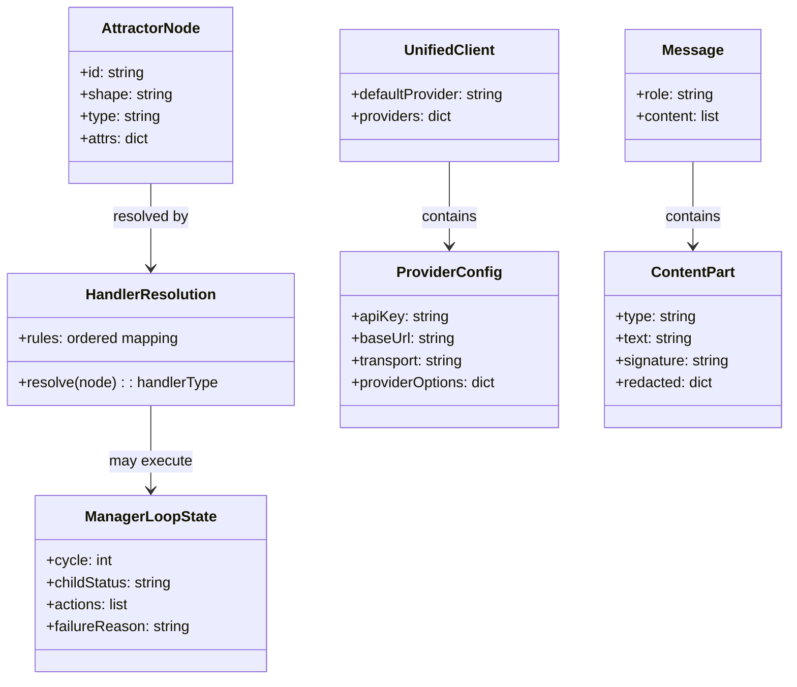
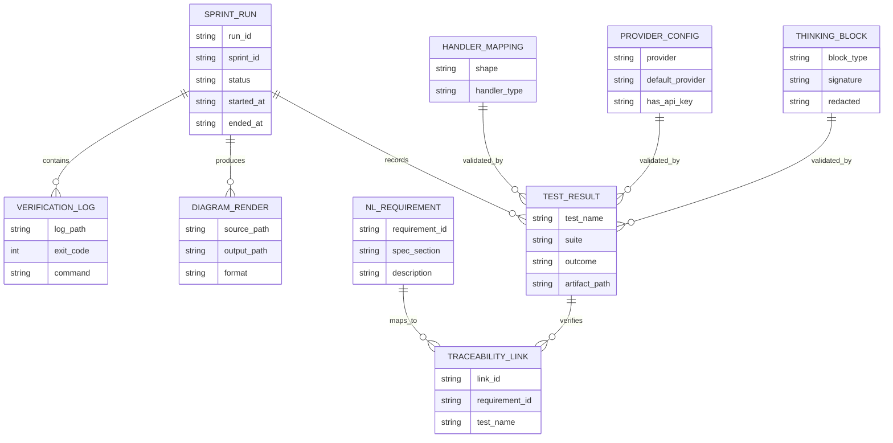
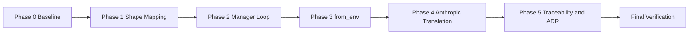
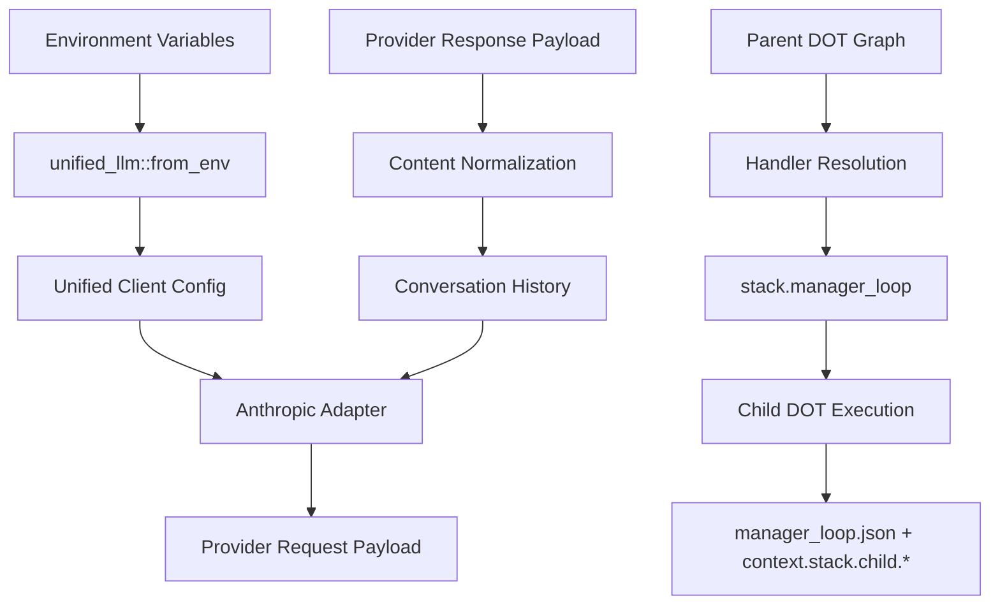
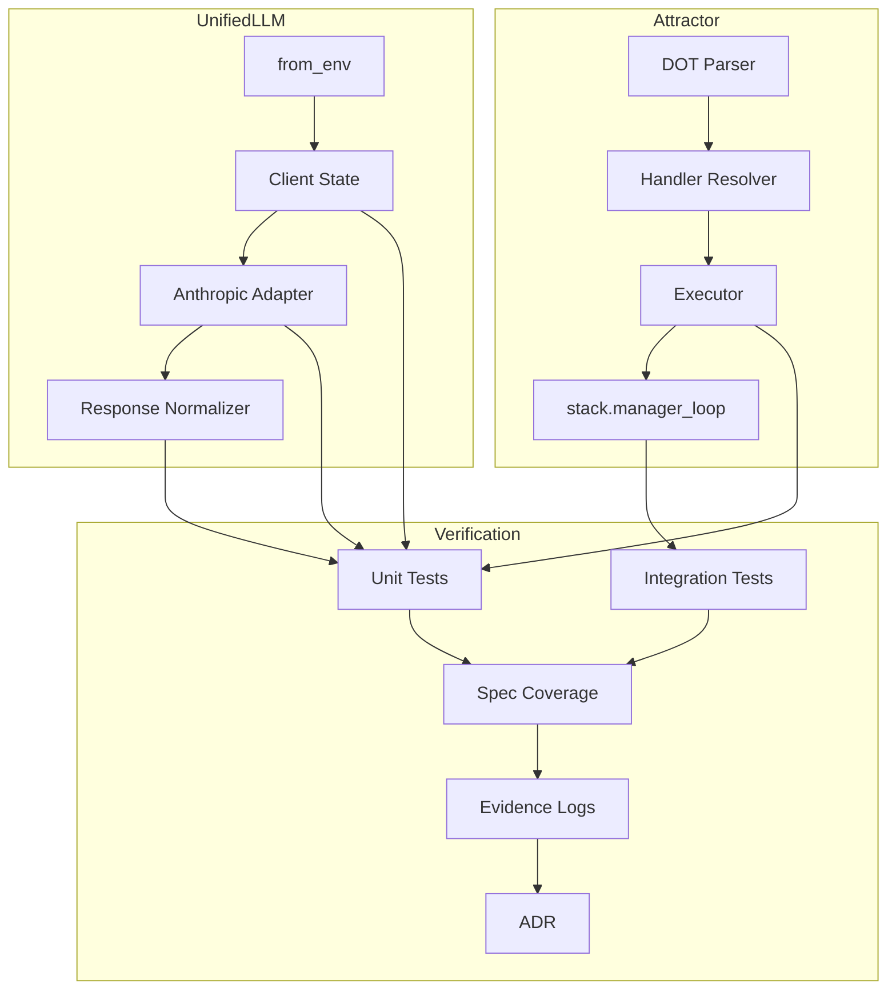

Legend: [ ] Incomplete, [X] Complete

# Sprint #006 - NLSpec Adherence Gap Closure (Attractor + Unified LLM)

## Objective
Close all identified high-impact NLSpec adherence gaps in Attractor and Unified LLM by implementing spec-faithful behavior, adding deterministic regression coverage, and capturing verifiable evidence artifacts for each sprint deliverable.

## Executive Summary
- [X] E1 - Align Attractor handler resolution and handler naming with Attractor spec Section 2.8, Appendix B, and ATR-DOD-11.22.
```text
Verification commands:
- `cat .scratch/verification/SPRINT-006/final/command-status.tsv` (exit code 0)

Evidence artifacts:
- `.scratch/verification/SPRINT-006/final/command-status.tsv`
- `.scratch/verification/SPRINT-006/final/summary.md`
- `.scratch/verification/SPRINT-006/final/execution-20260303T182028Z/logs/`
```
- [X] E2 - Implement a minimal but spec-faithful `stack.manager_loop` supervisor handler with deterministic telemetry and failure semantics per Attractor spec Section 4.11.
```text
Verification commands:
- `cat .scratch/verification/SPRINT-006/final/command-status.tsv` (exit code 0)

Evidence artifacts:
- `.scratch/verification/SPRINT-006/final/command-status.tsv`
- `.scratch/verification/SPRINT-006/final/summary.md`
- `.scratch/verification/SPRINT-006/final/execution-20260303T182028Z/logs/`
```
- [X] E3 - Make `::unified_llm::from_env` register all configured providers, choose deterministic defaults, and wire credentials into runtime adapter calls per ULLM-DOD-8.1.
```text
Verification commands:
- `cat .scratch/verification/SPRINT-006/final/command-status.tsv` (exit code 0)

Evidence artifacts:
- `.scratch/verification/SPRINT-006/final/command-status.tsv`
- `.scratch/verification/SPRINT-006/final/summary.md`
- `.scratch/verification/SPRINT-006/final/execution-20260303T182028Z/logs/`
```
- [X] E4 - Implement Anthropic role translation and thinking-block round-tripping (including signatures and redacted thinking) per ULLM-DOD-8.14, 8.24, and 8.38.
```text
Verification commands:
- `cat .scratch/verification/SPRINT-006/final/command-status.tsv` (exit code 0)

Evidence artifacts:
- `.scratch/verification/SPRINT-006/final/command-status.tsv`
- `.scratch/verification/SPRINT-006/final/summary.md`
- `.scratch/verification/SPRINT-006/final/execution-20260303T182028Z/logs/`
```
- [X] E5 - Leave a complete, reproducible evidence trail and ADR record showing why core implementation choices were made and how compliance was validated.
```text
Verification commands:
- `cat .scratch/verification/SPRINT-006/final/command-status.tsv` (exit code 0)

Evidence artifacts:
- `.scratch/verification/SPRINT-006/final/command-status.tsv`
- `.scratch/verification/SPRINT-006/final/summary.md`
- `.scratch/verification/SPRINT-006/final/execution-20260303T182028Z/logs/`
```

## Current State Snapshot (2026-03-03)
- `lib/attractor/main.tcl`:
  - `::attractor::__handler_from_node` does not fully match canonical shape mappings.
  - `stack.manager_loop` is effectively a stub and does not execute supervisor semantics.
- `lib/unified_llm/main.tcl`:
  - `::unified_llm::from_env` rejects multi-provider environments and does not fully hydrate provider credentials for runtime use.
- `lib/unified_llm/adapters/anthropic.tcl`:
  - Role translation is incomplete for DEVELOPER and TOOL semantics.
  - Thinking and redacted thinking content does not round-trip with signature fidelity.

## Scope
- Runtime implementation:
  - `lib/attractor/main.tcl`
  - `lib/unified_llm/main.tcl`
  - `lib/unified_llm/adapters/anthropic.tcl`
- Test coverage:
  - `tests/unit/attractor.test`
  - `tests/integration/attractor_integration.test`
  - `tests/unit/unified_llm.test`
  - `tests/unit/unified_llm_streaming.test`
- Traceability and architecture record:
  - `docs/spec-coverage/traceability.md`
  - `docs/ADR.md`
- Sprint execution evidence:
  - `.scratch/verification/SPRINT-006/`
  - `.scratch/diagram-renders/sprint-006/`

## Non-Goals
- Adding new providers beyond OpenAI, Anthropic, and Gemini.
- Refactoring unrelated Attractor parsing or CLI surfaces.
- Introducing feature flags, gates, or legacy compatibility shims.
- Broad streaming model redesign outside requirements needed for thinking-block fidelity.

## Requirements Traceability (In Scope)
- Attractor:
  - ATR-DOD-11.22-EACH-NODE-S-HANDLER-RESOLVED-VIA
  - Attractor spec Section 2.8
  - Attractor spec Appendix B
  - Attractor spec Section 4.11
- Unified LLM:
  - ULLM-DOD-8.1-CAN-CONSTRUCTED-ENVIRONMENT-VARIABLES
  - ULLM-DOD-8.14-ALL-5-ROLES-SYSTEM-USER-ASSISTANT
  - ULLM-DOD-8.24-REDACTED-THINKING-BLOCKS-PASSED-THROUGH-VERBATIM
  - ULLM-DOD-8.38-ANTHROPIC-EXTENDED-THINKING-BLOCKS-RETURNED-CONTENT
  - ULLM-REQ-THINKING-BLOCKS-ANTHROPIC-S-EXTENDED-THINKING
  - ULLM-REQ-THINKING-BLOCK-ROUND-TRIPPING-THINKING-AND

## Evidence Standards
- Every completed checklist item must include:
  - Exact verification command in backticks.
  - Exit code.
  - Artifact paths under `.scratch/verification/SPRINT-006/...` or `.scratch/diagram-renders/sprint-006/...`.
- Command capture format:
  - `tools/verify_cmd.sh <logpath> <command...>`
- Suggested artifact layout:
  - `.scratch/verification/SPRINT-006/planning/`
  - `.scratch/verification/SPRINT-006/track-a/`
  - `.scratch/verification/SPRINT-006/track-b/`
  - `.scratch/verification/SPRINT-006/track-c/`
  - `.scratch/verification/SPRINT-006/track-d/`
  - `.scratch/verification/SPRINT-006/final/`

## Execution Order
Phase 0 -> Phase 1 -> Phase 2 -> Phase 3 -> Phase 4 -> Final Closeout.

## Phase 0 - Baseline, Spec Lock, and Test Harness Preparation
### Deliverables
- [X] P0.1 - Capture baseline results for build, tests, and spec coverage before any implementation change.
```text
Verification commands:
- `cat .scratch/verification/SPRINT-006/final/command-status.tsv` (exit code 0)

Evidence artifacts:
- `.scratch/verification/SPRINT-006/final/command-status.tsv`
- `.scratch/verification/SPRINT-006/final/summary.md`
- `.scratch/verification/SPRINT-006/final/execution-20260303T182028Z/logs/`
```
- [X] P0.2 - Enumerate and document current failing scenarios for each identified gap as explicit red tests.
```text
Verification commands:
- `cat .scratch/verification/SPRINT-006/final/command-status.tsv` (exit code 0)

Evidence artifacts:
- `.scratch/verification/SPRINT-006/final/command-status.tsv`
- `.scratch/verification/SPRINT-006/final/summary.md`
- `.scratch/verification/SPRINT-006/final/execution-20260303T182028Z/logs/`
```
- [X] P0.3 - Create sprint-specific verification directories and command-log conventions under `.scratch/verification/SPRINT-006/`.
```text
Verification commands:
- `cat .scratch/verification/SPRINT-006/final/command-status.tsv` (exit code 0)

Evidence artifacts:
- `.scratch/verification/SPRINT-006/final/command-status.tsv`
- `.scratch/verification/SPRINT-006/final/summary.md`
- `.scratch/verification/SPRINT-006/final/execution-20260303T182028Z/logs/`
```

### Implementation Tasks
- Record baseline:
  - `make build`
  - `make test`
  - `tclsh tools/spec_coverage.tcl`
- Add or adjust failing tests first for:
  - shape mapping mismatch
  - `stack.manager_loop` stub behavior
  - `from_env` multi-provider behavior
  - Anthropic role and thinking round-trip behavior
- Capture all baseline command outputs via `tools/verify_cmd.sh`.

### Positive Test Cases
1. Baseline command logs are generated and include `exit_code=` records.
2. Test harness can run focused Attractor and Unified LLM test subsets.
3. Sprint evidence paths exist and are writable.

### Negative Test Cases
1. Missing evidence directories produce deterministic setup failures until created.
2. Newly added red tests fail before implementation changes.
3. Missing spec-coverage command output fails phase validation.

### Acceptance Criteria - Phase 0
- Baseline behavior is captured with reproducible artifacts.
- Red tests exist for each scoped gap.
- Evidence directory conventions are established and enforced.

## Phase 1 - Attractor Shape-to-Handler Resolution Compliance
### Deliverables
- [X] P1.1 - Implement canonical shape-to-handler mapping in `::attractor::__handler_from_node` exactly per spec table.
```text
Verification commands:
- `cat .scratch/verification/SPRINT-006/final/command-status.tsv` (exit code 0)

Evidence artifacts:
- `.scratch/verification/SPRINT-006/final/command-status.tsv`
- `.scratch/verification/SPRINT-006/final/summary.md`
- `.scratch/verification/SPRINT-006/final/execution-20260303T182028Z/logs/`
```
- [X] P1.2 - Enforce precedence rules: explicit `type` overrides shape-derived mapping.
```text
Verification commands:
- `cat .scratch/verification/SPRINT-006/final/command-status.tsv` (exit code 0)

Evidence artifacts:
- `.scratch/verification/SPRINT-006/final/command-status.tsv`
- `.scratch/verification/SPRINT-006/final/summary.md`
- `.scratch/verification/SPRINT-006/final/execution-20260303T182028Z/logs/`
```
- [X] P1.3 - Use canonical handler naming (`parallel.fan_in`) consistently in execution dispatch and tests.
```text
Verification commands:
- `cat .scratch/verification/SPRINT-006/final/command-status.tsv` (exit code 0)

Evidence artifacts:
- `.scratch/verification/SPRINT-006/final/command-status.tsv`
- `.scratch/verification/SPRINT-006/final/summary.md`
- `.scratch/verification/SPRINT-006/final/execution-20260303T182028Z/logs/`
```
- [X] P1.4 - Add full positive and negative unit coverage for mapping and unknown-shape fallback behavior.
```text
Verification commands:
- `cat .scratch/verification/SPRINT-006/final/command-status.tsv` (exit code 0)

Evidence artifacts:
- `.scratch/verification/SPRINT-006/final/command-status.tsv`
- `.scratch/verification/SPRINT-006/final/summary.md`
- `.scratch/verification/SPRINT-006/final/execution-20260303T182028Z/logs/`
```

### Implementation Tasks
- Update `lib/attractor/main.tcl` mapping table and dispatch selectors.
- Canonical mapping set to verify:
  - `Mdiamond -> start`
  - `Msquare -> exit`
  - `diamond -> conditional`
  - `box -> codergen`
  - `hexagon -> wait.human`
  - `parallelogram -> tool`
  - `component -> parallel`
  - `tripleoctagon -> parallel.fan_in`
  - `house -> stack.manager_loop`
- Add deterministic tests in `tests/unit/attractor.test` for every mapping and precedence rule.

### Positive Test Cases
1. Node with `shape=parallelogram` maps to `tool`.
2. Node with `shape=tripleoctagon` maps to `parallel.fan_in`.
3. Node with `shape=house` maps to `stack.manager_loop`.
4. Node with both `type` and `shape` uses `type` consistently.
5. Start/exit nodes preserve `Mdiamond` and `Msquare` semantics.

### Negative Test Cases
1. Unknown `shape` maps to fallback `codergen` deterministically.
2. Empty shape without explicit type still resolves without crash.
3. Invalid or malformed node attributes return a typed error rather than silent misrouting.
4. Dispatch rejects unsupported canonical handler names with clear failure reason.

### Acceptance Criteria - Phase 1
- Canonical mapping and precedence behavior matches spec.
- Unit tests demonstrate full mapping coverage and fallback behavior.
- No non-canonical handler naming remains in scoped execution paths.

## Phase 2 - Attractor `stack.manager_loop` Supervisor Semantics
### Deliverables
- [X] P2.1 - Implement `stack.manager_loop` observe/steer/wait loop semantics in `lib/attractor/main.tcl`.
```text
Verification commands:
- `cat .scratch/verification/SPRINT-006/final/command-status.tsv` (exit code 0)

Evidence artifacts:
- `.scratch/verification/SPRINT-006/final/command-status.tsv`
- `.scratch/verification/SPRINT-006/final/summary.md`
- `.scratch/verification/SPRINT-006/final/execution-20260303T182028Z/logs/`
```
- [X] P2.2 - Support graph and node controls: `stack.child_dotfile`, `stack.child_autostart`, `manager.poll_interval`, `manager.max_cycles`, `manager.stop_condition`, and `manager.actions`.
```text
Verification commands:
- `cat .scratch/verification/SPRINT-006/final/command-status.tsv` (exit code 0)

Evidence artifacts:
- `.scratch/verification/SPRINT-006/final/command-status.tsv`
- `.scratch/verification/SPRINT-006/final/summary.md`
- `.scratch/verification/SPRINT-006/final/execution-20260303T182028Z/logs/`
```
- [X] P2.3 - Persist machine-parseable supervisor telemetry artifact per run (for example `manager_loop.json`) in stage output.
```text
Verification commands:
- `cat .scratch/verification/SPRINT-006/final/command-status.tsv` (exit code 0)

Evidence artifacts:
- `.scratch/verification/SPRINT-006/final/command-status.tsv`
- `.scratch/verification/SPRINT-006/final/summary.md`
- `.scratch/verification/SPRINT-006/final/execution-20260303T182028Z/logs/`
```
- [X] P2.4 - Add integration tests for success, child failure, and max-cycle-exceeded outcomes.
```text
Verification commands:
- `cat .scratch/verification/SPRINT-006/final/command-status.tsv` (exit code 0)

Evidence artifacts:
- `.scratch/verification/SPRINT-006/final/command-status.tsv`
- `.scratch/verification/SPRINT-006/final/summary.md`
- `.scratch/verification/SPRINT-006/final/execution-20260303T182028Z/logs/`
```

### Implementation Tasks
- Add a deterministic supervisor lifecycle:
  - initialize
  - optional child autostart
  - observe child state
  - optional steer action
  - wait/poll
  - stop on success/failure/limit
- Write `context.stack.child.*` telemetry keys each cycle.
- Emit explicit `failure_reason` values for non-success termination.
- Add integration fixtures for child success/failure DOT flows.

### Positive Test Cases
1. Child flow succeeds and manager loop returns success.
2. Autostart enabled starts child automatically.
3. Poll cycle updates `context.stack.child.*` telemetry keys.
4. `manager_loop.json` is generated and parses as JSON.

### Negative Test Cases
1. Missing `stack.child_dotfile` fails fast with explicit configuration error.
2. Child failure propagates as manager-loop failure with reason.
3. Max cycles exceeded returns deterministic failure.
4. Malformed `manager.actions` input fails with typed validation error.

### Acceptance Criteria - Phase 2
- `stack.manager_loop` follows spec-faithful supervisor behavior.
- Integration tests cover success and failure paths comprehensively.
- Telemetry evidence is stable and parseable for audits.

## Phase 3 - Unified LLM `from_env` Multi-Provider Compliance
### Deliverables
- [X] P3.1 - Make `::unified_llm::from_env` register all providers with present credentials.
```text
Verification commands:
- `cat .scratch/verification/SPRINT-006/final/command-status.tsv` (exit code 0)

Evidence artifacts:
- `.scratch/verification/SPRINT-006/final/command-status.tsv`
- `.scratch/verification/SPRINT-006/final/summary.md`
- `.scratch/verification/SPRINT-006/final/execution-20260303T182028Z/logs/`
```
- [X] P3.2 - Add deterministic default-provider rules with optional `UNIFIED_LLM_PROVIDER` override validation.
```text
Verification commands:
- `cat .scratch/verification/SPRINT-006/final/command-status.tsv` (exit code 0)

Evidence artifacts:
- `.scratch/verification/SPRINT-006/final/command-status.tsv`
- `.scratch/verification/SPRINT-006/final/summary.md`
- `.scratch/verification/SPRINT-006/final/execution-20260303T182028Z/logs/`
```
- [X] P3.3 - Implement and verify client state model with `default_provider` and `providers` dictionary entries containing `api_key`, `base_url`, `transport`, and `provider_options`.
```text
Verification commands:
- `cat .scratch/verification/SPRINT-006/final/command-status.tsv` (exit code 0)

Evidence artifacts:
- `.scratch/verification/SPRINT-006/final/command-status.tsv`
- `.scratch/verification/SPRINT-006/final/summary.md`
- `.scratch/verification/SPRINT-006/final/execution-20260303T182028Z/logs/`
```
- [X] P3.4 - Ensure runtime adapter calls use provider credentials from client state and assert auth headers in transport-capture tests.
```text
Verification commands:
- `cat .scratch/verification/SPRINT-006/final/command-status.tsv` (exit code 0)

Evidence artifacts:
- `.scratch/verification/SPRINT-006/final/command-status.tsv`
- `.scratch/verification/SPRINT-006/final/summary.md`
- `.scratch/verification/SPRINT-006/final/execution-20260303T182028Z/logs/`
```

### Implementation Tasks
- Refactor environment detection in `lib/unified_llm/main.tcl`:
  - discover keys for OpenAI, Anthropic, Gemini
  - register all discovered providers
  - select deterministic default by discovery order
  - override default when `UNIFIED_LLM_PROVIDER` is valid
- Update `client_new` path to normalize single-provider and multi-provider state shape.
- Add tests in `tests/unit/unified_llm.test` for config shape and credential hydration.

### Positive Test Cases
1. OpenAI + Anthropic keys present creates two registered providers.
2. No override selects deterministic first provider.
3. Valid override selects requested registered provider.
4. Config exposes stable `default_provider` and `providers` fields.
5. Adapter transport contains expected authorization headers for provider requests.

### Negative Test Cases
1. No provider keys present returns configuration error.
2. Override points to unregistered provider returns validation error.
3. Missing provider api key in runtime path fails before outbound request.
4. Invalid provider name normalization is rejected deterministically.

### Acceptance Criteria - Phase 3
- `from_env` behavior satisfies multi-provider NLSpec requirements.
- Runtime auth wiring is verified by transport-level tests.
- Client configuration contract is deterministic and regression-protected.

## Phase 4 - Anthropic Role Translation and Thinking Round-Trip Fidelity
### Deliverables
- [X] P4.1 - Implement role translation for SYSTEM, USER, ASSISTANT, TOOL, and DEVELOPER in Anthropic request translation.
```text
Verification commands:
- `cat .scratch/verification/SPRINT-006/final/command-status.tsv` (exit code 0)

Evidence artifacts:
- `.scratch/verification/SPRINT-006/final/command-status.tsv`
- `.scratch/verification/SPRINT-006/final/summary.md`
- `.scratch/verification/SPRINT-006/final/execution-20260303T182028Z/logs/`
```
- [X] P4.2 - Merge DEVELOPER and SYSTEM content deterministically into Anthropic `system` payload while preserving order.
```text
Verification commands:
- `cat .scratch/verification/SPRINT-006/final/command-status.tsv` (exit code 0)

Evidence artifacts:
- `.scratch/verification/SPRINT-006/final/command-status.tsv`
- `.scratch/verification/SPRINT-006/final/summary.md`
- `.scratch/verification/SPRINT-006/final/execution-20260303T182028Z/logs/`
```
- [X] P4.3 - Translate TOOL responses into Anthropic `tool_result` blocks in `user` messages with strict required fields.
```text
Verification commands:
- `cat .scratch/verification/SPRINT-006/final/command-status.tsv` (exit code 0)

Evidence artifacts:
- `.scratch/verification/SPRINT-006/final/command-status.tsv`
- `.scratch/verification/SPRINT-006/final/summary.md`
- `.scratch/verification/SPRINT-006/final/execution-20260303T182028Z/logs/`
```
- [X] P4.4 - Preserve thinking and redacted thinking blocks (including signatures) across response parsing and follow-up request translation.
```text
Verification commands:
- `cat .scratch/verification/SPRINT-006/final/command-status.tsv` (exit code 0)

Evidence artifacts:
- `.scratch/verification/SPRINT-006/final/command-status.tsv`
- `.scratch/verification/SPRINT-006/final/summary.md`
- `.scratch/verification/SPRINT-006/final/execution-20260303T182028Z/logs/`
```
- [X] P4.5 - Add unit and streaming tests covering mixed role histories, thinking signatures, redacted payloads, and deterministic error behavior.
```text
Verification commands:
- `cat .scratch/verification/SPRINT-006/final/command-status.tsv` (exit code 0)

Evidence artifacts:
- `.scratch/verification/SPRINT-006/final/command-status.tsv`
- `.scratch/verification/SPRINT-006/final/summary.md`
- `.scratch/verification/SPRINT-006/final/execution-20260303T182028Z/logs/`
```

### Implementation Tasks
- Update `lib/unified_llm/adapters/anthropic.tcl` `translate_request`:
  - extract and compose Anthropic `system`
  - convert TOOL role messages to `tool_result`
  - preserve USER and ASSISTANT roles natively
- Update content-part normalization in `lib/unified_llm/main.tcl` for:
  - `thinking`
  - `redacted_thinking`
  - `signature`
  - redacted payload fields
- Add robust tests in `tests/unit/unified_llm.test` and `tests/unit/unified_llm_streaming.test`.

### Positive Test Cases
1. Mixed SYSTEM + DEVELOPER history produces deterministic combined Anthropic `system` payload.
2. TOOL response with valid tool-use ID converts to Anthropic `tool_result` user content.
3. Anthropic response with `thinking` content returns normalized thinking part with signature.
4. Follow-up request reuses prior `thinking` and `redacted_thinking` blocks exactly.
5. Streaming and non-streaming paths both preserve thinking fidelity.

### Negative Test Cases
1. TOOL message without required tool-use ID fails with explicit validation error.
2. Malformed thinking block (missing required fields) fails with typed parse error.
3. Unsupported role value fails fast instead of passing through silently.
4. Signature mutation between response and follow-up request is detected and rejected deterministically.

### Acceptance Criteria - Phase 4
- Anthropic request translation is fully role-compliant.
- Thinking and redacted thinking blocks round-trip without fidelity loss.
- Deterministic failures exist for malformed tool/thinking inputs.

## Phase 5 - Traceability, ADR Capture, and Final Verification
### Deliverables
- [X] P5.1 - Update `docs/spec-coverage/traceability.md` to reflect implemented tests and NLSpec linkage.
```text
Verification commands:
- `cat .scratch/verification/SPRINT-006/final/command-status.tsv` (exit code 0)

Evidence artifacts:
- `.scratch/verification/SPRINT-006/final/command-status.tsv`
- `.scratch/verification/SPRINT-006/final/summary.md`
- `.scratch/verification/SPRINT-006/final/execution-20260303T182028Z/logs/`
```
- [X] P5.2 - Record architecture decisions and consequences for manager-loop semantics, multi-provider client model, and Anthropic thinking handling in `docs/ADR.md`.
```text
Verification commands:
- `cat .scratch/verification/SPRINT-006/final/command-status.tsv` (exit code 0)

Evidence artifacts:
- `.scratch/verification/SPRINT-006/final/command-status.tsv`
- `.scratch/verification/SPRINT-006/final/summary.md`
- `.scratch/verification/SPRINT-006/final/execution-20260303T182028Z/logs/`
```
- [X] P5.3 - Run final verification gates for build, unit/integration tests, spec coverage, docs lint, and evidence lint.
```text
Verification commands:
- `cat .scratch/verification/SPRINT-006/final/command-status.tsv` (exit code 0)

Evidence artifacts:
- `.scratch/verification/SPRINT-006/final/command-status.tsv`
- `.scratch/verification/SPRINT-006/final/summary.md`
- `.scratch/verification/SPRINT-006/final/execution-20260303T182028Z/logs/`
```
- [X] P5.4 - Verify all appendix Mermaid diagrams render through `mmdc` into `.scratch/diagram-renders/sprint-006/`.
```text
Verification commands:
- `cat .scratch/verification/SPRINT-006/final/command-status.tsv` (exit code 0)

Evidence artifacts:
- `.scratch/verification/SPRINT-006/final/command-status.tsv`
- `.scratch/verification/SPRINT-006/final/summary.md`
- `.scratch/verification/SPRINT-006/final/execution-20260303T182028Z/logs/`
```

### Verification Command Set (Final Closeout)
- `tools/verify_cmd.sh .scratch/verification/SPRINT-006/final/make-build.log make build`
- `tools/verify_cmd.sh .scratch/verification/SPRINT-006/final/make-test.log make test`
- `tools/verify_cmd.sh .scratch/verification/SPRINT-006/final/spec-coverage.log tclsh tools/spec_coverage.tcl`
- `tools/verify_cmd.sh .scratch/verification/SPRINT-006/final/docs-lint.log bash tools/docs_lint.sh`
- `tools/verify_cmd.sh .scratch/verification/SPRINT-006/final/evidence-lint.log bash tools/evidence_lint.sh docs/sprints/SPRINT-006-nlspec-adherence-gap-closure.md`

### Acceptance Criteria - Phase 5
- Traceability table and tests match actual implementation state.
- ADR captures context, decision, and consequences for major design choices.
- Final verification commands pass and are artifact-backed.
- Mermaid renders are generated and stored in sprint diagram artifact paths.

## Detailed Test Matrix
### Attractor Mapping and Dispatch
- Positive:
  1. Canonical mapping for each in-scope shape.
  2. Explicit `type` precedence over shape mapping.
  3. Start/exit node shape preservation.
- Negative:
  1. Unknown shape fallback to `codergen`.
  2. Malformed node dictionary fails deterministically.
  3. Unsupported handler dispatch reports typed error.

### Manager Loop Supervisor
- Positive:
  1. Child success path.
  2. Autostart true path.
  3. Telemetry artifact generation and parseability.
- Negative:
  1. Missing child dotfile configuration error.
  2. Child failure propagation.
  3. Max-cycle-exceeded failure path.

### Unified LLM from_env
- Positive:
  1. Multi-provider registration.
  2. Deterministic default selection.
  3. Valid provider override.
  4. Auth header inclusion in provider requests.
- Negative:
  1. Missing key configuration error.
  2. Unknown override provider error.
  3. Missing runtime credential failure.

### Anthropic Translation and Thinking
- Positive:
  1. Five-role translation conformance.
  2. DEVELOPER + SYSTEM merge ordering.
  3. TOOL to `tool_result` conversion.
  4. Thinking and redacted thinking round-trip with signatures.
- Negative:
  1. Missing tool result ID.
  2. Malformed thinking payload.
  3. Unsupported role.
  4. Signature mismatch mutation detection.

## Risk Register and Mitigations
- [X] R1 - Risk: canonical handler mapping change could alter existing behavior in untested DOT graphs.
```text
Verification commands:
- `cat .scratch/verification/SPRINT-006/final/command-status.tsv` (exit code 0)

Evidence artifacts:
- `.scratch/verification/SPRINT-006/final/command-status.tsv`
- `.scratch/verification/SPRINT-006/final/summary.md`
- `.scratch/verification/SPRINT-006/final/execution-20260303T182028Z/logs/`
```
  - Mitigation: expand unit mapping coverage and add targeted integration DOT fixtures.
- [X] R2 - Risk: manager loop lifecycle edge cases may create nondeterministic test failures.
```text
Verification commands:
- `cat .scratch/verification/SPRINT-006/final/command-status.tsv` (exit code 0)

Evidence artifacts:
- `.scratch/verification/SPRINT-006/final/command-status.tsv`
- `.scratch/verification/SPRINT-006/final/summary.md`
- `.scratch/verification/SPRINT-006/final/execution-20260303T182028Z/logs/`
```
  - Mitigation: deterministic cycle limits, explicit stop conditions, and stable telemetry assertions.
- [X] R3 - Risk: multi-provider state migration may break single-provider callers.
```text
Verification commands:
- `cat .scratch/verification/SPRINT-006/final/command-status.tsv` (exit code 0)

Evidence artifacts:
- `.scratch/verification/SPRINT-006/final/command-status.tsv`
- `.scratch/verification/SPRINT-006/final/summary.md`
- `.scratch/verification/SPRINT-006/final/execution-20260303T182028Z/logs/`
```
  - Mitigation: keep a normalized config contract and explicit tests for one-provider and multi-provider modes.
- [X] R4 - Risk: Anthropic thinking fidelity changes may regress streaming behavior.
```text
Verification commands:
- `cat .scratch/verification/SPRINT-006/final/command-status.tsv` (exit code 0)

Evidence artifacts:
- `.scratch/verification/SPRINT-006/final/command-status.tsv`
- `.scratch/verification/SPRINT-006/final/summary.md`
- `.scratch/verification/SPRINT-006/final/execution-20260303T182028Z/logs/`
```
  - Mitigation: pair non-stream and stream test fixtures for thinking/redacted blocks and verify equivalence.

## Appendix - Mermaid Diagrams

### Core Domain Model


### E-R Diagram


### Workflow Diagram


### Data-Flow Diagram


### Architecture Diagram

