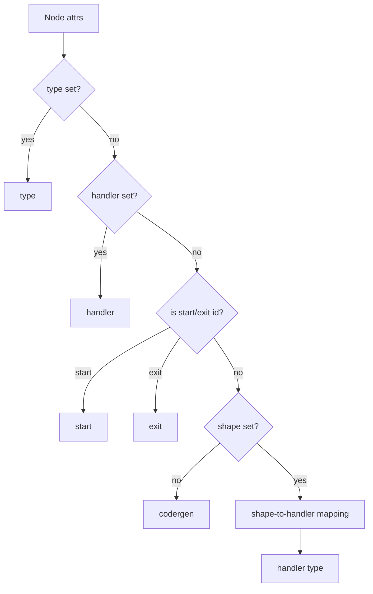
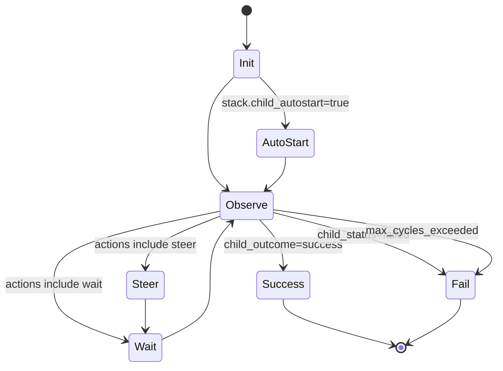
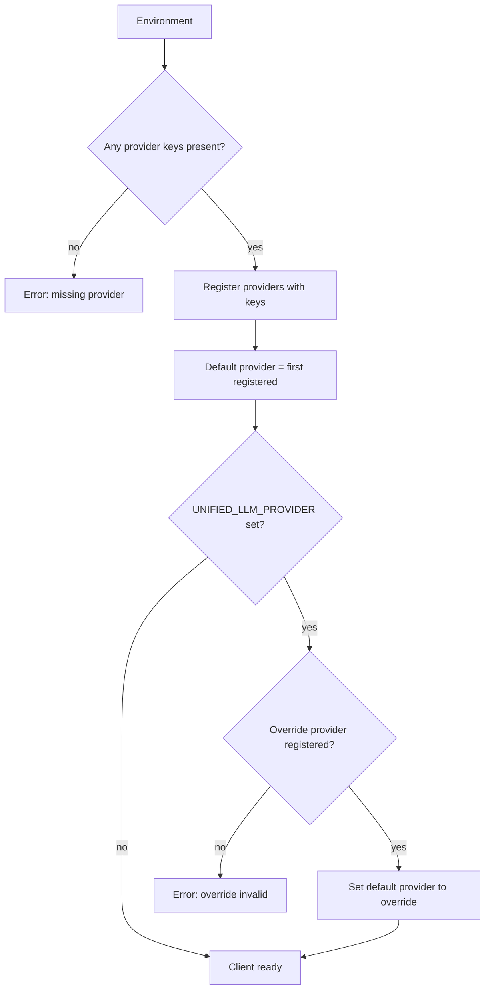

Legend: [ ] Incomplete, [X] Complete

_Evidence for every completed checklist item must include the exact verification command (wrapped with backticks) plus its exit code and artifacts (logs, `.scratch` transcripts, diagram renders) directly beneath the item when the work is performed._

# Sprint #006 - NLSpec Adherence Gap Closure (Attractor + Unified LLM)

## Objective
Close the highest-impact NLSpec adherence gaps identified in the codex-3-2 implementation baseline, focusing on Attractor shape-to-handler resolution and Unified LLM environment configuration, role translation, and Anthropic thinking block round-tripping.

## Success Criteria
- Canonical Attractor shape-to-handler mapping matches `attractor-spec.md` Section 2.8 / Appendix B and is enforced by focused unit tests.
- `stack.manager_loop` implements a minimal supervisor loop per `attractor-spec.md` Section 4.11 and is covered by at least one integration test with a real child DOT.
- `::unified_llm::from_env` registers all providers whose keys are present and sets a deterministic default provider (with an optional `UNIFIED_LLM_PROVIDER` override).
- Anthropic adapter correctly translates DEVELOPER and TOOL roles and preserves thinking/redacted thinking blocks (including signatures) through request translation.
- Verification gates pass: `timeout 180 make build`, `timeout 180 make test`, and `tclsh tools/spec_coverage.tcl`.

## Context & Problem
Current implementation behavior diverges from the NLSpecs in a few load-bearing places:
- Attractor does not follow the spec's canonical shape-to-handler mapping (ATR-DOD-11.22), and some handler type names are inconsistent with the spec table.
- `stack.manager_loop` is a stub, but the spec defines a supervisor loop with observe/steer/wait semantics (Attractor spec Section 4.11).
- Unified LLM `from_env()` currently errors when multiple provider keys are present and does not populate provider credentials in client state, which makes real provider calls fail and contradicts environment-based setup requirements (ULLM-DOD-8.1).
- Anthropic adapter request translation does not correctly handle DEVELOPER/TOOL roles and does not preserve thinking/redacted thinking content blocks with signatures for round-tripping (ULLM-DOD-8.14, ULLM-DOD-8.24, ULLM-DOD-8.38, plus thinking round-trip requirements).

Sprint #006 scopes directly to closing these gaps with targeted tests that prove compliance and prevent regression.

## Current State Snapshot (2026-03-03)
- Attractor handler resolution:
  - `lib/attractor/main.tcl` `::attractor::__handler_from_node` only maps a subset of shapes and incorrectly maps `parallelogram` to `wait.human` instead of `tool`.
  - `lib/attractor/main.tcl` `stack.manager_loop` returns immediate success with `"manager_loop"` notes (no supervisor loop).
- Unified LLM env + Anthropic:
  - `lib/unified_llm/main.tcl` `::unified_llm::from_env` errors when multiple provider keys are present and constructs a client without populating provider API keys.
  - `lib/unified_llm/adapters/anthropic.tcl` `translate_request` passes non-Anthropic roles through and collapses thinking to plain text (no signature/redacted support).

## Scope
- Attractor engine handler resolution and handler implementations:
  - `lib/attractor/main.tcl`
  - `tests/unit/attractor.test`
  - `tests/integration/attractor_integration.test` (as needed for end-to-end manager_loop behavior)
- Unified LLM environment setup and Anthropic translation/round-trip behavior:
  - `lib/unified_llm/main.tcl`
  - `lib/unified_llm/adapters/anthropic.tcl`
  - `tests/unit/unified_llm.test`
  - `tests/unit/unified_llm_streaming.test` (for thinking in streaming paths)
- Spec traceability and evidence hygiene (only where changes are required to keep spec coverage truthful):
  - `docs/spec-coverage/traceability.md`

## Non-Goals
- Adding new providers beyond OpenAI/Anthropic/Gemini.
- Broad refactors to Attractor DOT parsing, lint rules, or CLI UX not required for the targeted NLSpec gaps.
- Rewriting Unified LLM streaming event model beyond what is necessary to preserve Anthropic thinking blocks and signatures.

## Constraints
- Tcl 8.5 compatibility (avoid Tcl 8.6-only features like `lmap`).
- All changes must keep `make build` and `make test` green.
- Evidence discipline: when checklist items are marked complete, attach command + exit code + artifact paths under `.scratch/verification/SPRINT-006/...`.

## Requirements In Scope (NLSpec)
- Attractor:
  - ATR-DOD-11.22-EACH-NODE-S-HANDLER-RESOLVED-VIA (shape-to-handler mapping)
  - Attractor spec Section 2.8 / Appendix B (canonical mapping table)
  - Attractor spec Section 4.11 (Manager Loop Handler semantics)
- Unified LLM:
  - ULLM-DOD-8.1-CAN-CONSTRUCTED-ENVIRONMENT-VARIABLES (from_env behavior)
  - ULLM-DOD-8.14-ALL-5-ROLES-SYSTEM-USER-ASSISTANT (DEVELOPER/TOOL translation)
  - ULLM-DOD-8.24-REDACTED-THINKING-BLOCKS-PASSED-THROUGH-VERBATIM
  - ULLM-DOD-8.38-ANTHROPIC-EXTENDED-THINKING-BLOCKS-RETURNED-CONTENT
  - ULLM-REQ-THINKING-BLOCKS-ANTHROPIC-S-EXTENDED-THINKING (signatures + redacted)
  - ULLM-REQ-THINKING-BLOCK-ROUND-TRIPPING-THINKING-AND (history preservation)

## Evidence Layout
Use these conventions consistently:
- `.scratch/verification/SPRINT-006/planning/` for baseline snapshots and analysis captures.
- `.scratch/verification/SPRINT-006/track-*/...` for implementation verification logs per track.
- `.scratch/diagram-renders/sprint-006/` for rendered Mermaid outputs (if rendered).

For command logs, prefer:
- `tools/verify_cmd.sh <logpath> <command...>` (adds `exit_code=<n>` to the log).

## Execution Order
Track 0 -> Track A -> Track B -> Track C -> Track D -> Final Closeout.

## Track 0 - Baseline + Guardrails
- [ ] **T0.1 - Capture baseline spec/test state for Sprint-006**
  - Verification commands:
    - `tools/verify_cmd.sh .scratch/verification/SPRINT-006/planning/spec-coverage-baseline.log tclsh tools/spec_coverage.tcl`
    - `tools/verify_cmd.sh .scratch/verification/SPRINT-006/planning/make-test-baseline.log timeout 180 make test`
  - Evidence artifacts:
    - `.scratch/verification/SPRINT-006/planning/spec-coverage-baseline.log`
    - `.scratch/verification/SPRINT-006/planning/make-test-baseline.log`

- [ ] **T0.2 - Add focused tests first (red/green) for each gap before changing implementations**
  - Goal: each track below starts with tests that fail for the current behavior and then passes after implementation changes.
  - Verification commands:
    - `tclsh tests/all.tcl -match *attractor*`
    - `tclsh tests/all.tcl -match *unified_llm*`

## Track A - Attractor Shape Mapping + Handler Name Alignment
- [ ] **A1 - Implement canonical shape-to-handler mapping per Attractor spec (2.8 / Appendix B)**
  - Scope: `lib/attractor/main.tcl` (`::attractor::__handler_from_node`)
  - Requirements:
    - `type` attribute overrides shape-based mapping.
    - Canonical mapping (minimum): `hexagon -> wait.human`, `parallelogram -> tool`, `component -> parallel`, `tripleoctagon -> parallel.fan_in`, `house -> stack.manager_loop`.
    - Keep `Mdiamond -> start`, `Msquare -> exit`, `diamond -> conditional`, `box -> codergen`.
  - Tests (positive):
    - New unit tests assert mapping for every canonical shape.
    - New unit tests assert explicit `type` overrides shape mapping.
  - Tests (negative):
    - Unknown `shape` falls back to `codergen` unless `type` is set.

- [ ] **A2 - Align handler type names with the spec and keep backward compatibility**
  - Goal: eliminate handler naming mismatches that break mapping and selectors.
  - Requirements:
    - The execution dispatch recognizes `parallel.fan_in` (spec name).
    - If legacy names exist (example: `fan-in`), they remain supported as aliases to avoid breaking existing DOTs/tests.
  - Tests:
    - Unit test covers alias behavior: both `parallel.fan_in` and legacy name execute the same handler.

## Track B - Attractor `stack.manager_loop` Supervisor Semantics
- [ ] **B1 - Implement minimal spec-faithful manager loop (observe/steer/wait)**
  - Scope: `lib/attractor/main.tcl` (`stack.manager_loop` handler)
  - Requirements (from spec Section 4.11):
    - Reads graph-level `stack.child_dotfile` and optional node attrs:
      - `manager.poll_interval`, `manager.max_cycles`, `manager.stop_condition`, `manager.actions`
      - `stack.child_autostart` (default true)
    - Auto-starts child pipeline when configured.
    - Observation loop reads child telemetry into `context.stack.child.*` keys.
    - Stops on child completion success/failure and returns SUCCESS/FAIL accordingly.
  - Tests (positive):
    - Integration test runs a tiny child DOT that completes successfully and asserts manager_loop returns success.
  - Tests (negative):
    - Child failure causes manager_loop to return fail with clear `failure_reason`.
    - Max cycles exceeded returns fail.

- [ ] **B2 - Evidence-friendly telemetry contract**
  - Goal: make it easy to prove what manager_loop observed/decided without digging through ad-hoc logs.
  - Requirements:
    - Write a simple manager loop log artifact (example: `manager_loop.json`) under the stage directory describing each cycle outcome.
  - Tests:
    - Integration test asserts the artifact exists and is parseable JSON.

## Track C - Unified LLM `from_env()` Spec Compliance
- [ ] **C1 - Make `::unified_llm::from_env` register all providers whose keys are present**
  - Scope: `lib/unified_llm/main.tcl`
  - Requirements (spec Section 2.2):
    - If multiple keys exist, do not error; register all detected providers.
    - The first registered provider becomes the default.
    - If `UNIFIED_LLM_PROVIDER` is set, treat it as an optional default-provider override (error only if set to an unsupported or unregistered provider).
  - Tests (positive):
    - Replace `unified_llm-from-env-ambiguous-1.0` with tests that assert multi-provider registration and correct default selection.
  - Tests (negative):
    - No keys present still errors with a configuration error.
    - `UNIFIED_LLM_PROVIDER` set to unknown value errors.

- [ ] **C1.1 - Define the multi-provider client state model (minimal changes, maximum leverage)**
  - Goal: support multiple providers without requiring callers to manage separate clients per provider.
  - Design requirements:
    - Client stores `default_provider` and a `providers` dictionary keyed by provider name.
    - Each provider entry stores at least: `api_key`, `base_url`, `transport`, and `provider_options`.
    - Backward compatibility: `client_new -provider ... -api_key ...` continues to work by internally creating a single-entry `providers` dictionary.
  - Tests:
    - `$client config` exposes `default_provider` and `providers` deterministically.

- [ ] **C2 - Ensure provider credentials are actually wired into runtime adapter calls**
  - Requirements:
    - `from_env()` must populate per-provider API keys (and optional base URLs) so real adapter invocations include auth headers.
    - Unit tests validate that translated request headers include expected auth header keys per provider.
  - Tests:
    - Extend/introduce transport-capture tests that assert the correct auth header is present for each provider call.

## Track D - Anthropic Roles + Thinking Block Round-Tripping
- [ ] **D1 - Translate all 5 roles correctly for Anthropic (SYSTEM/USER/ASSISTANT/TOOL/DEVELOPER)**
  - Scope: `lib/unified_llm/adapters/anthropic.tcl` (`translate_request`)
  - Requirements (spec role mapping):
    - SYSTEM: extracted to the Anthropic `system` parameter.
    - DEVELOPER: merged with SYSTEM (preserve ordering deterministically).
    - TOOL: translated into `tool_result` content blocks inside a `user` message (not `role=tool`).
    - USER/ASSISTANT: preserved as Anthropic roles.
  - Tests (positive):
    - Unit test constructs a message history containing DEVELOPER + SYSTEM + TOOL messages and asserts the outgoing Anthropic payload conforms.
  - Tests (negative):
    - Tool result without an ID fails fast with a clear error code.

- [ ] **D2 - Preserve Anthropic thinking and redacted thinking blocks (with signatures)**
  - Scope:
    - `lib/unified_llm/main.tcl` content-part normalization (allow signature, redacted, and redacted_thinking)
    - `lib/unified_llm/adapters/anthropic.tcl` request translation and response parsing
  - Requirements:
    - Thinking blocks received from Anthropic are stored in response content parts (including `signature`).
    - Redacted thinking blocks are passed through verbatim in subsequent requests.
    - When sending back history, thinking blocks remain thinking blocks (not converted to plain text).
  - Tests (positive):
    - Add fixtures (or transport stubs) returning `thinking` and `redacted_thinking` blocks; assert:
      - `complete()` returns content parts representing them.
      - A follow-up request includes the exact thinking block payload (including signature or redacted data).
  - Tests (negative):
    - Switching providers strips signatures (if cross-provider routing is supported) or emits a warning; ensure behavior is deterministic and documented.

## Final Closeout
- [ ] **F1 - Full suite green + spec coverage guardrail**
  - Verification commands:
    - `tools/verify_cmd.sh .scratch/verification/SPRINT-006/final/make-build.log timeout 180 make build`
    - `tools/verify_cmd.sh .scratch/verification/SPRINT-006/final/make-test.log timeout 180 make test`
    - `tools/verify_cmd.sh .scratch/verification/SPRINT-006/final/spec-coverage.log tclsh tools/spec_coverage.tcl`
    - `tools/verify_cmd.sh .scratch/verification/SPRINT-006/final/docs-lint.log bash tools/docs_lint.sh`
    - `tools/verify_cmd.sh .scratch/verification/SPRINT-006/final/evidence-lint.log bash tools/evidence_lint.sh docs/sprints/SPRINT-006-nlspec-adherence-gap-closure.md`

- [ ] **F2 - Render Mermaid diagrams (optional but recommended)**
  - Goal: confirm diagrams compile and store renders for evidence.
  - Verification commands:
    - `tools/verify_cmd.sh .scratch/verification/SPRINT-006/final/mmdc-handler-resolution.log /opt/homebrew/bin/mmdc -i .scratch/diagrams/sprint-006/handler-resolution.mmd -o .scratch/diagram-renders/sprint-006/handler-resolution.svg`

## Appendix - Mermaid Diagrams

### Attractor Handler Resolution (Flow)

### Manager Loop Supervisor (State Machine)

### Unified LLM from_env Provider Registration (Flow)

