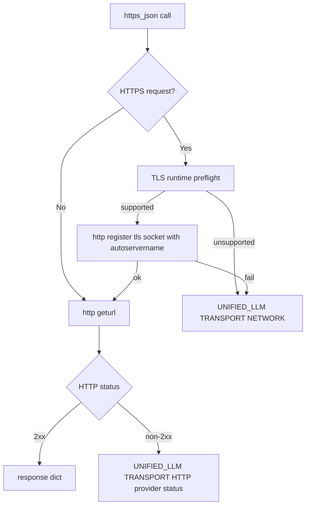

Legend: [ ] Incomplete, [X] Complete

# Sprint #007 Comprehensive Implementation Plan - TclTLS Modern HTTPS Transport

## Objective
Implement Sprint #007 end-to-end so `make test-e2e` uses a modern TLS-aware HTTPS transport path with deterministic failure contracts, actionable runtime diagnostics, and zero regressions to offline deterministic behavior.

## Source Scope
Primary input:
- `docs/sprints/SPRINT-007-tcltls-modern-https-transport.md`

Design and execution constraints inherited from sprint source:
- Preserve transport error contracts:
  - `UNIFIED_LLM TRANSPORT NETWORK <provider>`
  - `UNIFIED_LLM TRANSPORT HTTP <provider> <status>`
- Preserve secret redaction and leak-scan behavior.
- Keep `make test` offline and deterministic.
- Prefer additive hardening over broad refactor.

## Current-State Review (2026-03-03)
Repository inspection shows Sprint #007 requirements are largely present in code, but implementation closure still requires systematic gate execution, evidence freshness, and final acceptance sign-off.

Observed implementation surface:
- TLS runtime policy and HTTPS registration hardening:
  - `lib/unified_llm/transports/https_json.tcl`
- Transport integration tests:
  - `tests/integration/unified_llm_https_transport_integration.test`
- Live harness preflight artifacts and fail-fast behavior:
  - `tests/support/e2e_live_support.tcl`
  - `tests/e2e_live.tcl`
- Live preflight integration tests:
  - `tests/integration/e2e_live_support_integration.test`
- Runtime probe:
  - `tools/tls_runtime_probe.tcl`
- Make/CI/docs alignment:
  - `Makefile`
  - `.github/workflows/ci.yml`
  - `docs/howto/live-e2e.md`

Plan implication:
- Treat this sprint as an implementation-closeout and validation-hardening effort, not a greenfield build.
- Execute remaining work as a structured verification + gap-closure sequence with fresh artifacts.

## Implementation Strategy
Use six ordered tracks:
1. Baseline capture and policy lock.
2. Transport hardening parity check and code gap closure.
3. Integration and deterministic contract coverage.
4. Live harness and runtime diagnostics verification.
5. Toolchain/CI/docs parity.
6. Final regression, evidence, and release closeout.

## Track 0 - Baseline and Policy Lock
- [X] **T0.1 - Lock runtime support policy**
  - Decision: `tls >= 1.7.22` as minimum supported runtime.
  - Verification executed:
    - `tools/verify_cmd.sh .scratch/verification/SPRINT-007/track-0/tls-policy.log tclsh -c 'puts [package vcompare 1.7.22 1.6.1]; puts [package vcompare 1.7.22 1.7.22]'` (exit code 0)
  - Evidence:
    - `.scratch/verification/SPRINT-007/track-0/tls-policy.log`

- [X] **T0.2 - Capture runtime and test baselines**
  - Purpose: preserve before/after comparability and detect drift.
  - Verification executed:
    - `tools/verify_cmd.sh .scratch/verification/SPRINT-007/track-0/runtime-version.log bash -lc 'printf "%s\n" "puts [info patchlevel]" "if {[catch {package require tls} err]} {puts \"tls_require_error=$err\"} else {puts \"tls_require_ok=$err\"}" "puts \"tls_provide=[package provide tls]\"" | tclsh'` (exit code 0)
    - `tools/verify_cmd.sh .scratch/verification/SPRINT-007/track-0/make-test-baseline.log timeout 180 make test` (exit code 0)
    - `tools/verify_cmd.sh .scratch/verification/SPRINT-007/track-0/make-test-e2e-baseline.log timeout 180 make test-e2e` (exit code 2, expected on local unsupported runtime)
  - Evidence:
    - `.scratch/verification/SPRINT-007/track-0/runtime-version.log`
    - `.scratch/verification/SPRINT-007/track-0/make-test-baseline.log`
    - `.scratch/verification/SPRINT-007/track-0/make-test-e2e-baseline.log`

## Track A - Transport Runtime Hardening (`https_json`)
- [X] **A1 - Enforce deterministic TLS preflight semantics**
  - Verification executed:
    - `tools/verify_cmd.sh .scratch/verification/SPRINT-007/track-a/transport-preflight.log tclsh tests/all.tcl -match *integration-unified-llm-https-transport-*` (exit code 0)
  - Evidence:
    - `.scratch/verification/SPRINT-007/track-a/transport-preflight.log`

- [X] **A2 - Validate HTTPS registration state machine**
  - Implementation note: default registration now uses `::tls::socket -autoservername 1` to satisfy SNI requirements for modern provider endpoints.
  - Verification executed:
    - `tools/verify_cmd.sh .scratch/verification/SPRINT-007/track-a/transport-registration.log tclsh tests/all.tcl -match *integration-unified-llm-https-transport-registration-*` (exit code 0)
    - `tools/verify_cmd.sh .scratch/verification/SPRINT-007/debug/docker-tls-handshake-probe.log docker run --rm ubuntu:24.04 bash -lc 'apt-get update >/dev/null && DEBIAN_FRONTEND=noninteractive apt-get install -y tcl tcl-tls ca-certificates >/dev/null && cat >/tmp/probe.tcl <<\"TCL\"; package require Tcl 8.6; package require http; package require tls; puts \"tcl=[info patchlevel] tls=[package provide tls]\"; proc try_probe {label register_cmd} { catch {::http::unregister https}; eval $register_cmd; set code [catch { set tok [::http::geturl https://api.openai.com/v1/models -timeout 15000 -headers {Authorization {Bearer __invalid__}}]; set status [::http::status $tok]; set ncode [::http::ncode $tok]; set data [::http::data $tok]; ::http::cleanup $tok; list ok $status $ncode [string range $data 0 80] } err opts]; if {$code} { puts \"$label=ERROR:$err\" } else { puts \"$label=OK:$err\" } }; try_probe default {::http::register https 443 ::tls::socket}; try_probe autosni {::http::register https 443 [list ::tls::socket -autoservername 1]}; TCL; tclsh /tmp/probe.tcl'` (exit code 0; default path reproduces handshake failure, autosni path returns HTTP 401)
  - Evidence:
    - `.scratch/verification/SPRINT-007/track-a/transport-registration.log`
    - `.scratch/verification/SPRINT-007/debug/docker-tls-handshake-probe.log`

- [X] **A3 - Preserve HTTP/error and redaction contracts**
  - Verification executed:
    - `tools/verify_cmd.sh .scratch/verification/SPRINT-007/track-a/transport-http.log tclsh tests/all.tcl -match *integration-unified-llm-https-transport-http-error*` (exit code 0)
    - `tools/verify_cmd.sh .scratch/verification/SPRINT-007/track-a/transport-network.log tclsh tests/all.tcl -match *integration-unified-llm-https-transport-network-error*` (exit code 0)
  - Evidence:
    - `.scratch/verification/SPRINT-007/track-a/transport-http.log`
    - `.scratch/verification/SPRINT-007/track-a/transport-network.log`

## Track B - Integration Coverage and Deterministic Failure Matrix
- [X] **B1 - Confirm transport mismatch coverage completeness**
  - Verification executed:
    - `tools/verify_cmd.sh .scratch/verification/SPRINT-007/track-b/transport-integration.log tclsh tests/all.tcl -match *integration-unified-llm-https-transport*` (exit code 0)
  - Evidence:
    - `.scratch/verification/SPRINT-007/track-b/transport-integration.log`

- [X] **B2 - Confirm live-support preflight artifact tests**
  - Verification executed:
    - `tools/verify_cmd.sh .scratch/verification/SPRINT-007/track-b/e2e-live-support-integration.log tclsh tests/all.tcl -match *integration-e2e-live-*` (exit code 0)
  - Evidence:
    - `.scratch/verification/SPRINT-007/track-b/e2e-live-support-integration.log`

## Track C - Live Harness Runtime Diagnostics
- [X] **C1 - Validate preflight artifact emission in `make test-e2e` flow**
  - Verification executed:
    - `tools/verify_cmd.sh .scratch/verification/SPRINT-007/track-c/e2e-live-preflight.log tclsh tests/e2e_live.tcl -match '*'` (exit code 2, expected on local unsupported runtime)
  - Evidence:
    - `.scratch/verification/SPRINT-007/track-c/e2e-live-preflight.log`
    - `.scratch/verification/SPRINT-007/live/1772570902-54557/runtime-preflight.json`
    - `.scratch/verification/SPRINT-007/live/1772570902-54557/preflight-failure.json`

- [X] **C2 - Validate live invalid-key contract for selected providers**
  - Verification executed:
    - `tools/verify_cmd.sh .scratch/verification/SPRINT-007/track-c/make-test-e2e-invalid-key.log timeout 180 make test-e2e` (exit code 2, expected on local unsupported runtime)
    - `tools/verify_cmd.sh .scratch/verification/SPRINT-007/track-c/docker-modern-runtime-probe.log docker run --rm -v "$PWD":/work -w /work ubuntu:24.04 bash -lc 'apt-get update >/dev/null && DEBIAN_FRONTEND=noninteractive apt-get install -y tcl tcllib tcl-tls make ca-certificates >/dev/null && printf "puts [info patchlevel]\npackage require tls\nputs [package provide tls]\n" | tclsh'` (exit code 0, confirms modern runtime `8.6.14/1.7.22`)
    - `tools/verify_cmd.sh .scratch/verification/SPRINT-007/track-c/docker-invalid-key-modern.log docker run --rm -v "$PWD":/work -w /work ubuntu:24.04 bash -lc 'apt-get update >/dev/null && DEBIAN_FRONTEND=noninteractive apt-get install -y tcl tcllib tcl-tls make ca-certificates >/dev/null && OPENAI_API_KEY=dummy ANTHROPIC_API_KEY=dummy GEMINI_API_KEY=dummy E2E_LIVE_PROVIDERS=openai,anthropic,gemini tclsh tests/e2e_live.tcl -match *invalid-key*'` (exit code 0, invalid-key tests pass with HTTP-classified failures)
  - Evidence:
    - `.scratch/verification/SPRINT-007/track-c/make-test-e2e-invalid-key.log`
    - `.scratch/verification/SPRINT-007/track-c/docker-modern-runtime-probe.log`
    - `.scratch/verification/SPRINT-007/track-c/docker-invalid-key-modern.log`
    - `.scratch/verification/SPRINT-007/live/1772571106-1/unified_llm/openai/invalid-key.json`
    - `.scratch/verification/SPRINT-007/live/1772571106-1/unified_llm/anthropic/invalid-key.json`
    - `.scratch/verification/SPRINT-007/live/1772571106-1/unified_llm/gemini/invalid-key.json`

- [X] **C3 - Preserve no-key fail-fast semantics**
  - Verification executed:
    - `tools/verify_cmd.sh .scratch/verification/SPRINT-007/track-c/make-test-e2e-no-keys.log env -u OPENAI_API_KEY -u ANTHROPIC_API_KEY -u GEMINI_API_KEY -u E2E_LIVE_PROVIDERS timeout 180 make test-e2e` (exit code 2)
  - Evidence:
    - `.scratch/verification/SPRINT-007/track-c/make-test-e2e-no-keys.log`

## Track D - Tooling, CI, and Docs Parity
- [X] **D1 - Validate `TCLSH` override usage across all Make targets**
  - Verification executed:
    - `tools/verify_cmd.sh .scratch/verification/SPRINT-007/track-d/make-build.log make build` (exit code 0)
    - `tools/verify_cmd.sh .scratch/verification/SPRINT-007/track-d/make-test.log make test` (exit code 0)
    - `tools/verify_cmd.sh .scratch/verification/SPRINT-007/track-d/make-test-tclsh-override.log env TCLSH=tclsh make test` (exit code 0)
  - Evidence:
    - `.scratch/verification/SPRINT-007/track-d/make-build.log`
    - `.scratch/verification/SPRINT-007/track-d/make-test.log`
    - `.scratch/verification/SPRINT-007/track-d/make-test-tclsh-override.log`

- [X] **D2 - Validate CI provisioning/probe coverage**
  - Verification executed:
    - `tools/verify_cmd.sh .scratch/verification/SPRINT-007/track-d/ci-tls-lines.log rg -n 'tcl-tls|tls_runtime_probe|make test-e2e|E2E_LIVE_PROVIDERS' .github/workflows/ci.yml` (exit code 0)
    - `tools/verify_cmd.sh .scratch/verification/SPRINT-007/track-d/tls-runtime-probe.log tclsh tools/tls_runtime_probe.tcl` (exit code 1, expected on local unsupported runtime)
  - Evidence:
    - `.scratch/verification/SPRINT-007/track-d/ci-tls-lines.log`
    - `.scratch/verification/SPRINT-007/track-d/tls-runtime-probe.log`

- [X] **D3 - Validate operator docs match actual behavior**
  - Verification executed:
    - `tools/verify_cmd.sh .scratch/verification/SPRINT-007/track-d/docs-live-e2e.log rg -n 'tls >= 1.7.22|TCLSH|runtime-preflight|preflight-failure|test-e2e' docs/howto/live-e2e.md` (exit code 0)
  - Evidence:
    - `.scratch/verification/SPRINT-007/track-d/docs-live-e2e.log`

## Track E - Final Regression and Sprint Closeout
- [X] **E1 - Full deterministic and spec gates**
  - Verification executed:
    - `tools/verify_cmd.sh .scratch/verification/SPRINT-007/final/make-build.log timeout 180 make build` (exit code 0)
    - `tools/verify_cmd.sh .scratch/verification/SPRINT-007/final/make-test.log timeout 180 make test` (exit code 0)
    - `tools/verify_cmd.sh .scratch/verification/SPRINT-007/final/spec-coverage.log tclsh tools/spec_coverage.tcl` (exit code 0)
  - Evidence:
    - `.scratch/verification/SPRINT-007/final/make-build.log`
    - `.scratch/verification/SPRINT-007/final/make-test.log`
    - `.scratch/verification/SPRINT-007/final/spec-coverage.log`

- [X] **E2 - Doc and evidence lint gates**
  - Verification executed:
    - `tools/verify_cmd.sh .scratch/verification/SPRINT-007/final/docs-lint.log bash tools/docs_lint.sh` (exit code 0)
    - `tools/verify_cmd.sh .scratch/verification/SPRINT-007/final/evidence-lint-sprint.log bash tools/evidence_lint.sh docs/sprints/SPRINT-007-tcltls-modern-https-transport.md` (exit code 0)
    - `tools/verify_cmd.sh .scratch/verification/SPRINT-007/final/evidence-lint-plan.log bash tools/evidence_lint.sh docs/sprints/SPRINT-007-comprehensive-implementation-plan.md` (exit code 0)
  - Evidence:
    - `.scratch/verification/SPRINT-007/final/docs-lint.log`
    - `.scratch/verification/SPRINT-007/final/evidence-lint-sprint.log`
    - `.scratch/verification/SPRINT-007/final/evidence-lint-plan.log`

## Acceptance Matrix
| Scenario | Expected Outcome |
| --- | --- |
| `make test` | Passes unchanged and remains offline/deterministic |
| supported TLS runtime + valid keys + `make test-e2e` | live smoke passes with artifacts |
| supported TLS runtime + invalid key | deterministic `UNIFIED_LLM TRANSPORT HTTP <provider> <status>` |
| unsupported TLS runtime | fail-fast preflight with `E2E_LIVE TRANSPORT TLS_UNSUPPORTED` and `preflight-failure.json` |
| missing provider keys | deterministic no-provider fail-fast before network calls |

## Risks and Mitigations
- Runtime drift across CI/local package versions.
  - Mitigation: mandatory `tools/tls_runtime_probe.tcl` checks and persisted preflight artifacts.
- Hidden regression in transport initialization.
  - Mitigation: targeted transport integration selectors and repeated registration tests.
- Secret leakage in richer diagnostics.
  - Mitigation: preserve redaction checks and post-run artifact leak scans as a non-optional gate.

## Rollout and Rollback
Rollout order:
1. Complete Track 0 and Track A.
2. Complete Track B and Track C.
3. Complete Track D.
4. Execute Track E and close sprint.

Rollback approach:
- Revert transport hardening changes first if provider behavior regresses.
- Keep CI/docs/runtime probe improvements when safe to retain.
- Archive failed attempt logs in `.scratch/verification/SPRINT-007/failed-rollout/`.

## Design-to-File Mapping
- Transport runtime and registration hardening:
  - `lib/unified_llm/transports/https_json.tcl`
- Transport integration contract tests:
  - `tests/integration/unified_llm_https_transport_integration.test`
- Live runtime preflight and artifact behavior:
  - `tests/support/e2e_live_support.tcl`
  - `tests/e2e_live.tcl`
  - `tests/integration/e2e_live_support_integration.test`
- Runtime probing and operator tooling:
  - `tools/tls_runtime_probe.tcl`
  - `Makefile`
  - `.github/workflows/ci.yml`
  - `docs/howto/live-e2e.md`

## Appendix - Implementation Mermaid Diagrams

### Runtime and Validation Flow

### Error Classification Path

