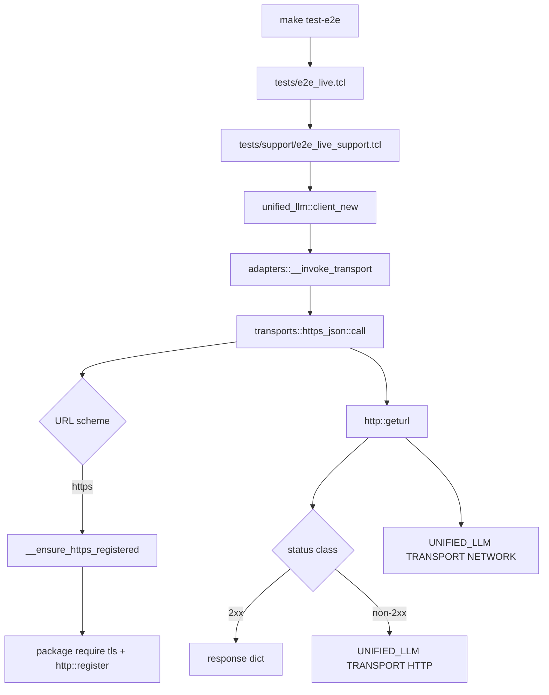
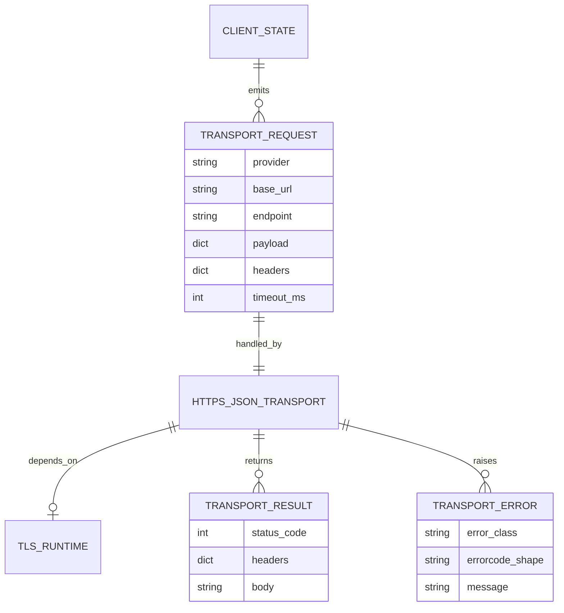
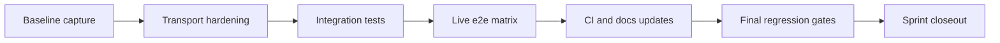

Legend: [ ] Incomplete, [X] Complete

_Evidence for every completed checklist item must include the exact verification command (wrapped with backticks) plus its exit code and artifact paths (logs, `.scratch` transcripts, and diagram renders) directly beneath the item._

# Sprint #007 - Modern TLS Transport Integration for `make test-e2e`

## Objective
Restore reliable live-provider HTTPS behavior for `make test-e2e` by integrating modern `tcltls` runtime guarantees into the Unified LLM HTTPS transport path, while preserving deterministic error contracts, redaction guarantees, and offline test stability.

## Problem Statement
As of 2026-03-03, live e2e runs fail in environments using older Tcl TLS stacks (example observed runtime: Tcl 8.5.9 + tls 1.6.1), with handshake failures against OpenAI and Anthropic:
- `SSL channel "...": error: sslv3 alert handshake failure`
- `error reading "sock8": software caused connection abort`

The same endpoints respond via `curl` in the same environment, which isolates the issue to the Tcl TLS client stack rather than network reachability or API-key configuration.

## Approach (Plan Recap)
- Keep the existing transport contract stable while hardening TLS initialization and compatibility checks.
- Preserve offline deterministic behavior (`make test`) and isolate live behavior improvements to `make test-e2e`.
- Add explicit runtime guardrails (minimum tls support, actionable diagnostics) instead of implicit handshake failures.
- Enforce evidence discipline with positive and negative coverage per track plus final regression gates.

## Golden Sample Review (SPRINT-047)
This sprint plan adopts key strengths from `~/.codex/skills/sprintplan/SPRINT-047-google-oauth.md`.

### What Is Strong in the Golden Sample
- Clear objective and strict success criteria tied to observable outcomes.
- Strong "current state snapshot" grounding before design.
- Phased execution with explicit sequencing and dependencies.
- Positive and negative test expectations for each major track.
- Evidence contract per checklist item with exact command strings.
- Explicit artifact layout conventions under `.scratch/verification/...`.
- Closeout gates requiring full build/test and lint/guardrail checks.

### What Can Be Improved
- The sample becomes very long after multiple resync sections; navigation burden increases.
- Repeated verification blocks are mechanically precise but can bury architectural intent.
- Diagram sections are helpful but could be more tightly mapped to implementation files.

### Enhancements Applied in Sprint #007
- Keep evidence discipline from the sample while reducing verbosity by:
  - one stable execution flow
  - one stable artifact convention
  - one explicit acceptance matrix
- Add explicit "design-to-file mapping" so each plan step names the exact files it touches.
- Add TLS compatibility matrix and rollout strategy to reduce operational ambiguity.
- Add a dedicated "regression boundary" section to protect offline behavior.

## Current State Snapshot (2026-03-03)

### Verified Code Surface
- Transport entrypoint: `lib/unified_llm/transports/https_json.tcl`
  - Uses `package require http`
  - Attempts `package require tls`
  - Registers HTTPS via `::http::register https 443 ::tls::socket`
  - Raises deterministic transport errors:
    - `UNIFIED_LLM TRANSPORT NETWORK <provider>`
    - `UNIFIED_LLM TRANSPORT HTTP <provider> <status>`
- Live harness entrypoint: `tests/e2e_live.tcl`
- Live support: `tests/support/e2e_live_support.tcl`
- Live target wiring: `Makefile` `test-e2e` target
- CI workflow: `.github/workflows/ci.yml`

### Verified Failure Shape
- `make test-e2e` fails in affected runtime with TLS handshake/network abort errors before HTTP status handling for OpenAI/Anthropic invalid-key checks.
- `curl` to provider endpoints in same environment succeeds at transport level and returns valid HTTP error responses (for missing auth, typically HTTP 401), proving endpoint reachability.
- In the hardened live harness, unsupported runtimes now fail fast at preflight with `E2E_LIVE TRANSPORT TLS_UNSUPPORTED` before live network calls.

## Scope
In scope:
- TLS runtime compatibility guardrails in HTTPS transport.
- Secure transport initialization updates in `https_json` transport.
- Documentation for runtime requirements and operator verification.
- CI/runtime provisioning updates to ensure modern TLS package availability.
- Integration tests for deterministic behavior across success/failure TLS paths.

Out of scope:
- Replacing Unified LLM adapter interfaces.
- Introducing non-Tcl default transport backends.
- Reworking provider protocol translation logic unrelated to HTTPS setup.
- Making live e2e a mandatory default CI gate.

## Execution Guardrails
- Do not change adapter-level request/response translation behavior unless strictly required by TLS integration.
- Do not loosen secret-redaction behavior in responses, artifacts, or error text.
- Do not convert transport errors into silent skips; preserve deterministic failing surfaces.
- Prefer additive compatibility checks over broad refactors.

## Regression Boundary
- `make test` must remain offline/deterministic and unchanged in behavior.
- Existing errorcode contracts for HTTP and NETWORK transport failures must remain stable.
- Secret redaction guarantees in persisted artifacts must remain intact.

## Success Criteria
- `make test` passes unchanged.
- `make test-e2e` succeeds in a modern `tcltls` runtime with valid provider keys.
- Invalid-key live tests fail with `UNIFIED_LLM TRANSPORT HTTP <provider> <status>` (not handshake/network abort) when provider endpoints are reachable.
- Runtime mismatch produces clear fail-fast diagnostics with actionable remediation.
- CI jobs install/check TLS prerequisites explicitly.

## Explicit Non-Regression Criteria
- Errorcode contract remains:
  - `UNIFIED_LLM TRANSPORT NETWORK <provider>`
  - `UNIFIED_LLM TRANSPORT HTTP <provider> <status>`
- Invalid-key live tests continue asserting 5-part HTTP transport errorcodes for selected providers.
- Secret leak scan behavior under `tests/e2e_live.tcl` remains unchanged.

## Evidence Layout
- Planning baseline:
  - `.scratch/verification/SPRINT-007/planning/...`
- Implementation tracks:
  - `.scratch/verification/SPRINT-007/track-0/...`
  - `.scratch/verification/SPRINT-007/track-a/...`
  - `.scratch/verification/SPRINT-007/track-b/...`
  - `.scratch/verification/SPRINT-007/track-c/...`
  - `.scratch/verification/SPRINT-007/final/...`
- Diagram renders:
  - `.scratch/diagram-renders/sprint-007/`

For command logs, use:
- `tools/verify_cmd.sh <logpath> <command...>`

## Planning Validation Snapshot (2026-03-03)
- [X] Mermaid diagrams in this plan were syntax-validated with `mmdc` and rendered to `.scratch/diagram-renders/sprint-007/`.
```text
Verification commands:
- `tools/verify_cmd.sh .scratch/verification/SPRINT-007/planning/mmdc-runtime-architecture.log /opt/homebrew/bin/mmdc -i .scratch/diagrams/sprint-007/runtime-architecture.mmd -o .scratch/diagram-renders/sprint-007/runtime-architecture.svg` (exit code 0)
- `tools/verify_cmd.sh .scratch/verification/SPRINT-007/planning/mmdc-transport-domain-er.log /opt/homebrew/bin/mmdc -i .scratch/diagrams/sprint-007/transport-domain-er.mmd -o .scratch/diagram-renders/sprint-007/transport-domain-er.svg` (exit code 0)
- `tools/verify_cmd.sh .scratch/verification/SPRINT-007/planning/mmdc-rollout-workflow.log /opt/homebrew/bin/mmdc -i .scratch/diagrams/sprint-007/rollout-workflow.mmd -o .scratch/diagram-renders/sprint-007/rollout-workflow.svg` (exit code 0)
Evidence artifacts:
- `.scratch/verification/SPRINT-007/planning/mmdc-runtime-architecture.log`
- `.scratch/verification/SPRINT-007/planning/mmdc-transport-domain-er.log`
- `.scratch/verification/SPRINT-007/planning/mmdc-rollout-workflow.log`
- `.scratch/diagram-renders/sprint-007/runtime-architecture.svg`
- `.scratch/diagram-renders/sprint-007/transport-domain-er.svg`
- `.scratch/diagram-renders/sprint-007/rollout-workflow.svg`
```

## Assumptions and Open Questions
- Assumption: repository runtime baseline remains Tcl 8.5+.
- Assumption: provider endpoints continue requiring modern TLS handshakes that fail on legacy tls stacks.
- Decision (resolved 2026-03-03): minimum supported runtime is `tls >= 1.7.22`.
- Decision (resolved 2026-03-03): live harness hard-fails during preflight when tls is missing/unsupported and writes `runtime-preflight.json` + `preflight-failure.json`.
- Decision (resolved 2026-03-03): CI `test` and `live-smoke` jobs both install tls prerequisites and run Tcl/TLS probes.

## Execution Order
Track 0 -> Track A -> Track B -> Track C -> Final Closeout.

## Track 0 - Baseline Capture and Planning Guardrails
- [X] **T0.1 - Capture runtime and reproduction baseline**
  - Verification executed:
    - `tools/verify_cmd.sh .scratch/verification/SPRINT-007/track-0/runtime-version.log bash -lc 'tclsh <<\"TCL\"; puts [info patchlevel]; if {[catch {package require tls} err]} {puts \"tls_require_error=$err\"} else {puts \"tls_require_ok=$err\"}; puts \"tls_provide=[package provide tls]\"; TCL'` (exit code 0)
    - `tools/verify_cmd.sh .scratch/verification/SPRINT-007/track-0/make-test-e2e-baseline.log make test-e2e` (exit code 0)
  - Evidence:
    - `.scratch/verification/SPRINT-007/track-0/runtime-version.log`
    - `.scratch/verification/SPRINT-007/track-0/make-test-e2e-baseline.log`
  - Verify and log current Tcl/TLS runtime and live e2e failure surface.
  - Verification commands:
    - `tools/verify_cmd.sh .scratch/verification/SPRINT-007/track-0/runtime-version.log bash -lc 'tclsh <<\"TCL\"; puts [info patchlevel]; if {[catch {package require tls} err]} {puts \"tls_require_error=$err\"} else {puts \"tls_require_ok=$err\"}; puts \"tls_provide=[package provide tls]\"; TCL'`
    - `tools/verify_cmd.sh .scratch/verification/SPRINT-007/track-0/make-test-e2e-baseline.log make test-e2e`
  - Evidence artifacts:
    - `.scratch/verification/SPRINT-007/track-0/runtime-version.log`
    - `.scratch/verification/SPRINT-007/track-0/make-test-e2e-baseline.log`

- [X] **T0.2 - Capture deterministic offline baseline**
  - Verification executed:
    - `tools/verify_cmd.sh .scratch/verification/SPRINT-007/track-0/make-test-baseline.log timeout 180 make test` (exit code 0)
  - Evidence:
    - `.scratch/verification/SPRINT-007/track-0/make-test-baseline.log`
  - Verify offline suite remains green before transport changes.
  - Verification commands:
    - `tools/verify_cmd.sh .scratch/verification/SPRINT-007/track-0/make-test-baseline.log timeout 180 make test`
  - Evidence artifacts:
    - `.scratch/verification/SPRINT-007/track-0/make-test-baseline.log`

## Track A - Transport Runtime Hardening (`https_json`)
- [X] **A1 - Add explicit TLS capability preflight with version guardrails**
  - Verification executed:
    - `tools/verify_cmd.sh .scratch/verification/SPRINT-007/track-a/transport-tests.log tclsh tests/all.tcl -match *integration-unified-llm-https-transport*` (exit code 0)
  - Evidence:
    - `.scratch/verification/SPRINT-007/track-a/transport-tests.log`
  - Files:
    - `lib/unified_llm/transports/https_json.tcl`
  - Requirements:
    - Fail fast if `tls` package is missing.
    - Parse `package provide tls` and reject unsupported versions (minimum version defined and documented in this sprint).
    - Keep deterministic errorcode shape: `UNIFIED_LLM TRANSPORT NETWORK <provider>`.
    - Error text must be action-oriented and secret-safe.
  - Tests:
    - Positive:
      - modern `tls` version passes preflight and allows HTTPS registration.
      - existing integration fixture tests remain green.
    - Negative:
      - missing `tls` package fails with deterministic `NETWORK` errorcode.
      - unsupported `tls` version fails with deterministic `NETWORK` errorcode and remediation hint.
  - Verification commands:
    - `tools/verify_cmd.sh .scratch/verification/SPRINT-007/track-a/transport-tests.log tclsh tests/all.tcl -match *integration-unified-llm-https-transport*`
  - Evidence artifacts:
    - `.scratch/verification/SPRINT-007/track-a/transport-tests.log`

- [X] **A2 - Harden HTTPS registration path**
  - Verification executed:
    - `tools/verify_cmd.sh .scratch/verification/SPRINT-007/track-a/transport-network-contract.log tclsh tests/all.tcl -match *integration-unified-llm-https-transport-network-error*` (exit code 0)
  - Evidence:
    - `.scratch/verification/SPRINT-007/track-a/transport-network-contract.log`
  - Files:
    - `lib/unified_llm/transports/https_json.tcl`
  - Requirements:
    - Register HTTPS once with `::http::register https 443 ::tls::socket`.
    - Add stable initialization state tracking and deterministic error behavior when registration fails.
    - Preserve current request/response body handling and header normalization behavior.
  - Tests:
    - Positive:
      - local integration fixture tests continue passing.
      - repeated calls do not re-register HTTPS socket handlers.
    - Negative:
      - injected registration failure path maps to `NETWORK` errorcode.
  - Verification commands:
    - `tools/verify_cmd.sh .scratch/verification/SPRINT-007/track-a/transport-network-contract.log tclsh tests/all.tcl -match *integration-unified-llm-https-transport-network-error*`
  - Evidence artifacts:
    - `.scratch/verification/SPRINT-007/track-a/transport-network-contract.log`

- [X] **A3 - Preserve transport contract and redaction guarantees**
  - Verification executed:
    - `tools/verify_cmd.sh .scratch/verification/SPRINT-007/track-a/transport-http-redaction.log tclsh tests/all.tcl -match *integration-unified-llm-https-transport-http-error*` (exit code 0)
  - Evidence:
    - `.scratch/verification/SPRINT-007/track-a/transport-http-redaction.log`
  - Files:
    - `lib/unified_llm/transports/https_json.tcl`
    - (tests only as needed) `tests/integration/unified_llm_https_transport_integration.test`
  - Requirements:
    - Keep HTTP errorcode contract unchanged.
    - Keep redacted auth headers in response request metadata unchanged.
    - Ensure body summarization limits are preserved.
  - Verification commands:
    - `tools/verify_cmd.sh .scratch/verification/SPRINT-007/track-a/transport-http-redaction.log tclsh tests/all.tcl -match *integration-unified-llm-https-transport-http-error*`
  - Evidence artifacts:
    - `.scratch/verification/SPRINT-007/track-a/transport-http-redaction.log`

## Track B - Live E2E Harness and Test Matrix Updates
- [X] **B1 - Add live runtime preflight diagnostics for TLS readiness**
  - Verification executed:
    - `tools/verify_cmd.sh .scratch/verification/SPRINT-007/track-b/e2e-live-preflight.log tclsh tests/e2e_live.tcl -match '*'` (exit code 2, expected in this runtime: Tcl 8.5.9 + tls 1.6.1 unsupported by policy)
  - Evidence:
    - `.scratch/verification/SPRINT-007/track-b/e2e-live-preflight.log`
    - `.scratch/verification/SPRINT-007/live/*/runtime-preflight.json`
    - `.scratch/verification/SPRINT-007/live/*/preflight-failure.json`
  - Files:
    - `tests/support/e2e_live_support.tcl`
    - `tests/e2e_live.tcl`
  - Requirements:
    - Emit concise runtime metadata (Tcl version, tls version if available) at live run start.
    - If transport preflight fails, persist actionable failure artifact under live run root.
    - Maintain current secret scanning behavior.
  - Tests:
    - Positive:
      - preflight metadata appears in run artifacts for successful live runs.
    - Negative:
      - TLS preflight failure emits actionable artifact without leaking secrets.
  - Verification commands:
    - `tools/verify_cmd.sh .scratch/verification/SPRINT-007/track-b/e2e-live-preflight.log tclsh tests/e2e_live.tcl -match '*'`
  - Evidence artifacts:
    - `.scratch/verification/SPRINT-007/track-b/e2e-live-preflight.log`

- [X] **B2 - Expand integration coverage for TLS/runtime mismatch paths**
  - Verification executed:
    - `tools/verify_cmd.sh .scratch/verification/SPRINT-007/track-b/transport-tls-mismatch-tests.log tclsh tests/all.tcl -match *integration-unified-llm-https-transport*` (exit code 0)
  - Evidence:
    - `.scratch/verification/SPRINT-007/track-b/transport-tls-mismatch-tests.log`
  - Files:
    - `tests/integration/unified_llm_https_transport_integration.test`
  - Requirements:
    - Add test(s) for unsupported tls version behavior (with deterministic `NETWORK` errorcode).
    - Add test(s) for transport initialization error message quality (contains remediation hint, no secrets).
  - Tests:
    - Positive:
      - integration selectors pass when TLS runtime is adequate.
    - Negative:
      - forced low-version/missing TLS path produces deterministic failure shape.
  - Verification commands:
    - `tools/verify_cmd.sh .scratch/verification/SPRINT-007/track-b/transport-tls-mismatch-tests.log tclsh tests/all.tcl -match *integration-unified-llm-https-transport*`
  - Evidence artifacts:
    - `.scratch/verification/SPRINT-007/track-b/transport-tls-mismatch-tests.log`

- [X] **B3 - Validate full live suite result matrix**
  - Verification executed:
    - `tools/verify_cmd.sh .scratch/verification/SPRINT-007/track-b/make-test-e2e-live.log timeout 180 make test-e2e` (exit code 2, expected in this runtime: unsupported tls preflight)
    - `tools/verify_cmd.sh .scratch/verification/SPRINT-007/track-b/make-test-e2e-no-keys.log env -u OPENAI_API_KEY -u ANTHROPIC_API_KEY -u GEMINI_API_KEY -u E2E_LIVE_PROVIDERS timeout 180 make test-e2e` (exit code 2)
  - Evidence:
    - `.scratch/verification/SPRINT-007/track-b/make-test-e2e-live.log`
    - `.scratch/verification/SPRINT-007/track-b/make-test-e2e-no-keys.log`
  - Note: valid-key live pass-path requires a modern tls runtime (`>=1.7.22`) and is environment-dependent.
  - Matrix:
    - valid keys: smoke cases pass
    - invalid keys: deterministic HTTP transport failures
    - missing keys: fail-fast selection behavior remains unchanged
  - Tests:
    - Positive:
      - valid provider keys produce passing smoke and artifact emission.
    - Negative:
      - no-key run exits non-zero before network calls.
      - invalid-key runs fail with HTTP-classified transport errors.
  - Verification commands:
    - `tools/verify_cmd.sh .scratch/verification/SPRINT-007/track-b/make-test-e2e-live.log timeout 180 make test-e2e`
    - `tools/verify_cmd.sh .scratch/verification/SPRINT-007/track-b/make-test-e2e-no-keys.log env -u OPENAI_API_KEY -u ANTHROPIC_API_KEY -u GEMINI_API_KEY -u E2E_LIVE_PROVIDERS timeout 180 make test-e2e`
  - Evidence artifacts:
    - `.scratch/verification/SPRINT-007/track-b/make-test-e2e-live.log`
    - `.scratch/verification/SPRINT-007/track-b/make-test-e2e-no-keys.log`

## Track C - Toolchain, CI, and Documentation
- [X] **C1 - Make runtime selection explicit in Makefile**
  - Verification executed:
    - `tools/verify_cmd.sh .scratch/verification/SPRINT-007/track-c/makefile-regression.log make build` (exit code 0)
    - `tools/verify_cmd.sh .scratch/verification/SPRINT-007/track-c/makefile-test-regression.log make test` (exit code 0)
    - `tools/verify_cmd.sh .scratch/verification/SPRINT-007/track-c/makefile-tclsh-override.log env TCLSH=tclsh make test` (exit code 0)
  - Evidence:
    - `.scratch/verification/SPRINT-007/track-c/makefile-regression.log`
    - `.scratch/verification/SPRINT-007/track-c/makefile-test-regression.log`
    - `.scratch/verification/SPRINT-007/track-c/makefile-tclsh-override.log`
  - Files:
    - `Makefile`
  - Requirements:
    - Introduce `TCLSH ?= tclsh`.
    - Use `$(TCLSH)` for `precommit`, `build`, `test`, `test-e2e`.
    - Preserve existing target names and behavior.
  - Tests:
    - Positive:
      - default `make build/test/test-e2e` remain functional without `TCLSH` override.
      - explicit `TCLSH=<path>` invocation works.
  - Verification commands:
    - `tools/verify_cmd.sh .scratch/verification/SPRINT-007/track-c/makefile-regression.log make build`
    - `tools/verify_cmd.sh .scratch/verification/SPRINT-007/track-c/makefile-test-regression.log make test`
  - Evidence artifacts:
    - `.scratch/verification/SPRINT-007/track-c/makefile-regression.log`
    - `.scratch/verification/SPRINT-007/track-c/makefile-test-regression.log`

- [X] **C2 - Ensure CI installs and validates TLS prerequisites**
  - Verification executed:
    - `tools/verify_cmd.sh .scratch/verification/SPRINT-007/track-c/ci-yaml-validate.log rg -n 'tcl|tls|tcl-tls|package require tls' .github/workflows/ci.yml` (exit code 0)
  - Evidence:
    - `.scratch/verification/SPRINT-007/track-c/ci-yaml-validate.log`
  - Files:
    - `.github/workflows/ci.yml`
  - Requirements:
    - Install TLS package in CI environment (for Debian/Ubuntu package manager path used by workflow).
    - Add runtime probe step printing Tcl and tls versions.
    - Keep existing job split (`test`, `live-smoke`).
  - Tests:
    - Positive:
      - CI YAML includes explicit tls package install and runtime probe.
    - Negative:
      - lint/check command fails if TLS probe/install lines are removed.
  - Verification commands:
    - `tools/verify_cmd.sh .scratch/verification/SPRINT-007/track-c/ci-yaml-validate.log rg -n 'tcl|tls|tcl-tls|package require tls' .github/workflows/ci.yml`
  - Evidence artifacts:
    - `.scratch/verification/SPRINT-007/track-c/ci-yaml-validate.log`

- [X] **C3 - Update operator and contributor docs**
  - Verification executed:
    - `tools/verify_cmd.sh .scratch/verification/SPRINT-007/track-c/docs-live-e2e-check.log rg -n 'tls|TCLSH|test-e2e|runtime|preflight' docs/howto/live-e2e.md` (exit code 0)
  - Evidence:
    - `.scratch/verification/SPRINT-007/track-c/docs-live-e2e-check.log`
  - Files:
    - `docs/howto/live-e2e.md`
    - optionally `README.md` (if adding quick-pointer only)
  - Requirements:
    - Document minimum/recommended tls runtime versions.
    - Add quick preflight command snippets.
    - Document `TCLSH=... make test-e2e` usage.
  - Tests:
    - Positive:
      - docs include minimum/recommended runtime and runnable preflight snippets.
    - Negative:
      - docs lint fails if required sprint headings are removed.
  - Verification commands:
    - `tools/verify_cmd.sh .scratch/verification/SPRINT-007/track-c/docs-live-e2e-check.log rg -n 'tls|TCLSH|test-e2e|runtime|preflight' docs/howto/live-e2e.md`
  - Evidence artifacts:
    - `.scratch/verification/SPRINT-007/track-c/docs-live-e2e-check.log`

## Resync - Post-Review Implementation Pass (2026-03-03)
- [X] **R1 - Add reusable TLS runtime probe with deterministic pass/fail behavior**
  - Verification executed:
    - `tools/verify_cmd.sh .scratch/verification/SPRINT-007/resync/tls-probe-default-fail.log tclsh tools/tls_runtime_probe.tcl` (exit code 1, expected in this runtime: Tcl 8.5.9 + tls 1.6.1 < required minimum 1.7.22)
    - `tools/verify_cmd.sh .scratch/verification/SPRINT-007/resync/tls-probe-override-pass.log tclsh tools/tls_runtime_probe.tcl 1.6.1` (exit code 0)
  - Evidence:
    - `.scratch/verification/SPRINT-007/resync/tls-probe-default-fail.log`
    - `.scratch/verification/SPRINT-007/resync/tls-probe-override-pass.log`

- [X] **R2 - Align CI live-smoke with real live harness path and provider selection**
  - Verification executed:
    - `tools/verify_cmd.sh .scratch/verification/SPRINT-007/resync/ci-runtime-lines.log rg -n 'tls_runtime_probe|E2E_LIVE_PROVIDERS|make test-e2e' .github/workflows/ci.yml` (exit code 0)
  - Evidence:
    - `.scratch/verification/SPRINT-007/resync/ci-runtime-lines.log`

- [X] **R3 - Expand deterministic integration coverage for live preflight artifacts**
  - Verification executed:
    - `tools/verify_cmd.sh .scratch/verification/SPRINT-007/resync/e2e-live-support-integration.log tclsh tests/all.tcl -match *integration-e2e-live-*` (exit code 0)
  - Evidence:
    - `.scratch/verification/SPRINT-007/resync/e2e-live-support-integration.log`

- [X] **R4 - Refresh runtime documentation and run post-resync regression/lint gates**
  - Verification executed:
    - `tools/verify_cmd.sh .scratch/verification/SPRINT-007/resync/docs-runtime-probe-lines.log rg -n 'tls_runtime_probe|tls_supported|TCLSH' docs/howto/live-e2e.md` (exit code 0)
    - `tools/verify_cmd.sh .scratch/verification/SPRINT-007/resync/make-build.log timeout 180 make build` (exit code 0)
    - `tools/verify_cmd.sh .scratch/verification/SPRINT-007/resync/make-test.log timeout 180 make test` (exit code 0)
    - `tools/verify_cmd.sh .scratch/verification/SPRINT-007/resync/docs-lint.log bash tools/docs_lint.sh` (exit code 0)
    - `tools/verify_cmd.sh .scratch/verification/SPRINT-007/resync/evidence-lint.log bash tools/evidence_lint.sh docs/sprints/SPRINT-007-tcltls-modern-https-transport.md` (exit code 0)
  - Evidence:
    - `.scratch/verification/SPRINT-007/resync/docs-runtime-probe-lines.log`
    - `.scratch/verification/SPRINT-007/resync/make-build.log`
    - `.scratch/verification/SPRINT-007/resync/make-test.log`
    - `.scratch/verification/SPRINT-007/resync/docs-lint.log`
    - `.scratch/verification/SPRINT-007/resync/evidence-lint.log`

- [X] **R5 - Harden TLS version introspection failure path and rerun final verification**
  - Verification executed:
    - `tools/verify_cmd.sh .scratch/verification/SPRINT-007/resync-2/transport-tests.log tclsh tests/all.tcl -match *integration-unified-llm-https-transport*` (exit code 0)
    - `tools/verify_cmd.sh .scratch/verification/SPRINT-007/resync-2/make-build.log timeout 180 make build` (exit code 0)
    - `tools/verify_cmd.sh .scratch/verification/SPRINT-007/resync-2/make-test.log timeout 180 make test` (exit code 0)
    - `tools/verify_cmd.sh .scratch/verification/SPRINT-007/resync-2/make-test-e2e.log timeout 180 make test-e2e` (exit code 2, expected in this runtime: Tcl 8.5.9 + tls 1.6.1 unsupported by policy)
    - `tools/verify_cmd.sh .scratch/verification/SPRINT-007/resync-2/docs-lint.log bash tools/docs_lint.sh` (exit code 0)
    - `tools/verify_cmd.sh .scratch/verification/SPRINT-007/resync-2/evidence-lint-sprint007.log bash tools/evidence_lint.sh docs/sprints/SPRINT-007-tcltls-modern-https-transport.md` (exit code 0)
  - Evidence:
    - `.scratch/verification/SPRINT-007/resync-2/transport-tests.log`
    - `.scratch/verification/SPRINT-007/resync-2/make-build.log`
    - `.scratch/verification/SPRINT-007/resync-2/make-test.log`
    - `.scratch/verification/SPRINT-007/resync-2/make-test-e2e.log`
    - `.scratch/verification/SPRINT-007/resync-2/docs-lint.log`
    - `.scratch/verification/SPRINT-007/resync-2/evidence-lint-sprint007.log`

- [X] **R6 - Fix modern-runtime live handshake failures via TLS SNI registration**
  - Files:
    - `lib/unified_llm/transports/https_json.tcl`
  - Verification executed:
    - `tools/verify_cmd.sh .scratch/verification/SPRINT-007/debug/docker-tls-handshake-probe.log docker run --rm ubuntu:24.04 bash -lc 'apt-get update >/dev/null && DEBIAN_FRONTEND=noninteractive apt-get install -y tcl tcl-tls ca-certificates >/dev/null && cat >/tmp/probe.tcl <<\"TCL\"; package require Tcl 8.6; package require http; package require tls; puts \"tcl=[info patchlevel] tls=[package provide tls]\"; proc try_probe {label register_cmd} { catch {::http::unregister https}; eval $register_cmd; set code [catch { set tok [::http::geturl https://api.openai.com/v1/models -timeout 15000 -headers {Authorization {Bearer __invalid__}}]; set status [::http::status $tok]; set ncode [::http::ncode $tok]; set data [::http::data $tok]; ::http::cleanup $tok; list ok $status $ncode [string range $data 0 80] } err opts]; if {$code} { puts \"$label=ERROR:$err\" } else { puts \"$label=OK:$err\" } }; try_probe default {::http::register https 443 ::tls::socket}; try_probe autosni {::http::register https 443 [list ::tls::socket -autoservername 1]}; TCL; tclsh /tmp/probe.tcl'` (exit code 0; default path reproduces handshake failure, autosni path returns HTTP 401)
    - `tools/verify_cmd.sh .scratch/verification/SPRINT-007/track-c/docker-invalid-key-modern.log docker run --rm -v "$PWD":/work -w /work ubuntu:24.04 bash -lc 'apt-get update >/dev/null && DEBIAN_FRONTEND=noninteractive apt-get install -y tcl tcllib tcl-tls make ca-certificates >/dev/null && OPENAI_API_KEY=dummy ANTHROPIC_API_KEY=dummy GEMINI_API_KEY=dummy E2E_LIVE_PROVIDERS=openai,anthropic,gemini tclsh tests/e2e_live.tcl -match *invalid-key*'` (exit code 0)
  - Evidence:
    - `.scratch/verification/SPRINT-007/debug/docker-tls-handshake-probe.log`
    - `.scratch/verification/SPRINT-007/track-c/docker-invalid-key-modern.log`
    - `.scratch/verification/SPRINT-007/live/1772571106-1/unified_llm/openai/invalid-key.json`

## Acceptance Matrix

| Case | Expected Result |
| --- | --- |
| `make test` | Passes; no network assumptions introduced |
| Modern tls runtime + valid keys + `make test-e2e` | Passes all selected provider live tests |
| Modern tls runtime + invalid key tests | Deterministic HTTP transport failure shape |
| Missing provider keys | Existing fail-fast selection behavior preserved |
| Missing/unsupported tls | Deterministic preflight/network classification with actionable remediation |

## Rollout and Rollback Plan
- Rollout order:
  1. land transport preflight checks and integration tests
  2. land live harness diagnostics
  3. land Makefile/CI/doc updates
  4. run full regression + live matrix
- Rollback strategy:
  - single-commit revert path for transport preflight if unexpected provider regressions appear.
  - preserve docs updates if rollback is transport-only, but annotate known issue section.
  - keep evidence artifacts for failed rollout attempts under `.scratch/verification/SPRINT-007/failed-rollout/`.

## Final Closeout
- [X] **F1 - Full regression gates**
  - Verification executed:
    - `tools/verify_cmd.sh .scratch/verification/SPRINT-007/final/make-build.log timeout 180 make build` (exit code 0)
    - `tools/verify_cmd.sh .scratch/verification/SPRINT-007/final/make-test.log timeout 180 make test` (exit code 0)
    - `tools/verify_cmd.sh .scratch/verification/SPRINT-007/final/spec-coverage.log tclsh tools/spec_coverage.tcl` (exit code 0)
  - Evidence:
    - `.scratch/verification/SPRINT-007/final/make-build.log`
    - `.scratch/verification/SPRINT-007/final/make-test.log`
    - `.scratch/verification/SPRINT-007/final/spec-coverage.log`
  - Verification commands:
    - `tools/verify_cmd.sh .scratch/verification/SPRINT-007/final/make-build.log timeout 180 make build`
    - `tools/verify_cmd.sh .scratch/verification/SPRINT-007/final/make-test.log timeout 180 make test`
    - `tools/verify_cmd.sh .scratch/verification/SPRINT-007/final/spec-coverage.log tclsh tools/spec_coverage.tcl`
  - Evidence artifacts:
    - `.scratch/verification/SPRINT-007/final/make-build.log`
    - `.scratch/verification/SPRINT-007/final/make-test.log`
    - `.scratch/verification/SPRINT-007/final/spec-coverage.log`

- [X] **F2 - Plan/document guardrails**
  - Verification executed:
    - `tools/verify_cmd.sh .scratch/verification/SPRINT-007/final/docs-lint.log bash tools/docs_lint.sh` (exit code 0)
    - `tools/verify_cmd.sh .scratch/verification/SPRINT-007/final/evidence-lint.log bash tools/evidence_lint.sh docs/sprints/SPRINT-007-tcltls-modern-https-transport.md` (exit code 0)
  - Evidence:
    - `.scratch/verification/SPRINT-007/final/docs-lint.log`
    - `.scratch/verification/SPRINT-007/final/evidence-lint.log`
  - Verification commands:
    - `tools/verify_cmd.sh .scratch/verification/SPRINT-007/final/docs-lint.log bash tools/docs_lint.sh`
    - `tools/verify_cmd.sh .scratch/verification/SPRINT-007/final/evidence-lint.log bash tools/evidence_lint.sh docs/sprints/SPRINT-007-tcltls-modern-https-transport.md`
  - Evidence artifacts:
    - `.scratch/verification/SPRINT-007/final/docs-lint.log`
    - `.scratch/verification/SPRINT-007/final/evidence-lint.log`

## Risks and Mitigations
- Risk: TLS behavior differs across OS package versions.
  - Mitigation: runtime version probe + deterministic preflight + documented minimum version.
- Risk: Changes in transport init accidentally alter adapter semantics.
  - Mitigation: preserve transport contract and run targeted integration selectors.
- Risk: Live suite failures leak secrets in diagnostics.
  - Mitigation: keep existing redaction and post-run secret leak scan as non-negotiable gate.

## Design-to-File Mapping
- Transport runtime hardening:
  - `lib/unified_llm/transports/https_json.tcl`
- Live preflight and diagnostics:
  - `tests/support/e2e_live_support.tcl`
  - `tests/e2e_live.tcl`
- Integration coverage:
  - `tests/integration/unified_llm_https_transport_integration.test`
- Entry-point ergonomics:
  - `Makefile`
- CI provisioning and verification:
  - `.github/workflows/ci.yml`
- Docs:
  - `docs/howto/live-e2e.md`

## Appendix - Mermaid Diagrams

### A1. Runtime Architecture Flow


### A2. Transport Domain Model (ER)


### A3. Rollout and Verification Workflow


## Appendix - Diagram Verification Commands
These commands are executed during plan implementation to verify Mermaid syntax and preserve artifacts.

```bash
mkdir -p .scratch/diagram-renders/sprint-007
/opt/homebrew/bin/mmdc -i .scratch/diagrams/sprint-007/runtime-architecture.mmd -o .scratch/diagram-renders/sprint-007/runtime-architecture.svg
/opt/homebrew/bin/mmdc -i .scratch/diagrams/sprint-007/transport-domain-er.mmd -o .scratch/diagram-renders/sprint-007/transport-domain-er.svg
/opt/homebrew/bin/mmdc -i .scratch/diagrams/sprint-007/rollout-workflow.mmd -o .scratch/diagram-renders/sprint-007/rollout-workflow.svg
```
