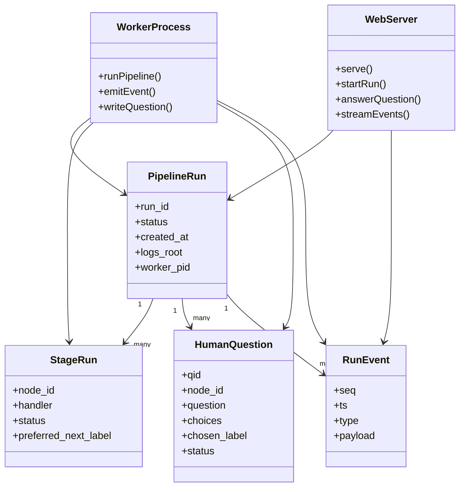
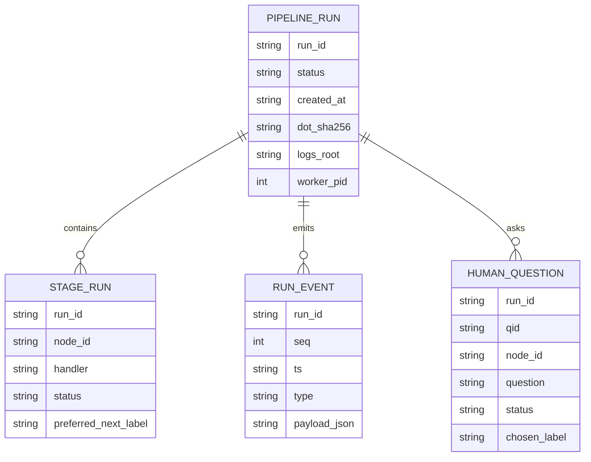
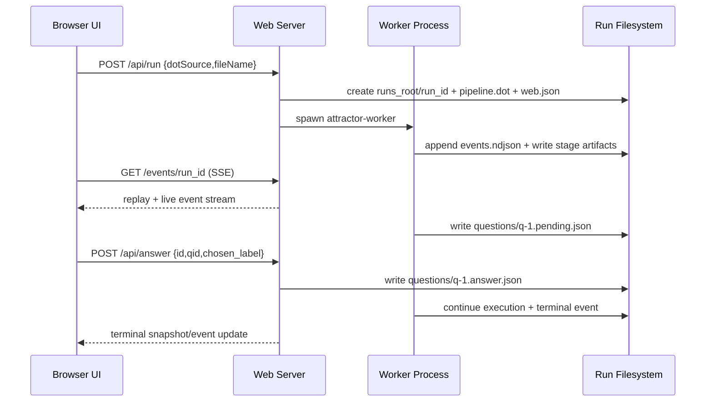
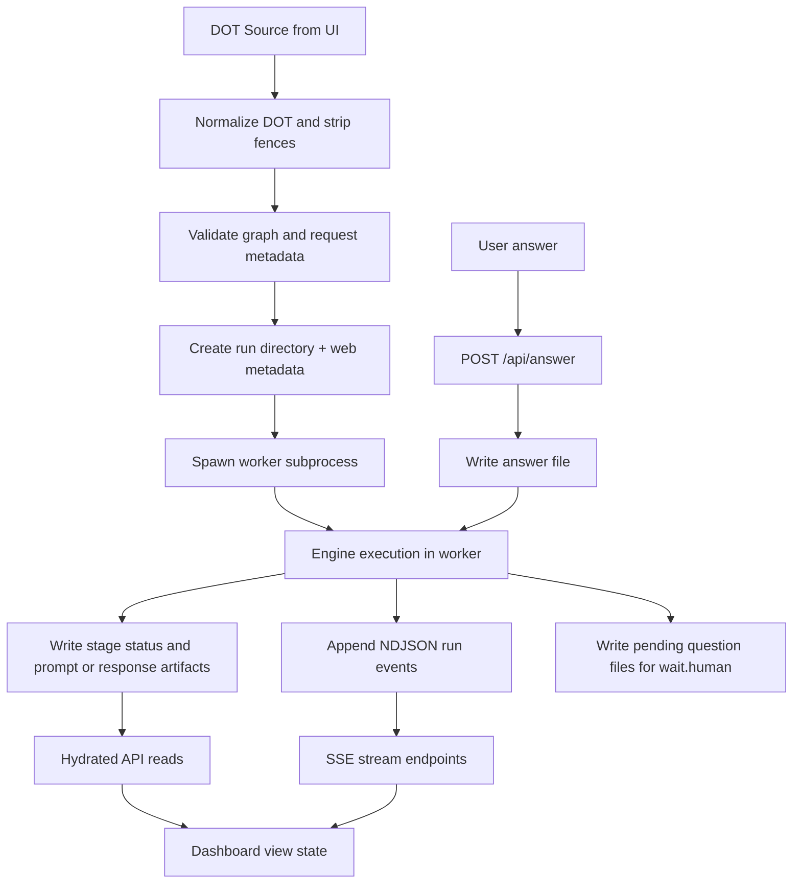
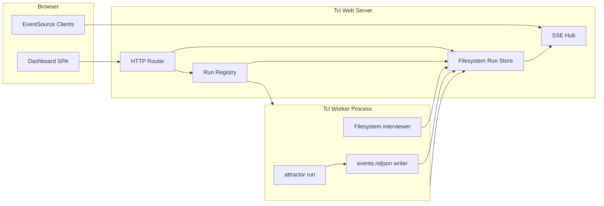

Legend: [ ] Incomplete, [X] Complete

# Sprint #008 Comprehensive Implementation Plan - Web UI Dashboard

## Objective
Implement Sprint #008 end-to-end so `attractor-tcl` ships a local-first web dashboard with worker-backed pipeline execution, SSE streaming, web-operable `wait.human` gates, deterministic filesystem artifacts, and full regression coverage.

## Source Scope
Primary planning source:
- `docs/sprints/SPRINT-008-web-ui-dashboard.md`

Normative/contract inputs:
- `attractor-spec.md` (Sections 9.5 and 9.6, plus node ID constraints)
- `docs/spec-coverage/traceability.md`
- `docs/ADR.md`

Implementation surfaces in scope:
- `bin/attractor`
- `lib/attractor/main.tcl`
- `pkgIndex.tcl`
- new `lib/attractor_web/` package
- new `bin/attractor-worker`
- tests under `tests/unit/`, `tests/integration/`, `tests/e2e/`, and `tests/support/`

## Current State Snapshot (2026-03-04)
- `bin/attractor` currently supports `run|validate` only; no `serve` mode.
- `::attractor::run` is synchronous, filesystem-writing, and has interviewer injection, but has no event callback contract.
- `wait.human` exists for queue/console interviewer flows, but no HTTP/web control path exists.
- No `attractor_web` package or HTTP/SSE endpoint implementation exists in `lib/`.
- Test harness (`tests/all.tcl`) is deterministic and offline with unit/integration/e2e suites already wired.
- `ATR-REQ-HUMAN-GATES-MUST-OPERABLE-VIA-WEB` currently maps to non-web tests and must be remapped after implementation.

## Plan Completion Status
- [X] Sprint #008 implementation baseline review completed against current repository state.
```text
Verification commands:
- `tools/verify_cmd.sh .scratch/verification/SPRINT-008/planning-comprehensive/state-scan.log rg -n "serve|proc ::attractor::run|ATR-REQ-HUMAN-GATES-MUST-OPERABLE-VIA-WEB|package ifneeded attractor" bin lib docs/spec-coverage/traceability.md pkgIndex.tcl` (exit code 0)

Evidence artifacts:
- `.scratch/verification/SPRINT-008/planning-comprehensive/state-scan.log`
```
- [X] Mermaid appendix diagrams for this comprehensive plan rendered successfully with `mmdc`.
```text
Verification commands:
- `tools/verify_cmd.sh .scratch/verification/SPRINT-008/planning-comprehensive/mmdc-architecture.log mmdc -i .scratch/diagrams/sprint-008-comprehensive/architecture.mmd -o .scratch/diagram-renders/sprint-008-comprehensive/architecture.svg` (exit code 0)
- `tools/verify_cmd.sh .scratch/verification/SPRINT-008/planning-comprehensive/mmdc-core-domain-model.log mmdc -i .scratch/diagrams/sprint-008-comprehensive/core-domain-model.mmd -o .scratch/diagram-renders/sprint-008-comprehensive/core-domain-model.svg` (exit code 0)
- `tools/verify_cmd.sh .scratch/verification/SPRINT-008/planning-comprehensive/mmdc-er-model.log mmdc -i .scratch/diagrams/sprint-008-comprehensive/er-model.mmd -o .scratch/diagram-renders/sprint-008-comprehensive/er-model.svg` (exit code 0)
- `tools/verify_cmd.sh .scratch/verification/SPRINT-008/planning-comprehensive/mmdc-workflow.log mmdc -i .scratch/diagrams/sprint-008-comprehensive/workflow.mmd -o .scratch/diagram-renders/sprint-008-comprehensive/workflow.svg` (exit code 0)
- `tools/verify_cmd.sh .scratch/verification/SPRINT-008/planning-comprehensive/mmdc-data-flow.log mmdc -i .scratch/diagrams/sprint-008-comprehensive/data-flow.mmd -o .scratch/diagram-renders/sprint-008-comprehensive/data-flow.svg` (exit code 0)

Evidence artifacts:
- `.scratch/verification/SPRINT-008/planning-comprehensive/mmdc-architecture.log`
- `.scratch/verification/SPRINT-008/planning-comprehensive/mmdc-core-domain-model.log`
- `.scratch/verification/SPRINT-008/planning-comprehensive/mmdc-er-model.log`
- `.scratch/verification/SPRINT-008/planning-comprehensive/mmdc-workflow.log`
- `.scratch/verification/SPRINT-008/planning-comprehensive/mmdc-data-flow.log`
- `.scratch/diagram-renders/sprint-008-comprehensive/architecture.svg`
- `.scratch/diagram-renders/sprint-008-comprehensive/core-domain-model.svg`
- `.scratch/diagram-renders/sprint-008-comprehensive/er-model.svg`
- `.scratch/diagram-renders/sprint-008-comprehensive/workflow.svg`
- `.scratch/diagram-renders/sprint-008-comprehensive/data-flow.svg`
```
- [X] Implementation work tracks were executed and validated against this blueprint.
```text
Verification commands:
- `tools/verify_cmd.sh .scratch/verification/SPRINT-008/final/make-build.log timeout 180 make build` (exit code 0)
- `tools/verify_cmd.sh .scratch/verification/SPRINT-008/final/make-test.log timeout 180 make test` (exit code 0)
- `tools/verify_cmd.sh .scratch/verification/SPRINT-008/final/spec-coverage.log tclsh tools/spec_coverage.tcl` (exit code 0)
Evidence artifacts:
- `.scratch/verification/SPRINT-008/final/make-build.log`
- `.scratch/verification/SPRINT-008/final/make-test.log`
- `.scratch/verification/SPRINT-008/final/spec-coverage.log`
```

## Execution Strategy
- Keep web mode additive to existing CLI behavior (`run|validate` remain stable).
- Use worker subprocesses for run isolation and server responsiveness.
- Persist all runtime state to filesystem under `runs_root`.
- Use deterministic NDJSON event logs as SSE source of truth.
- Avoid feature flags and legacy compatibility branches; Sprint #008 behavior is the canonical path.

## Execution Order
Phase 0 -> Phase 1 -> Phase 2 -> Phase 3 -> Phase 4 -> Phase 5 -> Final Closeout

## Phase 0 - Contracts, ADR, and Baseline Guardrails
### Deliverables
- [ ] P0.1 Add ADR entry for Sprint #008 architecture decisions (web server, worker model, run-store layout, SSE contract).
```text
{placeholder for verification justification/reasoning and evidence log}
```
- [ ] P0.2 Update traceability mappings for web-operable human gates and event-stream requirements to reference new web modules and tests.
```text
{placeholder for verification justification/reasoning and evidence log}
```
- [ ] P0.3 Lock run directory contract and event schema constants in code-level docs/comments for server-worker parity.
```text
{placeholder for verification justification/reasoning and evidence log}
```
- [ ] P0.4 Add baseline verification harness layout under `.scratch/verification/SPRINT-008/` for phase-scoped evidence capture.
```text
{placeholder for verification justification/reasoning and evidence log}
```

### Positive Test Cases
1. `tclsh tools/spec_coverage.tcl` passes after traceability updates.
2. ADR log contains a complete Sprint #008 decision with context, alternatives, and consequences.
3. Evidence paths referenced in sprint docs resolve to real files.

### Negative Test Cases
1. Malformed or missing traceability blocks fail `tools/spec_coverage.tcl`.
2. Missing ADR entry blocks closeout acceptance for architecture-critical changes.
3. Evidence references without command/exit data fail `tools/evidence_lint.sh`.

### Acceptance Criteria (Phase 0)
- [ ] Architecture and traceability contracts are updated and validated before implementation tracks proceed.
```text
{placeholder for verification justification/reasoning and evidence log}
```
- [ ] Baseline verification structure exists and is ready for phase-by-phase command logging.
```text
{placeholder for verification justification/reasoning and evidence log}
```

## Phase 1 - Engine Event Hooks and Worker Runtime
### Deliverables
- [ ] P1.1 Extend `::attractor::run` with optional `-on_event` callback and stable event payload shape (`seq`, `ts`, `run_id`, `type`, payload fields).
```text
{placeholder for verification justification/reasoning and evidence log}
```
- [ ] P1.2 Emit lifecycle events at deterministic points: pipeline start, stage start/complete, interview start/complete, checkpoint saved, pipeline terminal state.
```text
{placeholder for verification justification/reasoning and evidence log}
```
- [ ] P1.3 Add filesystem-backed interviewer implementation for `wait.human` (`questions/*.pending.json` and `questions/*.answer.json` handshake).
```text
{placeholder for verification justification/reasoning and evidence log}
```
- [ ] P1.4 Add deterministic timeout/failure behavior for unanswered human questions with readable failure reason artifacts.
```text
{placeholder for verification justification/reasoning and evidence log}
```
- [ ] P1.5 Create `bin/attractor-worker` to run one pipeline in isolated process, write `pipeline.dot` and `web.json`, and append `events.ndjson`.
```text
{placeholder for verification justification/reasoning and evidence log}
```
- [ ] P1.6 Add worker-focused tests covering success, validation failure, unanswered-interview timeout, and event sequence integrity.
```text
{placeholder for verification justification/reasoning and evidence log}
```

### Positive Test Cases
1. Worker success run writes `manifest.json`, `checkpoint.json`, per-node artifacts, and ordered `events.ndjson`.
2. `wait.human` stage blocks and resumes when answer file appears with valid choice label.
3. Event callback disabled path preserves existing CLI artifact behavior.
4. Event sequence numbers are contiguous and monotonic per run.

### Negative Test Cases
1. Invalid DOT fails worker with deterministic error artifact and non-zero exit status.
2. Human answer file with unknown `qid` or invalid label is rejected deterministically.
3. Interview timeout path yields terminal failure reason and preserves diagnostic artifacts.
4. Callback exceptions do not silently corrupt run state; they surface as deterministic failures.

### Acceptance Criteria (Phase 1)
- [ ] Worker and engine eventing contracts are implemented and regression-protected.
```text
{placeholder for verification justification/reasoning and evidence log}
```
- [ ] `wait.human` filesystem interviewer supports both success and timeout/failure flows with deterministic artifacts.
```text
{placeholder for verification justification/reasoning and evidence log}
```

## Phase 2 - Web Server Core and REST Surface
### Deliverables
- [ ] P2.1 Add `attractor_web` package (`lib/attractor_web/main.tcl` plus modular helpers) and register it in `pkgIndex.tcl`.
```text
{placeholder for verification justification/reasoning and evidence log}
```
- [ ] P2.2 Extend `bin/attractor` CLI with `serve` subcommand and flags: `--web-port`, `--bind`, `--runs-root`.
```text
{placeholder for verification justification/reasoning and evidence log}
```
- [ ] P2.3 Implement minimal HTTP server/router using Tcl sockets with strict request parsing and JSON response helpers.
```text
{placeholder for verification justification/reasoning and evidence log}
```
- [ ] P2.4 Implement run registry for worker spawn/supervision, PID capture, and startup rehydration by scanning existing run directories.
```text
{placeholder for verification justification/reasoning and evidence log}
```
- [ ] P2.5 Implement endpoints: `GET /`, `GET /api/pipelines`, `POST /api/run`, `GET /api/pipeline`, `GET /api/stage`, `POST /api/answer`, `POST /api/render`.
```text
{placeholder for verification justification/reasoning and evidence log}
```
- [ ] P2.6 Implement DOT normalization (markdown fence stripping) for run/render routes and deterministic validation errors (`INVALID_DOT_SOURCE`, `INVALID_FILE_NAME`, `INVALID_JSON`, `NOT_FOUND`).
```text
{placeholder for verification justification/reasoning and evidence log}
```
- [ ] P2.7 Add path traversal and allowlist enforcement for `run_id` and `node_id` path reads.
```text
{placeholder for verification justification/reasoning and evidence log}
```

### Positive Test Cases
1. `serve` binds to `127.0.0.1` by default and returns dashboard HTML at `/`.
2. `POST /api/run` with raw DOT starts run and returns server-generated run ID.
3. `POST /api/run` and `POST /api/render` accept fenced DOT (` ``` `, ` ```dot `, ` ```DOT `, ` ```graphviz `).
4. `GET /api/pipeline` returns hydrated run data including pending questions and node summaries.
5. `GET /api/stage` returns `status.json` plus optional prompt/response payloads.
6. `POST /api/answer` writes answer artifact and unblocks worker.

### Negative Test Cases
1. Malformed JSON body returns `400` with code `INVALID_JSON`.
2. Oversized request body returns `413` with code `BODY_TOO_LARGE`.
3. Path-like `fileName` values (`/`, `\\`, `..`) return `400` with code `INVALID_FILE_NAME`.
4. Empty/whitespace-only normalized DOT returns `400` with code `INVALID_DOT_SOURCE`.
5. Unknown run or node IDs return `404` with code `NOT_FOUND`.
6. Traversal attempts via query IDs are rejected and never read outside `runs_root`.

### Acceptance Criteria (Phase 2)
- [ ] HTTP API endpoints implement the Sprint #008 v0 contract with deterministic JSON success and error envelopes.
```text
{placeholder for verification justification/reasoning and evidence log}
```
- [ ] Security hardening for ID allowlists, request size limits, and path normalization is enforced by tests.
```text
{placeholder for verification justification/reasoning and evidence log}
```

## Phase 3 - SSE Stream Semantics and Run Observability
### Deliverables
- [ ] P3.1 Implement `GET /events` global snapshot stream with immediate first snapshot and subsequent full snapshots on state changes.
```text
{placeholder for verification justification/reasoning and evidence log}
```
- [ ] P3.2 Implement `GET /events/<run_id>` stream by replaying and tailing `events.ndjson` for the requested run.
```text
{placeholder for verification justification/reasoning and evidence log}
```
- [ ] P3.3 Implement heartbeat comments and client-disconnect cleanup to avoid leaked channels/fileevents.
```text
{placeholder for verification justification/reasoning and evidence log}
```
- [ ] P3.4 Implement worker-failure propagation to SSE and pipeline status snapshot.
```text
{placeholder for verification justification/reasoning and evidence log}
```
- [ ] P3.5 Add SSE-focused integration tests for replay, live-tail updates, disconnect/reconnect, and unknown run IDs.
```text
{placeholder for verification justification/reasoning and evidence log}
```

### Positive Test Cases
1. New SSE client gets immediate snapshot event without waiting for state change.
2. Per-run SSE client receives ordered events through terminal event.
3. Reconnected client receives full replay from beginning of event log.
4. Pipeline status transitions (`running` -> `success`/`failed`) are reflected in both API and SSE.

### Negative Test Cases
1. Unknown run ID stream request returns deterministic `404`.
2. Abrupt client disconnect does not leave stale sockets or timers.
3. Partial/truncated event line in NDJSON does not crash stream loop.
4. Worker crash publishes deterministic failed state and readable failure code.

### Acceptance Criteria (Phase 3)
- [ ] SSE behavior is deterministic, replay-capable, and resource-safe under connect/disconnect churn.
```text
{placeholder for verification justification/reasoning and evidence log}
```
- [ ] Observability contract aligns between filesystem artifacts, API snapshots, and SSE stream updates.
```text
{placeholder for verification justification/reasoning and evidence log}
```

## Phase 4 - Dashboard UI (No Build Step)
### Deliverables
- [ ] P4.1 Add dashboard HTML/CSS/JS asset served by `GET /` (single page, no JS build pipeline).
```text
{placeholder for verification justification/reasoning and evidence log}
```
- [ ] P4.2 Implement run submission UX: DOT paste, `.dot` upload, file name preservation, and run start feedback.
```text
{placeholder for verification justification/reasoning and evidence log}
```
- [ ] P4.3 Implement pipeline list and details panel showing status, current node, event activity, and metadata.
```text
{placeholder for verification justification/reasoning and evidence log}
```
- [ ] P4.4 Implement graph render panel (`POST /api/render`) and per-stage artifact viewer (`GET /api/stage`).
```text
{placeholder for verification justification/reasoning and evidence log}
```
- [ ] P4.5 Implement human gate modal/controls driven by `pending_questions` and `POST /api/answer`.
```text
{placeholder for verification justification/reasoning and evidence log}
```
- [ ] P4.6 Add UI-level regression tests (HTTP-level with deterministic JS-state checks where feasible) and manual evidence capture for browser walkthrough.
```text
{placeholder for verification justification/reasoning and evidence log}
```

### Positive Test Cases
1. User starts run from pasted DOT and sees run appear in list without page reload.
2. User uploads `.dot` file and preserved file name is visible in run metadata.
3. Stage selection shows `status.json` and optional prompt/response content.
4. Human question modal appears for blocked runs and successful answer unblocks pipeline.
5. SSE indicator reflects online/offline transition accurately.

### Negative Test Cases
1. Empty DOT submission shows deterministic inline error from API code.
2. Render failures show deterministic error state without breaking page interaction.
3. Invalid answer submission surfaces deterministic error and preserves modal state.
4. Lost SSE connection triggers reconnect behavior and does not duplicate UI list entries.

### Acceptance Criteria (Phase 4)
- [ ] Dashboard supports full run lifecycle, artifact inspection, and human-gate answer flow.
```text
{placeholder for verification justification/reasoning and evidence log}
```
- [ ] UI behavior under error and reconnect conditions is deterministic and documented.
```text
{placeholder for verification justification/reasoning and evidence log}
```

## Phase 5 - Test Matrix, Security Hardening, and Regression Gates
### Deliverables
- [ ] P5.1 Add unit tests for DOT fence stripping, ID validation, filename validation, and error envelope shape.
```text
{placeholder for verification justification/reasoning and evidence log}
```
- [ ] P5.2 Add integration tests for end-to-end web flow using ephemeral port server + worker subprocess + human answer handshake.
```text
{placeholder for verification justification/reasoning and evidence log}
```
- [ ] P5.3 Add e2e web-mode tests in `tests/e2e/` (browserless HTTP assertions) to complement existing CLI e2e coverage.
```text
{placeholder for verification justification/reasoning and evidence log}
```
- [ ] P5.4 Add robustness tests for worker crash reporting, SSE disconnect cleanup, and missing Graphviz binary behavior.
```text
{placeholder for verification justification/reasoning and evidence log}
```
- [ ] P5.5 Execute full regression gates and lint checks.
```text
{placeholder for verification justification/reasoning and evidence log}
```

### Positive Test Cases
1. Full web flow test starts run, receives SSE updates, answers gate, and asserts terminal success.
2. Existing CLI e2e tests continue passing unchanged.
3. Graphviz present path returns SVG payload for valid DOT.
4. Spec coverage tool passes with updated mapping to new web tests.

### Negative Test Cases
1. Missing Graphviz binary returns deterministic `DOT_BINARY_MISSING` error.
2. Worker spawn failure returns deterministic `WORKER_SPAWN_FAILED` and run status `failed`.
3. Invalid run/stage access attempts return deterministic `NOT_FOUND` without process crashes.
4. SSE test verifies no channel leak after repeated connect/disconnect cycles.

### Acceptance Criteria (Phase 5)
- [ ] Web-mode tests and existing deterministic suites pass together without regressions.
```text
{placeholder for verification justification/reasoning and evidence log}
```
- [ ] Security and robustness edge cases are codified in automated tests.
```text
{placeholder for verification justification/reasoning and evidence log}
```

## Final Closeout Checklist
- [ ] `make -j10 build` passes after Sprint #008 implementation.
```text
{placeholder for verification justification/reasoning and evidence log}
```
- [ ] `make -j10 test` passes with new web/unit/integration/e2e coverage.
```text
{placeholder for verification justification/reasoning and evidence log}
```
- [ ] `tclsh tools/spec_coverage.tcl` passes with updated web traceability.
```text
{placeholder for verification justification/reasoning and evidence log}
```
- [ ] `bash tools/docs_lint.sh` and `bash tools/evidence_lint.sh docs/sprints/SPRINT-008-web-ui-dashboard.md` pass.
```text
{placeholder for verification justification/reasoning and evidence log}
```
- [ ] Browser walkthrough evidence proves `wait.human` completion from web controls and live SSE updates.
```text
{placeholder for verification justification/reasoning and evidence log}
```

## Design-to-File Mapping
- CLI:
  - `bin/attractor` (`serve` subcommand)
  - `bin/attractor-worker` (new)
- Engine:
  - `lib/attractor/main.tcl` (`-on_event`, filesystem interviewer integration)
- Web runtime (new package):
  - `lib/attractor_web/main.tcl`
  - `lib/attractor_web/http.tcl`
  - `lib/attractor_web/routes.tcl`
  - `lib/attractor_web/sse.tcl`
  - `lib/attractor_web/store.tcl`
  - `lib/attractor_web/assets/dashboard.html`
- Package index:
  - `pkgIndex.tcl`
- Test additions:
  - `tests/unit/attractor_web.test`
  - `tests/integration/attractor_web_integration.test`
  - `tests/e2e/attractor_web_e2e.test`
  - `tests/support/http_client.tcl` (if needed)
- Documentation:
  - `docs/ADR.md`
  - `docs/spec-coverage/traceability.md`
  - `docs/howto/web-dashboard.md` (new)

## Verification Command Matrix (Planned)
- `tclsh tests/all.tcl -match *attractor*`
- `tclsh tests/all.tcl -match *attractor-web*`
- `tclsh tests/all.tcl -match *sse*`
- `tclsh tests/all.tcl -match *human-gate*`
- `tclsh tests/all.tcl -match *e2e-attractor-web*`
- `make -j10 build`
- `make -j10 test`
- `tclsh tools/spec_coverage.tcl`
- `bash tools/docs_lint.sh`
- `bash tools/evidence_lint.sh docs/sprints/SPRINT-008-comprehensive-implementation-plan.md`
- `bash tools/evidence_lint.sh docs/sprints/SPRINT-008-web-ui-dashboard.md`

## Appendix - Mermaid Diagrams

### Core Domain Model


### E-R Diagram


### Workflow Diagram


### Data-Flow Diagram


### Architecture Diagram

