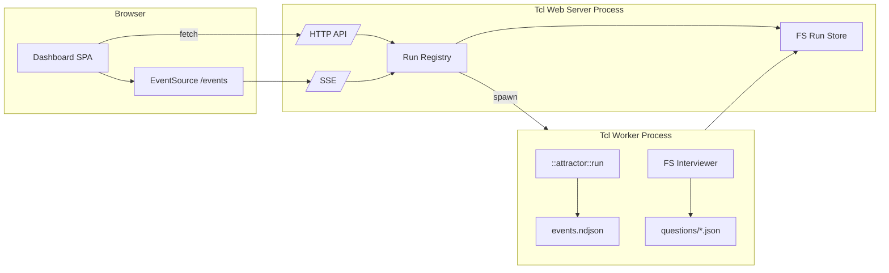
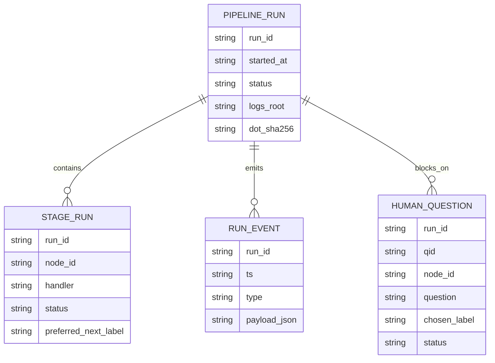
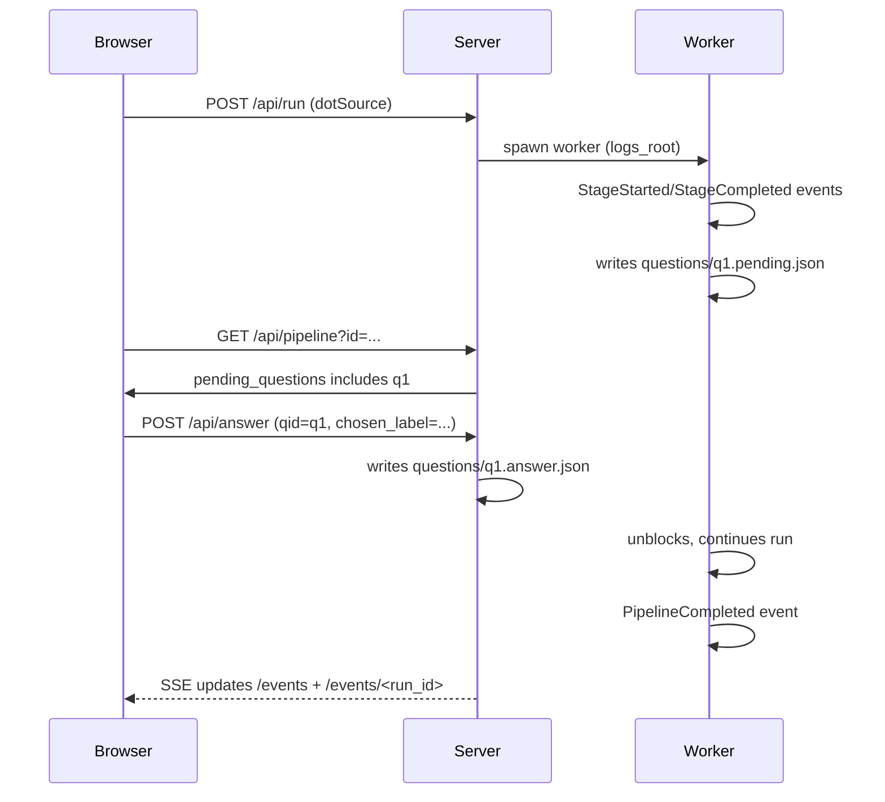
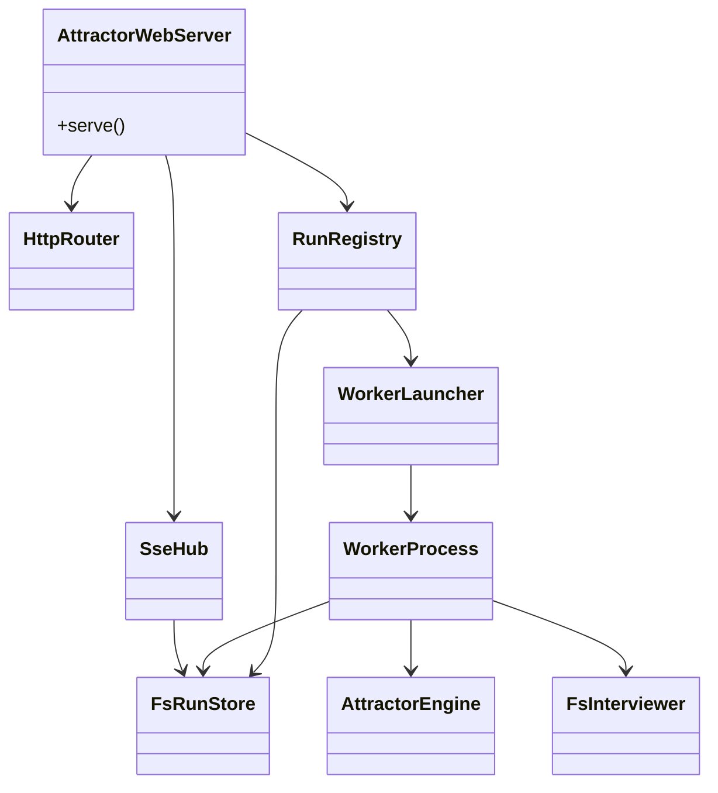
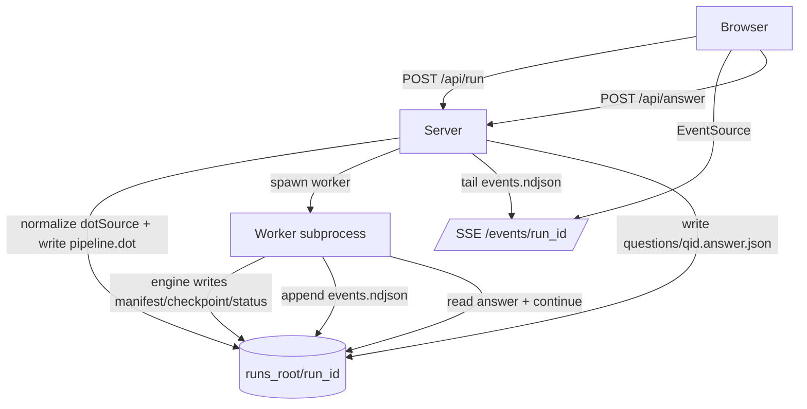
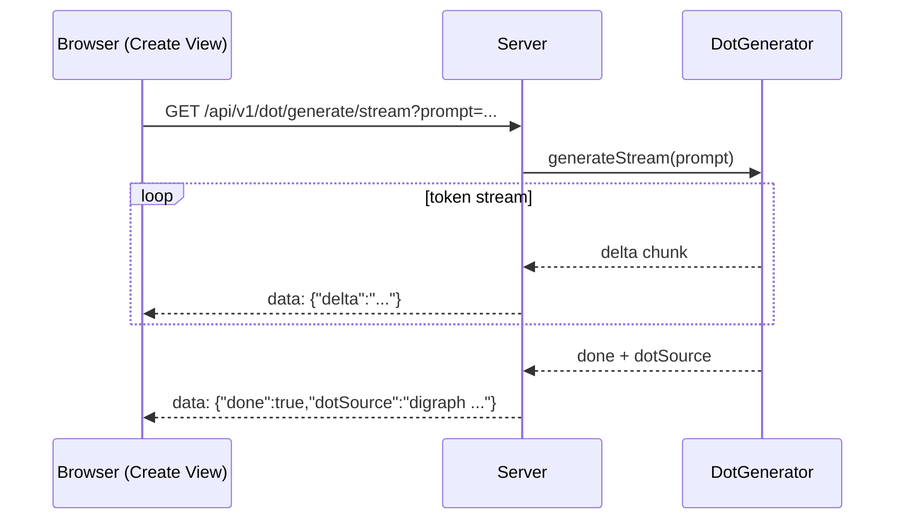

Legend: [ ] Incomplete, [X] Complete

_Evidence for every completed checklist item must include the exact verification command (wrapped with `backticks`) plus its exit code and artifacts (logs, screenshots, `.scratch` transcripts) directly beneath the item when the work is performed._

# Sprint #008 - Web UI Dashboard (Corey's Attractor-Inspired)

## Objective
Deliver a local-first web dashboard for `attractor-tcl` (inspired by `../../.scratch/coreys-attractor/`) that can:
- start pipeline runs from DOT source
- show live run status + per-stage artifacts
- stream run events via SSE
- operate `wait.human` gates via web controls

## Context & Problem
This repo currently ships a headless pipeline engine + CLI (`bin/attractor`) that writes run artifacts to a `logs_root` directory. It is usable, but workflow ergonomics are poor:
- No web/TUI exists to observe runs in real time.
- Human gates are not operable via web, despite the spec explicitly calling for web operability and event streaming (Attractor spec Sections 9.5-9.6).
- Debugging stage-by-stage output requires manually browsing the filesystem under `logs_root/`.

`../../.scratch/coreys-attractor/` demonstrates an effective, dependency-light dashboard pattern for Attractor: single-page HTML with SSE-driven updates, a small JSON API surface, and an artifact browser. This sprint ports the *shape* of that UI to Tcl while preserving Tcl 8.5 compatibility and deterministic offline testing.

## Approach (Plan Recap)
- Add **event emission hooks** to the existing engine (`::attractor::run`) so both CLI and worker can generate consistent lifecycle events without duplicating logic.
- Implement a **web server mode** that stays responsive by running pipelines in a **worker subprocess**, persisting state to the filesystem (no DB).
- Provide **SSE** as the primary realtime channel:
  - global snapshots for quick convergence
  - per-run streams sourced from an append-only NDJSON log
- Make `wait.human` web-operable by introducing a **filesystem-backed interviewer**:
  - worker writes `questions/*.pending.json`
  - server writes `questions/*.answer.json`
  - worker unblocks and continues execution
- Keep the UI **single-page and dependency-light**, modeled after Corey’s dashboard layout, with a minimal API surface.

## Golden Sample Review (SPRINT-047)
This plan borrows process strengths from `/Users/jay.taylor/src/ai-digital-twin2/docs/sprints/SPRINT-047-google-oauth.md`.

### What Is Strong (and Why It Works)
- **Objective is concrete and compatibility-oriented**: it defines a drop-in protocol surface and measures success by real client behavior.
- **Grounded "Current State Snapshot"**: it prevents planning against imaginary code, and makes reviewable claims with file/commit anchors.
- **Track-based sequencing with explicit prerequisites**: reduces thrash by landing foundations before UI/hardening layers.
- **Checklist items include positive + negative verification**: prevents false-green outcomes where only happy paths are tested.
- **Evidence discipline is operationalized**: every checklist item requires exact commands + artifact paths, making later audit/replay possible.
- **Acceptance is expressed as executable commands**: improves repeatability in CI and on developer machines.
- **API definitions are explicit**: parameter tables, sample requests/responses, and canonical error payloads reduce ambiguity.
- **UI work is still verifiable**: manual walkthroughs are treated as evidence artifacts, not hand-waved.
- **Execution guardrails are written down**: keeps the team from unintentionally breaking contracts while iterating quickly.

### What Can Be Improved
- **Length growth**: repeated verification blocks can bury architecture and key decisions.
- **Navigation and duplication**: multiple places restate similar requirements; needs a single canonical "API contract" section.
- **Some items intermix design and execution**: separating "design contracts" from "implementation steps" makes it easier to review.

### Enhancements Applied Here
- One explicit API contract section (paths, request/response payloads, event shapes).
- One explicit filesystem/run layout contract (so UI, worker, and tests share the same truth).
- A minimal set of diagrams, each mapped to concrete modules/files.
- A non-regression boundary plus explicit error/security guardrails for localhost web mode.

## Current State Snapshot (2026-03-03)

### Verified Existing Surfaces (Tcl)
- CLI: `bin/attractor` supports `run` and `validate`.
- Engine: `::attractor::run` is synchronous and writes:
  - `manifest.json` and `checkpoint.json` at run root
  - per-node `status.json`, plus `prompt.md`/`response.md` when present
- Human gates: `wait.human` uses an injected interviewer callback and is currently satisfied by:
  - `::attractor::interviewer::autoapprove` (default)
  - `::attractor::interviewer::console` (stdin)
- There is no HTTP server mode and no SSE event stream in this implementation.

### UI Reference (Corey's Attractor)
`../../.scratch/coreys-attractor/` provides a baseline UI pattern we will emulate:
- `GET /` serves a single-page dashboard.
- `GET /api/pipelines` returns a JSON snapshot.
- `POST /api/run` starts a run.
- `POST /api/render` renders DOT to SVG (Graphviz).
- `GET /events` is SSE with an initial snapshot and subsequent updates.

### Canonical Agentic Loop References (Corey's Attractor)
This sprint is a web UI deliverable, but Attractor's value comes from its **agentic execution loops**. The implementation must reference the canonical loops in Corey’s Attractor so we do not accidentally "simplify away" core semantics while building the dashboard.

Relative paths below are from this sprint doc (`docs/sprints/`):
- Engine core execution loop + loop-restart semantics:
  - `../../.scratch/coreys-attractor/src/main/kotlin/attractor/engine/Engine.kt`
- Tool execution loop (LLM tool calls within a single generation):
  - `../../.scratch/coreys-attractor/src/main/kotlin/attractor/llm/Client.kt`
- Supervisor loop handler (`stack.manager_loop`) + child DOT launch (`stack.child_dotfile`):
  - `../../.scratch/coreys-attractor/src/main/kotlin/attractor/handlers/ManagerLoopHandler.kt`
- DOT generation/iteration/fix primitives + code-fence stripping (`extractDotSource`):
  - `../../.scratch/coreys-attractor/src/main/kotlin/attractor/web/DotGenerator.kt`
- Web UI "dotfile" UX patterns (upload existing `.dot`, streamed DOT generation, streamed DOT description):
  - `../../.scratch/coreys-attractor/src/main/kotlin/attractor/web/WebMonitorServer.kt`
- REST docs for DOT generation/iteration streams (event format expectations):
  - `../../.scratch/coreys-attractor/docs/api/rest-v1.md`
- REST implementation for DOT generation/iteration endpoints (how it actually streams + error-shapes):
  - `../../.scratch/coreys-attractor/src/main/kotlin/attractor/web/RestApiRouter.kt`
- CLI implementation of DOT generation/iteration commands (how clients consume the stream format):
  - `../../.scratch/coreys-attractor/src/main/kotlin/attractor/cli/commands/DotCommands.kt`
- Canonical tests for DOT and REST behavior (good negative cases to mirror):
  - `../../.scratch/coreys-attractor/src/test/kotlin/attractor/cli/commands/DotCommandsTest.kt`
  - `../../.scratch/coreys-attractor/src/test/kotlin/attractor/web/RestApiRouterTest.kt`

Critical carry-over requirement for this sprint (dotfile expansion/generation compatibility):
- `POST /api/run` must accept DOT source pasted from agentic systems (often wrapped in markdown fences) by stripping fences before validation/execute, matching the intent of `extractDotSource()` in `DotGenerator`.

Reference-only (not implemented in Sprint 008, but essential context for correct future work):
- Corey’s DOT generation/iteration streams use a simple SSE JSON envelope (`delta` chunks, then a final `done` with a complete `dotSource`, or an `error` event).
  - Canonical docs: `../../.scratch/coreys-attractor/docs/api/rest-v1.md` (DOT generate/fix/iterate streaming endpoints).
  - Canonical browser implementation: `../../.scratch/coreys-attractor/src/main/kotlin/attractor/web/WebMonitorServer.kt` (`generateDot()` / DOT upload handlers).

## Scope
In scope (Sprint #008):
- Local HTTP server mode (`serve`) with a single-page UI.
- Minimal REST-ish API for starting runs and inspecting run state.
- SSE streaming:
  - global snapshot updates (pipelines list)
  - per-run event stream (stage lifecycle + human gate events)
- Human gate operation via UI: list pending questions and submit answers.
- Filesystem-based persistence for run artifacts (no DB).
- Deterministic automated tests for server/API/SSE + human-gate flow.

Out of scope (explicitly not in Sprint #008):
- Natural-language DOT generation/iteration (Corey’s `/api/generate*` family).
- Authentication/multi-user security model (assume localhost developer use).
- A full REST API v1 surface (we keep endpoints minimal and versionless for now).
- Non-local deployment hardening (TLS, reverse proxies, etc).

## Success Criteria
- `make test` remains deterministic/offline and passes.
- `bin/attractor serve --web-port 7070` starts a dashboard that can:
  - run `examples/human-gate.dot` and accept a choice in the browser
  - display per-stage `status.json`, `prompt.md`, `response.md` content
  - stream events in real time over SSE
- DOT source compatibility: a run can be started from DOT pasted with markdown code fences (fences are stripped before validate/execute).
- Human-gate web operability requirement is satisfied *by implementation + tests* (not only by traceability mapping).

## Non-Regression Boundary
- Keep existing CLI subcommands stable: `bin/attractor run|validate` must continue to work as-is.
- Keep existing artifact contracts stable for existing tests:
  - `checkpoint.json` and per-node `status.json` must still be written.
  - `prompt.md`/`response.md` remain optional and only written when present in outcomes.
- Any new event emission must be additive and a no-op unless explicitly enabled (ex: `-on_event`).

## Design Overview

### High-Level Architecture
- **Web server process** (new): owns HTTP/SSE endpoints and spawns worker subprocesses.
- **Worker process** (new): runs a single pipeline execution, writing artifacts + events under `logs_root/`.
- **Filesystem run store** (new): `runs_root/` contains run directories; server can rehydrate state on restart by scanning.

Key design constraint: keep Tcl 8.5 compatibility, so no coroutines, no async/await. Concurrency is achieved via OS subprocess workers.

### Implementation Map (Design-to-File)
- Engine event hooks:
  - [lib/attractor/main.tcl](/Users/jay.taylor/src/attractor-tcl/lib/attractor/main.tcl)
- Web server:
  - new `attractor_web` package under `lib/attractor_web/` (HTTP router, SSE, run registry)
  - expose via `bin/attractor serve` (or a thin `bin/attractor_web` wrapper)
- Worker:
  - `bin/attractor-worker` (single-run runner; file interviewer + event sink)
- Tests:
  - new integration tests under `tests/integration/` for HTTP API + SSE + human-gate flow
  - new e2e tests under `tests/e2e/` for end-to-end web mode
  - ensure all tests are runnable via `tclsh tests/all.tcl`

## Planning Validation Snapshot (2026-03-04)
- [X] Mermaid diagrams in this plan were syntax-validated with `mmdc` and rendered to `.scratch/diagram-renders/sprint-008/`.
```text
Verification commands:
- `tools/verify_cmd.sh .scratch/verification/SPRINT-008/planning/mmdc-architecture.log mmdc -i .scratch/diagrams/sprint-008/architecture.mmd -o .scratch/diagram-renders/sprint-008/architecture.svg` (exit code 0)
- `tools/verify_cmd.sh .scratch/verification/SPRINT-008/planning/mmdc-domain-model.log mmdc -i .scratch/diagrams/sprint-008/domain-model.mmd -o .scratch/diagram-renders/sprint-008/domain-model.svg` (exit code 0)
- `tools/verify_cmd.sh .scratch/verification/SPRINT-008/planning/mmdc-human-gate-flow.log mmdc -i .scratch/diagrams/sprint-008/human-gate-flow.mmd -o .scratch/diagram-renders/sprint-008/human-gate-flow.svg` (exit code 0)
- `tools/verify_cmd.sh .scratch/verification/SPRINT-008/planning/mmdc-core-domain-model.log mmdc -i .scratch/diagrams/sprint-008/core-domain-model.mmd -o .scratch/diagram-renders/sprint-008/core-domain-model.svg` (exit code 0)
- `tools/verify_cmd.sh .scratch/verification/SPRINT-008/planning/mmdc-data-flow.log mmdc -i .scratch/diagrams/sprint-008/data-flow.mmd -o .scratch/diagram-renders/sprint-008/data-flow.svg` (exit code 0)
- `tools/verify_cmd.sh .scratch/verification/SPRINT-008/planning/mmdc-dotfile-generation-flow.log mmdc -i .scratch/diagrams/sprint-008/dotfile-generation-flow.mmd -o .scratch/diagram-renders/sprint-008/dotfile-generation-flow.svg` (exit code 0)

Evidence artifacts:
- `.scratch/verification/SPRINT-008/planning/mmdc-architecture.log`
- `.scratch/verification/SPRINT-008/planning/mmdc-core-domain-model.log`
- `.scratch/verification/SPRINT-008/planning/mmdc-data-flow.log`
- `.scratch/verification/SPRINT-008/planning/mmdc-domain-model.log`
- `.scratch/verification/SPRINT-008/planning/mmdc-dotfile-generation-flow.log`
- `.scratch/verification/SPRINT-008/planning/mmdc-human-gate-flow.log`
- `.scratch/diagram-renders/sprint-008/architecture.svg`
- `.scratch/diagram-renders/sprint-008/core-domain-model.svg`
- `.scratch/diagram-renders/sprint-008/data-flow.svg`
- `.scratch/diagram-renders/sprint-008/domain-model.svg`
- `.scratch/diagram-renders/sprint-008/dotfile-generation-flow.svg`
- `.scratch/diagram-renders/sprint-008/human-gate-flow.svg`
```

### Run Directory Layout (Contract)
Each run lives in a directory `${runs_root}/${run_id}/`:
- In web mode, the worker sets `logs_root == ${runs_root}/${run_id}` so the existing engine artifact writer is reused unchanged.
- Identifier formats:
  - `run_id`: `run-<epoch_ms>-<seq>` (server-generated; filesystem-safe)
  - `qid`: `q-<seq>` (worker-generated; unique per run)
- `pipeline.dot` (original DOT source submitted)
- `web.json` (server-owned metadata; includes `run_id`, `file_name`, `created_at`, `dot_sha256`, `worker_pid`)
- `manifest.json` (engine-owned; currently includes `graph_id`, `started_at`)
- `checkpoint.json` (engine checkpoint)
- `events.ndjson` (append-only JSON lines; see Event Contract below)
- `questions/`
  - `${qid}.pending.json` (written by worker when waiting for human)
  - `${qid}.answer.json` (written by server when user answers)
- `${node_id}/`
  - `status.json`
  - `prompt.md` (optional)
  - `response.md` (optional)
- `artifacts/` (reserved for future handler outputs; already created by engine)

## API Contract (v0)
All endpoints are local-first; CORS is optional but allowed for developer convenience.

### HTTP
- `GET /` -> `text/html` dashboard (static HTML + inline JS/CSS).
- `GET /api/pipelines` -> JSON list snapshot:
  - fields: `id`, `started_at`, `status`, `current_node`, `completed_nodes_count`, `logs_root`
- `POST /api/run` -> start a run:
  - request JSON: `{ "dotSource": "...", "fileName": "optional.dot" }`
  - `dotSource` normalization requirement:
    - Accept either raw DOT or DOT wrapped in markdown code fences (common output from DOT-generation agentic loops).
    - Strip markdown fences before validation/execute (reference: `../../.scratch/coreys-attractor/src/main/kotlin/attractor/web/DotGenerator.kt` `extractDotSource()`).
  - response JSON: `{ "id": "run-..." }`
- `GET /api/pipeline?id=<run_id>` -> hydrated view for one run:
  - response JSON: `{ "id", "dotSource", "web", "manifest", "checkpoint", "nodes": {...}, "pending_questions": [...] }`
- `GET /api/stage?id=<run_id>&node=<node_id>` -> per-node artifact payload:
  - response JSON: `{ "status": {...}, "prompt_md": "...", "response_md": "..." }`
- `POST /api/answer` -> submit human answer:
  - request JSON: `{ "id": "<run_id>", "qid": "<qid>", "chosen_label": "<label>" }`
  - response JSON: `{ "ok": true }`
- `POST /api/render` -> render DOT to SVG (requires Graphviz `dot`):
  - request JSON: `{ "dotSource": "..." }`
  - response JSON: `{ "svg": "<svg...>" }` or `{ "error": "..." }`

### SSE
- `GET /events` -> global snapshot stream.
  - first message is the same JSON body as `GET /api/pipelines`
  - subsequent messages are also full snapshots (simple convergence semantics)
- `GET /events/<run_id>` -> per-run event stream; replays from beginning on connect.

### Status Codes (v0)
- Success:
  - `GET /api/*`: `200`
  - `POST /api/*`: `200` (except a future `201` is acceptable for create-style endpoints)
- Client errors:
  - `400`: malformed JSON, missing required fields, invalid IDs
  - `404`: unknown run/stage/question
  - `413`: request body too large
- Server errors:
  - `500`: worker spawn failures, internal exceptions, unexpected I/O errors

## Error and Security Contract (v0)
- JSON endpoints always reply with `Content-Type: application/json`.
- Error envelope shape:
  - `{ "error": "<human message>", "code": "<stable_code>" }`
  - use HTTP `4xx` for client errors and `5xx` for server/worker failures.
  - stable codes (initial set): `INVALID_JSON`, `BODY_TOO_LARGE`, `INVALID_ID`, `INVALID_FILE_NAME`, `INVALID_DOT_SOURCE`, `NOT_FOUND`, `DOT_BINARY_MISSING`, `DOT_RENDER_FAILED`, `WORKER_SPAWN_FAILED`, `WORKER_FAILED`.
- Path traversal hardening:
  - `run_id` and `node_id` must match a strict allowlist regex (no `/`, no `..`).
  - server must refuse to read any path that resolves outside `${runs_root}/${run_id}/`.
- Request size limits:
  - cap JSON bodies (ex: `dotSource`) to a reasonable max (ex: 1-2 MiB) to avoid memory/Graphviz abuse.
- Default bind safety:
  - bind `127.0.0.1` by default; require explicit `--bind 0.0.0.0` to expose on LAN.

## Event Contract (NDJSON + SSE payloads)
Worker appends JSON objects (one per line) to `events.ndjson`:
- common fields: `ts`, `run_id`, `type`, `seq`
- types (minimum set for UI):
  - `PipelineStarted`
  - `StageStarted` (`node_id`, `handler`)
  - `StageCompleted` (`node_id`, `status`, `preferred_next_label`)
  - `InterviewStarted` (`qid`, `node_id`, `question`, `choices`)
  - `InterviewCompleted` (`qid`, `chosen_label`)
  - `CheckpointSaved` (`node_id`)
  - `PipelineCompleted` (`status`)

Server streams per-run SSE by tailing `events.ndjson` and emitting `data: <json>\n\n`.

## Evidence + Verification Logging Plan
- Prefer `tools/verify_cmd.sh` for any non-trivial verification command so logs always capture stdout/stderr plus `exit_code=...`.
- Store evidence under stable directories:
  - planning: `.scratch/verification/SPRINT-008/planning/`
  - track-0: `.scratch/verification/SPRINT-008/track-0/`
  - track-a: `.scratch/verification/SPRINT-008/track-a/`
  - track-b: `.scratch/verification/SPRINT-008/track-b/`
  - track-c: `.scratch/verification/SPRINT-008/track-c/`
  - track-d: `.scratch/verification/SPRINT-008/track-d/`
  - final: `.scratch/verification/SPRINT-008/final/`
- UI screenshots/manual walkthrough evidence (when needed):
  - `.scratch/verification/SPRINT-008/track-c/ui/`
- Diagram renders:
  - `.scratch/diagram-renders/sprint-008/`

## Execution Guardrails
- Keep `bin/attractor run|validate` behavior stable; web mode is additive.
- Bind `127.0.0.1` by default; only expose on LAN with an explicit flag.
- Treat DOT and all request bodies as untrusted input:
  - never `eval` user-supplied content
  - cap request sizes and reject invalid JSON early
- Web server must not block on pipeline execution; pipelines run in worker subprocesses.
- Tests must remain deterministic/offline; no live network calls.

## Acceptance Criteria (Sprint #008)
- `bin/attractor serve --bind 127.0.0.1 --web-port 7070` starts and serves the dashboard at `GET /`.
- A run can be started via `POST /api/run` and its state can be observed via:
  - `GET /api/pipelines` (summary)
  - `GET /api/pipeline?id=...` (hydrated)
  - `GET /api/stage?id=...&node=...` (artifacts)
- DOT compatibility:
  - `POST /api/run` accepts DOT wrapped in markdown code fences (fences are stripped).
  - `POST /api/render` accepts DOT wrapped in markdown code fences (fences are stripped).
- `wait.human` is web-operable:
  - server surfaces pending questions
  - user answers via `POST /api/answer`
  - worker unblocks and completes the run
- SSE works:
  - `GET /events` streams global snapshot updates
  - `GET /events/<run_id>` streams per-run events
- Regression gates:
  - `make build`
  - `make test`

## Execution Order
Track 0 -> Track A -> Track B -> Track C -> Track D -> Final.

## Track 0 - Baseline, ADR, and Contracts
- [ ] **T0.1 - Add ADR for web dashboard architecture**
  ```text
  {placeholder for verification justification/reasoning and evidence log}
  ```
  - Decision: worker subprocess model + filesystem run store + SSE.
  - Files: `docs/ADR.md`
  - Verification:
    - `make build`
    - `make test`

- [ ] **T0.2 - Add/adjust spec traceability mappings for web+events**
  ```text
  {placeholder for verification justification/reasoning and evidence log}
  ```
  - Fix mapping accuracy for `ATR-REQ-HUMAN-GATES-MUST-OPERABLE-VIA-WEB` and event streaming requirements to include the new web server + tests.
  - Files: `docs/spec-coverage/traceability.md`
  - Verification:
    - `tclsh tools/spec_coverage.tcl`

### Acceptance Criteria (Track 0)
- `docs/ADR.md` includes an ADR entry for Sprint 008 describing the web/worker/filesystem/SSE architecture decision and its consequences.
- `tclsh tools/spec_coverage.tcl` passes and traceability references the new web server + tests for the human-gate web-operability requirement.

## Track A - Engine Hooks + Worker
- [ ] **A0 - Enforce filesystem-safe node IDs (spec parity)**
  ```text
  {placeholder for verification justification/reasoning and evidence log}
  ```
  - Why: the engine uses `node_id` as a filesystem directory name (`${logs_root}/${node_id}/...`), so node IDs must be safe and must match the spec’s bare-identifier constraint.
  - Implementation:
    - Extend `::attractor::validate` to reject node IDs not matching `[A-Za-z_][A-Za-z0-9_]*`.
    - Add a negative fixture DOT with an invalid node ID and ensure `bin/attractor validate` fails with `validation_failed`.
  - Tests:
    - Positive: all `examples/*.dot` still validate.
    - Negative: invalid node IDs are rejected (ex: contains `-`, `/`, or `..`).
  - Verification:
    - `tclsh tests/all.tcl -match *attractor*`

- [ ] **A1 - Add event emission hooks to `::attractor::run`**
  ```text
  {placeholder for verification justification/reasoning and evidence log}
  ```
  - Implementation:
    - Add a new optional `-on_event` callback option.
    - Emit ordered events with a monotonic `seq` counter and required fields for the event type.
    - Ensure this is a no-op when `-on_event` is unset.
  - Tests:
    - Positive: event stream includes `PipelineStarted`, per-stage start/end, checkpoint saves, and a terminal `PipelineCompleted`.
    - Negative: event emission must not change existing run artifacts or CLI outputs.
  - Verification:
    - `tclsh tests/all.tcl -match *attractor*`

- [ ] **A2 - Add filesystem-backed interviewer for `wait.human`**
  ```text
  {placeholder for verification justification/reasoning and evidence log}
  ```
  - Implementation:
    - Implement an interviewer that writes `questions/<qid>.pending.json` and blocks (poll/sleep) until `questions/<qid>.answer.json` appears.
    - Include a configurable max-wait duration and deterministic failure mode when the wait limit is exceeded.
  - Tests:
    - Positive: a `wait.human` gate can be answered and the pipeline continues.
    - Negative: exceeding the wait limit produces a deterministic failure reason and leaves evidence in `questions/`.
  - Verification:
    - `tclsh tests/all.tcl -match *attractor*`

- [ ] **A3 - Introduce worker entrypoint**
  ```text
  {placeholder for verification justification/reasoning and evidence log}
  ```
  - Implementation: new script `bin/attractor-worker` that:
    - accepts `--logs-root` (which is the run dir in web mode)
    - writes `pipeline.dot` + `web.json`
    - runs the pipeline (engine still writes `manifest.json` + `checkpoint.json`)
    - appends `events.ndjson` via `-on_event`
  - Tests:
    - Positive: worker exits 0 on success and produces the full artifact set.
    - Negative: invalid DOT produces a non-zero exit and a server-readable error artifact.
  - Verification:
    - `tclsh tests/all.tcl -match *worker*`

### Acceptance Criteria (Track A)
- `bin/attractor validate` rejects invalid node IDs (no partial filesystem writes) and continues to accept all `examples/*.dot`.
- A worker run produces a complete run directory layout (including `pipeline.dot`, `web.json`, engine artifacts, and `events.ndjson`), and emits an ordered event stream with a terminal event.
- `wait.human` gates can be satisfied via `questions/*.answer.json`; exceeding the wait limit fails deterministically with on-disk evidence.

## Track B - Web Server + API + SSE
- [ ] **B0 - Add CLI `serve` subcommand**
  ```text
  {placeholder for verification justification/reasoning and evidence log}
  ```
  - Implement `bin/attractor serve` with flags:
    - `--web-port <n>` (default `7070`)
    - `--runs-root <path>` (default `.scratch/runs/attractor-web/`)
    - `--bind <ip>` (default `127.0.0.1`)
  - Tests:
    - Positive: server starts and responds to `GET /api/pipelines` with JSON.
    - Negative: invalid `--web-port` fails fast with usage text.
  - Verification:
    - `tclsh tests/all.tcl -match *attractor-web*`

- [ ] **B1 - Minimal HTTP server and router**
  ```text
  {placeholder for verification justification/reasoning and evidence log}
  ```
  - Implement `socket -server` HTTP listener with:
    - request parsing (method/path/query/headers/body)
    - JSON helpers + error envelopes
    - request size limits and strict ID allowlists (per security contract)
  - Files: `lib/attractor_web/*.tcl`, `pkgIndex.tcl`
  - Tests:
    - Positive: parse GET + POST with JSON body.
    - Negative: reject malformed HTTP, invalid JSON, and oversize bodies.
  - Verification:
    - `tclsh tests/all.tcl -match *attractor-web*`

- [ ] **B2 - Run registry + subprocess management**
  ```text
  {placeholder for verification justification/reasoning and evidence log}
  ```
  - Start worker subprocesses, capture PID, and mark running/terminal states.
  - Provide cancellation by PID kill (best-effort).
  - Rehydrate prior runs by scanning `runs_root/` on server start.
  - Tests:
    - Positive: spawn worker, observe status transition `running -> success|failed`.
    - Negative: missing run dir produces `not_found` errors (not crashes).
  - Verification:
    - `tclsh tests/all.tcl -match *attractor-web*`

- [ ] **B3 - Implement API endpoints (runs + artifacts + human answers)**
  ```text
  {placeholder for verification justification/reasoning and evidence log}
  ```
  - Implement:
    - `GET /api/pipelines`
    - `POST /api/run`
    - `GET /api/pipeline?id=...`
    - `GET /api/stage?id=...&node=...`
    - `POST /api/answer`
  - DOT compatibility requirements (Corey parity references):
    - Strip markdown fences from `dotSource` (reference: `../../.scratch/coreys-attractor/src/main/kotlin/attractor/web/DotGenerator.kt` `extractDotSource()`).
    - If `fileName` is provided, reject path-like values (must not contain `/`, `\\`, or `..`), and persist it into `web.json.file_name` for UI display (reference UX patterns: `../../.scratch/coreys-attractor/src/main/kotlin/attractor/web/WebMonitorServer.kt` `onDotFileSelected()`).
  - Tests:
    - Positive: start a run and fetch hydrated state + per-node artifacts.
    - Positive: `POST /api/run` accepts DOT wrapped in markdown fences and runs successfully.
    - Negative: invalid `run_id`/`node_id` rejected; `node_id` not in run returns `not_found`.
    - Negative: `POST /api/run` rejects `fileName` containing `/`, `\\`, or `..` with error code `INVALID_FILE_NAME`.
    - Negative: `POST /api/run` rejects `dotSource` that becomes empty after fence-stripping with error code `INVALID_DOT_SOURCE`.
  - Verification:
    - `tclsh tests/all.tcl -match *attractor-web*`

- [ ] **B4 - DOT render endpoint**
  ```text
  {placeholder for verification justification/reasoning and evidence log}
  ```
  - Implement `POST /api/render` using Graphviz `dot` if present:
    - success returns `{ "svg": "<svg...>" }`
    - failure returns `{ "error": "...", "code": "DOT_RENDER_FAILED" }`
  - DOT compatibility requirements:
    - Accept DOT wrapped in markdown fences (same normalization behavior as `POST /api/run`).
  - Tests:
    - Positive: render a known-good DOT into SVG.
    - Positive: render a markdown-fenced DOT into SVG (fences are stripped).
    - Negative: missing `dot` binary returns a deterministic error code.
    - Negative: `POST /api/render` rejects `dotSource` that becomes empty after fence-stripping with error code `INVALID_DOT_SOURCE`.
  - Verification:
    - `tclsh tests/all.tcl -match *attractor-web*`

- [ ] **B5 - SSE endpoints**
  ```text
  {placeholder for verification justification/reasoning and evidence log}
  ```
  - `/events`: broadcast full snapshots on changes + heartbeat comments.
  - `/events/<run_id>`: tail `events.ndjson` safely.
  - Tests:
    - Positive: SSE streams at least one snapshot + one update.
    - Negative: client disconnect does not leak server resources.
  - Verification:
    - `tclsh tests/all.tcl -match *sse*`

### Acceptance Criteria (Track B)
- `bin/attractor serve` starts a local-only HTTP server and stays responsive while worker subprocesses run.
- All v0 endpoints meet the contract (including error envelope shape and stable error codes) and persist run metadata to the filesystem.
- DOT source normalization works for both `POST /api/run` and `POST /api/render` (markdown fences are accepted and stripped).
- SSE streams are stable under connect/disconnect and do not leak resources.

## Track C - Dashboard UI (No Build Step)
- [ ] **C1 - Port the dashboard structure (Corey-inspired)**
  ```text
  {placeholder for verification justification/reasoning and evidence log}
  ```
  - Single HTML page with:
    - pipeline list (left)
    - details view (right): graph SVG, stage list, stage prompt/response viewer
    - live connection indicator (SSE online/offline)
    - run form: paste DOT or upload `.dot`, then `Run` (calls `POST /api/run`)
      - when uploading a `.dot`, preserve the file name and pass it as `fileName` (see Corey reference: `../../.scratch/coreys-attractor/src/main/kotlin/attractor/web/WebMonitorServer.kt` `onDotFileSelected()`)
    - artifact browser: fetch per-stage artifacts via `GET /api/stage`
  - Files: embedded HTML in Tcl server or `lib/attractor_web/assets/dashboard.html` (served as static).
  - Evidence (manual UI when needed):
    - `.scratch/verification/SPRINT-008/track-c/ui/`
  - Verification:
    - `tclsh tests/all.tcl -match *attractor-web-ui*`

- [ ] **C2 - Human gate UI**
  ```text
  {placeholder for verification justification/reasoning and evidence log}
  ```
  - When `pending_questions` present for a run:
    - show modal with question + choice buttons
    - call `POST /api/answer`
  - Tests:
    - Positive: a run blocked on `wait.human` becomes unblocked after `POST /api/answer`.
    - Negative: invalid `qid` returns a deterministic `not_found` error.
  - Verification:
    - `tclsh tests/all.tcl -match *human-gate*`

### Acceptance Criteria (Track C)
- UI can start a run from pasted DOT or an uploaded `.dot` (file name preserved and visible in UI metadata).
- UI can render the pipeline graph via `/api/render` and browse per-stage artifacts.
- UI can complete a `wait.human` flow end-to-end.

## Track D - Tests, Docs, and Final Regression Gates
- [ ] **D1 - Integration tests for end-to-end web flow**
  ```text
  {placeholder for verification justification/reasoning and evidence log}
  ```
  - Start server on ephemeral port; run a pipeline with `wait.human`; answer; verify terminal success and artifacts exist.
  - Ensure tests do not require a real browser (HTTP-level e2e is sufficient).
  - Verification:
    - `tclsh tests/all.tcl -match *attractor-web*`

- [ ] **D2 - Security and robustness tests**
  ```text
  {placeholder for verification justification/reasoning and evidence log}
  ```
  - Path traversal rejection for stage/artifact fetch endpoints.
  - SSE client disconnect handling and bounded queues.
  - Worker supervision: worker crash should surface as a terminal `failed` state with a readable error.
  - Verification:
    - `tclsh tests/all.tcl -match *attractor-web*`

- [ ] **D3 - Regression gates**
  ```text
  {placeholder for verification justification/reasoning and evidence log}
  ```
  - Verification:
    - `make build`
    - `make test`
    - `bash tools/docs_lint.sh`

### Acceptance Criteria (Track D)
- Integration tests cover the full web flow (run start, SSE updates, human gate answer) without requiring a browser.
- Security tests prevent path traversal, enforce ID allowlists, and verify SSE resource cleanup.
- `make build`, `make test`, and `bash tools/docs_lint.sh` all pass.

## Final Closeout Checklist
- [ ] All new/updated tests pass locally.
  ```text
  {placeholder for verification justification/reasoning and evidence log}
  ```
- [ ] `tools/spec_coverage.tcl` passes with updated traceability mappings.
  ```text
  {placeholder for verification justification/reasoning and evidence log}
  ```
- [ ] UI can run a human-gate pipeline end-to-end via the browser.
  ```text
  {placeholder for verification justification/reasoning and evidence log}
  ```

## Appendix - Diagrams (Mermaid)

### Architecture (Web + Worker + FS Store)


### Domain Model (Filesystem-Backed)


### Human Gate Flow


### Core Domain Model (Modules)


### Data Flow (Run Submit, Events, Human Answers)


### Dotfile Generation Stream (Corey Reference Only)

