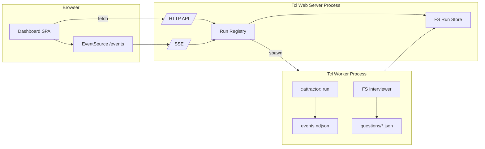
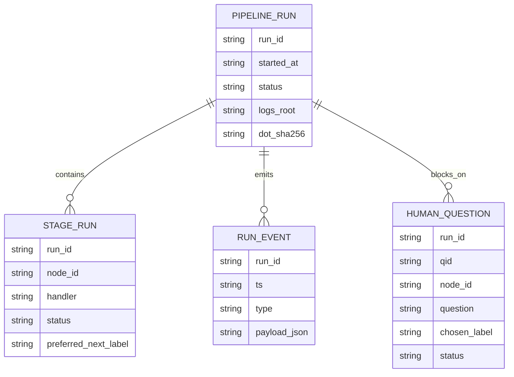
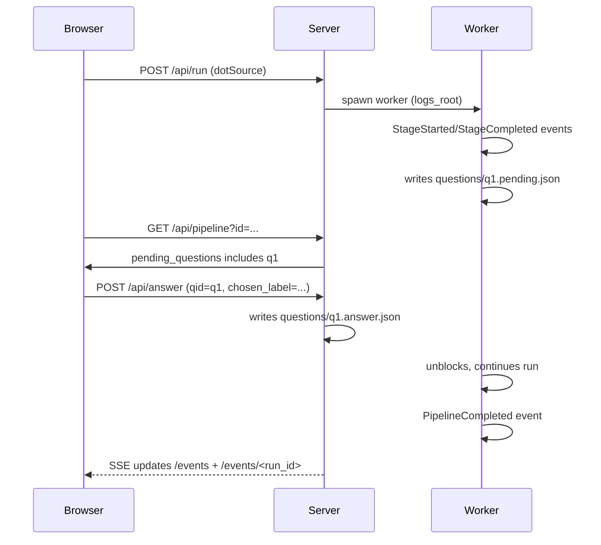

Legend: [ ] Incomplete, [X] Complete

_Evidence for every completed checklist item must include the exact verification command (wrapped with `backticks`) plus its exit code and artifacts (logs, screenshots, `.scratch` transcripts) directly beneath the item when the work is performed._

# Sprint #008 - Web UI Dashboard (Corey's Attractor-Inspired)

## Objective
Deliver a local-first web dashboard for `attractor-tcl` (inspired by `.scratch/coreys-attractor`) that can:
- start pipeline runs from DOT source
- show live run status + per-stage artifacts
- stream run events via SSE
- operate `wait.human` gates via web controls

## Context & Problem
This repo currently ships a headless pipeline engine + CLI (`bin/attractor`) that writes run artifacts to a `logs_root` directory. It is usable, but workflow ergonomics are poor:
- No web/TUI exists to observe runs in real time.
- Human gates are not operable via web, despite the spec explicitly calling for web operability and event streaming (Attractor spec Sections 9.5-9.6).
- Debugging stage-by-stage output requires manually browsing the filesystem under `logs_root/`.

`.scratch/coreys-attractor` demonstrates an effective, dependency-light dashboard pattern for Attractor: single-page HTML with SSE-driven updates, a small JSON API surface, and an artifact browser. This sprint ports the *shape* of that UI to Tcl while preserving Tcl 8.5 compatibility and deterministic offline testing.

## Golden Sample Review (SPRINT-047)
This plan borrows process strengths from `~/.codex/skills/sprintplan/SPRINT-047-google-oauth.md`.

### What Is Strong (and Why It Works)
- **Objective is concrete and compatibility-oriented**: it defines a drop-in protocol surface and measures success by real client behavior.
- **Grounded "Current State Snapshot"**: it prevents planning against imaginary code, and makes reviewable claims with file/commit anchors.
- **Track-based sequencing with explicit prerequisites**: reduces thrash by landing foundations before UI/hardening layers.
- **Checklist items include positive + negative verification**: prevents false-green outcomes where only happy paths are tested.
- **Evidence discipline is operationalized**: every checklist item requires exact commands + artifact paths, making later audit/replay possible.
- **Acceptance is expressed as executable commands**: improves repeatability in CI and on developer machines.

### What Can Be Improved
- **Length growth**: repeated verification blocks can bury architecture and key decisions.
- **Navigation and duplication**: multiple places restate similar requirements; needs a single canonical "API contract" section.
- **Some items intermix design and execution**: separating "design contracts" from "implementation steps" makes it easier to review.

### Enhancements Applied Here
- One explicit API contract section (paths, request/response payloads, event shapes).
- One explicit filesystem/run layout contract (so UI, worker, and tests share the same truth).
- A minimal set of diagrams, each mapped to concrete modules/files.

## Current State Snapshot (2026-03-03)

### Verified Existing Surfaces (Tcl)
- CLI: `bin/attractor` supports `run` and `validate`.
- Engine: `::attractor::run` is synchronous and writes:
  - `manifest.json` and `checkpoint.json` at run root
  - per-node `status.json`, plus `prompt.md`/`response.md` when present
- Human gates: `wait.human` uses an injected interviewer callback and is currently satisfied by:
  - `::attractor::interviewer::autoapprove` (default)
  - `::attractor::interviewer::console` (stdin)
- There is no HTTP server mode and no SSE event stream in this implementation.

### UI Reference (Corey's Attractor)
`.scratch/coreys-attractor` provides a baseline UI pattern we will emulate:
- `GET /` serves a single-page dashboard.
- `GET /api/pipelines` returns a JSON snapshot.
- `POST /api/run` starts a run.
- `POST /api/render` renders DOT to SVG (Graphviz).
- `GET /events` is SSE with an initial snapshot and subsequent updates.

## Scope
In scope (Sprint #008):
- Local HTTP server mode (`serve`) with a single-page UI.
- Minimal REST-ish API for starting runs and inspecting run state.
- SSE streaming:
  - global snapshot updates (pipelines list)
  - per-run event stream (stage lifecycle + human gate events)
- Human gate operation via UI: list pending questions and submit answers.
- Filesystem-based persistence for run artifacts (no DB).
- Deterministic automated tests for server/API/SSE + human-gate flow.

Out of scope (explicitly not in Sprint #008):
- Natural-language DOT generation/iteration (Corey’s `/api/generate*` family).
- Authentication/multi-user security model (assume localhost developer use).
- A full REST API v1 surface (we keep endpoints minimal and versionless for now).
- Non-local deployment hardening (TLS, reverse proxies, etc).

## Success Criteria
- `make test` remains deterministic/offline and passes.
- `bin/attractor serve --web-port 7070` starts a dashboard that can:
  - run `examples/human-gate.dot` and accept a choice in the browser
  - display per-stage `status.json`, `prompt.md`, `response.md` content
  - stream events in real time over SSE
- Human-gate web operability requirement is satisfied *by implementation + tests* (not only by traceability mapping).

## Design Overview

### High-Level Architecture
- **Web server process** (new): owns HTTP/SSE endpoints and spawns worker subprocesses.
- **Worker process** (new): runs a single pipeline execution, writing artifacts + events under `logs_root/`.
- **Filesystem run store** (new): `runs_root/` contains run directories; server can rehydrate state on restart by scanning.

Key design constraint: keep Tcl 8.5 compatibility, so no coroutines, no async/await. Concurrency is achieved via OS subprocess workers.

### Run Directory Layout (Contract)
Each run lives in a directory `${runs_root}/${run_id}/`:
- `pipeline.dot` (original DOT source submitted)
- `manifest.json` (run metadata; includes `run_id`, `started_at`, `dot_sha256`)
- `checkpoint.json` (engine checkpoint)
- `events.ndjson` (append-only JSON lines; see Event Contract below)
- `questions/`
  - `${qid}.pending.json` (written by worker when waiting for human)
  - `${qid}.answer.json` (written by server when user answers)
- `${node_id}/`
  - `status.json`
  - `prompt.md` (optional)
  - `response.md` (optional)
- `artifacts/` (reserved for future handler outputs; already created by engine)

## API Contract (v0)
All endpoints are local-first; CORS is optional but allowed for developer convenience.

### HTTP
- `GET /` -> `text/html` dashboard (static HTML + inline JS/CSS).
- `GET /api/pipelines` -> JSON list snapshot:
  - fields: `id`, `started_at`, `status`, `current_node`, `completed_nodes_count`, `logs_root`
- `POST /api/run` -> start a run:
  - request JSON: `{ "dotSource": "...", "fileName": "optional.dot" }`
  - response JSON: `{ "id": "run-..." }`
- `GET /api/pipeline?id=<run_id>` -> hydrated view for one run:
  - response JSON: `{ "id", "dotSource", "manifest", "checkpoint", "nodes": {...}, "pending_questions": [...] }`
- `GET /api/stage?id=<run_id>&node=<node_id>` -> per-node artifact payload:
  - response JSON: `{ "status": {...}, "prompt_md": "...", "response_md": "..." }`
- `POST /api/answer` -> submit human answer:
  - request JSON: `{ "id": "<run_id>", "qid": "<qid>", "chosen_label": "<label>" }`
  - response JSON: `{ "ok": true }`
- `POST /api/render` -> render DOT to SVG (requires Graphviz `dot`):
  - request JSON: `{ "dotSource": "..." }`
  - response JSON: `{ "svg": "<svg...>" }` or `{ "error": "..." }`

### SSE
- `GET /events` -> global snapshot stream.
  - first message is the same JSON body as `GET /api/pipelines`
  - subsequent messages are also full snapshots (simple convergence semantics)
- `GET /events/<run_id>` -> per-run event stream; replays from beginning on connect.

## Event Contract (NDJSON + SSE payloads)
Worker appends JSON objects (one per line) to `events.ndjson`:
- common fields: `ts`, `run_id`, `type`
- types (minimum set for UI):
  - `PipelineStarted`
  - `StageStarted` (`node_id`, `handler`)
  - `StageCompleted` (`node_id`, `status`, `preferred_next_label`)
  - `InterviewStarted` (`qid`, `node_id`, `question`, `choices`)
  - `InterviewCompleted` (`qid`, `chosen_label`)
  - `CheckpointSaved` (`node_id`)
  - `PipelineCompleted` (`status`)

Server streams per-run SSE by tailing `events.ndjson` and emitting `data: <json>\n\n`.

## Execution Order
Track 0 -> Track A -> Track B -> Track C -> Track D -> Final.

## Track 0 - Baseline, ADR, and Contracts
- [ ] **T0.1 - Add ADR for web dashboard architecture**
  - Decision: worker subprocess model + filesystem run store + SSE.
  - Files: `docs/ADR.md`
  - Verification:
    - `timeout 180 make build`
    - `timeout 180 make test`

- [ ] **T0.2 - Add/adjust spec traceability mappings for web+events**
  - Fix mapping accuracy for `ATR-REQ-HUMAN-GATES-MUST-OPERABLE-VIA-WEB` and event streaming requirements to include the new web server + tests.
  - Files: `docs/spec-coverage/traceability.md`
  - Verification:
    - `tclsh tools/spec_coverage.tcl`

## Track A - Engine Hooks + Worker
- [ ] **A1 - Add event emission hooks to `::attractor::run`**
  - Add `-on_event` option and emit stage/pipeline lifecycle events.
  - Ensure this is a no-op when `-on_event` is unset.
  - Files: `lib/attractor/main.tcl`
  - Tests:
    - unit tests for event ordering and required fields.
  - Verification:
    - `tclsh tests/all.tcl -match *attractor*`

- [ ] **A2 - Add filesystem-backed interviewer for `wait.human`**
  - Worker writes `questions/<qid>.pending.json` and blocks (poll/sleep) until `questions/<qid>.answer.json` appears.
  - Include timeout support (configurable).
  - Files: `lib/attractor/main.tcl` (new interviewer), tests.
  - Verification:
    - `tclsh tests/all.tcl -match *attractor*`

- [ ] **A3 - Introduce worker entrypoint**
  - New script `bin/attractor-worker` (or equivalent) that:
    - accepts `--logs-root`, writes `pipeline.dot`, `manifest.json`, runs pipeline
    - appends `events.ndjson` via `-on_event`
  - Verification:
    - `tclsh tests/all.tcl -match *worker*`

## Track B - Web Server + API + SSE
- [ ] **B1 - Minimal HTTP server and router**
  - Implement `socket -server` HTTP listener with:
    - request parsing (method/path/query/headers/body)
    - JSON helpers + error envelopes
  - Files: `lib/attractor_web/*.tcl`, `pkgIndex.tcl`
  - Verification:
    - `tclsh tests/all.tcl -match *attractor-web*`

- [ ] **B2 - Run registry + subprocess management**
  - Start worker subprocesses, capture PID, and mark running/terminal states.
  - Provide cancellation by PID kill (best-effort).
  - Rehydrate prior runs by scanning `runs_root/` on server start.
  - Verification:
    - `tclsh tests/all.tcl -match *attractor-web*`

- [ ] **B3 - SSE endpoints**
  - `/events`: broadcast full snapshots on changes + heartbeat comments.
  - `/events/<run_id>`: tail `events.ndjson` safely.
  - Verification:
    - `tclsh tests/all.tcl -match *sse*`

## Track C - Dashboard UI (No Build Step)
- [ ] **C1 - Port the dashboard structure (Corey-inspired)**
  - Single HTML page with:
    - pipeline list (left)
    - details view (right): graph SVG, stage list, stage prompt/response viewer
    - live connection indicator (SSE online/offline)
  - Files: embedded HTML in Tcl server or `lib/attractor_web/assets/dashboard.html` (served as static).
  - Verification:
    - `tclsh tests/all.tcl -match *attractor-web-ui*`

- [ ] **C2 - Human gate UI**
  - When `pending_questions` present for a run:
    - show modal with question + choice buttons
    - call `POST /api/answer`
  - Verification:
    - `tclsh tests/all.tcl -match *human-gate*`

## Track D - Tests, Docs, and Final Regression Gates
- [ ] **D1 - Integration tests for end-to-end web flow**
  - Start server on ephemeral port; run a pipeline with `wait.human`; answer; verify terminal success and artifacts exist.
  - Verification:
    - `tclsh tests/all.tcl -match *attractor-web*`

- [ ] **D2 - Security and robustness tests**
  - Path traversal rejection for stage/artifact fetch endpoints.
  - SSE client disconnect handling and bounded queues.
  - Verification:
    - `tclsh tests/all.tcl -match *attractor-web*`

- [ ] **D3 - Regression gates**
  - Verification:
    - `timeout 180 make build`
    - `timeout 180 make test`

## Final Closeout Checklist
- [ ] All new/updated tests pass locally.
- [ ] `tools/spec_coverage.tcl` passes with updated traceability mappings.
- [ ] UI can run a human-gate pipeline end-to-end via the browser.

## Appendix - Diagrams (Mermaid)

### Architecture (Web + Worker + FS Store)

### Domain Model (Filesystem-Backed)

### Human Gate Flow

